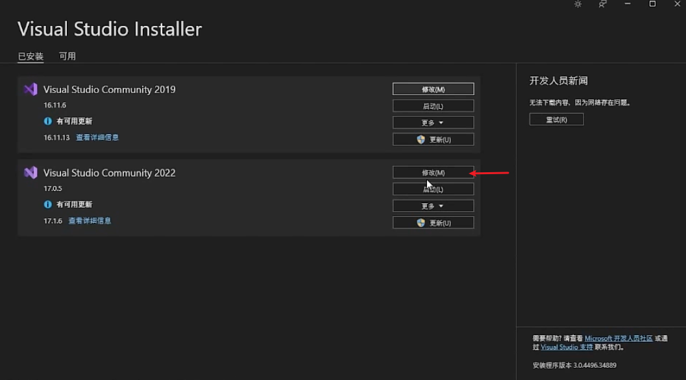
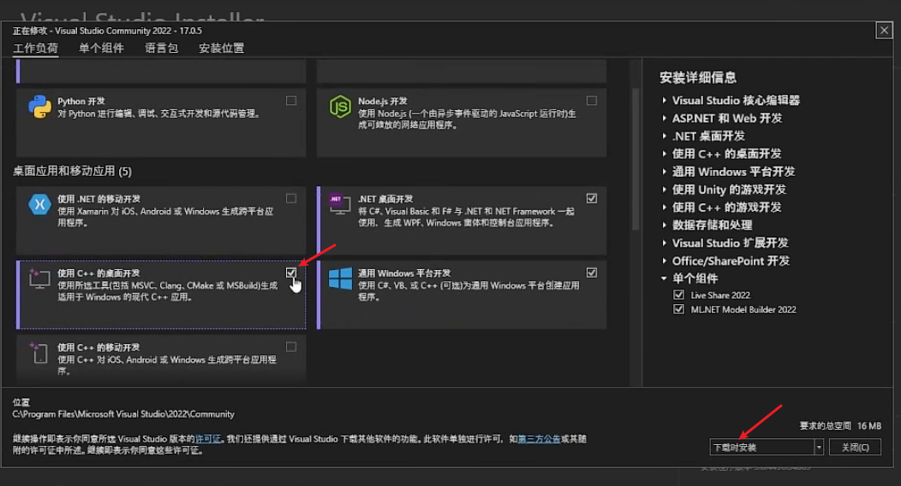
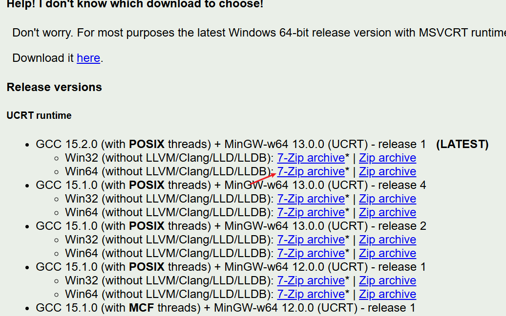
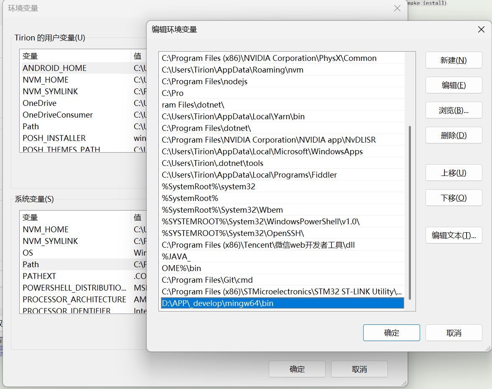
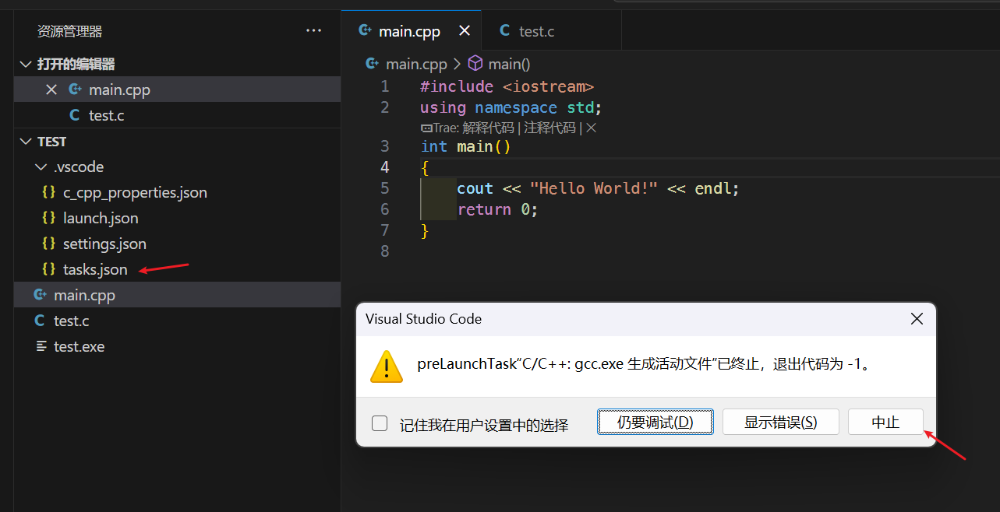

[C++现代实用教程](https://www.bilibili.com/video/BV1S54y1Z7Wc?spm_id_from=333.788.player.switch&vd_source=8220e726dcb3a350fd156cea947bd58b&p=2)
课程代码见目录中的 modern-cpp-main。

# 环境搭建

## MSVC 编译器

MSVC 编译器需要使用 VS，在 VS 中勾选以下选项进行安装。
  


## GCC, Clang(MinGW) 编译器

通过 https://winlibs.com/ 此网址下载。
点击此处下载 GCC：（目前下载的已经是 without Clang 了，所以没有 Clang 编译器）
  
下载后解压到任意目录，然后配置系统环境变量中的 PATH 变量，添加解压后的 bin 目录：
  
然后再命令行中输入：
`gcc --version` 和 `clang --version` 验证是否安装成功。

## vscode 中编译

进入 vscode，安装 C/C++ 插件。此时我们可以正常编译.c 文件了，但是不能编译.cpp。
为了能够编译.cpp 文件，我们需要在 vscode 中配置 tasks.json 文件。
点击 vscode 中的 终端 -> 配置任务 -> 选择 C/C++: gcc.exe 生成活动文件 或 C/C++: clang.exe 生成活动文件 或 点击右上角直接运行编译但是会编译失败也会生成活动文件（活动文件即 tasks.json）。
  
此时会生成一个 tasks.json 文件，关闭弹窗后打开 tasks.json 文件，修改如下：

```json
{
    "tasks": [
        {
            "type": "cppbuild",
            "label": "GCC Compiler", // 建议修改下 label 为 GCC Compiler
            "command": "D:/APP/_develop/mingw64/bin/gcc.exe",
            "args": [
                "-fdiagnostics-color=always",
                "-g",
                "-std=c++20", // 加入这行，指定C++标准为C++20
                "${file}",
                "-o",
                "${fileDirname}\\${fileBasenameNoExtension}.exe",
                "-lstdc++" // 添加此行以链接C++标准库
            ],
            "options": {
                "cwd": "D:/APP/_develop/mingw64/bin"
            },
            "problemMatcher": ["$gcc"],
            "group": {
                "kind": "build",
                "isDefault": true
            },
            "detail": "调试器生成的任务。"
        },
        // 通过配置 clang.exe 活动文件后，会新增 clang 编译器的配置。如果只用 GCC 可以不添加此配置
        // 注：我没安装 clang 编译器，所以无法添加，要修改的地方就按下方注释的修改就行，其它保持自动生成的
        {
            "type": "cppbuild",
            "label": "Clang Compiler", // 修改 label 进行区分
            "command": "D:/APP/_develop/mingw64/bin/clang++.exe", // 这里就是使用的 clang++ 进行编译
            "args": [
                "-fdiagnostics-color=always",
                "-g",
                "-std=c++20", // 加入这行，指定C++标准为C++20
                "${file}",
                "-o",
                "${fileDirname}\\${fileBasenameNoExtension}.exe",
                "-lstdc++" // 添加此行以链接C++标准库
            ],
            "options": {
                "cwd": "D:/APP/_develop/mingw64/bin"
            },
            "problemMatcher": ["$gcc"],
            "group": {
                "kind": "build",
                "isDefault": true
            },
            "detail": "调试器生成的任务。"
        }
    ],
    "version": "2.0.0"
}
```

**原因：**
在 Vscode 中的"tasks.json"文件中，"-lstdc++"是一个编译器选项，用于告知编译器链接标准 C++库。具体来说：
“-l”是一个编译器选项，用于指定要链接的库
“stdc++”是指标准 C++库（Standard C++ Library）的名称
因此，“-lstdc++”选项告诉编译器在链接时要包含标准 C++库，这也就解决了配置 vscode，结果 C 的代码可以运行，但是 C++的不可以运行。

# 语法教程

语法与代码实例结合，所以直接看代码及相关注释。

## 两种打印方式

-   cout
    -   来自 `#include <iostream>`
    -   还有 cin, endl, cerr, clog 等
    -   cout 实际上是调用了成员运算符函数 operator<<
    -   endl 是一个操纵符，并不只是执行了换行的操作，还对输出的缓冲区进行刷新
-   printf
    -   继承自 C 语言

[c1_cout_printf](./modern-cpp-main/c1_cout_printf/main.cpp)

## 变量与常量

=，() 和 {} 三种初始化方式
C++11 新增 {} 初始化方式，推荐使用此方式，可防止窄化转换（比如 double 赋值给 int 会报错）
如果需要使用窄化转换，可以使用 ()，但要加上注释说明
[c2_variable_const](./modern-cpp-main/c2_variable_const/main.cpp)

## 数据类型和 sizeof

sizeof(对象/类型)，返回对象或类型的字节大小。
所有指针类型的大小都是相同的，都是 sizeof(void \*)，一般是 8 字节。
auto 关键字，编译器会根据初始化值的类型自动推导变量的类型。
[c3_datatype_sizeof](./modern-cpp-main/c3_datatype_sizeof/main.cpp)

## 位运算符

[c4_bit](./modern-cpp-main/c4_bit/main.cpp)

## 控制流

-   if else 语句
    [c5_if_else](./modern-cpp-main/c5_if_else/main.cpp)
-   switch 语句
    [c6_switch](./modern-cpp-main/c6_switch/main.cpp)
-   三元运算符
    [c7_ternary_operator](./modern-cpp-main/c7_ternary_operator/main.cpp)

## 循环语句

-   for 循环语句
    [c8_for](./modern-cpp-main/c8_for/main.cpp)
-   while 循环语句
    [c9_while](./modern-cpp-main/c9_while/main.cpp)
-   break 和 continue 语句
    [c10_break_continue](./modern-cpp-main/c10_break_continue/main.cpp)

## 数学运算

math 库
[c11_math](./modern-cpp-main/c11_math/main.cpp)

## 函数

-   阶乘解释形参和实参
    [c12_factorial —— 阶乘解释形参和实参](./modern-cpp-main/c12_factorial/main.cpp)
-   函数的值传递和引用传递
    [c13_change_value —— 函数的值传递和引用传递](./modern-cpp-main/c13_change_value/main.cpp)
-   函数的重载
    [c14_overloading —— 函数的重载](./modern-cpp-main/c14_overloading/main.cpp)
-   函数的递归调用
    [c15_recursion_factorial —— 函数的递归调用](./modern-cpp-main/c15_recursion_factorial/main.cpp)

## lambda 表达式

[c16_lambda](./modern-cpp-main/c16_lambda/main.cpp)

## 指针，堆，栈

创建在堆上的元素都是通过指针/引用来访问。

-   堆，栈上分配内存
    [c17_dynamic_heap —— 堆，栈上分配内存](./modern-cpp-main/c17_dynamic_heap/main.cpp)
-   指针常见错误
    [c18_pointer —— 指针常见错误](./modern-cpp-main/c18_pointer/main.cpp)

## 引用和指针

[c20_pointer_ref](./modern-cpp-main/c20_pointer_ref/main.cpp)

## const, 引用和指针

[c21_const_pointer_ref](./modern-cpp-main/c21_const_pointer_ref/main.cpp)

## 函数、引用与指针

[c22_pass_ref_pointer](./modern-cpp-main/c22_pass_ref_pointer/main.cpp)

## 函数指针

接收函数作为参数
[c23_func_pointer_callback —— 接收函数作为参数](./modern-cpp-main/c23_func_pointer_callback/main.cpp)

## 左值和右值

[c24_lvalue_rvalue](./modern-cpp-main/c24_lvalue_rvalue/main.cpp)

## 字符与字符串

[c25_char_operate —— 字符操作](./modern-cpp-main/c25_char_operate/main.cpp)

## 字符串

-   cstring 类。**尽量不要用 cstring，使用 string**
    [c26_cstring —— 尽量不要用 cstring，使用 string](./modern-cpp-main/c26_cstring/main.cpp)
-   string 类
    [c27_string](./modern-cpp-main/c27_string/main.cpp)

## 多文件编译

-   使用命令行进行多文件编译：
    -   g++ -o main.exe main.cpp yourfile.cpp
    -   这样就将两个文件一起编译为了 main.exe
    -   实际上是这两条语句的合并写法：
    -   g++ -c main.cpp yourfile.cpp // -c 编译后生成 .o 文件
    -   g++ -o main.exe main.o yourfile.o // -o 进行链接等操作，生成可执行文件
-   vscode 中的多文件编译：
    -   vscode 编译需要修改 .vscode/tasks.json 文件
    -   ！！！使用 vscode 进行多文件编译时需要单独打开此项目进行编译，而不能在 note 目录中进行编译
        [c28_hfile —— vscode 直接编译需要修改 tasks.json](./modern-cpp-main/c28_hfile/main.cpp)

# 面相对象基础

## 基本介绍

[c1_intro_oop](./modern-oop-main/c1_intro_oop/main.cpp)

## 类与对象

[c2_atribute_method](./modern-oop-main/c2_atribute_method/main.cpp)

## this 指针

[c3_this](./modern-oop-main/c3_this/main.cpp)

## getter 和 setter

只是一种设计，需要自己封装 getter 和 setter 函数
[c4_get_set —— 只是一种设计，需要自己封装 getter 和 setter 函数](./modern-oop-main/c4_get_set/main.cpp)

## 多文件与类

约定为一个类就是一个单独的文件，文件名就是类名
[c5_file_cpp —— 一个类就是一个单独的文件，文件名就是类名](./modern-oop-main/c5_file_cpp/main.cpp)

## const 与 不可变对象

-   const 对象和方法
    [c6_const_object —— const 对象和方法](./modern-oop-main/c6_const_object/main.cpp)
-   const 参数
    [c7_const_func —— const 参数](./modern-oop-main/c7_const_func/main.cpp)
-   可变对象与不可变对象
    [c8_const_mut —— 可变对象与不可变对象](./modern-oop-main/c8_const_mut/main.cpp)
-   可变引用与不可变引用的动态返回
    [c9_ref_get_set —— 可变引用与不可变引用的动态返回](./modern-oop-main/c9_ref_get_set/main.cpp)
-   mutable 关键字
    [c10_mutable —— mutable 关键字](./modern-oop-main/c10_mutable/main.cpp)

## 构造函数与析构函数

-   构造函数与析构函数基础
    [c11_constructor_destructor —— 构造函数与析构函数基础](./modern-oop-main/c11_constructor_destructor/main.cpp)
-   default 构造函数
    [c12_default —— default 构造函数](./modern-oop-main/c12_default/main.cpp)
-   隐式转换与构造函数
    [c13_explicit —— 隐式转换与构造函数](./modern-oop-main/c13_explicit/main.cpp)
-   拷贝构造函数和深拷贝
    [c14_copy_constructor —— 拷贝构造函数和深拷贝](./modern-oop-main/c14_copy_constructor/main.cpp)
-   move 构造函数
    [c15_move_constructor —— move 构造函数](./modern-oop-main/c15_move_constructor/main.cpp)

## struct 与 class

C++ 中的 struct 与 class 是非常相似的，只是默认的访问权限不同。
[c16_struct_class —— struct 与 class 的区别](./modern-oop-main/c16_struct_class/main.cpp)

# 友元与继承

## 友元函数

-   类的友元函数是定义在类的外部的函数，但是却有访问类的 private（私有成员）和 protected（可保护成员）的权限
-   友元函数是定义在类外的函数，它不属于任何类，但需要在类中定义加以声明，声明时只需要在友元的名称前加上关键字 friend
    [c1_friend_functions](./modern-friend-main/c1_friend_functions/main.cpp)

## 友元类

-   友元可以是一个函数，该函数被称为友元函数
-   友元也可以是一个类，该类被称为友元类
-   友元类中的所有成员函数都是另一个类的友元函数
-   友元是单向的，友元关系不会被继承
-   比如 人 可以访问养的 猫 的各种私有属性，而 猫 不能访问 人 的私有属性
    [c2_friend_class](./modern-friend-main/c2_friend_class/main.cpp)

## 打印类信息 &operator

-   std::ostream 表示输出流
-   想打印类的信息只需将 &operator<< 函数（将 ostream 返回）设为友元即可
    [c3_print_object_info](./modern-friend-main/c3_print_object_info/main.cpp)

## 继承概述，protected 与 private 属性

C++ 是一门重视性能的变成语言，所以它的继承与别的语言有些区别

-   支持多继承（尽量避免）
-   有 public，protected，private 三种继承方式（默认是 private 继承，但是尽量用 public 继承）
    [c4_basic_inheritance](./modern-friend-main/c4_basic_inheritance/main.cpp)

## 构造函数与继承

-   推荐在子类构造函数中调用父类构造函数来创建对象
-   推荐在子类中调用父类的拷贝构造函数
-   析构函数的调用顺序和构造函数的调用顺序相反（构造函数先调用父类再调用子类，析构函数先调用子类再调用父类）
    [c5_constructor](./modern-friend-main/c5_constructor/main.cpp)

## private 继承和 protected 继承

-   使用 public 继承，父类中的 public 属性和 protected 属性在子类中保持不变
-   使用 protected 继承，父类中的 public 属性子类中都变成 protected 属性
-   使用 private 继承，父类中的 public 属性和 protected 属性在子类中都变成 private 属性
-   **正常情况下都会使用 public 继承，使用其它方式时一定要注意。**
    [c6_private_protected](./modern-friend-main/c6_private_protected/main.cpp)

## using 与 private 继承

-   功能是提权
-   使用 private 继承时，父类中的 public 属性和 protected 属性在子类中都变成 private 属性
-   子类可以使用 using 关键字来访问父类中的 public 属性和 protected 属性
    [c7_using](./modern-friend-main/c7_using/main.cpp)

## 静态变量与继承

-   静态变量是类的所有对象共享的变量，无论创建多少个对象，静态变量只有一份拷贝
-   静态变量会继承到子类
-   如果需要子类的静态变量可以重新定义
    [c8_static_member](./modern-friend-main/c8_static_member/main.cpp)

# 多态

多态是指父类的指针或引用可以指向子类的对象，多态分为静态多态和动态多态。
**C++中的多态实际上也是种向上转型，所以也有向上转型的那些特性。**

## 多态和静态绑定

-   普通的成员方法调用时，根据指针或引用的类型来确定调用的方法，这是静态绑定
-   而虚函数调用时，根据指针或引用指向的对象的类型来确定调用的方法，这是动态绑定
    [c1_static_binding](./modern-polymorphic-main/c1_static_binding/main.cpp)

## 多态和动态绑定与虚函数

-   父类中使用 virtual 关键字将方法设置为虚函数，子类中使用 override 关键字来重写该方法（override 是可选的，但建议使用，表示重写父类）
    （现在子类不需要使用 virtual 关键字，但是在老版本的 C++中，子类中重写父类的虚函数时，必须使用 virtual 关键字）
-   创建父类指针/引用(推荐指针)指向子类对象，然后调用该方法时，会根据指针或引用指向的对象的类型来确定调用的方法
-   ！！！其实这里涉及到向上转型的概念，只有父类指针/引用可以指向子类对象
    [c2_polymorphism_dyanmic_binding](./modern-polymorphic-main/c2_polymorphism_dyanmic_binding/main.cpp)

## 多态的应用场景

-   函数
-   存储进入 Collections（集合），collections 可以存储值类型、指针类型，但是不能存储引用
    [c3_collections](./modern-polymorphic-main/c3_collections/main.cpp)

## 多态对象的大小

-   动态绑定会增加对象的大小，因为需要存储指向虚函数表的指针
    [c4_size](./modern-polymorphic-main/c4_size/main.cpp)

## override 和 final 关键字

-   override 关键字用于重写父类的虚函数，还可以防止在子类中重写函数名时拼写错误的问题，因为如果函数名拼写错误，父类中没有这个方法，编译器会报错
-   final 关键字用于防止子类重写该方法，子类若重新定义该方法，编译器会报错
    [c5_override_final](./modern-polymorphic-main/c5_override_final/main.cpp)

## 函数重载与多态

-   Overload(重载)：在 C++程序中，可以将语义、功能相似的几个函数用同一个名字表示，但参数或返回值不同(包括类型、顺序不同)，即函数重载
-   多态对象不能调用子类重载函数，但可以调用父类重载函数。因为向上转型后，只能调用父类中的方法，子类中的方法无法调用（重载函数属于子类定义的新方法）。
    [c6_overload](./modern-polymorphic-main/c6_overload/main.cpp)

## 析构函数与多态

-   析构函数在值类型销毁时，会依次调用继承的析构函数
-   但是在多态对象销毁时，只会调用父类的析构函数，这是因为多态对象的析构函数是动态绑定的，而父类的析构函数不是虚函数，所以只能调用父类的析构函数
    将析构函数设置为虚函数可以解决该问题，析构函数被加入到虚函数表中，就能正常调用
    [c7_deconstructor](./modern-polymorphic-main/c7_deconstructor/main.cpp)

## dynamic_cast 类型转换

-   多态不能调用子类中有而父类中没有的函数（向上转型的结果）
-   通过 dynamic_cast 将父类指针转换为子类指针即可调用
    [c8_dynamic_cast](./modern-polymorphic-main/c8_dynamic_cast/main.cpp)

## typeid() 操作符

-   typeid 是操作符，不是函数
-   它可以在运行时获得类型名称：typeid(变量).name()
    [c9_typeid](./modern-polymorphic-main/c9_typeid/main.cpp)

## 纯虚函数与抽象类

-   纯虚函数是在基类中声明的虚函数，没有函数体，只有声明，用于强制要求派生类必须实现该函数
-   将函数赋值为 0 即可将其声明为纯虚函数：virtual double func() const = 0;
-   类中存在纯虚函数时，该类称为抽象类，不能实例化对象
    [c10_pure_virtual](./modern-polymorphic-main/c10_pure_virtual/main.cpp)

## 接口式的抽象类

-   C++ 中没有接口关键字
-   一个只有纯虚函数和没有成员变量的抽象类，可以用来模拟在其他面向对象编程语言中的接口
    [c11_interface](./modern-polymorphic-main/c11_interface/main.cpp)
