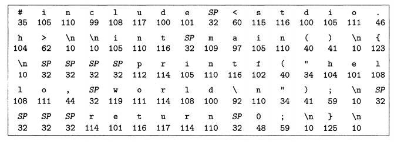
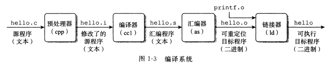
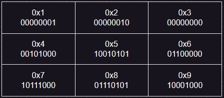
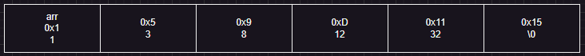

## 从 C 语言看数据在内存中的表现形式
因为 JS 是比较高级的语言，而且是解释性语言，距离底层很远。yysy，前端er 即使计算机专业毕业的，计算机基础也相对比较弱，而且很多是转行的，所以对这些知识是有欠缺的。另外，所以二进制生汇编，汇编生 C，C 生万物。绝大部分的编程都和 C 有着千丝万缕的关系，就拿我们前端来说，比如 Chrome 的内核使用 C++ 编写，而 C++ 也是由 C 增加面向对象等发展而来；又比如 WASM 也可以使用 C、rust 等开发，拥有更小的体积更高的性能。所以了解 C 语言是对内功的练习，能帮助我们在编程领域理解的更加深入。

#### 1_base.c
从这个示例我们可以看到常用的基本类型，如何声明变量，以及 C 中最重要的指针。

问题：
1. 为什么需要 main 函数？
2. 字符是什么？字符串是什么？
3. `*` `&` 是什么？指针是什么？

#### 为什么需要 main 函数
大部分编译型语言中都有个 main 函数作为入口，如 C、 JAVA、 RUST...，那么这些语言为什么不能像 JS 那样从某个文件的第一行开始执行呢？

编译型语言通常没有入口文件，比如我们这个程序需要将 1_base.c 和 multiply.c 一起编译，那么哪个文件时入口文件呢？使用 `gcc 1_base.c multiply.c` 编译时写的第一个文件吗？答案是否定的，我们调换两个文件的位置 `gcc multiply.c 1_base.c` 也能正常运行。编译后的执行文件也只有一个二进制文件，所以并没有入口文件的概念，那么程序从哪里开始执行就需要约定了，大多数编译型语言就会使用 main 函数作为入口文件。

```c
#include <stdio.h>

int main() {
    printf("hello, world\n");
    return 0;
}
```
  
代码在**硬盘**中就会以二进制存储，不仅是内存中。我们输入的文字实际上输入的也是二进制数字，只是输入法、编辑器等程序，会根据编码将其转换成文字渲染出来。
  

#### 字符和字符串
JS 中有字符串，那么字符又是什么，和字符串有什么区别？
参考：2_char_str.c

#### 指针
什么是指针？从根本上看，指针是一个值为内存地址的变量。正如 char 类型变量的值是字符，int 类型变量的值是整数，指针变量的值是地址。
  
1. 指针本身也是一个变量，所以它自身也占用内存，也有自己的地址。
2. 指针的类型是所指向地址数据的类型。

参考：3_pointer.c

  
p1 的值是一个地址，指向 ch，那么 *p1 指向 ch 所在地址的数据 —— A。
p2 的值是一个地址，指向 p1，那么 *p2 就是 p1 所在地址的数据 —— 也是一个地址，指向 ch。**p2 就是 *p2 指向地址的数据，即 p1 指向地址的数据，即 ch 的数据 A。同理可得，*p2 == p1。

```c
    *p1 = 'B';
    printf("%c\n", ch);
```
JS 中要实现类似指针的能力，就只能通过使用数组、对象这类引用来实现。所以，数组的索引，对象的字段，也就是指向另一个内存的指针，只是我们不需要解引用，JS 会自动实现。

#### 数组和指针
参考：4_arr_pointer.c
1. C 语言中的数组和 JS 的数组有什么区别？
2. 数组和指针的关系

  
C 程序中数组在内存中的结构：连续的，每个元素占用的长度相同。而 JS 中就不一样了，可能是连续的，也可能是如链表一样散落在各个地方的。

#### 再谈字符串
参考：5_str.c
1. 为什么 p1, p2, p3 地址相同，str1, str2 地址不同？
2. #define 是什么？
<!-- 字符串在编译后存储在静态存储区，属于常量。赋值给数组会有个拷贝过程，所以可以修改，但是赋值给指针就赋值的静态存储区中字符串的地址。所以在使用字符串时根据是否会修改选择使用指针或数组，从而提升性能。 -->

#### 关于内存分区
C 语言内存分区包括以下几个部分：
* 栈（Stack）：存储函数的参数值、局部变量的值等，由编译器自动分配和释放。由于占空间是比较有限的，所以无法分配太大的数组等。
* 堆（Heap）：动态分配内存，需要手动管理内存的分配和释放，一般由程序员通过调用`malloc()、calloc()、realloc()`等函数来使用。
* 数据区（Data segment）：包括全局变量和静态变量，程序运行前分配内存，在程序运行期间一直存在，直到程序结束才会被释放。（上面提到的静态存储区也就是数据区）
* 代码区（Code segment）：存放程序的执行代码。

#### 宏
参考：6_define.c
定义的宏会在预处理阶段进行文本替换。

宏与 const 的区别：
* 宏是在预处理阶段进行文本替换的，而不是在编译时进行类型检查。
* 宏定义不会占用内存空间，它只是文本替换。
* 宏定义不受作用域的限制，全局范围内都可以使用。
* 宏可以用于创建复杂的宏函数，但可能会导致代码难以调试和理解。
* 不能为宏定义提供类型信息，它们没有类型。
* const 常量是真正的变量，但其值不可更改。它们具有类型信息，编译器会对其进行类型检查。
* const 常量在编译阶段分配内存，并占用内存空间。
* const 变量的作用域可以是局部或全局，可以根据需要进行限定。
* const 变量通常更具可读性和可维护性，因为它们具有类型信息，并且在编译时进行类型检查。
* const 常量不能用于创建宏函数，但可以用于创建具有类型的常量。

#### 函数
参考：7_function.c
1. 函数可以通过指针形参来修改实参的值。
2. 函数可以通过接收函数指针来实现高阶函数。
3. 函数可以返回函数指针实现返回函数的函数

函数名实际上是一个指向函数的指针。具体来说，函数名表示函数的入口地址，即函数的第一个机器指令的地址。当你调用一个函数时，程序会跳转到该函数的入口地址，开始执行函数的指令。

#### 结构
结构类似于 JS 的对象，是一类属性的结合。
参考: 8_struct.c
1. 结构在内存中的表现形式。
2. 结构指针的使用。

结构在内存中是占用连续存储空间的，JS 中的对象是分布在各个地方。
  

### 位运算
参考：9_bit_operation.c

[React源码中的位运算技巧](https://cloud.tencent.com/developer/article/1887780)

```js
// 获取 len 以内的随机整数值
export const getRandomIndex = (len: number) => {
  return Math.random() * len | 0;
};
```

### 性能测试
参考：performance.c 和 performance.js

1. JS 在执行简单的数据类型操作时，JS 引擎会进行很多优化操作，性能还是很高效的，和 C 语言相比只有四五倍的性能差距。