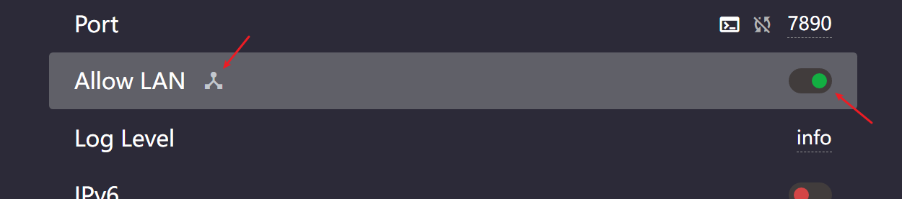
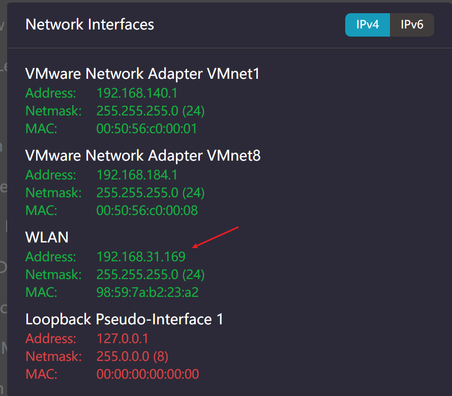
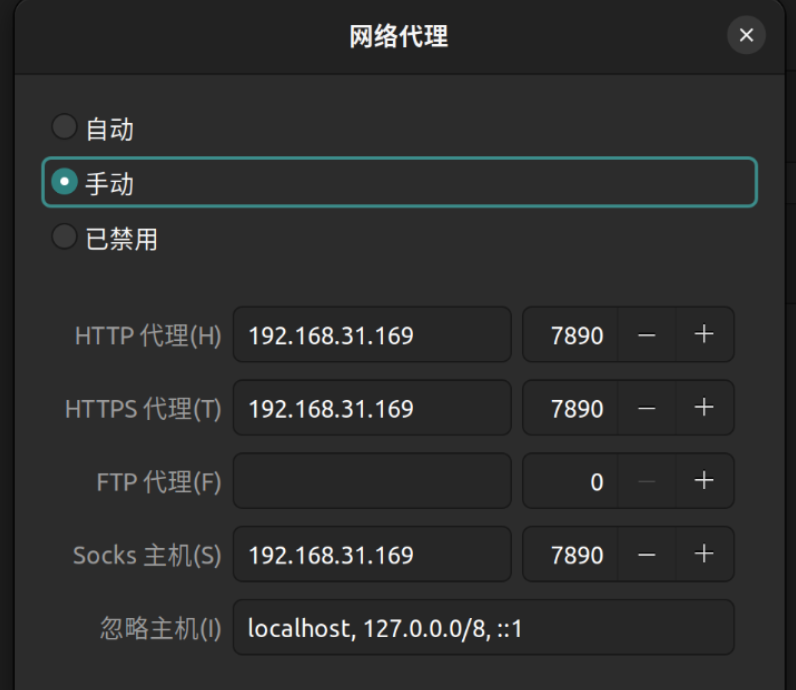

1. clash 中勾选 allow lan，然后点击 "allow lan" 后面的网络图标按钮。
  

2. 找到并复制内部内网 ip 地址。
  

3. 进入 Ubuntu 系统，设置网络代理为手动代理，将 ip 和端口号设置为宿主的 ip 和 clash 的代理端口。此时浏览器等软件可以访问 google 了，但是终端还不行。
  

4. 复制 ../Windows/proxy.sh 内容，并在 Ubuntu 中运行 `vi ~/proxy.sh` 粘贴复制内容，修改 hostip 为宿主机的 ip（就是上面配置的 ip）。然后运行 `source ~/proxy.sh set` 就能开启代理了。可使用 `curl www.google.com` 进行验证。