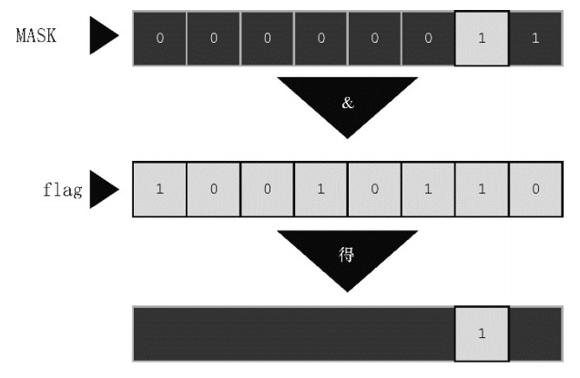
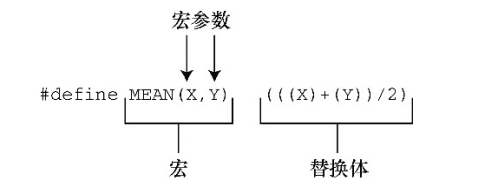
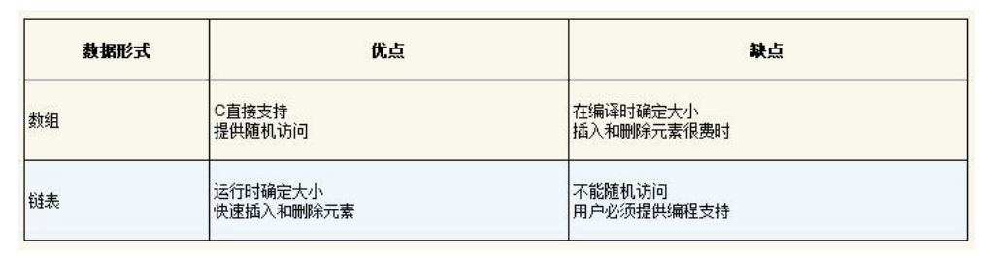

# 编译器
c 的编译器包括 GCC、Clang 等，编译 c 文件使用 cc （compile c）命令进行编译。安装了 GCC 和 Clang 的系统中，也可以使用 gcc 或 clang 命令进行编译。通常系统中带有 GCC 或 Clang 编译器，cc 命令是作为他们之一的别名使用。  
可以使用 `cc -v`, `gcc -v`, `clang -v` 来查看它们的版本。  
在 Windows 中需要安装 Cygwin 或 MinGW 来编译 c 代码，编译中生成的中间文件代码为 .obj，并且通常编译完成后不会删除。

# 预处理器
C 预处理器不是编译器的组成部分，但是它是编译过程中一个单独的步骤。简言之，C 预处理器只不过是一个文本替换工具而已，它们会指示编译器在实际编译之前完成所需的预处理。我们将把 C 预处理器（C Preprocessor）简写为 CPP。
所有的预处理器命令都是以井号（#）开头。

\#define	定义宏
\#include	包含一个源代码文件
\#undef	取消已定义的宏
\#ifdef	如果宏已经定义，则返回真
\#ifndef	如果宏没有定义，则返回真
\#if	如果给定条件为真，则编译下面代码
\#else	#if 的替代方案
\#elif	如果前面的 #if 给定条件不为真，当前条件为真，则编译下面代码
\#endif	结束一个 #if……#else 条件编译块
\#error	当遇到标准错误时，输出错误消息
\#pragma	使用标准化方法，向编译器发布特殊的命令到编译器中

详情点击：[预处理器](https://www.runoob.com/cprogramming/c-preprocessors.html)

# main 函数
main 函数是 c 程序的入口，标准写法为：
```c
int main(void) {
    return 0;
}
```
这里要注意几点：
1. main 函数返回值为 int.
2. main 函数没有参数，所以参数为 void.
3. 由于返回值为 int 所以 return 0.
4. 但是编译器会自动给 main 函数加 return 0，所以可以省略写 return 0。注意只有 main 函数会这样，其它函数会 return void.

在某些教程中使用 void main 其实是不标准的，虽然大多数情况它能正常运行。

# 字面量后缀
在数字的后面可以添加字面量后缀来表示此数字的类型，如：100L、123U、12.3F 等。
```c
#include <stdio.h>
int main(void) {
    long n1 = 100L;
    unsigned n2 = 123U;
    float n3 = 12.3F;

    // 4294967295 是 unsigned int 的最大值
    int n3 = 4294967295; // 编译器会报错，值超过了 int 的最大值
    int n4 = 4294967295U; // 编译器通过，并且 n4 实际上是 unsigned int 类型，存储下了这个值
    int n5 = 1.2F; // 将一个指定为 float 的类型的数赋值给 int 类型，编译器会报错，并不会改变 n5 的类型为 float

    printf("%zd\n", sizeof(1.2)); // 输出8，浮点数默认为 double 类型
    printf("%zd\n", sizeof(1.2F)); // 输出4，指定了使用 float 类型来存储

    // 这里就比较特别了。
    // 由于使用了无符号整数 1U，此处会变成 有符号数 和 无符号数 的二元运算，导致的结果就是条件为正，但是实际上 -2 + 1U 的值是 -1
    // 所以要注意不要将无符号数和有符号数进行运算
    if (-2 + 1U > 0)
    {
        long a = 100L - 1;
        printf("%ld\n", a);
        printf("%d\n", -2 + 1U); // 输出-1
        printf("%d\n", -2 + 1U > 0); // 输出1
    }
}
```

# 整数溢出
可以把整数看作是汽车的里程表。当达到它能表示的最大值时，会重新从起始点开始。无符号和有符号整数它们主要的区别是，在超过最大值时，unsigned int 类型的变量从0开始；而 int 类型的变量则从−2147483648开始（即 int 类型的最小值，根据类型不同也会有所不同）。

其实就是补码最大值加1后的值，比如 char 类型占1字节即8位，无符号类型内存中的值就是 00000000 - 11111111 即 0 - 255，当255+1后为256，即11111111+1为100000000，但是 char 类型只有8位，所以是 00000000 即0。而有符号 char 则是 11111111 - 011111111 即 -128 - 127，当127+1即 01111111 + 1 为 11111111，所以成了-128。

**注：有符号类型的补码中首位为符号位，0表示正数1表示负数，00000000表示0，10000000不表示-0而是最小的负数，比如8位就是-128。所以负数要比正数多1。**

# 查看各种类型占用字节
以下是在 Mac 中的占用
```c
#include <stdio.h>

int main(void) {
    printf("%zd \n", sizeof(short)); // 2
    printf("%zd \n", sizeof(int));  // 4
    printf("%zd \n", sizeof(long)); // 8
    printf("%zd \n", sizeof(long long)); // 8
    printf("%zd \n", sizeof(float)); // 4
    printf("%zd \n", sizeof(double)); // 8
    printf("%zd \n", sizeof(char)); // 1
    printf("%zd \n", sizeof(_Bool)); // 1
    
    return 0;
}
```

# 转换说明
请求printf()函数打印数据的指令要与待打印数据的类型相匹配。例如，打印整数时 使用%d，打印字符时使用%c。这些符号被称为转换说明（conversion specification），它们指定了如何把数据转换成可显示的形式。  
**如果类型不匹配，那么输出的内容可能就会显得很莫名其妙。**  
具体的转换说明符参考：[转换说明表](https://www.cnblogs.com/ilegend/articles/2258701.html)

# 字符串
```c
#include <stdio.h>
#include <string.h>

int main(void) {
    char c = 'A'; // 基本类型 char
    char s[40] = "这是个字符串"; // 派生类型 char 数组
    printf("%c\n", c); // 使用 %c 输出字符
    printf("%s\n", s); // 使用 %s 输出字符串
    printf("%d\n", c); // 会输出 A 对应的 ASCII 码
    printf("%d\n", s); // 会输出莫名的数值（所以类型必须要匹配）
    printf("%zd\n", strlen(s)); // 输出18
    return 0;
}
```
### 基本类型 char
基本类型 char 实际上是整数类型，存储的是一个字符的 ASCII 码，值用单引号，并且只能有一个在 ASCII 码中的字符。如中文不在 ASCII 码中，赋值给 char 会报错。

### 字符串 char 数组
当声明字符串时，应该使用 char 数组进行声明，并且使用双引号。由于字符串最后会有个 \0 结束符，所有实际上能存储的字符长度比声明时的长度少一位。**（但是我在 Mac 中测试，并未发现需要少输入一位，可能编译器不同？）**

### char 数组长度和中文
上面我们使用 `char s[40]` 定义了 s 的长度为40，由于1个 char 类型元素占用1字节，所以表示的是40字节。上面的内容为 `这是个字符串` 是6个中文字符，40个字节可以容纳6个中文字符，但是当我们改为 `char s[10]` 时，编译器就会发出警告，说我们的字符串太长了，是因为1个中文并不是只占用1个字节，中文不在 ASCII 编码中，属于 Unicode 编码，在常用的 UTF-8 中，1个中文字符占用的是3个字节，所以需要 `char s[18]` 才能正常编译。（上面 strlen(s) 输出18也能看出一个中文占用3个字节）
**Unicode 编码中的中文等字符存储在内存中也是二进制数字，一个汉字对应一个数值，3个字节足以表示各种语言的文字了。（计算机读取到 Unicode 编码内存位置时，应该会有某种机制告诉计算机这里存储的是 Unicode 编码，而不是普通的数字，读取后会使用 Unicode 编码进行解析成汉字输出。）**
```c
// 错误
int main() {
    char a = '你'; // 因为一个中文字符占3个字节，所以不能赋值给 char 类型
    printf("%c\n", a);
}
// 正确
int main() {
    char a[] = "你"; // 一个中文字符也需要用字符串数组进行存储
    printf("%s\n", a);
}
```

# 常量
### 使用 #define 定义常量
\#define 又叫做宏，定义的常量又叫宏常量
```c
#include <stdio.h>
#define MAX 100 // 定义宏常量
#define ADD 1+2

int main(void) {
    int value1 = MAX * 2; // 使用宏常量
    int value2 = ADD * 3; // 替换后就会变成 1+2*3，结果不合预期
    return 0;
}
```
以上是使用 #define 定义了一个常量，在预处理时就会将使用的地方替换成定义的值，内存中并不会有一个叫 MAX 的常量。

### 使用 const 定义常量
const 定义的常量又叫不可变变量
```c
#include <stdio.h>

int main(void) {
    const int MAC = 100;
    const int ADD = 1 + 2;
    int value1 = MAC * 2;
    int value2 = ADD * 3; // 会是 3*3
    return 0;
}
```
具体区别可参考：[常量（const 和 #define 的区别）](https://blog.csdn.net/Mikchy/article/details/107072337)

# 运算
### 除法
c 语言中，整数除法返回的也是整数，这就导致整数相除产生的小数部分会被丢弃，所有在会使用到除法时，应该将变量定义为 float 或 double 等浮点数类型，而不应该定义为 int 这样的整数类型。
```c
#include <stdio.h>
int main(void)
{
    int a = 5;
    int b = 2;
    float c = 5;
    float d = 2;
    printf("%d\n", a / b); // 只会输出 2
    printf("%f\n", c / d); // 正常输出 2.500000
    printf("%f\n", a / d); // 正常输出 2.500000（整型与浮点型运算得到浮点型）
    printf("%d\n", a / d); // 这里用 %d 会导致编译器警告，并且输出的值错误
    return 0;
}
```
混合整数和浮点数计算的结果是浮点数。实际上，计算机不能真正用整数除以浮点数，编译器会把两个运算对象转换成相同的类型。本例中，在进行除法运算前，整数会被转换成浮点数。

# 运算符
除了常用的 + - * / % 之外，c 语言还提供了一些函数进行一些特定的运算操作。

### 求模运算
负数求模如何进行？如果第1个运算对象是负数，那么求模的结果为负数；如果第1个运算对象是正数，那么求模的结果也是正数：
11 / 5 得2，11 % 5 得1 
11 / -5 得-2，11 % -2 得1 
-11 / -5 得2，-11 % -5 得-1 
-11 / 5 得-2，-11 % 5 得-1

### sizeof 和 size_t
sizeof运算符以字节为单位返回运算对象的大小，运算对象可以是具体的数据对象（如，变量名）或类型。
**（在C中，1字节定义为char类型占用的空间大小。过去，1字节通常是8位，但是一些字符集可能使用更大的字节）。**
```c
#include <stdio.h>
int main(void)
{
    char str[10] = "你好";
    float f[10];
    printf("%zd\n", sizeof(str)); // 输出10
    printf("%zd\n", sizeof(char)); // 输出1
    printf("%zd\n", sizeof(int)); // 输出4
    printf("%zd\n", sizeof(f)); // 输出40，因为 float 占4个字节，10个 float 占40字节
    return 0;
}
```
C 语言规定，sizeof 返回 size_t 类型的值。而 size_t 并不是个新类型，而是某个标准类型的别名，使用 typedef 定义。C 头文件系统可以使用 typedef 把 size_t 作为 unsigned int 或unsigned long 的别名。这样，在使用 size_t 类型时，编译器会根据不同的系统替换标准类型。我们可以使用 %zd 转换说明来表示接受 size_t 类型。
（上面实例中如果使用 %d 接收 sizeof 返回值，编译器会提示应该使用 %lu 接收，即 unsigned long 类型，所以在 Mac 系统下 size_t 是 unsigned long 的别名。当然 Mac 中也可以使用 %lu 来接收 sizeof 返回值。）

# 类型转换
在使用不同类型进行运算时，C 语言会对类型进行转换后再运算，但是最好的做法是不要使用不同的类型进行运算。

### 类型转换规则
表达式中使用不同类型的转换规则：
1. 当类型转换出现在表达式时，无论是 unsigned 还是 signed 的 char 和 short 都会被 自动转换成 int，如有必要会被转换成 unsigned int。
2. 涉及两种类型的运算，两个值会被分别转换成两种类型的更高级别。
3. 类型的级别从高至低依次是 long double、double、float、unsigned long long、long long、unsigned long、long、unsigned int、int。例外的情况是，当 long 和 int 的大小相同时，unsigned int 比 long 的级别高。之所以 short 和 char 类型没有列出，是因为它们已经被升级到 int 或 unsigned int。
4. 在赋值表达式语句中，计算的最终结果会被转换成被赋值变量的类型。
5. 当作为函数参数传递时，char 和 short 被转换成 int，float 被转换成 double。

**类型降级**——不同类型赋值时，被赋值类型比赋值类型更低级的转换规则：
1. 目标类型是无符号整型，且待赋的值是整数时，额外的位将被忽略。例如，如果目标类型是8位 unsigned char，待赋的值是原始值求模256。（260赋值给 unsigned char 会输出4）
2. 如果目标类型是一个有符号整型，且待赋的值是整数，结果因实现而异。
3. 如果目标类型是一个整型，且待赋的值是浮点数，该行为是未定义的。（通常的实现是直接截断小数部分。）

### 强制类型转换运算符
使用 (type)value 可以将 value 强制转换为 type 类型。
```c
#include <stdio.h>
int main(void)
{
    int a = 1.6 + 1.7;
    int b = (int)1.6 + (int)1.7;
    printf("%d\n", a); // 输出3
    printf("%d\n", b); // 输出2
    return 0;
}
```
本质上，两种类型转换都好不到哪里去，要考虑程序的具体情况再做取舍。

# 关系运算符
c 语言的关系运算符包括 `>, <, >=, <=, ==, !=` 6种，注意没有 JS 中 `===, !==` 这样的关系运算符，强类型语言都没有。
关系运算符可以使用 char 类型和 int 类型进行比较，因为 char 类型实际上也是 int 类型，会转换成 ASCII 中的数值。**但是字符串类型不能使用关系运算符进行比较，有专门的函数用于比较字符串，如 strcmp 函数。**

### 浮点数比较
虽然关系运算符也可用来比较浮点数，但是要注意：比较浮点数时，尽量只使用 < 和 >。因为浮点数的舍入误差会导致在逻辑上应该相等的两数却不相等。例如，3乘以1/3的 积是1.0。如果用把1/3表示成小数点后面6位数字，乘积则是.999999，不等于1。使用 fabs() 函数（声明在math.h头文件中）可以方便地比较浮点数，该函数返回一个浮点值的绝对值（即，没有代数符号的值）。

### 什么是真
在 C 语言中，1表示真，0表示假。实际上非0的整数都是真，无论正负。而浮点数放到条件语句中编译器会给出警告，及时能作为真值继续运行。
```c
#include <stdio.h>
int main(void) {
    if (1) {} // 正常运行，为真
    if (0) {} // 正常运行，为假
    if (10) {} // 正常运行，为真
    if (-10) {} // 正常运行，为真
    if ('a') {} // 正常运行，为真
    if ('0') {} // 正常运行，为真
    if ('\0') {} // 正常运行，为假，char 类型的 \0 实际就是0
    if ("aaa") {} // 正常运行，为真
    if (1.2) {} // 编译器给出警告，为真
    // C 语言中没有 true 和 false
    if (true) {} // 编译器报错，中断运行
    if (false) {} // 编译器报错，中断运行
    int true = 1; // 我们甚至可以声明变量名为 true
}
```
**C 语言默认没有关键字 true 和 false，C99 提供了一个头文件 <stdbool.h> 定义了 bool 代表 _Bool，true 代表 1，false 代表 0。**
```c
#include <stdio.h>
#include <stdbool.h> // 布尔相关头文件
int main(void)
{
    bool a = true;
    if (a)
    {
        printf("%d\n", 'a' > 3);
    }
}
```

# 函数
C 语言中，函数通常使用先声明再定义的写法。
```c
#include <stdio.h>
// 函数声明（函数原型）：函数的返回类型，名称，参数个数及类型 
int getN(int);
// int getN(int n); 参数可以取名可以不取名，个人感觉不取名更简洁

int main(void)
{
    // 函数调用
    int n = getN(10);
    printf("%d", n);
}

// 函数定义：对函数的实现
int getN(int n) {
    return n;
}
```
C 语言中，函数需要先声明再调用。
1. 上面代码中如果删除函数声明，但是保留函数定义，编译器会给出警告。编译器在运行到 getN(10) 时，此时发现并没有 getN 函数，会产生一个函数的隐式声明，也就是编译器会帮我们声明 getN 函数，由于我们后面实现了 getN，所以程序没有出错。但是隐式声明是有风险的，程序员应该避免这样的错误。
2. 如果将函数声明和函数定义都删除，则会直接报错。虽然编译器会帮我们生成隐式声明，但是函数没有实现，所以无法调用。
3. 将 getN 函数定义放在 main 函数之前，此时不写函数声明也没问题，但是这不符合规范，通常是将 main 函数放在最前面，函数定义可能放在 main 后面或其它文件中。

### 任意多个参数函数
一些函数接受（如，printf() 和 scanf()）许多参数。例如对于 printf()，第1个参数是字符串，但是其余参数的类型和数量都不固定。对于这种情况，ANSI C 允许使用部分原型。例如，对于 printf() 可以使用下面的原型：
```c
int printf(const char *, ...);
```
这种原型表明，第1个参数是一个字符串，可能还有其他未指定的参数。C 库通过 stdarg.h 头文件提供了一个定义这类（形参数量不固定的）函数的标准方法。

### 尾递归
最简单的递归形式是把递归调用置于函数的末尾，即正好在 return 语句之前。这种形式的递归被称为尾递归（tail recursion），因为递归调用在函数的末尾。尾递归是最简单的递归形式，因为它相当于循环。

### 指数增长的递归
```c
unsigned long Fibonacci(unsigned n)
{
    if (n > 2)
        return Fibonacci(n - 1) + Fibonacci(n - 2);
    else
        return 1;
}
```
上面是个计算斐波那契数列的递归，每次递归都会调用两次自身，所以创建的变量每次递归都是上次的两倍，这就是指数级增长的递归。所以在编写递归程序里要避免在递归中多次调用自身。

# 字符处理
### getchar 和 putchar
getchar 和 putchar 是 stdio.h 中定义的预处理宏，用于专门读取和打印字符，因为只针对字符，所以比通用的 scanf 和 printf 更高效。
```c
#include <stdio.h>

int main(void)
{
    char ch;
    ch = getchar(); // 读取一个字符
    
    while (ch != '\n') { // 当前读取的字符不是换行符则继续循环（控制台输入完字符后敲回车，实际上还会在末尾输入个 \n）
        if (ch == ' ') {
            putchar(ch); // 空格则正常打印
        } else {
            putchar(ch + 1); // 非空格+1后再打印，如字符 a 会+1后变成字符 b 打印（ASCII 码的下个字符）
        }

        ch = getchar(); // 读取下一个字符
    }

    putchar(ch); // 打印最后一个 \n
    printf("%c", ch);
}
```
以上代码运行后，我们在控制台输入一串字符后，字符会进入缓冲区，程序会从缓冲区一个一个的读取字符进行操作。
**注意：一个中文占用3个字符，如果我们只读取一个字符，存到 char 变量中，然后输出，则会是乱码。而如果使用循环不断读取并输出，则3个字符会作为一个中文输出。**
下面我们使用 scanf 和 printf 来验证：
```c
#include <stdio.h>
int main(void) {
    char c;
    int i = 0; // 循环计数器
    scanf("%c", &c); // 这里我们输入一个中文
    while (c != '\n') { // 循环读取控制台的输入
        i++;
        printf("%c", c); // 打印每次的输入
        scanf("%c", &c); // 读取下一个输入
    }
    printf("%d", i); // 输入一个中文，会输出3，说明一个中文循环了3次才完整输出
}
```

### ctype.h
ctype.h 包含一系列用于判断字符类别的函数。如： isalpha() 判断传入的字符是否是字母；ispunct() 判断是否是标点符号等。
具体查看：[ctype.h 标准库](https://www.runoob.com/cprogramming/c-standard-library-ctype-h.html)

# goto 语句
`goto` 语句类似 JS 中的 `break label` 语句。但是 `break label` 只能用于循环中，`goto` 语句却可以用在任何地方。所以 `goto` 语句使用更灵活，但是也更易导致问题，需要谨慎使用，最好只用在 `break label` 这样的地方，用于跳出多层嵌套循环。

示例1：
```c
// 使用 goto 语句来实现 if
if (size > 12)
    goto a;
goto b;
a:
cost = cost * 1.05;
flag = 2;
b:
bill = cost * flag;
```
```c
// 使用 if 明显更易理解
if (size > 12)
{
    cost = cost * 1.05;
    flag = 2;
}
bill = cost * flag;
```
示例2：
```c
if (ibex > 14)
    goto a;
sheds = 2;
goto b;
a:
sheds = 3;
b:
help = 2 * sheds;
```
```c
// 使用 if else 明显更好
if (ibex > 14)
    sheds = 3;
else
    sheds = 2;
help = 2 * sheds;
```
**下面是可接受的用法：**
```c
while (funct > 0)
{
    for (i = 1; i <= 100; i++)
    {
        for (j = 1; j <= 50; j++)
        {
            其他语句 
            if (问题) 
                goto help; // 嵌套循环中跳转到 help 位置
            其他语句
        }
        其他语句
    }
    其他语句
}
其他语句 
help: 语句 // 会直接跳转到这里继续执行
```

# 字符输入输出和输入验证
C 语言 stdio.h 标准库中包含一些标准的 IO 函数，它们可以在不同的系统中运行，如 Windows, Linux, Mac OS。但是一些特殊的硬件等也会实现并提供自身的 IO 函数，可能需要通过引入其头文件来使用。

### 缓冲区
无缓冲输入：当使用 scanf, getchar 这样的函数时，如果用户在控制台每输入一个字符就被程序接收并立即执行，比如我们要将输入的内容进行输入，就可能出现控制台显示为：HHeelloo。这就是无缓冲输入的表现。
缓冲输入：用户输入的字符被收集并存储在一个被称为缓冲区（buffer）的临时存储区，按下 Enter 键后，程序才可使用用户输入的字符。
  

为什么要有缓冲区？首先，把若干字符作为一个块进行传输比逐个发送这些字符节约时间。其次，如果用户打错字符，可以直接通过键盘修正错误。当最后按下 Enter 键时， 传输的是正确的输入。

虽然缓冲输入好处很多，但是某些交互式程序也需要无缓冲输入。例如，在游戏中， 你希望按下一个键就执行相应的指令。因此，缓冲输入和无缓冲输入都有用武之地。

缓冲分为两类：完全缓冲 I/O 和行缓冲 I/O。完全缓冲输入指的是当缓冲区被填满时 才刷新缓冲区（内容被发送至目的地），通常出现在文件输入中。缓冲区的大小取决于系统，常见的大小是512字节和4096字节。行缓冲 I/O 指的是在出现换行符时刷新缓冲区。键盘输入通常是行缓冲输入，所以在按下 Enter 键后才刷新缓冲区。

### 文件结尾
读取文件的时候如何判断文件达到了末尾？
第一种方法是使用 ctrl+Z 字符来作为结尾标记，当读到 ctrl+Z 即 `^Z` 时便到了末尾，但是这种方法也说明文件中不能人为输入 `^Z`，否则程序读到这里就终止读取了。
第二种方法是使用存储文件大小的信息。如果文件有3000字节，程序在读到3000字节时便达到文件的末尾。现在大部分操作系统都使用这种方式，这种方式也就可以在文件中人为写入 `^Z` 字符。
无论操作系统实际使用何种方法检测文件结尾，在C语言中，用 getchar 或 scanf 读取文件检测到文件结尾时将返回一个特殊的值，即 EOF（end of file 的缩写）。通常，EOF 定义在 stdio.h 文件中：
```c
#define EOF (-1)
```
为什么是-1？因为如果是正整数则可能是某个字符的 ASCII 编码，而-1不是 ASCII 码。可能某些系统返回的不是-1，而是-2或其它值，所以我们使用 EOF 常量名来判断就不会出错。
```c
while ((ch = getchar()) != EOF) // 使用 EOF 而不是-1
```

### 重定向输入
在运行一个 C 语言编译后的程序的时候，假设这个程序像之前的功能一样读取键盘输入并输出。我们在控制台使用 `./test` 来执行这个编译后的程序时，可以使用重定向来讲输入重定向到一个文件，而不是通过键盘输入。只需要像这样
`./test < ../test.c`
就能将源代码 test.c 文件作为输入，控制台中就会打印出 test.c 的内容。

### 重定向输出
使用 > 可以将输出进行重定向，从而写入某个文件而不是通过显示器作为输出设备。
`./test > ./test.txt`
这样就能将控制台中的输入写入 test.txt 文件中了（没有 test.txt 或创建文件，有则会覆盖内容）。

### 组合重定向
将两个符号组合使用就能实现复制功能：
`./test < ../test.c > ./test.c`
（测试时发现输出文件末尾多了两个乱码字符，不知道是为什么？）
UNIX、Linux 或 Windows/DOS 还有 `>>` 运算符，该运算符可以把数据添加到现有文件的末尾，而 `|` 运算符能把一个文件的输出连接到另一个文件的输入。

### 输入流和数字
使用 scanf 读取控制台的输入，C 语言会将控制台的输入内容作为字节流来处理。
当我们在控制台输入42，scanf 使用不同的转换说明会产生怎样的效果呢？
如果在 scanf() 函数中使用 %c 转换说明，它只会读取字符4并将其存储在 char 类型的变量中。如果使用 %s 转换说明，它会读取字符4和字符2这两个字符，并将其存储在字符数组中。如果使用 %d 转换说明，scanf() 同样会读取两个字符，但是随后会计算出它们对应的整数值：4×10+2，即42，然后将表示该整数的二进制数存储在 int 类型的变量中。如果使用 %f 转换说明，scanf() 也会读取两个字符，计算出它们对应的数值42.0，用内部的浮点表示法表示该值，并将结果存储在 float 类型的变量中。
也就是 scanf 在使用不同的转换说明时，内部会针对读取到的字节流用不同的算法进行处理后赋值给变量。

# 编写头文件
我们可以使用 .h 为后缀的文件来编写自己的头文件，如 name.h 。使用头文件则是使用 `#include "name.h"` 双引号的形式引入自己的头文件。

# &运算符
当使用函数时，如果不使用 return 返回的值来改变已有的变量，则必须通过地址才能去修改已有变量的值。
一元 `&` 运算符给出变量的存储地址。如果 `pooh` 是变量名，那么 `&pooh` 是变量的地址。可以把地址看作是变量在内存中的位置。
```c
#include <stdio.h>

int main(void)
{
    int pooh = 20;
    printf("%d\n%p", pooh, &pooh);
    return 0;
}
```
以上代码输出了变量 pooh 的值和内存地址。`%p` 是输出地址的转换说明。

# 指针
什么是指针？从根本上看，指针（pointer）是一个值为内存地址的变量（或数据对象）。正如 char 类型变量的值是字符，int 类型变量的值是整数，指针变量的值是地址。**通常会指向某段内存的首地址，而这段内存的长度就是所指定类型的长度。**
[万字长文带你从内存看指针 | C语言指针完全解析](https://zhuanlan.zhihu.com/p/298363575)

### 间接运算符（解引用运算符）
间接运算符的作用是从地址中解出它的值。
```c
// 将 b 的地址赋值给 a
a = &b;
// 将 a 地址解析出来赋值给 c
c = *a;

// 上面两句的作用等同于下面一句
c = b;
```

### 声明指针
声明指针变量时必须指定指针所指向变量的类型，因为不同的变量类型占用不同的存储空间，一些指针操作要求知道操作对象的大小。另外，程序必须知道存储在指定地址上的数据类型。
```c
int * pi; // pi 是指向 int 类型变量的指针 
// * 前后都可以不带空格
char *pc; // pc 是指向 char 类型变量的指针 
float * pf, * pg; // pf、pg 都是指向 float 类型变量的指针
```
上面的 `int *pc` 可以解释为：`*pc` 是 char 类型，那么 `pc` 就不是 char 类型，而是指向 char 类型的指针。pc 的值是一个地址，在大部分系统内部，该地址由一个无符号整数表示。但是指针不是整数类型，比如我们不能将两个指针相乘。所以指针是一个新的类型。

下面是使用指针交换两个变量值的示例：
```c
#include <stdio.h>
void interchange(int *u, int *v);

int main(void)
{
    int x = 5, y = 10;
    printf("Originally x = %d and y = %d.\n", x, y);
    interChange(&x, &y); // 把地址发送给函数
    printf("Now x = %d and y = %d.\n", x, y);
    return 0;
}

void interChange(int *u, int *v)
{
    int temp;
    temp = *u; // temp 获得 u 所指向对象的值
    *u = *v; // 将 v 地址的值赋值给 u 地址的值
    *v = temp;
}
```
**注意：**
1. 在调用 `interChange(&x, &y)` 传入 x 和 y 的地址，这个地址是复制给函数声明 `void interChange(int *u, int *v)` 中的变量 u 和 v，而不是 *u 和 *v。变量 u 接收了 x 的地址，*u 将地址所指的内存数据解析成 int 值。
2. 当修改 *u 的值时，如 `*u = 100` 表示将 u 这个地址的值改为100。如果使用 `u = 100` 就成了将 u 指向的内存地址改为指向100这个内存地址，就不对了。（可以理解为：u 指向 x 的地址，*u 则等同于 x，我们对 *u 进行赋值，则是对变量 x 进行赋值。）
3. 当然，我们在某些情况下也可能对内存地址进行赋值，比如 `u = v`，那么此时 u 和 v 都指向了相同的内存地址，我们赋值 `*u = 100`后则 *v 也成了100，main 函数中的 y 也成了100。

# 数组
需要使用数组时，通过声明数组告诉编译器数组中内含多少元素和这些元素的类型。编译器根据这些信息正确地创建数组。普通变量可以使用的类型，数组元素都可以用。
```c
int main(void) {
    float candy[365]; // 内含365个 float 类型元素的数组
    char code[12]; // 内含12个 char 类型元素的数组
    int states[50]; // 内含50个 int 类型元素的数组
}
```

### 初始化数组
C 语言中使用花括号 `{ }` 来初始化数组，而不是中括号 `[ ]`。
```c
int main(void) {
    int powers[8] = {1, 2, 4, 6, 8, 16, 32, 64};

    // 使用 const 初始化数组后，数组就不能被修改了
    const int arr[10] = {1, 2, 3}
    // arr[5] = 5; // 修改 arr 会报错
}
```
上面 arr 数组在初始化时只初始化了前三位，由于类型是 int，那么后7位都默认是0。如果类型是 char，那么后7位就默认是空字符。

如果声明了数组，但是未初始化，那么数组里面的值就会很奇怪，可能是分配内存地址之前的值，属于垃圾值。但是只要初始化后，就会对此段内存地址按照声明的类型赋上默认值。
```c
#include <stdio.h>
int main(void)
{
    int arr[10]; // 未初始化，遍历输出的值是垃圾值
    // int arr[10] = {}; // 初始化了，所有值为0

    for (int i = 0; i < 10; i++) {
        printf("%d\n", arr[i]);
    }
};
```

如果不指定数组长度，那么编译器就会根据初始化值分配数组长度。
```c
#include <stdio.h>
int main(void)
{
    // 会根据初始值指定长度为10
    const int days[] = {31, 28, 31, 30, 31, 30, 31, 31, 30, 31};
    // 因为下面要和 sizeof 的值进行比较，所以声明为 unsigned long 类型才相同
    unsigned long index;
    for (index = 0; index < sizeof days / sizeof days[0]; index++) {
        printf("Month %2lu has %d days.\n", index + 1, days[index]);
    }
    return 0;
}
```
**上面代码中通过 sizeof 计算出了数组的长度。sizeof 运算符给出它的运算对象的大小（以字节为单位）。所以 `sizeof days` 是整个数组的大小（以字节为单位），`sizeof days[0]` 是数组中一个元素的大小（以字节为单位）。整个数组的大小除以单个元素的大小就是数组元素的个数。**

### 指定初始化器（C99）
置顶初始化器是 C99 新增的语法糖，可以初始化数组中后面的元素，而不用写前面的。
```c
int arr[6] = {0, 0, 0, 0, 0, 212}; // 传统的语法
int arr[6] = {[5] = 212}; // 把 arr[5] 初始化为212

int arr[6] = {};
arr[5] = 212; // 这样也可以

/*
* 索引2和3值为0
* 30会赋值给索引5
* 29会修改索引1，即索引1的28会改为29
*/
int days[12] = { 31, 28, [4] = 31, 30, 31, [1] = 29 };
```

**注意：C 不允许把数组作为一个单元赋给另一个数组，除初始化以外也不允许使用花括号列表的形式赋值。只能使用循环一个个赋值。**
```c
#include <stdio.h>
#define SIZE 5
int main(void)
{
    int oxen[SIZE] = {5, 3, 2, 8}; // 初始化没问题
    int yaks[SIZE];
    // 不允许将一个数组赋值给另一个数组
    yaks = oxen;
    // 数组下标越界，yaks 长度是5，而 yarks[5] 是给第6个元素赋值
    yaks[SIZE] = oxen[SIZE];
    // 不起作用
    yaks = {5, 3, 2, 8};
}
```

### 数组边界
C 语言中数组是有长度的，对数组外的索引进行取值/赋值操作叫做数组越界操作。当数组越界时编译器不会检查下标使用是否得当（有些编译器会警告但是继续执行），所以一定要小心数组越界问题。在C标准中，使用越界下标的结果是未定义的，不同的编译器可能给出不同的结果。
如果给越界的下标赋值，越界的下标可能指向的是另一个变量的内存地址，这时就会修改到另一个变量的值。所以越界操作是非常危险的。

### 变长数组
C99 之前创建数组，中括号中只能使用整型常量，不能使用变量。sizeof 表达式被视为整型常量。const 声明的变量也不行。
C99 之后可以使用变量声明数组的长度，这种数组称为变长数组。
但是在声明变长数组时不能进行初始化。若初始化，编译器会报错。
```c
int main(void)
{
    int n = 5;
    int m = 8;
    const int o = 7;
    float a1[5];               // 可以
    float a2[5 * 2 + 1];       // 可以
    float a3[sizeof(int) + 1]; // 可以
    float a4[-4];              // 不可以，数组大小必须大于0
    float a5[0];               // 不可以，数组大小必须大于0
    float a6[2.5];             // 不可以，数组大小必须是整数
    float a7[(int)2.5];        // 可以，已被强制转换为整型常量
    float a8[n];               // 变长数组，C99之前不允许
    float a9[m];               // 变长数组，C99之前不允许
    float a10[o];               // 变长数组，const 声明的也是变量
}
```

### 多维数组
声明多维数组使用多个中括号即可。
```c
float rain[5][12]; // 内含5个数组元素的数组，每个数组元素内含12个float类型的元素
```
在计算机内部，这样的数组是按顺序存储的，从第1个内含12个元素的数组开始，然后是第2个内含12个元素的数组，以此类推。
以下是对多维数组的初始化：
```c
const float rain[5][12] = {
    {4.3, 4.3, 4.3, 3.0, 2.0, 1.2, 0.2, 0.2, 0.4, 2.4, 3.5, 6.6}, 
    {8.5, 8.2, 1.2, 1.6, 2.4, 0.0, 5.2, 0.9, 0.3, 0.9, 1.4, 7.3}, 
    {9.1, 8.5, 6.7, 4.3, 2.1, 0.8, 0.2, 0.2, 1.1, 2.3, 6.1, 8.4}, 
    {7.2, 9.9, 8.4, 3.3, 1.2, 0.8, 0.4, 0.0, 0.6, 1.7, 4.3, 6.2}, 
    {7.6, 5.6, 3.8, 2.8, 3.8, 0.2, 0.0, 0.0, 0.0, 1.3, 2.6, 5.2}
};
```
初始化时也可省略内部的花括号，只保留最外面的一对花括号。只要保证初始化的数 值个数正确，初始化的效果与上面相同。但是如果初始化的数值不够，则按照先后顺序逐行初始化，直到用完所有的值。后面没有值初始化的元素被统一初始化为0。

### 指针和数组
首先需要知道**数组的变量名是数组首元素的地址**。所以：
```c
int main(void)
{
    int arr[10] = {6, 9};
    // 相等，输出1表示 true
    printf("%d\n", arr == &arr[0]);
    // 输出第一个元素6
    printf("%d\n", *arr);
}
```
由此也就能知道什么不能将一个数组赋值给另一个数组了，数组变量是个地址，地址是个常量，不能进行赋值操作。

由于数组变量是个地址，那么可以将其赋值给指针。赋值给指针后，对指针进行+1操作会怎样呢？
```c
#include <stdio.h>
#define SIZE 4
int main(void)
{
    short index;
    double bills[SIZE];
    double *ptf;
    ptf = bills; // 把数组地址赋给指针
    for (index = 0; index < SIZE; index++) {
        // ptf + index 对指针进行+操作
        printf("pointers + %d: %10p\n", index, ptf + index);
    }
}

这是输出结果：
pointers + 0: 0x7ffee6d59640
pointers + 1: 0x7ffee6d59648
pointers + 2: 0x7ffee6d59650
pointers + 3: 0x7ffee6d59658
```
我们打印出指针的地址，发现每+1则地址+8，这是因为 double 类型占8个字节，所以指针+1地址就+8，如果是其它类型那么就是其对应所占字节数。

注：
1. 上面的例子中指针+1，地址+8也就正好指向数组第2个元素的地址。如果指针声明的类型不对，那么就不会指向第二个元素了。
2. 数组也是使用的连续内存，每个元素占用的内存空间就是其类型所占用的字节数。下一个数组元素的开始地址会紧接上个元素的结束地址。
3. 这也是为什么必须声明指针的类型的原因之一。因为只知道地址还不够，计算机还需要知道存储的数据需要多少字节。指针指向了一个内存地址，而类型决定了从这个内存地址开始取多少个字节的数据出来转换成这个类型的值。

由此可见，类型是多么的重要。这也是 C 语言性能高的原因之一。

### 函数、数组和指针
假设我们要编写一个接收数组进行操作的函数，那么函数的形参该怎么写呢？数组名是该数组首元素的地址，所以函数接收一个数组即是接收一个地址，形参就该是一个指针：
```c
int sum(int *arr);

int sum(int *arr) // 相应的函数定义
{
    int i;
    int total = 0;
    for (i = 0; i < 10; i++) // 假设数组有10个元素
        total += arr[i];      // arr[i] 与 *(arr + i) 相同
    return total;
}
```
由于函数参数中使用指针的写法来接收数组，我们不能容易的知道这个函数是接收的数组，所以函数的形参新增了个语法糖来表示接收数组的指针：
```c
int sum(int arr[]);

int sum(int arr[]) // 相应的函数定义
{
    ...
}
```
由于函数原型可以省略参数名，所以下面4种原型都是等价的：
```c
int sum(int *arr, int n);
int sum(int *, int);
int sum(int arr[], int n);
int sum(int [], int);
```
**注意，函数中的形参接收一维数组不用指定数组长度。用指针表示法也是指向首元素地址，并不知道数组长度。**

### 数组和 sizeof
当我们使用 sizeof 获取数组所占用字节数时一个有趣的现象出现了：
```c
int main(void)
{
    int n = 10;
    int arr[10] = {};
    int *p = arr;
    printf("%zd\n", sizeof(n)); // 输出4，int 占用的字节数
    printf("%zd\n", sizeof(&n)); // 输出8，地址（指针）所占用的字节数
    printf("%zd\n", sizeof(arr)); // 输出40，10个int元素数组所占用的字节数
    printf("%zd\n", sizeof(p)); // 输出8，地址（指针）所占用的字节数
    printf("%zd\n", sizeof(*p)); // 输出4，int 所占用的字节数
}
```
可以看出，只有在 sizeof(arr) 的时候输出了数组所占的总字节数，而当把 arr 赋值给指针后就只能获取到指针所占字节数，再也不能通过 p 拿到数组 arr 所占的总字节数了。
这就意味着如果我们把数组通过指针形式传给函数后，函数内部也拿不到数组的总长度了。那么只能通过传参时计算出数组的长度传给函数才行。如：
```c
#include <stdio.h>
int arrayLength(int arr[], int arrSize);

int main()
{
    int b[] = {1, 2, 3, 4, 5, 6, 7, 8, 9, 10, 11, 12};
    // 计算出数组长度再传入函数
    int length = sizeof(b) / sizeof(b[0]);
    arrayLength(b, length);
    return 0;
}
// 需要接收数组长度
int arrayLength(int arr[], int arrSize)
{
    printf("size of array is %d\n", arrSize);
    return 0;
}
```
另一种方式是函数接收两个指针，一个指向数组开始位置，一个指向数组结束位置（不是最后一个元素，而是最后一个元素的下个位置），对指针进行运算也能操作数组：
```c
#include <stdio.h>
#define SIZE1 1
#define SIZE2 10
int sump(int *start, int *end);
int main(void)
{
    int marbles1[SIZE1] = {10};
    int marbles2[SIZE2] = {20, 10, 5, 39, 4, 16, 19, 26, 31, 20};
    printf("%zd\n", sizeof(int));
    sump(marbles1, marbles1 + SIZE1);
    sump(marbles2, marbles2 + SIZE2);
    return 0;
}
/* 使用指针算法 */
int sump(int *start, int *end)
{
    printf("%p, %p, array size: %ld\n", start, end, end - start);
    int total = 0;
    while (start < end)
    {
        total += *start; // 把数组元素的值加起来
        start++;         // 让指针指向下一个元素
    }
    return total;
}

输出内容：
// int 类型所占字节数
4
// 数组长度为1，两个指针地址相差4，正是 int 类型的字节数。end 指针减去 start 指针结果为1，说明指针相减也和类型有关。所以也能得到数组长度
0x7ffeed528638, 0x7ffeed52863c, array size: 1
// 两个地址相减结果为 0x000000000028，即10进制的40，所以占用40个字节，长度为10
0x7ffeed528640, 0x7ffeed528668, array size: 10
```
通过传递数组和长度对进行数组进程操作的方式叫数组表示法，通过传递数组首位指针进行操作的方式叫指针表示法。数组表示法比指针表示法更易理解，指针表示法（尤其与递增运算符一起使用时）更接近机器语言，因此一些编译器在编译时能生成效率更高的代码。然而，许多程序员认为他们的主要任务是确保代码正确、逻辑清晰，而代码优化应该留给编译器去做。

### 保护数组中的数据
当我们编写处理数组的函数时，由于传的是指针，通过指针修改元素的值就会改变数组的数据。但是有时不想改变原数组该怎么办呢？
做法是对形参使用 const。在函数原型和函数定义中都使用 const 声明形参，这样在对数组指针进行修改时编译器会报错。
```c
int sum(const int arr[], int n); /* 函数原型 */
int sum(const int arr[], int n)  /* 函数定义 */
{
    arr[0]++; // 这样写编译器就会报错
    ...
}
```
也能看出 C 语言中使用 const 声明的数组，对其中的元素进行修改都不行，在 JS 中这是可以的。

### const 的其它内容
1. const 声明的数组，不能修改数组元素的值。
2. const 声明的指针，不能用于改变值。
```c
double rates[5] = {88.99, 100.12, 59.45, 183.11, 340.5};
const double *pd = rates; // 指针指向数组，值就是首元素的值
*pd = 13.14; // 不能这样修改，因为指针类型是 const double
pd[2] = 52.12; // 这样也不行
rates[0] = 99.99; // 可以，因为 rates 未被 const 限定
pd++; // 这样反而可以，因为 const double 是将 *pd 即解引用的值声明为 const，但是 pd 这个指针自身不是 const 的

const double locked[4] = {0.08, 0.075, 0.0725, 0.07};
double *pnc = rates; // 可以。非 const 数组赋值给非 const 指针
pnc = locked; // 不行。const 数组不能赋值给非 const 指针，如果能赋值，则可以通过指针修改 const 的数据了
```
另外，如果函数接收的数组形参不是 const 的，但是我们传了个 const 的数组给它，此时编译器可能给出警告但不会终止运行，这时就会导致风险。这种情况通过指针对 const 数组进行操作 C 标准中未定义，根据编译器自己决定。

还可以通过 const 声明不能指向别处的指针：
```c
double rates[5] = {88.99, 100.12, 59.45, 183.11, 340.5};
double * const pc = rates; // pc指向数组的开始。const 在 pc 之前
pc = &rates[2]; // 不允许，因为该指针不能指向别处
*pc = 92.99; // 没问题 -- 更改rates[0]的值
```
此时是指针被限制为 const，而不是指针解引用的值。

通过以上两种情况可以得出，在创建指针时还可以使用 const 两次，该指针既不能更改它所指向的地址，也不能修改指向地址上的值：
```c
double rates[5] = {88.99, 100.12, 59.45, 183.11, 340.5};
const double * const pc = rates; // 两个 const 将指针和解引用值都限制为不可修改
pc = &rates[2]; // 不允许
*pc = 92.99;    // 不允许
```

### 指针和多维数组
假设我们有个数组：
```c
int zippo[4][2];
```
那么有以下几个要点需要记住：
* 因为`zippo`是数组首元素的地址，所以`zippo`的值和`&zippo[0]`的值相同。而`zippo[0]`本身是一个内含两个整数的数组，所以`zippo[0]`的值和它首元素（一个整数）的地址（即`&zippo[0][0]`的值）相同。简而言之，`zippo[0]`是一个占用一个 int 大小对象的地址，而`zippo`是一个占用**两个** int 大小对象的地址。由于这个整数和内含两个整数的数组都开始于同一个地址，所以`zippo`和`zippo[0]`的值相同。
* 给指针或地址加1，其值会增加对应类型大小的数值。在这方面，`zippo`和`zippo[0]`不同，因为`zippo`指向的对象占用了两个 int 大小，而`zippo[0]`指向的对象只占用一个 int 大小。因此，`zippo + 1`和`zippo[0] + 1`的值不同。`zippo + 1`会将指针指向一维数组中第二个元素，而数组中每个元素也是个数组，每个数组是两个 int，所以占8字节，`zippo + 1`就会往后移动8个字节来指向第二个元素。
* 解引用一个指针（在指针前使用`*`运算符）或在数组名后使用带下标的`[]`运算符， 得到引用对象代表的值。因为`zippo[0]`是该数组首元素（`zippo[0][0]`）的地址，所以`*(zippo[0])`表示存储在`zippo[0][0]`上的值（即一个 int 类型的值）。与此类似，`*zippo`代表该数组首元素（`zippo[0]`）的值，但是`zippo[0]`本身是一个int类型值的地址。该值的地址是`&zippo[0][0]`，所以`*zippo`就是`&zippo[0][0]`。对两个表达式应用解引用运算符表明，`**zippo`与`*&zippo[0][0]`等价，这相当于`zippo[0][0]`，即一个 int 类型的值。简而言之，`zippo`是地址的地址，必须解引用两次才能获得原始值。地址的地址或指针的指针是就是双重间接（double indirection）的例子。**即`zippo`指向数组首元素的地址，`*zippo`是数组首元素的值（同`zippo[0]`），数组首元素的值又是第二维数组中首元素的地址，对其解引用即`**zippo`（同`*zippo[0]`）就能拿到第二维数组首元素的值。**

### 指向多维数组的指针
使用 `int *pz;` 可以声明一个指针，指向一个数组元素是 int 类型的一维数组，那么如何声明一个指针指向一个二维数组呢？二维数组我们应该知道第二维数组的元素个数，所以可以这样声明：
```c
int (*pz)[2]; // pz 指向一个第二维是两个 int 类型的二维数组
```
我们知道如果 pz 指向一维数组，那么`*pz`就是数组中首元素的值。所以`(*pz)[2]`就表明数组中首元素的值是个拥有两个元素的数组，前面的 int 说明两个元素是 int 类型。

注意`[]`优先级高于`*`所以必须加`()`，如果不加则是：
```c
int *px[2]; // px 是含有两个元素的数组，每个元素是个指向 int 类型的指针
```

其实`int (*pz)[2]`的本质是指向一个地址，而这个地址解引用后是个具有两个 int 元素的数组就行。将一个二维数组赋值给它时，（数组赋值给指针是将首元素的地址赋值，并且类型匹配）它会指向数组的首元素，而首元素也是包含两个 int 元素的数组，所以是匹配的，所以能将它作为二维数组的指针来使用：
```c
int arr1[3][2] = {{1, 2}, {3, 4}, {5, 6}};
int (*p1)[2] = arr1; // p1 指向 arr1 的第一个元素 arr1[0]
p1++; // p1 的类型是有两个 int 元素的数组，所以会+8后指向第二个元素

int arr2[2] = {1, 2};
int (*p2)[2] = &arr2; // p2 指向一个具有两个 int 元素的地址
```
**由此可以看出，我们使用指针来操作数组就是要让指针的类型和数组元素类型匹配上，当操作指针时就能正确的对数组进行操作。**

### 指针的兼容性
指针之间的赋值比普通类型的赋值要更严格，如 int 类型赋值给 double 类型，会进行隐式转换；但是指针的赋值如果类型不匹配则会直接报错。
```c
int n = 5;
double x;
int *p1 = &n;
double *pd = &x;
x = n;   // 隐式类型转换
pd = p1; // 编译时错误
```
在二维数组中，即使第二维类型相同，个数不同，赋值时也会报错。

### 指向指针的指针
可以声明一个指针指向另一个指针，这就是指向指针的指针：
```c
int main(void)
{
    int n = 10;
    int *p;
    int **pp; // 指向指针的指针，使用两个 *。类型也是解引用后最终值的类型
    pp = &p;
    printf("变量 n 的内存地址：%p\n", &n);
    printf("未赋值的 p 指向的内存地址：%p\n", p);
    p = &n;
    printf("变量 n 的地址赋值给 p 后：%p\n", p);
    printf("p 自己的内存地址：%p\n", &p);
    printf("pp 指向的内存地址：%p\n", pp);
    printf("p 解引用的值：%d\n", *p);
    printf("pp 解引用的值：%p\n", *pp);
    printf("pp 双重解引用的值：%d\n", **pp);
}

输出结果：
变量 n 的内存地址：0x7ffee786964c
未赋值的 p 指向的内存地址：0x7ffee7869660
变量 n 的地址赋值给 p 后：0x7ffee786964c
p 自己的内存地址：0x7ffee7869640
pp 指向的内存地址：0x7ffee7869640
p 解引用的值：10
pp 解引用的值：0x7ffee786964c
pp 双重解引用的值：10
```
可以看出：
1. 在将变量 n 的地址赋值给 p 之前和之后，p 指向的地址变了。赋值后 p 就指向变量 n 的地址
2. 指针也是个变量，也有自己的内存地址，p 的内存地址就是 0x7ffee7869640
3. pp 指向 p，所以 pp 的值是 p 的地址 0x7ffee7869640
4. 对 pp 解引用，那么 `*pp` 的值就该是 p 的值，而不是 p 的地址，即 p 指向的内存地址 0x7ffee786964c
5. 对 pp 双重解引用 `**pp` 就是对 p 指向的内存地址再次解引用，拿到这个内存地址的实际值 10

### 函数和多维数组
多维数组的函数形参可以这样声明：
```c
// 指针表示法
void somefunction(int (*pt)[4]);
// 数组表示法
void somefunction(int pt[][4]);
```
注意，第1个方括号是空的。**空的方括**号表明 pt 是一个指针。
编译器会把数组表示法转换成指针表示法。例如，编译器会把`arr[1]`转 换成`arr+1`。编译器对`arr+1`求值，需要知道 arr 所指向的对象大小，所以声明数组时需要指定类型。

也可以在第1对方括号中写上大小，如下所示，但是编译器会忽略该值：
```c
int sum2(int arr[3][4], int rows); // 有效声明，但是3将被忽略
```

下面是更多声明二维数组的方式：
```c
typedef int arr4[4];              // arr4是一个内含 4 个 int 的数组
// 使用 typedef 定义二维数组类型
typedef arr4 arr3x4[3];           // arr3x4 是一个内含3个 arr4 的数组
int sum2(arr3x4 arr, int rows);    // 与下面的声明相同
int sum2(int arr[3][4], int rows); // 与下面的声明相同
int sum2(int arr[][4], int rows);  // 标准形式
```

一般而言，声明一个指向 N 维数组的指针时，只能省略最左边方括号中的值：
```c
int sum4d(int arr[][12][20][30], int rows);
```
因为第1对方括号只用于表明这是一个指针，而其他的方括号则用于描述指针所指向数据对象的类型。下面的声明与该声明等价：
```c
int sum4d(int (*arr)[12][20][30], int rows); // arr 是一个指针
```

### 变长数组（VLA）
C99 新增了变长数组（variable-length array，VLA），允许使用变量表示数组的维度。如下所示：
```c
int quarters = 4;
int regions = 5;
double sales[regions][quarters]; // 一个变长数组（VLA）
```
注意，变长数组不能改变大小。变长数组中的“变”不是指可以修改已创建数组的大小。一旦创建了变长数组，它的大小则保持不变。这里的“变”指的是：在创建数组时，可以使用变量指定数组的维度。

#### 声明接收变长数组的函数
首先，要声明一个带二维变长数组参数的函数，如下所示：
```c
int sum2d(int rows, int cols, int arr[rows][cols]); // arr 是一个变长数组（VLA）
```
注意前两个形参（ rows 和 cols）用作第3个形参二维数组 arr 的两个维度。因为 arr 的声 明要使用 rows 和 cols，所以在形参列表中必须在声明 arr 之前先声明这两个形参。**因此，下面的原型是错误的：**
```c
int sum2d(int arr[rows][cols], int rows, int cols); // 无效的顺序
```
其次，该函数的定义如下：
```c
int sum2d(int rows, int cols, int arr[rows][cols])
{
    int r;
    int c;
    int total = 0;
    for (r = 0; r < rows; r++)
        for (c = 0; c < cols; c++)
            total += arr[r][c];
    return total;
}
```
以变长数组作为形参的函数既可处理传统 C 数组，也可处理变长数组。所以变长数组更灵活，但是需要编译器支持。
变长数组还允许动态内存分配，这说明可以在程序运行时指定数组的大小。普通 C 数组都是静态内存分配，即在编译时确定数组的大小。由于数组大小是常量，所以编译器在编译时就知道了。

### 复合字面量
C99新增了复合字面量（compound literal）。字面量是除符号常量外的常量。例如，5是int类型字面量，81.3是double类型的字面量，'Y'是char类型的字面量，"elephant"是字符串字面量。发布C99标准的委员会认为，如果有代表数组和结构内容的复合字面量，在编程时会更方便。
复合字面量的作用就是不需要先声明一个数组再使用，可以直接赋值给指针、作为实参赋值给形参等。

以下是数组的复合字面量写法：
```c
(int[2]){10, 20} // 复合字面量
```
初始化有数组名的数组时可以省略数组大小，复合字面量也可以省略大小，编译器会自动计算数组当前的元素个数：
```c
(int[]){50, 20, 90} // 内含3个元素的复合字面量
```

使用复合字面量：
```c
// 将复合字面量赋值给数组
int * pt1;
pt1 = (int[2]){10, 20};

// 将复合字面量作为实参传值
int sum(const int ar[], int n);
...
int total;
total = sum((int[]){4, 4, 4, 5, 5, 5}, 6);
```


# 指针操作
C提供了一些基本的指针操作，下面的程序示例中演示了8种不同的操作。
```c
#include <stdio.h>
int main(void)
{
    int arr[5] = {100, 200, 300, 400, 500};
    int *ptr1, *ptr2, *ptr3;
    // 把地址赋给指针
    ptr1 = arr;
    ptr2 = &arr[2];
    // 解引用指针，以及获得指针的地址
    printf("pointer value, dereferenced pointer, pointer address:\n");
    printf("ptr1 = %p, *ptr1 =%d, &ptr1 = %p\n", ptr1, *ptr1, &ptr1);
    // 指针加法
    ptr3 = ptr1 + 4;
    printf("\nadding an int to a pointer:\n");
    printf("ptr1 + 4 = %p, *(ptr1 + 4) = %d\n", ptr1 + 4, *(ptr1 + 4));
    // 递增指针
    ptr1++;
    printf("\nvalues after ptr1++:\n");
    printf("ptr1 = %p, *ptr1 =%d, &ptr1 = %p\n", ptr1, *ptr1, &ptr1);
    // 递减指针
    ptr2--;
    printf("\nvalues after --ptr2:\n");
    printf("ptr2 = %p, *ptr2 = %d, &ptr2 = %p\n", ptr2, *ptr2, &ptr2);
    // 恢复为初始值
    --ptr1;
    ++ptr2;
    printf("\nPointers reset to original values:\n");
    printf("ptr1 = %p, ptr2 = %p\n", ptr1, ptr2);
    // 一个指针减去另一个指针
    printf("\nsubtracting one pointer from another:\n");
    printf("ptr2 = %p, ptr1 = %p, ptr2 - ptr1 = %td\n", ptr2, ptr1, ptr2 - ptr1);
    // 一个指针减去一个整数
    printf("\nsubtracting an int from a pointer:\n");
    printf("ptr3 = %p, ptr3 - 2 = %p\n", ptr3, ptr3 - 2);
    return 0;
}
```
除了这些操作，还可以使用关系运 算符来比较指针。
* 赋值：可以把地址赋给指针。例如，用数组名、带地址运算符`&`的变量名、另一个指针进行赋值。
* 解引用：`*`运算符给出指针指向地址上存储的值。
* 取址：和所有变量一样，指针变量也有自己的地址和值。对指针而言，`&`运算符给出指针本身的地址。
* 指针与整数相加：可以使用`+`运算符把指针与整数相加，或整数与指针相加。无论哪种情况，整数都会和指针所指向类型的大小（以字节为单位）相乘，然后把结果与初始地址相加。
* 递增指针：递增指向数组元素的指针可以让该指针移动至数组的下一个元素。
* 指针减去一个整数：可以使用`-`运算符从一个指针中减去一个整数。指针必须是第1个运算对象，整数是第2个运算对象。该整数将乘以指针指向类型的大小（以字节为单位），然后用初始地址减去乘积。
* 递减指针：当然，除了递增指针还可以递减指针。
* 指针求差：可以计算两个指针的差值。通常，求差的两个指针分别指向同一个数组的不同元素，通过计算求出两元素之间的距离。
* 比较：使用关系运算符可以比较两个指针的值，前提是两个指针都指向相同类型的对象。

### 不要解引用未初始化的指针
```c
int *pt; // 未初始化的指针
*pt = 5; // 严重的错误
```
pt 未被初始化，其值是一个随机值，所以不知道5将存储在何处。这可能不会出什么错，也可能会擦写数据或代码，或者导致程序崩溃。切记：创建一个指针时，系统只分配了存储指针本身的内存，并未分配存储数据的内存。因此，在使用指针之前，必须先用已分配的地址初始化它。


# 字符串和字符串函数
字符串是以空字符`\0`结尾的 char 类型数组。因此，可以把数组和指针的知识应用于字符串。不过，由于字符串太常用了，因此 C 语言提供了大量的用于处理字符串的数组。

### puts
puts 方法类似 printf，专门用于打印字符串，并且会在打印字符串的末尾加上换行符。
```c
#include <stdio.h>
#define MSG "字符串测试0" // 字符串常量

int main(void)
{
    char s[20] = "字符串测试1"; // 字符串数组
    char *p = "字符串测试2";    // 使用指针不用指定长度
    puts(MSG);
    puts(s);
    puts(p);
    puts("字符串测试3"); // 字符串字面量
}
```

### 字符串字面量
双引号括起来的内容都是字符串字面量，也叫做字符串常量。
从 ANSI C 标准起，如果字符串字面量之间没有间隔，或者用空白字符分隔，C 会将其视为串联起来的字符串字面量。例如：
```c
// greeting1 和 greeting2 是一样的
char greeting1[50] = "Hello, and"" how are" " you" 
" today!";
char greeting2[50] = "Hello, and how are you today!";
puts(greeting1);
puts(greeting2);
```

打印字符串中的双引号需要使用转义符 `\`：
```c
puts("\"Run, Spot, run!\" exclaimed Dick.\n");
```

字符串常量属于静态存储类别（static storage class），这说明如果在函数中使用字符串常量，该字符串只会被存储一次，在整个程序的生命期内存在，即使函数被调用多次。

用双引号括起来的内容被视为指向该字符串存储位置的指针。这类似于把数组名作为指向该数组位置的指针。
```c
/* 
 * 这里将打印出 s，因为字符串常量可以看做是 char 类型的数组，会有个指针指向它的头部，
 * 即第一个字符，所以对指针解引用就会得到第一个字符。
 */
printf("%c\n", *"space farers");
// 等同于
char *p = "space farers";
printf("%c\n", *p);
```

### 字符串数组
使用数组的方式来存储字符串：
```c
// 指定了数组的长度，数组长度要大于字符串长度+1
// 数组中所有未被使用的元素都被自动初始化为0（这里的0指的是 char 形式的空字符\0，不是数字字符0）
const char s1[40] = "If you can't think of anything, fake it.";
// 不指定长度则编译器会自动计算字符串的长度，将数组初始化为字符串的长度+1
const char s2[] = "If you can't think of anything, fake it.";
printf("%zd\n", sizeof(s2)); // 打印41，字符串长度为40，加了位\0
```
**字符串处理函数通常通过查找字符串末尾的空字符确定字符串在何处结束。**

字符数组名和其他数组名一样，是该数组首元素的地址。因此：
```c
char car[10] = "Tata";
// 以下表达式都为真
car == &car[0]; // 和首元素的地址相等
*car == 'T'; // 解引用是第一个字符
*(car+1) == car[1] == 'a'; // 指针+1得到第二个字符
```

### 数组和指针
#### 1. 使用数组的情况：
```c
char arr1[] = "hello";
```
数组形式（arr1[]）在计算机的内存中分配为一个内含5个元素的数组（每个元素对应一个字符，还加上一个末尾的空字符`\0`），每个元素被初始化为字符串字面量对应的字符。字符串在编译后存储在静态存储区（static memory）中。但是，程序在开始运行时才会为该数组分配内存。此时，才将字符串拷贝到数组中。注意，此时字符串有两个副本。一个是在静态内存中的字符串字面量，另一个是存储在 arr1 数组中的字符串。
此后，**编译器便把数组名 arr1 识别为该数组首元素地址（&arr1[0]）的别名**。在数组形式中，arr1 是地址常量。不能更改 arr1，如果改变了 arr1，则意味着改变了数组的存储位置（即地址）。**即不能对 arr1 进行赋值，如：`++arr1`。这样操作会将首元素的地址修改为第二个元素的地址，从而导致程序出错。**

#### 2. 使用指针的情况
```c
char *pt1 = "hello";
```
一开始，字符串也是存储在静态存储区。一旦开始执行程序，它会为指针变量 pt1 留出一个存储位置（指针变量自身所占的空间，用来存储赋给它的地址），然后把字符串的地址存储在指针变量中（直接将静态存储区的地址赋值给指针）。该变量最初指向该字符串的首字符，但是它的值可以改变。因此，可以使用递增运算符。例如，`++pt1` 将指向第2个字符 e（也就是将指针变量的值赋值成了第二个字符的地址）。
另外字符串字面量被视为 const 数据，所以我们不能通过 pt1 来修改字符串。而用数组方式声明的字符串，每个字符是作为一个数组的元素存储的，所以可以修改。

**注意以下示例**
```c
#define MSG "I'm special"
#include <stdio.h>

int main()
{
    char arr[] = MSG;
    const char *pt = MSG;
    printf("address of MSG: %p\n", MSG);
    printf("address of \"I'm special\": %p \n", "I'm special");
    printf("address ar: %p\n", ar);
    printf("address pt: %p\n", pt);
    printf("address of \"I'm special\": %p \n", "I'm special");
    return 0;
}

输出：
address of MSG: 0x103c6df50 // 常量 MSG 的地址，MSG 的值是字符串字面量 "I'm special"
// "I'm special" 字符串字面量的地址
// 这里就能看出编译后，相同的字符串不会存储多份，都是存储在同一个地址
address of "I'm special": 0x103c6df50
address arr: 0x7ffeebf9265c // 字符串数组指向的地址，字符串拷贝了一份，所以地址变了
address pt: 0x103c6df50 // 指针指向的地址，直接指向字符串的静态存储区地址
address of "I'm special": 0x103c6df50 // 多次使用相同字符串也是同一个地址
```
从示例中我们可以得出结论：
1. 数组指向的地址与其它的不同，因为指向的是字符串拷贝成为数组的地址。
2. 指针指向的地址与字符串字面量相同，因为指针直接指向了字符串字面量的地址，即静态存储区地址。
3. 相同的字符串多次出现，在编译阶段会进行优化，存储为一份。（某些编译器可能不会优化，存储为多份）
4. 编译器使用不同的位数表示两种内存地址（静态存储区和动态内存）。

#### 关于内存分区
C 语言内存分区包括以下几个部分：
* 栈（Stack）：存储函数的参数值、局部变量的值等，由编译器自动分配和释放。由于占空间是比较有限的，所以无法分配太大的数组等。
* 堆（Heap）：动态分配内存，需要手动管理内存的分配和释放，一般由程序员通过调用`malloc()、calloc()、realloc()`等函数来使用。
* 数据区（Data segment）：包括全局变量和静态变量，程序运行前分配内存，在程序运行期间一直存在，直到程序结束才会被释放。（上面提到的静态存储区也就是数据区）
* 代码区（Code segment）：存放程序的执行代码。

**字符串常量是存储在数据区（Data segment）中的。在程序编译时，编译器会将所有字符串常量放在数据区，并分配固定的内存空间来存储它们。**

所以，字符串使用数组和指针声明的操作有以下区别：
```c
// 数组没用 const，但是数组 arr 是常量
char arr[] = "hello";
// 指针使用了 const，但是指针 p 是变量，*p 才是常量
// 使用 const 声明能避免对指针解引用赋值
const char *p = "world";

不可以：
arr = p; // 不能对 arr 进行赋值
*p = 'x'; // 不能修改字符串字面量中的字符，即时上面没使用 const 也不能改
p[1] = 'x'; // 同上

可以：
arr[1] = 'x'; // 字符串字面量被拷贝到了动态内存中，所以可以修改
p++; // 指向下一个字符
```
如果需要修改字符串的内容，那么就必须声明为数组；只是将字符串作为常量使用，用于遍历等用指针更好，因为指针的方式会节省很多内存，尤其是在字符串数组中。
```c
// 数组的方式由于字符串要拷贝到动态内存中成为数组，所以需要指定字符串的长度，而且要以最长那个为准
char arr[3][20] = {
    "1234567890123456789",
    "12345",
    "1"
};

// 指针的方式则只需指定数组的长度即可
const char *p[3] = {
    "1234567890123456789",
    "12345",
    "1"
};
```

### 字符串输入
**如果想把一个字符串读入程序，首先必须预留存储该字符串的空间，然后用输入函数获取该字符串。**

#### 分配空间
当要接收字符串输入时，需要先声明变量，并指定能存储的字符串长度。

以下使用指针的形式就**不能**用来接收用户输入的字符串，因为指针指向个地址，用户输入的字符串并不知道地址在哪，可能会随机分配个地址覆盖了其它数据，导致程序出错。
```c
char *name; // 不知道指向哪里的指针
scanf("%s", name);
```
所以应该使用数组的形式来接收用户输入的字符串，就能提前分配一块地址用来存储用户输入的字符串了。
```c
char name[21]; // 创建了个21个空字符的数组
scanf("%s", name);
```

#### gets() 函数（不建议使用）
gets 函数可以接收用户输入的字符串，不过它的问题在于不会验证输入字符串的长度就赋值给字符串变量，从而可能导致缓冲区溢出（buffer overflow）。
```c
char words[11];
puts("Enter a string, please.");
gets(words); // 典型用法
printf("%s\n", words);
```
如果输入的字符串超过10位就可能导致程序异常。

#### fgets() 函数
fgets() 函数通过第2个参数限制读入的字符数来解决溢出的问题。该函数专门设计用于**处理文件输入**，所以一般情况下可能不太好用（会保留换行符，对于控制台的输入不友好）。fgets() 和 gets() 的区别如下。

* fgets() 函数的第2个参数指明了读入字符的最大数量。如果该参数的值是n，那么 fgets() 将读入 n-1 个字符，或者读到遇到的第一个换行符为止。
* 如果 fgets() 读到一个换行符，会把它存储在字符串中。这点与 gets() 不同，gets() 会丢弃换行符。
* fgets() 函数的第3个参数指明要读入的文件。如果读入从键盘输入的数据，则以 stdin（标准输入）作为参数，该标识符定义在 stdio.h 中。

fgets() 通常和 fputs() 配对使用来读写文件。
```c
#include <stdio.h>
#define STRLEN 14
int main(void)
{
    char words[STRLEN];
    puts("Enter a string, please.");
    fgets(words, STRLEN, stdin); // 接收的输入中就包含 \n

    printf("Your string twice (puts(), then fputs()):\n");
    puts(words); // puts 输出的会在末尾再加个 \n 导致多个空行
    fputs(words, stdout); // fputs 输出的不会再添加 \n
}
```

fgets() 函数返回指向 char 的指针。如果一切进行顺利，该函数**返回的地址与传入的第1个参数相同**。但是，如果函数**读到文件结尾，它将返回一个特殊的指针：空指针（null pointer）**。C 语言中用宏 NULL 来表示（如果在读入数据时出现某些错误，该函数也返回 NULL）。

#### gets_s() 函数
C11新增的 gets_s() 函数（可选）和 fgets() 类似，用一个参数限制读入的字符数。gets_s() 与 fgets() 的区别如下。

* gets_s() 只从标准输入中读取数据，所以不需要第3个参数。
* 如果 gets_s() 读到换行符，会丢弃它而不是存储它。
* 如果 gets_s() 读到最大字符数都没有读到换行符，会执行以下几步。首先把目标数组中的首字符设置为空字符，读取并丢弃随后的输入直至读到换行符或文件结尾，然后返回空指针。接着，调用依赖实现的“处理函数”（或你选择的其他函数），可能会中止或退出程序。

gets_s() 函数很安全，但是，如果并不希望程序中止或退出，就要知道如何编写特殊的“处理函数”。另外，如果打算让程序继续运行，gets_s() 会丢弃该输入行的其余字符，无论你是否需要。

#### scanf() 函数
scanf() 函数更像是获取单词的函数，如果使用 %s 转换说明，则遇到空白字符（空行、空格、制表符或换行符）作为字符串的结束（字符串不包括空白字符）。

### 字符串输出
#### puts() 函数
puts() 函数很容易使用，只需把字符串的地址作为参数传递给它即可。puts() 函数在显示字符串时会自动在其末尾添加一个换行符。
```c
#include <stdio.h>
#define DEF "I am a #defined string."
int main(void)
{
    char str1[80] = "An array was initialized to me.";
    const char *str2 = "A pointer was initialized to me.";
    // 字符串存储在静态存储区，将字符串传给函数实际上传的是首字符的地址
    puts("I'm an argument to puts().");
    puts(DEF);
    puts(str1);
    puts(str2);
    puts(&str1[5]);
    puts(str2 + 4);
}
```
该函数在遇到空字符（`\0`）时就停止输出，所以必须确保有空字符。
```c
int main(void)
{
    char yes[] = {'W', 'O', 'W', '!', '\0'}; // 末尾有个空字符 \0
    char no[] = {'W', 'O', 'W', '!'}; // 末尾没有空字符
    puts(yes);
    puts(no); // 当打印出 WOW! 后还会继续读取内存数据打印，直到遇到 \0 为止
}
```

### 字符串函数
C 库提供了多个处理字符串的函数，ANSI C 把这些函数的原型放在 string.h 头文件中。其中最常用的函数有 strlen()、strcat()、strcmp()、strncmp()、strcpy() 和 strncpy()。

#### strlen() 函数
strlen() 函数用于统计字符串的长度。
```c
#include <stdio.h>
#include <string.h>

void fit(char *string, unsigned int size);

int main(void)
{
    char str[] = "hello world"; // 由于要修改字符串，所以使用字符串数组而不是指针
    fit(str, 8);
    puts(str); // 输出 hello wo。因为 r 被替换成了 \0，puts 读到空字符就终止了
}

// 由于我们要修改字符串，所以 char *string 没使用 const 声明
void fit(char *string, unsigned int size)
{
    // 使用 strlen 判断字符串长度是否大于指定的长度
    if (strlen(string) > size)
    {
        string[size] = '\0'; // 将字符串的第 size 位改为空字符
    }
}
```

#### strcat() 函数
strcat()（用于拼接字符串）函数接受两个字符串作为参数。该函数把第2个字符串的备份附加在第1个字符串末尾，并把拼接后形成的新字符串作为第1个字符串，第2个字符串不变。所以，要注意拼接后的字符串长度不能大于第一个参数字符串数组的最大长度。
```c
#include <stdio.h>
#include <string.h>

int main(void)
{
    // 这里必须指定长度，而且要大于拼接后的字符串总长度。如果指定的长度小于拼接后的长度，则会报错
    char str1[40] = "hello world";
    char str2[] = "aaaaaaaaa";
    // 将第二个字符串拼接到第一个字符串末尾
    strcat(str1, str2);
    puts(str1);
}
```

#### strncat() 函数
strcat() 函数无法检查第1个数组是否能容纳第2个字符串。使用 strncat() 函数可以指定第三个参数，第三个参数是个数值类型，表示最大添加的字符数。
```c
#include <stdio.h>
#include <string.h>

int main(void)
{
    // 这里必须指定长度，而且要大于拼接后的字符串总长度。如果指定的长度小于拼接后的长度，则会报错
    char str1[40] = "hello world";
    char str2[] = "abcdefg";
    // 只会添加 str2 的两个字符即 ab 到 str1 中
    strncat(str1, str2, 2);
    puts(str1);
}

```

#### strcmp() 函数
该函数通过比较运算符来比较字符串，就像比较数字一样。如果两个字符串参数相同，该函数就返回0，否则返回非零值。
```c
#include <stdio.h>
#include <string.h>

int main(void)
{
    char str1[40] = "hello world";
    char str2[] = "abcdefg";
    char str3[] = "hello world";
    const int res1 = strcmp(str1, str2); // 字符串不相等
    const int res2 = strcmp(str1, str3); // 字符串相等
    // 第一个是非0整数，第二个是0
    printf("%d %d", res1, res2);
}

```
由于非0数字都为真，所以我们只需要关注是不是0就行了。

关于返回的非0整数：strcmp() 实际上是比较每个字符的 ASCII 码是否相等，当比较到不相等的字符时，就会计算出两个字符的 ASCII 码差值并返回。所以返回的整数可能是负值。比如：
```c
strcmp("A", "B"); // 返回 -1
strcmp("B", "A"); // 返回 1
strcmp('B', 'A'); // 报错，不能使用单引号

'B' > 'A' // char 类型的本质就是 ASCII 码，所以可以直接比较，不需要 strcmp 这样的函数
```
我们也可以利用返回值的正负来实现按字母排序等功能。

#### strncmp() 函数
比较到第三个参数指定的个数就停止。
```c
#include <stdio.h>
#include <string.h>

int main(void)
{
    char str1[40] = "ABCDEFG";
    char str2[] = "ABCDGGG";
    const int res1 = strcmp(str1, str2);
    const int res2 = strncmp(str1, str2, 4); // 只比较前四个，所以相等
    printf("%d %d", res1, res2);
}

```

#### strcpy() 和 strncpy() 函数
将第二个参数字符串拷贝到第一个参数字符串，也要注意拷贝的字符串长度不能大于第一个参数的字符串长度。strcpy() 函数还有两个有用的特性：
1. strcpy() 的返回类型是 char *，该函数返回的是第1个参数的值，即一个字符的地址。
2. 第1个参数不必指向数组的开始。这个属性可用于拷贝数组的一部分。
```c
#include <stdio.h>
#include <string.h>

int main(void)
{
    char str1[40] = "ABCDEFGHIJK";
    char str2[] = "1234567";
    char str3[] = "abcdefg";
    strcpy(str1, str3); // 拷贝 str3 到 str1 中
    strncpy(str2, str3, 3); // str3 只拷贝前三个字符到 str2 中

    char str4[] = "aaaaaaa";
    char str5[] = "abc\0de";
    strncpy(str4, str5, 6); // str5 中含有空字符，拷贝到空字符则停止

    printf("%s\n%s\n%s", str1, str2, str4);
}

输出：
abcdefg
abc4567
abc
```
从输出的内容可以看出：
* 使用 strcpy 时，str1 被整个替换成了 str3，str3 的字符拷贝完后，str1 中多余的字符会替换成空字符。可以看做 str3 的内容赋值给了 str1。
* 使用 strncpy 时，str2 只替换了前三个，并且未替换的保留了。
* 使用 strncpy 时，str5 中含有空字符，则拷贝到空字符就停止了继续拷贝后面的字符（空字符和置顶的长度先遇到哪个就会终止拷贝），并且 str4 中拷贝到空字符之后的其它字符也被替换成了空字符。

#### 其它字符串函数
除了以上的字符串函数外，string.h 中还有很多其它字符串函数，如 strchr, strstr, strlen 等，具体使用方法可查看相关文档。

#### ctype.h 字符函数和字符串
ctype.h 中有很多处理字符的函数，我们不能直接用来处理字符串，但是可以通过遍历字符串等方式来处理字符串中的每个字符，从而达到处理字符串的目的。如 toupper() 函数可以将字符转为大写，要将字符串转为都转为大写就需要遍历字符串再调用 toupper() 函数：
```c
void ToUpper(char *str)
{
    while (*str)
    {
        // 将每个字符转换为大写字符
        *str = toupper(*str);
        str++;
    }
}
```

### 命令行参数
main() 函数的第二个参数可以接收命令行传参。
```c
#include <stdio.h>

// 第一个参数能知道命令行传了几个参数，第二个参数接收命令行具体参数
int main(int argc, char *argv[])
{
    int count;
    printf("The command line has %d arguments:\n", argc - 1);
    // 循环打印每个参数
    for (count = 1; count < argc; count++)
    {
        printf("%d: %s\n", count, argv[count]);
    }
}


假设我们将以上代码编译成了 test 程序，使用 ./test 运行次程序并传入参数：
./test --name Tirion

程序将会输出：
The command line has 2 arguments:
1: --name
2: Tirion
```
C 编译器允许 main() 没有参数或者有两个参数（一些实现允许 main() 有更多参数，属于对标准的扩展）。main() 有两个参数时，第1个参数是命令行中的字符串数量。过去，这个 int 类型的参数被称为 argc（表示参数计数 argument count）。系统用空格表示一个字符串的结束和下一个字符串的开始。该程序把命令行字符串存储在内存中，并把每个字符串的地址存储在指针数组中。而该数组的地址则被存储在 main() 的第2个参数中。按照惯例，这个指向指针的指针称为 argv（表示参数值 argument value）。许多环境都允许用双引号把多个单词括起来形成一个参数。如：`./test "--name Tirion"`。

### 字符串转数字
使用 atoi() 函数可以将字符串转为 int。也有 atof（转换为 double 类型）, atol（转换为 long 类型）等：
```c
#include <stdio.h>
#include <stdlib.h> // 引入 stdlib.h

int main(void)
{
    // 输出数字123
    printf("%d", atoi("123asdf"));
    // 输出数字0
    printf("%d", atoi("a123asdf"));
}
```

另外还有 strtol, strtod 等函数，拥有更强大的功能：
```c
#include <stdio.h>
#include <stdlib.h>

int main()
{
    char str[30] = "152945 This is test";
    char *ptr; // 将用来指向字符串中的某个字符
    long ret; // 存储字符串中转换出来的10进制数字

    /**
     * str 是待转换的字符串
     * &ptr 是指向指针的指针，指向一个指针，这个指针将指向字符串中的第一个非数字字符
     * 10 是原字符串中数字的进制，也可以是2，8，16等。
     * 当为8时，原字符串中的数字9也会中断；当为16时原字符串中的F也会当做数字被转换
    */
    ret = strtol(str, &ptr, 16);
    // ret 的值为：12321
    printf("数字（长整型）是：%ld\n", ret);
    // ptr 的值为：  This is test。T 前面有个空格。ptr 指向了字符串中的第一个非数字字符
    printf("字符串部分是：%s", ptr);
}
```

# 存储类别
从硬件方面来看，被存储的每个值都占用一定的物理内存，C 语言把这样的一块内存称为对象（object）。对象可以存储一个或多个值。一个对象可能并未存储实际的值，但是它在存储适当的值时一定具有相应的大小（面向对象编程中的对象指的是类对象，其定义包括数据和允许对数据进行的操作，C不是面向对象编程语言）。

### 作用域
C 语言的作用域和别的语言类似，主要注意一下几点：
##### 文件作用域
```c
#include <stdio.h>
int units = 0; /* 该变量具有文件作用域 */
void critic(void);
int main(void) { 
    ... 
}
void critic(void) { 
    ... 
}
```
units 变量具有文件作用域，从它定义之处起到文件末尾，任何地方都能访问，所以又叫全局变量。
另外 C 预处理是用包含的头文件内容替 换 #include 指令。所以，编译器把源代码文件和所有的头文件都看成是一个包含信息的单独文件。这个文件被称为翻译单元（translation unit）。描述一个具有文件作用域的变量时，它的实际可见范围是整个翻译单元。如果程序由多个源代码文件组成，那么该程序也将由多个翻译单元组成。每个翻译单元均对应一个源代码文件和它所包含的文件。
所以，我们自己编写的头文件中声明了全局变量，被别的文件引用，那么这个全局变量也能被访问。我们在声明变量时也要注意变量名冲突。

##### 链接
C变量有3种链接属性：外部链接、内部链接或无链接。具有块作用域、函数作用域或函数原型作用域的变量都是无链接变量。这意味着这些变量属于定义它们的块、函数或原型私有。具有文件作用域的变量可以是外部链接或内部链接。外部链接变量可以在多文件程序中使用，内部链接变量只能在一个翻译单元中使用。一些程序员把“内部链接的文件作用域”简称为“文件作用域”，把“外部链接的文件作用域”简称为“全局作用域”或“程序作用域”。
我们可以通过 `static` 关键字指定变量是文件作用域还是全局作用域：
```c
int giants = 5; // 文件作用域，外部链接 
static int dodgers = 3; // 文件作用域，内部链接 
int main() { 
    ... 
}
```
当变量 dodgers 使用了 `static` 关键字后，这个变量就只能在此文件内中被访问。

##### 存储期
存储期描述了通过这些标识符访问的对象的生存期。C 对象有4种存储期：静态存储期、线程存储期、自动存储期、动态分配存储期。
* 如果对象具有静态存储期，那么它在程序的执行期间一直存在。文件作用域变量具有静态存储期。
* 线程存储期用于并发程序设计，程序执行可被分为多个线程。具有线程存储期的对象，从被声明时到线程结束一直存在。以关键字 `_Thread_local` 声明一个对象时，每个线程都获得该变量的私有备份。
* 块作用域的变量通常都具有自动存储期。当程序进入定义这些变量的块时，为这些变量分配内存；当退出这个块时，释放刚才为变量分配的内存。

### 存储类别
C 语言中有5种存储类别：自动、寄存器、静态块作用域、静态外部链接、静态内部链接，它们各自对应不同的存储期、作用域、链接。
  

##### 自动变量
属于自动存储类别的变量具有自动存储期、块作用域且无链接。默认情况下，声明在块或函数头中的任何变量都属于自动存储类别。
变量具有自动存储期意味着，程序在进入该变量声明所在的块时变量存在，程序在退出该块时变量消失。原来该变量占用的内存位置现在可做他用。
循环和 if 的条件语句也是一个块，循环体可以看做是其子块。条件语句中的变量也是自动存储类别变量。

##### 寄存器变量
变量通常存储在计算机内存中。如果幸运的话，寄存器变量存储在 CPU 的寄存器中，或者概括地说，存储在最快的可用内存中。与普通变量相比，访问和处理这些变量的速度更快。由于寄存器变量存储在寄存器而非内存中，所以无法获取寄存器变量的地址。绝大多数方面，寄存器变量和自动变量都一样。也就是说，它们都是块作用域、无链接和自动存储期。使用存储类别说明符 `register` 便可声明寄存器变量： 
```c
int main(void) {
    register int quick; // 尝试声明寄存器变量
}

void macho(register int n)
```
我们刚才说“如果幸运的话”，是因为声明变量为 `register` 类别与直接命令相比更像是一种请求。编译器必须根据寄存器或最快可用内存的数量衡量你的请求，或者直接忽略 你的请求，所以可能不会如你所愿。在这种情况下，寄存器变量就变成普通的自动变量。 即使是这样，仍然不能对该变量使用地址运算符。

##### 块作用域的静态变量
静态变量（static variable）听起来自相矛盾，像是一个不可变的变量。实际上，静态的意思是该变量在内存中原地不动，并不是说它的值不变。具有文件作用域的变量自动具有（也必须是）静态存储期。块作用域中也可以使用关键字 `static` 声明静态变量，当块执行完成时变量也不会销毁，而是依然存储在内存中。
```c
void trystat(void)
{
    int fade = 1;
    static int stay = 1; // 块中声明静态变量
    printf("fade = %d and stay = %d\n", fade++, stay++);
}
```

##### 外部链接的静态变量
外部链接的静态变量具有文件作用域、外部链接和静态存储期。该类别有时称为外部存储类别（external storage class），属于该类别的变量称为外部变量（external variable）。可以使用 `extern` 声明一个变量使用的是外部变量，如果一个源代码文件使用的外部变量定义在另一个源代码文件中，则必须用 `extern` 在该文件中声明该变量。如下所示：
```c
int Errupt;       /* 外部定义的变量 */
double Up[100];   /* 外部定义的数组 */

extern char Coal; /* 如果 Coal 被定义在另一个文件，则必须这样声明 */

void next(void);

int main(void)
{
    extern int Errupt;  /* 可选的声明。只是声明变量使用的外部变量，不会再创建一个局部变量 */
    extern double Up[]; /* 可选的声明 */
    ...
}

void next(void) { ... }
```
外部变量具有静态存储期，因此在整个程序执行期间都存在，所以要谨慎声明，避免内存浪费。

1. 初始化外部变量：
与自动变量不同的是，如果未初始化外部变量，它们会被自动初始化为0。这一原则也适用于外部定义的数组元素。与自动变量的情况不同，只能使用**常量表达式**初始化文件作用域变量：
```c
#include <stdio.h>

int a = 10;
int b; // 没有初始值，则被初始化为0
int c = 1 + 1; // 可以，使用常量表达式初始化
// int d = a + 1; // 不行，外部变量必须使用常量表达式初始化，而 a 是变量

int main(void)
{
    printf("a=%d, b=%d", a, b);
}
```

2. 变量名称
C99和C11标准都要求编译器识别局部标识符的前63个字符和外部标识符的前31个字符。这修订了以前的标准，即编译器识别局部标识符前31个字符和外部标识符前6个字符。如果编译器较老，那么外部变量只能使用6个字符进行声明。

3. 定义和声明
```c
int tern = 1; /* tern 被定义 */ 
main() { 
    extern int tern; /* 使用在别处定义的 tern */
}
```
第2次声明只告诉编译器使用之前已创建的tern变量，所以这不是定义。第1次声明被称为定义式声明（defining declaration），第2次声明被称为引用式声明（referencing declaration）。关键字 extern 表明该声明不是定义，因为它指示编译器 去别处查询其定义。
```c
extern int tern; // 使用外部定义的 tern
int main(void) {}
```
编译器会假设 tern 实际的定义在该程序的别处，也许在别的文件中。**该声明并不会引起分配存储空间**。因此，不要用关键字 extern 创建外部定义，只用它来引用现有的外部定义。
外部变量只能初始化一次，且必须在定义该变量时进行。假设有下面的代码：
```c
// file_one.c 
char permis = 'N'; 
... 
// file_two.c 
extern char permis = 'Y'; /* 错误，外部变量只能初始化一次，不能再初始化 */
```
file_two 中 permis 使用外部变量，并再次初始化，会导致错误。

##### 内部链接的静态变量
该存储类别的变量具有静态存储期、文件作用域和内部链接。在所有函数外部（这点与外部变量相同），用存储类别说明符 static 定义的变量具有这种存储类别：
```c
static int svil = 1; // 静态变量，内部链接 
int main(void) {}
```
普通的外部变量可用于同一程序中任 意文件中的函数，但是内部链接的静态变量只能用于同一个文件中的函数。
```c
int traveler = 1; // 外部链接 
static int stayhome = 1; // 内部链接 
int main() { 
    extern int traveler; // 使用定义在别处的 traveler 
    extern int stayhome; // 使用定义在别处的 stayhome 
    ...
}
```
虽然在 main 函数中将 stayhome 使用 extern 关键字，但是 stayhome 依然只能在当前文件中访问，而 traveler 可以被其他文件访问。

##### 多文件
复杂的 C 程序通常由多个单独的源代码文件组成。有时，这些文件可能要共享一个外部变量。C 通过在一个文件中进行定义式声明，然后在其他文件中进行引用式声明来实现共享。也就是说，除了一个定义式声明外，其他声明都要使用 extern 关键字。而且，只有定义式声明才能初始化变量。
注意，如果外部变量定义在一个文件中，那么其他文件在使用该变量之前必须先声明它（用extern关键字）。

##### 存储类别说明符
C 语言有6个关 键字作为存储类别说明符：auto、register、static、extern、_Thread_local 和 typedef。

##### 存储类别和函数
函数也有存储类别，可以是外部函数（默认）或静态函数。C99新增了第3种类别——内联函数。外部函数可以被其他文件的函数访问，但是静态函数只能用于其定义所在的文件。
```c
double gamma(double); // 该函数默认为外部函数
static double beta(int, int); // 静态函数，仅此文件访问
extern double delta(double, int); // 使用 extern 声明外部函数
```
通常的做法是：用 extern 关键字声明**定义在其他文件中**的函数。这样做是为了表明当前文件中使用的函数被定义在别处。要声明一个可供其它文件访问的函数，什么关键字都不加即可。

**通常情况下，声明一个变量使用自动存储类别即可，即任何存储类别关键字都不加。只有当我们要明示存储类别的时候才添加对应的关键字加以说明。**

##### 随机数函数和静态变量
生成随机数需要一个种子，通过对种子的运算得到一个“随机数”，可以再将得到的随机数作为种子进行运算得到一个新的随机数。如下所示：
```c
static unsigned long int next = 1; /* 种子 */

/* 生成伪随机数的魔术公式 */
int rand1(void)
{
    // 将新的值作为种子
    next = next * 1103515245 + 12345;
    return (unsigned int) (next / 65536) % 32768;
} 
```
但是这样的随机数算法每次重新启动都会生成相同的随机数，因为种子相同，所以我们需要使用不同的种子。
通常会使用时钟系统来初始化种子，就可以每次运行生成的随机数都不一样了。当然，这也是最基本的随机数生成方式。

### 分配内存：malloc() 和 free()
malloc() 函数， 该函数接受一个参数：所需的内存字节数。malloc() 函数会找到合适的空闲内存块，这样的内存是匿名的。也就是说，malloc() 分配内存，但是不会为其赋名。然而，它确实返回动态分配内存块的首字节地址。因此，可以把该地址赋给一个指针变量，并使用指针访问这块内存。因为 char 表示1字节，malloc() 的返回类型通常被定义为指向`char`的指针。然而，从 ANSI C 标准开始， C 使用一个新的类型：指向`void`的指针。该类型相当于一个“通用指针”。malloc() 函数可用于返回指向数组的指针、 指向结构的指针等，所以通常该函数的返回值会被强制转换为匹配的类型。在 ANSI C 中，应该坚持使用强制类型转换，提高代码的可读性。然而，把指向`void`的指针赋给任意类型的指针完全不用考虑类型匹配的问题。如果 malloc() 分配内存失败，将返回空指针。
```c
#include <stdio.h>
#include <stdlib.h> // malloc 需要引入 stdlib.h

int main() {
    double *db;
    // 使用 malloc 分配内存，30个 double 类型的字节数，
    // 并使用 (double *) 强制转换为 double 类型的指针
    db = (double *) malloc(30 * sizeof(double));
    db[0] = 1.23;
    printf("%.2f\n", db[0]);
}
```
通常，malloc() 要与 free() 配套使用。free() 函数的参数是之前 malloc() 返回的地址，该函数释放之前 malloc() 分配的内存。因此，动态分配内存的存储期从调用 malloc() 分配内存到调用 free() 释放内存为止。free() 的参数应该是一个指针，指向由 malloc() 分配的一块内存。不能用 free() 释放通过其他方式（如，声明一个数组）分配的内存。
如果内存分配失败，可以调用 exit() 函数结束程序，其原型也在 stdlib.h 中。EXIT_SUCCESS（或者，相当于0）表示普通的程序结束，EXIT_FAILURE 表示程序异常中止。 **unix、Linux 等系统中，退出是0表示正常退出，其它数字表示不同异常的退出代码。**
```c
#include <stdio.h>
#include <stdlib.h> /* 为 malloc()、 free()提供原型 */

int main(void)
{
    double *ptd;
    int max;
    int number;
    int i = 0;

    puts("输入存储 double 类型的个数");

    if (scanf("%d", &max) != 1)
    {
        puts("不是正确的数字 -- bye.");
        exit(EXIT_FAILURE);
    }

    ptd = (double *)malloc(max * sizeof(double)); // 分配內存

    if (ptd == NULL) // malloc()可能分配不到所需的内存。在这种情况下，该函数返回空指针，程序结束
    {
        puts("分配内存失败. Goodbye.");
        exit(EXIT_FAILURE);
    }

    /* ptd 现在指向有max个元素的数组 */
    puts("输入存储的值 (q to quit):");

    while (i < max && scanf("%lf", &ptd[i]) == 1)
    {
        ++i;
    }

    printf("你现在有 %d 个数:\n", number = i);

    for (i = 0; i < number; i++)
    {
        printf("%7.2f ", ptd[i]);
        if (i % 7 == 6)
        {
            putchar('\n');
        }
    }

    if (i % 7 != 0)
    {
        putchar('\n');
    }

    puts("Done.");
    printf("释放内存前的第一个数：%.2f \n", ptd[0]); // 正常输出第一个数
    free(ptd); // 釋放內存
    printf("释放内存后的第一个数：%.2f \n", ptd[0]); // 内存被释放，不再有值，输出的是0.00
    return 0;
}
```
在 C 中，不一定要使用强制类型转换`(double *)`，但是在 C++ 中必须使用。所以，使用强制类型转换更容易把C程序转换为 C++ 程序。
使用动态数组可以在一定程度上做到根据需要创建合适的数组长度，而不是创建一个很长的数组从而浪费内存。

##### 内存泄漏
```c
int main()
{
    double glad[2000];
    int i;
    ... 
    for (i = 0; i < 1000; i++)
        gobble(glad, 2000);
    ...
}

void gobble(double ar[], int n)
{
    double *temp = (double *) malloc(n * sizeof(double)); // 分配内存
    ... /* free(temp); // 假设忘记使用free() */
}
```
以上代码，我们不断循环调用 gobble() 函数，函数中使用 malloc() 分配了内存，但是却没使用 free() 释放，这部分内存就将永远不会被复用，最终内存耗尽导致内存泄漏。

##### 动态内存分配和变长数组
变长数组（VLA） 和调用 malloc() 在功能上有些重合。例如，两者都可用于创建在运行时确定大小的数组。不同的是，变长数组是自动存储类型。因此，程序在离开变长数组定义所在的块时，变长数组占用的内存空间会被自动释放，不必使用 free()。另一面， 用 malloc() 创建的数组不必局限在一个函数内访问。 例如，可以这样做：被调函数创建一个数组并返回指针，供主调函数访问， 然后主调函数在末尾调用 free() 释放之前被调函数分配的内存。
对多维数组而言，使用变长数组更方便。下面是用 malloc 创建二维数组：
```c
int n = 5;
int m = 6;
int ar1[n][m]; // n×m 的变长数组（VLA）
int (* p1)[m]; // 要求支持变长数组
p1 = (int (*)[m]) malloc(n * m * sizeof(int)); // n×m 数组（要求支持变长数组）
ar1[1][2] = p1[1][2] = 12;
```
由于 malloc() 函数返回一个指针， 所以 p1 必须是一个指向合适类型的指针。 第1个指针声明：
```c
int (* p1)[m]; // 声明一个指针，指向一个包含 m 个整型的数组
```
表明 p1 指向一个内含 m 个 int 类型值的数组。因此，p1[i] 代表一个由 m 个整数构成的元素， p1[i][j] 代表一个整数。
而 `p1 = (int (*)[m]) malloc(n * m * sizeof(int));` 这行代码的意思是(来自 ChatGPT)：
这行代码分配了内存给指针 `p1`，并让它指向一个包含 `n` 行、每行有 `m` 个整数的二维数组。
让我们逐步解释这行代码：
1. `malloc(n * m * sizeof(int))`: `malloc` 是 C/C++ 中的函数，用于动态分配内存。`n * m * sizeof(int)` 计算了需要分配的内存大小。由于我们有 `n` 行、每行有 `m` 个整数，而整数类型一般占用 `sizeof(int)` 字节的空间，因此需要 `n * m * sizeof(int)` 字节的内存空间来存储这个二维数组。
2. `(int (*)[m])`: 这是一种类型转换，将 `malloc` 返回的通用指针 `void*` 转换为指向包含 `m` 个整数的数组的指针类型。这样做是为了确保分配的内存能够正确地与指针 `p1` 关联。（malloc 返回的是通用指针 `void*`，而我们使用 `int*` 转换为 int 类型指针。）
3. `p1 = ...`: 这是将分配的内存地址赋值给指针 `p1`，从而使其指向新分配的二维数组。
综合起来，这行代码的含义是：分配了一个有 `n` 行、每行有 `m` 个整数的二维数组的内存，并将指针 `p1` 指向这个新分配的内存。这样，你就可以通过 `p1` 指针来访问和操作这个二维数组的元素了。需要注意的是，使用完这段代码后，如果不再需要这个内存，应该使用 `free(p1)` 来释放它，防止内存泄漏。

### 存储类别和动态内存分配
一个理想化模型：程序将内存分为三部分：
1. 一部分为静态存储类别，在编译时确定，只要程序还在运行就能访问。该类别的变量在程序开始执行时创建，结束时销毁。
2. 一部分为自动存储类别，在程序进入变量定义所在块时创建，离开块时销毁。这部分的内存通常作为栈来处理，这意味着新创建的变量按顺序加入内存，然后以相反的顺序销毁。
3. 一部分为动态分配的内存，在调用 malloc() 或相关函数时创建，调用 free() 后释放。这部分的内存由程序员管理，而不是一套规则。所以内存块可以在一个函数中创建，在另一个函数中销毁。正是因为这样，这部分的内存用于动态内存分配会支离破碎。也就是说，未使用的内存块分散在已使用的内存块之间。另外，使用动态内存通常比使用栈内存慢。

### ANSI C 类型限定符
##### const 类型限定符
以 const 关键字声明的对象，其值不能通过赋值或递增、递减来修改。
使用 const 声明指针，要区分是限定指针本身为 const 还是限定指针指向的值为 const。
```c
const float * pf; /* pf 指向一个 float 类型的 const 值 */
float const * pfc; /* 与 const float * pfc; 相同 */
float * const pt; /* pt 是一个 const 指针 */
const float * const ptr; /* 表明ptr既不能指向别处， 它所指向的值也不能改变 */
```
简而言之，const 放在 * 左侧任意位置，限定了指针指向的数据不能改变；const 放在 * 的右侧，限定了指针本身不能改变。

形参中使用 const 用来保证传给形参的外部实参不会被更改：
```c
// 数组实际上是个指针，使用 const 声明保证了在函数中不会被指向别的地址
void display(const int array[], int limit);
```
ANSI C 库遵循这种做法。如果一个指针仅用于给函数访问值，应将其声明为一个指向 const 限定类型的指针。 如果要用指针更改主调函数中的数据，就不使用 const 关键字。 如：
```c
char *strcat(char * restrict s1, const char * restrict s2);
```
strcat() 函数在第1个字符串的末尾添加第2个字符串的副本。这更改了第1个字符串，但是未更改第2个字符串。

##### volatile 类型限定符
volatile 限定符告知计算机，代理（而不是变量所在的程序）可以改变该变量的值。通常，它被用于硬件地址以及在其他程序或同时运行的线程中共享数据。例如，一个地址上可能存储着当前的时钟时间，无论程序做什么，地址上的值都随时间的变化而改变。或者一个地址用于接受另一台计算机传入的信息。
volatile 的语法和 const 一样：
```c
volatile int loc1; /* loc1 是一个易变的位置 */
volatile int * ploc; /* ploc 是一个指向易变的位置的指针 */
```
volatile 不是必须的，但是在合适的地方使用 volatile 变量编译器会对其进行优化。

##### restrict 类型限定符
restrict 关键字允许编译器优化某部分代码以更好地支持计算。它只能用于指针，表明该指针是访问数据对象的**唯一且初始**的方式。
```c
int * restrict restar = (int *) malloc(10 * sizeof(int));
```
这里，指针 restar 是访问由 malloc() 所分配内存的唯一且初始的方式。因此，可以用 restrict 关键字限定它。

# 文件输入/输出
文件是当今计算机系统不可或缺的部分。文件用于存储程序、文档、数据、书信、表格、图形、照片、视频和许多其他种类的信息。作为程序员，必须会编写创建文件和从文件读写数据的程序。

### 与文件进行通信
##### 文件是什么
文件（file）通常是在磁盘或固态硬盘上的一段已命名的存储区。对我们而言，stdio.h 就是一个文件的名称，该文件中包含一些有用的信息。然而，对操作系统而言，文件更复杂一些。C 把文件看作是一系列连续的字节，每个字节都能被单独读取。C 提供两种文件模式：文本模式和二进制模式。

##### 文本模式和二进制模式
首先，要区分文本内容和二进制内容、文本文件格式和二进制文件格式，以及文件的文本模式和二进制模式。
所有文件的内容都以二进制形式（0或1）存储。但是，如果文件最初使用二进制编码的字符（例如， ASCII 或 Unicode）表示文本（就像 C 字符串那样），该文件就是文本文件，其中包含文本内容。如果文件中的二进制值代表机器语言代码或数值数据（使用相同的内部表示，假设，用于 long 或 double 类型的值）或图片或音乐编码，该文件就是二进制文件，其中包含二进制内容。
**文件都是二进制，所以根据二进制编码来判断是文本文件还是二进制文件。**
C 在使用文本模式或二进制模式读写文本文件时，也是有所区别的。如，在使用文本模式读写不同系统的文件时，UNIX 以 \n 结尾，MAC 以 \r 结尾，MS-DOS 以 \r\n 结尾。C 在读取时会以 UNIX 的 \n 为标准，在 MAC 中读取文件遇到 \r 会转换为 \n，写入时会将 \n 转换为 \r 写入。而用二进制模式读写则不会有这样的操作，文本中是什么就是什么。由于 C 是以 UNIX 为标准，所以 UNIX 中使用文本模式和二进制模式读写文件，内容都是一样的，UNIX 中两种模式的方法实现也是一样的。

##### I/O 的级别
除了选择文件的模式，大多数情况下，还可以选择 I/O 的两个级别（即处理文件访问的两个级别）。底层 I/O（low-level I/O）使用操作系统提供的基本I/O服务。标准高级 I/O（standard high-level I/O）使用C库的标准包和 stdio.h 头文件定义。**因为无法保证所有的操作系统都使用相同的底层 I/O 模型，C 标准只支持标准 I/O 包。**

##### 标准文件
C 程序会自动打开3个文件，它们被称为标准输入（standard input）、标准输出（standard output） 和标准错误输出（standard error output）。在默认情况下，标准输入是系统的普通输入设备，通常为键盘；标准输出和标准错误输出是系统的普通输出设备，通常为显示屏。
通常，标准输入为程序提供输入，它是 getchar() 和 scanf() 使用的文件。程序通常输出到标准输出， 它是 putchar()、puts() 和 printf() 使用的文件。“重定向”把其他文件视为标准输入或标准输出。标准错误输出提供了一个逻辑上不同的地方来发送错误消息。 

### 标准 I/O
与底层 I/O 相比，标准 I/O 包除了可移植以外还有两个好处。第一，标准 I/O 有许多专门的函数简化了处理不同 I/O的 问题。例如，printf() 把不同形式的数据转换成与终端相适应的字符串输出。第二，输入和输出都是缓冲的。也就是说，一次转移一大块信息而不是一字节信息（通常至少512字节）。例如，当程序读取文件时，一块数据被拷贝到缓冲区（一块中介存储区域）。这种缓冲极大地提高了数据传输速率。程序可以检查缓冲区中的字节。缓冲在后台处理，所以让人有逐字符访问的错觉。
```c
#include <stdio.h>
#include <stdlib.h> // 提供 exit()的原型
int main(int argc, char *argv[])
{
    int ch;   // 读取文件时， 存储每个字符的地方
    FILE *fp; // FILE 类型表示文件指针
    unsigned long count = 0;

    printf("%d\n", argc); // 打印出参数个数 ./test a.txt 就有两个参数，一个是 ./test 另一个是 a.txt。通过空格区分

    if (argc != 2)
    {
        printf("Usage: %s filename\n", argv[0]); // 第一个参数值，就算命令行中的 ./test
        exit(EXIT_FAILURE); // 使用标准库中的 exit 退出
    }
    if ((fp = fopen(argv[1], "r")) == NULL) // 第二个参数是打开的文件，返回指向文件内容的指针。为空表示没能打开文件
    {
        printf("Can't open %s\n", argv[1]);
        exit(EXIT_FAILURE);
    }
    while ((ch = getc(fp)) != EOF) // 一个个字符的读取文件，到 EOF 中止
    {
        putc(ch, stdout); // 一个个字符输出到标准输出中
        count++; // 统计总字符数
    }
    if (fclose(fp) != 0) // 关闭文件，并做容错处理
    {
        printf("Error in closing file %s\n", argv[1]);
    }
    printf("File %s has %lu characters\n", argv[1], count);
}
```
- 上面的代码使用 exit() 而不是 return 0，因为 exit() 在任意地方调用都会终止程序，如递归或调用的其它函数中，所以当要终止程序运行时应该使用 exit()。
- 为了避免读到空文件，应该使用入口条件循环（使用 while 而不是 do while 循环）进行文件输入。
- fopen() 第二个参数 r 表示以只读模式打开，具体模式有：
    * r: 以只读模式打开文件
    * w: 以写模式打开文件，把现有文件的长度截为0，如果文件不存在，则创建一个新文件
    * a: 以写模式打开文件，在现有文件末尾添加内容，如果文件不存在 ，则创建一个新文件
    * r+: 以更新模式打开文件（ 即可以读写文件 ）
    * w+: 以更新模式打开文件（ 即读和写 ），如果文件存在，则将其长度截为0；如果文件不存在则创建一个新文件
    * a+: 以更新模式打开文件（即读和写 ），在现有文件的末尾添加内容，如果文件不存在则创建一个新文件；可以读整个文件，但是只能从末尾添加内容
    * "rb"、"wb"、"ab"、"rb+"、"r+b"、"wb+"、"w+b"、"ab+"、"a+b": 与上一个模式类似，但是以二进制模式而不是文本模式打开文件
    * "wx"、"wbx"、"w+x"、"wb+x" 或 "w+bx": (C11)类似非 x 模式，但是如果文件已存在或以独占模式打开文件，则打开文件失败

##### 随机访问：fseek() 和 ftell()
有了 fseek() 函数，便可把文件看作是数组，在 fopen() 打开的文件中直接移动到任意字节处。
```c
#include <stdio.h>
#include <stdlib.h>
#define CNTL_Z '\032' /* DOS文本文件中的文件结尾标记 */
#define SLEN 81

int main(void)
{
    char file[SLEN];
    char ch;
    FILE *fp;
    long count, last;
    puts("Enter the name of the file to be processed:");
    scanf("%80s", file);
    if ((fp = fopen(file, "rb")) == NULL) /* 只读模式，以二进制打开 */
    {   // 文件不存在，打开失败
        printf("reverse can't open %s\n", file);
        exit(EXIT_FAILURE);
    }
    fseek(fp, 0L, SEEK_END); /* 定位到文件末尾（文件末尾，偏移量0） */
    last = ftell(fp);
    printf("ftell: %ld\n", last); // 如：打开文件中内容为1234，则输出4
    for (count = 1L; count <= last; count++)
    {
        fseek(fp, -count, SEEK_END); /* 回退。通过遍历，从文件末尾回退1位、2位、3位这样 */
        ch = getc(fp); // 每次回退后获取当前位置的字符
        if (ch != CNTL_Z && ch != '\r') /* MS-DOS 文件 */
            putchar(ch); // 打印当前字符。如1234就会打印出4321
    }
    putchar('\n');
    fclose(fp); // 关闭文件指针
}
```
fseek() 的第1个参数是FILE指针， 指向待查找的文件， fopen() 应该已打开该文件。
fseek() 的第2个参数是偏移量（offset）。该参数表示从起始点开始要移动的距离。该参数必须是一个long类型的值，可以为正（前移）、负（后移）或0（保持不动）。
fseek() 的第3个参数是模式，该参数确定起始点。在 stdio.h 头文件中规定了几个表示模式的明示常量（manifest constant）。SEEK_SET 文件开始处，SEEK_CUR 当前位置，SEEK_END 文件末尾。
```c
fseek(fp, 0L, SEEK_SET); // 定位至文件开始处
fseek(fp, 10L, SEEK_SET); // 定位至文件中的第10个字节
fseek(fp, 2L, SEEK_CUR); // 从文件当前位置前移2个字节
fseek(fp, 0L, SEEK_END); // 定位至文件结尾
fseek(fp, -10L, SEEK_END); // 从文件结尾处回退10个字节
```
如果一切正常，fseek() 的返回值为0；如果出现错误（如试图移动的距离超出文件的范围），其返回值为-1。
ftell() 函数的返回类型是 long，它返回的是参数指向文件的当前位置距文件开始处的字节数。

##### fgetpos() 和 fsetpos() 函数
fseek() 和 ftell() 函数被限制在了 long 类型的范围，但是随着存储设备容量的增长，文件也越来越大。所以这两个函数不够用了。
ANSI C 新增了两个处理较大文件的新定位函数：fgetpos() 和 fsetpos()。这两个函数不使用 long 类型的值表示位置，它们使用一种新类型：fpos_t（代表 file position type，文件定位类型）。fpos_t 类型不是基本类型，它根据其他类型来定义。fpos_t 类型的变量或数据对象可以在文件中指定一个位置。fpos_t 不能是数组类型，没有其它限制，所以可以实现为数值，或是结构等。
ANSI C 定义了如何使用 fpos_t 类型。fgetpos() 函数的原型如下：
```c
int fgetpos(FILE * restrict stream, fpos_t * restrict pos);
```
fpos_t 类型的值 pos 表示文件中的当前位置距离文件开头的字节数。如果成功，fgetpos() 函数返回0；如果失败，返回非0。
fsetpos() 函数的原型如下：
```c
int fsetpos(FILE *stream, const fpos_t *pos);
```
调用该函数时，使用 pos 指向位置上的 fpos_t 类型值来设置文件指针指向偏移该值后指定的位置。如果成功，fsetpos()函数返回0；如果失败，则返回非0。fpos_t 类型的值应通过之前调用 fgetpos() 获得。

### 标准 I/O 的机理
##### 一、调用 fopen() 打开文件：
通常使用标准 I/O 的第1步是调用 fopen() 打开文件，fopen() 函数不仅打开一个文件，还创建了一个缓冲区（在读写模式下会创建两个缓冲区）以及一个包含文件和缓冲区数据的结构。另外，fopen()返回一个指向该结构的指针，以便其他函数知道如何找到该结构。假设把该指针赋给一个指针变量 fp，我们说 fopen() 函数“打开一个流”。如果以文本模式打开该文件， 就获得一个文本流；如果以二进制模式打开该文件，就获得一个二进制流。
这个结构通常包含一个指定流中当前位置的文件位置指示器。除此之外，它还包含错误和文件结尾的指示器、一个指向缓冲区开始处的指针、一个文件标识符和一个计数（统计实际拷贝进缓冲区的字节数）。
##### 二、调用输入函数，如 fscanf()
通常，使用标准I/O的第2步是调用一个定义在 stdio.h 中的输入函数，如fscanf()、getc() 或 fgets()。一调用这些函数，文件中的缓冲大小数据块就被拷贝到缓冲区中。最初调用函数，除了填充缓冲区外，还要设置 fp 所指向的结构中的值。尤其要设置流中的当前位置和拷贝进缓冲区的字节数。通常，当前位置从字节0开始。
在初始化结构和缓冲区后，输入函数按要求从缓冲区中读取数据。在它读取数据时，文件位置指示器被设置为指向刚读取字符的下一个字符。由于 stdio.h 系列的所有输入函数都使用相同的缓冲区，所以调用任何一个函数都将从上一次函数停止调用的位置开始。
当输入函数发现已读完缓冲区中的所有字符时，会请求把下一个缓冲大小的数据块从文件拷贝到该缓冲区中。以这种方式，输入函数可以读取文件中的所有内容，直到文件结尾。函数在读取缓冲区中的最后一个字符后，把结尾指示器设置为真。于是，下一次被调用的输入函数将返回 EOF。
##### 三、调用输出函数，如 fprintf()
输出函数以类似的方式把数据写入缓冲区。当缓冲区被填满或到末尾时，数据将被拷贝至文件中。
##### 缓冲区
这里的重要知识就是缓冲区，输入函数读取文件放到缓冲区中，当缓冲区填满或到文件末尾等情况会通过输出函数拷贝到另一个文件中。
C 语言中，文件的 I/O 操作时，缓冲区还分为全缓冲、行缓冲和无缓冲。
* 全缓冲（Fully Buffered）：当使用标准库函数如 fread 和 fwrite 进行文件读写时，如果没有显式地设置缓冲区大小，C 标准库会自动使用全缓冲。在全缓冲模式下，文件数据会先暂时存储在内存中的缓冲区中，当缓冲区满或者达到一定条件时，才会将数据写入或读取到文件中。
* 行缓冲（Line Buffered）：当使用标准库函数如 fprintf 和 fscanf 进行文件读写时，如果输出或输入的流是指向终端设备（例如终端或控制台），C 标准库会使用行缓冲。行缓冲模式下，数据会在遇到换行符时被写入或读取到文件中，或者缓冲区满时进行写入或读取。
* 无缓冲（Unbuffered）：当使用标准库函数如 open、read、write 和 close 进行文件读写时，C 标准库不会使用任何缓冲区，数据会直接从文件读取或写入到内存中，也就是无缓冲模式。
需要注意的是，在某些情况下，缓冲区可能会导致一些问题，比如在不适当的时候刷新缓冲区可能导致输出乱序。为了避免这些问题，你可以使用 fflush 函数来手动刷新缓冲区，或者使用无缓冲输入输出函数来避免输出缓冲区的问题。

##### int fflush() 函数
fflush() 函数原型是：`int fflush(FILE *fp)`。
调用 fflush() 函数引起输出缓冲区中所有的未写入数据被发送到 fp 指定的输出文件。这个过程称为刷新缓冲区。如果 fp 是空指针，所有输出缓冲区都被刷新。

#### 二进制 I/O: fread() 和 fwrite()
当我们使用 fprintf() 函数存储数值时，实际上是存储的字符串，如：
```c
double num = 1 / 3;
fprintf(fp, "%f", num);
```
我们通过转换说明 %f 将分数转换成浮点数写入文件中，实际上写入的是 0.33 这样的一个字符串。从文件中获取到的也就是0.33，而无法恢复到更高的精度。
为保证数值在存储前后一致，最精确的做法是使用与计算机相同的位组合来存储。因此，double 类型的值应该存储在一个 double 大小的单元中。
**如果以程序所用的表示法把数据存储在文件中，则称以二进制形式存储数据。不存在从数值形式到字符串的转换过程。对于标准 I/O，fread() 和 fwrite 函数用于以二进制形式处理数据。**
  
实际上，所有的数据都是以二进制形式存储的，甚至连字符都以字符码的二进制表示来存储。如果文件中的所有数据都被解释成字符码，则称该文件包含文本数据。如果部分或所有的数据都被解释成二进制形式的数值数据，则称该文件包含二进制数据（另外，用数据表示机器语言指令的文件都是二进制文件）。

##### fwrite() 函数
fwrite() 函数的原型是：
```c
size_t fwrite(const void *ptr, size_t size, size_t nmemb, FILE *stream);
```
size_t 是根据标准 C 类型定义的类型，它是 size_of 运算符返回的类型，通常是 unsigned int，但是具体实现跟编译器有关。指针 ptr 是待写入数据块的地址，size 表示待写入数据块的大小，nmemb 表示待写入数据块的数量，stream 指定待写入的文件。
例如，要保存一个大小为256字节的数据对象（如数组），可以这样做：
```c
char buffer[256];
fwrite(buffer, 256, 1, fp);
```
要保存一个内含10个 double 类型值的数组，可以这样做：
```c
double earnings[10];
fwrite(earnings, sizeof(double), 10, fp);
```
可以看出第一个参数即可接收 char 类型指针，也可接收 double 类型指针。在函数的原型定义中使用的是 void *ptr，void 类型指针表示通用类型指针。
fwrite() 函数返回成功写入项的数量。正常情况下，该返回值就是 nmemb，但如果出现写入错误，返回值会比 nmemb 小。

##### fread() 函数
fread() 函数的原型是：
```c
size_t fread(void * restrict ptr, size_t size, size_t nmemb, FILE *restrict stream);
```
fread() 函数接受的参数和 fwrite() 函数相同。在 fread() 函数中，ptr 是待读取文件数据在内存中的地址，stream 指定待读取的文件。该函数用于读取被 fwrite() 写入文件的数据。
```c
double earnings[10];
fread(earnings, sizeof(double), 10, fp);
```
该调用把10个 double 大小的值拷贝进 earnings 数组中。
fread() 函数返回成功读取项的数量。正常情况下，该返回值就是 nmemb，但如果出现读取错误或读到文件结尾，该返回值就会比 nmemb 小。

##### int feof(FILE *fp) 和 int ferror(FILE *fp) 函数
如果标准输入函数返回 EOF，则通常表明函数已到达文件结尾。然而，出现读取错误时，函数也会返回 EOF。feof() 和 ferror() 函数用于区分这两种情况。当上一次输入调用检测到文件结尾时，feof() 函数返回一个非零值，否则返回0。当读或写出现错误，ferror() 函数返回一个非零值，否则返回0。

文件操作 Demo：
```c
/* append.c -- 把文件附加到另一个文件末尾 */
#include <stdio.h>
#include <stdlib.h>
#include <string.h>
#define BUFSIZE 4096 // 用于指定缓冲区大小
#define SLEN 81 // 用于指定文件名最大长度

void append(FILE *source, FILE *dest);
char *s_gets(char *st, int n);

int main(void)
{
    FILE *fa, *fs;       // fa 指向目标文件，fs 指向源文件
    int files = 0;       // 附加的文件数量
    char file_app[SLEN]; // 目标文件名
    char file_src[SLEN]; // 源文件名
    int ch;

    puts("Enter name of destination file:");
    s_gets(file_app, SLEN); // 读取标准输入的目标文件名，保存到 file_app 中

    // 打开输入的文件
    if ((fa = fopen(file_app, "a+")) == NULL)
    {
        fprintf(stderr, "Can't open %s\n", file_app);
        exit(EXIT_FAILURE);
    }

    // setvbuf 设置文件流的缓冲区，从而改变文件流的缓冲方式。这个函数可以在文件打开后但在开始读写文件之前调用。
    // 设置缓冲区的大小为 BUFSIZE
    if (setvbuf(fa, NULL, _IOFBF, BUFSIZE) != 0)
    {
        fputs("Can't create output buffer\n", stderr);
        exit(EXIT_FAILURE);
    }

    puts("Enter name of first source file (empty line to quit):");

    // 遍历标准输入，每次输入一个文件名
    while (s_gets(file_src, SLEN) && file_src[0] != '\0')
    {
        if (strcmp(file_src, file_app) == 0)
            fputs("Can't append file to itself\n", stderr);
        else if ((fs = fopen(file_src, "r")) == NULL)
            fprintf(stderr, "Can't open %s\n", file_src);
        else
        {
            if (setvbuf(fs, NULL, _IOFBF, BUFSIZE) != 0)
            {
                fputs("Can't create input buffer\n", stderr);
                continue;
            }
            append(fs, fa); // 开始读写文件
            if (ferror(fs) != 0)
                fprintf(stderr, "Error in reading file %s.\n", file_src);
            if (ferror(fa) != 0)
                fprintf(stderr, "Error in writing file %s.\n", file_app);

            fclose(fs);
            files++;
            printf("File %s appended.\n", file_src);
            // 提示输入下个文件名
            puts("Next file (empty line to quit):");
        }
    }

    printf("Done appending. %d files appended.\n", files);
    rewind(fa); // 将目标文件流的指针重置到文件开头
    printf("%s contents:\n", file_app);

    while ((ch = getc(fa)) != EOF) // 读取目标文件将内容输出到终端
        putchar(ch);

    puts("Done displaying.");
    fclose(fa);
    return 0;
}

// 从 source 文件读取，写入到 dest 中
void append(FILE *source, FILE *dest)
{
    size_t bytes; // 每次读写的长度
    static char temp[BUFSIZE]; // temp 数组分配 BUFSIZE 长度
    // 循环读取，从 source 每次读取 BUFSIZE 的长度保存到 temp 中。返回本次读取的长度（读到末尾的那次返回的长度可能就不是 BUFSIZE 了）
    while ((bytes = fread(temp, sizeof(char), BUFSIZE, source)) > 0)
        fwrite(temp, sizeof(char), bytes, dest); // 将 temp 数组中的内容写入到 dest 中，写入的长度为上次读取返回的长度
}

/*
* 读取输入的字符串
* st 是输入的字符串保存到的变量的指针
* n 是限制输入的字符串最大长度
*/
char *s_gets(char *st, int n)
{
    char *ret_val;
    char *find;
    ret_val = fgets(st, n, stdin); // 从标准输入中获取输入的字符串保存到指针 st 所指向的变量中

    if (ret_val)
    {
        find = strchr(st, '\n'); // 查找第一个换行符
        if (find)
            *find = '\0'; // 如果找到了换行符，将换行符替换成空字符
        else
            // 如果没有找到换行符，说明输入的字符串长度超过了 n-1，此时我们需要继续读取并丢弃多余的字符，直到遇到换行符为止，以确保后续的输入不受影响。
            while (getchar() != '\n')
                continue;
    }
    return ret_val;
}
```

##### 关键概念
C 程序把输入看作是字节流，输入流来源于文件、输入设备（如键盘），或者甚至是另一个程序的输出。类似地，C 程序把输出也看作是字节流，输出流的目的地可以是文件、视频显示等。
C 如何解释输入流或输出流取决于所使用的输入/输出函数。程序可以不做任何改动地读取和存储字节，或者把字节依次解释成字符，随后可以把这些字符解释成普通文本以用文本表示数字。类似地，对于输出，所使用的函数决定了二进制值是被原样转移，还是被转换成文本或以文本表示数字。

# 结构
结构类似于对象，首先我们先看一个 Demo：
```c
//* book.c -- 一本书的图书目录 */
#include <stdio.h>
#include <string.h>
char *s_gets(char *st, int n); // 同上面示例中的 s_gets() 函数
#define MAXTITL 41 // 书名的最大长度 + 1
#define MAXAUTL 31 // 作者姓名的最大长度 + 1

// 结构模版：标记是 book
struct book
{
    char title[MAXTITL]; // book 的标题（title）是字符串数组
    char author[MAXAUTL]; // book 的作者（author）也是字符串数组
    float value; // book 的价格（value）是个浮点数
};

int main(void)
{
    struct book library; /* 把 library 声明为一个 book 类型的变量 */
    printf("Please enter the book title.\n");
    s_gets(library.title, MAXTITL); /* 使用 . 符号来访问 title 部分 */
    printf("Now enter the author.\n");
    s_gets(library.author, MAXAUTL);
    printf("Now enter the value.\n");
    scanf("%f", &library.value);
    printf("%s by %s: $%.2f\n", library.title,
           library.author, library.value);
    printf("%s: \"%s\" ($%.2f)\n", library.author,
           library.title, library.value);
    printf("Done.\n");
    return 0;
}
```
首先是关键字 struct，它表明跟在其后的是一个结构，后面是一个可选的标记（该例中是 book），稍后程序中可以使用该标记引用该结构。所以，我们在后面的程序中可以这样声明：`struct book library;`这把library声明为一个使用 book 结构布局的结构变量。在结构声明中，用一对花括号括起来的是结构成员列表。每个成员都用自己的声明来描述。
book 中有3部分，每个部分都称为成员（member）或字段（field）。

声明结构模板时只是告诉编译器如何表示数据，此时并没有让编译器为数据分配空间。当编译器执行到 `struct book library` 时，才使用 book 模板为 library 变量分配空间。并且通常是连续的内存空间，因为 C 语言在声明变量时就需要确定变量所占空间的大小，book 里的 title, author, value 都指定了大小，所以可以将它们使用连续的内存空间存储，这样在对结构中的成员进行操作时能得到更高的性能。

`struct book library` 实际上是以下代码的简写：
```c
struct book {
    char title[MAXTITL];
    char author[AXAUTL];
    float value;
} library; // 变量名在分号之前
```
所以，声明结构的过程和定义结构变量的过程可以组合成一个步骤：
```c
struct { /* 无结构标记 */
    char title[MAXTITL];
    char author[MAXAUTL];
    float value;
} library;
```

##### 初始化结构
上面我们是先声明了 library 变量再读取用户输入的内容对结构中的字段进行赋值。实际上在声明结构变量时也能进行赋值操作，与初始化数组的语法类似：
```c
struct book library = {
    "The Pious Pirate and the Devious Damsel", // title 的值
    "Renee Vivotte", // author 的值
    1.95 // value 的值
};
```
由于不能将一个数组变量赋值给另一个数组变量，所以：
```c
char ar[] = "abcd";
float v = 1.23;
struct book a = {
    // 这里不行，因为这里实际是将数组 ar 赋值给了 a.title，而数组不能赋值给另一个数组
    // 因为数组的值实际上是一个地址，而 title 需要的是字符串数组
    ar,
    v // 这里可以
};

// 也不行，因为一个数组的长度和另一个数组可能不一样，所以 C 语言做了限制不能将一个数组赋值给另一个数组
library.title = ar;

// 另一种方式
struct book {
    char *title; // 将 title 声明为指针
};
struct book b = {
    ar // 数组变量是个指针，将它赋值给另一个指针是可以的
};
```

##### 结构的初始化器
C99 和 C11 为结构提供了指定初始化器，其语法如下：
```c
struct book surprise = {
    // 使用 .fieldName 为某个字段初始化值
    .value = 10.99
};
```

##### 声明结构数组
声明结构数组和声明其他类型的数组类似。下面是一个声明结构数组的例子：
```c
struct book library[MAXBKS]; // MAXBKS 个 book 结构的数组 library
```

##### 访问结构数组的成员
```c
library[0].title; // 通过数组方式访问到第一个结构，再获取 title 字段
```

### 嵌套结构
在一个结构中包含另一个结构即为嵌套结构。
```c
#include <stdio.h>
#define LEN 20
const char * msgs[5] =
{
    " Thank you for the wonderful evening, ",
    "You certainly prove that a ",
    "is a special kind of guy. We must get together",
    "over a delicious ",
    " and have a few laughs"
};
struct names { // 第1个结构
    char first[LEN];
    char last[LEN];
};
struct guy { // 第2个结构
    struct names handle; // 嵌套结构
    char favfood[LEN];
    char job[LEN];
    float income;
};
int main(void)
{
    struct guy fellow = { // 初始化一个结构变量
        { "Ewen", "Villard" }, // 给嵌套结构赋值
        "grilled salmon",
        "personality coach",
        68112.00
    };
    printf("Dear %s, \n\n", fellow.handle.first); // 通过 fellow.handle 访问嵌套结构
    printf("%s%s.\n", msgs[0], fellow.handle.first);
    printf("%s%s\n", msgs[1], fellow.job);
    printf("%s\n", msgs[2]);
    printf("%s%s%s", msgs[3], fellow.favfood, msgs[4]);
}
```

### 指向结构的指针
至少有4个理由可以解释为何要使用指向结构的指针。第一，就像指向数组的指针比数组本身更容易操控（如，排序问题）一样，指向结构的指针通常比结构本身更容易操控。第二，在一些早期的C实现中，结构不能作为参数传递给函数，但是可以传递指向结构的指针。第三，即使能传递一个结构，传递指针通常更有效率。第四，一些用于表示数据的结构中包含指向其他结构的指针。
```c
/* friends.c -- 使用指向结构的指针 */
#include <stdio.h>
#define LEN 20

struct names
{
    char first[LEN];
    char last[LEN];
};

struct guy
{
    struct names handle;
    char favfood[LEN];
    char job[LEN];
    float income;
};

int main(void)
{
    struct guy fellow[2] = { // fellow 是 guy 结构数组，包含两个 guy 结构
        {
            {"Ewen", "Villard"},
            "grilled salmon",
            "personality coach",
            68112.00
        },
        {
            {"Rodney", "Swillbelly"},
            "tripe",
            "tabloid editor",
            432400.00
        }
    };
    struct guy *him; /* 声明一个指向 guy 结构的指针 */
    printf("address #1: %p #2: %p\n", &fellow[0], &fellow[1]);
    him = &fellow[0]; /* fellow[0] 是个 guy 结构，将其地址赋值给 guy 结构指针 */
    printf("pointer #1: %p #2: %p\n", him, him + 1);
    printf("him->income is $%.2f: (*him).income is $%.2f\n",
           him->income, (*him).income);
    him++; /* 指向下一个 guy 结构 */
    printf("him->favfood is %s: him->handle.last is %s\n",
           him->favfood, him->handle.last);
    return 0;
}
```
下面也是将一个结构赋值给指针的示例，此示例用于说明结构变量不是地址（和数组不同），所以需要使用 & 地址符进行赋值：
```c
struct guy tom = {
    {"Ewen", "Villard"},
    "grilled salmon",
    "personality coach",
    68112.00
};
him = &tom;
```
##### 用指针访问成员
从上面的示例可以看出，使用指针访问成员有两种方式：
```c
him->income; // 第一种方式，使用 -> 运算符来访问
(*him).income; // *him 得到指针所指地址的值，即结构。再通过 . 运算符就能访问了
```
注意：(*him) 必须加括号，因为 . 运算符优先级比 * 更高。

### 向函数传递结构
##### 传递结构成员
只要结构成员是一个具有单个值的数据类型（即，int 及其相关类型、char、float、double 或指针），便可把它作为参数传递给接受该特定类型的函数。
```c
#include <stdio.h>
#define FUNDLEN 50
struct funds
{
    char bank[FUNDLEN];
    double bankfund;
    char save[FUNDLEN];
    double savefund;
};
double sum(double, double);

int main(void)
{
    struct funds stan = {
        "Garlic-Melon Bank",
        4032.27,
        "Lucky's Savings and Loan",
        8543.94
    };
    printf("Stan has a total of $%.2f.\n",
           sum(stan.bankfund, stan.savefund)); // 将结构成员传递给函数
    return 0;
}

/* 两个double类型的数相加 */
double sum(double x, double y)
{
    return (x + y);
}
```

##### 传递结构地址
所有编译器都允许将结构地址作为参数传递。
```c
#include <stdio.h>
#define FUNDLEN 50
struct funds // 声明 funds 结构
{
    char bank[FUNDLEN];
    double bankfund;
    char save[FUNDLEN];
    double savefund;
};
double sum(const struct funds *); /* 参数是 funds 结构的指针。由于函数要处理 funds 结构，所以必须先声明 funds 结构。 */

int main(void)
{
    struct funds stan = {
        "Garlic-Melon Bank",
        4032.27,
        "Lucky's Savings and Loan",
        8543.94
    };
    printf("Stan has a total of $%.2f.\n", sum(&stan)); // 将 funds 结构的地址传进去
    return 0;
}

double sum(const struct funds *money) // money 是 funds 结构的指针
{
    return (money->bankfund + money->savefund); // 由于 money 是指针，所以使用 -> 获取成员
}
```

##### 传递结构
较新版本的编译器允许把结构作为参数直接传给函数。
```c
#include <stdio.h>
#define FUNDLEN 50
struct funds
{
    char bank[FUNDLEN];
    double bankfund;
    char save[FUNDLEN];
    double savefund;
};
double sum(struct funds moolah); /* 参数是一个结构 */

int main(void)
{
    struct funds stan = {
        "Garlic-Melon Bank",
        4032.27,
        "Lucky's Savings and Loan",
        8543.94
    };
    printf("Stan has a total of $%.2f.\n", sum(stan)); // 直接将结构传入
    return 0;
}
double sum(struct funds moolah) // 接收一个结构变量
{
    return (moolah.bankfund + moolah.savefund); // 可以直接使用 . 获取成员
}
```

##### 将结构赋值给结构
现在的C允许把一个结构赋值给另一个结构，但是**数组不能这样做**。也就是说，如果 n_data 和 o_data 都是相同类型的结构，可以这样做：
```c
o_data = n_data; // 把一个结构赋值给另一个结构
```
这条语句把 n_data 的每个成员的值都赋给 o_data 的相应成员。即使成员是数组，也能完成赋值。另外，还可以把一个结构初始化为相同类型的另一个结构：
```c
struct names right_field = {"Ruthie", "George"};
struct names captain = right_field; // 把一个结构初始化为另一个结构
```

##### 结构和结构指针的选择
把指针作为参数有两个优点：无论是以前还是现在的 C 实现都能使用这种方法，而且执行起来很快，只需要传递一个地址。缺点是无法保护数据。被调函数中的某些操作可能 会意外影响原来结构中的数据。不过，ANSI C 新增的 const 限定符解决了这个问题。
把结构作为参数传递的优点是，函数处理的是原始数据的副本，这保护了原始数据。另外，代码风格也更清楚。
传递结构的两个缺点是：较老版本的实现可能无法处理这样的代码，而且传递结构浪费时间和存储空间。尤其是把大型结构传递给函数，而它只使用结构中的一两个成员时特别浪费。这种情况下传递指针或只传递函数所需的成员更合理。
**通常，程序员为了追求效率会使用结构指针作为函数参数，如需防止原始数据被意外修改，使用const限定符。按值传递结构是处理小型结构最常用的方法。**

##### 结构中的字符数组和字符指针
在结构中的值为字符串的成员，使用数组存储或指针存储有什么区别呢？这点主要从内存分配上来看。当使用字符串数组进行存储时，结构中就会分配指定的字符串空间用于存储字符串；而当使用指针存储字符串时，结构中就只会分配一个指针的存储空间，而字符串会根据程序的编写情况存储在其它位置。
不过使用指针存储字符串有个问题：
```c
struct pnames {
    char * first;
    char * last;
};

struct pnames attorney;

puts("Enter the last name of your attorney:"); // 让用户输入字符串
scanf("%s", attorney.last); // 将用户输入的字符串赋值给指针
```
当用户数组字符串后，系统会分配个内存空间用于存储此字符串，但是这实际上只是个临时空间，我们并没有用变量进行存储。所以直接赋值给了字符串指针，可能程序运行过程中这个字符串占用的内存就会被其它覆盖，导致问题。如果是使用的普通字符串数组就不会出现这种情况。这也是字符串数组和字符串指针的重要区别之一。

##### 结构、指针和malloc()
如果使用 malloc() 分配内存并使用指针存储该地址，那么在结构中使用指针处理字符串就比较合理。这种方法的优点是，可以请求 malloc() 为字符串分配合适的存储空间。
```c
struct namect
{
    char *fname; // 用指针代替数组
    char *lname;
    int letters;
};

void getinfo(struct namect *pst)
{
    char temp[SLEN];
    printf("Please enter your first name.\n");
    s_gets(temp, SLEN); // 将输入的内容存储到 temp 变量中
    // 给成员 fname 分配内存，大小为 temp 长度
    pst->fname = (char *)malloc(strlen(temp) + 1);
    // 把 temp 的内容拷贝到已分配的内存
    strcpy(pst->fname, temp);
    printf("Please enter your last name.\n");
    s_gets(temp, SLEN); // 又使用 temp 存储另一个字符串
    pst->lname = (char *)malloc(strlen(temp) + 1); // 给 lname 分配内存
    strcpy(pst->lname, temp); // 将 temp 内容拷贝到 lname 内存中
}
```
由于使用 malloc 来分配内存进行存储，也就不用将字符串指针指向另一个字符串变量了，可以减少程序中创建的变量。
因为使用了 malloc 分配内存，所以通常也要使用 free 来释放内存，我们可以封装个函数用于释放这里的内存，在合适的时候调用：
```c
void cleanup(struct namect * pst)
{
    free(pst->fname);
    free(pst->lname);
}
```

##### 复合字面量和结构（C99）
C99的复合字面量特性可用于结构和数组。如果只需要一个临时结构值，复合字面量很好用。例如，可以使用复合字面量创建一个结构作为函数的参数或赋给另一个结构。语法是把类型名放在圆括号中，后面紧跟一个用花括号括起来的初始化列表。
```c
(struct book) {"The Idiot", "Fyodor Dostoyevsky", 6.99}
```
```c
#include <stdio.h>
#define MAXTITL 41
#define MAXAUTL 31
struct book // 结构模版：标记是 book
{
    char title[MAXTITL];
    char author[MAXAUTL];
    float value;
};
int main(void)
{
    struct book readfirst;
    int score;
    printf("Enter test score: ");
    scanf("%d", &score);
    if (score >= 84)
        // 使用复合字面量创建临时结构并赋值给另一个结构变量
        readfirst = (struct book){"Crime and Punishment",
                                  "Fyodor Dostoyevsky",
                                  11.25};
    else
        readfirst = (struct book){"Mr. Bouncy's Nice Hat",
                                  "Fred Winsome",
                                  5.99};
    printf("%s by %s: $%.2f\n", readfirst.title,
           readfirst.author, readfirst.value);
}
```
还可以把复合字面量作为函数的参数：
```c
struct rect {double x; double y;};
double rect_area(struct rect r){return r.x * r.y;}
...
double area;
area = rect_area( (struct rect) {10.5, 20.0});
```
复合字面量在所有函数的外部，具有静态存储期；如果复合字面量在块中，则具有自动存储期。

##### 伸缩型数组成员（C99）
C99新增了一个特性：伸缩型数组成员（flexible array member），利用这项特性声明的结构，其最后一个数组成员具有一些特性。第1个特性是，该数组不会立即存在。第2个特性是，使用这个伸缩型数组成员可以编写合适的代码，就好像它确实存在并具有所需数目的元素一样。
首先，声明一个伸缩型数组成员有如下规则：
● 伸缩型数组成员必须是结构的最后一个成员；
● 结构中必须至少有一个成员；
● 伸缩数组的声明类似于普通数组，只是它的方括号中是空的。
```c
struct flex
{
    int count;
    double average;
    double scores[]; // 伸缩型数组成员
};
```
实际上，C99的意图并不是让你声明 struct flex 类型的变量，而是希望你声明一个指向 struct flex 类型的指针，然后用 malloc() 来分配足够的空间，以存储 struct flex 类型结构的常规内容和伸缩型数组成员所需的额外空间。
```c
struct flex * pf; // 声明一个指针
// 使用 malloc 分配大小，大小为结构体 flex 的大小加上5个 double 类型大小的和
// 所以伸缩型数组成员 scores 的大小就为 5 个 double 元素
pf = malloc(sizeof(struct flex) + 5 * sizeof(double));
```
**使用伸缩型数组成员的好处是，可以动态决定结构变量的大小：多个变量属于同一个结构，但是最后一个成员大小可以不同，从而节省内存空间。**
带伸缩型数组成员的结构确实有一些特殊的处理要求。
第一，不能用结构进行赋值或拷贝：
```c
struct flex * pf1, *pf2; // *pf1 和*pf2 都是结构
...
*pf2 = *pf1; // 不要这样做
```
这样做只能拷贝除伸缩型数组成员以外的其他成员。确实要进行拷贝，应使用 memcpy() 函数。
第二，不要以按值方式把这种结构传递给结构。原因相同，按值传递一个参数与赋值类似。要把结构的地址传递给函数。
第三，不要使用带伸缩型数组成员的结构作为数组成员或另一个结构的成员。

##### 匿名结构（C11）
当结构中的成员也是结构时，可以使用匿名结构来定义。
```c
struct person
{
    int id;
    struct {char first[20]; char last[20];}; // 匿名结构（注意没有成员名）
};
struct person ted = {8483, {"Ted", "Grass"}};
puts(ted.first); // 匿名结构没有成员名，访问时可以直接访问匿名结构中的成员（有点类似JS的解构）
```
上面的代码发现匿名结构和直接声明两个成员没啥区别，其实匿名特性在嵌套联合中更加有用。

### 把结构内容保存到文件中
由于结构可以存储不同类型的信息，所以它是构建数据库的重要工具。例如，可以用一个结构存储雇员或汽车零件的相关信息。最终，我们要把这些信息存储在文件中，并且能再次检索。数据库文件可以包含任意数量的此类数据对象。存储在一个结构中的整套信息被称为记录（record），单独的项被称为字段（field）。

### 链式结构
结构的多种用途之一：创建新的数据形式。这些形式包括队列、二叉树、堆、哈希表和图表。许多这样的形式都由链式结构（linked structure）组成。通常，**每个结构都包含一两个数据项和一两个指向其他同类型结构的指针**。这些指针把一个结构和另一个结构链接起来，并提供一种路径能遍历整个彼此链接的结构。

### 联合
联合（union）是一种数据类型，它能在同一个内存空间中存储不同的数据类型（不是同时存储）。其典型的用法是，设计一种表以存储既无规律、事先也不知道顺序的混合类型。使用联合类型的数组，其中的联合都大小相等，每个联合可以存储各种数据类型。
创建联合和创建结构的方式相同，需要一个联合模板和联合变量。
```c
union hold {
    int digit;
    double bigfl;
    char letter;
};
```
以上代码如果将 union 改为 struct 那么是声明一个包含3个成员的结构。然而这里使用的是 union，表示这是一个只能存储一个 int 类型的值或一个 double 类型的值或 char 类型的值的联合（不是3个字段存储3个值，而是同一时刻只能选择存储某种类型的值）。
使用联合声明变量：
```c
union hold fit; // hold 类型的联合变量
union hold save[10]; // 内含10个联合变量的数组
union hold * pu; // 指向 hold 类型联合变量的指针
```
第1个声明创建了一个单独的联合变量 fit。**编译器分配足够的空间以便它能存储联合声明中占用最大字节的类型**。在本例中，占用空间最大的是 double 类型的数据。在我们的系统中，double 类型占64位，即8字节。第2个声明创建了一个数组 save，内含10个元素，每个元素都是8字节。第3个声明创建了一个指针，该指针变量存储 hold 类型联合变量的地址。

##### 使用联合
```c
fit.digit = 23; //把23存储在 fit，占2字节
fit.bigfl = 2.0; // 清除23，存储 2.0，占8字节
fit.letter = 'h'; // 清除2.0，存储 h，占1字节
```
点运算符表示正在使用哪种数据类型。在联合中，一次只存储一个值。即使有足够的空间，也不能同时存储一个 char 类型值和一个 int 类型值。**编写代码时要注意当前存储在联合中的数据类型。**
和用指针访问结构使用`->`运算符一样，用指针访问联合时也要使用`->`运算符：
```c
pu = &fit; // 将联合的地址赋值给指针 pu
x = pu->digit; // 使用指针访问联合。相当于 x = fit.digit
```
联合的一种用法是，在结构中存储与其成员有从属关系的信息。例如，假设用一个结构表示一辆汽车。如果汽车属于驾驶者，就要用一个结构成员来描述这个所有者。如果汽车被租赁，那么需要一个成员来描述其租赁公司。可以用下面的代码来完成：
```c
struct owner
{
    char socsecurity[12];
    ...
};
struct leasecompany
{
    char name[40];
    char headquarters[40];
    ...
};
union data
{
    struct owner owncar;
    struct leasecompany leasecar;
};
struct car_data
{
    char make[15];
    int status; /* 私有为0，租赁为1 */
    union data ownerinfo; // 当 status 为0时会取 ownerinfo.owncar，1时取 ownerinfo.leasecar
    ...
};
```

##### 匿名联合（C11）
匿名联合和匿名结构的工作原理相同，即匿名联合是一个结构或联合的无名联合成员。
```c
struct car_data
{
    char make[15];
    int status; /* 私有为0，租赁为1 */
    // 匿名联合
    union
    {
        struct owner owncar;
        struct leasecompany leasecar;
    };
    ...
};
```
现在，如果 flits 是 car_data 类型的结构变量，可以用 flits.owncar.socsecurity 代替 flits.ownerinfo.owncar.socsecurity。

### 枚举类型
可以用枚举类型（enumerated type）声明符号名称来表示整型常量。使用 enum 关键字，可以创建一个新“类型”并指定它可具有的值。**枚举主要用来提高程序的可读性和可维护性。**
```c
// 声明枚举类型。此枚举类型可能的值为 red、orange、yellow...。这些符号常量被称为枚举符（enumerator）
enum spectrum {red, orange, yellow, green, blue, violet};
// 使用枚举类型声明变量。color 的值就可能为 red、orange、yellow...
enum spectrum color;
color = blue; // 给 color 赋值为枚举类型中的枚举符
```
第1个声明创建了 spetrum 作为标记名，允许把 enum spectrum 作为一个类型名使用。第2个声明使 color 作为该类型的变量。
枚举符实际是 int 类型的值，red 是0，orange 是1...
注意：我们声明了枚举中的枚举符后，就不能声明相同的变量名了，这里我们就不能再声明名为 red, orange 的变量了。但是可以声明名为 spectrum 的变量，因为 enum spectrum 中的 spectrum 是声明的枚举类型的名称而不是变量名，它们处于不同的名称空间。

##### 赋值
在枚举声明中，可以为枚举常量指定整数值：
```c
enum levels {low = 100, medium = 500, high = 2000};
// cat 是0，puma 是11，tiger 是12
enum feline {cat, lynx = 10, puma, tiger};
```

### typedef
typedef 工具是一个高级数据特性，利用 typedef 可以为某一类型自定义名称。这方面与 #define 类似，但是两者有3处不同：
● 与 #define 不同，typedef 创建的符号名只受限于类型，不能用于值。
● typedef 由编译器解释，不是预处理器。
● 在其受限范围内，typedef 比 #define 更灵活。
基本语法：
```c
// 定义一个名为 BYTE 的类型，等同于 unsigned char
typedef unsigned char BYTE;
BYTE x = 1; // 使用 BYTE 类型声明变量
```
通常，typedef 定义中用**大写字母**表示被定义的名称，以提醒用户这个类型名实际上是一个符号缩写。typedef 中使用的名称遵循变量的命名规则。

typedef 的一些特性与 #define 的功能重合。例如：
```c
#define BYTE unsigned char
```
这使预处理器用 BYTE 替换 unsigned char。但是也有 #define 没有的功能：
```c
typedef char * STRING;
```
我们使用 typedef 的 STRING 声明变量：
```c
STRING name, sign;
等同于
char * name, * sign;
```
如果将 typedef 改为 #define 就会出问题了：
```c
#define STRING char *
STRING name, sign;
将被翻译成：
char * name, sign; // sign 不再是指针
```
还可以把 typedef 用于结构：
```c
typedef struct complex {
    float real;
    float imag;
} COMPLEX;
COMPLEX num = {1.1, 2.2};
```
使用 typedef 的第1个原因是：为经常出现的类型创建一个方便、易识别的类型名。如上面的 COMPLEX。
使用 typedef 的第2个原因是：typedef 常用于给复杂的类型命名：
```c
typedef char (* FRPTC ()) [5];
```
把 FRPTC 声明为一个函数类型，该函数返回一个指针，该指针指向内含5个 char 类型元素的数组。
```c
#include <stdio.h>
// 定义一个函数类型为返回5个字符的数组的指针
typedef char (* FRPTC ()) [5];
// 包含5个字符的字符串数组
char myArray[5] = "Hello";
// 声明一个函数，返回值为5个字符的数组的指针
char (*myFunction())[5] {
    return &myArray;
}

int main() {
    FRPTC func = myFunction; // 声明的函数与我们定义的 FRPTC 类型匹配，所以可以赋值
    printf("%s\n", *func()); // 输出 "Hello"
}
```

使用 typedef 时要记住，typedef 并没有创建任何新类型，它只是为某个已存在的类型增加了一个方便使用的标签。

### 函数和指针
我们可以声明一个指向函数的指针。通常，函数指针常用作另一个函数的参数，告诉该函数要使用哪一个函数。
我们知道 int 变量存储在内存中，它有个内存中的地址。同样，函数也有地址，因为函数的机器语言实现由载入内存的代码组成。指向函数的指针中存储着函数代码的起始处的地址。声明一个数据指针时，必须声明指针所指向的数据类型。声明一个函数指针时，必须声明指针指向的函数类型。为了指明函数类型，要指明函数签名，即函数的返回类型和形参类型。
```c
void ToUpper(char *); // 函数原型：把字符串中的字符转换成大写字符
```
ToUpper() 函数的类型是“带`char *`类型参数、返回类型是`void`的函数”。下面声明了一个指针 pf 指向该函数类型：
```c
void (*pf)(char *); // 声明一个函数指针 pf，这个函数接收一个参数 char *，返回 void
```
**注意，把函数名 ToUpper 替换为表达式 `(*pf)` 是创建指向函数指针最简单的方式。**
声明了函数指针后，可以把类型匹配的函数地址赋给它。在这种上下文中，函数名可以用于表示函数的地址：
```c
void ToUpper(char *);
void ToLower(char *);
int round(double);
void (*pf)(char *);
pf = ToUpper; // 有效，ToUpper是该类型函数的地址
pf = ToLower; //有效，ToLower是该类型函数的地址
pf = round; // 无效，round与指针类型不匹配
pf = ToLower(); // 无效，ToLower()不是地址
```
使用函数指针调用函数：
```c
void ToUpper(char *);
void ToLower(char *);
void (*pf)(char *);
char mis[] = "Nina Metier";
pf = ToUpper;
// (*pf) 通过地址获取到函数本身后进行调用
(*pf)(mis); // 把 ToUpper 作用于mis（语法1）
pf = ToLower; // 函数名本身就是指针，所以是将一个指针赋值给另一个指针
// 由于函数名本身就是指针，所以也可以直接通过指针调用
pf(mis); // 把 ToLower 作用于mis（语法2）
```
接收函数指针的函数：
```c
void show(void (* fp)(char *), char * str); // 函数原型
void show(void (*fp)(char *), char *str)
{
    (*fp)(str); /* 调用传入的函数，把所选函数作用于 str */
    puts(str);  /* 显示结果 */
}
// 由于函数名本身就是指针，所以可以直接传给参数
show(ToLower, mis);
// 将函数指针作为参数传进去
show(pf, mis);
```
通过参数接收函数指针就能实现将一个函数作为参数传给另一个函数了。

# 位操作
在 C 语言中，可以单独操控变量中的位。读者可能好奇，竟然有人想这样做。有时必须单独操控位，而且非常有用。例如，通常向硬件设备发送一两个字节来控制这些设备，其中每个位（bit）都有特定的含义。另外，与文件相关的操作系统信息经常被存储，通过使用特定位表明特定项。许多压缩和加密操作都是直接处理单独的位。

### 有符号整数
如何表示有符号整数取决于硬件，而不是C语言。也许表示有符号数最简单的方式是用1位（如，高阶位）存储符号，只剩下7位表示数字本身（假设存储在1字节中）。用这种符号量（sign-magnitude）表示法，10000001表示−1，00000001表示1。因此，其表示范围是−127～+127。这种方法的缺点是有两个0：+0和-0。这很容易混淆，而且用两个位组合来表示一个值也有些浪费。
二进制补码（two’s-complement）方法避免了这个问题，是当今最常用的系统。
要得到一个二进制补码数的相反数，最简单的方法是反转每一位（即0变为1，1变为0），然后加1。如：因为1是00000001，那么−1则是11111110+1，或11111111；-1是11111111，那么1则是00000000+1，或00000001。
所以，负数的补码就是其正数的每位取反再+1；也是其原码（-1的原码是10000001）除符号位每位取反再+1。因为负数的原码就是正数的符号位取反，所以负数用原码计算补码就不用再将符号位取反了。
**原码只是方便人阅读的，如-1的原码是10000001。而在计算机中进行存储、运算都是使用的补码，如-1是11111111,1是00000001，-1+1是11111111+00000001=100000000，丢掉超出位数的最高位即00000000就是0**

### 二进制浮点数
浮点数分两部分存储：二进制小数和二进制指数。
##### 二进制小数
十进制的浮点数0.527，表示如下：
5/10 + 2/100 + 7/1000
从左往右，各分母都是10的递增次幂。
在二进制小数中，使用2的幂作为分母，所以二进制小数 .101 表示为：
1/2 + 0/4 + 1/8
用十进制表示法为：
0.50 + 0.00 + 0.125
即0.625
许多分数（如，1/3）不能用十进制表示法精确地表示。与此类似，许多分数也不能用二进制表示法准确地表示。**实际上，二进制表示法只能精确地表示多个1/2的幂的和**。因此，3/4和7/8可以精确地表示为二进制小数，但是1/3和2/5却不能。
##### 浮点数表示法
为了在计算机中表示一个浮点数，要留出若干位（因系统而异）存储二进制分数，其他位存储指数。

### 其他进制数
计算机界通常使用八进制记数系统和十六进制记数系统。因为8和16都是2的幂，这些系统比十进制系统更接近计算机的二进制系统。
##### 八进制
八进制（octal）是指八进制记数系统。该系统基于8的幂，用0～7表示数字。每个八进制位对应3个二进制位。
##### 十六进制
十六进制（hexadecimal或hex）是指十六进制记数系统。该系统基于16的幂，用0～15表示数字。但是，由于没有单独的数（digit，即0～9这样单独一位的数）表示10～15，所以用字母A～F来表示。
每个十六进制位都对应一个4位的二进制数（即4个二进制位），那么两个十六进制位恰好对应一个8位字节。

### C按位运算符
C提供按位逻辑运算符和移位运算符。在下面的例子中，为了方便读者了解位的操作，我们用二进制记数法写出值。但是在实际的程序中不必这样，用一般形式的整型变量或常量即可。例如，在程序中用25或031或0x19，而不是00011001。
#### 按位逻辑运算符
4个按位逻辑运算符都用于整型数据，包括 char。之所以叫作按位（bitwise）运算，是因为这些操作都是针对每一个位进行，不影响它左右两边的位。
1. 二进制反码或按位取反：～
    一元运算符`～`把1变为0，把0变为1。
    ```c
    ～(10011010) // 表达式
    (01100101) // 结果值
    ```
    假设 val 的类型是 unsigned char，已被赋值为2。在二进制中，00000010表示2。那么，～val 的返回值是11111101，即253。`~`运算符不会改变原 val 的值。
2. 按位与：&
    二元运算符&通过逐位比较两个运算对象，生成一个新值。对于每个位，只有两个运算对象中相应的位都为1时，结果才为1。
    ```c
    (10010011) & (00111101) // 表达式
    (00010001) // 结果值
    ```
3. 按位或：|
    二元运算符|，通过逐位比较两个运算对象，生成一个新值。对于每个位，如果两个运算对象中相应的位为1，结果就为1。
    ```c
    (10010011) | (00111101) // 表达式
    (10111111) // 结果值
    ```
4. 按位异或：^
    二元运算符^逐位比较两个运算对象。对于每个位，如果两个运算对象中相应的位一个为1（但不是两个为1），结果为1。
    ```c
    (10010011) ^ (00111101) // 表达式
    (10101110) // 结果值
    ```
##### 用法：掩码
按位与运算符常用于掩码（mask）。所谓掩码指的是一些设置为开（1）或关（0）的位组合。
假设定义符号常量 MASK 为2（即，二进制形式为00000010），只有1号位是开的（左边第一位是7号位，右边第一位是0号位），其它都是关。而现在有个 flag 变量，可能有多个位置是1，我们现在要把除1号位外的其它位都改为0，就可以使用按位与：
```c
flags = flags & MASK;
01101010 & 00000010 -> 00000010
00110000 & 00000010 -> 00000000
```
当使用按位与时，就不会改变 flags 中1号位的状态，而将其它位都改为了0。
这个过程就叫做“使用掩码”，掩码中的0表示不透明，1表示透明，就像把掩码掩盖在 flags 上面，让透明的位置得到保留，不透明的位置被抹去。
 
##### 用法：打开位（设置位）
有时，需要打开一个值中的特定位，同时保持其他位不变。例如，一台 IBM PC 通过向端口发送值来控制硬件。为了打开内置扬声器，必须打开1号位，同时保持其他位不变。这种情况可以使用按位或运算（|）。
```c
flags = flags | MASK;
01101000 & 00000010 -> 01101010
```
##### 用法：关闭位（清空位）
和打开特定的位类似，有时也需要在不影响其他位的情况下关闭指定的位。假设要关闭变量 flags 中的1号位。同样，MASK 只有1号位为1（即，打开）。可以这样做：
```c
flags = flags & ～MASK;
01101010 & ~00000010
-> 01101010 & 11111101
-> 01101000
```
即把需要关闭的位置设置为0，然后掩盖上去。
##### 用法：切换位
切换位指的是打开已关闭的位，或关闭已打开的位。可以使用按位异或运算符（^）切换位。
```c
flags = flags ^ MASK;
01101010 ^ 00000010 -> 01101000 // 将1号位切换为了0
flags ^= MASK; // 再次切换
01101000 ^ 00000010 -> 01101010 // 将1号位切换为了1
```
可以看出，掩码中值为1的位开启了切换位的功能。
##### 用法：检查位的值
前面介绍了如何改变位的值。有时，需要检查某位的值。例如，flags中1号位是否被设置为1？此时就要先将其它位覆盖掉再进行比较：
```c
if ((flags & MASK) == MASK)
```
#### 移位运算符
移位运算符向左或向右移动位。
1. 左移：<<
    左移运算符（<<）将其左侧运算对象每一位的值向左移动其右侧运算对象指定的位数。左侧运算对象移出左末端位的值丢失，用0填充空出的位置。
    ```c
    (10001010) << 2 // 表达式
    (00101000) // 结果值
    ```
2. 右移：>>
    右移运算符（>>）将其左侧运算对象每一位的值向右移动其右侧运算对象指定的位数。左侧运算对象移出右末端位的值丢。对于无符号类型，用0填充空出的位置；对于有符号类型，其结果取决于机器。空出的位置可用0填充，或者用符号位（即，最左端的位）的副本填充：
    ```c
    (10001010) >> 2 // 表达式，有符号值
    (00100010) // 在某些系统中的结果值
    (10001010) >> 2 // 表达式，有符号值
    (11100010) // 在另一些系统上的结果值，用符号位填充

    (10001010) >> 2 // 表达式，无符号值（使用 unsigned 声明的）
    (00100010) // 所有系统都得到该结果值
    ```
##### 用法：移位运算符
移位运算符针对2的幂提供快速有效的乘法和除法：
```c
number << n // number乘以2的n次幂
number >> n // 如果number为非负，则用number除以2的n次幂
```
这些移位运算符类似于在十进制中移动小数点来乘以或除以10。
移位运算符还可用于从较大单元中提取一些位：
```c
#define BYTE_MASK 0xff // 一个16进制数是4位，两个是8位
unsigned long color = 0x002a162f;
unsigned char blue, green, red;
// 使用掩码得到最后两位0x2f
red = color & BYTE_MASK;
// 右移8位得到 0x00002a16，然后掩码得到0x16
green = (color >> 8) & BYTE_MASK;
// 右移16位得到 0x0000002a，然后掩码得到0x2a
blue = (color >> 16) & BYTE_MASK;
```
##### 获取 int 变量中某位的值
使用右移位运算符、位掩码和位与操作（&）：
```c
// pos 从0开始，右移 pos 位在和掩码1进行按位与运算就能得到当前位是0还是1
int bitValue = (num >> pos) & 1;
```

### 位字段
操控位的第2种方法是位字段（bit field）。位字段是一个 signed int 或 unsigned int 类型变量中的一组相邻的位（C99和C11新增了 _Bool 类型的位字段）。位字段通过一个结构声明来建立，该结构声明为每个字段提供标签，并确定该字段的宽度。例如，下面的声明建立了一个4个1位的字段：
```c
struct {
    // 使用 xxx : 1; 声明了宽度，所以这是个位字段而不是普通的结构成员
    unsigned int autfd : 1;
    unsigned int bldfc : 1;
    unsigned int undln : 1;
    unsigned int itals : 1;
} prnt;
// 赋值只能0或1
prnt.itals = 0;
prnt.undln = 1;
```
根据该声明，prnt 变量包含4个1位的字段。由于每个字段恰好为1位，所以只能为其赋值1或0。变量 prnt 被存储在 int 大小的内存单元中，但是在本例中只使用了其中的4位。
有时，某些设置也有多个选择，因此需要多位来表示：
```c
struct {
    unsigned int code1 : 2;
    unsigned int code2 : 2;
    unsigned int code3 : 8;
} prcode;
// 根据所占位数赋值
prcode.code1 = 0;
prcode.code2 = 3;
prcode.code3 = 102;
```
##### 位字段示例
通常，把位字段作为一种更紧凑存储数据的方式。例如，假设要在屏幕上表示一个方框的属性。为简化问题，我们假设方框具有如下属性：
● 方框是透明的或不透明的；
● 方框的填充色选自以下调色板：黑色、红色、绿色、黄色、蓝色、紫色、青色或白色；
● 边框可见或隐藏；
● 边框颜色与填充色使用相同的调色板；
● 边框可以使用实线、点线或虚线样式。
```c
struct box_props {
    bool opaque : 1 ;
    unsigned int fill_color : 3 ;
    // 未命名字段。用于占位，一般不会声明未命名字段，特殊情况才可能用到（如需要内存对齐）
    unsigned int : 4 ;
    bool show_border : 1 ;
    unsigned int border_color : 3 ;
    unsigned int border_style : 2 ;
};
```
C 以 unsigned int 作为位字段结构的基本布局单元。因此，即使一个结构唯一的成员是1位字段，该结构的大小也是一个 unsigned int 类型的大小，unsigned int 在我们的系统中是32位。

**在同类型的编程问题中，位字段和按位运算符是两种可替换的方法，用哪种方法都可以。**

### 对齐特性（C11）
C11的对齐特性比用位填充字节更自然，它们还代表了C在处理硬件相关问题上的能力。在这种上下文中，对齐指的是如何安排对象在内存中的位置。例如，为了效率最大化，系统可能要把一个double类型的值存储在4字节内存地址上，但却允许把char存储在任意地址。大部分程序员都对对齐不以为然。但是，有些情况又受益于对齐控制。例如，把数据从一个硬件位置转移到另一个位置，或者调用指令同时操作多个数据项。**很少用，需要时再学习。**

# C 预处理器和 C 库
C 预处理器在程序执行之前查看程序（故称之为预处理器）。根据程序中的预处理器指令，预处理器把符号缩写替换成其表示的内容。预处理器可以包含程序所需的其他文件，可以选择让编译器查看哪些代码。预处理器并不知道C。基本上它的工作是把一些文本转换成另外一些文本。

### 翻译程序的第一步
在预处理之前，编译器必须对该程序进行一些翻译处理。
首先，编译器把源代码中出现的字符映射到源字符集。
第二，编译器定位每个反斜杠后面跟着换行符的实例，并删除它们。也就是说，把下面两个物理行（physical line）：
```c
printf("That's wond\
        erful!\n");
```
转换成一个逻辑行（logical line）：
```c
printf("That's wonderful\n!");
```
注意，在这种场合中，“换行符”的意思是通过按下Enter键在源代码文件中换行所生成的字符，而不是指符号表征\n。
由于预处理表达式的长度必须是一个逻辑行，所以这一步为预处理器做好了准备工作。一个逻辑行可以是多个物理行。
第三，编译器把文本划分成预处理记号序列、空白序列和注释序列。这里要注意的是，编译器将用一个空格字符替换每一条注释。因此，下面的代码：
```c
int/* 这看起来并不像一个空格*/fox;
```
将变成：
```c
int fox;
```
而且，实现可以用一个空格替换所有的空白字符序列（不包括换行符）。
最后，程序已经准备好进入预处理阶段，预处理器查找一行中以#号开始的预处理指令。
##### 明示常量：#define
指令可以出现在源文件的任何地方，其定义从指令出现的地方到该文件末尾有效。我们大量使用 #define 指令来定义明示常量（manifest constant）（也叫作符号常量），但是该指令还有许多其他用途。
```c
#include <stdio.h>
#define TWO 2        /* 可以使用注释 */
#define OW "Consistency is the last refuge of the unimagina\
tive. - Oscar Wilde" /* 反斜杠把该定义延续到下一行 */
#define FOUR TWO * TWO
#define PX printf("X is %d.\n", x)
#define FMT "X is %d.\n"
int main(void)
{
    int x = TWO;
    PX;
    x = FOUR;
    printf(FMT, x);
    printf("%s\n", OW);
    printf("TWO: OW\n");
    return 0;
}
```
预处理器指令从#开始运行，到后面的第1个换行符为止。也就是说，指令的长度仅限于一行。然而，前面提到过，在预处理开始前，编译器会把多行物理行处理为一行逻辑行。
  
##### 重定义常量
假设先把LIMIT定义为20，稍后在该文件中又把它定义为25。这个过程称为重定义常量。只有新定义和旧定义完全相同才允许重定义。具有相同的定义意味着替换体中的记号必须相同，且顺序也相同。因此，下面两个定义相同：
```c
#define SIX 2 * 3
#define SIX 2 * 3
```
这两条定义都有3个相同的记号，额外的空格不算替换体的一部分。而下面的定义则与上面两条宏定义不同：
```c
#define SIX 2*3
```
这条宏定义中只有一个记号，因此与前两条定义不同。如果需要重定义宏，使用 #undef 指令。
##### 在 #define 中使用参数
在 #define 中使用参数可以创建外形和作用与函数类似的类函数宏。

```c
#define SQUARE(X) X*X // 类函数宏接收参数X，替换成 X*X
z = SQUARE(2);
```
这看上去像函数调用，但是它的行为和函数调用完全不同。
```c
#include <stdio.h>
#define SQUARE(X) X*X
#define PR(X) printf("The result is %d.\n", X)
int main(void)
{
    int x = 5;
    SQUARE(x); // 替换成 x*x
    SQUARE(2);  // 替换成 2*2
    PR(SQUARE(x + 2)); // 替换成 x + 2 * x + 2
    PR(100 / SQUARE(2)); // 替换成 100 / 2*2
    PR(SQUARE(++x)); // 替换成 ++x*++x
}
```
**所以我们需要使用足够的括号来解决这个问题：**
```c
#define SQUARE(x) ((x)*(x))
```
尽管如此，这样做还是无法避免程序中最后一种情况的问题。SQUARE(++x)变成了(++x)*(++x)，递增了两次x，一次在乘法运算之前，一次在乘法运算之后：
(++x)*(++x) = 6*7 = 42
由于标准并未对这类运算规定顺序，所以有些编译器得7*6。而有些编译器可能在乘法运算之前已经递增了x，所以7*7得49。
解决这个问题最简单的方法是，避免用 ++x 作为宏参数。**一般而言，不要在宏中使用递增或递减运算符**。但是，++x 可作为函数参数，因为编译器会对 ++x 求值得5后，再把5传递给函数。

##### 用宏参数创建字符串：# 运算符
首先看一个 DEMO：
```c
#define PSQR(X) printf("The square of X is %d.\n", ((X)*(X)));
PSQR(8);
// 输出
The square of X is 64.
```
DEMO 中字符串中的 of X 的 X 并没有被替换。
C 允许在字符串中包含宏参数。在类函数宏的替换体中，`#`号作为一个预处理运算符，可以把记号转换成字符串。例如，如果`x`是一个宏形参，那么`#x`就是转换为字符串"x"的形参名。这个过程称为字符串化（stringizing）。
```c
#define PSQR(X) printf("The square of " #X " is %d.\n", ((X)*(X)));
PSQR(8);
PSQR(2 + 4);
int y = 3;
PSQR(y);
// 输出
The square of 8 is 64.
The square of 2 + 4 is 36.
The square of y is 9.
```
##### 预处理器黏合剂：## 运算符
与`#`运算符类似，`##`运算符可用于类函数宏的替换部分。而且，`##`还可用于对象宏的替换部分。`##`运算符把两个记号组合成一个记号。
```c
#define XNAME(n) x ## n
#define PRINT_XN(n) printf("x" #n " = %d\n", x ## n)
int XNAME(1) = 1; // 变成 int x1 = 1;
int XNAME(2) = 10; // 变成 int x2 = 10;
PRINT_XN(1); // 变成 printf("x1 = %d\n", x1);
```
##### 变参宏：... 和 __VA_ARGS__
一些函数（如 printf()）接受数量可变的参数。stdvar.h头文件提供了工具，让用户自定义带可变参数的函数。C99/C11也对宏提供了这样的工具。虽然标准中未使用“可变”（variadic）这个词，但是它已成为描述这种工具的通用词。
通过把宏参数列表中最后的参数写成省略号（即，3个点 `...`）来实现这一功能。__VA_ARGS__可用在替换部分中，表明省略号代表什么。
```c
#define PR(...) printf(__VA_ARGS__)
PR("Howdy");
PR("weight = %d, shipping = $%.2f\n", wt, sp);
```
##### 宏和函数的选择
宏和函数的选择实际上是时间和空间的权衡。宏生成内联代码，即在程序中生成语句。如果调用20次宏，即在程序中插入20行代码。如果调用函数20次，程序中只有一份函数语句的副本，所以节省了空间。然而另一方面，程序的控制必须跳转至函数内，随后再返回主调程序，这显然比内联代码花费更多的时间。
宏的一个优点是，不用担心变量类型（这是因为宏处理的是字符串，而不是实际的值）。因此，只要能用 int 或 float 类型都可以使用 SQUARE(x) 宏。
对于简单的函数，程序员通常使用宏，如下所示：
```c
#define MAX(X,Y) ((X) > (Y) ? (X) : (Y))
#define ABS(X) ((X) < 0 ? -(X) : (X))
#define ISSIGN(X) ((X) == '+' || (X) == '-' ? 1 : 0)
```
要注意以下几点。
● 记住宏名中不允许有空格，但是在替换字符串中可以有空格。ANSI C允许在参数列表中使用空格。
● 用圆括号把宏的参数和整个替换体括起来。这样能确保被括起来的部分在下面这样的表达式中正确地展开：
forks = 2 * MAX(guests + 3, last);
● 用大写字母表示宏函数的名称。该惯例不如用大写字母表示宏常量应用广泛。但是，大写字母可以提醒程序员注意，宏可能产生的副作用。
● 如果打算使用宏来加快程序的运行速度，那么首先要确定使用宏和使用函数是否会导致较大差异。在程序中只使用一次的宏无法明显减少程序的运行时间。在嵌套循环中使用宏更有助于提高效率。许多系统提供程序分析器以帮助程序员压缩程序中最耗时的部分。

### 文件包含：#include
当预处理器发现`#include`指令时，会查看后面的文件名并把文件的内容包含到当前文件中，即替换源文件中的`#include`指令。这相当于把被包含文件的全部内容输入到源文件`#include`指令所在的位置。`#include`指令有两种形式：
```c
#include <stdio.h> // 文件名在尖括号中
#include "mystuff.h" // 文件名在双引号中
```
在 UNIX 系统中，尖括号告诉预处理器在标准系统目录中查找该文件。双引号告诉预处理器首先在当前目录中（或文件名中指定的其他目录）查找该文件，如果未找到再查找标准系统目录：
```c
#include <stdio.h> // 查找系统目录
#include "hot.h" // 查找当前工作目录
#include "/usr/biff/p.h" // 查找/usr/biff目录
```
集成开发环境（IDE）也有标准路径或系统头文件的路径。许多集成开发环境提供菜单选项，指定用尖括号时的查找路径。在 UNIX 中，使用双引号意味着先查找本地目录，但是具体查找哪个目录取决于编译器的设定。有些编译器会搜索源代码文件所在的目录，有些编译器则搜索当前的工作目录，还有些搜索项目文件所在的目录。
包含一个大型头文件不一定显著增加程序的大小。在大部分情况下，头文件的内容是编译器生成最终代码时所需的信息，而不是添加到最终代码中的材料。
##### 头文件示例
```c
// names_st.h -- names_st 结构的头文件
// 常量
#include <string.h>
#define SLEN 32
// 结构声明
struct names_st
{
    char first[SLEN];
    char last[SLEN];
};
// 类型定义
typedef struct names_st names;
// 函数原型
void get_names(names *);
void show_names(const names *);
char * s_gets(char * st, int n);
```
头文件中通常用来编写：#define 指令、结构声明、typedef 和函数原型。注意，这些内容是编译器在创建可执行代码时所需的信息，而不是可执行代码。为简单起见，这个特殊的头文件过于简单。通常，应该用`#ifndef`和`#define`防止多重包含头文件。可执行代码通常在源代码文件中，而不是在头文件中。
头文件中的函数实现等，我们通常会写到一个单独的 c 文件中，在编译时通过链接的方式一起编译得到可执行文件。
```sh
gcc file1.c file2.c -o my_program
```
另外，还可以使用头文件声明外部变量供其他文件共享。例如，如果已经开发了共享某个变量的一系列函数，该变量报告某种状况（如，错误情况），这种方法就很有效。这种情况下，可以在包含这些函数声明的源代码文件定义一个文件作用域的外部链接变量：
```c
int status = 0; // 该变量具有文件作用域，在源代码文件
```
然后，可以在与源代码文件相关联的头文件中进行引用式声明：
```c
extern int status; // 在头文件中
```
这行代码会出现在包含了该头文件的文件中，这样使用该系列函数的文件都能使用这个变量。

### 其他指令
程序员可能要为不同的工作环境准备 C 程序和 C 库包。不同的环境可能使用不同的代码类型。预处理器提供一些指令，程序员通过修改 `#define` 的值即可生成可移植的代码。`#undef` 指令取消之前的`#define`定义。`#if、#ifdef、#ifndef、#else、#elif 和 #endif` 指令用于指定什么情况下编译哪些代码。`#line` 指令用于重置行和文件信息，`#error` 指令用于给出错误消息，`#pragma` 指令用于向编译器发出指令。
##### #undef 指令
\#undef 指令用于“取消”已定义的 #define 指令。
```c
#define LIMIT 400
#undef LIMIT // 程序中使用 LIMIT 不再会被替换成400
```
如果想使用一个名称，又不确定之前是否已经用过，为安全起见，可以用 #undef 指令取消该名字的定义（未定义过也不会出错）。
##### 条件编译
```c
#ifdef MAVIS
    #include "horse.h" // 如果已经用 #define 定义了 MAVIS，则执行下面的指令
    #define STABLES 5
#else
    #include "cow.h" //如果没有用 #define 定义 MAVIS，则执行下面的指令
    #define STABLES 15
#endif
```
这里使用的较新的编译器和ANSI标准支持的缩进格式。如果使用旧的编译器，必须左对齐所有的指令或至少左对齐 # 号。
下面这种情况就会在代码中间使用预编译指令了：
```c
#include <stdio.h>
#define JUST_CHECKING
#define LIMIT 4
int main(void)
{
    int i;
    int total = 0;
    for (i = 1; i <= LIMIT; i++)
    {
        total += 2 * i * i + 1;
#ifdef JUST_CHECKING
        printf("i=%d, running total = %d\n", i, total);
#endif
    }
    printf("Grand total = %d\n", total);
    return 0;
}
```
##### #ifndef 指令
\#ifndef 指令与 #ifdef 指令的用法类似，也可以和 #else、#endif 一起使用，但是它们的逻辑相反。#ifndef 指令判断后面的标识符是否是未定义的，常用于定义之前未定义的常量。
```c
#ifndef SIZE
#define SIZE 100
#endif
```
通常，包含多个头文件时，其中的文件可能包含了相同宏定义。#ifndef 指令可以防止相同的宏被重复定义。
\#ifndef 指令通常用于防止多次包含一个文件。也就是说，应该像下面这样设置头文件：
```c
/* things.h */
#ifndef THINGS_H_
#define THINGS_H_
/* 省略了头文件中的其他内容*/
#endif
```
**一个头文件可能被多个地方引用，test.c 文件引用了 a.h 和 b.h，b.h 文件也引用了 a.h，那么 a.h 中的定义就会重复定义。所以，我们在编写头文件的时候就需要一些技巧，比如头文件都使用文件名定义一个常量，当文件名常量不存在时才定义这个头文件要定义的东西，如 stdio.h 头文件：**
```c
#ifndef _STDIO_H
#define _STDIO_H
// 省略了文件的内容
#endif
```
标准头文件使用 _文件名大写_H 的格式定义这个判断是否已引用的常量，第一次引用 stdio.h 时 _STDIO_H 不存在，所以载入了头文件中的内容，载入头文件内容时 `#define _STDIO_H` 定义了 _STDIO_H。引入的其它文件中还引用了 stdio.h 就会发现已定义 _STDIO_H 便不会再次载入正式内容了。
由于标准头文件使用 _文件名大写_H 的格式，我们自己的头文件为了避免冲突就需要改一个格式，如 文件名大写_H_ 这样的。
```c
// my.h
#ifndef MY_H_
#define MY_H_
// 其它正式内容
#endif
```
##### #if 和 #elif 指令
C 语言中的 #if 指令很像 if。#if 后面跟整型常量表达式，如果表达式为非零，则表达式为真。可以在指令中使用 C 的关系运算符和逻辑运算符：
```c
#if SYS == 1
    #include "ibmpc.h"
#elif SYS == 2
    #include "vax.h"
#elif SYS == 3
    #include "mac.h"
#else
    #include "general.h"
#endif
```
##### 预定义宏
C 标准规定了一些预定义宏：
  
```c
#include <stdio.h>
void why_me();
int main()
{
    printf("The file is %s.\n", __FILE__); // /home/hepeng/Test/C/test.c
    printf("The date is %s.\n", __DATE__); // Aug 24 2023
    printf("The time is %s.\n", __TIME__); // 18:42:22
    printf("The version is %ld.\n", __STDC_VERSION__); // 201710
    printf("This is line %d.\n", __LINE__); // 9
    printf("This function is %s\n", __func__); // main
    why_me();
}
void why_me()
{
    printf("This function is %s\n", __func__); // why_me
    printf("This is line %d.\n", __LINE__); // 17
}
```
##### #line 和 #error
\#line 指令重置 \_\_LINE__ 和 \_\_FILE__ 宏报告的行号和文件名。
```c
#line 1000 // 把当前行号重置为1000
#line 10 "cool.c" // 把行号重置为10，把文件名重置为cool.c
```
\#error 指令让预处理器发出一条错误消息，该消息包含指令中的文本。如果可能的话，编译过程应该中断。
```c
#if __STDC_VERSION__ != 201112L
#error Not C11
#endif
```
##### 泛型选择（C11）
C11新增了一种表达式，叫作泛型选择表达式（generic selection expression），可根据表达式的类型（即表达式的类型是 int、double 还是其他类型）选择一个值。泛型选择表达式不是预处理器指令，但是在一些泛型编程中它常用作 #define 宏定义的一部分。
```c
_Generic(x, int: 0, float: 1, double: 2, default: 3)
```
_Generic 是C11的关键字。_Generic 后面的圆括号中包含多个用逗号分隔的项。第1个项是一个表达式，后面的每个项都由一个类型、一个冒号和一个值组成，如 float: 1。第1个项的类型匹配哪个标签，整个表达式的值是该标签后面的值。例如，假设上面表达式中 x 是 int 类型的变量，x 的类型匹配 int:标签，那么整个表达式的值就是0。如果没有与类型匹配的标签，表达式的值就是 default: 标签后面的值。泛型选择语句与 switch 语句类似，只是前者用表达式的类型匹配标签，而后者用表达式的值匹配标签。
```c
#define MYTYPE(X) _Generic((X),\
    int: "int",\
    float : "float",\
    double: "double",\
    default: "other"\
)
printf("%s\n", MYTYPE(5)); // 输出 int
printf("%s\n", MYTYPE(2.0)); // 输出 float
```
宏必须定义为一条逻辑行，但是可以用`\`把一条逻辑行分隔成多条物理行。

### 内联函数（C99）
通常，函数调用都有一定的开销，因为函数的调用过程包括建立调用、传递参数、跳转到函数代码并返回。使用宏使代码内联，可以避免这样的开销。C99还提供另一种方法：内联函数（inline function）。
创建内联函数的定义有多种方法。标准规定具有内部链接的函数可以成为内联函数，还规定了内联函数的定义与调用该函数的代码必须在同一个文件中。因此，最简单的方法是使用函数说明符 inline 和存储类别说明符 static。通常，内联函数应定义在首次使用它的文件中，所以内联函数也相当于函数原型。
```c
#include <stdio.h>
inline static void eatline() // 内联函数定义/原型
{
    while (getchar() != '\n')
    continue;
}
int main()
{
    ...
    eatline(); // 函数调用
    ...
}
```
编译器查看内联函数的定义（也是原型），可能会用函数体中的代码替换 eatline() 函数调用。也就是说，效果相当于在函数调用的位置输入函数体中的代码：
```c
#include <stdio.h>
inline static void eatline() //内联函数定义/原型
{
    while (getchar() != '\n')
    continue;
}
int main()
{
    ...
    while (getchar() != '\n') //替换函数调用
    continue;
    ...
}
```
内联函数应该比较短小。把较长的函数变成内联并未节约多少时间，因为执行函数体的时间比调用函数的时间长得多。
如果程序有多个文件都要使用某个内联函数，那么这些文件中都必须包含该内联函数的定义。最简单的做法是，把内联函数定义放入头文件，并在使用该内联函数的文件中包含该头文件即可。
```c
// eatline.h
#ifndef EATLINE_H_
#define EATLINE_H_
inline static void eatline()
{
    while (getchar() != '\n')
    continue;
}
#endif
```
一般都不在头文件中放置可执行代码，内联函数是个特例。因为内联函数具有内部链接，所以在多个文件中定义同一个内联函数不会产生什么问题。

### C 库
##### 访问 C 库
1. 自动访问：在一些系统中，只需编译程序，就可使用一些常用的库函数。
2. 文件包含：如果函数被定义为宏，那么可以通过#include指令包含定义宏函数的文件。通常，类似的宏都放在合适名称的头文件中。
3. 库包含：在编译或链接程序的某些阶段，可能需要指定库选项。即使在自动检查标准库的系统中，也会有不常用的函数库。必须通过编译时选项显式指定这些库。注意，这个过程与包含头文件不同。头文件提供函数声明或原型，而库选项告诉系统到哪里查找函数代码。
##### 类型变体
基本的浮点型数学函数接受 double 类型的参数，并返回 double 类型的值。当然，也可以把 float 或 long double 类型的参数传递给这些函数，它们仍然能正常工作，因为这些类型的参数会被转换成 double 类型。这样做很方便，但并不是最好的处理方式。如果不需要双精度，那么用 float 类型的单精度值来计算会更快些。而且把 long double 类型的值传递给 double 类型的形参会损失精度，形参获得的值可能不是原来的值。为了解决这些潜在的问题，C 标准专门为 float 类型和 long double 类型提供了标准函数，即在原函数名后加上 f 或 l 后缀。因此，sqrtf() 是 sqrt() 的 float 版本，sqrtl() 是 sqrt() 的 long double 版本。
利用 C11 新增的泛型选择表达式定义一个泛型宏，根据参数类型选择最合适的数学函数版本。
```c
#include <stdio.h>
#include <math.h>
#define RAD_TO_DEG (180 / (4 * atanl(1)))
// 泛型平方根函数
#define SQRT(X) _Generic((X), \
    long double: sqrtl,       \
    default: sqrt,            \
    float: sqrtf)(X) // 使用 _Generic 根据 X 的类型选择对应的函数后，还要使用 (X) 进行调用传入 X
// 泛型正弦函数，角度的单位为度
#define SIN(X) _Generic((X),             \
    long double: sinl((X) / RAD_TO_DEG), \  // 也可以在匹配到对应类型的时候直接替换成对应函数的调用
    default: sin((X) / RAD_TO_DEG),      \
    float: sinf((X) / RAD_TO_DEG))
int main(void)
{
    float x = 45.0f;
    double xx = 45.0;
    long double xxx = 45.0L;
    long double y = SQRT(x);
    long double yy = SQRT(xx);
    long double yyy = SQRT(xxx);
    printf("%.17Lf\n", y);   // 匹配 float
    printf("%.17Lf\n", yy);  // 匹配 default
    printf("%.17Lf\n", yyy); // 匹配 long double
    int i = 45;
    yy = SQRT(i); // 匹配 default
    printf("%.17Lf\n", yy);
    yyy = SIN(xxx); // 匹配 long double
    printf("%.17Lf\n", yyy);
}
```
##### tgmath.h 库（C99）
C99标准提供的 tgmath.h 头文件中定义了泛型类型宏，其效果与上面类型变体类似。
```c
#include <tgmath.h> // 引入 tgmath.h，math 函数会被定义成宏
...
float x = 44.0;
double y;
y = sqrt(x); // 直接调用是调用的宏，所以是函数 sqrtf(x)
y = (sqrt)(x); // 这种写法可以直接调用函数 sqrt()
```
##### atexit() 函数
在 main() 返回系统时将自动调用 exit() 函数，我们也可以手动调用 exit() 函数退出程序。atexit() 通过注册要在退出时调用的函数来提供这一特性，atexit() 函数接受一个函数指针作为参数。
```c
#include <stdio.h>
#include <stdlib.h>
void sign_off(void);
void too_bad(void);
int main(void)
{
    int n;
    atexit(sign_off); /* 注册 sign_off()函数 */
    puts("Enter an integer:");
    if (scanf("%d", &n) != 1) // 输入的内容没有赋值成功，即输入的内容不是整数才执行
    {
        puts("That's no integer!");
        atexit(too_bad); /* 注册 too_bad()函数 */
        exit(EXIT_FAILURE); // 调用 exit() 时会调用 too_bad 和 sign_off
    }
    printf("%d is %s.\n", n, (n % 2 == 0) ? "even" : "odd");
}
void sign_off(void)
{
    puts("Thus terminates another magnificent program from");
    puts("SeeSaw Software!");
}
void too_bad(void)
{
    puts("SeeSaw Software extends its heartfelt condolences");
    puts("to you upon the failure of your program.");
}
```
atexit() 注册的函数以栈的形式存储，所以是后进先出，后注册的函数线执行。
以上代码即使输入整数也会执行 sign_off，因为 main 函数执行完时会隐式调用 exit() 函数，从而执行注册的 sign_off。
exit() 执行完 atexit() 指定的函数后，会完成一些清理工作：刷新所有输出流、关闭所有打开的流和关闭由标准 I/O 函数 tmpfile() 创建的临时文件等。然后 exit() 把控制权返回主机环境，如果可能的话，向主机环境报告终止状态。通常，UNIX程序使用0表示成功终止，用非零值表示终止失败。

### 断言库
assert.h 头文件支持的断言库是一个用于辅助调试程序的小型库。它由 assert() 宏组成，接受一个整型表达式作为参数。如果表达式求值为假（非零），assert() 宏就在标准错误流（stderr）中写入一条错误信息，并调用 abort() 函数终止程序（abort() 函数的原型在 stdlib.h 头文件中）。
##### assert 的用法
程序清单演示了一个使用 assert 的小程序。在求平方根之前，该程序断言 z 是否大于或等于0。程序还错误地减去一个值而不是加上一个值，故意让 z 得到不合适的值。
```c
#include <stdio.h>
#include <math.h>
#include <assert.h>
int main()
{
    double x, y, z;
    puts("Enter a pair of numbers (0 0 to quit): ");
    while (scanf("%lf%lf", &x, &y) == 2 && (x != 0 || y != 0))
    {
        z = x * x - y * y;
        assert(z >= 0); // 当 z 小于0时会终止执行，并报错
        printf("answer is %f\n", sqrt(z));
        puts("Next pair of numbers: ");
    }
    puts("Done");
}
```
使用 assert() 有几个好处：它不仅能自动标识文件和出问题的行号，还有一种无需更改代码就能开启或关闭 assert() 的机制。如果认为已经排除了程序的 bug，就可以把下面的宏定义写在包含 assert.h 的位置前面：`#define NDEBUG`并重新编译程序，这样编译器就会禁用文件中的所有 assert() 语句。如果程序又出现问题，可以移除这条 #define 指令（或者把它注释掉），然后重新编译程序，这样就重新启用了 assert() 语句。
##### _Static_assert（C11）
assert() 表达式是在运行时进行检查。C11新增了一个特性：_Static_assert 声明，可以在编译时检查 assert() 表达式。因此，assert() 会导致正在运行的程序中止，而 _Static_assert() 会导致程序无法通过编译。
_Static_assert() 接受两个参数。第1个参数是整型常量表达式，第2个参数是一个字符串。如果第1个表达式求值为0（或_False），编译器会显示字符串，而且不编译该程序。
```c
#include <stdio.h>
#include <limits.h>
// 编译时发现 CHAR_BIT 不等于 16 会终止并显示后面的字符串
_Static_assert(CHAR_BIT == 16, "16-bit char falsely assumed");
int main(void)
{
    puts("char is 16 bits.");
    return 0;
}
```

##### string.h 库中的 memcpy() 和 memmove()
不能把一个数组赋给另一个数组，所以要通过循环把数组中的每个元素赋给另一个数组相应的元素。有一个例外的情况是：使用 strcpy() 和 strncpy() 函数来处理字符数组。memcpy() 和 memmove() 函数提供类似的方法处理任意类型的数组。
```c
void *memcpy(void * restrict s1, const void * restrict s2, size_t n);
void *memmove(void *s1, const void *s2, size_t n);
```
这两个函数都从 s2 指向的位置拷贝 n 字节到 s1 指向的位置，而且都返回 s1 的值。所不同的是，memcpy() 的参数带关键字 restrict，即 memcpy() 假设两个内存区域之间没有重叠；而 memmove() 不作这样的假设，所以拷贝过程类似于先把所有字节拷贝到一个临时缓冲区，然后再拷贝到最终目的地。作为程序员，在使用 memcpy() 函数时有责任确保两个区域不重叠。
由于这两个函数设计用于处理任何数据类型，所有它们的参数都是两个指向 void 的指针。C 允许把任何类型的指针赋给`void *`类型的指针。如此宽容导致函数无法知道待拷贝数据的类型。因此，这两个函数使用第3个参数指明待拷贝的字节数。

### 可变参数：stdarg.h
stdarg.h 头文件为函数提供了可变参数的功能，但是用法比较复杂。必须按如下步骤进行：
1．提供一个使用省略号的函数原型；
2．在函数定义中创建一个 va_list 类型的变量；
3．用宏把该变量初始化为一个参数列表；
4．用宏访问参数列表；
5．用宏完成清理工作。
首先：这种函数的原型应该有一个形参列表，其中至少有一个形参和一个省略号：
```c
void f1(int n, ...); // 有效
int f2(const char * s, int k, ...); // 有效
char f3(char c1, ..., char c2); // 无效，省略号不在最后
double f3(...); // 无效，没有形参
```
最右边的形参（即省略号的前一个形参）起着特殊的作用，标准中用 parmN 这个术语来描述该形参。在上面的例子中，第1行 f1() 中 parmN 为 n，第2行 f2() 中 parmN 为 k。传递给该形参的实际参数是省略号部分代表的参数数量。例如，可以这样使用前面声明的 f1() 函数：
```c
f1(2, 200, 400); // 第一个参数是2，代表2个额外的参数，后面传了2个参
f1(4, 13, 117, 18, 23); // 第一个参数是4，代表4个额外的参数，后面传了4个参
```
接下来，声明在 stdarg.h 中的 va_list 类型代表一种用于存储形参对应的形参列表中省略号部分的数据对象。
然后，该函数将使用定义在 stdarg.h 中的 va_start() 宏，把参数列表拷贝到 va_list 类型的变量中。该宏有两个参数：va_list 类型的变量和 parmN 形参。
下一步是访问参数列表的内容，这涉及使用另一个宏 va_arg()。该宏接受两个参数：一个 va_list 类型的变量和一个类型名。第1次调用 va_arg() 时，它返回参数列表的第1项；第2次调用时返回第2项，以此类推。
最后，要使用va_end()宏完成清理工作。
```c
double sum(int lim,...) // lim 是 parmN 形参，它表明变参列表中参数的数量。
{
    va_list ap; // 使用 va_list 类型声明一个存储参数的对象
    va_start(ap, lim); // 使用 va_start() 宏拷贝参数列表到 va_list 变量 ap 中

    // 我们在编写可变参数函数的时候肯定知道每个参数期望接收的类型
    double tic;
    int toc;
    tic = va_arg(ap, double); // 获取第1个参数
    toc = va_arg(ap, int); // 获取第2个参数
    ...
    va_end(ap); // 完成清理工作，接收 va_list 类型变量
}
```
因为 va_arg() 不提供退回之前参数的方法，所以有必要保存 va_list 类型变量的副本。C99新增了一个宏用于处理这种情况：va_copy()。
```c
va_list ap;
va_list apcopy;
double tic;
int toc;
...
va_start(ap, lim); // 把 ap 初始化为一个参数列表
va_copy(apcopy, ap); // 把 apcopy 作为 ap 的副本
```
最后，看一个接收可变参数函数的 demo:
```c
#include <stdio.h>
#include <stdarg.h>
double sum(int, ...);
int main(void)
{
    double s, t;
    s = sum(3, 1.1, 2.5, 13.3);
    t = sum(6, 1.1, 2.1, 13.1, 4.1, 5.1, 6.1);
    printf("return value for "
           "sum(3, 1.1, 2.5, 13.3): %g\n",
           s);
    printf("return value for "
           "sum(6, 1.1, 2.1, 13.1, 4.1, 5.1, 6.1): %g\n",
           t);
    return 0;
}
double sum(int lim, ...)
{
    va_list ap; // 声明一个对象存储参数
    double tot = 0;
    int i;
    va_start(ap, lim); // 把ap初始化为参数列表
    for (i = 0; i < lim; i++)
        tot += va_arg(ap, double); // 访问参数列表中的每一项
    va_end(ap);                    // 清理工作
    return tot;
}
```

# 高级数据表示
### 研究数据表示
如何表示存储在内存中的位图图像？位图图像中的每个像素在屏幕上都单独设置。在以前黑白屏的年代，可以使用一个计算机位（1或0）来表示一个像素点（开或闭），因此称之为位图。对于彩色显示器而言，如果有32位色，且显示器有2560×1440的分辨率，则需要将近1.18亿位（14M）来表示一个屏幕的位图图像。是用这种方法表示，还是开发一种压缩信息的方法？是有损压缩（丢失相对次要的数据）还是无损压缩（没有丢失数据）？
假设我们要保存一个用户每年所看电影的相关信息，可以使用一个结构数组来存储。但是电影的片名长度，该用多大的数组呢？每年所看电影数量，每个人都有所不同，该设置多大的结构数组呢？设置大了浪费空间，设置小了也不行，所以我们应该使用动态内存分配来解决这个问题。
```c
#define TSIZE 45 /*存储片名的数组大小*/
struct film
{
    char title[TSIZE];
    int rating;
};
...
int n, i;
struct film *movies; /* 指向结构的指针 */
...
// 让用户输入每年看电影的数量
printf("Enter the maximum number of movies you'll enter:\n");
scanf("%d", &n);
// 使用 malloc 分配内存，指定为 struct film * 类型
movies = (struct film *)malloc(n * sizeof(struct film));
```
使用 malloc()，可以推迟到程序运行时才确定数组中的元素数量。所以，如果只需要20个元素，程序就不必分配存放500个元素的空间。**但是，这样做的前提是，用户要为元素个数提供正确的值**。

### 从数组到链表
理想的情况是，用户可以不确定地添加数据（或者不断添加数据直到用完内存量），而不是先指定要输入多少项，也不用让程序分配多余的空间。这可以通过在输入每一项后调用 malloc() 分配正好能存储该项的空间。如果用户输入3部影片，程序就调用 malloc() 3次；如果用户输入300部影片，程序就调用 malloc() 300次。
不过调用1次 malloc() 分配300个存储空间的数组，这个数组是连续内存，我们可以通过索引进行访问。而调用 malloc() 300次分配的内存就不再是连续的，所以每个 malloc() 分配的内存数据都需要一个指针来访问，也就是需要300个指针。
  
**（在 JS 中我们就可以使用数组来存储，因为 JS 中数组可以动态变化长度的，这也让我们对数据结构的理解不够深刻。而 C 语言中就明显了解到了数据结构的重要性。）**

在结构中新增个指针字段来存储使用 malloc() 创建结构内存时返回的地址，从而形成一个链表结构：
```c
#define TSIZE 45 /* 存储片名的数组大小*/
struct film {
    char title[TSIZE];
    int rating;
    struct film * next;
};
```
虽然结构不能含有与本身类型相同的结构，但是可以含有指向同类型结构的指针。这种定义是定义链表（linked list）的基础，链表中的每一项都包含着在何处能找到下一项的信息。
为了表明该结构后面没有其他结构，程序要把 next 成员指针设置为 NULL（NULL 是一个定义在 stdio.h 头文件中的符号常量，表示空指针）。当然，还需要一个单独的指针存储第1个结构的地址，该指针被称为头指针（head pointer）。头指针指向链表中的第1项。
  
##### 使用链表
从概念上了解了链表的工作原理，接着我们来实现它。
```c
#include <stdio.h>
#include <stdlib.h> /* 提供malloc()原型 */
#include <string.h> /* 提供strcpy()原型 */
#define TSIZE 45    /* 存储片名的数组大小 */
// 结构声明
struct film
{
    char title[TSIZE];
    int rating;
    struct film *next; /* 指向链表中的下一个结构 */
};
char *s_gets(char *st, int n);

int main(void)
{
    struct film *head = NULL; // 头指针
    struct film *prev, *current;
    char input[TSIZE];
    /* 收集并存储信息 */
    puts("Enter first movie title:");
    while (s_gets(input, TSIZE) != NULL && input[0] != '\0')
    {
        // 使用 malloc 分配 film 结构的内存，并返回 film 结构类型的地址。当前指针指向此地址
        current = (struct film *)malloc(sizeof(struct film));
        if (head == NULL) /* 第1个结构 */
            head = current; // 头指针指向第一个结构的地址
        else /* 后续的结构 */
            prev->next = current;
        current->next = NULL; // 暂时将 next 设置为 NULL
        strcpy(current->title, input); // 用户输入的标题复制到 title 字符串数组中
        puts("Enter your rating <0-10>:");
        scanf("%d", &current->rating); // 评分保存到 rating 中
        while (getchar() != '\n') // 不断读取用户的输入，将缓冲区清空
            continue;
        puts("Enter next movie title (empty line to stop):");
        prev = current; // 将当前结构的地址保存到 prev 中，下个结构添加时使用
    }
    /* 显示电影列表 */
    if (head == NULL)
        printf("No data entered. ");
    else
        printf("Here is the movie list:\n");
    current = head;
    while (current != NULL)
    {
        printf("Movie: %s Rating: %d\n",
               current->title, current->rating);
        current = current->next;
    }
    /* 完成任务，释放已分配的内存 */
    current = head;
    while (current != NULL)
    {
        head = current->next; // 这里 head 用来充当临时变量
        free(current); // 使用 malloc 分配的内存都需要释放
        current = head;
    }
    printf("Bye!\n");
}

char *s_gets(char *st, int n)
{
    char *ret_val;
    char *find;
    ret_val = fgets(st, n, stdin);
    if (ret_val)
    {
        find = strchr(st, '\n'); // 查找换行符
        if (find)                // 如果地址不是 NULL，
            *find = '\0';        // 在此处放置一个空字符
        else
            while (getchar() != '\n')
                continue; // 处理剩余输入行
    }
    return ret_val;
}
```
程序还有些不足。例如，程序没有检查 malloc() 是否成功请求到内存，也无法删除链表中的项。这些不足可以弥补。例如，添加代码检查 malloc() 的返回值是否是 NULL（返回 NULL 说明未获得所需内存）。如果程序要删除链表中的项，还要编写更多的代码。

### 抽象数据类型（ADT）
什么是类型？类型特指两类信息：属性和操作。例如，int 类型的属性是它代表一个整数值，因此它共享整数的属性。允许对 int 类型进行的算术操作有：改变 int 类型值的符号、两个 int 类型值相加、相减、相乘、相除、求模。
假设要定义一个新的数据类型。首先，必须提供存储数据的方法，例如设计一个结构。其次，必须提供操控数据的方法。
计算机科学领域已开发了一种定义新类型的好方法，用3个步骤完成从抽象到具体的过程。
1. 提供类型属性和相关操作的抽象描述。这些描述既不能依赖特定的实现，也不能依赖特定的编程语言。这种正式的抽象描述被称为抽象数据类型（ADT）。
2. 开发一个实现 ADT 的编程接口。也就是说，指明如何存储数据和执行所需操作的函数。例如在 C 中，可以提供结构定义和操控该结构的函数原型。这些作用于用户定义类型的函数相当于作用于 C 基本类型的内置运算符。需要使用该新类型的程序员可以使用这个接口进行编程。
3. 编写代码实现接口。这一步至关重要，但是使用该新类型的程序员无需了解具体的实现细节。
##### 建立抽象
比如上面的电影项目可以抽象为：
类型名： 简单链表
类型属性： 可以存储一系列项
类型操作： 初始化链表为空、确定链表为空、确定链表已满、确定链表中的项数、在链表末尾添加项、遍历链表，处理链表中的项、清空链表
##### 建立接口
这个简单链表的接口有两个部分。第1部分是描述如何表示数据，第2部分是描述实现 ADT 操作的函数。可以用 C 的 typedef 功能来定义所需的 Item 类型：
```c
#define TSIZE 45 /* 存储电影名的数组大小 */
struct film
{
    char title[TSIZE];
    int rating;
};
typedef struct film Item; // 将 struct film 定义为 Item 类型
```
定义了 Item 之后，现在必须确定如何存储这种类型的项。实际上这一步属于实现步骤，但是现在决定好可以让示例更简单些。
```c
// 定义 Node 类型为 node 结构，node 结构包含 Item 类型即 film 结构和指向 node 结构的指针
typedef struct node
{
    Item item;
    struct node * next;
} Node;
// 定义 List 类型为指向 Node 类型的指针
typedef Node * List;
```
在链表的实现中，每一个链节叫作节点（node）。每个节点包含形成链表内容的信息和指向下一个节点的指针。为了强调这个术语，我们把 node 作为节点结构的标记名，并使用 typedef 把 Node 作为 struct node 结构的类型名。最后，为了管理链表，还需要一个指向链表开始处的指针，我们使用 typedef 把 List 作为该类型的指针名。因此，下面的声明：
```c
List movies;
```
创建了该链表所需类型的指针 movies。
然后，我们提供一个函数用来初始化链表：
```c
/* 操作：初始化一个链表 */
/* 前提条件：plist指向一个链表 */
/* 后置条件：该链表初始化为空 */
void InitializeList(List * plist);
```
这里要注意3点。第1，注释中的“前提条件”（precondition）是调用该函数前应具备的条件。例如，需要一个待初始化的链表。第2，注释中的“后置条件”（postcondition）是执行完该函数后的情况。第3，该函数的参数是一个指向链表的指针，而不是一个链表。所以应该这样调用该函数：
```c
InitializeList(&movies);
```
由于按值传递参数，所以该函数只能通过指向该变量的指针才能更改主调程序传入的变量。这里，由于语言的限制使得接口和抽象描述略有区别。
C语言把所有类型和函数的信息集合成一个软件包的方法是：把类型定义和函数原型（包括前提条件和后置条件注释）放在一个头文件中。该文件应该提供程序员使用该类型所需的所有信息。
```c
/* list.h -- 简单链表类型的头文件 */
#ifndef LIST_H_ // 防止重复定义
#define LIST_H_
#include <stdbool.h> /* C99特性 */
/* 特定程序的声明 */
#define TSIZE 45 /* 存储电影名的数组大小 */
struct film
{
    char title[TSIZE];
    int rating;
};
/* 一般类型定义 */
typedef struct film Item;
typedef struct node
{
    Item item;
    struct node *next;
} Node;
typedef Node *List;
/* 函数原型 */
/* 操作： 初始化一个链表 */
/* 前提条件： plist指向一个链表 */
/* 后置条件： 链表初始化为空 */
void InitializeList(List *plist);
/* 操作： 确定链表是否为空，plist指向一个已初始化的链表 */
/* 后置条件： 如果链表为空，该函数返回true；否则返回false */
bool ListIsEmpty(const List *plist);
/* 操作： 确定链表是否已满，plist指向一个已初始化的链表 */
/* 后置条件： 如果链表已满，该函数返回真；否则返回假 */
bool ListIsFull(const List *plist);
/* 操作： 确定链表中的项数, plist指向一个已初始化的链表 */
/* 后置条件： 该函数返回链表中的项数 */
unsigned int ListItemCount(const List *plist);
/* 操作： 在链表的末尾添加项 */
/* 前提条件： item是一个待添加至链表的项, plist指向一个已初始化的链表 */
/* 后置条件： 如果可以，该函数在链表末尾添加一个项，且返回true；否则返回false */
bool AddItem(Item item, List *plist);
/* 操作： 把函数作用于链表中的每一项 */
/* plist指向一个已初始化的链表 */
/* pfun指向一个函数，该函数接受一个Item类型的参数，且无返回值 */
/* 后置条件： pfun指向的函数作用于链表中的每一项一次 */
void Traverse(const List *plist, void (*pfun)(Item item));
/* 操作： 释放已分配的内存（如果有的话） */
/* plist指向一个已初始化的链表 */
/* 后置条件： 释放了为链表分配的所有内存，链表设置为空 */
void EmptyTheList(List *plist);
#endif
```
##### 实现接口
接下来我们需要实现 list.h 中的接口。C 方法是把函数定义统一放在 list.c 文件中。
```c
/* list.c -- 支持链表操作的函数 */
#include <stdio.h>
#include <stdlib.h>
#include "list.h" // 需要用到 list.h 中的类型和函数原型
/* 局部函数原型 */
static void CopyToNode(Item item, Node *pnode);
/* 接口函数 */
/* 把链表设置为空 */
void InitializeList(List *plist)
{
    plist = NULL;
}
/* 如果链表为空，返回true */
bool ListIsEmpty(const List *plist)
{
    if (*plist == NULL)
        return true;
    else
        return false;
}
/* 如果链表已满，返回true */
bool ListIsFull(const List *plist)
{
    Node *pt;
    bool full;
    pt = (Node *)malloc(sizeof(Node));
    if (pt == NULL)
        full = true;
    else
        full = false;
    free(pt);
    return full;
}
/* 返回节点的数量 */
unsigned int ListItemCount(const List *plist)
{
    unsigned int count = 0;
    Node *pnode = *plist; /* 设置链表的开始 */
    while (pnode != NULL)
    {
        ++count;
        pnode = pnode->next; /* 设置下一个节点 */
    }
    return count;
}
/* 创建存储项的节点，并将其添加至由plist指向的链表末尾（较慢的实现） */
bool AddItem(Item item, List *plist)
{
    Node *pnew;
    Node *scan = *plist;
    pnew = (Node *)malloc(sizeof(Node));
    if (pnew == NULL)
        return false; /* 失败时退出函数 */
    CopyToNode(item, pnew);
    pnew->next = NULL;
    if (scan == NULL)  /* 空链表，所以把 */
        *plist = pnew; /* pnew放在链表的开头 */
    else
    {
        while (scan->next != NULL)
            scan = scan->next; /* 找到链表的末尾 */
        scan->next = pnew;     /* 把pnew添加到链表的末尾 */
    }
    return true;
}
/* 访问每个节点并执行pfun指向的函数 */
void Traverse(const List *plist, void (*pfun)(Item item))
{
    Node *pnode = *plist; /* 设置链表的开始 */
    while (pnode != NULL)
    {
        (*pfun)(pnode->item); /* 把函数应用于链表中的项 */
        pnode = pnode->next;  /* 前进到下一项 */
    }
}
/* 释放由malloc()分配的内存 */
/* 设置链表指针为NULL */
void EmptyTheList(List *plist)
{
    Node *psave;
    while (*plist != NULL)
    {
        psave = (*plist)->next; /* 保存下一个节点的地址 */
        free(*plist);           /* 释放当前节点 */
        *plist = psave;         /* 前进至下一个节点 */
    }
}
/* 局部函数定义 */
/* 把一个项拷贝到节点中 */
static void CopyToNode(Item item, Node *pnode)
{
    pnode->item = item; /* 拷贝结构 */
}
```
我们在接口文件中声明了一个 static 的 CopyToNode() 函数，static 表明该函数是内部链接的，只有本文件中可以使用，所以辅助函数应该使用 static 声明，我们并不想让使用此接口文件的人使用到此函数。
### 使用接口
最后，我们使用 list.h 头文件中的类型和 list.c 文件中的接口来编写程序。
整个程序由 list.h（定义数据结构和提供用户接口的原型）、list.c（提供函数代码实现接口）和 films.c（把链表接口应用于特定编程问题的源代码文件）组成。要运行该程序，必须把 films.c 和 list.c 一起编译和链接。
```c
/* films.c -- 使用抽象数据类型（ADT）风格的链表 */
/* 与list.c一起编译 */
#include <stdio.h>
#include <stdlib.h> /* 提供exit()的原型 */
#include "list.h"   /* 定义List、Item */
void showmovies(Item item);
char *s_gets(char *st, int n);
int main(void)
{
    List movies;
    Item temp;
    /* 初始化 */
    InitializeList(&movies);
    if (ListIsFull(&movies))
    {
        fprintf(stderr, "No memory available! Bye!\n");
        exit(1);
    }
    /* 获取用户输入并存储 */
    puts("Enter first movie title:");
    while (s_gets(temp.title, TSIZE) != NULL && temp.title[0] != '\0')
    {
        puts("Enter your rating <0-10>:");
        scanf("%d", &temp.rating);
        while (getchar() != '\n')
            continue;
        if (AddItem(temp, &movies) == false)
        {
            fprintf(stderr, "Problem allocating memory\n");
            break;
        }
        if (ListIsFull(&movies))
        {
            puts("The list is now full.");
            break;
        }
        puts("Enter next movie title (empty line to stop):");
    }
    /* 显示 */
    if (ListIsEmpty(&movies))
        printf("No data entered. ");
    else
    {
        printf("Here is the movie list:\n");
        Traverse(&movies, showmovies);
    }
    printf("You entered %d movies.\n", ListItemCount(&movies));
    /* 清理 */
    EmptyTheList(&movies);
    printf("Bye!\n");
    return 0;
}
void showmovies(Item item)
{
    printf("Movie: %s Rating: %d\n", item.title,
           item.rating);
}
char *s_gets(char *st, int n)
{
    char *ret_val;
    char *find;
    ret_val = fgets(st, n, stdin);
    if (ret_val)
    {
        find = strchr(st, '\n'); // 查找换行符
        if (find)                // 如果地址不是NULL，
            *find = '\0';        // 在此处放置一个空字符
        else
            while (getchar() != '\n')
                continue; // 处理输入行的剩余内容
    }
    return ret_val;
}
```

### 链表和数组
许多编程问题，如创建一个简单链表或队列，都可以用链表或数组来处理。每种形式都有其优缺点，所以要根据具体问题的要求来决定选择哪一种形式。
  
对数组而言，可以使用数组下标直接访问该数组中的任意元素，这叫作随机访问（random access）。对链表而言，必须从链表首节点开始，逐个节点移动到要访问的节点，这叫作顺序访问（sequential access）。