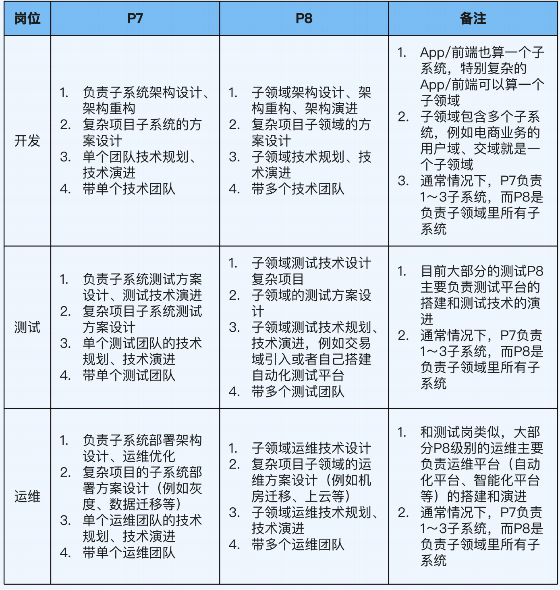
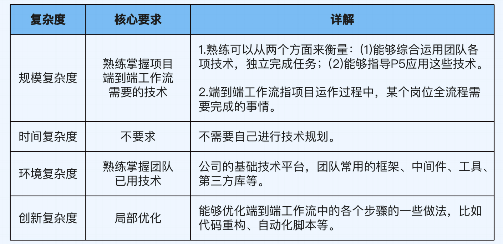
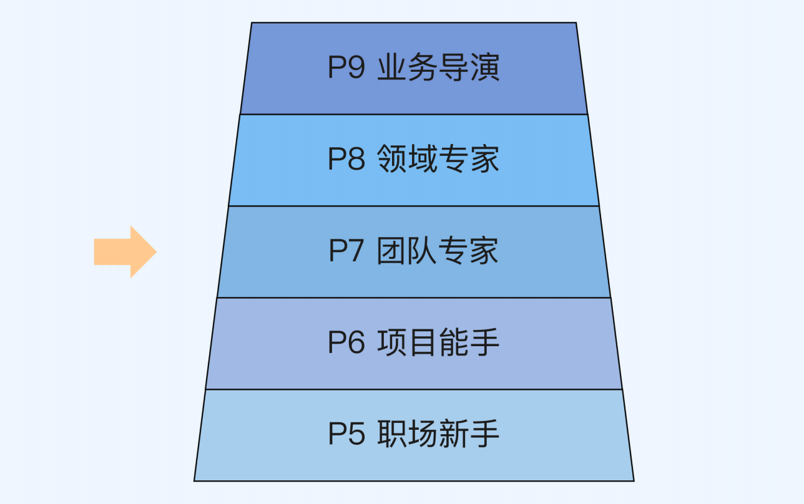
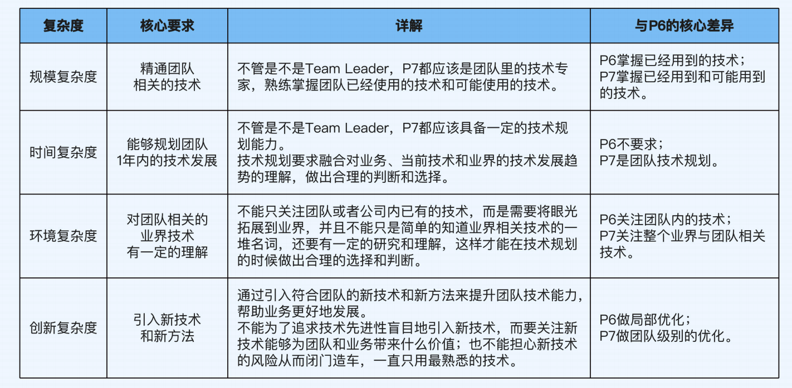
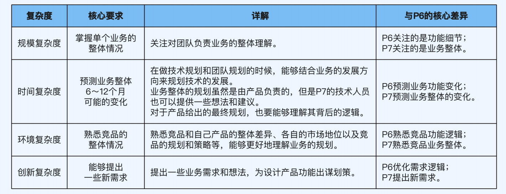
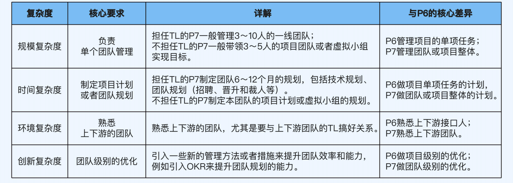

# 什么样的人更容易晋升

## 主动做事
鼓励团队成员主动发现问题，提出建议。同时自己也要帮助组员成长，分配具有挑战性的任务。
除了在自身领域主动以外，还应该多了解与自身相关的领域，这是评判技术人员综合能力的重要考察内容，如：
* 业务功能上线后业务效果如何？
* 业务效果不好的可能原因是什么？
* 整体的业务机房的部署结构是什么样的？
* ...
这些信息，有的需要找产品运营要数据，有的需要跟业务负责人探讨，还有的需要和另外 的团队交流，都需要你主动去找机会才有可能获取的。

## 不断挖掘成长点
不能只做熟练工，如果当前工作可以得心应手地轻松完成了，就应该尝试更高难度、更高复杂度 的事情了，而不是一味地刷熟练度，沉迷在自我感觉良好的状态里。
另外，不管事情做好了还是没做好，你都应该多做复盘总结，找到可以提升优化的点。

## 学习有价值的技能
在技术领域，要学习的技术无穷尽也，而我们在学习一项技能的时候，需要考虑这项技能对当前工作是否有用，对晋升是否有用，有时我们需要更功利化一点。
公司是需要能产出价值的人，学习的技能应该能提高公司的产出才能被公司认可。

> 现在我们以“人工智能”为 例，用价值原则来判断一下，如果你的时间很宝贵，还值不值得学。
如果你是 P5/P6 级别，做 Android App 业务功能开发，那么用不着学人工智能，因为 你现在主要工作还是把开发任务做好。
如果你是 P7/P8 级别，是带一个团队做 Android 开发的 Team Leader，或者是负责 App 架构设计的技术专家，可能就有必要学人工智能了，因为你需要规划和思考团队与 业务下一步的技术演进方向跟实施步骤。
如果你是 P9 级别，那么不管是什么技术方向，肯定都要了解人工智能，因为这是一个 新的技术领域和方向，而新的技术往往会带来业务上质的突破。
价值原则除了告诉我们某项技能值不值得学以外，还能告诉我们要学到什么程度。还是 以“人工智能”为例，不同的人来学，学习的方法和深度也是不一样的，一定要避免陷 入“学习等于看源码”这个误区。
如果你是做算法的，人工智能应用场景、算法原理、框架源码都需要去学习；
如果你是做 App 开发的，学习的重点可能就是人工智能的原理和应用场景了；
如果你是 P9 级别，学习的重点可能是人工智能的基本原理、行业的发展现状、成功和 失败的案例，还有相关的产业链信息。

# 如何才能获得晋升

## 提前做下一级别的事
在当前级别做下一级别事情的人，才有机会晋升。比如 P6 升 P7 就需要带过小项目或小团队，所以工作中就要去争取这样的机会。

## 做好当前级别的事
然而要想提前做下一级别的事，前提就是要先做好当前级别的事。比如带团队，如果自身技术水平还没有团队中其它同事水平高，自然就争取不到这个机会。
通常我们需要把当前级别做的事提升到精通水平，才能晋升到下一级。

#### 什么是熟练，精通呢？
熟练意味着“做好”。跟基础不同，熟练是指能够把当前级别的事情做好。做好体现在做 事熟练，掌握了做事的最佳实践，能够保证效率和质量，能够拿到好的结果。
精通意味着“优化”。精通是指能够优化当前级别的事情，比如采取不同的方式、思维和 工具来做同样的事情，并取得突破。
如果要再区分一下“做好”和“优化”，我们可以这么理解：做好只是意味着掌握了别人 总结的成熟经验，而优化意味着你自己创造了新的经验。
什么算“新的经验”呢？并不是说要“全球首创”，而是说在自己所处的环境中（团队、 业务线、公司等）是新的。比如“微服务”架构，别的公司可能早就在用了，但如果把它 引入到这家公司的人是你，这就算你的优化成果。
**注意：这个标准是用来判断某个级别的能力，而不是单项技术水平的能力。**

#### 通用晋升步骤
第 1 步，按照晋升原则的指导，在当前级别拿到好的结果，为公司创造价值，同时把当前 级别要求的能力提升到精通程度（比如从 P6- 到 P6+），这样你才有机会成为晋升备选人员。
第 2 步，到了精通程度之后，对照下一级别的要求来提升自己的各种能力（比如到了 P6+ 之后，按照 P7- 的要求来提升自己），为可能的晋升机会做好准备。
第 3 步，主动寻找工作机会，尝试做下一个级别事情（比如提升了 P7 的能力之后，找 P7 级别做的事情来做，争取成为负责人，主导事情的推进和落地），继续拿到好的结果，向主管证明你具备下一级的能力。
第 4 步，拿到工作结果之后申请晋升，向评委介绍你做过的事情，展示相关的能力和结 果，证明自己具备了下一级别要求的能力。

# 职级档次介绍
现在主要关注 P6 和 P7 的差别：
P6 就是个熟练的开发人员，能独立完成手上的工作。而 P7 就是带有管理性质的岗位，需要对项目进行规划、排期、风险预警等，最终将项目分配到每个组员上推动团队完成开发任务。
  
  

### P5
职场新手，由P6、P7带着做项目，主要任务是快速学习，提升开发能力，完成从新人到熟练工的转变。

### P6
熟练掌握开发技术，能独立完成任务。
  

### P7
 P7 可以分为两种。一种是担任 Team Leader 的 P7，一般带 3～10 人的专业团队，
也就是组织结构概念上的团队，核心职责是团队管理。
另一种是作为团队骨干的 P7，他们虽然不是 Team Leader，但是一般也会负责某个项目
或者专项小组（比如 Android 性能优化小组和前端效能提升小组），带 3～5 人的虚拟团
队。他们不承担团队管理职责，只关注小组目标的实现。
**P7 的主要提升目标是成为让人信服的团队专家。**
  
P7 在技术维度上的核心要求是精通团队相关技术。

**P7技术详细要求**
  

另外 P7 要注意不要因为管理而丢掉技术。技术才是核心竞争力。

#### 提升技术宽度
如果说 P6 要重点提升技术深度（不但知道 what，还知道 why），那么 P7 还要重点提升
技术宽度（不但知道 why，还知道 which）。
也就是说，P6 只要深入理解技术原理和技术细节就行了，而 P7 还要知道怎么根据业务和
团队的情况来选择合适的技术，哪怕现在暂时还用不到。
提升技术深度适合用链式学习法，纵向贯穿，自顶向下，挖深挖透；提升技术宽度适合用
比较学习法，横向拉通，比较差异，分析优劣。
所以如果你身处大公司，在提升了技术宽度之后，就有机会使用一条晋升秘诀（或者说潜
规则），那就是**多考虑引入新技术**。一方面，新技术在一般情况下确实能够给业务带来更
好的结果；另一方面，懂新技术的人不多，早入坑就有先发优势，很容易被认为是专家。

>#在用新技术的时候，我更偏向与用成熟的技术，如果是不成熟的技术，直接去拿来用还不如自研，因为风险太大。

#### 关注业务整体
在业务维度，P6 更关注业务细节，而 P7 更关注业务整体。这里的业务范围是自己团队负责的业务。
  

#### 团队管理
  
