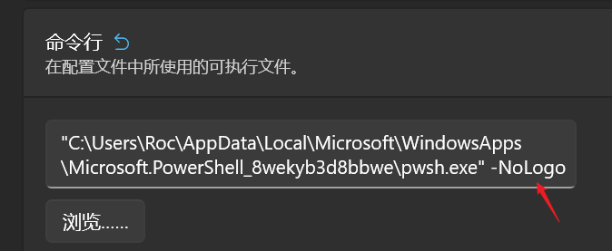

# 安装
1. 跟着官网步骤安装：https://ohmyposh.dev/docs/installation/windows，网上的很多安装方式是老版本的，可能不适用。
2. 需要跟着官网教程安装 meslo 字体，否则路径上的图标会显示乱码。
    `oh-my-posh font install meslo`
    vscode中使用`ctrl + ,`打开设置，搜索`terminal.integrated.fontFamily`筛选出终端字体配置, 在最前面添加`MesloLGM Nerd Font`字体。
3. 应用posh时，官网教程里的`notepad $PROFILE`这一步，默认是没此文件的，需要按教程里的`New-Item -Path $PROFILE -Type File -Force`创建。
4. `notepad $PROFILE`这个文件就是 posh 配置文件，需要在文件里添加 posh 配置。如：
    ```bash
    # 使用 --config 配置posh，最后使用 | Invoke-Expression 让posh生效
    oh-my-posh init pwsh --config "takuya" | Invoke-Expression
    ```
    注意：要使用theme，只需要使用主题名"takuya"即可，而不需要像教程中那样使用其他路径。
5. pwsh中执行`. $PROFILE`使配置生效。

==安装posh或posh相关插件时，出现提示输入 a——全部同意 即可。==

# 关闭新版本提示
在PowerShell的设置中，命令行添加参数`-NoLogo`，即可关闭新版本提示。
  

# 安装插件
安装后修改了配置文件需要执行`. $PROFILE`使配置生效。
## Zlocation
Zlocation类似autojump或是zsh-z的插件，可以用关键字直接跳转到想去资料夹，比cd更高效。
使用以下命令安装：
```bash
Install-Module ZLocation -Scope CurrentUser
```
安装后在`$PROFILE`文件里添加以下代码：
```bash
# 加载 ZLocation 插件
Import-Module ZLocation
# 使用 --config 配置posh，最后使用 | Invoke-Expression 让posh生效
oh-my-posh init pwsh --config "takuya" | Invoke-Expression
```
即可使用 ZLocation 插件了。
ZLocation的常用命令
- 查看已知文件夹的位置：z
- 进入包含对应字符串的文件夹，可用用Tab键来选择具体的文件夹：z xxx
- 回到之前的文件夹：z -

## posh-git
posh-git可以让Git指令用Tab键自动补全。
安装：`PowerShellGet\Install-Module posh-git -Scope CurrentUser -Force`
安装后在`$PROFILE`文件里添加以下代码：
```bash
Import-Module posh-git
...
```

# 小技巧
* 使用快捷键`win + ~`可以快速在顶部打开一个PowerShell窗口。注：快捷键设置中的`sc(41)`就是`~`键。
