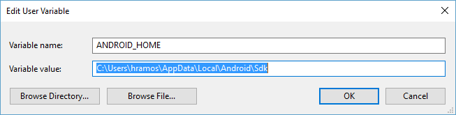
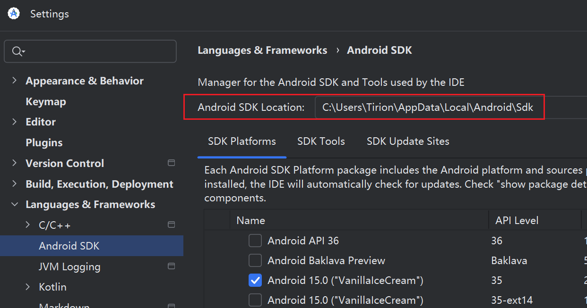
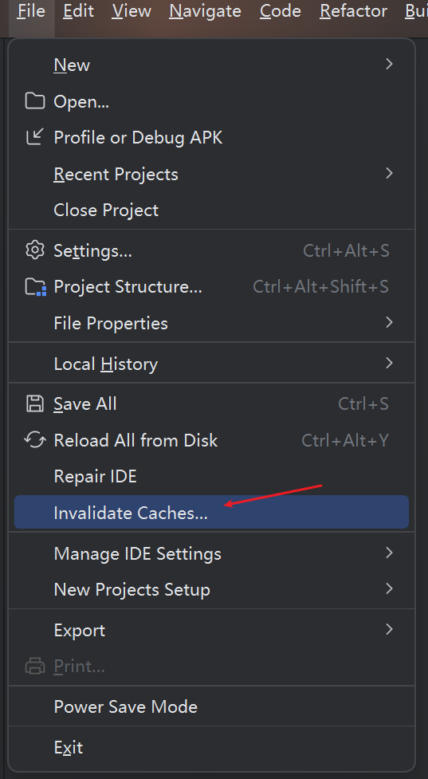
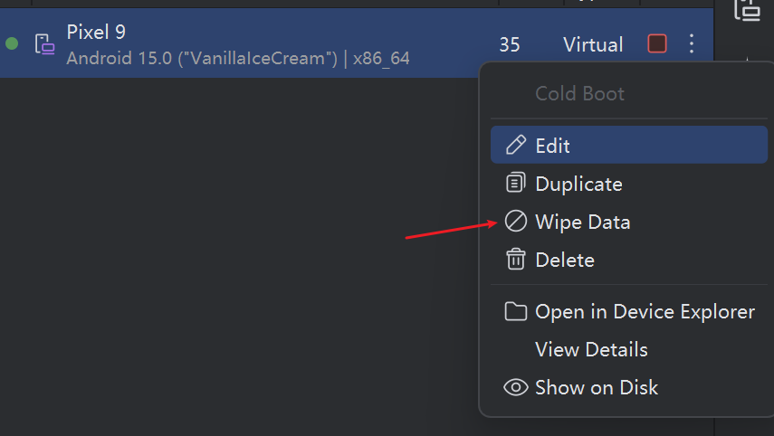
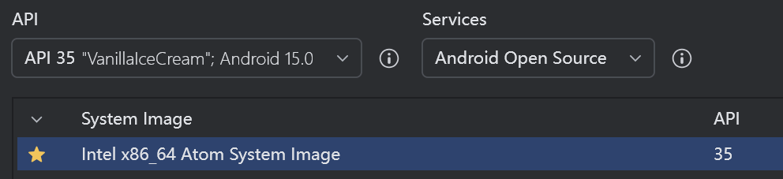

## 使用 Expo 创建项目
> Expo是一组工具、库和服务，可以通过编写JavaScript来构建本地的iOS和android应用程序。说人话，就是在React Native的基础上再封装了一层，让我们的开发更方便，更快速。
>* 做过移动端的同学在做跨平台之前肯定会担心一个点，就是各种原生功能（相机，相册，定位，蓝牙等等），使用expo的话，会比你开发一个裸的React Native真的会快很多，而且会少踩很多坑
>* 没有做过移动端的前端那就更需要这个了，不然移动端的一些隐藏的限制和坑，会让你很头疼

使用 `npx create-expo-app@latest` 命令创建一个 expo 的 RN 项目（可以使用 --template xxx 指定其它模板，不过一般默认就好）。终端需要翻墙才能正常下载，可以开启 clash 的 TUN MODE。
正常运行后会有提示让你输入项目名称等，按提示使用即可完成项目的创建。

## Android Studio 环境搭建
1. 确保已安装 JAVA 的 JDK，推荐17版本，更高的版本可能会有问题。node 版本用18以上，最新的就行。
    [open JDK 安装说明](https://www.cnblogs.com/tinywan/p/15260430.html)
2. 下载 Android Studio 并安装，注意下载的时候需要代理，并且出现过某些地区的代理无法下载的情况，多试下不同地区的代理。
3. Android Studio 中，选择 Setting → Languages & Frameworks → Android SDK，确保 SDK Platforms 下的 Android 15 (VanillaIceCream) 和最新的 Android API 被选中。点击 SDK Tools，点击底部的 Show Package Details，确保 35.0.0 被选中。
    [expo 文档中有说明](https://docs.expo.dev/get-started/set-up-your-environment/?mode=development-build&platform=android&device=simulated&buildEnv=local)
4. 配置环境变量，`控制面板\用户帐户\用户帐户` 中点击更改我的环境变量，用户变量中添加 ANDROID_HOME 环境变量，值为 SDK 目录，如 `C:\Users\Tirion\AppData\Local\Android\Sdk`。
  
也可以在 Android Studio 中看到具体位置：
  
打开 powershell 输入 `Get-ChildItem -Path Env:\`，确保 ANDROID_HOME 已被添加。
然后再 PATH 中新建`%LOCALAPPDATA%\Android\Sdk\platform-tools`以添加 platform-tools。在资源管理器地址栏中输入`%LOCALAPPDATA%\Android\Sdk\platform-tools`就能进入相应目录，如果进不去可能是有问题。

此环境安装后，应该就可以使用 adb 命令了，adb 命令就在 platform-tools 目录下。可以使用 `adb --version` 查看。

## 使用 expo 编译
[expo 官方文档](https://docs.expo.dev/get-started/set-up-your-environment/?mode=development-build&buildEnv=local&platform=android&device=simulated)
文档默认勾选了使用 eas 进行构建（使用 expo 云编译），外网被墙，不建议使用此方法。

本地编译：
1. 运行 `npx expo install expo-dev-client`
2. 运行 `npx expo run:android` 打包编译安卓应用，打包后会自动打开安卓模拟器，具有 `npx expo start` 的功能。后续也可以运行 `npx expo start` 启动开发服务，启动后控制台会有提示，按 a 可打开安卓模拟器。
3. 修改 app 目录下的代码，保存时模拟器就会自动更新。也可以在控制台按 r 重载。

### 编译问题
编译过程中遇到很多问题，导致报错无法正常编译。。。
具体没有明确的解决办法，都是各种尝试后才正常运行起来。
1. npm 源用 npm 自己的，不使用国内镜像
2. 运行 `npx expo install expo-dev-client` 后，再运行一次 `npm i`，再运行 `npx expo install expo-dev-client`。。。
3. 清除 Android Studio 缓存：
  
  
4. 安卓模拟器选择指定的版本：
  
5. 使用 powershell 而不是 git-bash
6. 运行 `expo start --clear` 
7. 确保 JDK 版本与推荐的一致

反正首次尝试的时候真的是各种报错，最后莫名其妙就跑起来了。。。

### 注意
使用 expo 或直接用 RN 还是有很多坑，需要原生支持才行，尤其是国内的生态插件如地图、支付等都不能直接用，需要原生支持。反而 uni-app 会进行支持。
网上也有很多人反应 expo 打包就是经常报错。。。