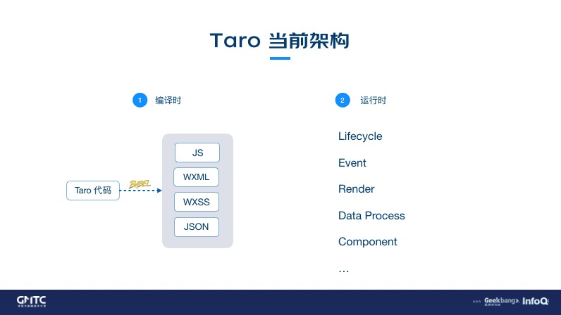

[Taro 当前架构](https://docs.taro.zone/blog/2020-01-02-gmtc#taro-%E5%BD%93%E5%89%8D%E6%9E%B6%E6%9E%84)

# Taro 当前架构
Taro 当前的架构主要分为：编译时 和 运行时。

其中编译时主要是将 Taro 代码通过 **Babel** 转换成 小程序的代码，如：JS、WXML、WXSS、JSON。

运行时主要是进行一些：生命周期、事件、data 等部分的处理和对接。
  


# 个人理解
[Taro3 跨端跨框架原理初探](https://juejin.cn/post/6989968343163731981)
[Rax 小程序运行时方案解密与思考](https://zhuanlan.zhihu.com/p/271886068)
taro3 在运行时，也就是编译后的代码中也有 taro.js 等文件，代码中模拟实现了 DOM, BOM 的各种方法，也就可以使用 document.appendChild 这样的方法了。taro 模拟的 react-dom 中也就是通过这些方法来创建修改 DOM 节点。
但是，调用 document.appendChild 时并不会真正的往小程序中添加节点，因为小程序中并不支持这样的功能。所以当调用 document.appendChild 这样的方法的时候，实际上是在构建一颗虚拟 DOM 树，我们在页面上操作创建删除节点的时候会先操作这颗虚拟 DOM 树，操作完成后会将这颗虚拟 DOM 树，即一个 JS 对象通过小程序的 setData(vDom) 提交到视图层，而视图层那边是一个引用自身的递归 template，在这个递归 template 中就会根据虚拟 DOM 的类型和各种属性渲染出对应的节点元素。

当然，如果每次 setData() 都是将整个页面的 vDom 传入必然会造成性能问题，所以在框架中做了更多的优化。比如计算数据更新的 path，实现局部更新。

比如某次更新节点的 class 属性时，setData 的数据可能是：
```json
{ "root.children.[0].children.[1].class": "active" }
```