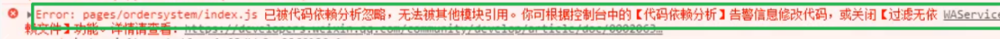

# uniapp
## input 校验无法同步渲染
在使用 input 组件时，绑定了 @input 事件进行校验并限制输入内容，但是在输入时发现视图没有同步更新。
```html
    <input
        :value="text"
        type="digit"
        class="input"
        placeholder="/"
        @input="handleDecimalInput($event)"
    >
```

## 依赖分析忽略
uniapp 开发时可能出现小程序依赖分析错误，导致报“Error: xxx.js 已被代码依赖分析忽略，无法被其他模块引用”：
  
解决方法是修改`manifest.config.ts`文件，新增`ignoreDevUnusedFiles: false`和`ignoreUploadUnusedFiles: false`，如下：
```ts
  /* 小程序特有相关 */
  'mp-weixin': {
    appid: VITE_WX_APPID,
    setting: {
      urlCheck: false,
      // 是否启用 ES6 转 ES5
      es6: true,
      minified: true,
      ignoreDevUnusedFiles: false, // 开发时忽略未使用的文件
      ignoreUploadUnusedFiles: false, // 上传时忽略未使用的文件
    },
```

```ts
// 限制输入为两位小数的数字
function handleDecimalInput(event: any) {
  let value = event.detail.value;
  // 限制输入为两位小数的数字
  value = decimalLimit(value, 2);
  text = value;
}
```
这里更新text数据，我输入1符合条件，更新text为1，然后渲染正常；然后我输入s就是1s，校验后得到的结果还是1，赋值给text，此时数据没变，而vue的机制是model没变化就不会重新渲染template，所以页面就不会更新。输入框中就会显示1s。
在html中，可以使用`event.target.value = value`来操作DOM强制更新input输入框中显示的内容，而小程序无法这样操作DOM更新。尝试了使用key的修改，但是也没有效果。
解决方法是：
```ts
function handleDecimalInput(event: any) {
  let value = event.detail.value;
  text = value; // 先用原始值更新text，然后再校验
  value = decimalLimit(value, 2);
  nextTick(() => { // 等下一个事件循环，确保text更新后再执行。否则会触发批处理机制，原始值无法赋值成功，也没法正常渲染
    text = value; // 再用校验后的值更新text
  });
}
```

# unibest
## 配置
### eslint stylistic
unibest 使用 uniHelper 配置 eslint，在 eslint.config.mjs 中：
```js
export default uniHelper({
```
uniHelper 又使用了 eslint stylistic 插件，此插件可以定义 eslint 的规则，当使用此插件定义了某个规则后，要修改此规则也要改个方式。
如 unibest 默认配置为了语句末尾不加分号，如果要加上分号，需要在 eslint.config.mjs 中添加如下配置：
```js
rules: {
    // 这里 unibest 使用 eslint stylistic 配置的，所以也要改 eslint stylistic 的相关配置，而不能直接改 semi
    '@stylistic/semi': ['warn', 'always'],
    // 'semi': ['warn', 'always'], // 这样就无效
},
```
另外此插件和 prettier 配置有冲突，所以项目中不使用 prettier。unibest 也集成了样式检查， stylelint 插件也需要禁用。

# APP
## 自定义头部
小程序头部有胶囊，自定义头部需要计算状态栏+胶囊的高度，并将标题显示和胶囊一行。而APP没有胶囊，只需要获取状态栏高度+自己觉得合适的高度就行。所以uniapp中需要写兼容性代码：
```ts
// useCustomHeader 自定义头部高度计算
import { systemInfo } from '@/utils/systemInfo';

let statusBarHeight = 0; // 状态栏高度
let menuButtonHeight = 0; // 右上角胶囊高度
let menuButtonLeft = 0; // 胶囊距左边距离
let menuButtonRight = 0; // 胶囊距右边距离
let menuButtonWidth = 0; // 胶囊宽度
let headerHeight = 0; // 标题栏高度
let contentHeight = 0; // 内容高度（页面除去 header 的高度）

const gap = 10; // 标题栏相对于胶囊的内边距

function useCustomHeader() {
  const getHeight = () => {
    if (!statusBarHeight || !menuButtonHeight) {
      let scale = 0;
      // #ifndef APP-PLUS
      const { top, left, right, width, height } = uni.getMenuButtonBoundingClientRect() || {};
      scale = Number.parseFloat((750 / systemInfo.screenWidth).toFixed(4));
      statusBarHeight = top * scale + 2; // +2后高度才够
      menuButtonHeight = height * scale;
      menuButtonLeft = left * scale;
      menuButtonRight = right * scale;
      menuButtonWidth = width * scale;
      headerHeight = statusBarHeight + menuButtonHeight + gap;
      contentHeight = systemInfo.screenHeight * scale - headerHeight + 2; // 加2后高度才够
      // #endif
      // #ifdef APP-PLUS
      scale = Number.parseFloat((750 / systemInfo.screenWidth).toFixed(4));
      statusBarHeight = systemInfo.statusBarHeight * scale;
      menuButtonHeight = 30 * scale; // 这里30是大概写的个值，看起来顺眼就行
      headerHeight = statusBarHeight + menuButtonHeight + gap;
      contentHeight = systemInfo.screenHeight * scale - headerHeight + 2; // 加2后高度才够
      // #endif
    }
  };

  getHeight();

  // 单位 rpx
  return {
    statusBarHeight,
    menuButtonHeight,
    menuButtonLeft,
    menuButtonRight,
    menuButtonWidth,
    gap,
    headerHeight,
    contentHeight,
  };
};

export default useCustomHeader;
```


# 组件
## 组件导入
普通的vue项目，要使用组件需要在页面中导入组件，如：
```html
<template>
  <div>
    <custom-header-page title="蓝牙" />
  </div>
</template>

<script setup lang="ts">
import CustomHeaderPage from '@/components/customHeaderPage.vue';
</script>
```
但是uniapp增加了easycom机制，components中的组件自动导入功能，所以在页面中使用组件时不需要导入组件，直接使用即可。
可以在配置中增加自定义规则：
```js
  easycom: {
    autoscan: true,
    custom: {
      '^fg-(.*)': '@/components/fg-$1/fg-$1.vue',
      '^wd-(.*)': 'wot-design-uni/components/wd-$1/wd-$1.vue',
      '^(?!z-paging-refresh|z-paging-load-more)z-paging(.*)':
        'z-paging/components/z-paging$1/z-paging$1.vue',
    },
```
疑问：这里按理说组件应该在`@/components/customHeaderPage/customHeaderPage.vue`，但是我没创建`customHeaderPage`目录，直接在`@/components`目录下创建了`customHeaderPage.vue`文件，也能正常使用。感觉应该是uniapp自带的导入就包括这个规则。

## wot-ui
使用组件时必须用`<wd-button>`，不能用`<WdButton>`。
### 主题定制
在 store/theme.ts 中定义主题，开发的时候可以先在开发者工具中查看使用组件的样式，找到要修改的样式，然后在 themeVars 中定义。
比如样式为`height: var(--wot-button-medium-height, 36px);`可以得到要改的CSS变量为`--wot-button-medium-height`，所以要配置的名称为`buttonMediumHeight`。
```ts
    /** 主题变量 */
    const themeVars = ref<ConfigProviderThemeVars>({
        // themeVars 内的值会被转换成对应 CSS 变量
        // 比如 buttonPrimaryBgColor 会转换成 `--wot-button-primary-bg-color`
        // buttonPrimaryBgColor: '#07c160',
        colorTheme: '#2563eb',
        colorSuccess: '#34d19d',
        colorWarning: '#f0883a',
        colorDanger: '#fa4350',
        colorWhite: '#fff',
        buttonSmallHeight: '60rpx',
        buttonSmallRadius: '8rpx',
        buttonMediumHeight: '80rpx',
        buttonMediumRadius: '12rpx',
    });
```
### button
带图标的按钮使用 icon 属性，值为图标名称，图标名称可以在 wot-ui 的 Icon 中查看。
```html
      <wd-button
        icon="search1"
        :round="false"
        class="btn-rescan flex items-center justify-center bg-primary text-white"
        :disabled="bluetooth.isScanning.value"
        @click="rescanDevices"
      >
        重新扫描
      </wd-button>
```

## unocss
### 配置
在 unocss.config.ts 中配置 unocss。主要有 safelist 配置动态图标用于自定义 tabbar 的展示；rules 配置自定义 class 样式； theme 配置中的 colors，配置主题色；shortcuts 配置自定义快捷 class。
```ts
  // 将多个class合并成一个class
  shortcuts: [
    {
      center: 'flex justify-center items-center',
    },
  ],
  // 动态图标需要在这里配置，或者写在vue页面中注释掉
  safelist: ['i-carbon-home', 'i-carbon-user', 'i-carbon-search', 'i-carbon-analytics', 'i-carbon-settings', 'i-carbon-chart-bullet', 'i-carbon-user-avatar'],
  // 自定义 class 名应用自定义样式
  rules: [
    [
      'p-safe',
      {
        padding:
          'env(safe-area-inset-top) env(safe-area-inset-right) env(safe-area-inset-bottom) env(safe-area-inset-left)',
      },
    ],
    ['pt-safe', { 'padding-top': 'env(safe-area-inset-top)' }],
    ['pb-safe', { 'padding-bottom': 'env(safe-area-inset-bottom)' }],
    ['card-shadow', { 'box-shadow': '0 1px 3px 0 rgb(0 0 0 / 0.1), 0 1px 2px -1px rgb(0 0 0 / 0.1)' }],
  ],
  theme: {
    // 自定义动画。设置后可通过 class 名 animate-scale-opacity 调用。
    // 也可以只设置 keyframes 然后 animate-[scale-opacity_1.5s_infinite] 这样调用
    // 官方文档：https://unocss.dev/presets/wind3#animates
    animation: {
      keyframes: {
        'scale-opacity': `{
          0% {
            transform: scale(0.8);
            opacity: 0.8;
          }
          50% {
            transform: scale(1.2);
            opacity: 1;
          }
          100% {
            transform: scale(0.8);
            opacity: 0.8;
          }
        }`,
        'rotate-scale': `{
          0% { transform: rotate(0deg) scale(1) }
          50% { transform: rotate(180deg) scale(1.2) }
          100% { transform: rotate(360deg) scale(1) }
        }`,
      },
      durations: {
        'scale-opacity': '1.5s',
        'rotate-scale': '2s',
      },
      counts: {
        'scale-opacity': 'infinite',
        'rotate-scale': 'infinite',
      },
    },
    colors: {
      /** 主题色，用法如: text-primary | bg-primary */
      primary: 'var(--wot-color-theme, #0957DE)',
    },
    fontSize: {
      /** 提供更小号的字体，用法如：text-2xs */
      '2xs': ['20rpx', '28rpx'],
      '3xs': ['18rpx', '26rpx'],
    },
  },
```

### @apply
多个样式复用，除了使用 shortcut, rules 配置外，还可以在组件中的 css 中使用 @apply 进行复用。
```html
      <text class="label">{{ props.minLabel }}</text>
      <text class="label">{{ props.maxLabel }}</text>
```
```css
.label {
  /* 使用 @apply 应用 unocss 的 class 样式 */
  @apply text-xs text-gray-400;
}

/* 转换后的结果为 */
.label.data-v-5b1c0abe {
    font-size: 24rpx;
    line-height: 32rpx;
    --un-text-opacity: 1;
    color: rgba(156, 163, 175, var(--un-text-opacity)) /* #9ca3af *//* #9ca3af *//* #9ca3af */;
}
```
不过要注意的是，这样写就会生成一个新的 class，比如这里会新增一个名为 label 的 class，而不是复用 unocss 的 class，就会增加 css 的体积。

### 选择子元素
复用样式还有种方式是在父元素中选择子元素应用样式：
```html
<div class="[&_span]:cursor-pointer">
<span />
<span />
...
<span />
</div>
```
其中`&`表示自己，`_`表示空格，换成`>`也行。还可以用`*:`表示所有后代。
这个也会增加 css 的体积。

# 蓝牙
## 重新扫描扫不到设备
首次扫描扫出设备后，重新进行扫描，但是就扫不到之前的设备了。解决方法有二：
1. 关闭蓝牙 closeBluetoothAdapter 重新初始化。
2. startBluetoothDevicesDiscovery 参数 allowDuplicatesKey 设置为 true 并且搜索前先断开之前的连接 closeBLEConnection，可能有些设备连接着是不能被搜索的。
建议使用第一种方法，每次扫描前先关闭再初始化。第二种方法会扫描出很多设备，需要自己过滤。
## 扫描很慢
如果出现扫描很久才出结果的情况，可能是因为 startBluetoothDevicesDiscovery 中设置了 interval 参数。当设置此参数后，则会在到了 interval 时间后才会返回扫描结果，从而感觉很慢。