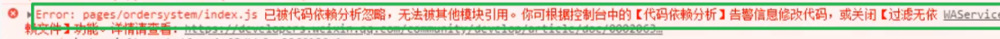
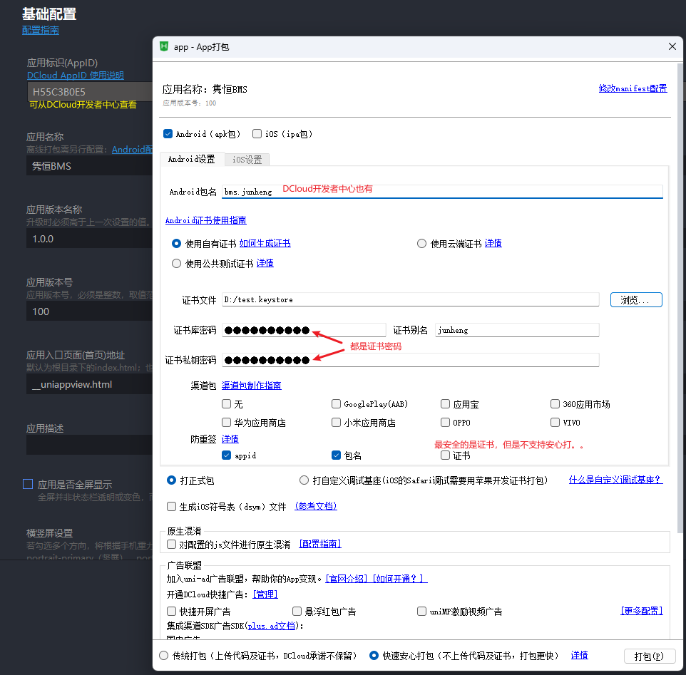
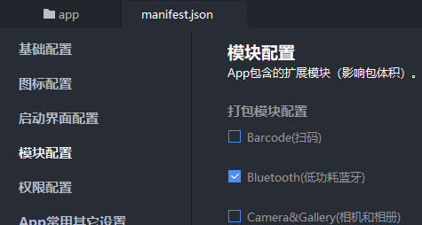
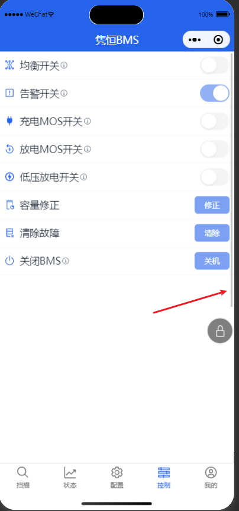

# uniapp
## input 校验无法同步渲染
在使用 input 组件时，绑定了 @input 事件进行校验并限制输入内容，但是在输入时发现视图没有同步更新。
```html
    <input
        :value="text"
        type="digit"
        class="input"
        placeholder="/"
        @input="handleDecimalInput($event)"
    >
```
```ts
// 限制输入为两位小数的数字
function handleDecimalInput(event: any) {
  let value = event.detail.value;
  // 限制输入为两位小数的数字
  value = decimalLimit(value, 2);
  text = value;
}
```
这里更新text数据，我输入1符合条件，更新text为1，然后渲染正常；然后我输入s就是1s，校验后得到的结果还是1，赋值给text，此时数据没变，而vue的机制是model没变化就不会重新渲染template，所以页面就不会更新。输入框中就会显示1s。
在html中，可以使用`event.target.value = value`来操作DOM强制更新input输入框中显示的内容（后面测试web里双向绑定能生效，不用手动更新DOM），而小程序无法这样操作DOM更新。尝试了使用key的修改，但是也没有效果。
解决方法是：
```ts
function handleDecimalInput(event: any) {
  let value = event.detail.value;
  text = value; // 先用原始值更新text，然后再校验
  value = decimalLimit(value, 2);
  nextTick(() => { // 等下一个事件循环，确保text更新后再执行。否则会触发批处理机制，原始值无法赋值成功，也没法正常渲染
    text = value; // 再用校验后的值更新text
  });
}
```

## 依赖分析忽略
uniapp 开发时可能出现小程序依赖分析错误，导致报“Error: xxx.js 已被代码依赖分析忽略，无法被其他模块引用”：
  
解决方法是修改`manifest.config.ts`文件，新增`ignoreDevUnusedFiles: false`和`ignoreUploadUnusedFiles: false`，如下：
```ts
  /* 小程序特有相关 */
  'mp-weixin': {
    appid: VITE_WX_APPID,
    setting: {
      urlCheck: false,
      // 是否启用 ES6 转 ES5
      es6: true,
      minified: true,
      ignoreDevUnusedFiles: false, // 开发时忽略未使用的文件
      ignoreUploadUnusedFiles: false, // 上传时忽略未使用的文件
    },
```

## v-if显示异常
使用`v-if`,`v-else`控制组件显示时，发现组件打包成安卓APP显示有异常，是因为它们会导致组件元素的删除。主要表现在tabbar中的组件由于是始终保持渲染状态的，在其它页面的操作导致tabbar组件的显示状态变化，就容易出现切换回tabbar后页面显示异常的问题。
解决方法是使用`v-show`来控制显示隐藏，`v-show`只是通过CSS的`display`属性来控制显示隐藏，不会删除元素。所以在 uniapp 中应该尽量使用`v-show`来控制组件的显示隐藏。
**后面开发中也发现了`v-show`显示异常，`v-if`显示正常的情况，所以遇到显示异常还是需要自己尝试。**

## 下拉刷新
### scroll-view 下拉刷新
在开发 scroll-view 下拉刷新时，发下往下滚动页面后，往回滚会触发下拉刷新，从而无法回滚。解决方法是要将给page设置样式：
```css
page {
  height: 100vh;
  overflow: hidden;
}
```
scroll-view也要设置高度，才能滚动：
```html
<!-- 50px 是 tabbar 的高度 -->
<scroll-view
  v-show="bluetooth.connectedDevice.value"
  class="pb-20rpx"
  :style="`height: calc(100vh - 50px - ${headerHeight}rpx)`"
  scroll-y
  refresher-enabled
  :refresher-triggered="refresherTag"
  :refresher-threshold="100"
  enhanced
  @refresherrefresh="onRefresh"
>
```
页面的下拉刷新会导致fixed定位的头部也会跟着一起下拉，所以选用scroll-view的下拉刷新。不过需要计算scroll-view的高度。

## 定时器
### 前后台切换
当小程序切到后台后，小程序里的代码会停止运行，如果切到后台的时间较长，在切回前台时，定时器就可能停止运行。
解决方法是在切回前台时，重新启动定时器。而切到后台时停止定时器。
```ts
// 定时器
let timer = null;
// 启动定时器
function startTimer() {
  timer = setInterval(() => {
    // 定时器任务
  }, 1000);
}
// 停止定时器
function stopTimer() {
  if (timer) {
    clearInterval(timer);
    timer = null;
  }
}
// 切回前台时重新启动定时器
onShow() {
  startTimer();
}
// 切到后台时停止定时器
onHide() {
  stopTimer();
}
```

# unibest
## 配置
### eslint stylistic
unibest 使用 uniHelper 配置 eslint，在 eslint.config.mjs 中：
```js
export default uniHelper({
```
uniHelper 又使用了 eslint stylistic 插件，此插件可以定义 eslint 的规则，当使用此插件定义了某个规则后，要修改此规则也要改个方式。
如 unibest 默认配置为了语句末尾不加分号，如果要加上分号，需要在 eslint.config.mjs 中添加如下配置：
```js
rules: {
    // 这里 unibest 使用 eslint stylistic 配置的，所以也要改 eslint stylistic 的相关配置，而不能直接改 semi
    '@stylistic/semi': ['warn', 'always'],
    // 'semi': ['warn', 'always'], // 这样就无效
},
```
另外此插件和 prettier 配置有冲突，所以项目中不使用 prettier。unibest 也集成了样式检查， stylelint 插件也需要禁用。

# APP
## 自定义头部
小程序头部有胶囊，自定义头部需要计算状态栏+胶囊的高度，并将标题显示和胶囊一行。而APP没有胶囊，只需要获取状态栏高度+自己觉得合适的高度就行。所以uniapp中需要写兼容性代码：
```ts
// useCustomHeader 自定义头部高度计算
import { systemInfo } from '@/utils/systemInfo';

let statusBarHeight = 0; // 状态栏高度
let menuButtonHeight = 0; // 右上角胶囊高度
let menuButtonLeft = 0; // 胶囊距左边距离
let menuButtonRight = 0; // 胶囊距右边距离
let menuButtonWidth = 0; // 胶囊宽度
let headerHeight = 0; // 标题栏高度
let contentHeight = 0; // 内容高度（页面除去 header 的高度）

const gap = 10; // 标题栏相对于胶囊的内边距

function useCustomHeader() {
  const getHeight = () => {
    if (!statusBarHeight || !menuButtonHeight) {
      let scale = 0;
      // #ifndef APP-PLUS
      const { top, left, right, width, height } = uni.getMenuButtonBoundingClientRect() || {};
      scale = Number.parseFloat((750 / systemInfo.screenWidth).toFixed(4));
      statusBarHeight = top * scale + 2; // +2后高度才够
      menuButtonHeight = height * scale;
      menuButtonLeft = left * scale;
      menuButtonRight = right * scale;
      menuButtonWidth = width * scale;
      headerHeight = statusBarHeight + menuButtonHeight + gap;
      contentHeight = systemInfo.screenHeight * scale - headerHeight + 2; // 加2后高度才够
      // #endif
      // #ifdef APP-PLUS
      scale = Number.parseFloat((750 / systemInfo.screenWidth).toFixed(4));
      statusBarHeight = systemInfo.statusBarHeight * scale;
      menuButtonHeight = 30 * scale; // 这里30是大概写的个值，看起来顺眼就行
      headerHeight = statusBarHeight + menuButtonHeight + gap;
      contentHeight = systemInfo.screenHeight * scale - headerHeight + 2; // 加2后高度才够
      // #endif
    }
  };

  getHeight();

  // 单位 rpx
  return {
    statusBarHeight,
    menuButtonHeight,
    menuButtonLeft,
    menuButtonRight,
    menuButtonWidth,
    gap,
    headerHeight,
    contentHeight,
  };
};

export default useCustomHeader;
```

## 打包
### 安卓打包
[官方打包文档](https://uniapp.dcloud.net.cn/tutorial/app-base.html)
#### 生成证书：
1. 下载JDK安装，下载地址：https://www.oracle.com/java/technologies/downloads/
2. 将bin目录添加到环境变量Path中，如：`C:\Program Files\Java\jdk-25\bin`，或者命令行跳转到bin目录下。
    使用命令添加到环境变量Path中：
    ```
    set PATH=%PATH%;C:\Program Files\Java\jdk-25\bin
    ```
3. 生成证书：运行命令`keytool -genkey -alias testalias -keyalg RSA -keysize 2048 -validity 36500 -keystore test.keystore`
    * testalias是证书别名，可修改为自己想设置的字符，建议使用英文字母和数字
    * test.keystore是证书文件名称，可修改为自己想设置的文件名称，也可以指定完整文件路径
    * 36500是证书的有效期，表示100年有效期，单位天，建议时间设置长一点，避免证书过期
    **回车后会提示：**
    ```
    Enter keystore password:  //输入证书文件密码，输入完成回车  
    Re-enter new password:   //再次输入证书文件密码，输入完成回车  
    What is your first and last name?  
      [Unknown]:  //输入名字和姓氏，输入完成回车  
    What is the name of your organizational unit?  
      [Unknown]:  //输入组织单位名称，输入完成回车  
    What is the name of your organization?  
      [Unknown]:  //输入组织名称，输入完成回车  
    What is the name of your City or Locality?  
      [Unknown]:  //输入城市或区域名称，输入完成回车  
    What is the name of your State or Province?  
      [Unknown]:  //输入省/市/自治区名称，输入完成回车  
    What is the two-letter country code for this unit?  
      [Unknown]:  //输入国家/地区代号（两个字母），中国为CN，输入完成回车  
    Is CN=XX, OU=XX, O=XX, L=XX, ST=XX, C=XX correct?  
      [no]:  //确认上面输入的内容是否正确，输入y，回车  

    Enter key password for <testalias>  
            (RETURN if same as keystore password):  //确认证书密码与证书文件密码一样（HBuilder|HBuilderX要求这两个密码一致），直接回车就可以
    ```
    完成后会生成证书到当前命令行所在目录。
#### 打包配置
* 两个密码都是输入上面设置的证书文件密码。
    
* 配置模块：查看一下这里的模块，如果用到需要勾选，勾选后可以切换源码视图找到添加的内容，然后回到自己项目中的`manifest.config.ts`中，添加到`modules`下，后续就不用再勾选了。
    
  ```ts
  /* 模块配置 */
  modules: {
    Bluetooth: {},
  },
  ```
* 配置权限：使用到的权限需要添加到`manifest.config.ts`中的`permissions`下。
  ```ts
        // 权限配置
        permissions: [
          '<uses-permission android:name="android.permission.ACCESS_WIFI_STATE"/>',
          '<uses-permission android:name="android.permission.ACCESS_NETWORK_STATE"/>',
          '<uses-permission android:name="android.permission.READ_PHONE_STATE"/>',
          '<uses-permission android:name="android.permission.ACCESS_COARSE_LOCATION" />',
          '<uses-permission android:name="android.permission.ACCESS_FINE_LOCATION" />',
          '<uses-permission android:name="android.permission.BLUETOOTH_ADMIN" />',
          '<uses-permission android:name="android.permission.BLUETOOTH" />',
          '<uses-permission android:name="android.permission.BLUETOOTH_SCAN" />',
        ],
  ```
  具体的权限配置可查看：[uniapp-Android权限配置](https://uniapp.dcloud.net.cn/tutorial/app-permission-android.html)


# 组件
## 组件导入
普通的vue项目，要使用组件需要在页面中导入组件，如：
```html
<template>
  <div>
    <custom-header-page title="蓝牙" />
  </div>
</template>

<script setup lang="ts">
import CustomHeaderPage from '@/components/customHeaderPage.vue';
</script>
```
但是uniapp增加了easycom机制，components中的组件自动导入功能，所以在页面中使用组件时不需要导入组件，直接使用即可。
可以在配置中增加自定义规则：
```js
  easycom: {
    autoscan: true,
    custom: {
      '^fg-(.*)': '@/components/fg-$1/fg-$1.vue',
      '^wd-(.*)': 'wot-design-uni/components/wd-$1/wd-$1.vue',
      '^(?!z-paging-refresh|z-paging-load-more)z-paging(.*)':
        'z-paging/components/z-paging$1/z-paging$1.vue',
    },
```
疑问：这里按理说组件应该在`@/components/customHeaderPage/customHeaderPage.vue`，但是我没创建`customHeaderPage`目录，直接在`@/components`目录下创建了`customHeaderPage.vue`文件，也能正常使用。感觉应该是uniapp自带的导入就包括这个规则。

## 修改UI库样式
修改UI库样式需要配置 `styleIsolation: 'shared'` 来关闭样式隔离。然后可以使用 `:deep` 选择器来选择子组件的 class。
```html
<script lang="ts" setup>
import { useDeviceStore } from '@/store';

// 组件中通过配置选项来关闭样式隔离
defineOptions({
  options: {
    addGlobalClass: true,
    virtualHost: true,
    styleIsolation: 'shared', // 主要是这个，关闭样式隔离
  },
});

defineProps<Props>();
interface Props {
  noPadding?: boolean // 不添加内边距
}

const deviceStore = useDeviceStore();
</script>

<template>
  <view>
    <!-- custom-class 传给子组件，支持 scoped 样式 -->
    <wd-notice-bar v-if="deviceStore.pwd === deviceStore.defaultPwd && !deviceStore.pwdNoticeClosed" type="danger" text="请及时前往“我的”页面修改密码，避免被他人连接使用。" prefix="warn-bold" :scrollable="true" closable custom-class="customPwdNotice" @close="deviceStore.setPwdNoticeClosed(true)" />
    <view class="box-border" :style="{ padding: noPadding ? '0rpx' : '20rpx' }">
      <slot />
    </view>
  </view>
</template>

<style lang="scss" scoped>
/* 方式一：使用 custom-class 传给子组件最外层 */
.customPwdNotice {
  border-radius: 0;
  /* 使用 :deep 选择器来选择子组件的 class */
  :deep(.wd-notice-bar__suffix) {
    border-radius: 0;
  }
}
/* 方式二：使用 ::v-deep 选择器来选择子组件的 class。也会加上一个 scoped 的 class，而不会影响全局 */
::v-deep .wd-notice-bar {
  border-radius: 0;
  .wd-notice-bar__suffix {
    border-radius: 0;
  }
}
</style>
```

## wot-ui
使用组件时必须用`<wd-button>`，不能用`<WdButton>`。
### 主题定制
在 store/theme.ts 中定义主题，开发的时候可以先在开发者工具中查看使用组件的样式，找到要修改的样式，然后在 themeVars 中定义。
比如样式为`height: var(--wot-button-medium-height, 36px);`可以得到要改的CSS变量为`--wot-button-medium-height`，所以要配置的名称为`buttonMediumHeight`。
```ts
    /** 主题变量 */
    const themeVars = ref<ConfigProviderThemeVars>({
        // themeVars 内的值会被转换成对应 CSS 变量
        // 比如 buttonPrimaryBgColor 会转换成 `--wot-button-primary-bg-color`
        // buttonPrimaryBgColor: '#07c160',
        colorTheme: '#2563eb',
        colorSuccess: '#34d19d',
        colorWarning: '#f0883a',
        colorDanger: '#fa4350',
        colorWhite: '#fff',
        buttonSmallHeight: '60rpx',
        buttonSmallRadius: '8rpx',
        buttonMediumHeight: '80rpx',
        buttonMediumRadius: '12rpx',
    });
```
### button
带图标的按钮使用 icon 属性，值为图标名称，图标名称可以在 wot-ui 的 Icon 中查看。
```html
      <wd-button
        icon="search1"
        :round="false"
        class="btn-rescan flex items-center justify-center bg-primary text-white"
        :disabled="bluetooth.isScanning.value"
        @click="rescanDevices"
      >
        重新扫描
      </wd-button>
```
封装的组件添加的是自定义事件，而自定义事件无法添加修饰符，因此像 wd-button 组件的 click 事件无法添加 .stop 修饰符。
解决方法：在外层再添加一层 view 包裹 wd-button 组件，然后在 view 上添加 .stop 修饰符。
```html
  <view class="text-0" :class="className" @click.stop="">
    <wd-button
      :round="false"
      :class="[bgColor, styles, btnClass]"
      :disabled="disabled"
      :loading="isLoading"
      @click="handleBtnClick"
    >
      {{ btnText || '按钮' }}
    </wd-button>
  </view>
```

### GlobalToast组件
使用`GlobalToast`组件可以全局使用自定义的wot-ui的toast提示。不过需要封装组件和hooks，直接从wot-ui抄即可。
1. 封装`GlobalToast.vue`组件，用于全局调用toast提示。
2. 在`App.ku.vue`中引入`GlobalToast`组件。`App.ku.vue`是全局挂载组件，每个页面都会添加到根节点。
3. 封装`useGlobalToast`hooks，此hooks可以用在任何地方调用，而不是必须在vue3的setup中。
4. 可以再封装一个`showToast`函数，方便显示toast：
  ```ts
  export function showToast(title: string, { cb, duration = 2000, cover = true }: ToastOptions = {}) {
    if (title) {
      // 在函数中调用useGlobalToast
      const toast = useGlobalToast();
      toast.show({
        msg: title,
        duration,
        cover,
      });
    }
    if (cb) {
      setTimeout(() => {
        console.log('setTimeout');
        cb();
      }, duration);
    }
  }
  ```
**GlobalLoading和GlobalMessage同理。**

### tooltip问题
在使用`wd-tooltip`组件时，在 scroll-view 中会导致页面底部多出来很多空白内容，导致滚动异常的问题：
  
经排查发现是样式使用了 `bottom:-100vh`，导致滚动异常。将其改为 `bottom:0 !important` 即可解决问题。
```css
/* 原样式 */
.wd-tooltip__hidden.data-v-62c6ff3e {
    left: -100vw;
    bottom: -100vh;
    visibility: hidden;
}
/* 覆盖样式 */
.wd-tooltip__hidden {
  bottom: 0 !important;
}
```
***这里的样式是`visibility: hidden;`，然后定位到页面之外。所以覆盖的时候也要定位到页面之外，否则可能导致影响页面点击事件。比如可以设置为`left-500vw`。***


## unocss
### 配置
在 unocss.config.ts 中配置 unocss。主要有 safelist 配置动态图标用于自定义 tabbar 的展示；rules 配置自定义 class 样式； theme 配置中的 colors，配置主题色；shortcuts 配置自定义快捷 class。
```ts
  // 将多个class合并成一个class
  shortcuts: [
    {
      center: 'flex justify-center items-center',
    },
  ],
  // 动态图标需要在这里配置，或者写在vue页面中注释掉
  safelist: ['i-carbon-home', 'i-carbon-user', 'i-carbon-search', 'i-carbon-analytics', 'i-carbon-settings', 'i-carbon-chart-bullet', 'i-carbon-user-avatar'],
  // 自定义 class 名应用自定义样式
  rules: [
    [
      'p-safe',
      {
        padding:
          'env(safe-area-inset-top) env(safe-area-inset-right) env(safe-area-inset-bottom) env(safe-area-inset-left)',
      },
    ],
    ['pt-safe', { 'padding-top': 'env(safe-area-inset-top)' }],
    ['pb-safe', { 'padding-bottom': 'env(safe-area-inset-bottom)' }],
    ['card-shadow', { 'box-shadow': '0 1px 3px 0 rgb(0 0 0 / 0.1), 0 1px 2px -1px rgb(0 0 0 / 0.1)' }],
  ],
  theme: {
    // 自定义动画。设置后可通过 class 名 animate-scale-opacity 调用。
    // 也可以只设置 keyframes 然后 animate-[scale-opacity_1.5s_infinite] 这样调用
    // 官方文档：https://unocss.dev/presets/wind3#animates
    animation: {
      keyframes: {
        'scale-opacity': `{
          0% {
            transform: scale(0.8);
            opacity: 0.8;
          }
          50% {
            transform: scale(1.2);
            opacity: 1;
          }
          100% {
            transform: scale(0.8);
            opacity: 0.8;
          }
        }`,
        'rotate-scale': `{
          0% { transform: rotate(0deg) scale(1) }
          50% { transform: rotate(180deg) scale(1.2) }
          100% { transform: rotate(360deg) scale(1) }
        }`,
      },
      durations: {
        'scale-opacity': '1.5s',
        'rotate-scale': '2s',
      },
      counts: {
        'scale-opacity': 'infinite',
        'rotate-scale': 'infinite',
      },
    },
    colors: {
      /** 主题色，用法如: text-primary | bg-primary */
      primary: 'var(--wot-color-theme, #0957DE)',
    },
    fontSize: {
      /** 提供更小号的字体，用法如：text-2xs */
      '2xs': ['20rpx', '28rpx'],
      '3xs': ['18rpx', '26rpx'],
    },
  },
```

### @apply
多个样式复用，除了使用 shortcut, rules 配置外，还可以在组件中的 css 中使用 @apply 进行复用。
```html
      <text class="label">{{ props.minLabel }}</text>
      <text class="label">{{ props.maxLabel }}</text>
```
```css
.label {
  /* 使用 @apply 应用 unocss 的 class 样式 */
  @apply text-xs text-gray-400;
}

/* 转换后的结果为 */
.label.data-v-5b1c0abe {
    font-size: 24rpx;
    line-height: 32rpx;
    --un-text-opacity: 1;
    color: rgba(156, 163, 175, var(--un-text-opacity)) /* #9ca3af *//* #9ca3af *//* #9ca3af */;
}
```
不过要注意的是，这样写就会生成一个新的 class，比如这里会新增一个名为 label 的 class，而不是复用 unocss 的 class，就会增加 css 的体积。

### 选择子元素
复用样式还有种方式是在父元素中选择子元素应用样式：
```html
<div class="[&_span]:cursor-pointer">
<span />
<span />
...
<span />
</div>
```
其中`&`表示自己，`_`表示空格，换成`>`也行。还可以用`*:`表示所有后代。
这个也会增加 css 的体积。

# 蓝牙
## ArrayBuffer操作
详细操作看这篇文章不错：[最详细的前端二进制数据流](https://juejin.cn/post/7100759219397197831)
## 重新扫描扫不到设备
首次扫描扫出设备后，重新进行扫描，但是就扫不到之前的设备了。解决方法有二：
* 关闭蓝牙 closeBluetoothAdapter 重新初始化。
* startBluetoothDevicesDiscovery 参数 allowDuplicatesKey 设置为 true 并且搜索前先断开之前的连接 closeBLEConnection，可能有些设备连接着是不能被搜索的。
建议使用第一种方法，每次扫描前先关闭再初始化。第二种方法会扫描出很多设备，需要自己过滤。
## 扫描很慢
如果出现扫描很久才出结果的情况，可能是因为 startBluetoothDevicesDiscovery 中设置了 interval 参数。当设置此参数后，则会在到了 interval 时间后才会返回扫描结果，从而感觉很慢。
## 字符串和ArrayBuffer转换
小程序中字符串和 ArrayBuffer 之间的转换不能使用 TextEncoder 和 TextDecoder，这两个API小程序不支持。
解决方法是让AI封装一个就行。
## 服务和特征
要和蓝牙设备通信，必须先获取设备的服务和特征，然后通过特征进行读写操作。此时就需要和嵌入式蓝牙开发人员确认服务和特征的 UUID。
蓝牙连接成功后，通过小程序的API获取服务，与嵌式开发人员提供的服务UUID进行匹配，将匹配上的保存，后续发送、接收数据时使用此服务UUID。
获取服务后，再通过小程序的API获取特征，特征分为发送和接收两个UUID，蓝牙方的发送对应的是小程序的接收，蓝牙方的接收对应的是小程序的发送。通过嵌入式开发人员提供的特征UUID进行匹配，将匹配上的保存，后续发送、接收数据时使用此特征UUID。
## MAC地址
### 遇到的问题
都是iOS的问题，各种坑。
1. 安卓上在`advertisServiceUUIDs`中添加了MAC地址后，能正常获取。但是出现iOS没返回`advertisServiceUUIDs`这个字段的情况，另外鸿蒙甚至扫不到此蓝牙设备。排查下来应该是格式问题，后面改为了在`advertisData`中添加MAC地址。
2. 小程序获取设备数据后，使用 `device.name` 拿到的名称可能会串台，比如A设备的赋值给了B设备，B设备的赋值给了A设备。所以需要使用 `device.localName` 获取的名称才是准确的。
3. 嵌入式端发送的数据包其中有个字节表示 AD TYPE，不同的值表示修改蓝牙数据中的不同字段，
    蓝牙规范定义了上百种AD TYPE，但嵌入式开发中常用的只有这几个，优先掌握这些即可：

    | AD TYPE值（16进制） | 名称                          | 核心含义                                                                 | 适用场景                          | 关键注意事项（避坑）|
    |---------------------|-------------------------------|--------------------------------------------------------------------------|-----------------------------------|---------------------------------|
    | 0x01                | Flags（标志位）| 标识设备的可发现性、蓝牙类型（BLE/经典蓝牙）| 必须放在主广播包，小程序/iOS必检 | 必须包含`0x02`（通用可发现）+`0x04`（不支持经典蓝牙），值为`0x06` |
    | 0x02                | 16-bit Service UUID（不完整） | 广播设备支持的部分16-bit Service UUID（节省字节）| 主广播包放核心UUID               | 数据长度必须是2的倍数（1个UUID=2字节）|
    | 0x03                | 16-bit Service UUID（完整）| 广播设备支持的所有16-bit Service UUID                                   | 扫描响应包放全部UUID             | 数据长度必须是2的倍数           |
    | 0x06                | 128-bit Service UUID（不完整）| 广播部分128-bit Service UUID                                             | 主广播包放核心UUID               | 数据长度必须是16的倍数（1个UUID=16字节）|
    | 0x07                | 128-bit Service UUID（完整）| 广播全部128-bit Service UUID                                             | 扫描响应包放全部UUID             | 数据长度必须是16的倍数           |
    | 0x09                | Complete Local Name（完整设备名） | 设备的完整名称                                                           | 扫描响应包（主包放短名）| 长度≤30字节                     |
    | 0xFF                | Manufacturer Specific Data（厂商数据） | 自定义的厂商私有数据（比如设备ID、状态）| 主广播包/扫描响应包均可           | 前2字节是厂商ID（比如乐鑫=0x7C04），后续是自定义数据 |

    > 关键提醒：**不要用自定义AD TYPE**（比如0x88、0x99）——iOS系统会直接不给小程序返回这类字段，导致核心数据丢失，小程序搜不到设备。

    比如我们使用的蓝牙芯片中使用宏定义来配置：
    ```c
    #define CUSTOM_USER_ADVERTISE_DATA \
                "\x07"\ // 表示后面有7个字节（AD TYPE 1个字节 + 6个字节数据）
                "\xff"\ // 这个字节就是 AD TYPE，值为 0xFF 表示厂商数据即advertisData
                // 后面还有6个字节是MAC地址，通过下面的memcpy来添加
    #define CUSTOM_USER_ADVERTISE_DATA_LEN (sizeof(CUSTOM_USER_ADVERTISE_DATA)-1) // 上面宏定义的长度
    
    
    memcpy(p,CUSTOM_USER_ADVERTISE_DATA,CUSTOM_USER_ADVERTISE_DATA_LEN); // 先将上面的宏数据复制到p中
    user_adv.adv_data_len = CUSTOM_USER_ADVERTISE_DATA_LEN + 6; // 修改数据长度为宏定义长度+6字节（AD TYPE+MAC地址）
    memcpy(p+CUSTOM_USER_ADVERTISE_DATA_LEN,p_mac,6); // 再将MAC地址添加到p中
    memcpy(user_adv.adv_data,p,CUSTOM_USER_ADVERTISE_DATA_LEN+6); // 最后将p中的数据复制到user_adv.adv_data中
    ```


## 数据接收
蓝牙在发送数据时会对长数据进行拆分，比如发送100个字节的数据，蓝牙会每次只发送20个字节，分5次发完。接收端也会接收到5次，所以需要接收端判断数据尾来确定数据是否接收完毕。接受完毕后还需要将多次接收到的数据拼接，从而形成完整的数据。

还有就是这个长数据的大小也是有限制的，如果太长了还需要在发送时程序中进行拆分。那么小程序在接收时如何判断数据是否接收完毕呢？
**以下是三种最常用的工程解决方案，按推荐程度排序：**
### 方案一：在协议头中加入“总包数”和“当前索引”（最严谨）
* **协议帧格式设计：**
  `[帧头] [总包数] [当前包序号] [数据长度] [100字节数据...] [CRC校验] [帧尾]`
* **具体发送逻辑：**
  * 第一包：`... [总数: 10] [序号: 1] ...`
  * ...
  * 第十包：`... [总数: 10] [序号: 10] ...`
* **接收方逻辑：**
  1. 接收方解析每一帧时，看到“总数 10”，就知道后面要攒够 10 帧。
  2. 利用“当前包序号”，你可以把数据准确地填入缓冲区（如：`Buffer[(序号-1)*100]`）。
  3. **判断完成标准：** 当你收到了序号为 10 的包，且已经成功收齐了 1 到 10 的所有包（防止中间丢帧）时，组合数据并处理。

### 方案二：修改最后一帧的“命令类型”或“标志位”（最省字节）
* **协议帧格式：** `[帧头] [标志位] [数据...] [帧尾]`
* **发送逻辑：**
  * 前 9 帧：标志位设为 `0x01`（表示：数据传输中）。
  * 第 10 帧：标志位设为 `0x02`（表示：这是最后一帧，请处理）。
* **接收方逻辑：**
接收方只要收到 `0x02` 的帧，就立刻触发“解析完成”函数。

### 方案三：使用“长数据”起始帧 + 连续数据帧
这种方法模仿了 CAN 总线或某些工业协议。
1. **第一步（握手）：** 单片机先发一个极短的“预告帧”，告诉接收方：“我要发 1000 字节了，请准备好空间”。
2. **第二步（传输）：** 连续发送 10 帧每帧 100 字节的纯数据帧（或带简单校验的帧）。
3. **第三步（结束）：** 接收方根据第一步收到的“1000 字节”目标值，通过已接收字节计数器来判断是否结束。

## 注意事项
### 小程序
* **蓝牙功能在小程序正式版中需要在“用户隐私保护”中勾选蓝牙权限（位置权限可以不用勾选）。**
### APP兼容问题
#### 重复订阅事件
断开蓝牙连接后再次连接蓝牙，如果把整个蓝牙连接流程走一遍，那么就可能重复订阅`onBLEConnectionStateChange`和`onBLECharacteristicValueChange`事件，导致事件回调被调用多次。从而导致数据异常的BUG，尤其是打包成安卓APP的时候。
API提供了``offBLEConnectionStateChange``和``offBLECharacteristicValueChange``方法，不过调用的时候发现APP直接中断运行了，估计是内部报错了，控制台没发现错误信息。所以使用了另一种方法解决，定义一个`isFirstConnect`变量值为`true`，第一次连接时订阅事件，然后将`isFirstConnect`设为`false`，后续再连接时就不再订阅事件了。
### 蓝牙
1. 蓝牙模块的广播数据长度有大小限制，比如蓝牙名称和advertisData共享长度（貌似是32字节），因此如果advertisData内容较多，那么蓝牙名称就不能设置太长。其它字段也会有长度限制，还没仔细研究。