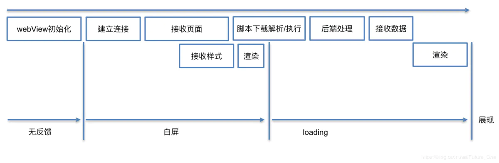
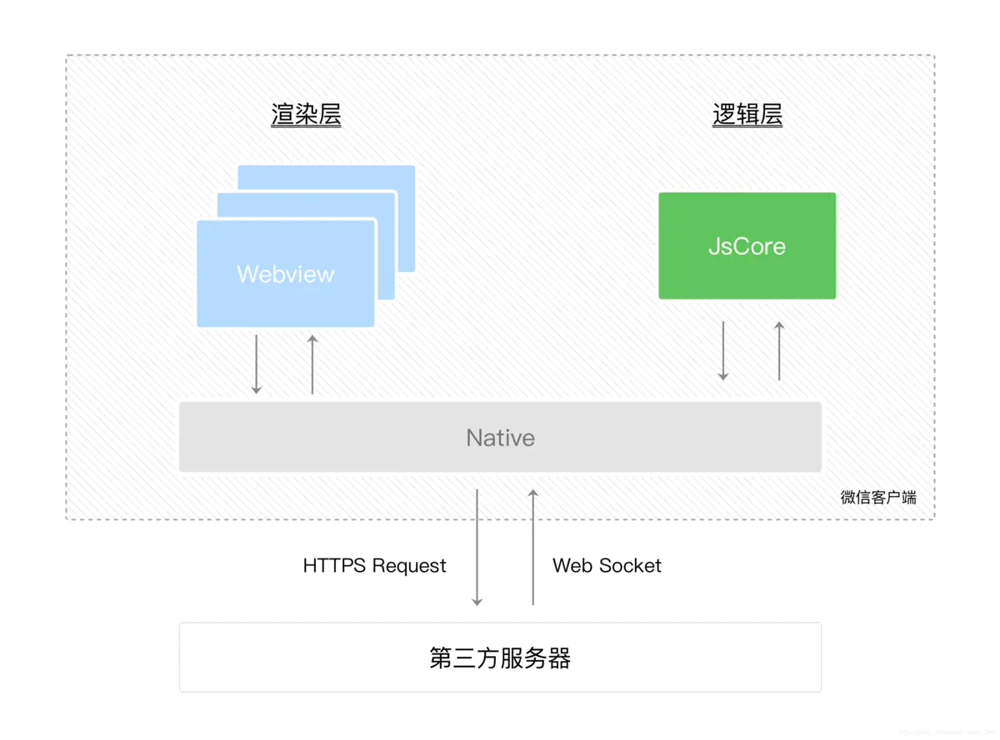
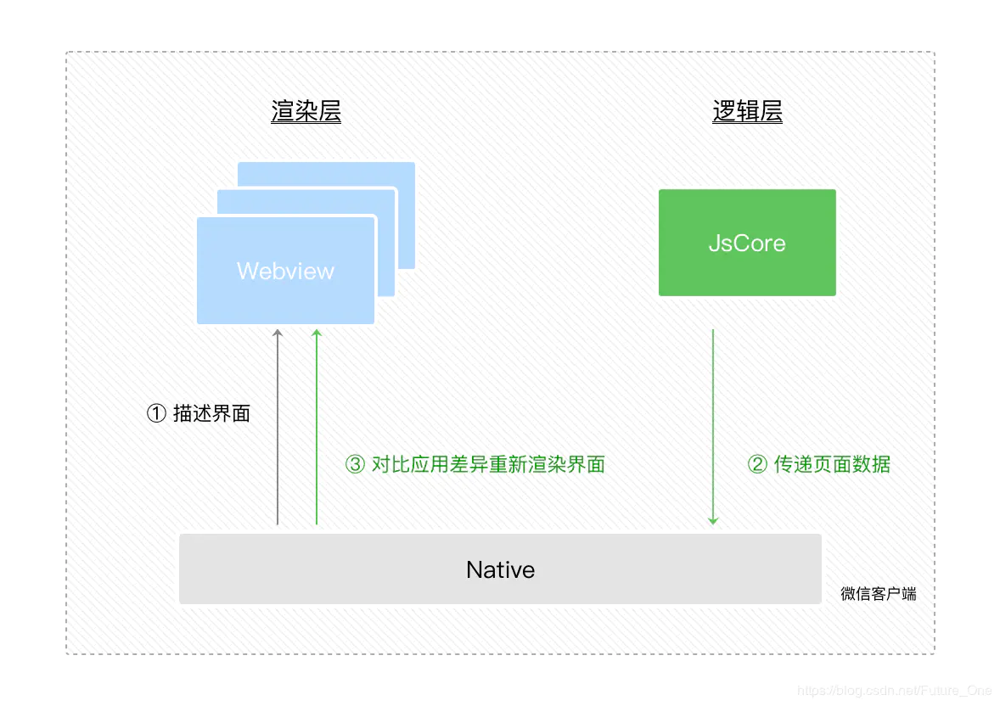

## 小程序是网页吗？
开发小程序时这是我最先想到的问题，小程序和我们在浏览器上访问的网页是一个东西吗？

答案是：不是。虽然它和网页有很多相似之处。

小程序虽然也是基于浏览器内核进行开发的，但是实际上是实现了一套自己的解析渲染引擎，虽然语法上看起来和浏览器的 HTML 和 CSS 很像，但是并不是编译成 HTML 和 CSS 在浏览器中渲染，而是自己实现的对 WXML 和 WXSS 的解析和渲染。当然，这实现过程肯定是参考了浏览器的实现，所以很多语法是类似的，而且我们也叫它 WebView。但这过程中并没有完整的实现浏览器上的所有功能，因而缺少部分 DOM 和 BOM 的 API，从而无法使用 jQuery 等常见的库。。。所以 NPM 上面的那些依赖浏览器有的而小程序没有的 API 的库都不能正常使用。。。

**以下是小程序在不同环境中使用的内核，其实小程序就是基于这些内核自己实现了一个“浏览器”，只是这个浏览器是深度定制的，解析的是 WXML 和 WXSS 然后渲染出来。**

| 运行环境 | 逻辑层	| 渲染层 |
| --- | --- | --- |
| iOS | JavaScriptCore | WKWebView |
| 安卓 | X5 JSCore | X5浏览器 |
| 小程序开发者工具 | NWJS | Chrome WebView |

## 为什么要自己搞这一套？
为什么已经有了浏览器，小程序还要自己去搞这一套呢？直接写 HTML 和 CSS 在浏览器上不香吗？
首先，我们来看一下通常浏览器的 WebView 渲染流程：

**打开一个 WebView 通常会经历以下几个阶段：**
* 交互无反馈
* 到达新的页面，页面白屏
* 页面基本框架出现，但是没有数据；页面处于 loading 状态
* 出现所需的数据
  

除了白屏，影响 Web 体验的问题还有缺少操作的反馈，主要表现在两个方面：页面切换的生硬和点击的迟滞感。

**而我们在进入小程序的时候并没有这个白屏现象。这是为什么呢？**

#### 小程序的通信模型
小程序的渲染层和逻辑层分别由2个线程管理：渲染层的界面使用了 WebView 进行渲染；逻辑层采用 JsCore 线程运行 JS 脚本。一个小程序存在多个界面，所以渲染层存在多个 WebView 线程，这两个线程的通信会经由微信客户端（下文中也会采用 Native 来代指微信客户端）做中转，逻辑层发送网络请求也经由 Native 转发，小程序的通信模型如下图所示。
  

*这下知道为什么我们只能请求微信开发者工具中配置的服务器了吧 ╮(╯_╰)╭。*

**这就是小程序双线程模型的由来：**
* 逻辑层：创建一个单独的线程去执行 JavaScript，在这个环境下执行的都是有关小程序业务逻辑的代码
* 渲染层：界面渲染相关的任务全都在 WebView 线程里执行，通过逻辑层代码去控制渲染哪些界面。一个小程序存在多个界面，所以渲染层存在多个 WebView 线程。

#### 双线程下的界面渲染
小程序的逻辑层和渲染层是分开的两个线程。我们是怎么通过 JS 修改页面的呢？这和普通浏览器也有所区别。
在渲染层，宿主环境会把 WXML 转化成对应的 JS 对象，在逻辑层发生数据变更的时候，我们需要通过宿主环境提供的 setData 方法把数据从逻辑层传递到渲染层，再经过对比前后差异，把差异应用在原来的 Dom 树上，渲染出正确的 UI 界面，如下图所示。
  

**小程序的渲染的整体流程：**

1. 在渲染层把 WXML 转化成对应的 JS 对象。
2. 在逻辑层发生数据变更的时候，通过宿主环境提供的 setData 方法把数据从逻辑层传递到 Native，再转发到渲染层。
3. 经过对比前后差异，把差异应用在原来的 DOM 树上，更新界面。
总之，小程序通过双线程的方式解决 WebView 存在的各种问题，让小程序更加想 Native 的体验。