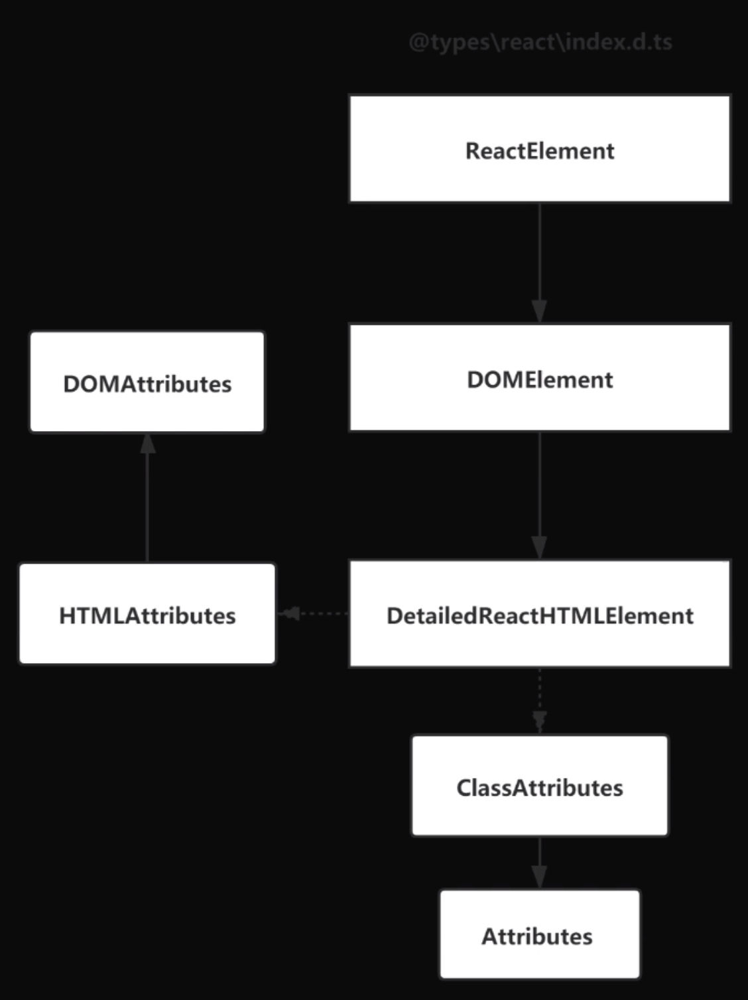
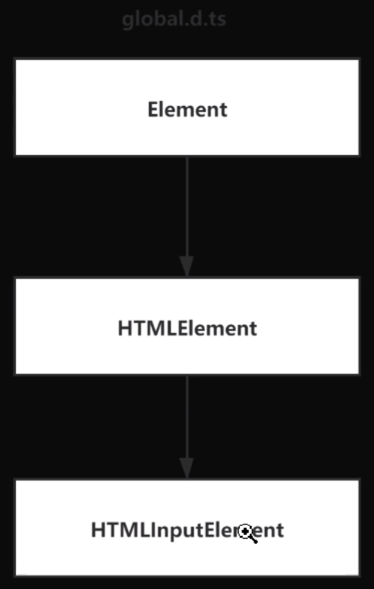

[React中常见的TypeScript定义使用](https://juejin.cn/post/6844904175831089165)

# 类型的继承关系

### React 中类型的继承关系：


### 原生 DOM 中类型的继承关系


# 组件定义
### 函数组件
函数组件只需要定义 Props

```tsx
interface Props {
    className: string;
}
function Hello(props: Props) {
    return <h1>Hello World</h1>;
}
```

useState 的使用
```tsx
import React, { useState } from 'react';
interface Props {
    className: string;
}
type User = {
    id: string;
    name: string;
};
export default function Hello(props: Props) {
    // useState 是个泛型函数，指定接收类型为 User 类型数组
    const [userList, setUserList] = useState<User[]>([]);
    const addUser = () => {
        setUserList([
            {
                id: 123,  // User 类型中 id 为 string，赋值 number 会提示类型错误
                name: 'xxx',
            },
        ]);
    };
    return (
        <h1 onClick={addUser}>
            <span>Hello</span>
            {userList.map((item: User) => {
                return (
                    <span key={item.id}>
                        {item.id}
                        {item.name}
                    </span>
                );
            })}
        </h1>
    );
}
```

### 类组件
类组件需要定义 Props 和 State

```tsx
interface Props {
    className: string;
}
interface State: {
    id: string;
}
class Hello extends React.Component<Props, State> {
    state: {
        id: '123'
    };
    render() {
        return <h1>Hello World</h1>;
    }
}
```

# 事件
react 中的 jsx 事件的类型不是原生类型，而是 react 的类型。
如：
```jsx
// 这里事件 e 的类型是 React.ChangeEvent，而不是原生的 Event
const onChange = (e: React.ChangeEvent<HTMLTextAreaElement>) => {
    const v = e.target.value;
}

return (
    <TextArea onChange={onChange}></TextArea>
);
```