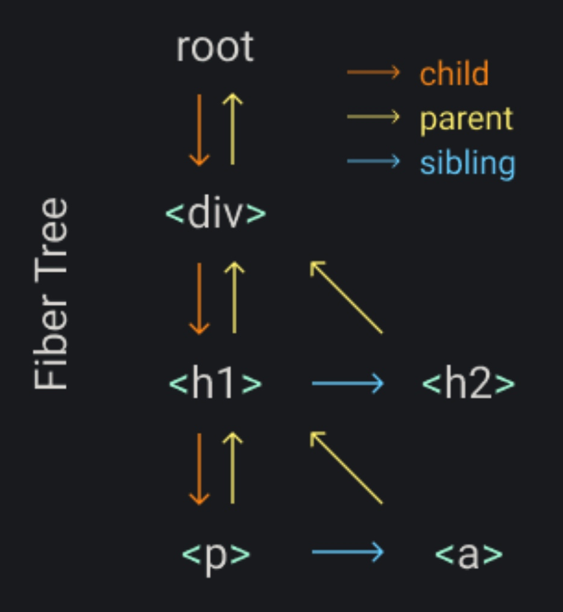

在 build-your-own-react 中，我们知道了在 render 的时候，不能一次性将整个 dom 树进行渲染，而需要进行分块再一块一块的渲染，渲染过程中还能交回给浏览器执行更高优先级的任务。这时就有了 fiber 的概念。

**为了把所有任务单元组织起来我们需要一个数据结构： fiber 树。每一个 element 都是一个 fiber，每一个 fiber 都是一个任务单元，每次渲染至少渲染一个 fiber。**

我们要渲染如下 dom 树：
```jsx
mReact.render(
  <div>
    <h1>
      <p />
      <a />
    </h1>
    <h2 />
  </div>,
  container
)
```
fiber 树的数据结构为：


每个 fiber 节点完成下述三件事：
1. 把 element 添加到 DOM 上
2. 为该 fiber 节点的子节点新建 fiber
3. 挑出下一个任务单元

挑出下一个任务单元的逻辑为：
1. 优先查找 child 子节点。root -> div -> h1 -> p
2. 没有 child 子节点则查找 sibling 兄弟节点。p -> a
3. 没有兄弟节点和子节点则查找 "uncle" 节点，即 parent 的 sibling。a -> h2
4. 都没有则继续往上找，直到根节点。则完成了整棵树的渲染。


