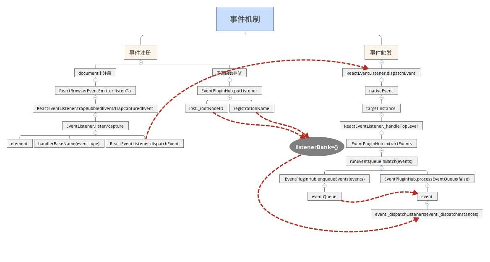

[react源码分析-合成事件](https://zhuanlan.zhihu.com/p/25883536)
[React v17.0.0 合成事件系统源码解析](https://zhuanlan.zhihu.com/p/384192871)

## 什么是合成事件
React自己实现了一套高效的事件注册，存储，分发和重用逻辑，在DOM事件体系基础上做了很大改进，减少了内存消耗，简化了事件逻辑，并最大化的解决了IE等浏览器的不兼容问题。合成事件有以下特点：
* React 组件上声明的事件最终绑定到了 document 这个 DOM 节点上，而不是 React 组件对应的 DOM 节点。故只有 document 这个节点上面才绑定了 DOM 原生事件，其他节点没有绑定事件。这样简化了 DOM 原生事件，减少了内存开销
* React 以队列的方式，从触发事件的组件向父组件回溯，调用它们在JSX中声明的 callback。也就是 React 自身实现了一套事件冒泡机制。我们没办法用 event.stopPropagation() 来停止事件传播，应该使用 event.preventDefault()
* React 有一套自己的合成事件 SyntheticEvent，不同类型的事件会构造不同的 SyntheticEvent。
* 对于每种类型的事件，拥有统一的分发函数 dispatchEvent。
* React 使用对象池来管理合成事件对象的创建和销毁，这样减少了垃圾的生成和新对象内存的分配，大大提高了性能



## 事件注册
```js
// inst: React Component对象
// registrationName: React合成事件名，如onClick
// listener: React事件回调方法，如onClick=callback中的callback
// transaction: mountComponent或updateComponent所处的事务流中，React都是基于事务流的
function enqueuePutListener(inst, registrationName, listener, transaction) {
  if (transaction instanceof ReactServerRenderingTransaction) {
    return;
  }
  var containerInfo = inst._hostContainerInfo;
  var isDocumentFragment = containerInfo._node && containerInfo._node.nodeType === DOC_FRAGMENT_TYPE;
  // 找到document
  var doc = isDocumentFragment ? containerInfo._node : containerInfo._ownerDocument;
  // 注册事件，将事件注册到document上
  listenTo(registrationName, doc);
  // 存储事件,放入事务队列中
  transaction.getReactMountReady().enqueue(putListener, {
    inst: inst,
    registrationName: registrationName,
    listener: listener
  });
}
```
组件在进行加载(mountComponent)、更新(updateComponent)的时候，在 fiber 中会对 props 进行处理:
* props 中的属性如果是事件属性，如 onXXX，则会用 enqueuePutListener 进行事件注册。
* enqueuePutListener 进行两件事情: 在 document 上注册相关的事件；调用 putListener 将注册的事件存储起来，以供事件触发时回调。

#### document 上事件注册
* 事件的注册、触发，具体是在 ReactEventListener 中实现的。
* 事件的注册有两个方法: 支持冒泡 trapBubbledEvent、捕获 trapCapturedEvent
* document 不管注册的是什么事件，具有统一的回调函数 handleTopLevelImpl
* document 的回调函数中不包含任何的事物处理，只起到事件分发的作用。

onXxx  事件回调方法在 bubble 阶段被触发。如果我们想让它在 capture 阶段触发，则需要在事件名上加上 capture。比如 onClick 在 bubble 阶段触发，而 onCaptureClick 在 capture 阶段触发。

#### 回调函数存储
react中的所有事件的回调函数均存储在 listenerBank 对象里面，根据事件类型、组件对象的 _rootNodeID 为两个 key，来存储对应的回调函数。

## 事件存储
事件存储由 EventPluginHub 来负责，它的入口在 enqueuePutListener 中的 putListener 方法，如下
```js
  /**
   * EventPluginHub用来存储React事件, 将listener存储到`listenerBank[registrationName][key]`
   *
   * @param {object} inst: 事件源
   * @param {string} listener的名字,比如onClick
   * @param {function} listener的callback
   */
  putListener: function (inst, registrationName, listener) {

    // 用来标识注册了事件,比如onClick的React对象。key的格式为'.nodeId', 只用知道它可以标示哪个React对象就可以了
    var key = getDictionaryKey(inst);
    var bankForRegistrationName = listenerBank[registrationName] || (listenerBank[registrationName] = {});
    // 将listener事件回调方法存入listenerBank[registrationName][key]中,比如listenerBank['onclick'][nodeId]
    // 所有React组件对象定义的所有React事件都会存储在listenerBank中
    bankForRegistrationName[key] = listener;

    //onSelect和onClick注册了两个事件回调插件, 用于walkAround某些浏览器兼容bug,不用care
    var PluginModule = EventPluginRegistry.registrationNameModules[registrationName];
    if (PluginModule && PluginModule.didPutListener) {
      PluginModule.didPutListener(inst, registrationName, listener);
    }
  },

var getDictionaryKey = function (inst) {
  return '.' + inst._rootNodeID;
};
```
由上可见，事件存储在了 listenerBank 对象中，它按照事件名和 React 组件对象进行了二维划分，比如 nodeId 组件上注册的 onClick 事件最后存储在 listenerBank.onclick[nodeId] 中。

## 事件的执行
当事件触发时，document 上 addEventListener 注册的 callback 会被回调。从前面事件注册部分发现，此时回调函数为 ReactEventListener.dispatchEvent，它是事件分发的入口方法。下面我们来详细分析
```js
// topLevelType：带top的事件名，如topClick。不用纠结为什么带一个top字段，知道它是事件名就OK了
// nativeEvent: 用户触发click等事件时，浏览器传递的原生事件
dispatchEvent: function (topLevelType, nativeEvent) {
    // disable了则直接不回调相关方法
    if (!ReactEventListener._enabled) {
      return;
    }

    var bookKeeping = TopLevelCallbackBookKeeping.getPooled(topLevelType, nativeEvent);
    try {
      // 放入批处理队列中,React事件流也是一个消息队列的方式
      ReactUpdates.batchedUpdates(handleTopLevelImpl, bookKeeping);
    } finally {
      TopLevelCallbackBookKeeping.release(bookKeeping);
    }
}
```
可见我们仍然使用批处理的方式进行事件分发，handleTopLevelImpl才是事件分发的真正执行者，它是事件分发的核心，体现了React事件分发的特点，如下
```js
// document进行事件分发,这样具体的React组件才能得到响应。因为DOM事件是绑定到document上的
function handleTopLevelImpl(bookKeeping) {
  // 找到事件触发的DOM和React Component
  var nativeEventTarget = getEventTarget(bookKeeping.nativeEvent);
  var targetInst = ReactDOMComponentTree.getClosestInstanceFromNode(nativeEventTarget);

  // 执行事件回调前,先由当前组件向上遍历它的所有父组件。得到ancestors这个数组。
  // 因为事件回调中可能会改变Virtual DOM结构,所以要先遍历好组件层级
  var ancestor = targetInst;
  do {
    bookKeeping.ancestors.push(ancestor);
    ancestor = ancestor && findParent(ancestor);
  } while (ancestor);

  // 从当前组件向父组件遍历,依次执行注册的回调方法. 我们遍历构造ancestors数组时,是从当前组件向父组件回溯的,故此处事件回调也是这个顺序
  // 这个顺序就是冒泡的顺序,并且我们发现不能通过stopPropagation来阻止'冒泡'。
  for (var i = 0; i < bookKeeping.ancestors.length; i++) {
    targetInst = bookKeeping.ancestors[i];
    ReactEventListener._handleTopLevel(bookKeeping.topLevelType, targetInst, bookKeeping.nativeEvent, getEventTarget(bookKeeping.nativeEvent));
  }
}
```
从上面的事件分发中可见，React自身实现了一套冒泡机制。从触发事件的对象开始，向父元素回溯，依次调用它们注册的事件callback。