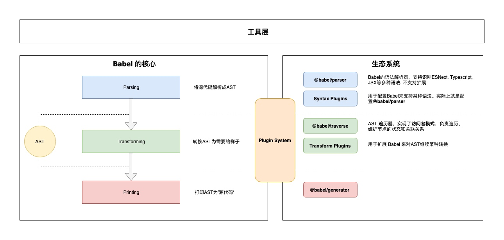

[深入浅出 Babel](https://bobi.ink/2019/10/01/babel/#babel-%E7%9A%84%E5%A4%84%E7%90%86%E6%B5%81%E7%A8%8B)

# Babel 是什么
Babel 是一个工具链，主要用于将采用 ECMAScript 2015+ 语法编写的代码转换为向后兼容的 JavaScript 语法，以便能够运行在当前和旧版本的浏览器或其他环境中。下面列出的是 Babel 能为你做的事情：
* 语法转换：如 ES6,7 转 ES5
* 通过 Polyfill 方式在目标环境中添加缺失的特性（通过第三方 polyfill 模块，例如 core-js，实现）。
* 源码转换：如 JSX, TS 等转换成 JS。

# Babel 的架构
Babel 使用了[微内核](https://juejin.cn/post/6844903943068205064%23heading-10)的架构风格。也就是说它的核心非常小，大部分功能都是通过插件扩展实现的。

### 核心
@babel/core 这也是上面说的‘微内核’架构中的‘内核’。对于 Babel 来说，这个内核主要干这些事情：
* 加载和处理配置(config)
* 加载插件
* 调用 Parser 进行语法解析，生成 AST
* 调用 Traverser 遍历 AST，并使用访问者模式应用’插件’对 AST 进行转换
* 调用 Generator 生成代码，包括 SourceMap 转换和源代码生成

### 核心周边支撑
* Parser(@babel/parser)： 将源代码解析为 AST 就靠它了。 它已经内置支持很多语法。 例如 JSX、Typescript、Flow、以及最新的 ECMAScript 规范。目前为了执行效率，parser 是不支持扩展的，由官方进行维护。如果你要支持自定义语法，可以 fork 它，不过这种场景非常少。

* Traverser(@babel/traverse)： 实现了访问者模式，对 AST 进行遍历，转换插件会通过它获取感兴趣的AST节点，对节点继续操作, 下文会详细介绍访问器模式。

* Generator(@babel/generator)： 将 AST 转换为源代码，支持 SourceMap

### 插件
打开 Babel 的源代码，会发现有好几种类型的‘插件’。
* 语法插件(@babel/plugin-syntax-\*)：上面说了 @babel/parser 已经支持了很多 JavaScript 语法特性，Parser 也不支持扩展. 因此 plugin-syntax-\* 实际上只是用于开启或者配置Parser的某个功能特性。
一般用户不需要关心这个，Transform 插件里面已经包含了相关的 plugin-syntax-* 插件了。用户也可以通过 parserOpts 配置项来直接配置 Parser
* 转换插件： 用于对 AST 进行转换, 实现转换为ES5代码、压缩、功能增强等目的. Babel仓库将转换插件划分为两种(只是命名上的区别)：
    * @babel/plugin-transform-\*： 普通的转换插件
    * @babel/plugin-proposal-\*： 还在’提议阶段’(非正式)的语言特性, 目前有这些
    * 预定义集合(@babel/presets-\*)： 插件集合或者分组，主要方便用户对插件进行管理和使用。比如 preset-env 含括所有的标准的最新特性; 再比如 preset-react 含括所有 react 相关的插件.

### 插件开发辅助
* @babel/template： 某些场景直接操作AST太麻烦，就比如我们直接操作DOM一样，所以Babel实现了这么一个简单的模板引擎，可以将字符串代码转换为AST。比如在生成一些辅助代码(helper)时会用到这个库
* @babel/types： AST 节点构造器和断言. 插件开发时使用很频繁
* @babel/helper-*： 一些辅助器，用于辅助插件开发，例如简化AST操作
* @babel/helper： 辅助代码，单纯的语法转换可能无法让代码运行起来，比如低版本浏览器无法识别class关键字，这时候需要添加辅助代码，对class进行模拟。

### 工具
* @babel/node： Node.js CLI, 通过它直接运行需要 Babel 处理的 JavaScript 文件
* @babel/register： Patch NodeJs 的 require 方法，支持导入需要 Babel 处理的 JavaScript 模块
* @babel/cli： CLI 工具

**babel 配置示例：**
```js
module.exports = (api) => {
    api.cache(true);

    const presets = [
        ['@babel/preset-env', {
            /**
             * 可以配置到 .browserslistrc 或
             * package.json 中 "browserslist": "> 0.25%, not dead"
             * https://www.babeljs.cn/docs/babel-preset-env
             */
            targets: [
                'last 2 version',
                'ie >= 9'
            ],
            // Allow importing core-js in entrypoint and use browserlist to select polyfills
            useBuiltIns: 'entry', // https://www.cnblogs.com/amiezhang/p/11384309.html
            corejs: 3,  // corejs version
            // Exclude transforms that make all code slower
            exclude: ['transform-typeof-symbol'],
        }],
        '@babel/preset-react'
    ];

    const plugins = [
        'react-hot-loader/babel',
        [  // antd 按需引入
            'import',
            { libraryName: 'antd', 'libraryDirectory': 'es', style: 'css' }
        ],

        '@babel/plugin-transform-runtime',
        '@babel/plugin-proposal-optional-chaining',
        '@babel/plugin-proposal-export-default-from',
        '@babel/plugin-proposal-export-namespace-from',
        [
            '@babel/plugin-proposal-decorators',
            {
                // decoratorsBeforeExport: true,
                legacy: true,
            }
        ],
        [
            '@babel/plugin-proposal-class-properties',
            {
                loose: true
            }
        ],
    ];

    return {
        presets,
        plugins
    };
};
```