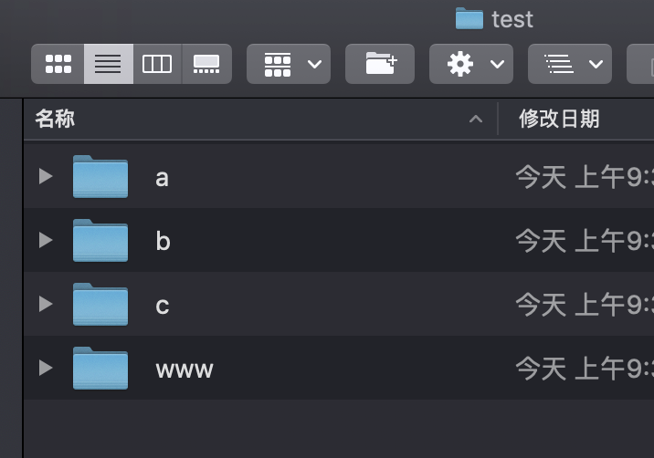
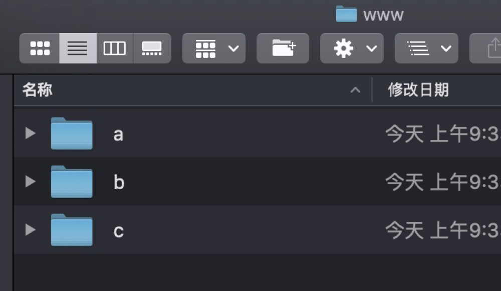
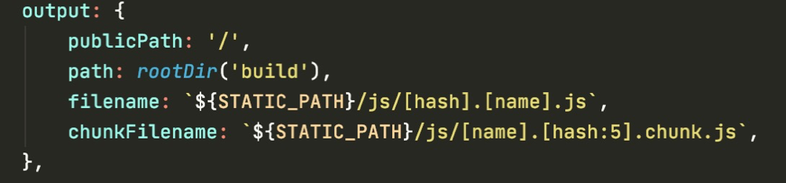
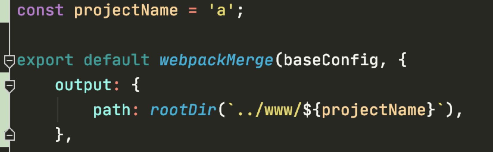
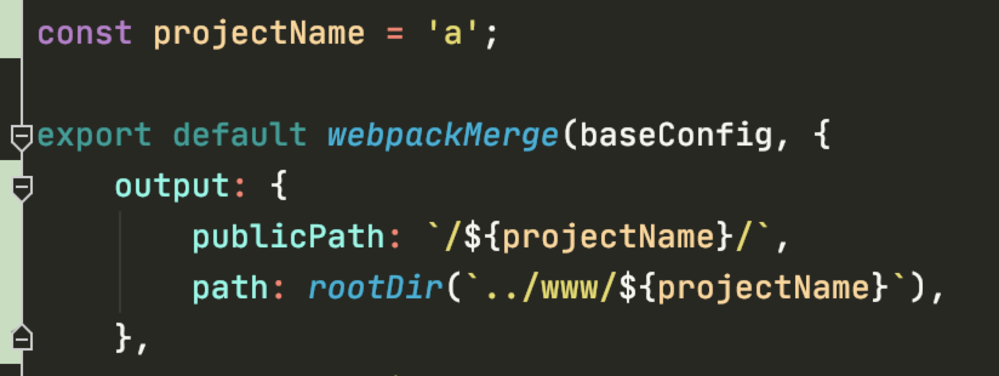

#webpack 将多个项目打包到同一个目录下的配置
一个项目分成多个子系统，每个子系统作为一个独立的项目开发，访问的时候通过 xxx.xxx.xxx/a 来访问其中一个子系统。

如图所示，a、b、c 为3个子系统，打包后会打包到 www 目录中形成 a、b、c 3个目录，项目部署后 http 服务指向 www 目录。

开发的时候 webpack 配置输出目录就和正常项目一样就行。

但是在生成部署的时候就需要注意了：

首先会配置 output.path 的路径，把打包的根目录改为 www 目录，并将目录名称改为项目名称。这样打包后静态资源就会打包到 www/a 目录中。

虽然静态资源打包的位置正确了，并且我们在 a 项目目录中启动 http 服务也能正常访问，但是生成环境中 http 服务是启动在 www 目录上的，通过 xxx.xxx.xxx/a 来访问 a 项目的。

因为 http 服务是在 www 目录上启动，而代码中访问的 js, css 等静态资源路径的格式是 /static/js/xxx.js 这样的，是访问 http 服务下的 static 目录，而这个 static 目录却是在 www/a 目录下。所以就需要另一个配置来解决这个问题：

添加 publicPath 配置，这样我们代码中访问静态资源的路径就会从 /static/js/xxx.js 变成 /a/static/js/xxx.js。

路径正确，大功告成！