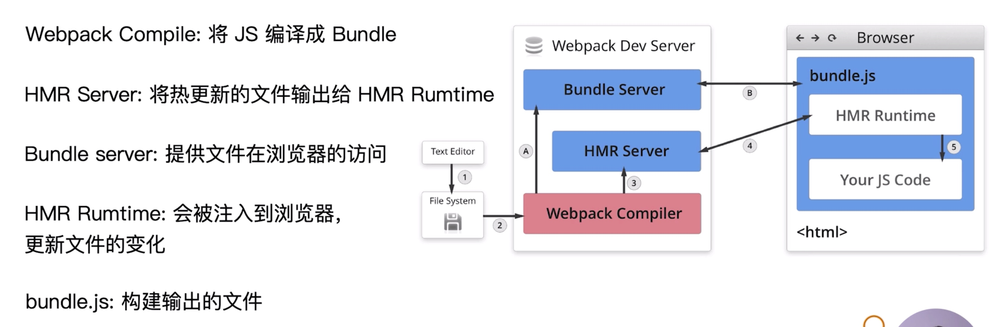

## watch 文件修改监听
我们想要实现文件修改后 webpack 自动打包的功能，其中的一个方法是配置 watch: true，原理是 webpack 会一直轮询通过编辑时间判断文件是否有修改，发现有修改就会先保存起来，间隔一定时间后再触发自动编译打包。
为什么要保存起来间隔一段时间呢？因为一定时间内可能触发多个文件的修改，比如编辑器配置了编辑多个文件保存时统一都保存，如果只要发现修改就进行重新打包那就必然会影响性能。
我们还可以修改这些配置：
```js
module.export = {
    watch: true,
    watchcOptions: {
        ignored: /node_modules/,  // 不监听的目录
        aggregateTimeout: 300,  // 监听到变化后等多少 ms 去执行自动打包。默认为300
        poll: 1000  // 轮询频率，默认为每秒访问1000次
    }
}
```

## 热更新原理

首次运行会走 1 - 2 - A - B
修改文件会走 1 - 2 - 3 - 4

## 文件指纹
文件指纹包括三种：
* Hash：和整个项目的构建相关，只要项目文件有修改，整个项目构建的 hash 值就会更改。
* ChunkHash：和 webpack 打包的 chunk 有关，不同的 entry 会生成不同的 chunkhash。
* ContentHash：根据文件内容来定义 hash，文件内容不变，则 contentHash 不变。

JS 通常使用 chunkhash，在 output 中；CSS 使用 contenthash，在 miniCssExtractPlugin 中；图片字体等使用 hash，在 loader 中。

## 代码压缩
#### JS 的压缩
webpack4 以上内置了 uglifyjs，打包会自动压缩，不需要再安装 uglifyjs。
#### CSS 的压缩
使用 optimize-css-assets-webpack-plugin，同时使用 cssnano。
```js
plugins: [
    new OptimizeCssAssetsWebpackPlugin({
        assetNameRegExp: /\.css$/g,
        cssProcessor: require('cssnano')
    })
]
```
#### HTML 的压缩
使用 html-webpack-plugin，设置压缩参数
```js
plugins: [
    new HtmlWebpackPlugin({
        minify: {  // 使用 minify 进行压缩
            html5: true,
            collapseWhitespace: true,
            ...
        }
    })
]
```

## px 自动转换 rem（npm 下载量很少，方案待定）
使用 px2rem-loader, lib-flexible。
lib-flexible 使用 -S 安装到 dependence 里面
```js
rules: [
    {
        test: /\.less$/,
        use: [
            'style-loader',
            'css-loader',
            'less-loader',
            {
                loader: 'px2rem-loader',
                options: {
                    remUnit: 75,  // 表示 1rem 是 75px
                    remPrecision: 8  // rem 小数点位数
                }
            }
        ]
    }
]
```

## 资源内联
内联的优点：
* 页面框架部分内容的内联，比如 meta 信息。
* 上报相关埋点内联，才能保证时间的准确性。
* 首屏 CSS 内联可以保证页面加载完成的时候 CSS 已经加载完成，防止样式导致的闪屏。使用 html-inline-css-webpack-plugin。
* 小图片或字体的内联可以减少网络请求。使用 url-loader。

#### HTML 和 JS 内联
使用 raw-loader 可以内联 HTML 或 CSS。搭配 html-webpack-plugin。
raw-loader 的功能就是直接把指定文件的内容作为纯文本插入进来。
```html
<!-- 将 meta 信息单独写个 html，然后内联进来 -->
<head>
    ${require('raw-loader!./meta.html')}
</head>
<!-- 将脚本内容内联进来 -->
<script>${require('raw-loader!bable-loader!../node_modules/lib-flexible/flexible.js')}</script>
```

## 多页面打包通用方案
首先是约定多页面的各个入口文件目录结构：如 /src/index/index.js, /src/search/index.js。这样才能方便 nodejs 匹配。
可以使用 glob 库的 glob.sync 来引入入口文件：
```js
entry: glob.sync(path.join(__dirname, './src/*/index.js)),
```
```js
const HtmlWebpackPlugin = require('html-webpack-plugin')
const path = require('path')
const glob = require('glob')

// 动态生成 entry 和 html-webpack-plugin
function getMpa() {
  const entry = {}, htmlPlugins = []
  // 返回一个数组
  const files = glob.sync(path.join(__dirname, 'src/*/index.js'))
  // 遍历所有入口文件，每次遍历添加一个 entry 和 html-webpack-plugins
  files.forEach((file) => {
    // 这是是要在路径中获取 * 部分，如 index, search 等字符串
    const match = file.match(/src\/(.*)\/index.js/);
    const filename = match && match[1];  // 索引为1的元素是匹配符中的元素
    // 配置 entry
    entry[filename] = file;
    // 配置 html-webpack-plugins
    htmlPlugins.push(
      new HtmlWebpackPlugin({
        template: path.join(__dirname, `src/${filename}/index.html`),
        filename: `${filename}.html`,
        chunks: [filename],
      })
    )
  })
  return { entry, htmlPlugins }
}
const mpa = getMpa()

// 动态的配置文件
module.exports = {
  entry: mpa.entry,
  output: {
    path: path.join(__dirname, 'dist'),
    filename: '[name]-[hash:6].js',
  },
  plugins: [...mpa.htmlPlugins],
}
```