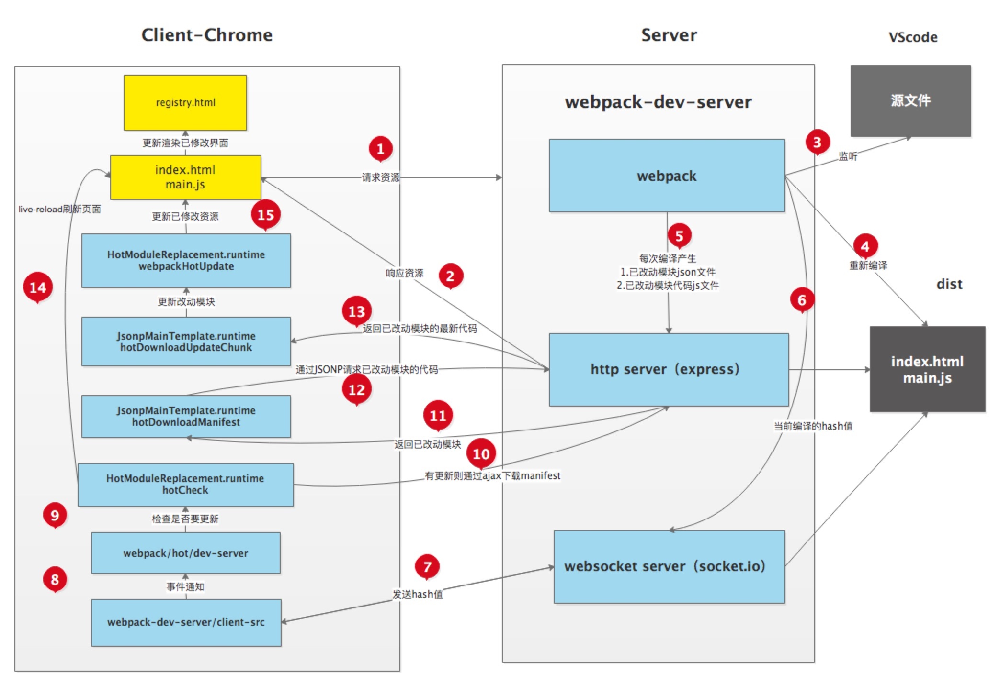

# 版本特性
* webpack 5
    - 使用持久缓存提高构建性能

# webpack 配置的基本概念
**Entry**
入口文件是 webpack 建立依赖图的起点。

**Output**
Output 配置告诉 webpack 怎么处理打包的代码。

**Hot Module Replacement**
热模块替换功能可以在不刷新所有文件的情况下实现单独更新某个模块。

**Tree Shaking**
去除无用代码，比如某个 js 文件里的函数并没有被使用，这段函数代码在打包时将会被去掉。

**Code Splitting**
代码拆分，实现的方式有三种

* Entry Points 手动把代码分成多个入口
* Prevent Duplication 使用插件 CommonsChunkPlugin | optimization.splitChunks 提取公共代码块
* Dynamic Imports 用 import 函数动态动引入模块

**Lazy Loading**
懒加载或者按需加载，属于 Code Splitting 的一部分。

**Loaders**
webpack 把所有文件都当成模块对待，但是它只理解 Javascript。Loaders 把这些webpack 不认识的文件转化成模块，以便 webpack 进行处理。

**plugins**
插件一般用来处理打包模块的编译或代码块相关的工作。

**Manifest**
webpack manifest 文件用来引导所有模块的交互。manifest 文件包含了加载和处理模块的逻辑。

# entry
**入口起点(entry point) 指示 webpack 应该使用哪个模块，来作为构建其内部 依赖图(dependency graph) 的开始。默认值是 ./src/index.js**
```js
module.exports = {
  entry: './path/to/my/entry/file.js',
};
```
### 单入口语法
```js
module.exports = {
  entry: './path/to/my/entry/file.js',
};
```
等同于以下代码
```js
module.exports = {
  entry: {
    main: './path/to/my/entry/file.js',
  },
};
```
### 对象语法
对象语法会比较繁琐。然而，这是应用程序中定义入口的最可扩展的方式。
```js
module.exports = {
  entry: {
    app: './src/app.js',
    adminApp: './src/adminApp.js',
  },
};
```
#### 描述入口的对象
* dependOn: 当前入口所依赖的入口。它们必须在该入口被加载前被加载。
* filename: 指定要输出的文件名称。
* import: 启动时需加载的模块。
* library: 指定 library 选项，为当前 entry 构建一个 library。
* runtime: 运行时 chunk 的名字。如果设置了，就会创建一个新的运行时 chunk。在 webpack 5.43.0 之后可将其设为 false 以避免一个新的运行时 chunk。
* publicPath: 当该入口的输出文件在浏览器中被引用时，为它们指定一个公共 URL 地址。请查看 output.publicPath。
```js
module.exports = {
  entry: {
    a2: 'dependingfile.js',
    b2: {
      dependOn: 'a2',
      import: './src/app.js',
    },
  },
};
```
**注意事项：**
1. runtime 和 dependOn 不应在同一个入口上同时使用。
2. runtime 不能指向已存在的入口名称。
3. dependOn 不能是循环引用的。

### 常见场景
#### 分离 app(应用程序) 和 vendor(第三方库) 入口
在 webpack < 4 的版本中我们通常会看到这样的配置，目的是配合 CommonsChunkPlugin 将第三方库抽离成 vendor.js 文件。
```js
module.exports = {
  entry: {
    main: './src/app.js',
    vendor: './src/vendor.js',
  },
  output: {
    filename: '[name].bundle.js',
  },
};
```
> *从 webpack v4 开始，移除了 CommonsChunkPlugin，取而代之的是 optimization.splitChunks。*

而在 webpack 4 中不鼓励这样做。而是使用 [optimization.splitChunks](https://webpack.docschina.org/plugins/split-chunks-plugin/) 选项，将 vendor 和 app(应用程序) 模块分开，并为其创建一个单独的文件。不要 为 vendor 或其他不是执行起点创建 entry。
```js
module.exports = {
  //...
  optimization: {
    splitChunks: {
      cacheGroups: {
        defaultVendors: {
          filename: 'js/[name]/bundle.js',
        },
      },
    },
  },
};
```

#### 多页面应用程序
多页应用能够复用多个入口起点之间的大量代码/模块，从而可以极大地从这些技术中受益。
```js
module.exports = {
  entry: {
    pageOne: './src/pageOne/index.js',
    pageTwo: './src/pageTwo/index.js',
    pageThree: './src/pageThree/index.js',
  },
};
```

# output
**output 属性告诉 webpack 在哪里输出它所创建的 bundle，以及如何命名这些文件。主要输出文件的默认值是 ./dist/main.js，其他生成文件默认放置在 ./dist 文件夹中。**
```js
const path = require('path');

module.exports = {
  entry: './path/to/my/entry/file.js',
  output: {
    path: path.resolve(__dirname, 'dist'),
    filename: 'my-first-webpack.bundle.js',
  },
};
```
### 基本用法
output 最低要求是配置一个 output.filename。
```js
module.exports = {
  output: {
    filename: 'bundle.js',
  },
};
```
此配置将一个单独的 bundle.js 文件输出到 dist 目录中。
### 多入口输出
如果配置中创建出多于一个 "chunk"，则应该使用 占位符(substitutions) 来确保每个文件具有唯一的名称。
```js
module.exports = {
  entry: {
    app: './src/app.js',
    search: './src/search.js',
  },
  output: {
    filename: '[name].js',  // 使用 [name] 占位符来输出多个文件
    path: __dirname + '/dist',
  },
};

// 写入到硬盘：./dist/app.js, ./dist/search.js
```

# loader
**webpack 只能理解 JavaScript 和 JSON 文件，这是 webpack 开箱可用的自带能力。loader 让 webpack 能够去处理其他类型的文件，并将它们转换为有效 模块，以供应用程序使用，以及被添加到依赖图中。**

### loader 的使用
有两种使用 loader 的方式：
* 配置方式（推荐）：在 webpack.config.js 文件中指定 loader。
* 内联方式：在每个 import 语句中显式指定 loader。
#### 配置方式
loader 有两个属性：
* test 属性，识别出哪些文件会被转换。
* use 属性，定义出在进行转换时，应该使用哪个 loader。
```js
module.exports = {
  output: {
    filename: 'my-first-webpack.bundle.js',
  },
  // 使用 loader
  module: {
    rules: [{ test: /\.txt$/, use: 'raw-loader' }],
  },
};
```

loader 在 use 数组中将从后到前执行。以下配置执行顺序为 sass - css - style loader。
```js
module.exports = {
  module: {
    rules: [
      {
        test: /\.css$/,
        use: [
          // [style-loader](/loaders/style-loader)
          { loader: 'style-loader' },
          // [css-loader](/loaders/css-loader)
          {
            loader: 'css-loader',
            options: {
              modules: true
            }
          },
          // [sass-loader](/loaders/sass-loader)
          { loader: 'sass-loader' }
        ]
      }
    ]
  }
};
```

#### 内联方式（不推荐）
可以在 import 时使用 loader。使用 ! 将资源中的 loader 分开。
```js
import Styles from 'style-loader!css-loader?modules!./styles.css';
```

### loader 特性
* loader 支持链式调用。链中的每个 loader 会将转换应用在已处理过的资源上。一组链式的 loader 将按照相反的顺序执行。链中的第一个 loader 将其结果（也就是应用过转换后的资源）传递给下一个 loader，依此类推。最后，链中的最后一个 loader，返回 webpack 所期望的 JavaScript。
* loader 可以是同步的，也可以是异步的。
* loader 运行在 Node.js 中，并且能够执行任何操作。
* loader 可以通过 options 对象配置（仍然支持使用 query 参数来设置选项，但是这种方式已被废弃）。
* 除了常见的通过 package.json 的 main 来将一个 npm 模块导出为 loader，还可以在 module.rules 中使用 loader 字段直接引用一个模块。
* 插件(plugin)可以为 loader 带来更多特性。
* loader 能够产生额外的任意文件。

### 解析 loader
loader 遵循标准 [模块解析](https://webpack.docschina.org/concepts/module-resolution/) 规则。多数情况下，loader 将从 模块路径 加载（通常是从  node_modules 进行加载）。

# plugin
**插件目的在于解决 loader 无法实现的其他事，包括：打包优化，资源管理，注入环境变量等。**
### 剖析
webpack 插件是一个具有 apply 方法的 JavaScript 对象。apply 方法会被 webpack compiler 调用，并且在 整个 编译生命周期都可以访问 compiler 对象。

*ConsoleLogOnBuildWebpackPlugin.js*
```js
const pluginName = 'ConsoleLogOnBuildWebpackPlugin';

class ConsoleLogOnBuildWebpackPlugin {
  apply(compiler) {
    compiler.hooks.run.tap(pluginName, (compilation) => {
      console.log('webpack 构建正在启动！');
    });
  }
}

module.exports = ConsoleLogOnBuildWebpackPlugin;
```
### 用法
由于插件可以携带参数/选项，你必须在 webpack 配置中，向 plugins 属性传入一个 new 实例。

取决于你的 webpack 用法，对应有多种使用插件的方式。

#### 配置方式
```js
const HtmlWebpackPlugin = require('html-webpack-plugin'); // 通过 npm 安装的插件
const webpack = require('webpack'); // 通过 webpack 可访问内置的插件
const path = require('path');

module.exports = {
  entry: './path/to/my/entry/file.js',
  output: {
    filename: 'my-first-webpack.bundle.js',
    path: path.resolve(__dirname, 'dist'),
  },
  module: {
    rules: [
      {
        test: /\.(js|jsx)$/,
        use: 'babel-loader',
      },
    ],
  },
  plugins: [
    new webpack.ProgressPlugin(),  // 访问内置的插件
    new HtmlWebpackPlugin({ template: './src/index.html' }),
  ],
};
```

#### Node API 方式
```js
const webpack = require('webpack'); // 访问 webpack 运行时(runtime)
const configuration = require('./webpack.config.js');

let compiler = webpack(configuration);

new webpack.ProgressPlugin().apply(compiler);

compiler.run(function (err, stats) {
  // ...
});
```

# 模块（Modules）
### 何为 webpack 模块
与 Node.js 模块相比，webpack 模块 能以各种方式表达它们的依赖关系。下面是一些示例：
* ES2015 import 语句
* CommonJS require() 语句
* AMD define 和 require 语句
* css/sass/less 文件中的 @import 语句。
* stylesheet url(...) 或者 HTML  文件中的图片链接。

### 支持的模块类型
Webpack 天生支持如下模块类型：
* ECMAScript 模块
* CommonJS 模块
* AMD 模块
* Assets
* WebAssembly 模块

通过 loader 可以使 webpack 支持多种语言和预处理器语法编写的模块。loader 向 webpack 描述了如何处理非原生模块，并将相关依赖引入到你的 bundles中。如：
* CoffeeScript
* TypeScript
* ESNext (Babel)
* Sass
* Less
* Stylus
* Elm


# 模式
**通过选择 development, production 或 none 之中的一个，来设置 mode 参数，你可以启用 webpack 内置在相应环境下的优化。其默认值为 production。**
```js
module.exports = {
  mode: 'production',
};
```
* development: 会将 DefinePlugin 中 process.env.NODE_ENV 的值设置为 development. 为模块和 chunk 启用有效的名。
* production: 会将 DefinePlugin 中 process.env.NODE_ENV 的值设置为 production。为模块和 chunk 启用确定性的混淆名称，FlagDependencyUsagePlugin，FlagIncludedChunksPlugin，ModuleConcatenationPlugin，NoEmitOnErrorsPlugin 和 TerserPlugin 。
* none: 不使用任何默认优化选项

# manifest
当 compiler 开始执行、解析和映射应用程序时，它会保留所有模块的详细要点。这个数据集合称为 "manifest"，当完成打包并发送到浏览器时，runtime 会通过 manifest 来解析和加载模块。无论你选择哪种 模块语法，那些 import 或 require 语句现在都已经转换为 \_\_webpack_require__ 方法，此方法指向模块标识符(module identifier)。通过使用 manifest 中的数据，runtime 将能够检索这些标识符，找出每个标识符背后对应的模块。

**webpack 通过 manifest，可以追踪所有模块到输出 bundle 之间的映射。**
如果希望通过使用浏览器缓存来改善项目的性能，那么理解 manifest 和 runtime 的机制就突然变得极为重要。

通过使用内容散列(content hash)作为 bundle 文件的名称，这样在文件内容修改时，会计算出新的 hash，浏览器会使用新的名称加载文件，从而使缓存无效。一旦你开始这样做，你会立即注意到一些有趣的行为。即使某些内容明显没有修改，某些 hash 还是会改变。这是因为，注入的 runtime 和 manifest 在每次构建后都会发生变化。

### webpack的工作步骤如下：
1. 从入口文件开始递归地建立一个依赖关系图。
2. 把所有文件都转化成模块函数。
3. 根据依赖关系，按照配置文件把模块函数分组打包成若干个bundle。
4. 通过script标签把打包的bundle注入到html中，通过manifest文件来管理bundle文件的运行和加载。

打包的规则为：一个入口文件对应一个bundle。该bundle包括入口文件模块和其依赖的模块。按需加载的模块或需单独加载的模块则分开打包成其他的bundle。

除了这些bundle外，还有一个特别重要的 bundle，就是 manifest.bundle.js 文件，即 webpackBootstrap。这个 manifest 文件是最先加载的，负责解析 webpack 打包的其他bundle文件，使其按要求进行加载和执行。

Vue 热更新流程：
1. Webpack 编译期，为需要热更新的 entry 注入热更新代码(EventSource通信)
2. 页面首次打开后，服务端与客户端通过 EventSource 建立通信渠道，把下一次的 hash 返回前端
3. 客户端获取到 hash，这个hash将作为下一次请求服务端 hot-update.js 和 hot-update.json 的 hash
4. 修改页面代码后，Webpack 监听到文件修改后，开始编译，编译完成后，发送 build 消息给客户端
5. 客户端获取到 hash，成功后客户端构造 hot-update.js script 链接，然后插入主文档
6. hot-update.js 插入成功后，执行 hotAPI 的 createRecord 和 reload 方法，获取到 Vue 组件的 render方法，重新 render 组件， 继而实现 UI 无刷新更新。
### 参考
[manifest 解析](https://blog.csdn.net/lancewu0907/article/details/76513231/)
[使用 webpack 提供可预测的长缓存](https://medium.com/webpack/predictable-long-term-caching-with-webpack-d3eee1d3fa31)
[缓存](https://webpack.docschina.org/guides/caching/)

# 模块热替换
模块热替换(HMR - hot module replacement)功能会在应用程序运行过程中，替换、添加或删除 模块，而无需重新加载整个页面。主要是通过以下几种方式，来显著加快开发速度：

* 保留在完全重新加载页面期间丢失的应用程序状态。
* 只更新变更内容，以节省宝贵的开发时间。
* 在源代码中 CSS/JS 产生修改时，会立刻在浏览器中进行更新，这几乎相当于在浏览器 devtools 直接更改样式。

热更新通过 websocket (webpack-dev-server) 或 EventSource (webpack-hot-middleware)。
> EventSource 是 HTML5 中 Server-sent Events 规范的一种技术实现。EventSource 接口用于接收服务器发送的事件。它通过HTTP连接到一个服务器，以text/event-stream 格式接收事件, 不关闭连接。通过 EventSource 服务端可以主动给客户端发现消息，使用的是 HTTP协议，**单项通信，只能服务器向浏览器发送**； 与 WebSocket 相比轻量，使用简单，支持断线重连。

HMR 是 webpack 的一个扩展功能，修改文件后 webpack 的编译器会通知 HMR 进行更新，更新包括 manifest 和 update chunk。然后一些地方可以接收到更新通知，如 react-hot-loader, vue-loader, style-loader 等实现了 HMR 接口，能接收到更新通知，对页面文件进行更新。
**流程图**



**参考**
[webpack HMR 官方文档](https://webpack.docschina.org/concepts/hot-module-replacement/)
[HMR 原理解析](https://zhuanlan.zhihu.com/p/30669007)
[webpack 热更新实现原理分析](https://zhuanlan.zhihu.com/p/30623057)
[搞懂 webpack 热更新原理](https://github.com/careteenL/webpack-hmr)


# webpack 插件及工具
### 插件
> 相同类型的插件，使用写在后面的更优。
* [optimization.splitChunks](https://webpack.docschina.org/plugins/split-chunks-plugin/)：代码分割，类似 CommonsChunkPlugin，但拥有更强大的功能。
* html-webpack-plugin：将 html 复制并插入一些打包后的依赖路径的插件。
* copy-webpack-plugin：将 static 中文件原样复制到dist的插件。
* mini-css-extract-plugin：分离提取 css 文件。
* optimize-css-assets-webpack-plugin | css-minimizer-webpack-plugin（webpack >= v5）：优化/最小化 css。
* uglifyjs-webpack-plugin | terser-webpack-plugin（支持 ES6 语法）：压缩/混淆 js。
* webpack-bundle-analyzer：webpack 包分析工具。
* assets-webpack-plugin | webpack-manifest-plugin：生成一份资源清单的 json 文件。
* definePlugin | dotenv-webpack：设计全局变量。
* [wbepack.IgnorePlugin](https://blog.csdn.net/qq_17175013/article/details/86845624)：忽略第三方包指定目录，让这些指定目录不要被打包进去。
* webpack.DllPlugin & webpack.DllReferencePlugin：提升编译速度。将模块预先编译，DllReferencePlugin 将预先编译好的模块关联到当前编译中，当 webpack 解析到这些模块时，会直接使用预先编译好的模块。
### 工具
* webpack-merge：合并 webpack 配置。
* node-portfinder：检查端口占用情况。可以从一个端口号扫描到另一个端口号，发现未被占用的端口再启动。
* ora：一个友好的命令行界面提示插件，有可以转圈的图标。
* rimraf：类似 rm -rf 用于删除文件。
* chalk：在命令行打印出彩色文字。