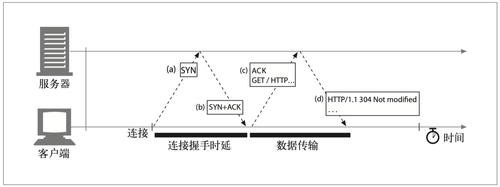

# HTTP权威指南读书笔记
## URL 结构
`<scheme>://<user>:<password>@<host>:<port>/<path>;<params>?<query>#<frag>`
url 可以包括以上9部分，但是不是都需要的，通常由其中的几个部分组成。
`http://www.baidu.com/query?q=abc`
比如以上 url 就只包括 scheme, host, path, query 这4部分。
frag 片段实际应该用作锚点，将页面定位到指定的位置。而 hashRouter 却是当做定位页面的路由来使用，这样理论来说是不正确的，会让页面失去锚点功能。

## URL 编码
url 中一些不安全的字符、保留字之类的需要进行编码传输，将这些字符通过 ASCII 进行编码后，就能在任何地方使用这个 url。
比如 path 中的路径名或文件名包含 ~ # ? 等符号时，对用户输入的内容进行查询时，都需要进行 ASCII 编码，才能保证 url 的正确性。

## HTTP HTTPS 区别
1、https 相对 http 增加了 SSL 层为 HTTP 连接提供了端到端的加密机制。其语法与 HTTP 的语法相同。
2、http 默认端口号为80，https 默认端口号为 443。

## 报文
HTTP 报文分为请求报文和响应报文。报文包括 起始行，头部(header)，主体(body) 三个部分。
**起始行：**是报文的主要内容，如：请求 GET /specials/saw-blade.gif HTTP/1.1；响应 HTTP/1.1 200 OK。
**头部：**包含0个、1个或多个键值对，向请求和响应报文中添加了一些附加信息。
**主体：**主体是 HTTP 报文的负荷(payload)。 就是 HTTP 要传输的内容。
### 方法
**安全和幂等：**
在 HTTP 协议⾥，所谓的「安全」是指请求⽅法不会「破坏」服务器上的资源。 所谓的「幂等」，意思是多次执⾏相同的操作，结果都是「相同」的。
所以 get, head 方法是安全和幂等的，post, put 会提交数据所以不安全不幂等。
**options 方法：**主要用来检查服务器支持哪些方法。在跨域请求时除了简单请求(Simple Request)外，其它的跨域请求(比如添加了自定义 header 就不再是简单请求了)会触发一个 options 请求，返回的Access-Control-*等头信息判断是否有对指定站点的访问权限，并最终决定是否发送实际请求信息。
### 状态码
301：资源被删除，永久重定向，服务器需要在 header 中返回 location 字段说明新的地址。
302：资源还存在，但是临时重定向，服务器需要在 header 中返回 location 字段说明新的地址。
304：get 请求的资源未改变，从浏览器缓存中获取。首先服务器会有缓存策略，在第一次 get 请求后服务器会告知客户端来缓存此次请求内容，然后客户端再次发送请求的时候，header 中会有 If-Modified-Since, If-None-Match 等字段来告知服务器的缓存条件，服务器端接收请求发现这个资源并未改变，返回304，然后客户端从缓存中获取。
400：客户端发送了一个错误的请求（笼统的错误）。
401：客户端没有访问权限。
403：服务器拒绝了客户端的请求，但不想说明原因。
404：客户端的请求地址找不到。
405：客户端请求所使用的方法不被允许。
500：服务器出错（笼统的错误）。
501：请求超出了服务器的能力范围，比如使用了服务器不支持的方法等。
502：网关报错。
503：用来说明服务器现在无法为请求提供服务，但将来可以。
504：网关超时。

## TCP
TCP 为 HTTP 提供了一条 可靠的比特传输管道。从 TCP 连接一端填入的字节会从另一端以原有的顺序、正确地传送出来。
#### 浏览器中访问 url 发生的事情

#### TCP / IP 如何传输数据
TCP 的数据是通过名为 IP 分组 （或 IP 数据报 ）的小数据块来发送的。
HTTP 要传送一条报文时，会以流的形式将报文数据的内容通过一条打开的 TCP 连接按序传输。TCP 收到数据流之后， 会将数据流砍成被称作段的小数据块，并将段封装在 IP 分组中，通过因特网进行传输。
### TCP 三次握手

TCP 连接握手需要经过以下几个步骤：
1. 请求新的 TCP 连接时，客户端要向服务器发送一个小的 TCP 分组（通常是 40 ～ 60 个字节）。这个分组中设置了一个特殊的 SYN 标记，说明这是一个连接请求。（参见图中 a）
2. 如果服务器接受了连接，就会对一些连接参数进行计算，并向客户端回送一个 TCP 分组，这个分组中的 SYN 和 ACK 标记都被置位，说明连接请求已被接受（参见图中 b）
3. 最后，客户端向服务器回送一条带有 ACK 标记的确认信息，通知它连接已成功建立（参见图中 c）。现代的 TCP 栈都允许客户端在这个确认分组中发送数据。

### TCP 四次挥手

TCP 连接断开需要经过一下几个步骤：
1. 客户端发送一个 TCP 报文，说明这是一个断开请求。随后客户端进入半关闭阶段。并且停止在客户端到服务器端方向上发送数据，但是客户端仍然能接收从服务器端传输过来的数据。
2. 服务器端接收到从客户端发出的 TCP 报文之后，确认了客户端想要释放连接，随后服务器进入半关闭状态并返回一段TCP报文，并开始进行必要的断开处理工作。
3. 服务器端必要的断开处理工作完成后，做好了释放服务器端到客户端方向上的连接准备，再次向客户端发出一段 TCP 报文，表示服务器端一切就绪可以断开了。
4. 客户端收到从服务器端发出的 TCP 报文，确认了服务器端已做好释放连接的准备，客户端进入 TIME-WAIT 阶段开始准备释放连接，并向服务器端发送一段 TCP 报文，表示确认断开。随后客户端开始在 TIME-WAIT 阶段等待 2MSL。

然后服务端收到确认断开的报文后会释放连接。
而客户端会进行一定时间的等待(2MSL)，如果没再收到服务端的 TCP 报文就释放连接。
#### 为什么客户端在 TIME-WAIT 阶段要等 2MSL
如果客户端在 2MSL 内，再次收到了来自服务器端的 FIN 报文，说明服务器端由于各种原因没有接收到客户端发出的 ACK 确认报文。客户端再次向服务器端发出 ACK 确认报文，计时器重置，重新开始 2MSL 的计时；
否则客户端在 2MSL 内没有再次收到来自服务器端的 FIN 报文，说明服务器端正常接收了 ACK 确认报文，客户端可以进入 CLOSED 阶段，完成“四次挥手”。
#### 为什么“握手”是三次，“挥手”却要四次？
建立连接时，被动方服务器端结束 CLOSED 阶段进入“握手”阶段并不需要任何准备，可以直接返回 SYN 和 ACK 报文，开始建立连接。
释放连接时，被动方服务器，突然收到主动方客户端释放连接的请求时并不能立即释放连接，因为还有必要的数据需要处理，所以服务器先返回 ACK 确认收到报文，经过 CLOSE-WAIT 阶段准备好释放连接之后，才能返回 FIN 释放连接报文。

## HTTP 性能优化
http 连接通常的串行的，也就是一次连接结束后才会开始下一次连接。但是我们可以通过四种方法对齐进行优化：
1. 并行连接：通过多条 TCP 连接发起并发的 HTTP 请求。
2. 持久连接：重用 TCP 连接，以消除请求连接和关闭连接的时延。
3. 管道化连接：通过共享的 TCP 连接发起并发的 HTTP 请求。
4. 复用的连接：交替传送请求和响应报文（实验阶段）。

持久连接与并行连接配合使用可能是最高效的方式。现在，很多 Web 应用程序都会打开少量的并行连接，其中的每一个都是持久连接。

#### 关于持久连接
HTTP 1.0 持久连接通过 header 中的 Connection: Keep-Alive 字段来确定是否使用持久连接。但是发出 keep-alive 请求之后，客户端和服务器并不一定会同意进行 keep-alive 会话。它们可以在任意时刻关闭空闲的 keep-alive 连接，并可随意限制 keep-alive 连接所处理事务的数量。
HTTP 1.1 默认所有连接都是持久的，要结束持久连接需要在头部添加报文 Connection: close。

## 代理
Web 代理（proxy）服务器是网络的中间实体。代理位于客户端和服务器之间，扮演 “中间人”的角色，在各端点之间来回传送 HTTP 报文。HTTP 的代理服务器既是 Web 服务器又是 Web 客户端。
#### 代理与网关的对比
严格来说，代理连接的是两个或多个使用相同协议的应用程序，而网关连接的则是两个或多个使用不同协议的端点。网关扮演的是“协议转换器”的角色，即使客户端和服务器使用的是不同的协议，客户端也可以通过它完成与服务器之间的事务处理。
实际上，代理和网关之间的区别很模糊。由于浏览器和服务器实现的是不同版本的 HTTP，代理也经常要做一些协议转换工作。
#### 为什么使用代理
1. 过滤器：限制访问某些网站。
2. 文档访问控制：在大量 Web 服务器和 Web 资源之间实现统一的访问控制策略，创建审核跟踪机制。
3. 安全防火墙：对网络传输的内容进行安全检查，查杀病毒等。
4. Web 缓存：作为缓存服务器。
5. 反向代理：可以发起与其他服务器的通信，以便按需定位所请求的内容。
6. 内容路由器：根据因特网流量状况以及内容类型将请求导向特定的 Web 服务器。
7. 转码器：修改内容的主体格式。比如 png 转 jpg 以减小尺寸。
8. 匿名者：主动从 HTTP 报文中删除身份特性（比如客户端 IP 地址、From 首部、Referer 首部、cookie、URI 的会话 ID），从而提供高度的私密性和匿名性。

## 缓存
Web 缓存是可以自动保存常见文档副本的 HTTP 设备。当 Web 请求抵达缓存时，如果本地有“已缓存的”副本，就可以从本地存储设备而不是原始服务器中提取这个文档。使用缓存有下列优点。
• 缓存 减少了冗余的数据传输，节省了你的网络费用。
• 缓存 缓解了网络瓶颈的问题。不需要更多的带宽就能够更快地加载页面。
• 缓存 降低了对原始服务器的要求。服务器可以更快地响应，避免过载的出现。
• 缓存 降低了距离时延，因为从较远的地方加载页面会更慢一些。
### 命中和未命中的
可以用已有的副本为某些到达缓存的请求提供服务。这被称为 缓存命中 （cache hit）。 其他一些到达缓存的请求可能会由于没有副本可用，而被转发给原始服务器。这被称为 缓存未命中（cache miss）。
#### 再验证
原始服务器的内容可能会发生变化，缓存要不时对其进行检测，看看它们保存的副本是否仍是服务器上最新的副本。这些“新鲜度检测”被称为 HTTP 再验证（revalidation）。为了有效地进行再验证，HTTP 定义了一些特殊的请求，不用从服务器上获取整个对象，就可以快速检测出内容是否是最新的。大部分缓存只有在客户端发起请求，并且副本旧得足以需要检测的时候，才会对副本进行再验证。
缓存对缓存的副本进行再验证时，会向原始服务器发送一个小的再验证请求。如果内容没有变化，服务器会以一个小的 304 Not Modified 进行响应。只要缓存知道副本仍然有效，就会再次将副本标识为暂时新鲜的，并将副本提供给客户端这被称作 再验证命中（revalidate hit）或 缓慢命中（slow hit）。
### 缓存的处理步骤
对一条 HTTP GET 报文的基本缓存处理过程包括 7 个步骤。
(1) 接收——缓存从网络中读取抵达的请求报文。
(2) 解析——缓存对报文进行解析，提取出 URL 和各种首部。
(3) 查询——缓存查看是否有本地副本可用，如果没有，就获取一份副本（并将其保存在本地）。
(4) 新鲜度检测——缓存查看已缓存副本是否足够新鲜，如果不是，就询问服务器是否有任何更新。
(5) 创建响应——缓存会用新的首部和已缓存的主体来构建一条响应报文。
(6) 发送——缓存通过网络将响应发回给客户端。
(7) 日志——缓存可选地创建一个日志文件条目来描述这个事务。
#### 新鲜度检测
HTTP 通过缓存将服务器文档的副本保留一段时间。在这段时间里，都认为文档是 “新鲜的”，缓存可以在不联系服务器的情况下，直接提供该文档。但一旦已缓存副本停留的时间太长，超过了文档的新鲜度限值（freshness limit），就认为对象“过时”了，在提供该文档之前，缓存要再次与服务器进行确认，以查看文档是否发生了变化。
#### 过期日期和使用期
服务器用 HTTP/1.0+ 的 Expires 首部或 HTTP/1.1 的 Cache-Control: max-age 响应首部来指定过期日期或使用期。它们本质是一样的，都是用来确认缓存什么时间过期，只是表示方式有所不同：
• Expires: Fri, 05 Jul 2002, 05:00:00 GMT  使用 Expires 来指定过期的绝对日期，但是绝对日期依赖于计算机时钟的正确设置。
• Cache-Control: max-age=484200  相对日期，使用 max-age 来定义缓存的最大使用期，以秒为单位。
#### 用条件方法进行再验证
HTTP 允许缓存向原始服务器发送一个“条件 GET”  请求服务器只有在文档与缓存中现有的副本不同时，才回送对象主体。
• If-Modified-Since: \<date\>  只有自某个日期之后资源发生了变化的时候，IMS 请求才会指示服务器执行请求。
• If-None-Match: \<tags\>  HTTP 允许用户对被称为实体标签（ ETag ）的“版本标识符” 进行比较。
##### 什么时候应该使用实体标签和最近修改日期
如果服务器回送了一个实体标签，HTTP/1.1 客户端就必须使用实体标签验证器。如果服务器只回送了一个 Last-Modified 值，客户端就可以使用 If-Modified-Since 验证。如果实体标签和最后修改日期都提供了，客户端就应该使用这两种再验证方案，这样 HTTP/1.0 和 HTTP/1.1 缓存就都可以正确响应了。
#### 客户端的新鲜度限制
Web 浏览器都有 Refresh（刷新）或 Reload（重载）按钮，可以强制对浏览器或代理缓存中可能过期的内容进行刷新。Reload 按钮会发布一个附加了 Cache-Control 请求首部的 GET 请求，这个请求会强制进行再验证，或者无条件地从服务器获取文档。Refresh 的确切行为取决于特定的浏览器、文档以及拦截缓存的配置。

## 网关
网关可以作为某种翻译器使用，它抽象出了一种能够到达资源的方法。网关是资源和应用程序之间的粘合剂。应用程序可以（通过 HTTP 或其他已定义的接口）请求网关来处理某条请求，网关可以提供一条响应。网关可以向数据库发送查询语句，或者生成动态的内容，就像一个门一样：进去一条请求，出来一个响应。
### 客户端和服务器端网关
可以用一个斜杠来分隔客户端和服务器端协议，并以此对网关进行描述：
< 客户端协议 >/< 服务器端协议 >
因此，将 HTTP 客户端连接到 FTP 文件服务器的网关就是一个 HTTP/FTP 网关。
### 资源网关
最常见的网关，应用程序服务器，会将目标服务器与网关结合在一个服务器中实现。

第一个流行的应用程序网关 API 就是 通用网关接口（Common Gateway Interface， CGI）。CGI 是一个标准接口集，Web 服务器可以用它来装载程序以响应对特定 URL 的 HTTP 请求，并收集程序的输出数据，将其放在 HTTP 响应中回送。

## Web 机器人
Web 机器人是能够在无需人类干预的情况下自动进行一系列 Web 事务处理的软件程序。很多机器人会从一个 Web 站点逛到另一个 Web 站点，获取内容，跟踪超链，并对它们找到的数据进行处理。
### 爬虫及爬行方式
Web 爬虫是一种机器人，它们会递归地对各种信息性 Web 站点进行遍历，获取第一个 Web 页面，然后获取那个页面指向的所有 Web 页面，然后是那些页面指向的所有 Web 页面，依此类推。递归地追踪这些 Web 链接的机器人会沿着 HTML 超链创建的网络“爬行”，所以将其称为爬虫（crawler）或 蜘蛛（spider）。
机器人在 Web 上爬行时，要特别小心不要陷入循环，或环路（cycle）之中。

## Cookie
cookie 分为会话 cookie 和持久 cookie，区别就是它们的过期时间。服务器通过响应头 Set-Cookie 来设置 cookie。
如： Set-Cookie: foo=bar; expires=Wednesday, 09-Nov-99 23:12:40 GMT; domain="joes-hardware.com"; path=/orders;
其中 expires、domain、path 都是可选的。

## 安全 HTTP
### HTTPS
使用 HTTPS 时，所有的 HTTP 请求和响应数据在发送到网络之前，都要进行加密。HTTPS 在 HTTP 下面提供了一个传输级的密码安全层——SSL。大部分困难的编码及解码工作都是在 SSL 库中完成的，所以 Web 客户端和服务器在使用安全 HTTP 时无需过多地修改其协议处理逻辑。
#### 主要加密技术
• 密码：对文本进行编码，使偷窥者无法识别的算法。
• 密钥：改变密码行为的数字化参数。
• 对称密钥加密系统：编 / 解码使用相同密钥的算法。
• 不对称密钥加密系统：编 / 解码使用不同密钥的算法。
• 公开密钥加密系统：一种能够使数百万计算机便捷地发送机密报文的系统。
• 数字签名：用来验证报文未被伪造或篡改的校验和。
• 数字证书：由一个可信的组织验证和签发的识别信息。
#### HTTPS 方案
请求一个客户端（比如 Web 浏览器）对某 Web 资源执行某事务时，它会去检查 URL 的方案。
• 如果 URL 的方案为 http，客户端就会打开一条到服务器端口 80（默认情况下）的连接，并向其发送老的 HTTP 命令。
• 如果 URL 的方案为 https，客户端就会打开一条到服务器端口 443（默认情况下）的连接，然后与服务器“握手”，以二进制格式与服务器交换一些 SSL 安全参数，附上加密的 HTTP 命令。
#### SSL 握手
在发送已加密的 HTTP 报文之前，客户端和服务器要进行一次 SSL 握手，在这个握手过程中，它们要完成以下工作：
• 交换协议版本号；
• 选择一个两端都了解的密码；
• 对两端的身份进行认证；
• 生成临时的会话密钥，以便加密信道。
#### 服务器证书
SSL 支持双向认证，将服务器证书承载回客户端，再将客户端的证书回送给服务器。而现在，浏览时并不经常使用客户端证书 大部分用户甚至都没有自己的客户端证书。服务器可以要求使用客户端证书，但实际中很少出现这种情况。另一方面，安全 HTTPS 事务总是要求使用服务器证书的。