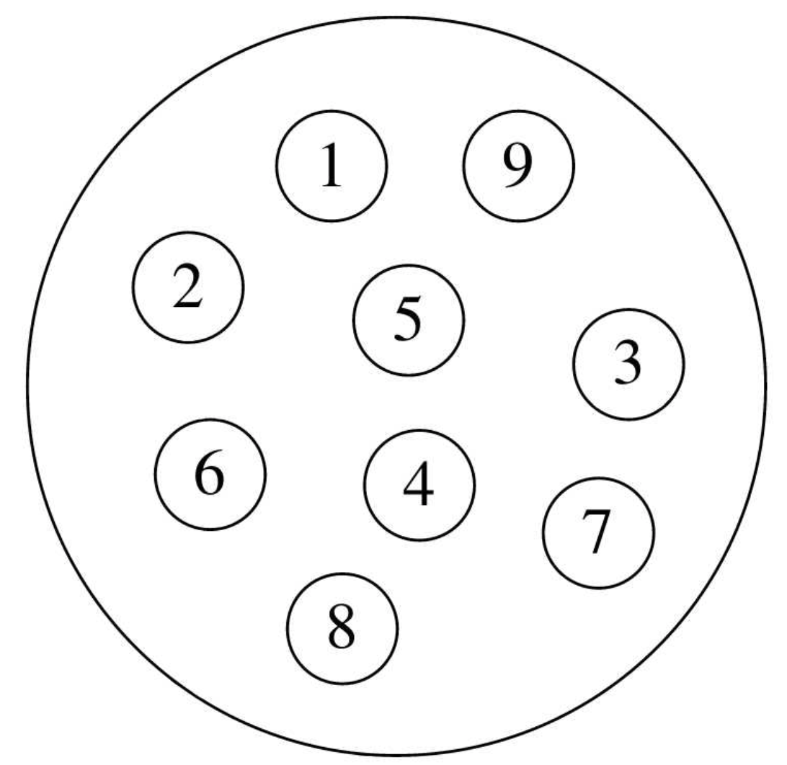
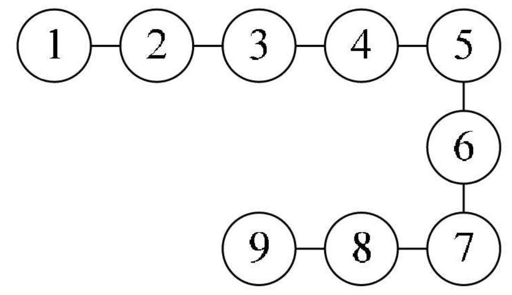
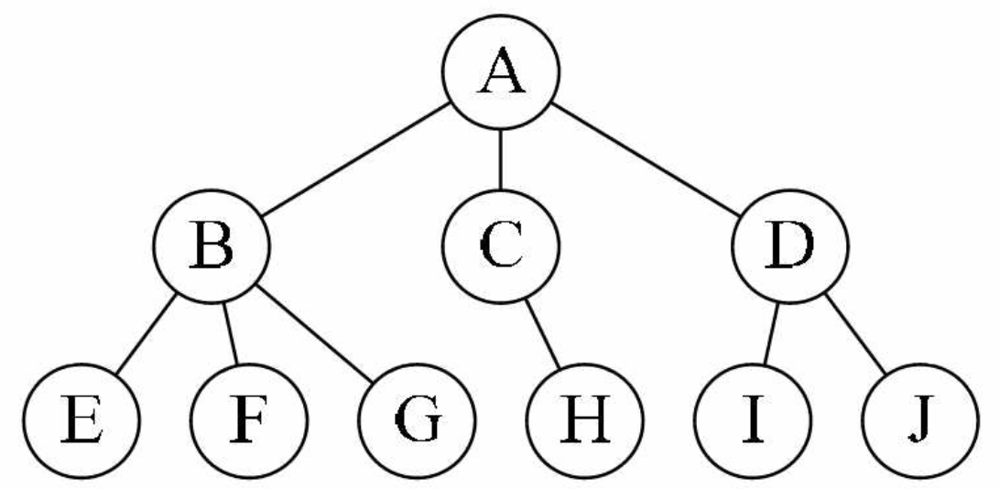
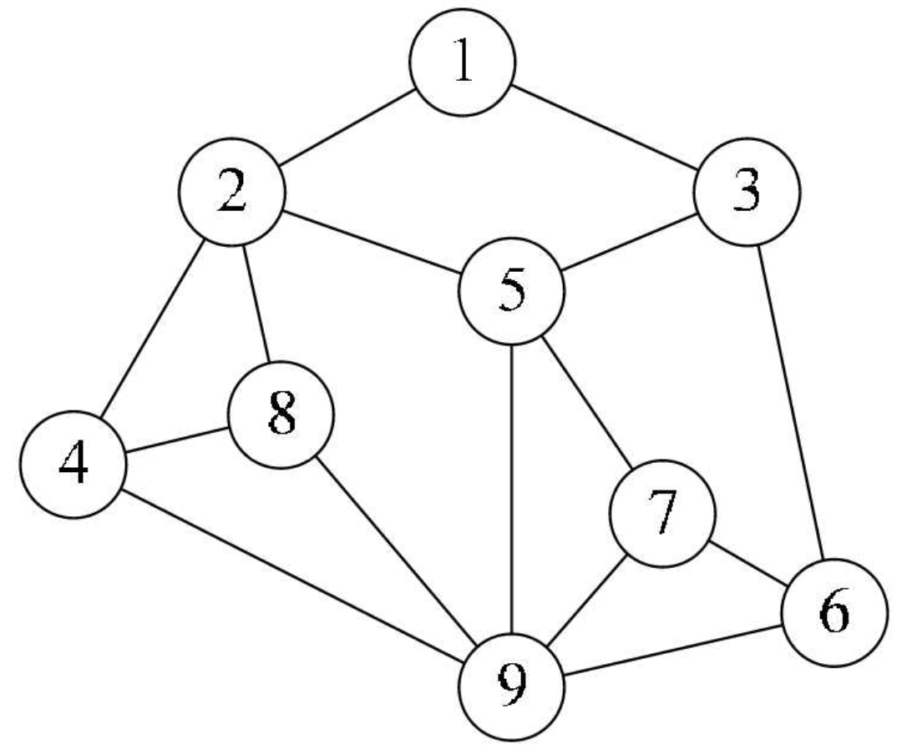
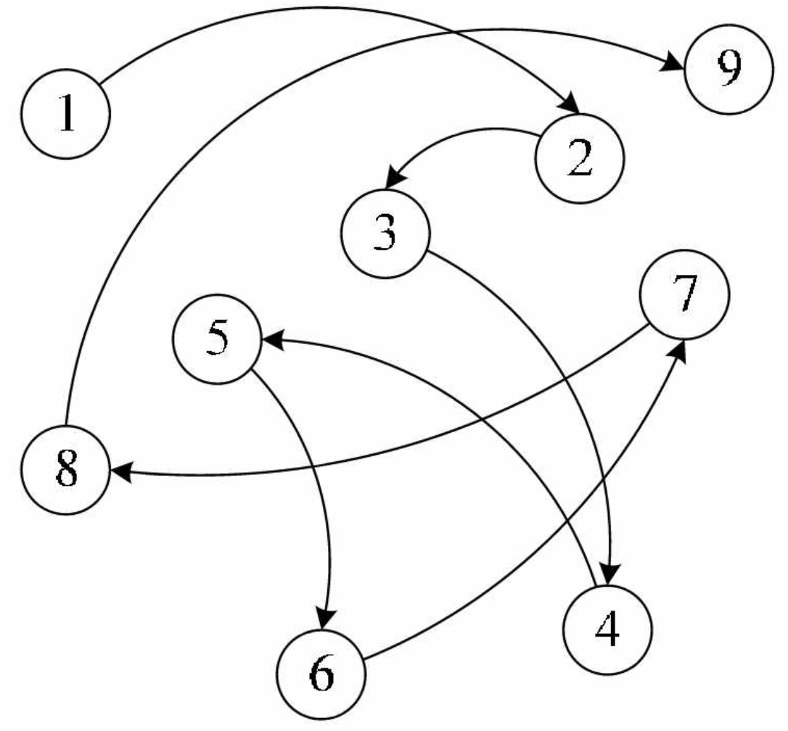

## 什么是数据？
数据，其实就是符号，而且这些符号必须具备两个前提：
· 可以输入到计算机中。
· 能被计算机程序处理。
### 数据元素
数据元素：是组成数据的、有一定意义的基本单位，在计算机中通常作为整体处理。也被称为记录。
### 数据项
数据项：一个数据元素可以由若干个数据项组成。
数据项是数据不可分割的最小单位。在数据结构这门课程中，我们把数据项定义为最小单位，是有助于我们更好地解决问题。所以，记住了，数据项是数据的最小单位。但真正讨论问题时，数据元素才是数据结构中建立数据模型的着眼点。
### 数据对象
数据对象：是性质相同的数据元素的集合，是数据的子集。
### 数据结构
数据结构：是相互之间存在一种或多种特定关系的数据元素的集合。
在计算机中，数据元素并不是孤立、杂乱无序的，而是具有内在联系的数据集合。数据元素之间存在的一种或多种特定关系，也就是数据的组织形式。

## 逻辑结构与物理结构
### 逻辑结构
逻辑结构：是指数据对象中数据元素之间的相互关系。
#### · 集合结构
集合结构：集合结构中的数据元素除了同属于一个集合外，它们之间没有其他关系。

#### · 线性结构
线性结构：线性结构中的数据元素之间是一对一的关系。

#### · 树形结构
树形结构：树形结构中的数据元素之间存在一种一对多的层次关系。

#### · 图形结构
图形结构：图形结构的数据元素是多对多的关系。

### 物理结构
物理结构：是指数据的逻辑结构在计算机中的存储形式。
数据是数据元素的集合，那么根据物理结构的定义，实际上就是如何把数据元素存储到计算机的存储器中。
数据元素的存储结构形式有两种：顺序存储和链式存储。
#### · 顺序存储
顺序存储结构：是把数据元素存放在地址连续的存储单元里，其数据间的逻辑关系和物理关系是一致的。

#### ·链式存储
链式存储结构：是把数据元素存放在任意的存储单元里，这组存储单元可以是连续的，也可以是不连续的。数据元素的存储关系并不能反映其逻辑关系，因此需要用一个指针存放数据元素的地址，这样通过地址就可以找到相关联数据元素的位置。

## 算法
算法是解决特定问题求解步骤的描述，在计算机中表现为指令的有限序列，并且每条指令表示一个或多个操作。
算法具有五个基本特性：输入、输出、有穷性、确定性和可行性。
#### 时间复杂度
推导大O阶：
1. 用常数1取代运行时间中的所有加法常数。 
2. 在修改后的运行次数函数中，只保留最高阶项。 
3. 如果最高阶项存在且不是1，则去除与这个项相乘的常数。

常用的时间复杂度所耗费的时间从小到大依次是：
**O(1) < O(logn) < O(n) < O(nlogn) < O(n^2 ) < O(n^3 ) < O(2^n ) < O(n!) < O(n^n)**
由于 O(n^3 ) 后的算法时间复杂度太高，所以在代码中遇到这样的情况一定要对算法进行优化，否则计算量会相当大。