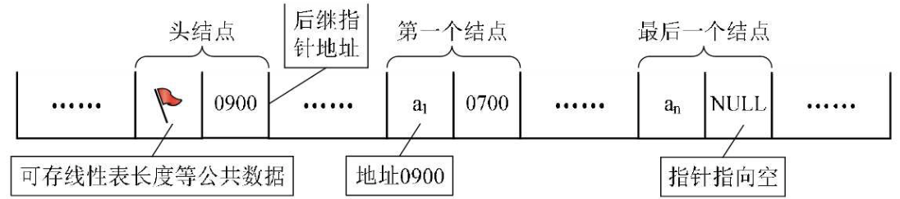
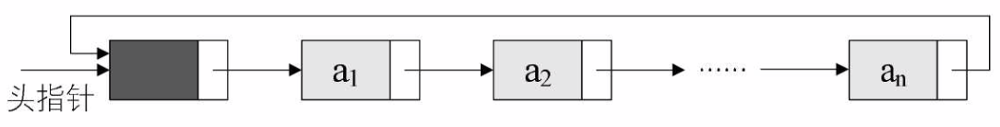

## 链表
链表是线性结构的数据类型，是一种特殊的线性表，包括单向链表，循环链表，双向链表。
### 单向链表

单项链表每个节点包含数据和指针，这个指针会指向后一个节点的地址。其中通常会有一个不含有实际数据的头结点，用来指向第一个有数据的节点。尾结点的指针指向空。
### 循环链表

循环链表就是在单链表的基础上，将最后一个节点的指针指向头节点。
在对循环链表进行遍历的时候，可以通过判断节点的指针指向的是不是头结点来作为循环结束的依据。
循环链表可以从任意节点开始遍历，并能遍历出所有的节点，解决了单向链表无法找到某个节点前面的节点的问题。
### 双向链表

双向链表是在单向链表的基础上，每个节点增加一个指向前一节点的指针。其中头指针的前驱指针指向尾结点，尾结点的后继指针指向头结点。
双向链表在插入删除操作节点的时候，需要修改前后两个节点的指针。
