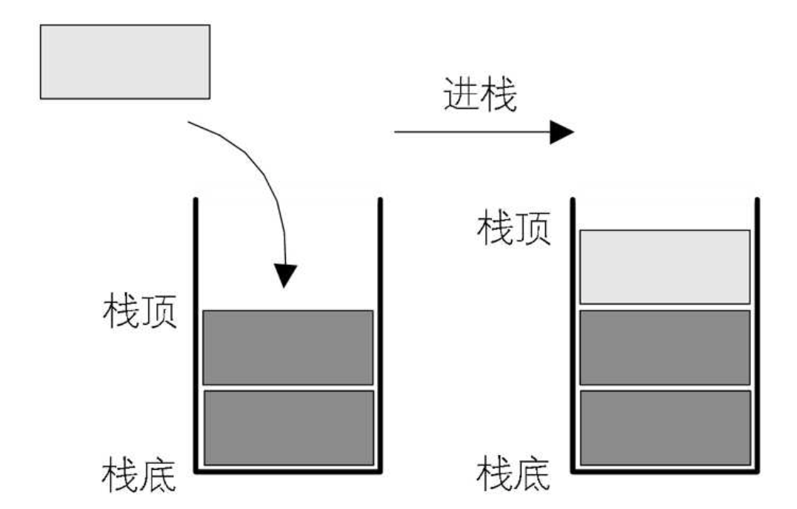
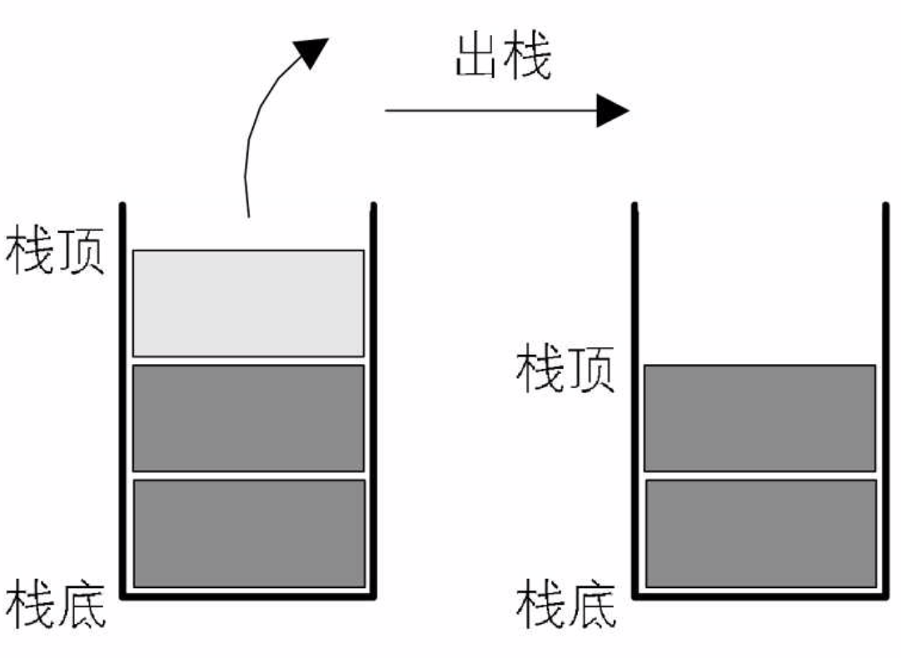
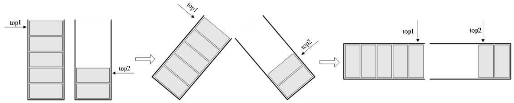
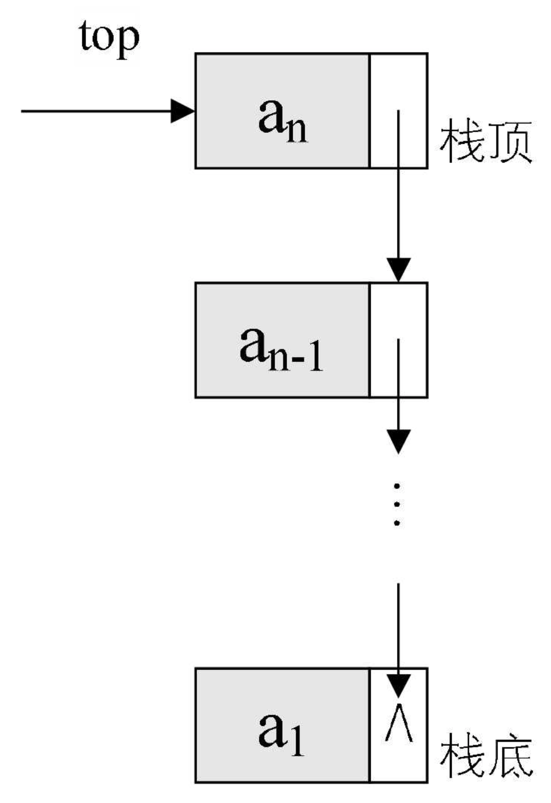
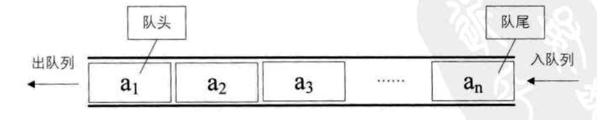
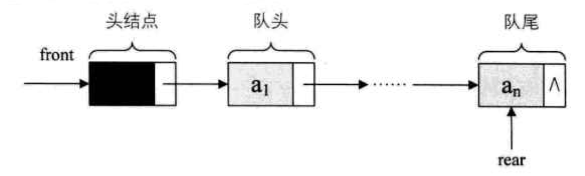

## 栈
栈是限定仅在表尾进行插入和删除操作的线性表。栈通常使用数组来实现。

#### 两栈共享空间
数组有两个端点，两个栈有两个栈底，让一个栈的栈底为数组的始端，即下标为0处，另一个栈为数组的末端，即下标为数组长度n-1处。这样，两个栈如果增加元素，就是两端点向中间延伸。

两个栈见面之时，也就是两个指针之间相差1时，即top1+1==top2为栈满。
事实上，使用这样的数据结构，通常都是当两个栈的空间需求有相反关系时，也就是一个栈增长时另一个栈在缩短的情况。就像买卖股票一样，你买入时，一定是有一个你不知道的人在做卖出操作。有人赚钱，就一定是有人赔钱。这样使用两栈共享空间存储方法才有比较大的意义。否则两个栈都在不停地增长，那很快就会因栈满而溢出了。
### 链栈
链栈是栈的链式存储结构。将链表的第一个节点作为栈顶，尾结点作为栈底。链栈不需要头结点，取而代之的是栈顶指针，即下图中的 top 指针。

入栈出栈操作就是通过修改第一个节点来实现。
### 后缀表达式
后缀表达式又叫逆波兰表达式。
对于“9+(3-1)×3+10÷2”，如果要用后缀表示法应该是：“9 3 1 - 3 × + 10 2 / +”，叫后缀的原因在于所有的符号都是在要运算数字的后面出现。显然，这里没有了括号。
如：我们平时写a+b，这是中缀表达式，写成后缀表达式就是：ab+
##### 后缀表达式的转换：
**先按运算符优先级给表达式都加上括号，然后从内向外或从外向内进行后缀转换（将当前运算符提到当前两个表达式后面），最终就成了后缀表达式的形式。**
(a+b)×c-(a+b)/e 的后缀表达式为：
→(((a+b)×c)-((a+b)/e))
→(((ab+)×c)-((ab+)/e))
→((ab+c×)-(ab+e/))
→(ab+c×ab+e/-)
→ab+c×ab+e/-
从外向内转换结果也是一样的：
→(((a+b)×c)-((a+b)/e))
→((a+b)×c)((a+b)/e)-
→((a+b)c×)((a+b)e/)-
→(ab+c×)(ab+e/)-
→ab+c×ab+e/-
##### 后缀表达式的运算：
先创建一个栈，然后从左到右遍历后缀表达式，遇到数字就进栈，遇到运算符就将栈顶的两个数字出栈然后用运算符进行计算后将计算结果再入栈，一直到最终得到最后的结果。
*注：出栈的两个数字进行运算时要将第二个数字在前与第一个数字进行运算。

##### 中缀表达式转后缀表达式算法：
1. 先创建两个栈 A 和 T，A 作为最终生成栈，T 作为临时操作栈。
2. 然后从左到右遍历中缀表达式：
    * 若是数字则直接入 A 栈，即成为后缀表达式的一部分。
    * 若是运算符则操作 T 栈，逻辑为：
        + 当 T 栈为空时则直接入栈。
        + 当 T 栈不为空时则判断当前运算符：
            - 当前运算符为左括号，直接入栈
            - 若当前运算符优先级低于或等于栈顶运算符，则将栈顶的运算符出 T 栈入 A 栈，然后继续和下一个栈顶运算符比较，直到遇到左括号、栈为空或优先级更低的运算符，这时将当前运算符入 T 栈;
            - 若当前运算符为右括号，则将栈顶运算符依次出 T 栈入 A 栈，直到遇到左括号，然后将左括号出栈，丢弃左右括号继续遍历。
3. 当中缀表达式遍历结束后，将 T 栈中的运算符依次出 T 栈入 A 栈。
4. 将 A 栈中的元素逐一出栈然后倒序则为最终的后缀表达式。
注：下面学习了队列，A 栈用队列来实现，就可以免除倒序的步骤了。

## 队列
队列是只允许在一端进行插入操作、而在另一端进行删除操作的线性表。

### 链队列
队列的链式存储结构，实际就是线性表的单链表，只不过它只能从尾进从头出而已。
