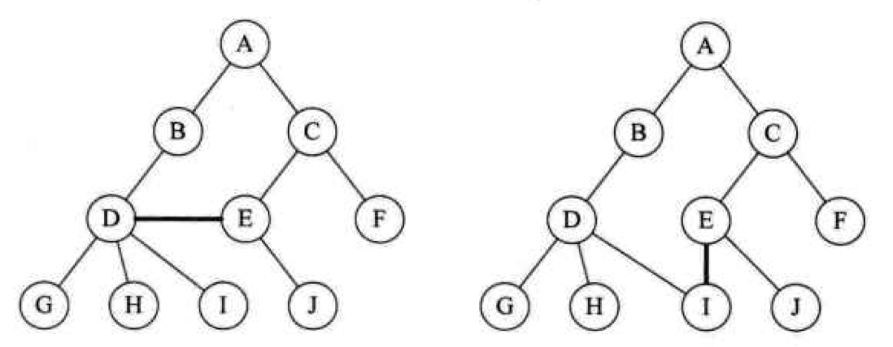
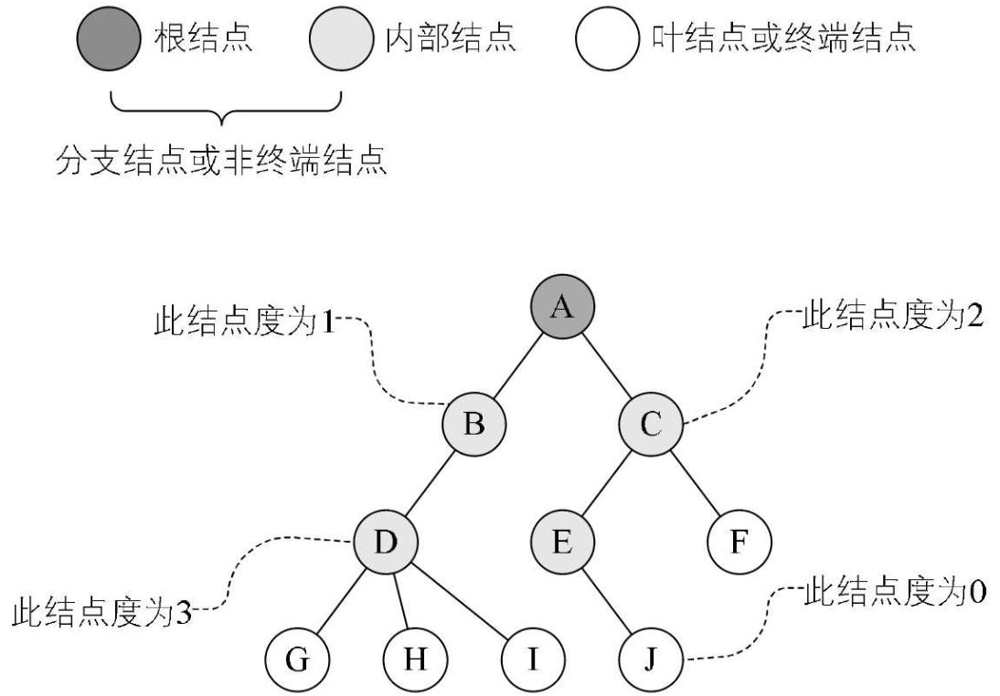
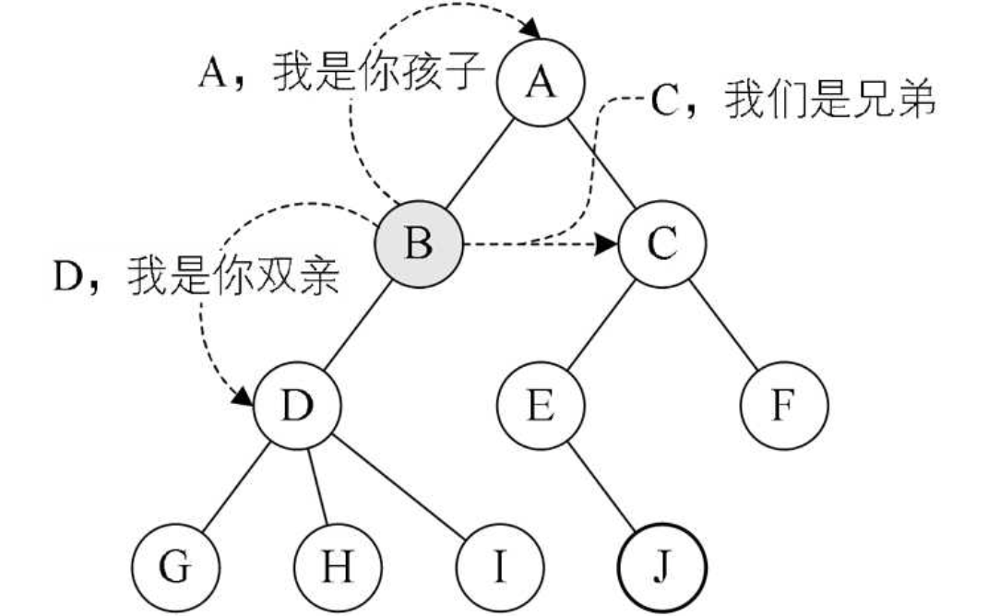

# 树
树（tree）是 n (n≥0)个节点的有线集。n=0 时称为空树。在任意一颗非空树中：（1）有且仅有一个特定的称为根（Root）的节点；（2）当 n>1 时，其余节点可分为 m (m>0) 个互不相交的有限集 $T_1$、$T_2$、……、$T_m$，其中每一个集合本身又是一棵树，并且称为根的子树（SubTree）。
注：子树的个数没有限制，但它们一定不相交。下图中的结构就不符合树的定义，因为它们都有相交的子树。

#### 节点分类
节点拥有的子树被称为节点的度（Degree）。度为0的节点称为叶节点（Leaf）或终端节点；度不为0的节点称为分支节点或非终端节点。除根节点之外，分支节点也称为内部节点。树的度是树内各节点的度的最大值。

###### （上图树中各节点度数的最大值是 D 节点的3，所以树的度也为3）
#### 节点间的关系
节点的子树的根节点称为该节点的子节点（Child），相应的，该节点称为子节点的父节点（Parent）。同一个父节点的子节点称为兄弟节点（Sibling）。节点的祖先是从根节点到该节点所经分支上的所有节点。以某节点为根的子树中的任一节点都称为该节点的子孙。

#### 节点的层次
节点的层次（Level）从根开始定义，根节点为第一层，根的子节点为第二层。树中节点的最大层次称为树的深度（Depth）或高度。

