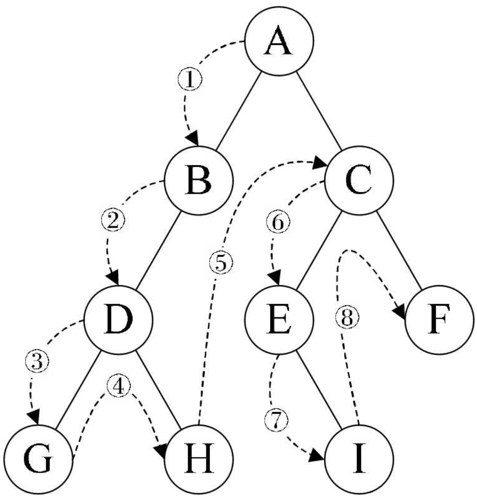
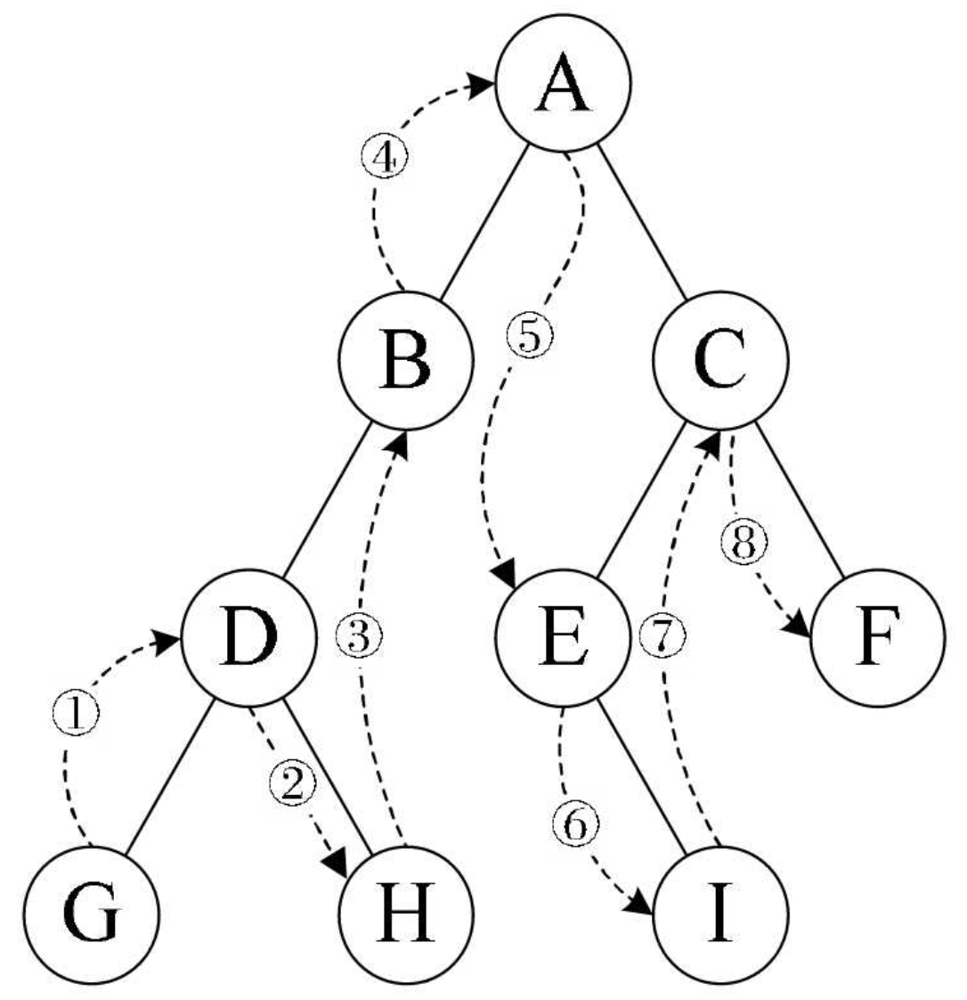
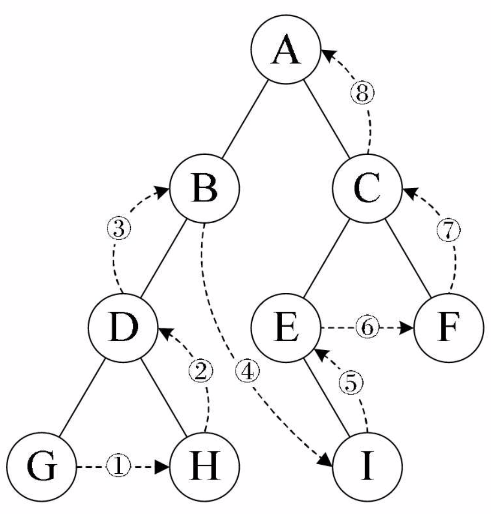
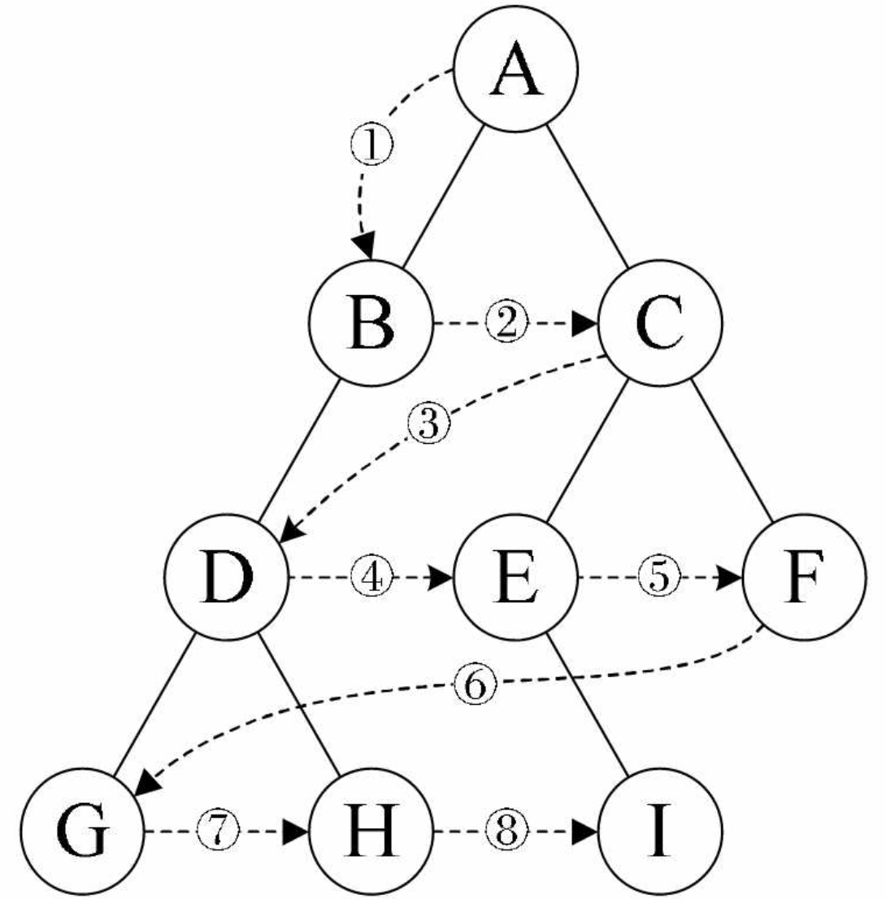

# 遍历二叉树
## 二叉树遍历原理
二叉树的遍历（traversing binary tree）是指从根结点出发，按照某种次序依次访问二叉树中所有结点，使得每个结点被访问一次且仅被访问一次。
## 二叉树遍历方法
### 前序遍历
规则是若二叉树为空，则空操作返回，否则先访问根结点，然后前序遍历左子树，再前序遍历右子树。

#### 遍历算法：
```js
// 接收一个二叉树
function preOrderTraverse(biTree) {
    if (!biTree) {
        return;
    }
    console.log(biTree.data);  // 当前节点数据
    preOrderTraverse(biTree.lChild);  // 递归遍历左子树
    preOrderTraverse(biTree.rChild);  // 递归遍历右子树
}
```
1. 从根节点开始递归遍历左子树，一直往下递归遍历。
2. 当发现没有左子树时，左子树的递归遍历结束，返回上一个节点获取其右子树。
    * 当没有右子树时，递归遍历结束，继续返回上一个节点获取其右子树。
    * 当右子树存在时，继续递归遍历这棵树，同样会先递归遍历其左子树（同步骤1）。

**这里主要是利用里递归的归的特性，实现一直遍历左子树，没有后就会返回上一个节点再遍历右子树。从而遍历完整棵树。**
所以上图中遍历顺序为：**ABDGHCEIF**

### 中序遍历
规则是若树为空，则空操作返回，否则从根结点开始（注意并不是先访问根结点），中序遍历根结点的左子树，然后是访问根结点，最后中序遍历右子树。

#### 遍历算法：
```js
// 接收一个二叉树
function inOrderTraverse(biTree) {
    if (!biTree) {
        return;
    }
    inOrderTraverse(biTree.lChild);  // 递归遍历左子树
    console.log(biTree.data);  // 当前节点数据
    inOrderTraverse(biTree.rChild);  // 递归遍历右子树
}
```
中序遍历算法和前序遍历相同，但是获取节点数据的时机不同。获取节点数据的时机从遍历到这个节点即获取数据改为从左子树返回到此节点时获取数据。
所以上图中遍历顺序为：**GDHBAEICF**

### 后序遍历
规则是若树为空，则空操作返回，否则从左到右先叶子后结点的方式遍历访问左右子树，最后是访问根结点。

#### 遍历算法：
```js
// 接收一个二叉树
function postOrderTraverse(biTree) {
    if (!biTree) {
        return;
    }
    postOrderTraverse(biTree.lChild);  // 递归遍历左子树
    postOrderTraverse(biTree.rChild);  // 递归遍历右子树
    console.log(biTree.data);  // 当前节点数据
}
```
后序遍历获取数据是在左右子树都遍历完成后返回时获取。
所以上图中遍历顺序为：**GHDBIEFCA**

### 层序遍历
规则是若树为空，则空操作返回，否则从树的第一层，也就是根结点开始访问，从上而下逐层遍历，在同一层中，按从左到右的顺序对结点逐个访问。

#### 遍历算法：
```js
function layerTraverse(...biTree) {  // 接收当前层的所有二叉树
  if (!biTree.length) {
    return;
  }

  let subs = [];  // 下一层的二叉树
  biTree.forEach(item => {  // 遍历当前层的二叉树
      console.log(item.data);  // 获取数据
      item.lChild && subs.push(item.lChild);  // 下一层的左子树存在时，则此左子树放入 subs
      item.rChild && subs.push(item.rChild);  // 下一层的右子树存在时，则此右子树放入 subs
  });
  layerTraverse(...subs);  // 递归调用下一层所有二叉树
}
```
层序遍历算法就有所不同了，一层一层的遍历即可。