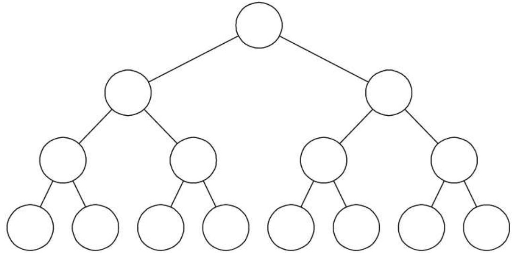
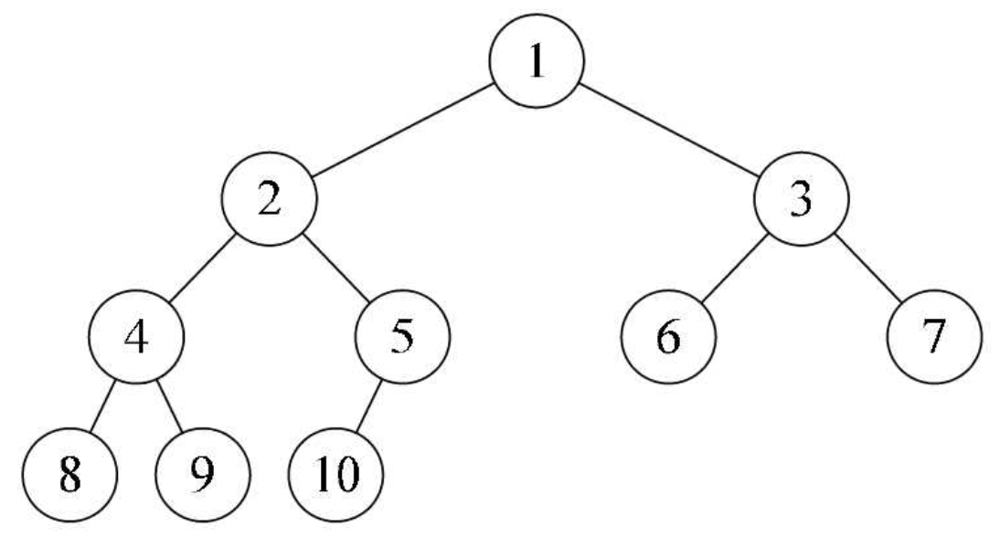
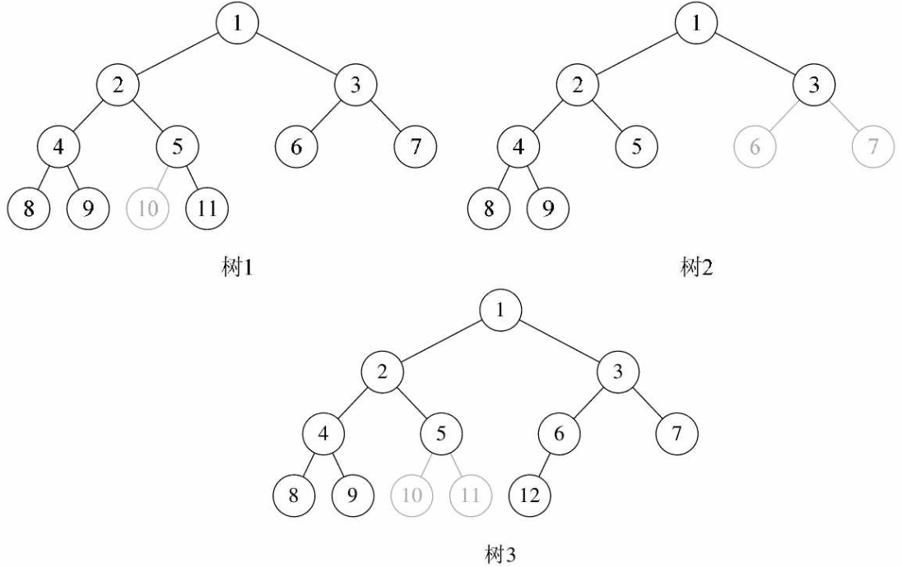
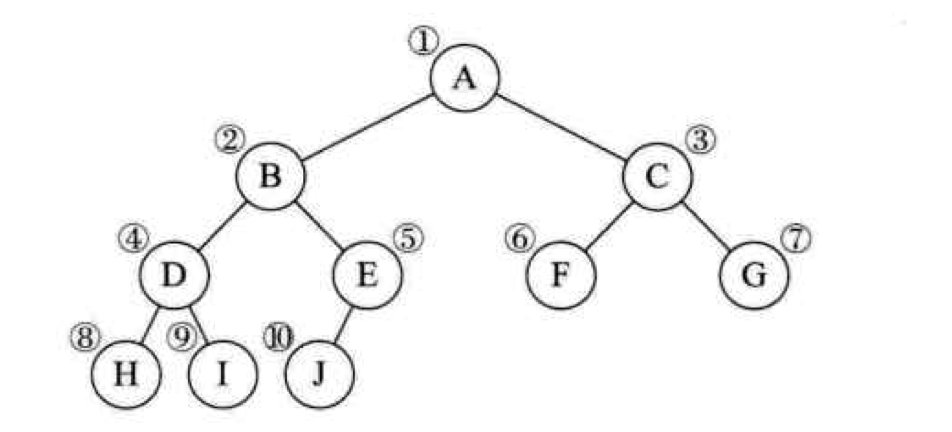
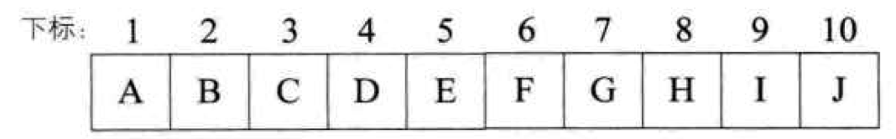
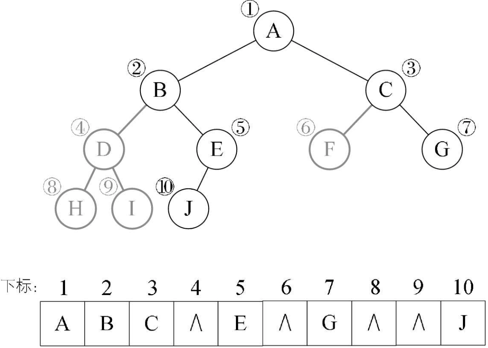
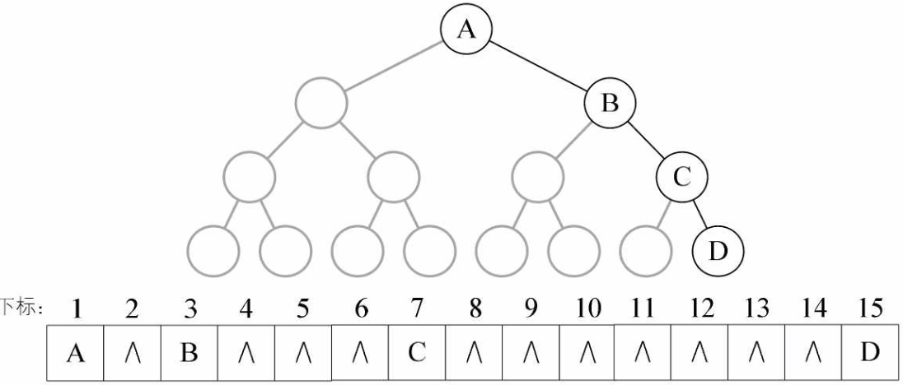
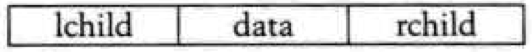
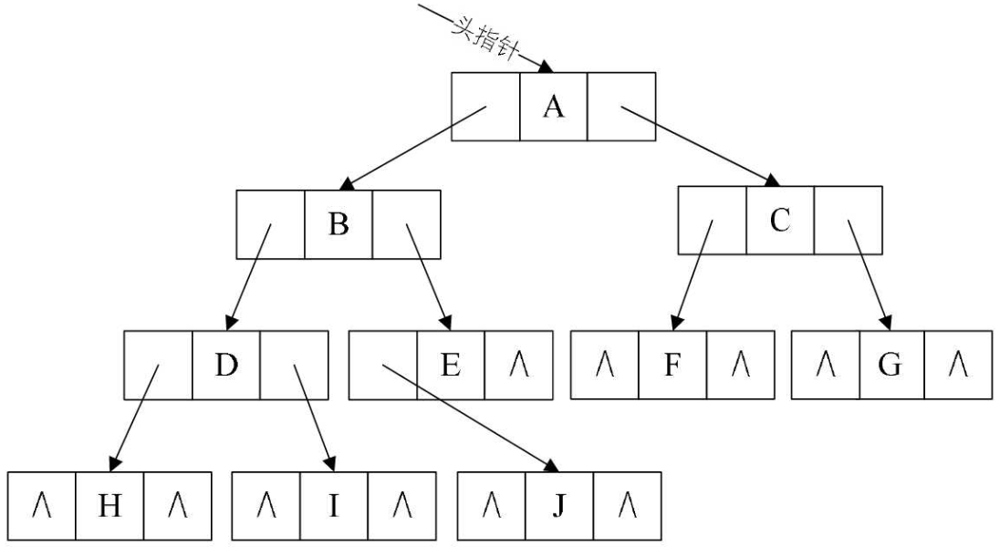

# 二叉树
**二叉树（Binary tree）是 n(n≥0)个节点的有限集合，该集合或者为空集（称为空二叉树），或者由一个根节点和两颗互不相交的、分别称为根节点的左子树和右子树的二叉树组成。**
#### 二叉树的特点
* 每个结点最多有两棵子树，所以二叉树中不存在度大于2的结点。注意不是只有两棵子树，而是最多有。没有子树或者有一棵子树都是可以的。
* 左子树和右子树是有顺序的，次序不能任意颠倒。就像人有双手、双脚，但显然左手、左脚和右手、右脚是不一样的，右手戴左手套、右脚穿左鞋都会极其别扭和难受。
* 即使树中某结点只有一棵子树，也要区分它是左子树还是右子树。

**二叉树具有五种基本形态：** 1.空二叉树。 2.只有一个根结点。 3.根结点只有左子树。 4.根结点只有右子树。 5.根结点既有左子树又有右子树。

### 特殊二叉树
**1．斜树**
顾名思义，斜树一定要是斜的，但是往哪斜还是有讲究。所有的结点都只有左子树的二叉树叫左斜树。所有结点都是只有右子树的二叉树叫右斜树。这两者统称为斜树。

**2．满二叉树**
在一棵二叉树中，如果所有分支结点都存在左子树和右子树，并且所有叶子都在同一层上，这样的二叉树称为满二叉树。

满二叉树的特点有：（1）叶子只能出现在最下一层。出现在其他层就不可能达成平衡。（2）非叶子结点的度一定是2。否则就是“缺胳膊少腿”了。（3）在同样深度的二叉树中，满二叉树的结点个数最多，叶子数最多。

**3．完全二叉树**
对一棵具有n个结点的二叉树按层序编号，如果编号为i（1≤i≤n）的结点与同样深度的满二叉树中编号为i的结点在二叉树中位置完全相同，则这棵二叉树称为完全二叉树。
说人话就是：完全二叉树就是相同层级的满二叉树，从最后一个叶节点开始往前去掉了 n 个叶节点形成的二叉树。
###### 所以下图是个完全二叉树

###### 下面三个都不是完全二叉树


## 二叉树的性质
二叉树有一些需要理解并记住的特性，以便于我们更好地使用它。
1. 在二叉树的第 i 层上至多有 $2^{i-1}$ 个结点（i≥1）。
2. 深度为 k 的二叉树至多有$2^k-1$个结点（k≥1）。
3. 对任何一棵二叉树 T，如果其终端结点数为 $n_0$，度为2的结点数为 $n_2$，则 $n_0=n_2+1$。终端结点数其实就是叶子结点数，而一棵二叉树，除了叶子结点外，剩下的就是度为1或2的结点数了，我们设 $n_1$ 为度是1的结点数。则树 T 结点总数 $n=n_0 +n_1+n_2$。（注：$n_0$即叶节点，$n_1$即度为1的节点，$n_2$即度为2的节点）
4. 具有 n 个节点的完全二叉树的深度为$⌊log_2^n⌋+1$。（$⌊⌋$这个符号表示向下取整）

## 二叉树的存储结构
### 顺序存储
二叉树由于是一种特殊的树，具有从上到下有序的的性质，所以可以用数组来存储。
先来看看完全二叉树的顺序存储：

将这颗二叉树存储到数组中，相应的下标对应其同样的位置：

可以看出完全二叉树在数组中为顺序存储一一对应的关系。

当然普通的二叉树尽管中间可能存在节点不对应的情况，但是我们仍然可以将其按完全二叉树编号，只不过将不存在的节点设置为 ^ 即可。

但考虑到极端情况，一棵深度为 k 的右斜树，它只有 k 个结点，却需要分配 $2^k-1$ 个存储单元空间，这显然是对存储空间的浪费。所以，顺序存储结构一般只用于完全二叉树。


### 链表存储
二叉树每个结点最多有两个孩子，所以为它设计一个数据域和两个指针域是比较自然的想法，我们称这样的链表叫做二叉链表。
节点结构：

二叉树结构：

##### js 中数据结构
```js
const biTree = {  // 根节点
    data: 1,  // 节点数据
    lChild: {  // 左子树
        data: 2,  // 每个子树的第一层就是子节点，也是这个子树的根节点
        lChild: {
            data: 3,
            lChild: {
                data: 11
            }
        },
        rChild: {
            data: 4,
            lChild: {
                data: 9,
                rChild: {
                    data: 10
                }
            }
        }
    },
    rChild: {  // 右子树
        data: 5,
        lChild: {
            data: 6,
            lChild: {
                data: 8
            }
        },
        rChild: {
            data: 7
        }
    }
};
```
