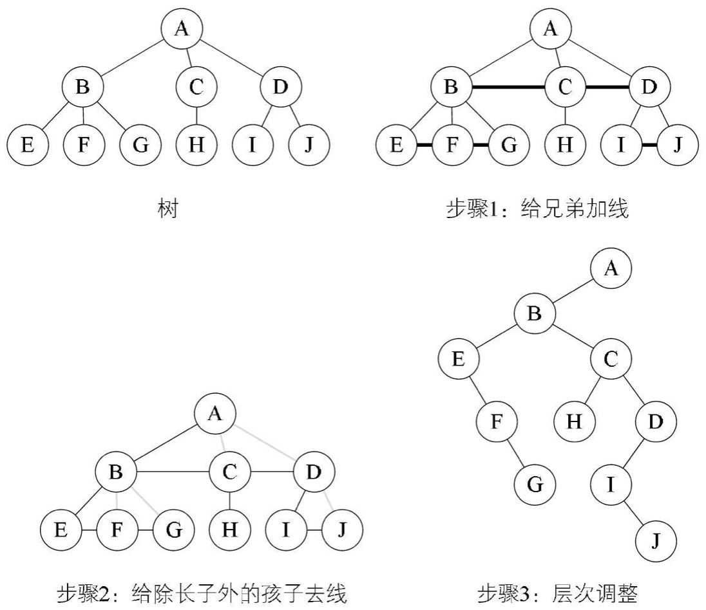
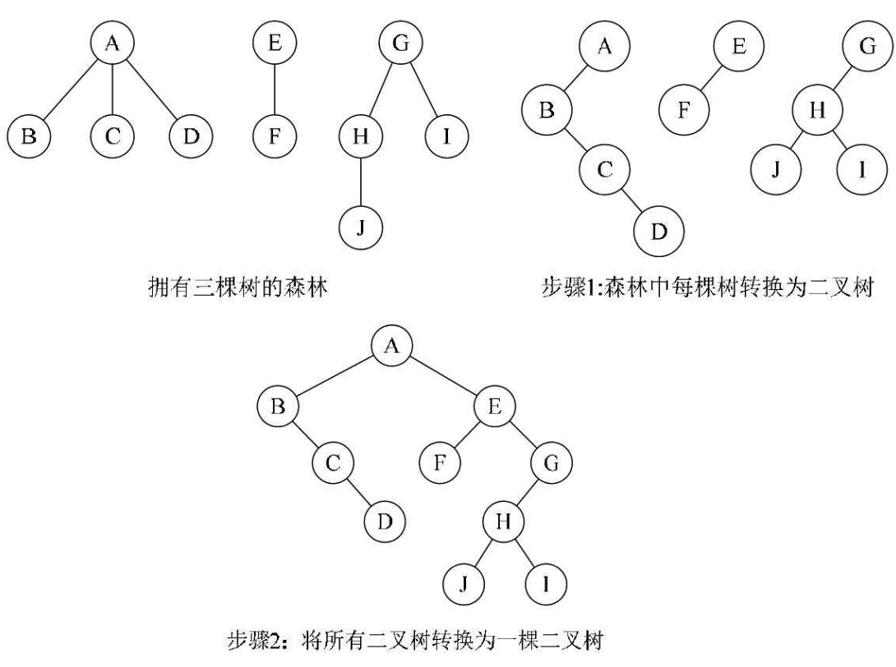
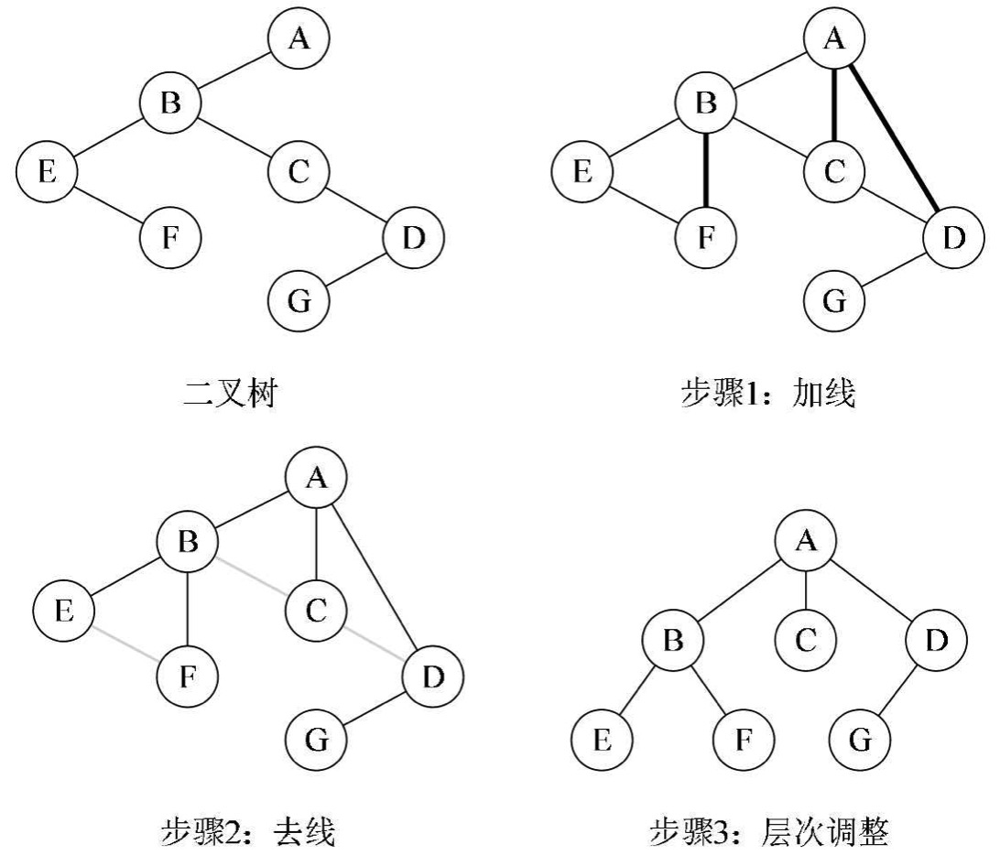
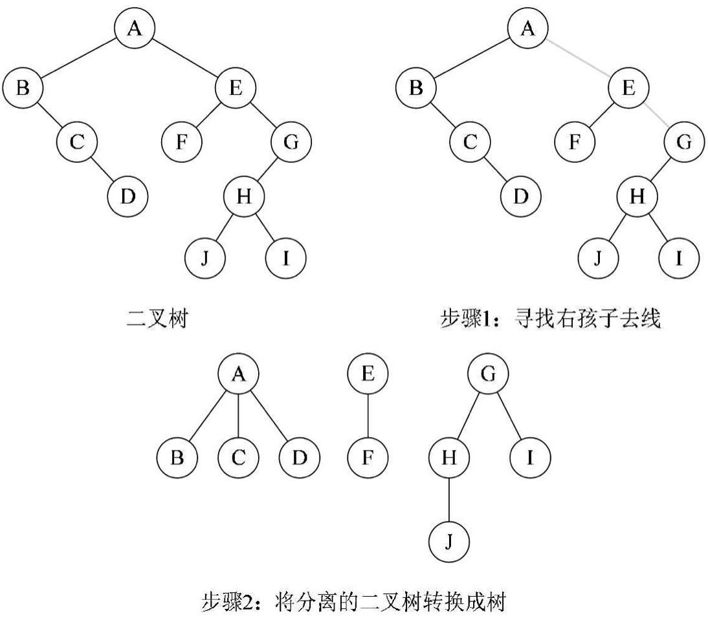

# 树转换为二叉树
将树转换为二叉树的步骤如下：
1. 加线：在所有兄弟节点之间加一条连线。
2. 去线：对树中每个节点，只保留它与第一个子节点（即左节点）的连线，删除它与其它子节点的连线。兄弟节点之间的连线保留。
3. 层次调整：以根节点为轴心，对树的每一层进行一定角度的旋转，使其层次分明。

###### 可以看出，由于根节点没有兄弟节点，所以根节点只有左节点。

# 森林转换为二叉树
森林是由若干棵树组成的，所以完全可以理解为，森林中的每一棵树都是兄弟，可以按照兄弟的处理办法来操作。
1. 把每棵树转换成二叉树。
2. 第一颗二叉树不动，从第二棵二叉树开始，依次把后一棵二叉树的根结点作为前一棵二叉树的根结点的右孩子，用线连接起来。当所有的二叉树连接起来后就得到了由森林转换来的二叉树。

# 二叉树转换为树
二叉树转换为树是树转换为二叉树的逆过程，也就是反过来做而已。步骤如下：
1. 加线：若某结点 A 的左子节点存在，则递归找出节点 A 的左子节点的右子节点 B，以及 B 的右子节点 C，C 的右子节点 D...，最后节点 A 和这些右子节点一一相连。
2. 去线：删除原二叉树中所有节点与其右子节点的连线。 
3. 层次调整：使之结构层次分明。

# 二叉树转换为森林
判断一棵二叉树能够转换成一棵树还是森林，标准很简单，那就是只要看这棵二叉树的根结点有没有右子节点，有就是森林，没有就是一棵树。那么如果是转换成森林，步骤如下：
1. 从根结点开始，若右子节点存在，则把与右子结点的连线删除，再查看分离后的二叉树，若右孩子存在，则连线删除……，直到所有右子节点连线都删除为止，得到分离的二叉树。
2. 将每颗分离后的二叉树转换为树即可。

