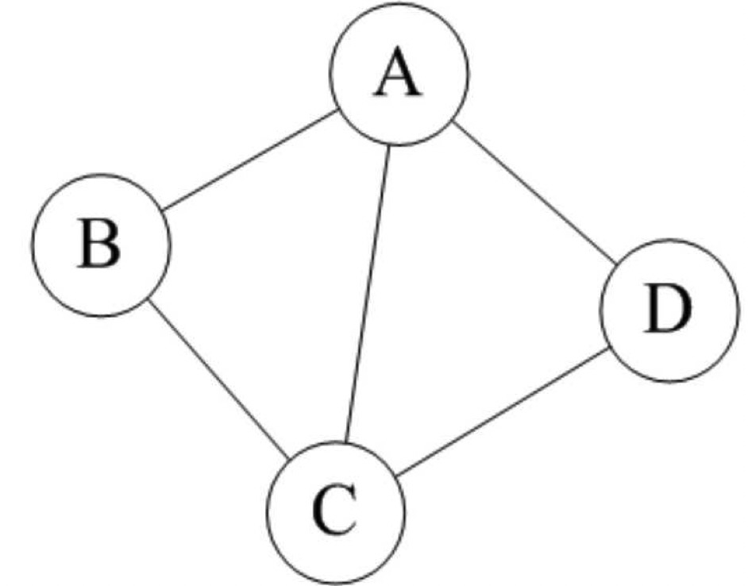
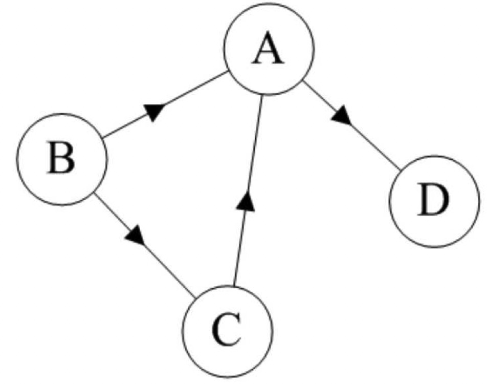
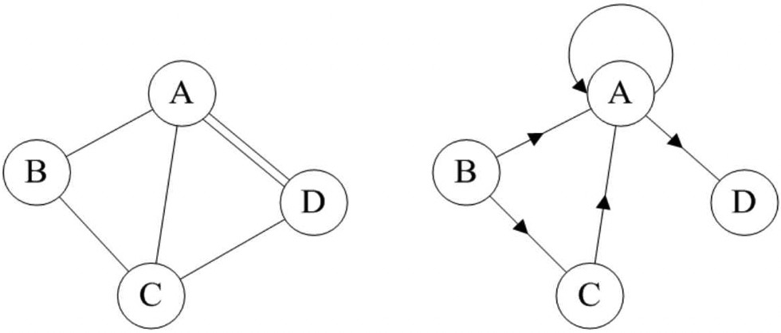
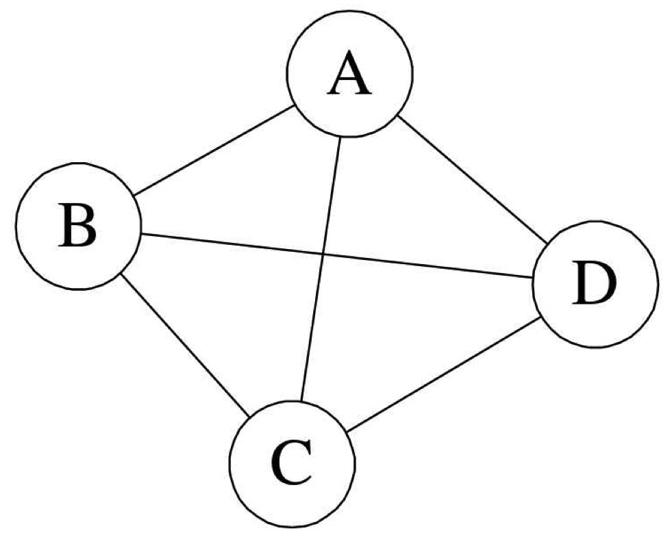
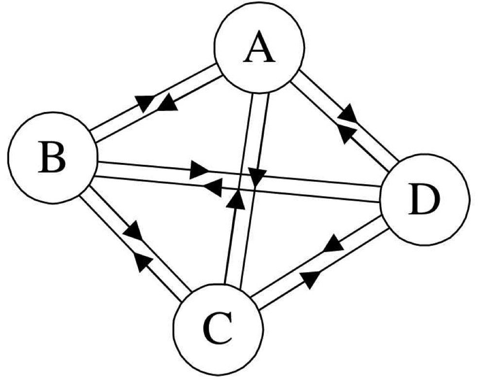
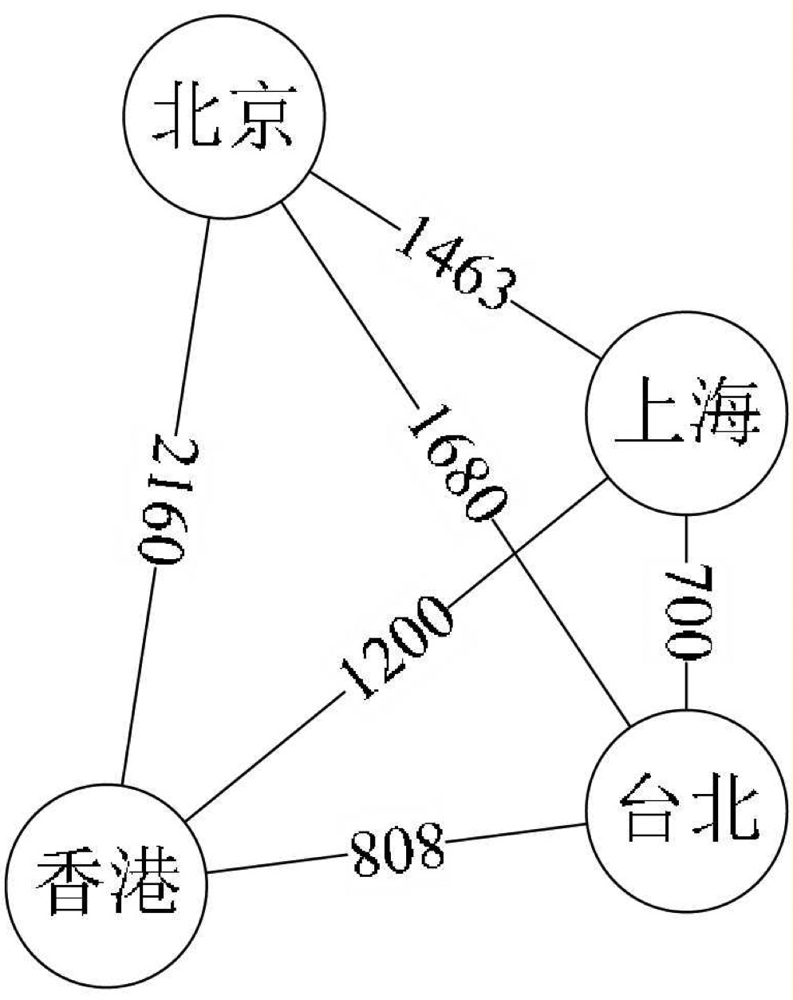

# 图的定义
图（Graph）是由顶点的有穷非空集合和顶点之间边的集合组成，通常表示为：$G(V,E)$，其中，G 表示一个图，V 是图 G 中顶点的集合，E 是图 G 中边的集合。

**对于图的定义，我们需要明确几个注意的地方。**
* 线性表中我们把数据元素叫元素；树中将数据元素叫节点；在图中数据元素，我们则称之为顶点（Vertex）。
* 线性表中可以没有数据元素，称为空表。树中可以没有结点，叫做空树。那么对于图呢？我记得有一个笑话说一个小朋友拿着一张空白纸给别人却说这是他画的一幅“牛吃草”的画，“那草呢？”“草被牛吃光了。”“那牛呢？”“牛吃完草就走了呀。”之所以好笑是因为我们根本不认为一张空白纸算作画的。同样，**在图结构中，不允许没有顶点**。在定义中，若 V 是顶点的集合，则强调了顶点集合 V 有穷非空。
* 线性表中，相邻的数据元素之间具有线性关系；树结构中，相邻两层的结点具有层次关系；而图中，任意两个顶点之间都可能有关系，顶点之间的逻辑关系用边来表示，边集可以是空的。

## 各种图定义
### 无向边
若顶点 $v_i$ 到 $v_j$ 之间的边没有方向，则称这条边为无向边（Edge），用无序偶对$(v_i,v_j)$来表示。如果图中任意两个顶点之间的边都是无向边，则称该图为无向图（Undirected graphs）。

###### 连接顶点A与D的边，可以表示成无序对$(A,D)$，也可以写成$(D,A)$。
对于无向图 $G_1$ 来说，$G_1=(V_1,\{E_1\})$，其中顶点集合 $V_1=\{A,B,C,D\}$；边集合 $E_1=\{(A,B),(B,C),(C,D),(D,A),(A,C)\}$

### 有向边
若从顶点 $v_i$ 到 $v_j$ 的边有方向，则称这条边为有向边，也称为弧（Arc）。用有序偶$<v_i,v_j>$来表示，$v_i$ 称为弧尾（Tail），$v_j$ 称为弧头（Head）。如果图中任意两个顶点之间的边都是有向边，则称该图为有向图（Directed graphs）。

###### 连接顶点A到D的有向边就是弧，A是弧尾，D是弧头，$<A,D>$表示弧，注意不能写成$<D,A>$。
对于有向图 $G_2$ 来说，$G_2=(V_2,\{E_2\})$，其中顶点集合 $V_2=\{A,B,C,D\}$；弧集合 $E_2=\{<A,D>,<B,A>,<C,A>,<B,C>\}$。

### 简单图
在图中，若不存在顶点到其自身的边，且同一条边不重复出现，则称这样的图为简单图。我们课程里要讨论的都是简单图。

###### 以上的图都不是简单图。

### 完全图
在无向图中，如果任意两个顶点之间都存在边，则称该图为无向完全图。含有n个顶点的无向完全图有 $n(n-1)/2$ 条边。

在有向图中，如果任意两个顶点之间都存在方向互为相反的两条弧，则称该图为有向完全图。含有n个顶点的有向完全图有 $n×(n-1)$ 条边。

从这里也可以得到结论，对于具有n个顶点和e条边数的图，无向图 $0≤e≤n(n-1)/2$，有向图 $0≤e≤n(n-1)$。

有很少条边或弧的图称为稀疏图，反之称为稠密图。这里稀疏和稠密是模糊的概念，都是相对而言的。比如我去上海世博会那天，参观的人数差不多50万人，我个人感觉人数实在是太多，可以用稠密来形容。可后来听说，世博园里人数最多的一天达到了103万人，啊，50万人是多么的稀疏呀。

### 网（带权图）
有些图的边或弧具有与它相关的数字，这种与图的边或弧相关的数叫做权（Weight）。这些权可以表示从一个顶点到另一个顶点的距离或耗费。这种带权的图通常称为网（Network）。以下就是一张带权的图，即标识中国四大城市的直线距离的网，此图中的权就是两地的距离。

### 子图
假设有两个图 $G=(V,\{E\})$ 和 $G'=(V',\{E'\})$，如果 $V'\subseteq V$ 且 $E'\subseteq E$，则称 $G'$ 为 $G$ 的子图（Sub-graph）。

### 图的顶点与边间关系
对于无向图 $G=(V,\{E\})$，如果边$(v,v')\in E$，则称顶点v和v'互为邻接点（Adjacent），即v和v'相邻接。边$(v,v')$依附（incident）于顶点v和v'，或者说$(v,v')$与顶点v和v'相关联。顶点v的度（Degree）是和v相关联的边的数目，记为$TD(v)$。

对于有向图$G=(V,\{E\})$，如果弧$<v,v'>\in E$，则称顶点v邻接到顶点v'，顶点v'邻接自顶点v。弧$<v,v'>$和顶点v，v'相关联。以顶点v为头的弧的数目称为v的入度（InDegree），记为$ID(v)$；以v为尾的弧的数目称为v的出度（OutDegree），记为$OD(v)$；顶点v的度为$TD(v)=ID(v)+OD(v)$。

### 路径
无向图$G=(V,\{E\})$中从顶点v到顶点v'的路径（Path）是一个顶点序列$(v=v_{i,0},v_{i,1},...,v_{i,m}=v')$，其中$(v_{i,j-1},v_{i,j})\in E，1≤j≤m$。

如果G是有向图，则路径也是有向的，顶点序列应满足$<v_{i,j-1},v_{i,j}>∈E，1≤j≤m$。

路径的长度是路径上的边或弧的数目。

第一个顶点和最后一个顶点相同的路径称为回路或环（Cycle）。序列中顶点不重复出现的路径称为简单路径。除了第一个顶点和最后一个顶点之外，其余顶点不重复出现的回路，称为简单回路或简单环。

###### 图中两个图的粗线都构成环，左侧的环因第一个顶点和最后一个顶点都是B，且C、D、A没有重复出现，因此是一个简单环。而右侧的环，由于顶点C的重复，它就不是简单环了。

### 连通图相关术语
**在无向图 $G$ 中，如果从顶点 $v$ 到顶点 $v'$ 有路径，则称 $v$ 和 $v'$ 是连通的。如果对于图中任意两个顶点 $v_i、v_j∈V，v_i 和 v_j$都是连通的，则称 $G$ 是连通图（Connected Graph）。**

###### 图1中 ABCD 和 EF 之间无路径，所以不是连通图。图2为连通图。
**无向图中的极大连通子图称为连通分量**。注意连通分量的概念，它强调：
* 要是子图；
* 子图要是连通的；
* 连通子图含有极大顶点数；
* 具有极大顶点数的连通子图包含依附于这些顶点的所有边。

图1是一个无向非连通图。但是它有两个连通分量，即图2和图3。而图4，尽管是图1的子图，但是它却不满足连通子图的极大顶点数（图2满足）。因此它不是图1的无向图的连通分量。

**在有向图 $G$ 中，如果对于每一对 $v_i、v_j∈V、v_i≠v_j，从 v_i 到 v_j 和从 v_j 到 v_i$ 都存在路径，则称G是强连通图。有向图中的极大强连通子图称做有向图的强连通分量。**

###### 图1并不是强连通图，因为顶点A到顶点D存在路径，而D到A就不存在。图2就是强连通图，而且显然图2是图1的极大强连通子图，即是它的强连通分量。

#### 连通图的生成树
**一个连通图的生成树是一个极小的连通子图，它含有图中全部的 n 个顶点，但只有足以构成一棵树的 $n-1$ 条边。**

###### 图1是一普通图，但显然它不是生成树，当去掉两条构成环的边后，比如图2或图3，就满足n个顶点n-1条边且连通的定义了。它们都是一棵生成树。不过有n-1条边并不一定是生成树，比如图4。

**如果一个有向图恰有一个顶点的入度为0，其余顶点的入度均为1，则是一个有向树。一个有向图的生成森林由若干棵有向树组成，含有图中全部顶点，但只有足以构成若干棵不相交的有向树的弧。**

###### 图1是一棵有向图。去掉一些弧后，它可以分解为两棵有向树，如图2和图3，这两棵就是图1有向图的生成森林。

# 总结
* 图按照有无方向分为无向图和有向图。无向图由顶点和边构成，有向图由顶点和弧构成。弧有弧尾和弧头之分。
* 图按照边或弧的多少分稀疏图和稠密图。如果任意两个顶点之间都存在边叫完全图，有向的叫有向完全图。若无重复的边或顶点到自身的边则叫简单图。
* 图中顶点之间有邻接点、依附的概念。无向图顶点的边数叫做度，有向图顶点分为入度和出度。
* 图上的边或弧带权则称为网。
* 图中顶点间存在路径，两顶点存在路径则说明是连通的，如果路径最终回到起始点则称为环，当中不重复叫简单路径。若任意两顶点都是连通的，则图就是连通图，有向则称强连通图。图中有子图，若子图极大连通则就是连通分量，有向的则称强连通分量。
* 无向图中连通且 n 个顶点 n-1 条边叫生成树。有向图中一顶点入度为0其余顶点入度为1的叫有向树。一个有向图由若干棵有向树构成生成森林。