[浏览器工作原理与实践](https://blog.poetries.top/browser-working-principle/guide/part1/lesson01.html)

# 仅打开一个页面为什么有4个进程
打开一个空标签的浏览器就能看到浏览器启动了如下4个进程，为什么需要使用这么多个进程呢？
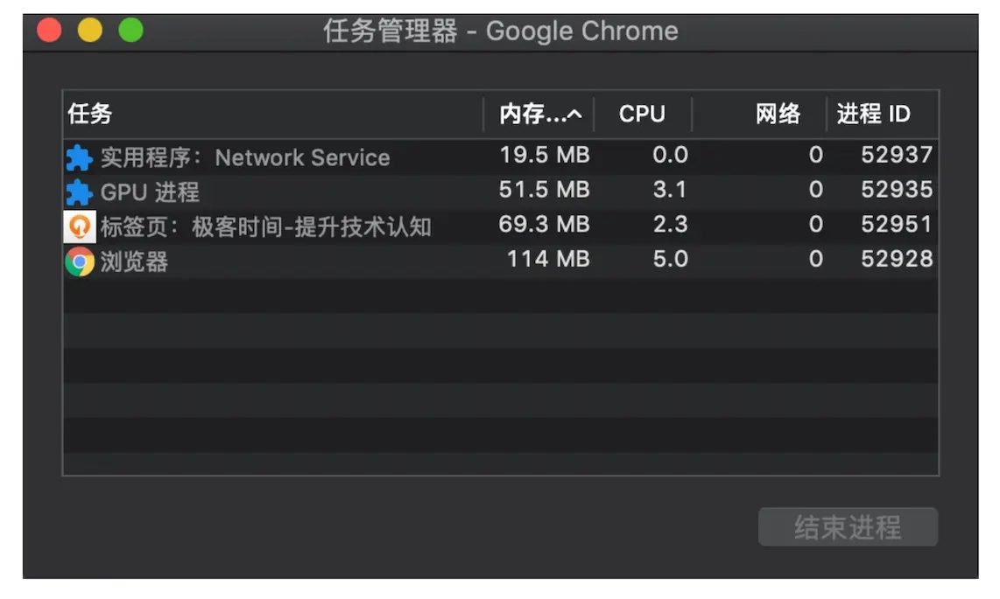

一个进程就是一个程序的运行实例，每个进程操作系统会分配一块内存用于存放代码、运行中的数据和一个执行任务的主线程。
一个进程中可以有多个线程，可以通过使用多线程提高运行效率。

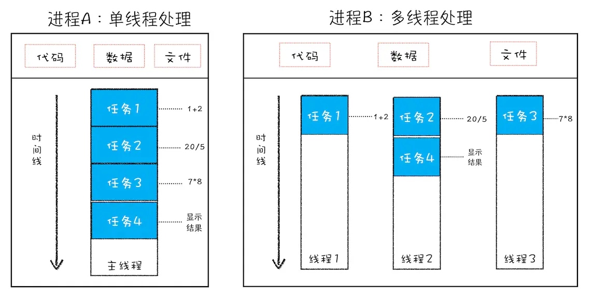

**进程和线程之间的关系有以下4个特点：**
1. 进程中的任意一线程执行出错，都会导致整个进程的崩溃。
2. 线程之间共享进程中的数据。
3. 当一个进程关闭之后，操作系统会回收进程所占用的内存。
4. 进程之间的内容相互隔离。

通过以上特点可以看出，只使用一个进程会导致很多问题，如某个线程崩溃，整个进程就会跟着崩溃，也就是老的浏览器上表现出的一个标签页崩溃就得重启浏览器。
所以，现代浏览器都才用多进程的方式，将不同功能分离成不同的内存环境中，即使某一个进程崩溃也不会导致整个浏览器跟着出问题。

### 目前浏览器的架构
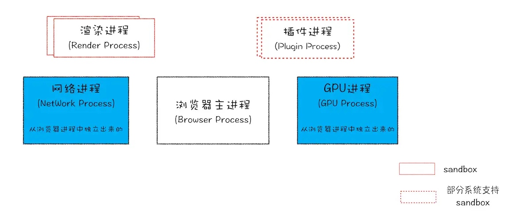

下面我们来逐个分析下这几个进程的功能。
* 浏览器进程。主要负责界面显示、用户交互、子进程管理，同时提供存储等功能。
* 渲染进程。核心任务是将 HTML、CSS 和 JavaScript 转换为用户可以与之交互的网页，排版引擎Blink和JavaScript引擎V8都是运行在该进程中，默认情况下，Chrome会为每个Tab标签创建一个渲染进程。出于安全考虑，渲染进程都是运行在沙箱模式下。
* GPU进程。其实，Chrome刚开始发布的时候是没有GPU进程的。而GPU的使用初衷是为了实现3D CSS的效果，只是随后网页、Chrome的UI界面都选择采用GPU来绘制，这使得GPU成为浏览器普遍的需求。最后，Chrome在其多进程架构上也引入了GPU进程。
* 网络进程。主要负责页面的网络资源加载，之前是作为一个模块运行在浏览器进程里面的，直至最近才独立出来，成为一个单独的进程。
* 插件进程。主要是负责插件的运行，因插件易崩溃，所以需要通过插件进程来隔离，以保证插件进程崩溃不会对浏览器和页面造成影响。

讲到这里，现在你应该就可以回答文章开头提到的问题了：仅仅打开了1个页面，为什么有4个进程？因为打开1个页面至少需要1个网络进程、1个浏览器进程、1个GPU进程以及1个渲染进程，共4个；如果打开的页面有运行插件的话，还需要再加上1个插件进程。

不过凡事都有两面性，虽然多进程模型提升了浏览器的稳定性、流畅性和安全性，但同样不可避免地带来了一些问题：
* 更高的资源占用。因为每个进程都会包含公共基础结构的副本（如JavaScript运行环境），这就意味着浏览器会消耗更多的内存资源。
* 更复杂的体系架构。浏览器各模块之间耦合性高、扩展性差等问题，会导致现在的架构已经很难适应新的需求了。

### 未来面向服务的架构
Chrome 整体架构会朝向现代操作系统所采用的“面向服务的架构” 方向发展，原来的各种模块会被重构成独立的服务（Service），每个服务（Service）都可以在独立的进程中运行，访问服务（Service）必须使用定义好的接口，通过IPC来通信，从而构建一个更内聚、松耦合、易于维护和扩展的系统，更好实现 Chrome 简单、稳定、高速、安全的目标。
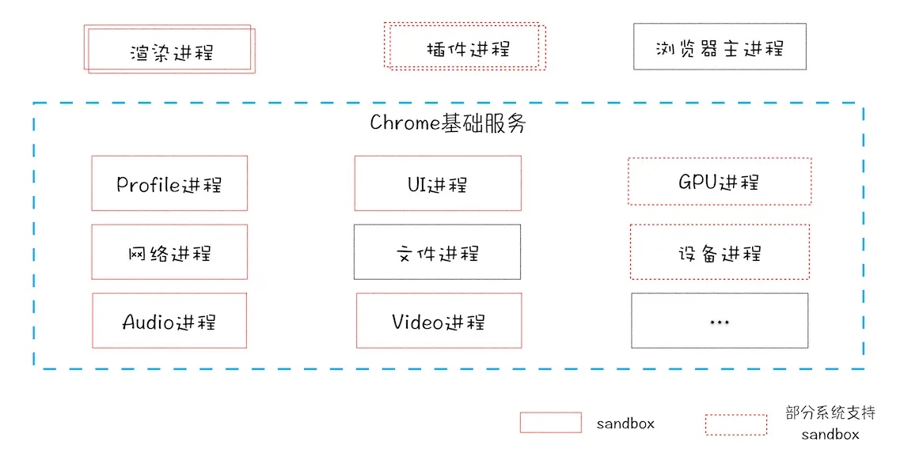

# 从输入 url 到页面展示都经历了什么？
### 用户输入
当用户在地址栏中输入一个查询关键字时，地址栏会判断输入的关键字是搜索内容，还是请求的URL。
* 如果是搜索内容，地址栏会使用浏览器默认的搜索引擎，来合成新的带搜索关键字的URL。
* 如果判断输入内容符合URL规则，比如输入的是 time.geekbang.org，那么地址栏会根据规则，把这段内容加上协议，合成为完整的URL，如 https://time.geekbang.org。

### URL请求过程
首先，网络进程会查找本地缓存是否缓存了该资源。如果有缓存资源，那么直接返回资源给浏览器进程；如果在缓存中没有查找到资源，那么直接进入网络请求流程。这请求前的第一步是要进行DNS解析，以获取请求域名的服务器IP地址。如果请求协议是HTTPS，那么还需要建立TLS连接。

接下来就是利用IP地址和服务器建立TCP连接。连接建立之后，浏览器端会构建请求行、请求头等信息，并把和该域名相关的Cookie等数据附加到请求头中，然后向服务器发送构建的请求信息。

服务器接收到请求信息后，会根据请求信息生成响应数据（包括响应行、响应头和响应体等信息），并发给网络进程。等网络进程接收了响应行和响应头之后，就开始解析响应头的内容了。
* 重定向
    在接收到服务器返回的响应头后，网络进程开始解析响应头，如果发现返回的状态码是301或者302，那么说明服务器需要浏览器重定向到其他URL。这时网络进程会从响应头的Location字段里面读取重定向的地址，然后再发起新的HTTP或者HTTPS请求，一切又重头开始了。
* 响应数据类型处理
    通过 content-type 判断响应数据的类型，然后再根据相应类型做相应处理。比如是 application/octet-stream 类型，通常会按照下载类型来处理。text/html 浏览器就知道这是个 HTML 文件。
    
### 准备渲染进程
每个标签都会开启一个进程吗？答案是否定的，那么什么情况下新标签不会开启新的进程呢？
首先我们就需要先了解下什么是同一站点（same-site）。具体地讲，我们将“同一站点”定义为根域名（例如，geekbang.org）加上协议（例如，https:// 或者http://），还包含了该根域名下的所有子域名和不同的端口，比如下面这三个：
```
https://time.geekbang.org
https://www.geekbang.org
https://www.geekbang.org:8080
```
它们都是属于同一站点，因为它们的协议都是HTTPS，而且根域名也都是geekbang.org。

Chrome的默认策略是，每个标签对应一个渲染进程。但如果从一个页面打开了另一个新页面，而新页面和当前页面属于同一站点的话，那么新页面会复用父页面的渲染进程。官方把这个默认策略叫process-per-site-instance。
如果不是同一站点就会新建进程。

### 提交文档
首先要明确一点，这里的“文档”是指URL请求的响应体数据。
* “提交文档”的消息是由浏览器进程发出的，渲染进程接收到“提交文档”的消息后，会和网络进程建立传输数据的“管道”。
* 等文档数据传输完成之后，渲染进程会返回“确认提交”的消息给浏览器进程。
* 浏览器进程在收到“确认提交”的消息后，会更新浏览器界面状态，包括了安全状态、地址栏的URL、前进后退的历史状态，并更新Web页面。

更新内容如下图所示：
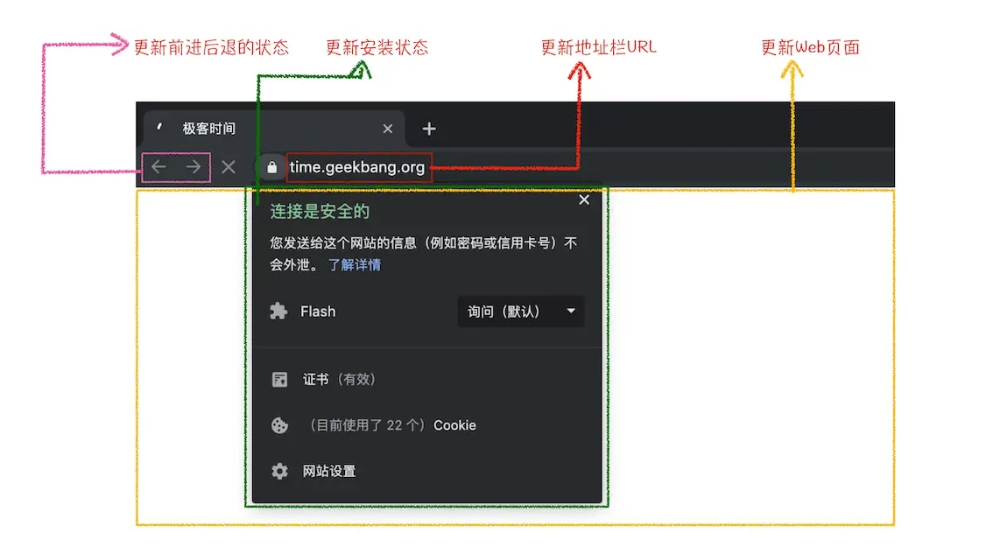
这也就解释了为什么在浏览器的地址栏里面输入了一个地址后，之前的页面没有立马消失，而是要加载一会儿才会更新页面。

### 渲染阶段
一旦文档被提交，渲染进程便开始页面解析和子资源加载了。请看下面渲染流程的介绍。

# 渲染流程
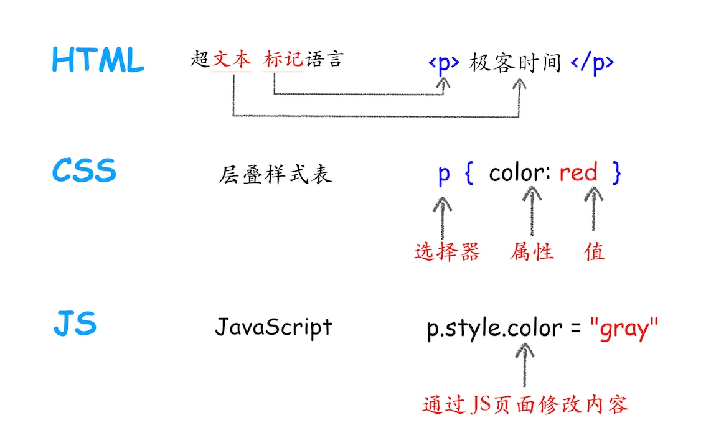
从上图可以看出，HTML的内容是由标记和文本组成。标记也称为标签，每个标签都有它自己的语意，浏览器会根据标签的语意来正确展示HTML内容。

由于渲染机制过于复杂，所以渲染模块在执行过程中会被划分为很多子阶段，输入的HTML经过这些子阶段，最后输出像素。我们把这样的一个处理流程叫做渲染流水线，其大致流程如下图所示：

按照渲染的时间顺序，流水线可分为如下几个子阶段：构建DOM树、样式计算、布局阶段、分层、绘制、分块、光栅化和合成。
接下来，在介绍每个阶段的过程中，你应该重点关注以下三点内容
* 开始每个子阶段都有其输入的内容；
* 然后每个子阶段有其处理过程；
* 最终每个子阶段会生成输出内容。

### 构建DOM树
为什么要构建DOM树呢？这是因为浏览器无法直接理解和使用HTML，所以需要将HTML转换为浏览器能够理解的结构——DOM树。
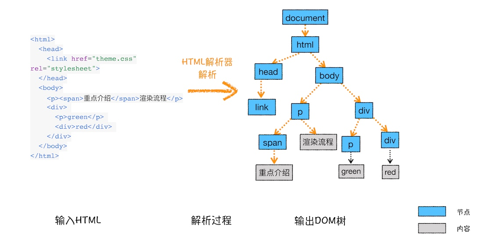
从图中可以看出，构建DOM树的输入内容是一个非常简单的HTML文件，然后经由HTML解析器解析，最终输出树状结构的DOM。

### 样式计算
样式计算的目的是为了计算出DOM节点中每个元素的具体样式，这个阶段大体可分为三步来完成

#### 1. 把CSS转换为浏览器能够理解的结构
那CSS样式的来源主要有哪些呢？你可以先参考下图：
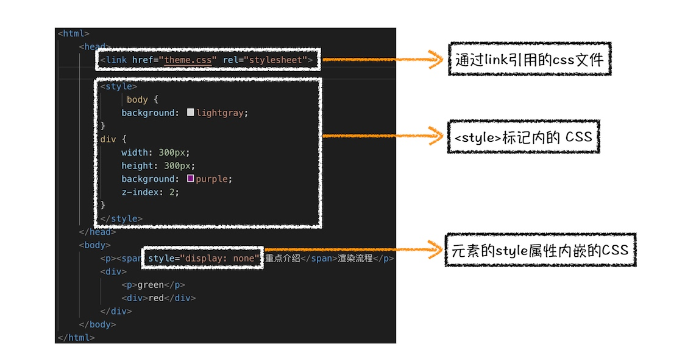
和HTML文件一样，浏览器也是无法直接理解这些纯文本的CSS样式，所以当渲染引擎接收到CSS文本时，会执行一个转换操作，将CSS文本转换为浏览器可以理解的结构——styleSheets。
在 Chrome 控制台输入 document.styleSheets 就能看到 css 转换成的 styleSheets。

#### 2. 转换样式表中的属性值，使其标准化
要理解什么是属性值标准化，你可以看下面这样一段CSS文本
```js
body { font-size: 2em }
p {color:blue;}
span  {display: none}
div {font-weight: bold}
div  p {color:green;}
div {color:red; }
```
可以看到上面的CSS文本中有很多属性值，如2em、blue、bold，这些类型数值不容易被渲染引擎理解，所以需要将所有值转换为渲染引擎容易理解的、标准化的计算值，这个过程就是属性值标准化。
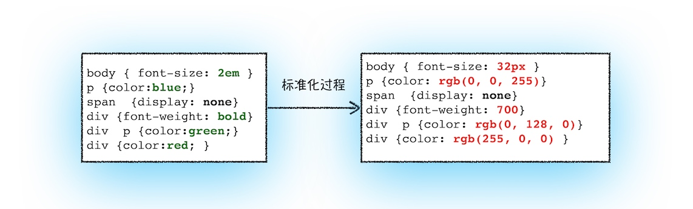
从图中可以看到，2em被解析成了32px，red被解析成了rgb(255,0,0)，bold被解析成了700……

#### 3. 计算出DOM树中每个节点的具体样式
在这一步需要通过继承规则和层叠规则来计算出每个元素的样式。
```
body { font-size: 20px }
p {color:blue;}
span  {display: none}
div {font-weight: bold;color:red}
div  p {color:green;}
```
这张样式表最终应用到DOM节点的效果如下图所示：
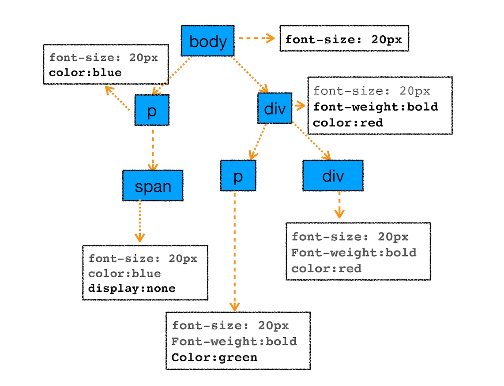

### 布局阶段
Chrome 在布局阶段需要完成两个任务：创建布局树和布局计算

#### 1. 创建布局树
你可能注意到了DOM树还含有很多不可见的元素，比如head标签，还有使用了display:none属性的元素。所以在显示之前，我们还要额外地构建一棵只包含可见元素布局树。

从上图可以看出，DOM树中所有不可见的节点都没有包含到布局树中。

为了构建布局树，浏览器大体上完成了下面这些工作
* 遍历DOM树中的所有可见节点，并把这些节点加到布局中；
* 而不可见的节点会被布局树忽略掉，如head标签下面的全部内容，再比如body.p.span这个元素，因为它的属性包含 dispaly:none，所以这个元素也没有被包进布局树

#### 2. 布局计算
布局结算很复杂，略过。。。
在执行布局操作的时候，会把布局运算的结果重新写回布局树中，所以布局树既是输入内容也是输出内容，这是布局阶段一个不合理的地方，因为在布局阶段并没有清晰地将输入内容和输出内容区分开来。

### 分层
因为页面中有很多复杂的效果，如一些复杂的3D变换、页面滚动，或者使用z-indexing做z轴排序等，为了更加方便地实现这些效果，渲染引擎还需要为特定的节点生成专用的图层，并生成一棵对应的图层树（LayerTree）。
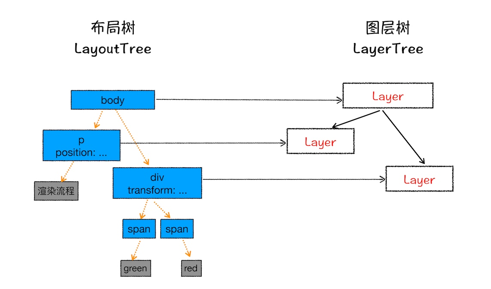
通常情况下，并不是布局树的每个节点都包含一个图层，如果一个节点没有对应的层，那么这个节点就从属于父节点的图层。

那么需要满足什么条件，渲染引擎才会为特定的节点创建新的层呢？通常满足下面两点中任意一点的元素就可以被提升为单独的一个图层。

**1. 拥有层叠上下文属性的元素会被提升为单独的一层。**

    从图中可以看出，明确定位属性的元素、定义透明属性的元素、使用CSS滤镜的元素等，都拥有层叠上下文属性。
    
**2. 需要剪裁（clip）的地方也会被创建为图层。**
不过首先你需要了解什么是剪裁，结合下面的HTML代码
```html
<style>
      div {
            width: 200;
            height: 200;
            overflow:auto;
            background: gray;
        } 
</style>
<body>
    <div >
        <p>所以元素有了层叠上下文的属性或者需要被剪裁，那么就会被提升成为单独一层，你可以参看下图：</p>
        <p>从上图我们可以看到，document层上有A和B层，而B层之上又有两个图层。这些图层组织在一起也是一颗树状结构。</p>
        <p>图层树是基于布局树来创建的，为了找出哪些元素需要在哪些层中，渲染引擎会遍历布局树来创建层树（Update LayerTree）。</p> 
    </div>
</body>
```
在这里我们把div的大小限定为200 * 200像素，而div里面的文字内容比较多，文字所显示的区域肯定会超出200 * 200的面积，这时候就产生了剪裁，渲染引擎会把裁剪文字内容的一部分用于显示在div区域，下图是运行时的执行结果
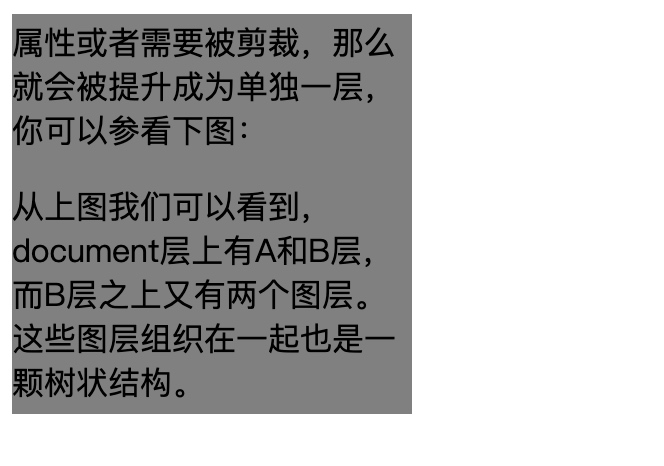
出现这种裁剪情况的时候，渲染引擎会为文字部分单独创建一个层，如果出现滚动条，滚动条也会被提升为单独的层。你可以参考下图：
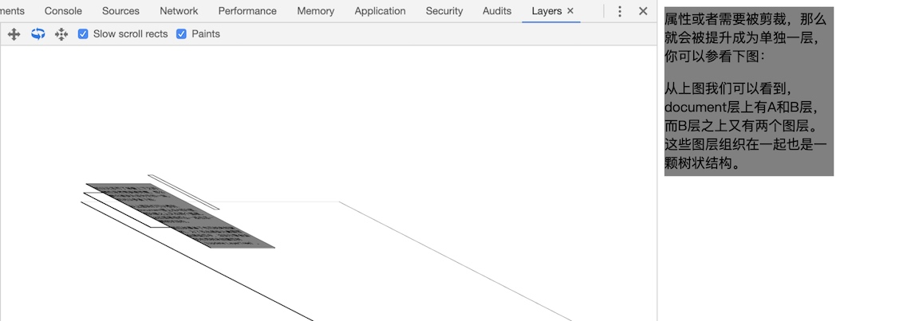

### 图层绘制
渲染引擎会把一个图层的绘制拆分成很多小的绘制指令，然后再把这些指令按照顺序组成一个待绘制列表，如下图所示：
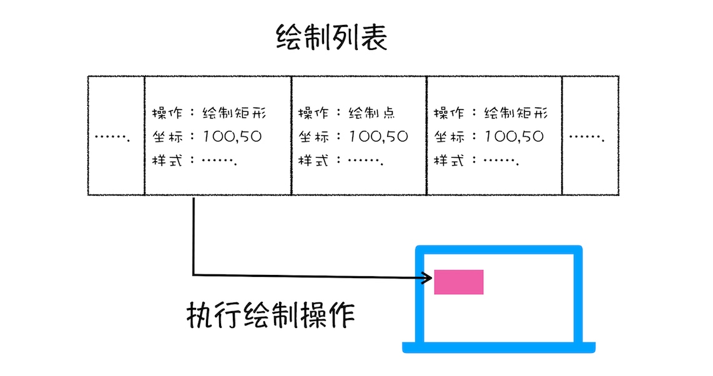
从图中可以看出，绘制列表中的指令其实非常简单，就是让其执行一个简单的绘制操作，比如绘制粉色矩形或者黑色的线等。而绘制一个元素通常需要好几条绘制指令，因为每个元素的背景、前景、边框都需要单独的指令去绘制。所以在图层绘制阶段，输出的内容就是这些待绘制列表。

### 栅格化（raster）操作
绘制列表只是用来记录绘制顺序和绘制指令的列表，而实际上绘制操作是由渲染引擎中的合成线程来完成的。你可以结合下图来看下渲染主线程和合成线程之间的关系：
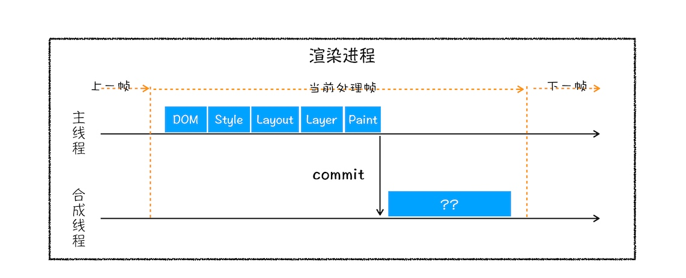
如上图所示，当图层的绘制列表准备好之后，主线程会把该绘制列表提交（commit）给合成线程，那么接下来合成线程是怎么工作的呢？

通常一个页面可能很大，但是用户只能看到其中的一部分，我们把用户可以看到的这个部分叫做视口（viewport）。
在有些情况下，有的图层可以很大，比如有的页面你使用滚动条要滚动好久才能滚动到底部，但是通过视口，用户只能看到页面的很小一部分，所以在这种情况下，要绘制出所有图层内容的话，就会产生太大的开销，而且也没有必要。
基于这个原因，合成线程会将图层划分为图块（tile），这些图块的大小通常是256x256或者512x512，如下图所示：
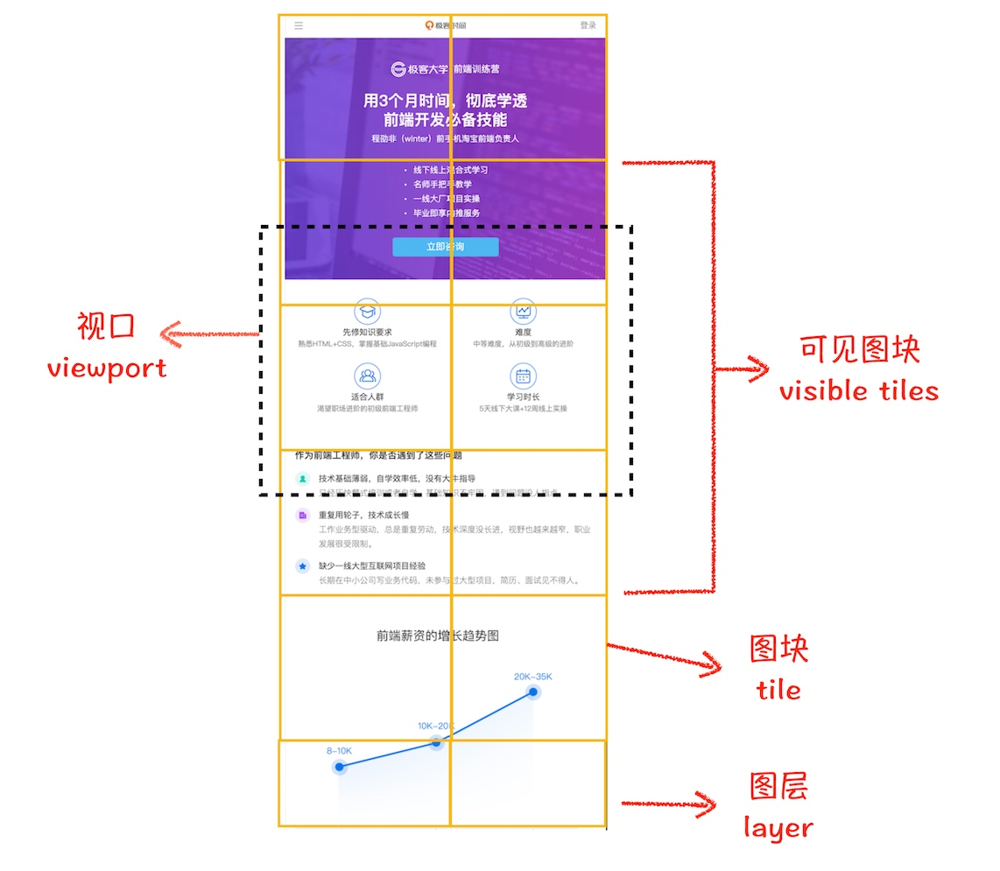

然后合成线程会按照视口附近的图块来优先生成位图，实际生成位图的操作是由栅格化来执行的。所谓栅格化，是指将图块转换为位图。而图块是栅格化执行的最小单位。渲染进程维护了一个栅格化的线程池，所有的图块栅格化都是在线程池内执行的，运行方式如下图所示：
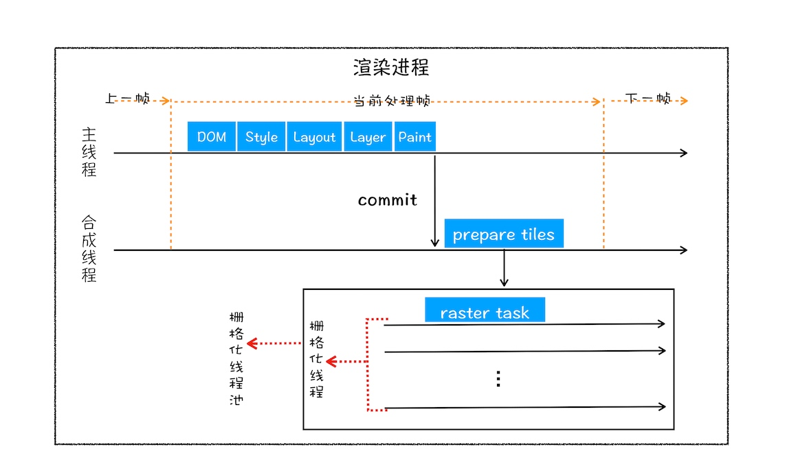

栅格化通常会使用 GPU 来加速生成，生成的位图也会保存在 GPU 中，这就涉及到了跨进程操作。
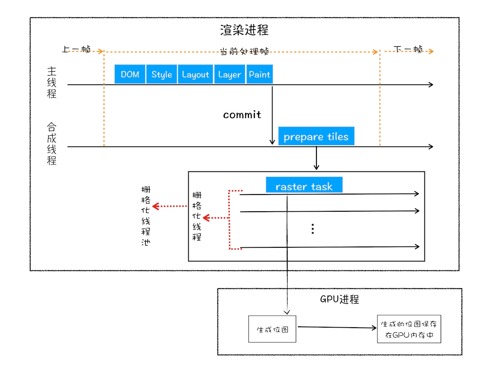
从图中可以看出，渲染进程把生成图块的指令发送给GPU，然后在GPU中执行生成图块的位图，并保存在GPU的内存中。

### 合成和显示
一旦所有图块都被光栅化，合成线程就会生成一个绘制图块的命令——“DrawQuad”，然后将该命令提交给浏览器进程。
浏览器进程里面有一个叫 viz 的组件，用来接收合成线程发过来的 DrawQuad 命令，然后根据 DrawQuad 命令，将其页面内容绘制到内存中，最后再将内存显示在屏幕上。
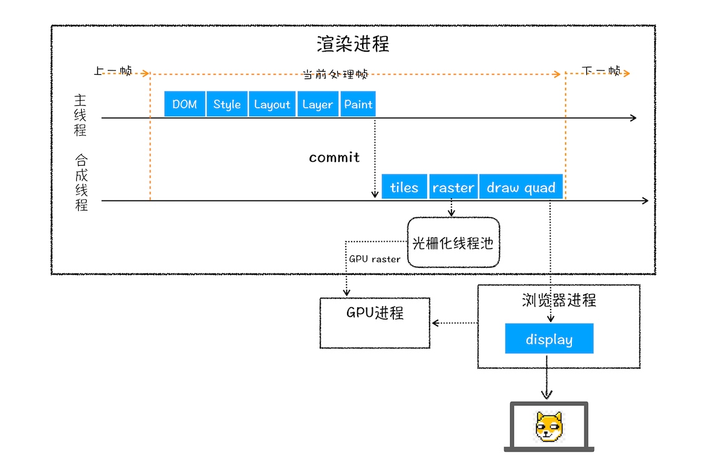
**结合上图，一个完整的渲染流程大致可总结为如下**
* 渲染进程将HTML内容转换为能够读懂的DOM树结构。
* 渲染引擎将CSS样式表转化为浏览器可以理解的styleSheets，计算出DOM节点的样式。
* DOM 树和 styleSheets 创建布局树，并计算元素的布局信息。
* 对布局树进行分层，并生成分层树。
* 为每个图层生成绘制列表，并将其提交到合成线程。
* 合成线程将图层分成图块，并在光栅化线程池中将图块转换成位图。
* 合成线程发送绘制图块命令DrawQuad给浏览器进程。
* 浏览器进程根据DrawQuad消息生成页面，并显示到显示器上

### 相关概念
有了上面介绍渲染流水线的基础，我们再来看看三个和渲染流水线相关的概念——“重排”“重绘”和“合成”。

#### 更新了元素的几何属性（重排）
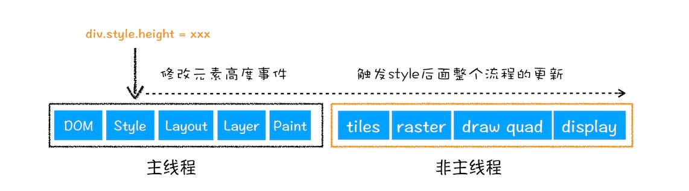
从上图可以看出，如果你通过JavaScript或者CSS修改元素的几何位置属性，例如改变元素的宽度、高度等，那么浏览器会触发重新布局，解析之后的一系列子阶段，这个过程就叫重排。无疑，重排需要更新完整的渲染流水线，所以开销也是最大的。

#### 更新元素的绘制属性（重绘）
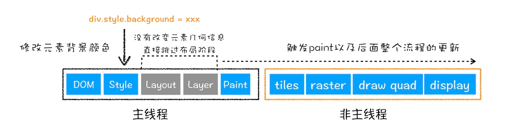
从图中可以看出，如果修改了元素的背景颜色，那么布局阶段将不会被执行，因为并没有引起几何位置的变换，所以就直接进入了绘制阶段，然后执行之后的一系列子阶段，这个过程就叫重绘。相较于重排操作，重绘省去了布局和分层阶段，所以执行效率会比重排操作要高一些。

#### 直接合成阶段
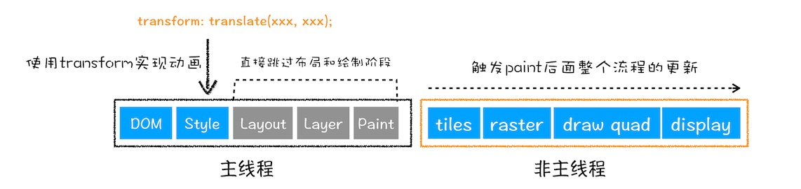
在上图中，我们使用了CSS的transform来实现动画效果，这可以避开重排和重绘阶段，直接在非主线程上执行合成动画操作。这样的效率是最高的，因为是在非主线程上合成，并没有占用主线程的资源，另外也避开了布局和绘制两个子阶段，所以相对于重绘和重排，合成能大大提升绘制效率。