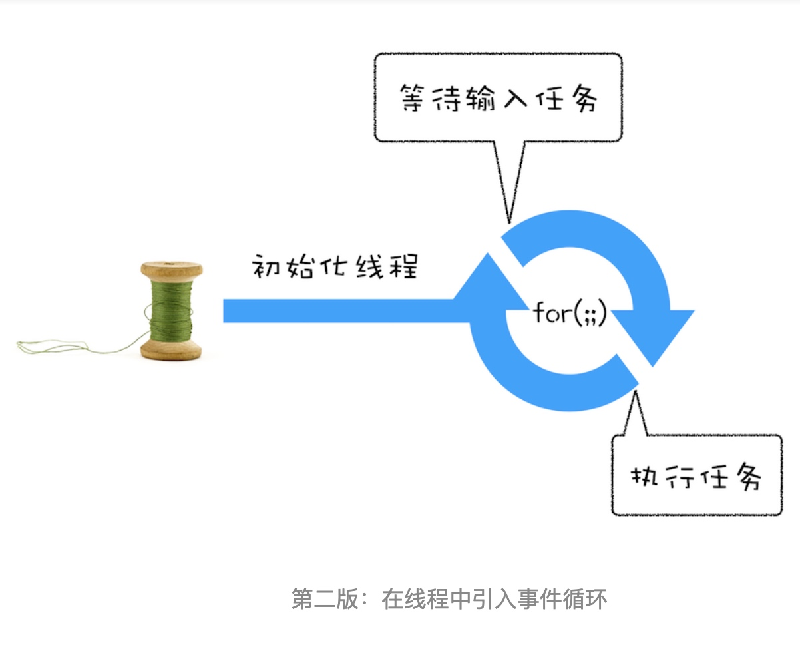
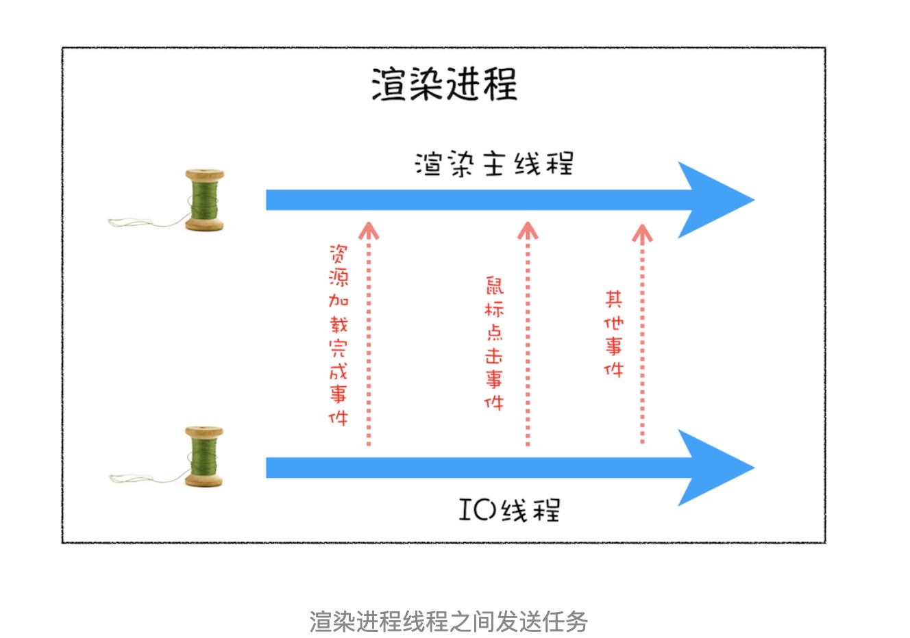
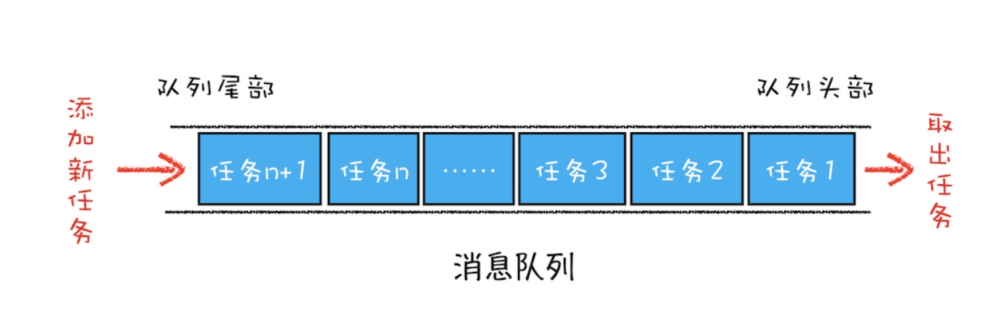
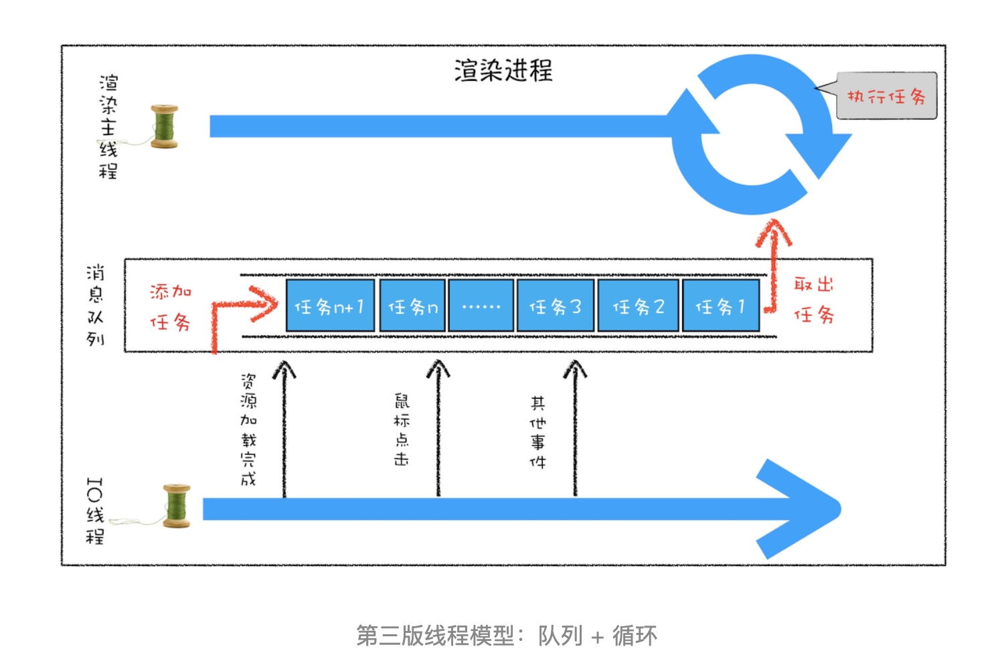
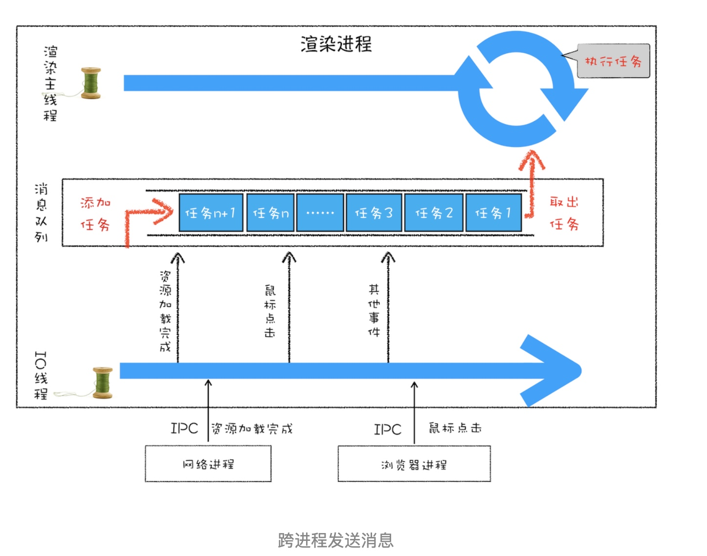
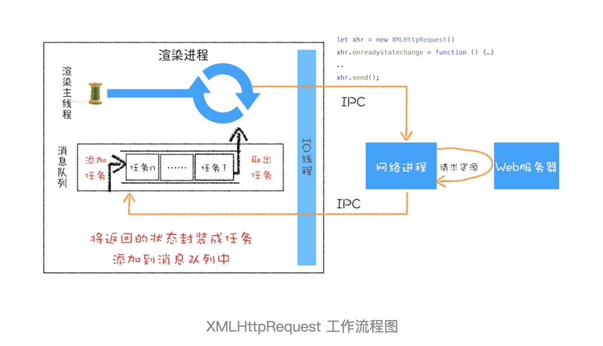
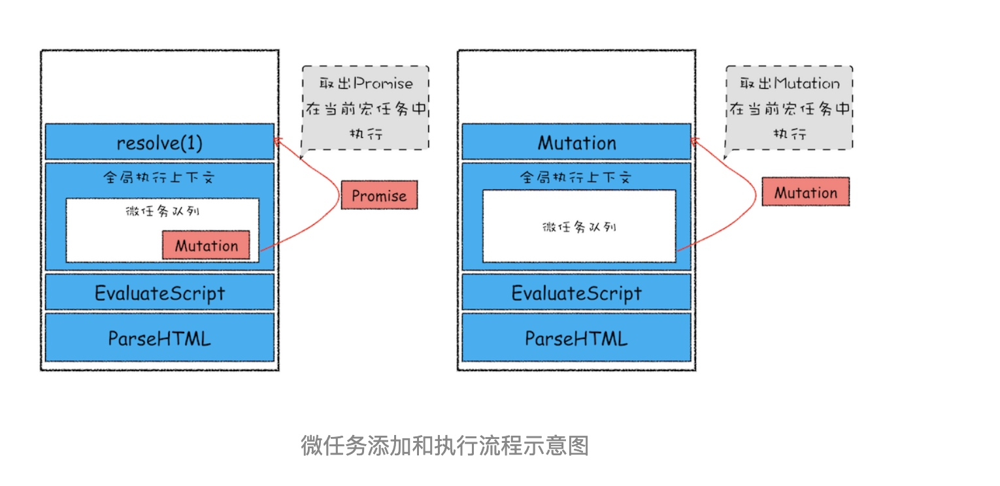

### 在线程运行过程中处理新任务
要想在线程运行过程中，能接收并执行新的任务，就需要采用事件循环机制。我们可以通过一个 for 循环语句来监听是否有新的任务，如下面的示例代码：
```c
//GetInput
// 等待用户从键盘输入一个数字，并返回该输入的数字
int GetInput(){
    int input_number = 0;
    cout<<" 请输入一个数:";
    cin>>input_number;
    return input_number;
}
 
// 主线程 (Main Thread)
void MainThread(){
     for(;;){
          int first_num = GetInput()；
          int second_num = GetInput()；
          result_num = first_num + second_num;
          print(" 最终计算的值为:%d",result_num)；
      }
}
```
相较于单线程顺序执行，这一版的线程做了两点改进。
* 第一点引入了循环机制，具体实现方式是在线程语句最后添加了一个for 循环语句，线程会一直循环执行。
* 第二点是引入了事件，可以在线程运行过程中，**等待用户输入的数字，等待过程中线程处于暂停状态，一旦接收到用户输入的信息，那么线程会被激活**，然后执行相加运算，最后输出结果。


### 处理其他线程发送过来的任务
先来看看其他线程是如何发送消息给渲染主线程的，具体形式你可以参考下图：

从上图可以看出，渲染主线程会频繁接收到来自于 IO 线程的一些任务，接收到这些任务之后，渲染进程就需要着手处理，比如接收到资源加载完成的消息后，渲染进程就要着手进行 DOM 解析了；接收到鼠标点击的消息后，渲染主线程就要开始执行相应的 JavaScript 脚本来处理该点击事件。

那么如何设计好一个线程模型，能让其能够接收其他线程发送的消息呢？
一个通用模式是使用消息队列。


有了队列之后，我们就可以继续改造线程模型了，改造方案如下图所示：

从上图可以看出，我们的改造可以分为下面三个步骤：
* 添加一个消息队列；
* IO 线程中产生的新任务添加进消息队列尾部；
* 渲染主线程会循环地从消息队列头部中读取任务，执行任务。

### 处理其他进程发送过来的任务
通过使用消息队列，我们实现了线程之间的消息通信。在 Chrome 中，跨进程之间的任务也是频繁发生的，那么如何处理其他进程发送过来的任务？你可以参考下图：

从图中可以看出，渲染进程专门有一个 IO 线程用来接收其他进程传进来的消息，接收到消息之后，会将这些消息组装成任务发送给渲染主线程，后续的步骤就和前面讲解的“处理其他线程发送的任务”一样了。

### 如何安全退出
当页面主线程执行完成之后，又该如何保证页面主线程能够安全退出呢？Chrome 是这样解决的，确定要退出当前页面时，页面主线程会设置一个退出标志的变量，在每次执行完一个任务时，判断是否有设置退出标志。
如果设置了，那么就直接中断当前的所有任务，退出线程，你可以参考下面代码：
```c
TaskQueue task_queue；
void ProcessTask();
bool keep_running = true;
void MainThread(){
  for(;;){
    Task task = task_queue.takeTask();
    ProcessTask(task);
    if(!keep_running) // 如果设置了退出标志，那么直接退出线程循环
        break; 
  }
}
```

### 页面使用单线程的缺点
#### 第一个问题是如何处理高优先级的任务
**办法是使用微任务来存储优先级更高的任务。**

通常我们把消息队列中的任务称为宏任务，每个宏任务中都包含了一个微任务队列，在执行宏任务的过程中，如果 DOM 有变化，那么就会将该变化添加到微任务列表中，这样就不会影响到宏任务的继续执行，因此也就解决了执行效率的问题。

等宏任务中的主要功能都直接完成之后，这时候，渲染引擎并不着急去执行下一个宏任务，而是执行当前宏任务中的微任务，因为 DOM 变化的事件都保存在这些微任务队列中，这样也就解决了实时性问题。

#### 第二个是如何解决单个任务执行时长过久的问题
JavaScript 可以通过回调功能来规避这种问题，也就是让要执行的 JavaScript 任务滞后执行。至于浏览器是如何实现回调功能的，我们在后面的章节中再详细介绍。

# 浏览器怎么实现 setTimeout
在 Chrome 中除了正常使用的消息队列之外，还有另外一个消息队列，这个队列中维护了需要延迟执行的任务列表，包括了定时器和 Chromium 内部一些需要延迟执行的任务。
```c
// 延迟队列：专门用于执行延迟任务的消息队列
DelayedIncomingQueue delayed_incoming_queue;
```

当通过 JavaScript 调用 setTimeout 设置回调函数的时候，渲染进程将会创建一个回调任务，包含了回调函数 showName、当前发起时间、延迟执行时间，其模拟代码如下所示：
```c
struct DelayTask{
  int64 id；
  CallBackFunction cbf;
  int start_time;
  int delay_time;
};
DelayTask timerTask;
timerTask.cbf = showName;
timerTask.start_time = getCurrentTime(); // 获取当前时间
timerTask.delay_time = 200;// 设置延迟执行时间
```
创建好回调任务之后，再将该任务添加到延迟执行队列中，代码如下所示：
```c
// 将任务 push 到延迟队列中
delayed_incoming_queue.push(timerTask)；
```
现在通过定时器发起的任务就被保存到延迟队列中了，那接下来我们再来看看消息循环系统是怎么触发延迟队列的。

我们可以来完善上一篇文章中消息循环的代码，在其中加入执行延迟队列的代码，如下所示：
```c
void ProcessTimerTask(){
  // 从 delayed_incoming_queue 中取出已经到期的定时器任务
  // 依次执行这些任务
}
 
TaskQueue task_queue；
void ProcessTask();
bool keep_running = true;
void MainTherad(){
  for(;;){
    Task task = task_queue.takeTask();
    // 执行消息队列中的一个任务
    ProcessTask(task);
    
    // 执行延迟队列中的任务。每次都会遍历所有任务判断到期的任务并执行
    ProcessDelayTask()
 
    if(!keep_running) // 如果设置了退出标志，那么直接退出线程循环
        break; 
  }
}
```
从上面代码可以看出来，我们添加了一个ProcessDelayTask 函数，该函数是专门用来处理延迟执行任务的。这里我们要重点关注它的执行时机，在上段代码中，处理完消息队列中的一个任务之后，就开始执行 ProcessDelayTask 函数。ProcessDelayTask 函数会根据发起时间和延迟时间计算出到期的任务，然后依次执行这些到期的任务。等到期的任务执行完成之后，再继续下一个循环过程。通过这样的方式，一个完整的定时器就实现了。

浏览器内部实现取消定时器的操作也是非常简单的，就是直接从 delayed_incoming_queue 延迟队列中，通过 ID 查找到对应的任务，然后再将其从队列中删除掉就可以了。

#### 使用 setTimeout 的一些注意事项
1. 如果当前任务执行时间过久，会影延迟到期定时器任务的执行。
2. 如果 setTimeout 存在嵌套调用，那么系统会设置最短时间间隔为 4 毫秒。
3. 未激活的页面，setTimeout 执行最小间隔是 1000 毫秒。
4. 延时执行时间有最大值。如果 setTimeout 设置的延迟值大于 2147483647 毫秒（大约 24.8 天）时就会溢出，这导致定时器会被立即执行。
5. 使用 setTimeout 设置的回调函数中的 this 不符合直觉，可能会指向全局环境对象。
```js
var name= 1;
var MyObj = {
  name: 2,
  showName: function(){
    console.log(this.name);
  }
}
setTimeout(MyObj.showName,1000)
```
这里输出的是 1，因为这段代码在编译的时候，执行上下文中的 this 会被设置为全局 window，如果是严格模式，会被设置为 undefined。
可以使用以下方式解决：
```js
setTimeout(() => {MyObj.showName()}, 1000);
setTimeout(MyObj.showName.bind(MyObj), 1000);
```

# XMLHttpRequest 运作机制
具体工作过程你可以参考下图：

在 xhr 对象上添加回调函数，如 onreadystatechange，等网络进程接收到数据之后，就会利用 IPC 来通知渲染进程；渲染进程接收到消息之后，会将 xhr 的回调函数封装成任务并添加到消息队列中，等主线程循环系统执行到该任务的时候，就会根据相关的状态来调用对应的回调函数。

# 宏任务和微任务
### 宏任务
消息队列中的任务是通过事件循环系统来执行的，这里我们可以看看在WHATWG 规范中是怎么定义事件循环机制的。
1. 先从多个消息队列中选出一个最老的任务，这个任务称为 oldestTask；
2. 然后循环系统记录任务开始执行的时间，并把这个 oldestTask 设置为当前正在执行的任务；
3. 当任务执行完成之后，删除当前正在执行的任务，并从对应的消息队列中删除掉这个 oldestTask；
4. 最后统计执行完成的时长等信息。

以上就是消息队列中宏任务的执行过程。

宏任务的时间粒度比较大，执行的时间间隔是不能精确控制的，对一些高实时性的需求就不太符合了。

### 微任务
微任务就是一个需要异步执行的函数，执行时机是在主函数执行结束之后、当前宏任务执行结束之前。
V8 引擎会创建一个微任务队列用来存放微任务。消息队列中的**每个宏任务**执行结束之前都会去遍历这个微任务队列并执行，执行过程中产生新的微任务也会立即添加到这个微任务队列中等待遍历到的时候并执行，直到微任务队列为空才执行下个宏任务。

哪些是宏任务或微任务：
宏任务: script(整体代码), setTimeout, setInterval, setImmediate, I/O, UI rendering
微任务: process.nextTick, Promises, MutationObserver

微任务是怎么产生的？在现代浏览器里面，产生微任务有两种方式。
* 第一种方式是使用 MutationObserver 监控某个 DOM 节点，然后再通过 JavaScript 来修改这个节点，或者为这个节点添加、删除部分子节点，当 DOM 节点发生变化时，就会产生 DOM 变化记录的微任务。
* 第二种方式是使用 Promise，当调用 Promise.resolve(), Promise.reject(), Promise.then() 的时候，也会产生微任务。

好了，现在微任务队列中有了微任务了，那接下来就要看看微任务队列是何时被执行的。

通常情况下，在当前宏任务中的 JavaScript 快执行完成时，也就在 JavaScript 引擎准备退出全局执行上下文并清空调用栈的时候，JavaScript 引擎会检查全局执行上下文中的微任务队列，然后按照顺序执行队列中的微任务。WHATWG 把执行微任务的时间点称为检查点。
如果在执行微任务的过程中，产生了新的微任务，同样会将该微任务添加到微任务队列中，V8 引擎一直循环执行微任务队列中的任务，直到队列为空才算执行结束。也就是说在执行微任务过程中产生的新的微任务并不会推迟到下个宏任务中执行，而是在当前的宏任务中继续执行。


微任务的一些知识点：
* 微任务和宏任务是绑定的，每个宏任务在执行时，都会执行微任务队列。
* 微任务的执行时长会影响到当前宏任务的时长。比如一个宏任务在执行过程中，产生了 100 个微任务，执行每个微任务的时间是 10 毫秒，那么执行这 100 个微任务的时间就是 1000 毫秒，也可以说这 100 个微任务让宏任务的执行时间延长了 1000 毫秒。所以-你在写代码的时候一定要注意控制微任务的执行时长。
* 在一个宏任务中，分别创建一个用于回调的宏任务和微任务，无论什么情况下，微任务都早于宏任务执行。

```js
console.log('script start');

setTimeout(function() {
  // 宏任务，在 script 执行结束后，微任务队列也执行清空后，作为延迟消息队列的下一个宏任务执行
  console.log('setTimeout');
}, 0);

Promise.resolve().then(function() {
  console.log('promise1');  // 微任务，在 script 执行结束之前执行
}).then(function() {
  console.log('promise2');  // 微任务，在 script 执行结束之前执行
});

console.log('script end');
```