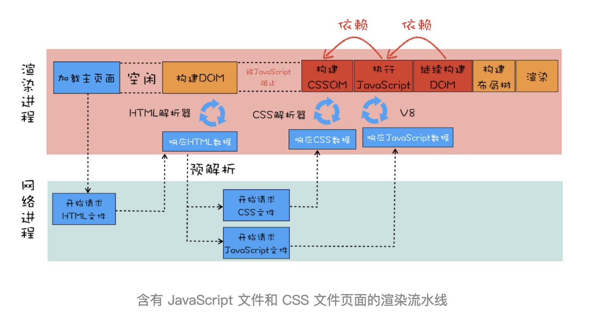
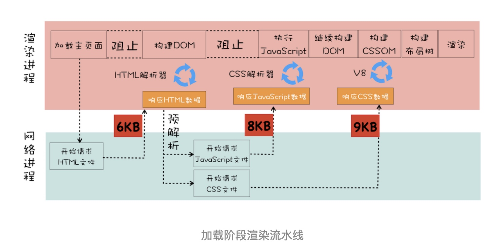
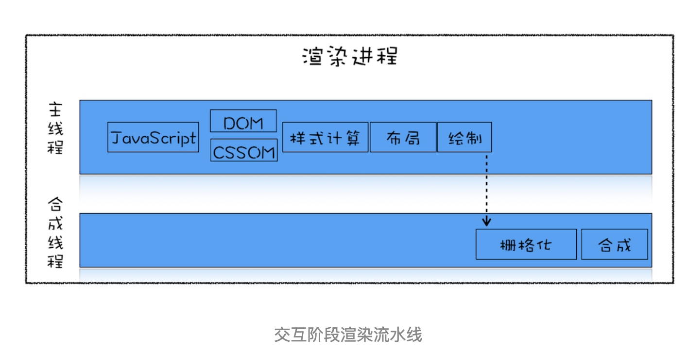

# 渲染流水线：CSS如何影响首次加载时的白屏时间？
在执行 JavaScript 脚本之前，如果页面中包含了外部 CSS 文件的引用，或者通过 style 标签内置了 CSS 内容，那么渲染引擎还需要将这些内容转换为 **CSSOM**，因为 JavaScript 有修改 CSSOM 的能力，所以在执行 JavaScript 之前，还需要依赖 CSSOM。也就是说 CSS 在部分情况下也会阻塞 DOM 的生成。

从图中可以看出来，在接收到 HTML 数据之后的预解析过程中，HTML 预解析器识别出来了有 CSS 文件和 JavaScript 文件需要下载，然后就同时发起这两个文件的下载请求，需要注意的是，这两个文件的下载过程是重叠的，所以下载时间按照最久的那个文件来算。
不管 CSS 文件和 JavaScript 文件谁先到达，都要先等到 CSS 文件下载完成并生成 CSSOM，然后再执行 JavaScript 脚本，最后再继续构建 DOM，构建布局树，绘制页面。

#### 所以要想缩短白屏时长，可以有以下策略
* 通过内联 JavaScript、内联 CSS 来移除这两种类型的文件下载，这样获取到 HTML 文件之后就可以直接开始渲染流程了。
* 但并不是所有的场合都适合内联，那么还可以尽量减少文件大小，比如通过 webpack 等工具移除一些不必要的注释，并压缩 JavaScript 文件。
* 还可以将一些不需要在解析 HTML 阶段使用的 JavaScript 标记上 sync 或者 defer。
* 对于大的 CSS 文件，可以通过媒体查询属性，将其拆分为多个不同用途的 CSS 文件，这样只有在特定的场景下才会加载特定的 CSS 文件。
* 通过以上策略就能缩短白屏展示的时长了，不过在实际项目中，总是存在各种各样的情况，这些策略并不能随心所欲地去引用，所以还需要结合实际情况来调整最佳方案。

# 分层和合成机制：为什么css动画比JavaScript高效
相较于重排和重绘，合成操作的路径就显得非常短了，并不需要触发布局和绘制两个阶段，如果采用了 GPU，那么合成的效率会非常高。
所以，关于渲染引擎生成一帧图像的几种方式，按照效率我们推荐合成方式优先，若实在不能满足需求，那么就再退后一步使用重绘或者重排的方式。

类似 PS，将素材分解为多个图层的操作就称为分层，最后将这些图层合并到一起的操作就称为合成。所以，分层和合成通常是一起使用的。

在 Chrome 的渲染流水线中，分层体现在生成布局树之后，渲染引擎会根据布局树的特点将其转换为层树（Layer Tree），层树是渲染流水线后续流程的基础结构。层树中的每个节点都对应着一个图层，每一个图层都对应一张图片，合成线程有了这些图片之后，会将这些图片合成为“一张”图片，并最终将生成的图片发送到后缓冲区。这就是一个大致的分层、合成流程。

需要重点关注的是，合成操作是在合成线程上完成的，这也就意味着在执行合成操作时，是不会影响到主线程执行的。这就是为什么经常主线程卡住了，但是 CSS 动画依然能执行的原因。

#### 如何利用分层技术优化代码
你可以使用 will-change 来告诉渲染引擎你会对该元素做一些特效变换，CSS 代码如下：
```css
.box {
    will-change: transform, opacity;
}
```
这段代码就是提前告诉渲染引擎 box 元素将要做几何变换和透明度变换操作，这时候渲染引擎会将该元素单独实现一帧，等这些变换发生时，渲染引擎会通过合成线程直接去处理变换，这些变换并没有涉及到主线程，这样就大大提升了渲染的效率。这也是 CSS 动画比 JavaScript 动画高效的原因。
所以，如果涉及到一些可以使用合成线程来处理 CSS 特效或者动画的情况，就尽量使用 **will-change 来提前告诉渲染引擎，让它为该元素准备独立的层**。但是凡事都有两面性，每当渲染引擎为一个元素准备一个独立层的时候，它占用的内存也会大大增加，因为从层树开始，后续每个阶段都会多一个层结构，这些都需要额外的内存，所以你需要恰当地使用 will-change。

# 页面性能：如何系统优化页面
通常一个页面有三个阶段：加载阶段、交互阶段和关闭阶段

### 加载阶段

并非所有的资源都会阻塞页面的首次绘制，比如图片、音频、视频等文件就不会阻塞页面的首次渲染；而 JavaScript、首次请求的 HTML 资源文件、CSS 文件是会阻塞首次渲染的，因为在构建 DOM 的过程中需要 HTML 和 JavaScript 文件，在构造渲染树的过程中需要用到 CSS 文件。

我们把这些能阻塞网页首次渲染的资源称为关键资源。基于关键资源，我们可以继续细化出来三个影响页面首次渲染的核心因素。

**第一个是关键资源个数。关键资源个数越多，首次页面的加载时间就会越长**。比如上图中的关键资源个数就是 3 个，1 个 HTML 文件、1 个 JavaScript 和 1 个 CSS 文件。

**第二个是关键资源大小**。通常情况下，所有关键资源的内容越小，其整个资源的下载时间也就越短，那么阻塞渲染的时间也就越短。上图中关键资源的大小分别是 6KB、8KB 和 9KB，那么整个关键资源大小就是 23KB。

**第三个是请求关键资源需要多少个 RTT（Round Trip Time）**。RTT 就是一个请求的往返时间，同时发送的请求只需要取 RTT 最长的那个。

总的优化原则就是减少关键资源个数，降低关键资源大小，降低关键资源的 RTT 次数：
* 如何减少关键资源的个数？一种方式是可以将 JavaScript 和 CSS 改成内联的形式，比如上图的 JavaScript 和 CSS，若都改成内联模式，那么关键资源的个数就由 3 个减少到了 1 个。另一种方式，如果 JavaScript 代码没有 DOM 或者 CSSOM 的操作，则可以改成 sync 或者 defer 属性；同样对于 CSS，如果不是在构建页面之前加载的，则可以添加媒体取消阻止显现的标志。当 JavaScript 标签加上了 sync 或者 defer、CSS link 属性之前加上了取消阻止显现的标志后，它们就变成了非关键资源了。
* 如何减少关键资源的大小？可以压缩 CSS 和 JavaScript 资源，移除 HTML、CSS、JavaScript 文件中一些注释内容，也可以通过前面讲的取消 CSS 或者 JavaScript 中关键资源的方式。
* 如何减少关键资源 RTT 的次数？可以通过减少关键资源的个数和减少关键资源的大小搭配来实现。除此之外，还可以使用 CDN 来减少每次 RTT 时长。

### 交互阶段
和加载阶段的渲染流水线有一些不同的地方是，在交互阶段没有了加载关键资源和构建 DOM、CSSOM 流程，通常是由 JavaScript 触发交互动画的。

结合上图，我们来一起回顾下交互阶段是如何生成一个帧的。大部分情况下，生成一个新的帧都是由 JavaScript 通过修改 DOM 或者 CSSOM 来触发的。还有另外一部分帧是由 CSS 来触发的。

#### 1. 减少 JavaScript 脚本执行时间
有时 JavaScript 函数的一次执行时间可能有几百毫秒，这就严重霸占了主线程执行其他渲染任务的时间。针对这种情况我们可以采用以下两种策略
* 一种是将一次执行的函数分解为多个任务，使得每次的执行时间不要过久。
* 另一种是采用 Web Workers。你可以把 Web Workers 当作主线程之外的一个线程，在 Web Workers 中是可以执行 JavaScript 脚本的，不过 Web Workers 中没有 DOM、CSSOM 环境，这意味着在 Web Workers 中是无法通过 JavaScript 来访问 DOM 的，所以我们可以把一些和 DOM 操作无关且耗时的任务放到 Web Workers 中去执行。

总之，在交互阶段，对 JavaScript 脚本总的原则就是不要一次霸占太久主线程。

#### 2. 避免强制同步布局
所谓强制同步布局，是指 JavaScript 强制将计算样式和布局操作提前到当前的任务中。
```js
function foo() {
    let main_div = document.getElementById("main_div")
    let new_node = document.createElement("li")
    let textnode = document.createTextNode("time.geekbang")
    new_node.appendChild(textnode);
    // 往 main_div 中添加元素，会导致元素高度改变
    document.getElementById("main_div").appendChild(new_node);
    // 立即获取 main_div 的 高度
    // 由于要获取到 offsetHeight，但是此时的 offsetHeight 还是老的数据，所以需要立即执行布局操作
    console.log(main_div.offsetHeight)
}
```
为了避免强制同步布局，我们可以调整策略，在修改 DOM 之前查询相关值。代码如下所示：
```js
function foo() {
    let main_div = document.getElementById("mian_div")
    // 为了避免强制同步布局，在修改 DOM 之前查询相关值
    // 其实用 nextTick 这样的技术更好吧
    console.log(main_div.offsetHeight)
    let new_node = document.createElement("li")
    let textnode = document.createTextNode("time.geekbang")
    new_node.appendChild(textnode);
    document.getElementById("mian_div").appendChild(new_node);
    
}
```

#### 3. 避免布局抖动
还有一种比强制同步布局更坏的情况，那就是布局抖动。所谓布局抖动，是指在一次 JavaScript 执行过程中，多次执行强制布局和抖动操作。为了直观理解，你可以看下面的代码：
```js
function foo() {
    let time_li = document.getElementById("time_li")
    for (let i = 0; i < 100; i++) {
        let main_div = document.getElementById("mian_div")
        let new_node = document.createElement("li")
        let textnode = document.createTextNode("time.geekbang")
        new_node.appendChild(textnode);
        // 每次循环都获取一次高度
        new_node.offsetHeight = time_li.offsetHeight;
        // 每次循环都插入一个元素
        document.getElementById("mian_div").appendChild(new_node);
    }
}
```
应该先在 JS 里生成所有元素，然后一次性插入或获取。

#### 4. 合理利用 CSS 合成动画
合成动画是直接在合成线程上执行的，这和在主线程上执行的布局、绘制等操作不同，如果主线程被 JavaScript 或者一些布局任务占用，CSS 动画依然能继续执行。所以要尽量利用好 CSS 合成动画，如果能让 CSS 处理动画，就尽量交给 CSS 来操作。

另外，如果能提前知道对某个元素执行动画操作，那就最好将其标记为 will-change，这是告诉渲染引擎需要将该元素单独生成一个图层。

#### 5. 避免频繁的垃圾回收
我们知道 JavaScript 使用了自动垃圾回收机制，如果在一些函数中频繁创建临时对象，那么垃圾回收器也会频繁地去执行垃圾回收策略。这样当垃圾回收操作发生时，就会占用主线程，从而影响到其他任务的执行，严重的话还会让用户产生掉帧、不流畅的感觉。

所以要尽量避免产生那些临时垃圾数据。那该怎么做呢？可以尽可能优化储存结构，尽可能避免小颗粒对象的产生。
