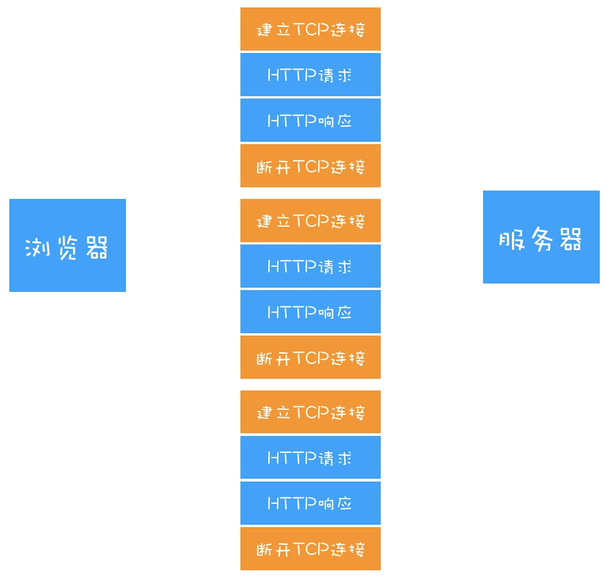
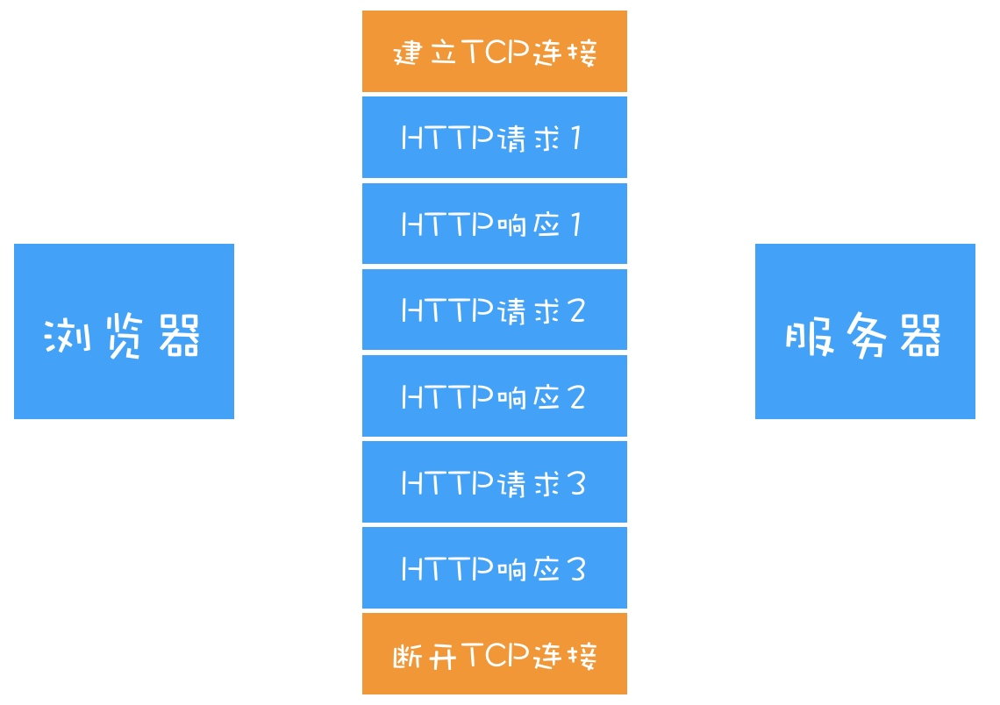
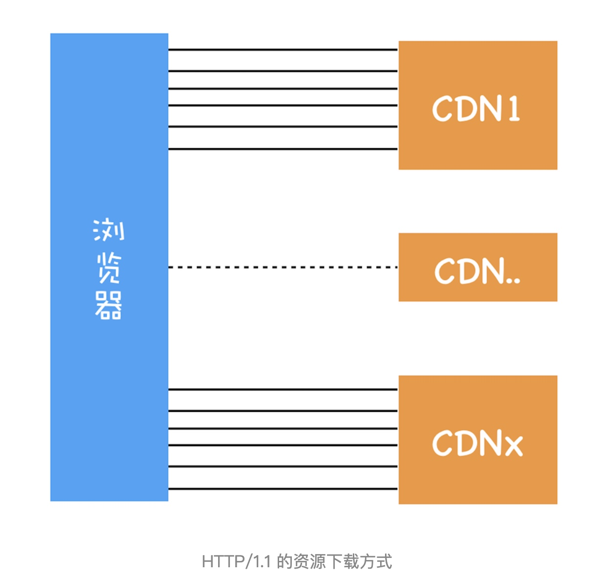
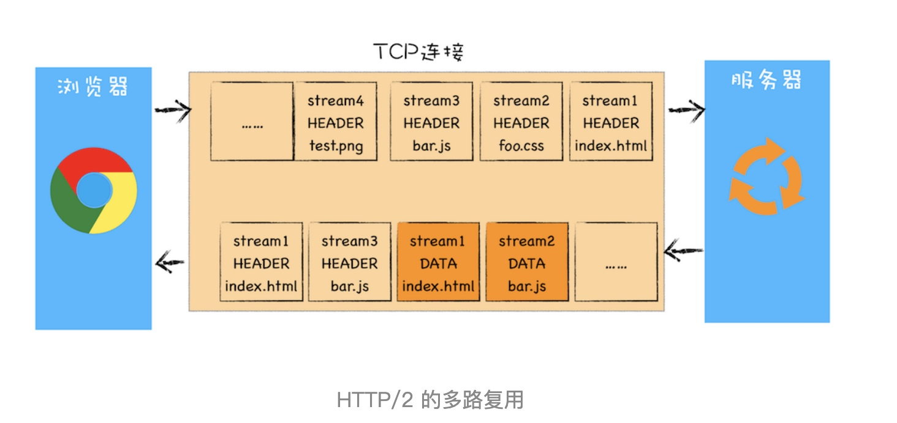
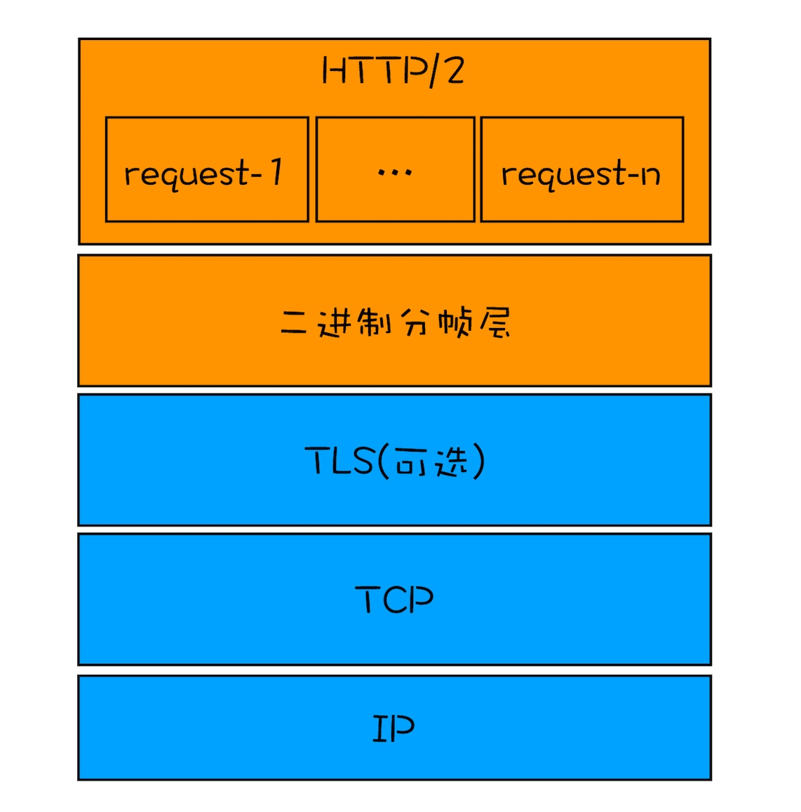

# HTTP1：HTTP性能优化
**HTTP/1.0 是怎么通过请求头和响应头来支持多种不同类型的数据呢？**
HTTP/1.0 的方案是通过请求头和响应头来进行协商，在发起请求时候会通过 HTTP 请求头告诉服务器它期待服务器返回什么类型的文件、采取什么形式的压缩、提供什么语言的文件以及文件的具体编码。最终发送出来的请求头内容如下：
```
accept: text/html
accept-encoding: gzip, deflate, br
accept-Charset: ISO-8859-1,utf-8
accept-language: zh-CN,zh
```
不过以上的这些请求头只是浏览器的期望值，而实际上当服务器响应数据后，浏览器还是要根据响应头来处理：
```
content-encoding: br
content-type: text/html; charset=UTF-8
```
其中第一行表示服务器采用了 br 的压缩方法，第二行表示服务器返回的是 html 文件，并且该文件的编码类型是 UTF-8。

### 缝缝补补的 HTTP/1.1
#### 1. 改进持久连接
HTTP/1.0 每进行一次 HTTP 通信，都需要经历建立 TCP 连接、传输 HTTP 数据和断开 TCP 连接三个阶段（如下图）。


HTTP/1.1 中增加了持久连接的方法，它的特点是在一个 TCP 连接上可以传输多个 HTTP 请求，只要浏览器或者服务器没有明确断开连接，那么该 TCP 连接会一直保持。

从上图可以看出，HTTP 的持久连接可以有效减少 TCP 建立连接和断开连接的次数，这样的好处是减少了服务器额外的负担，并提升整体 HTTP 的请求时长。
目前浏览器中对于**同一个域名**，默认允许同时建立 6 个 TCP 持久连接。
一个网页的请求资源可以放在不同的域名上，那么就可以同时建立更多的连接，这就是 CDN 优化。

#### 2. 提供虚拟主机的支持
在 HTTP/1.0 中，每个域名绑定了一个唯一的 IP 地址，因此一个服务器只能支持一个域名。但是随着虚拟主机技术的发展，需要实现在一台物理主机上绑定多个虚拟主机，每个虚拟主机都有自己的单独的域名，这些单独的域名都公用同一个 IP 地址。

因此，HTTP/1.1 的请求头中增加了Host 字段，用来表示当前的域名地址，这样服务器就可以根据不同的 Host 值做不同的处理。

#### 3. 对动态生成的内容提供了完美支持
在设计 HTTP/1.0 时，需要在响应头中设置完整的数据大小，如Content-Length: 901，这样浏览器就可以根据设置的数据大小来接收数据。不过随着服务器端的技术发展，很多页面的内容都是动态生成的，因此在传输数据之前并不知道最终的数据大小，这就导致了浏览器不知道何时会接收完所有的文件数据。

HTTP/1.1 通过引入Chunk transfer 机制来解决这个问题，服务器会将数据分割成若干个任意大小的数据块，每个数据块发送时会附上上个数据块的长度，最后使用一个零长度的块作为发送数据完成的标志。这样就提供了对动态内容的支持。

#### 客户端 Cookie、安全机制
除此之外，HTTP/1.1 还引入了客户端 Cookie 机制和安全机制。

# HTTP2：如何提升网络速度
本文我们依然从需求的层面来谈，先分析 HTTP/1.1 存在哪些问题，然后再来分析 HTTP/2 是如何解决这些问题的。

我们知道 HTTP/1.1 为网络效率做了大量的优化，最核心的有如下三种方式：

* 增加了持久连接；
* 浏览器为每个域名最多同时维护 6 个 TCP 持久连接；
* 使用 CDN 的实现域名分片机制。
通过这些方式就大大提高了页面的下载速度，你可以通过下图来直观感受下：

在该图中，引入了 CDN，并同时为每个域名维护 6 个连接，这样就大大减轻了整个资源的下载时间。

### HTTP/1.1 的主要问题
#### 第一个原因，TCP 的慢启动。
一旦一个 TCP 连接建立之后，就进入了发送数据状态，刚开始 TCP 协议会采用一个非常慢的速度去发送数据，然后慢慢加快发送数据的速度，直到发送数据的速度达到一个理想状态，我们把这个过程称为慢启动。
#### 第二个原因，同时开启了多条 TCP 连接，那么这些连接会竞争固定的带宽。
这样就会出现一个问题，因为有的 TCP 连接下载的是一些关键资源，如 CSS 文件、JavaScript 文件等，而有的 TCP 连接下载的是图片、视频等普通的资源文件，但是多条 TCP 连接之间又不能协商让哪些关键资源优先下载，这样就有可能影响那些关键资源的下载速度了。
#### 第三个原因，HTTP/1.1 队头阻塞的问题。
在 HTTP/1.1 中使用**持久连接时**，虽然能在一个 TCP 请求上，发送多个 http 请求，但是这些请求是处于同一个管道中的。在一个管道中同一时刻只能处理一个请求，在当前的请求没有结束之前，其他的请求只能处于阻塞状态。这意味着我们不能随意在一个管道中发送请求和接收内容。

### HTTP/2 的多路复用
HTTP/2 的解决方案可以总结为：一个域名只使用一个 TCP 长连接和消除队头阻塞问题。可以参考下图：

该图就是 HTTP/2 最核心、最重要且最具颠覆性的多路复用机制。从图中你会发现**每个请求都有一个对应的 ID**，如 stream1 表示 index.html 的请求，stream2 表示 foo.css 的请求。这样在浏览器端，就可以随时将请求发送给服务器了。
如图中服务器在响应数据的时候，stream1 的 header 和 data 也不是连续的，只需要带上 ID 响应，浏览器会根据 ID 拼接为完整的 HTTP 响应数据。

另外 HTTP/2 使用了多路复用技术，可以将请求分成一帧一帧的数据去传输，这样带来了一个额外的好处，就是当收到一个优先级高的请求时，比如接收到 JavaScript 或者 CSS 关键资源的请求，服务器可以暂停之前的请求来优先处理关键资源的请求。

### 多路复用的实现

从图中可以看出，HTTP/2 添加了一个二进制分帧层，那我们就结合图来分析下 HTTP/2 的请求和接收过程。

* 首先，浏览器准备好请求数据，包括了请求行、请求头等信息，如果是 POST 方法，那么还要有请求体。
* 这些数据经过二进制分帧层处理之后，会被转换为一个个带有请求 ID 编号的帧，通过协议栈将这些帧发送给服务器。
* 服务器接收到所有帧之后，会将所有相同 ID 的帧合并为一条完整的请求信息。
* 然后服务器处理该条请求，并将处理的响应行、响应头和响应体分别发送至二进制分帧层。
* 同样，二进制分帧层会将这些响应数据转换为一个个带有请求 ID 编号的帧，经过协议栈发送给浏览器。
* 浏览器接收到响应帧之后，会根据 ID 编号将帧的数据提交给对应的请求
从上面的流程可以看出，通过引入二进制分帧层，就实现了 HTTP 的多路复用技术。

### HTTP/2 其他特性
#### 1. 可以设置请求的优先级
HTTP/2 提供了请求优先级，可以在发送请求时，标上该请求的优先级，这样服务器接收到请求之后，会优先处理优先级高的请求。

#### 2. 服务器推送
HTTP/2 可以直接将数据提前推送到浏览器。你可以想象这样一个场景，当用户请求一个 HTML 页面之后，服务器知道该 HTML 页面会引用几个重要的 JavaScript 文件和 CSS 文件，那么在接收到 HTML 请求之后，附带将要使用的 CSS 文件和 JavaScript 文件一并发送给浏览器，这样当浏览器解析完 HTML 文件之后，就能直接拿到需要的 CSS 文件和 JavaScript 文件，这对首次打开页面的速度起到了至关重要的作用。（不需要浏览器再去单独请求重要的 JS 和 CSS 了）

#### 3. 头部压缩
HTTP/2 对请求头和响应头进行了压缩以提高性能。

### HTTP/3
基于 UDP 实现了类似于 TCP 的多路数据流、传输可靠性等功能，我们把这套功能称为QUIC 协议。

但是目前无论是浏览器还是硬件设备对 QUIC 协议的支持都较弱。目前 HTTP/3 并不完善。
