# 开发步骤
1. 根据要做的事在电路图中找到对应的电路，观察控制这里的引脚是哪个。如需要点亮一个 LED 灯，先找到相应电路，分析如何才能点亮，比如需要 PA0 是低电平就能点亮。
2. 在芯片引脚中找到对应引脚，比如 PA0，在 32MCU 上一个引脚通常有多个功能，就需要根据需求对这个引脚进行配置。比如这里是要 PA0 输出低电平，那么就把它当成一个通用输出就行了。
3. 对引脚工作模式的配置。这里我们要把 PA0 引脚当作通用输出，那么就要把这个引脚配置为通用输出模式，在 GPIO 端口模式寄存器中就能对相应端口的模式进行配置。
4. 对输出速度进行配置，在 GPIO 端口输出速度寄存器中可以修改引脚的输出速度。（不同的芯片设计不同，输出速度寄存器可能合并在工作模式寄存器中。）
5. 对输出类型进行配置，在 GPIO 端口输出类型寄存器中，修改 PA0 的输出类型，这里我们可以配置为推挽输出。
6. 对输出数据进行配置，在 GPIO 端口输出数据寄存器中，修改 PA0 的输出数据为0，即低电平输出。
寄存器的地址是当前模块的基地址加上偏移地址，如：
```c
/**
 * PA0输出低电平，其它保持高电平
 * 将 0x40010800 + 0x0C 这个数字，使用 uint32_t * 强转为地址，
 * 再使用 * 得到地址值的变量进行赋值，从而修改寄存器数据。
 * 0xfffe 是因为高位的16位为保留位，不用赋值，如果需要赋值则为 0xfffffffe
 */
*(uint32_t *)(0x40010800 + 0x0C)= 0xfffe;

// 等同于
uint32_t *p = (uint32_t *)(0x40010800 + 0x0C);
*p = 0xfffe;
```
### 基地址
这是 py32 和 stm32 的芯片手册中的表示方法。
  
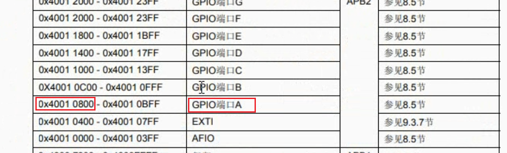  
### 偏移量
偏移量可以在每个分类下看，也可以在总表看。
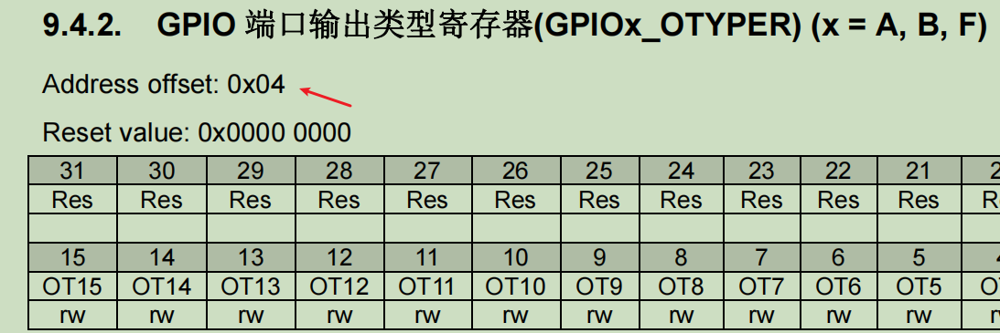  
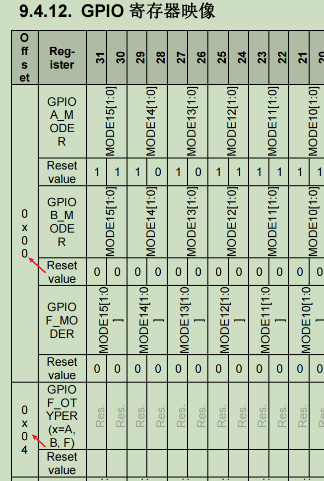  

# 寄存器宏定义
上面用到的基地址、偏移量等，芯片商已经定义好了宏提供给我们使用，我们只需要使用这些宏即可。如：
```c
// RCC 模块名，ODR 寄存器名称
RCC->ODR = 0xfffe;
```
RCC 就是指向基地址的指针，并且是个结构体指针，里面每个成员就是个32位的寄存器，访问到对应的寄存器进行赋值就能更方便的修改寄存器了。

### 只改需要的位
上面的写法导致我们是一次性修改整个32位的寄存器，实际上我们只需要修改其中某些位，那么就可以这样写：
```c
/**
 * RCC_ODR_ODR0 是对应位的宏定义，我们对其进行 按位与 或 按位或 运算就能达到修改具体位的目的
 * 宏定义里面就是将对应位定义为1：如 0x00000003，就是32位寄存器的最后两位为1，
 * 即00...0011。要将这两位改为0就取反再按位与，改为1就按位或即可。
 */
// 改为0，取反后就是 11...1100
RCC->ODR &= ~RCC_ODR_ODR0;
// 改为1
RCC->ODR |= RCC_ODR_ODR0;
```

# 系统架构
不同型号架构会有不同，需要自己看手册的系统架构图。
### 被动单元
*  内部 SRAM
    * 存储程序执行时用到的变量。
*  内部闪存存储器
    * 存储下载的程序。
    * 程序执行时用到的常量。
* AHB 到 APB 的桥（AHB to APBx）
    * 通过 APB 总线连接到 APB 上的外设。
    * 通常分为两条线，一条是高速线，连接告诉外设。一条是低速线，连接低速外设。

### 驱动（主动）单元
* CORTEX-M 内核 DCode 总线（D-Bus）（PY32F003 里没有）
    * 通过外部的 DCode 总线连接到总线矩阵然后与闪存存储器的数据接口相连接，实现从 Flash 常量加载和调试访问。
* 内部系统总线（S-bus）
    * 通过外部的 System 总线连接到总线矩阵。
* 通用 DMA
    * 通过 DMA 总线连接到总线矩阵，作用就是降低 CPU 的负担，由 DMA 实现内存和外设之间的数据传输。

# GPIO
### 寄存器
不同芯片寄存器名称略有不同，但大致是相同的。
* RCC->APB2ENR |= RCC_APB2ENR_IOPBEN; 时钟使能寄存器，这里是 GPIOB 的
* GPIOx_CRL 端口配置低寄存器。配置输入/输出模式、速度、上下拉等。
* GPIOx_CRH 端口配置高寄存器。
某些芯片不会分为两个寄存器，就是一个 GPIOx_CR 寄存器。
```c
// 同时配置两个 GPIO 引脚
GPIOB->CRH |= (GPIO_CRH_MODE10 | GPIO_CRH_MODE11);
GPIOB->CRH &= ~(GPIO_CRH_CNF10_1 | GPIO_CRH_CNF11_1);
GPIOB->CRH |= (GPIO_CRH_CNF10_0 | GPIO_CRH_CNF11_0);
```
* GPIOx_IDR 端口输入数据寄存器。获取引脚的输入值。
* GPIOx_ODR 端口输出数据寄存器。设置引脚的输出值。
* GPIOx_BSRR 端口位设置/清除寄存器。通常不使用，直接使用 IDR/ODR。
* GPIOx_BRR 端口位清除寄存器。这个寄存器具有了GPIOx_BSRR一半的功能：清除。
* GPIOx_LCKR 端口配置锁定寄存器。该寄存器用来锁定端口位的配置。当对相应的端口位执行了LOCK序列后，在下次系统复位之前将不能再更改端口位的配置。

# 中断
### 中断和异常
中断分为内部中断（内核中断）和外部中断，但在上古时代，内部中断叫做异常，外部中断才叫中断。因此如果看到“异常”和“中断”的描述，要能明白表示的是内部中断和外部中断。

### NVIC
嵌套向量中断控制器。中断系统的大总管，接近于内核中用于管理所有中断的一个模块，可以通过 NVIC 配置各种中断类型的优先级。
* 抢占优先级：抢占优先级越高，内核越先执行。在执行低优先级的中断任务时，来了个高优先级的中断，会暂停低优先级中断任务去执行高优先级的。
* 响应优先级：当一个高优先级的中断任务在执行时，来了几个低优先级的中断任务，等高优先级任务执行完后先执行等待中的哪个，就要看它们哪个的响应优先级更高。相同的话内核内部还有一个根据不同中断类型的优先级。

NVIC 由于太接近内核，我们一般都使用库函数配置，而不使用寄存器操作的方式。下面的 EXTI 就可以方便的使用寄存器的方式进行配置。

### EXTI
外部中断控制器，EXT-external，I-interrupt。当外部硬件触发中断时，通过电路连接到 MCU 的针脚，针脚通过我们的配置等知道是个外部中断，就会将它交给 EXTI。EXTI 接收到中断信号后，会通过 EXTI 的相关寄存器配置判断这个中断信号是上升沿/下降沿中断，是否屏蔽此类型中断等，决定是否交给 NVIC 执行。

#### 中断分类
* 内核中断：编写在内核中的那些优先级最高的中断，如复位（系统异常导致复位）、系统滴答定时器等。
* 片上外设：集成在 MCU 上的中断，如串口、定时器、IIC等。
* 外部中断：没在 MCU 上，通过引脚连接的按键等产生的中断。外部中断可以被使能或禁止，通过 EXTI 交给 NVIC 来处理。
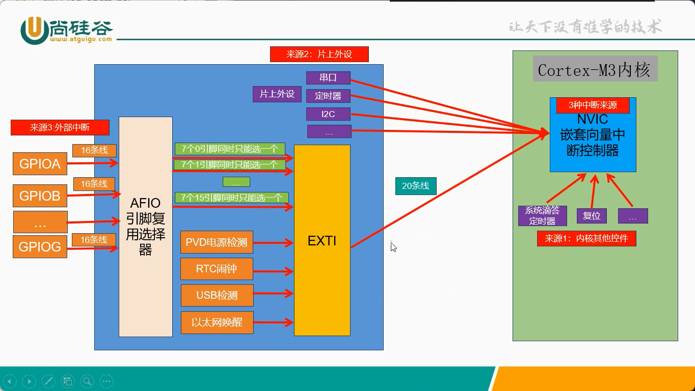  

### 中断优先级
优先级值设置的越小的，优先级越高。中断优先级分为抢占优先级和响应优先级。
* 抢占优先级：优先级高的中断可以打断优先级低的中断，先执行优先级高的。
* 响应优先级：当有个高优先级的正在执行，来了很多个低优先级的，那么当高优先级的执行完后，在这些等待执行的中断中的执行顺序是：优先级高的先执行，如果优先级相同则按照中断向量表中的排序来决定谁先执行（而不是先来的先执行）。

实际在配置时是配置优先级组，每组里面又分子优先级（可选的）。分组可以看做是抢占优先级，子优先级看做响应优先级。通常配置为只有组优先级就行，这样简单易控制。
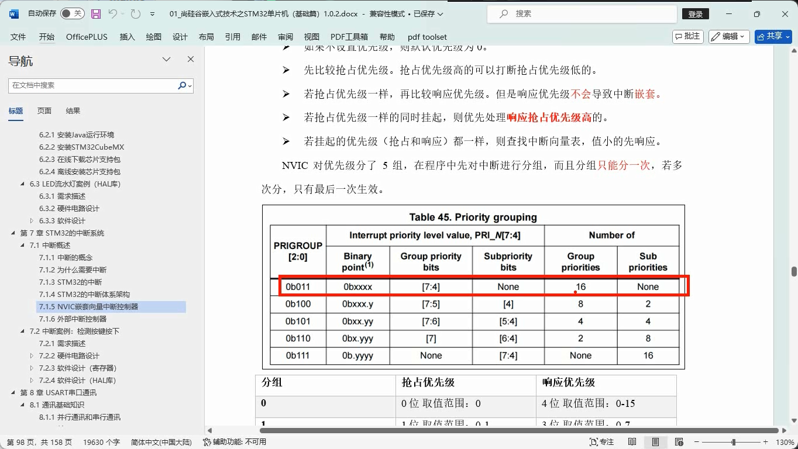  

```c
// 5. NVIC配置示例
NVIC_SetPriorityGrouping(3);    // 全部都是抢占优先级。3->0b011
NVIC_SetPriority(EXTI15_10_IRQn, 3); // EXTI15_10_IRQn 是10-15条线的中断定义
NVIC_EnableIRQ(EXTI15_10_IRQn);
```

### EXTI 原理
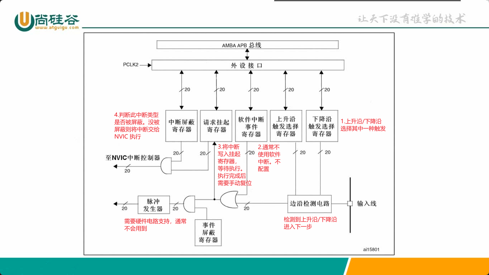  
需要注意两点：
1. 中断屏蔽寄存器中没有配置屏蔽此类型中断，才能执行。
2. 中断执行完成后需要手动复位请求挂起寄存器。

### 中断开发流程
需要根据芯片配置对应的寄存器，根据电路设计配置对应的 GPIO 模式等。
#### 一、时钟使能
```c
    // APB2 外设时钟使能寄存器(RCC_APB2ENR)
    /* 1 开启时钟 (EXTI和NVIC时钟始终开启，无需手动开启)*/
    /* 1.1 开启 GPIOF 时钟 */
    RCC->APB2ENR |= RCC_APB2ENR_IOPFEN;
    /* 1.2 开启AFIO时钟 */
    RCC->APB2ENR |= RCC_APB2ENR_AFIOEN;
```
#### 二、GPIO 模式配置
```c
    /* 2 配置GPIO  设置为输入 下拉(cnf: 10 mode: 00) 。另外还需要把ODR寄存器对应的位设为0  (1=上拉)*/
    GPIOF->CRH &= ~GPIO_CRH_MODE10;
    GPIOF->CRH |= GPIO_CRH_CNF10_1;
    GPIOF->CRH &= ~GPIO_CRH_CNF10_0;
    GPIOF->ODR &= ~GPIO_ODR_ODR10;
```
#### 三、配置 AFIO 引脚复用选择器
AFIO 即引脚 N 合1的那个功能模块，由于引脚比较多，所以需要使用多个寄存器才能对每个引脚进行配置，如教程中的芯片就分为 AFIO_EXTICR1、AFIO_EXTICR2、AFIO_EXTICR3、AFIO_EXTICR4 每个寄存器里可配置4个共16个。每个寄存器里的每一个可配置 0000-0110 共7种。
教程中要配置 PF10 为引脚复用，则需要配置 EXTICR[2]（即AFIO_EXTICR3） 中的 EXTI10 配置为 0101（即PF引脚）。也就是在7个10号引脚中选择了 GPIOF。
**\* 注意这里 PF10 中的10就是 AFIO 到 EXTI 的第10条线。**
```c
/* 3  配置 AFIO, 用于引脚复用为外部中断  PF10 */
AFIO->EXTICR[2] |= AFIO_EXTICR3_EXTI10_PF;
```
#### 四、配置 EXTI
```c
    /* 4. 配置 EXTI */
    /* 4.1 RTSR 上升沿触发中断寄存器中将 TR10 打开   */
    EXTI->RTSR |= EXTI_RTSR_TR10;
    /* 4.2 IMR 中断屏蔽寄存器中开启 EXTI10 线（使其不屏蔽） */
    EXTI->IMR |= EXTI_IMR_MR10;
```
#### 五、清除中断标志位
在中断程序处理完成后需要手动清除中断标志位。
```c
    /* 在 PR 寄存器中清除中断标志. 写1清除中断 */
    EXTI->PR |= EXTI_PR_PR10;
```

### 注意
#### 开启芯片功能
没使用 CubeMX 创建项目，使用自己拷贝的 startupxxxx.s, stm32xxxx.h 进行开发时，文件中使用的默认芯片配置，可能会和我们使用的芯片有区别，从而有些功能无法使用，比如这里 `RCC_APB2ENR_IOPFEN` 没有，最多只有 `RCC_APB2ENR_IOPEEN`，我们就需要去文件中修改，将芯片配置打开。
这里就将 `#define STM32F10X_HD` 这行注释打开了，这款芯片的相关功能就生效了。
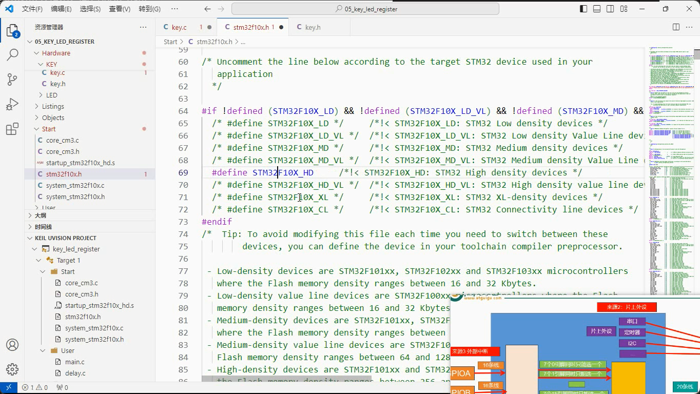  

#### 系统滴答定时器优先级
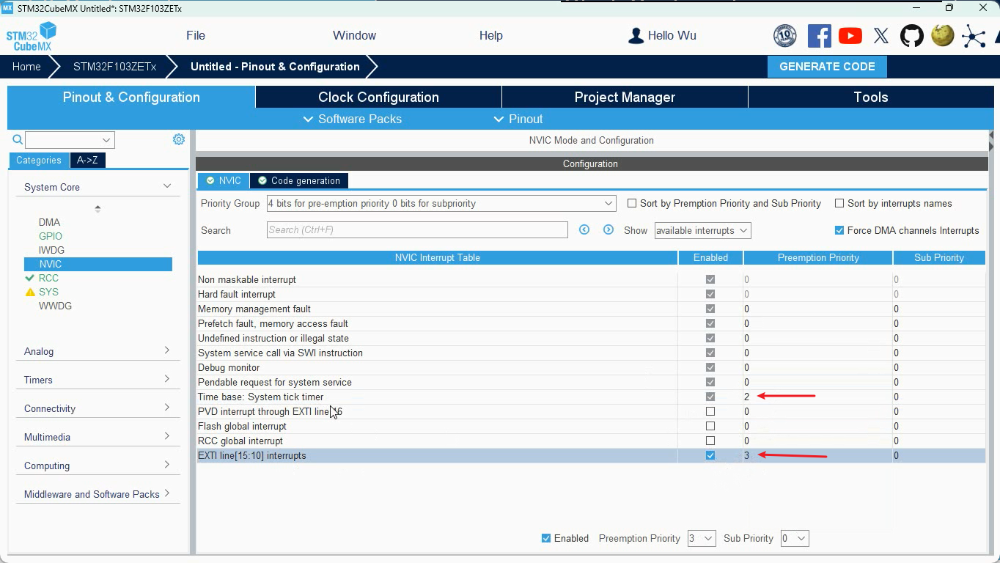  
系统滴答定时器默认优先级是15，优先级很低，但是我们在中断中需要调用 delay 方法，delay 方法就是使用的系统滴答定时器，这就导致了在中断中调用另一个中断，而调用的中断如果哦优先级比当前中断更低的话，则无法打断当前中断，从而调用失败程序卡死。所以需要将系统滴答定时器的优先级配置来比我们使用 EXTI 中断优先级更高才行。

#### 中断程序要尽可能短
中断程序里执行的逻辑要尽可能的精简，如果中断程序太长，则会阻塞主程序，也可能被其它中断打断。如果逻辑复杂，则可以优化为使用一个变量标识符，中断发生后修改此标识符，在主程序中判断标识符的变化来执行逻辑。

### 中断示例代码
#### 寄存器方式：
```c
void Key_Init()
{
    // 1. 配置时钟
    RCC->APB2ENR |= RCC_APB2ENR_IOPFEN;
    RCC->APB2ENR |= RCC_APB2ENR_AFIOEN;

    // 2. GPIO工作模式配置，PF10：CNF - 10，MODE - 00
    GPIOF->CRH &= ~GPIO_CRH_MODE10;
    GPIOF->CRH |= GPIO_CRH_CNF10_1;
    GPIOF->CRH &= ~GPIO_CRH_CNF10_0;

    GPIOF->ODR &= ~GPIO_ODR_ODR10;

    // 3. AFIO配置引脚复用选择
    AFIO->EXTICR[2] |= AFIO_EXTICR3_EXTI10_PF;

    // 4. 配置EXTI
    EXTI->RTSR |= EXTI_RTSR_TR10;
    EXTI->IMR |= EXTI_IMR_MR10;

    // 5. NVIC配置
    NVIC_SetPriorityGrouping(3);    // 全部都是抢占优先级
    NVIC_SetPriority(EXTI15_10_IRQn, 3);
    NVIC_EnableIRQ(EXTI15_10_IRQn);
}

// 中断服务程序
void EXTI15_10_IRQHandler(void)
{
    // 先清除中断挂起标志位
    EXTI->PR |= EXTI_PR_PR10;

    // 防抖延迟
    Delay_ms(10);

    // 判断如果依然保持高电平，就翻转LED1
    if ((GPIOF->IDR & GPIO_IDR_IDR10) != 0)
    {
        LED_Toggle(LED1);
    }
}
```

#### HAL 库方式
使用 CubeMX 生成的项目就有了基础的中断相关代码：
gpio.c 中生成的代码，主要是 NVIC 相关配置：
```c
/** gpio.c 中的代码 */
void MX_GPIO_Init(void)
{

  GPIO_InitTypeDef GPIO_InitStruct = {0};

  /* GPIO Ports Clock Enable */
  __HAL_RCC_GPIOC_CLK_ENABLE();
  __HAL_RCC_GPIOF_CLK_ENABLE();
  __HAL_RCC_GPIOA_CLK_ENABLE();

  /*Configure GPIO pin Output Level */
  HAL_GPIO_WritePin(LED1_GPIO_Port, LED1_Pin, GPIO_PIN_SET);

  /*Configure GPIO pin : KEY3_Pin */
  GPIO_InitStruct.Pin = KEY3_Pin;
  GPIO_InitStruct.Mode = GPIO_MODE_IT_RISING;
  GPIO_InitStruct.Pull = GPIO_PULLDOWN;
  HAL_GPIO_Init(KEY3_GPIO_Port, &GPIO_InitStruct);

  /*Configure GPIO pin : LED1_Pin */
  GPIO_InitStruct.Pin = LED1_Pin;
  GPIO_InitStruct.Mode = GPIO_MODE_OUTPUT_PP;
  GPIO_InitStruct.Pull = GPIO_NOPULL;
  GPIO_InitStruct.Speed = GPIO_SPEED_FREQ_HIGH;
  HAL_GPIO_Init(LED1_GPIO_Port, &GPIO_InitStruct);

  /* EXTI interrupt init*/
  HAL_NVIC_SetPriority(EXTI15_10_IRQn, 3, 0); // 生成了 NVIC 中断优先级配置
  HAL_NVIC_EnableIRQ(EXTI15_10_IRQn); // 中断使能

}
```
stm32f1xx_it.c 中生成的代码，主要是中断回调执行：
```c
/** stm32f1xx_it.c 中生成的中断相关代码。中断发生时执行这里的中断服务程序 */
void EXTI15_10_IRQHandler(void)
{
  /* USER CODE BEGIN EXTI15_10_IRQn 0 */

  /* USER CODE END EXTI15_10_IRQn 0 */
  HAL_GPIO_EXTI_IRQHandler(KEY3_Pin); // 中断中调用了个 HAL 库提供的回调函数，我们实现回调函数即可
  /* USER CODE BEGIN EXTI15_10_IRQn 1 */

  /* USER CODE END EXTI15_10_IRQn 1 */
}

/** HAL_GPIO_EXTI_IRQHandler 的实现 */
/**
  * @brief  This function handles EXTI interrupt request.
  * @param  GPIO_Pin: Specifies the pins connected EXTI line
  * @retval None
  */
void HAL_GPIO_EXTI_IRQHandler(uint16_t GPIO_Pin)
{
  /* EXTI line interrupt detected */
  if (__HAL_GPIO_EXTI_GET_IT(GPIO_Pin) != 0x00u)
  {
    __HAL_GPIO_EXTI_CLEAR_IT(GPIO_Pin);
    HAL_GPIO_EXTI_Callback(GPIO_Pin); // 调用了 HAL_GPIO_EXTI_Callback
  }
}

/**
  * @brief  EXTI line detection callbacks.
  * @param  GPIO_Pin: Specifies the pins connected EXTI line
  * @retval None
  */
 /** 
  * __weak 是 C++ 的关键字，C 语言中没有，ARMCC 编译器实现了。功能是可以进行函数重写。
  * 我们可以重写此函数，HAL_GPIO_EXTI_IRQHandler 中调用的就是我们重新的函数了
  */
__weak void HAL_GPIO_EXTI_Callback(uint16_t GPIO_Pin)
{
  /* Prevent unused argument(s) compilation warning */
  UNUSED(GPIO_Pin);
  /* NOTE: This function Should not be modified, when the callback is needed,
           the HAL_GPIO_EXTI_Callback could be implemented in the user file
   */
}
```
编写 HAL_GPIO_EXTI_Callback 回调，这里就不再加 `__weak` 关键字了，就会调用我们自己的实现：
```c
// GPIO_Pin 就收到的就是 KEY3_Pin
void HAL_GPIO_EXTI_Callback(uint16_t GPIO_Pin) {
  // 检查是否是 KEY3 按键的中断，即 EXTI10 传来的中断请求
  if (GPIO_Pin == KEY3_Pin) {
    // EXTI->PR = KEY3_Pin; // 不在需要手动清除中断标志位，HAL_GPIO_EXTI_IRQHandler 中已经帮我们清除了

    HAL_Delay(10); // 延时 10 毫秒，防止按键抖动
    // 判断如果是高电平，则翻转 LED1
    if (HAL_GPIO_ReadPin(KEY3_GPIO_Port, KEY3_Pin) == GPIO_PIN_SET) {
      // 按键按下，执行相应的操作
      HAL_GPIO_TogglePin(LED1_GPIO_Port, LED1_Pin); // 切换 LED 状态
    }
  }
}
```
# USART 串口通讯
### 串行 VS 并行
虽然并行一次性可以发送多位，理论上传输速度更快。但是并行在长距离传输时更容易受干扰，并且传输速率达到一定程度后就没法再往上提升，再提升就很容易出错，某一位受干扰或晚了一点点到达都会导致问题。而串行就没有这么多问题，而且设计更简单，成本更低，并且可以通过高速的传输速率来抹平传输速率的劣势。
比如显卡曾经也是使用 PCI 接口，这是一个并行的接口，但是现在使用的 PCIe 是串行接口，只是每个引脚传输的是不同的数据，而不是多个引脚并行传输统一数据。并且随着频率的提升，速度还快于曾经并行的 PCI。另外硬盘以前的 ATA 接口也是并行，现在的 SATA 接口是串行，也更快。
现在并行通常都用在芯片内部总线这些地方，距离很短，提升速率才不会导致错误。

### 同步 VS 异步
* 同步：有时钟信号的是同步通信。如果是单工通信，那么就只需要一根时钟信号线和一根数据信号线。如果是全双工通信那么就需要两根时钟信号线和两根数据信号线。
* 异步：没有时钟信号的是异步通信，通过特定的电平变化来通知开始和结束。

### UART VS USART
UART 是个基础的传输协议，USART 是基于 UART 的改进版。除了 USART 外，在其之上还可以添加更多的电气化标准，实现了更多的传输功能，如远距离传输的 RS-232, RS-485 等。电脑上通常把串口叫做 COM 口，所以我们在串口工具里看到的也是 COMx 这样的名称。

* UART：（Universal Asynchronous Receiver/Transmitter）通用异步收发传输器，是一种异步收发传输器，是电脑硬件的一部分。它将要传输的资料在串行通信与并行通信之间加以转换。作为把并行输入信号转成串行输出信号的芯片，UART通常被集成于其他通讯接口的连结上。
用于异步通信。该总线双向通信，可以实现全双工传输和接收。在嵌入式设计中，UART用于主机与辅助设备通信，如汽车音响与外接AP之间的通信，与PC机通信包括与监控调试器和其它器件，如EEPROM通信。
具体实物表现为独立的模块化芯片，或作为集成于微处理器中的周边设备。一般是RS-232C规格的，与类似Maxim的MAX232之类的标准信号幅度变换芯片进行搭配，作为连接外部设备的接口。

* USART：（Universal Synchronous/Asynchronous Receiver/Transmitter）通用同步/异步串行接收/发送器USART是一个全双工通用同步/异步串行收发模块，该接口是一个高度灵活的串行通信设备。
USART收发模块一般分为三大部分：时钟发生器、数据发送器和接收器。控制寄存器为所有的模块共享。
时钟发生器由同步逻辑电路（在同步从模式下由外部时钟输入驱动）和波特率发生器组成。发送时钟引脚XCK仅用于同步发送模式下，
发送器部分由一个单独的写入缓冲器（发送UDR）、一个串行移位寄存器、校验位发生器和用于处理不同桢结构的控制逻辑电路构成。使用写入缓冲器，实现了连续发送多帧数据无延时的通信。
接收器是USART模块最复杂的部分，最主要的是时钟和数据接收单元。数据接收单元用作异步数据的接收。除了接收单元，接收器还包括校验位校验器、控制逻辑、移位寄存器和两级接收缓冲器（接收UDR）。接收器支持与发送器相同的帧结构，同时支持帧错误、数据溢出和校验错误的检测。

### 串口介绍
串口通讯（Serial Communication）是一种设备间非常常用的串行通讯方式，因为它简单便捷，因此大部分电子设备都支持该通讯方式，电子工程师在调试设备时也经常使用该通讯方式输出调试信息。
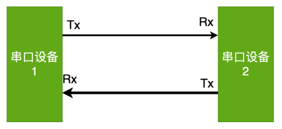  
烧录器通常就使用串口通讯。

### 串口通讯协议
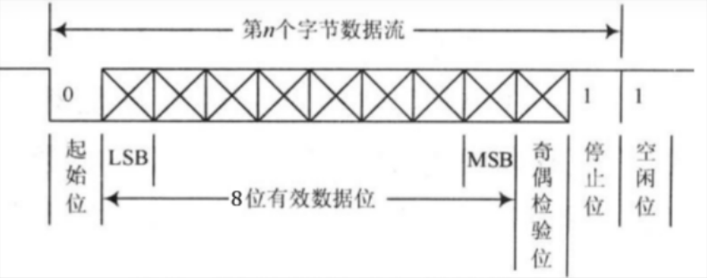  
从高电平变为低电平表示开始，然后发送8位字节数据流（可约定其它位长），先发送低位后发送高位，然后可以跟一个可选的奇偶校验位，最后恢复高电平结束。

#### 波特率
如果传输的数据都是1，那么就一直是高电平，如果识别到底是发了多少个1呢？这时就需要使用波特率了，在二进制中等于比特率。常见的波特率为 4800、9600、115200等。

### 串口的设计
STM32 芯片提供了多个串口，其中 USART1 接在高速外设上，速度比其它几个都更快。
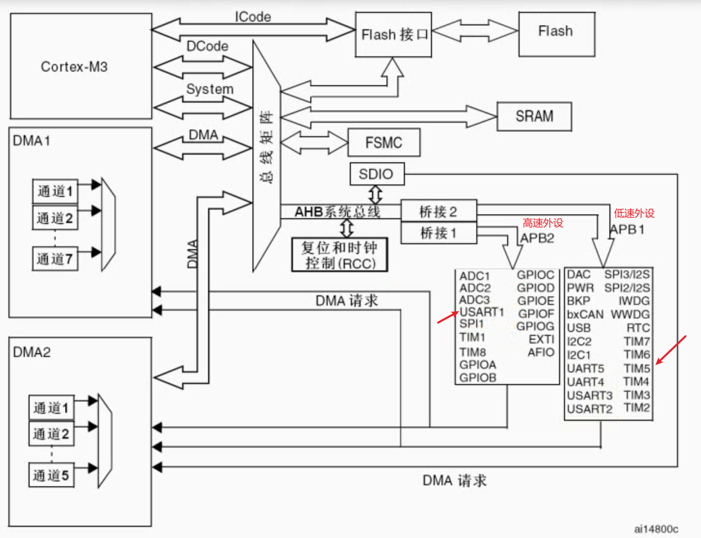  

### USART 功能框图原理
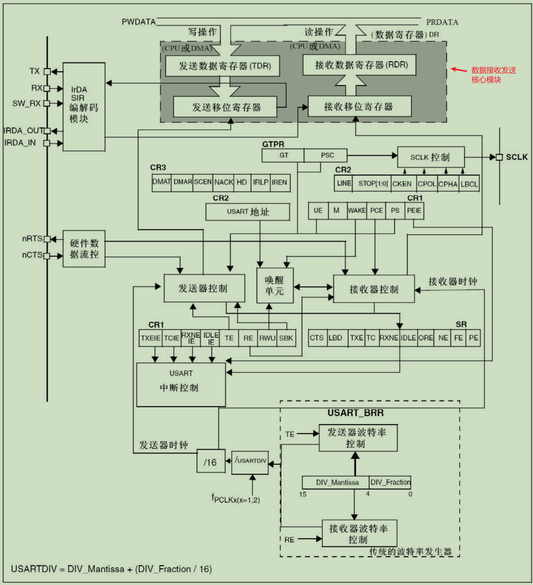  
#### 引脚含义
1. TX：输出引脚，用于发送数据
2. RX：输入引脚，用于接收数据
3. SW_RX：输入引脚，用于单线和智能卡模式，属于内部引脚，没有具体外部引脚引出。（极少使用）
4. IRDA_OUT：输出引脚，用于发送红外数据
5. IRDA_IN：输入引脚，用于接收红外数据
6. nRTS：请求以发送(Request To Send)，请求别人给我发送数据。n表低电平有效。若使能RTS硬件流控制，当USART接收器准备好接收数据时，nRTS有效，即它为低电平；当接收寄存器已满时，nRTS被设置为高电平
7. nCTS：清除以发送(Clean To Send)，别人告诉我可以发送数据。n表低电平有效。若使能CTS硬件流控制，发送器在发送下一帧数据前会检测nCTS引脚状态，若为低电平表可以发送数据，若为高电平则在发送完当前数据帧之后停止发送。
8. SCLK：发送器时钟输出引脚，仅适用于同步模式。

#### RX/TX 的流程
使用移位寄存器完成 串并/并串 转换。
接收数据时，通过 RX 接收到串行数据，然后交给接收移位寄存器，接收移位寄存器先收到的是低位，放入移位寄存器的高位，再收到时往低位移动。移位寄存器装满后，通过并行发送到接收数据寄存器，然后将数据并行交给内核处理。
发送数据时，先将数据并行写入发送数据寄存器，然后并行交给发送移位寄存器进行并串转换，一位一位的通过 TX 进行发送，先发送低位。

#### 其它
CR（control register）控制寄存器。
SR（status register）状态寄存器。
USART_BRR 波特率寄存器，配置的波特率存储在这里。

### 波特率
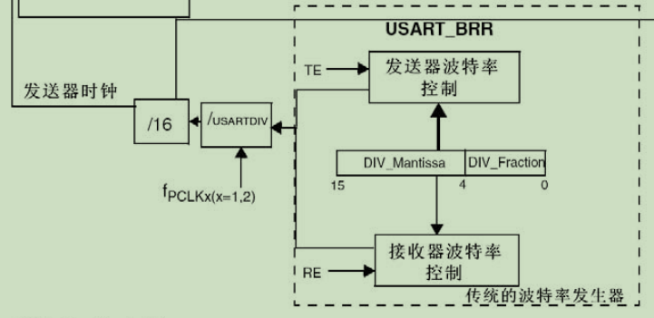  
波特率配置在 Div_Mantissa 和 Div_Fraction 中，前面的是整数位，后面的是小数位。
USARTDIV 计算公式为：USARTDIV = Div_Mantissa + (Div_Fraction / 16)
最终波特率计算公式为：$Tx/Rx波特率 = \frac{f_{ck}}{16 * USARTDIV}$，fck 是时钟频率，如72MHz。

常见波特率的值：
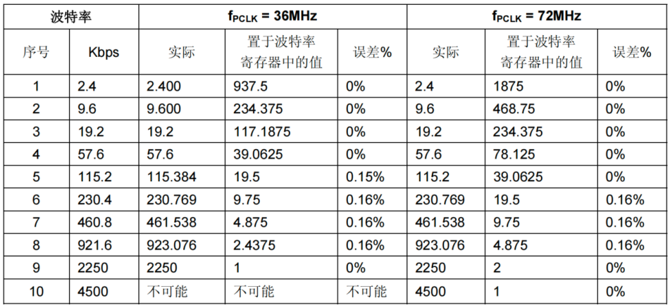  
*36MHz 是低速外设总线的速度，72MHz 是高速外设总线的速度（USART1）。*
假设我们需要的波特率是115200，则对应的分频值应该是：39.0625，把这个值写入到BRR寄存器中。39.0625的小数部分：0.0625 * 16 = 1, 整数部分是：39(0x27)。所以写入到BRR寄存器的值是：0x0271。


### 寄存器
* USART_BRR 配置波特率，如 `USART1->BRR = 0x271;`
* USART_CR1 收发使能和串口使能，另外还有中断使能，如：
```c
    /* 使能usart1的发送和接收 */
    USART1->CR1 |= (USART_CR1_TE | USART_CR1_RE);
    
    /* 使能usart1 */
    USART1->CR1 |= USART_CR1_UE;

    /* 使能usart1接收中断  */
    USART1->CR1 |= USART_CR1_RXNEIE;
```
* USART_DR 数据寄存器，整合了发送数据寄存器 TDR 和接收数据寄存器 RDR。USART_SR 状态寄存器，可判断发送缓冲区是否为空（TXE），接收缓冲区是否已满（RXNE），发送是否完成（TC），是否空闲（IDLE）等。如：
```c
{
    /* 等待接收缓冲区 非空 */
    while ((USART1->SR & USART_SR_RXNE) == 0)
    {
    }
    return USART1->DR;
}

/*
    向串口1发送一个字符
*/
void send_char(uint8_t c)
{
    /* 等待发送缓冲区为空。SR_TXE为1表示已经移到移位寄存器， 0表示还没有 */
    while ((USART1->SR & USART_SR_TXE) == 0)
    {
    }
    /* 把要发送的数据写入到数据寄存器 */
    USART1->DR = c;
}
```
需要注意的是，TC 初始值为1，表示已完成；而 IDLE 初始值为0，表示非空闲，要等待一次发送/接收完成后才会变为1.

# 调试
### 断点调试
在 Keil 中可以进行断点调试。将开发板通过STLink等串口转换工具连接到电脑后，便可以通过 Keil 进行断点调试。
在 Keil 中进行断点调试的原理涉及硬件调试接口、调试器与目标设备的交互机制，以及调试工具对寄存器和内存的访问能力。以下是详细解释：

#### 断点调试的基本原理
##### (1) 硬件调试接口
- **调试接口**：Keil 调试工具（如 Keil MDK）通过 **JTAG** 或 **SWD（Serial Wire Debug）** 接口与目标设备（如 STM32 单片机）连接。这些接口是芯片设计时预留的调试通道，允许调试器直接访问目标设备的内部资源（如 CPU 寄存器、内存等）。
- **调试组件**：现代 MCU（如 ARM Cortex-M 系列）内置了 **调试组件**（如 CoreSight 架构中的 DAP, Debug Access Port），支持调试器通过接口读写寄存器、设置断点、单步执行等。

##### (2) 断点的实现方式
- **硬件断点**：
  - 利用芯片内部的 **调试断点单元**（Breakpoint Unit），通过调试接口直接设置特定地址的断点。
  - 当程序执行到该地址时，调试器会 **暂停程序执行**，并接管控制权。
  - 优点：不会修改程序代码，适用于关键位置（如中断服务程序）。
  - 缺点：硬件断点数量有限（通常 2~8 个）。
- **软件断点**：
  - 调试器将程序中某条指令替换为 **断点指令**（如 ARM 的 `BKPT` 指令）。
  - 当程序执行到该指令时，触发 **调试异常**，调试器接管控制权。
  - 优点：不受硬件断点数量限制。
  - 缺点：会占用程序空间，可能影响代码布局。

##### (3) 程序暂停与恢复
- 当程序执行到断点时，调试器会：
  1. **暂停程序执行**：通过调试接口发送信号，冻结目标设备的 CPU。
  2. **保存上下文**：记录当前 CPU 寄存器（如 PC、SP、LR）、内存状态等。
  3. **进入调试模式**：允许用户查看变量、寄存器、内存等信息。
  4. **恢复执行**：用户继续调试后，调试器恢复保存的上下文，程序从断点处继续运行。

#### 调试方法
1. 在要调试的代码前打上断点：
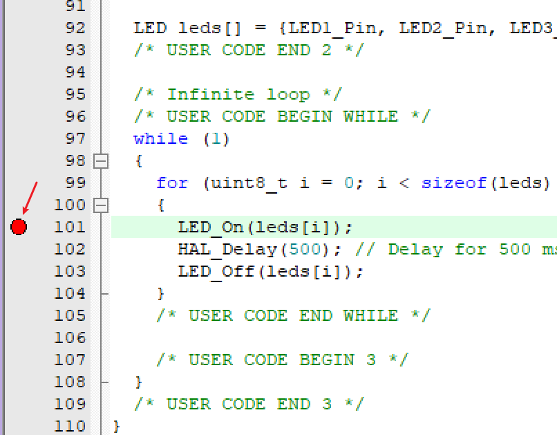 
2. 点击此按钮进入断点调试会话工具：
  
3. 按 F5 可以运行到断点处，或者通过其它快捷键一步一步的运行等：
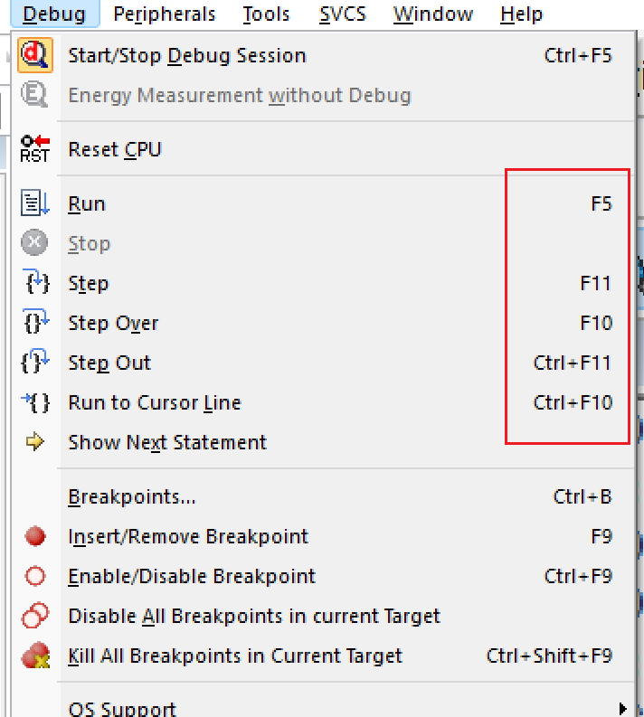  
工具栏也有按键提供：
  
4. 要看功能模块的寄存器数据，可以通过 Peripherals 选项打开：
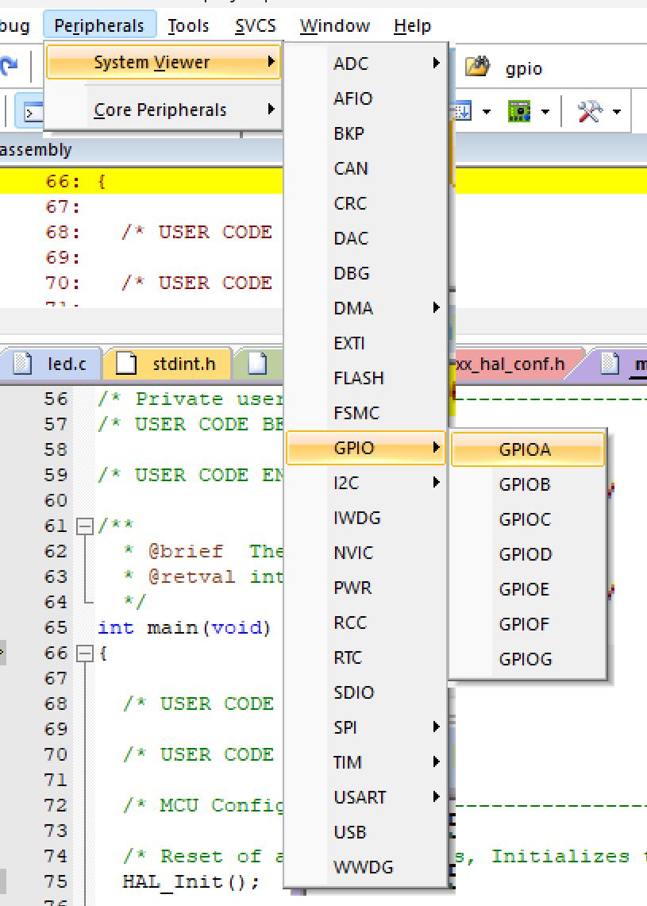  
这里我们打开 GPIOA，打开后可以看到相关寄存器的值，还可以手动点击修改值：
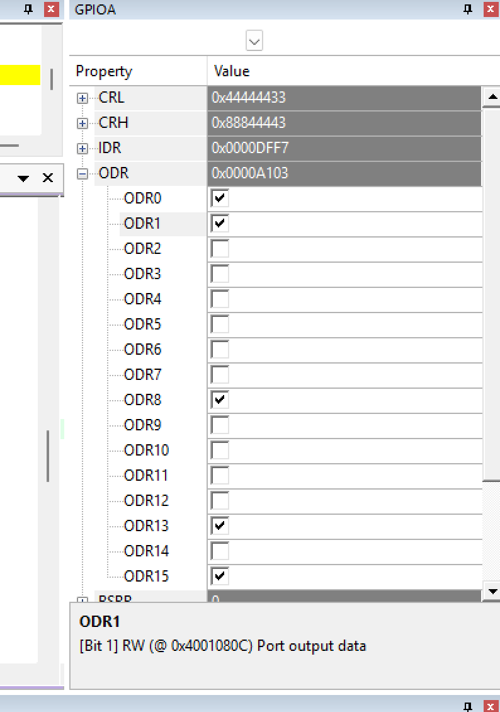  
5. 再次点击步骤2的断点调试会话按钮可以退出断点调试。

**注意：断点调试也是通过中断来进行调试，所以断点调试不合适对中断相关功能进行调试，因为中断之间会互相干扰。**

### printf 调试
在嵌入式开发中，不能直接使用 printf 输出内容。要实现 printf 调试功能，实现方式就是通过串口发送要打印的数据来进行调试。
printf 底层调用的 fputc 方法，把控制台当做个文件，往里面写入字符实现打印功能。所以我们要重写 fputc 方法，实现通过串口打印的功能：
```c
#include <stdio.h>
// file 参数是原 fputc 需要的，这里用不到了
int fputc(int ch, FILE* file) {
    // 直接将字符发送到串口
    USART_SendChar(ch); // 串口章节中实现的方法
    return ch;
}
```
然后再 Keil 中配置使用 MicroLIB，将微型的 C 语言标准库引入：
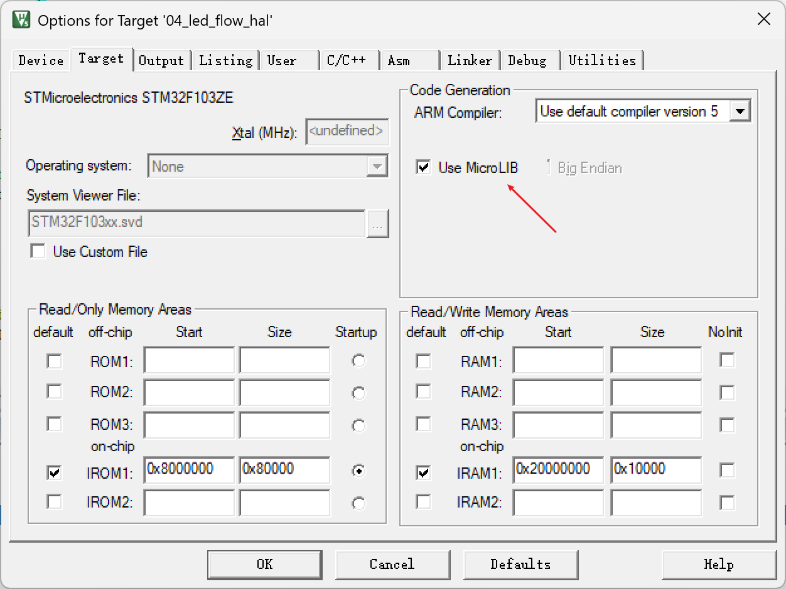  
这样我们就可以使用 printf 函数通过串口进行打印了：
```c
printf("Hello, World.");

// 可以正常打印变量值。printf 中就会将变量值替换占位符，再交给 fputc
int a = 100;
printf("a = %d", a);
```

HAL 库实现为：
```c
#include <stdio.h>
int fputc(int ch, FILE* file) {
    HAL_UART_Transmit(&huart1, (uint8_t)&ch, 1, 1000);
    return ch;
}
```

# IIC/I2C
简单的双向两线制总线协议标准（其中一根线是时钟线），支持同步串行半双工通讯。标准模式为100kb/s，快速模式为 400kb/s，高速模式3.4Mb/s，大多数设备不支持高速模式。
* SCL：串行时钟总线，用于数据收发同步。
* SDA：串行数据总线，用高低电平表示数据。

### 物理层
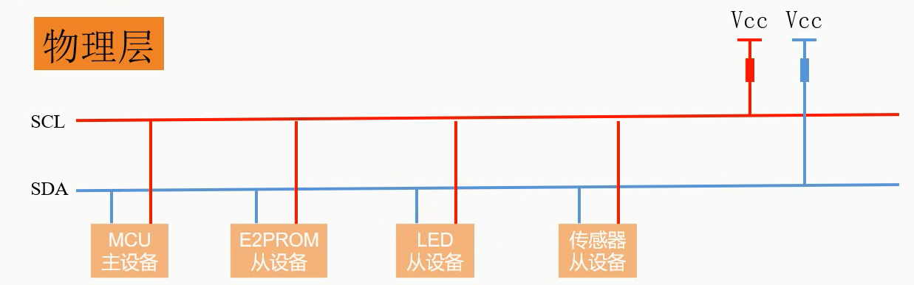  
* 每个设备都有唯一的地址，主设备通过这个地址和从设备通信。
* 总线通过上拉电阻接到电源，设备空闲时输出高阻态，当所有设备都空闲，都输出高阻态时，由上拉电阻把总线拉成高电平。当某个设备输出0时，电流会流向此设备。
* 输出模式使用开漏输出。

### 协议层

* 位传输：作为串行通信，是按照位进行传输，一般是高位先行。
* 起始信号：当 SCL 是高电平时，SDA 线从高电平向低电平切换。
* 停止信号：当 SCL 是高电平时，SDA 线从低电平向高电平切换。
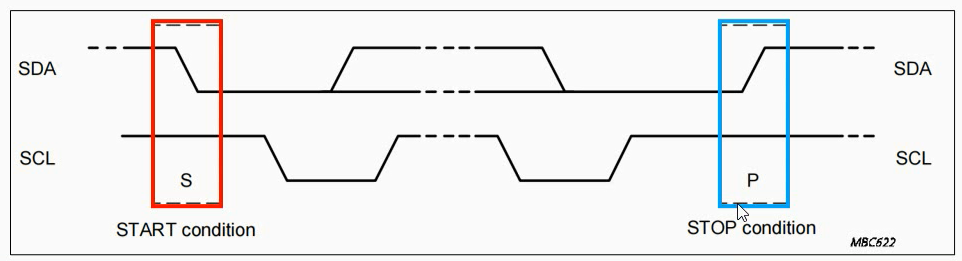  
* 传输地址：主机通过 SDA 信号线发送设备地址（SLAVE_ADDRESS）来查找从机。IIC 协议规定设备地址可以是7位或10位，实际中7位地址应用比较广泛。 
紧跟设备地址的一个数据位用来表示数据传输方向，它是数据方向位(R/W)，第8位或第11位。
数据方向位为“1”时表示主机由从机读数据，该位为“0”时表示主机向从机写数据。
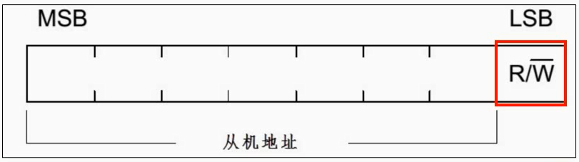  
* 数据有效性：SCL 为高电平时，会对 SDA 进行采样，此时 SDA 要保持电平的稳定性，从而得到数据。所以 SDA 只有在 SCL 为低电平时才能改变。
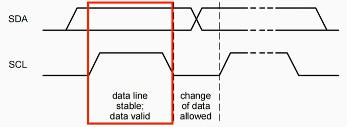  
* 响应：接收方接到数据后要给发送方响应，有2种响应。
1.应答响应。 给发送方一个低电平
2.非应答响应。 给发送方一个高电平
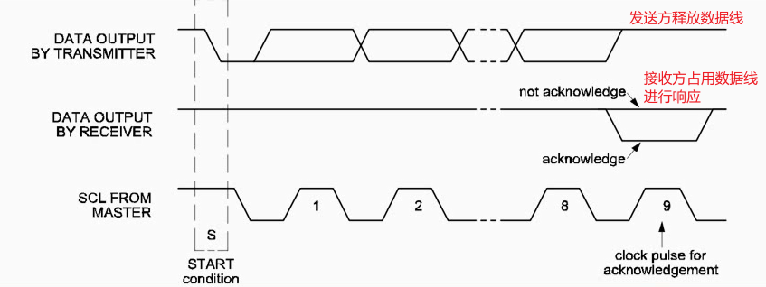  

#### EEPROM 相关：
* 写入一个字节：先通过设备地址通知接收数据的设备，再通过字节地址通知要写入的位置，最后传输要写入的数据。每次需要从设备进行应答：
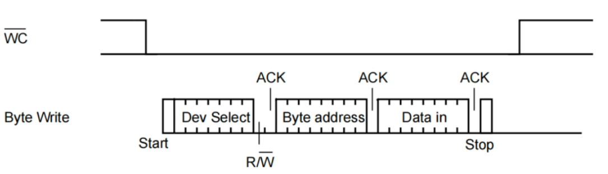  
* 读取一个字节：读取字节需要先用写入字节的方式，使用设备地址和字节地址确定要读取的位置（通过设置写入地址，从而设置读取地址，两个是想通的。又叫假写真读），再发送一个设备地址，并且把读写位设置为高电平读取，最后由从设备会发送数据，主设备不应答便结束本次传输：
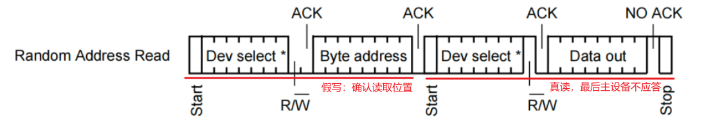  
* 写入多个字节：也叫页写入，与写入一个字节的区别是写入一个字节后，从设备响应ACK后不终止写入，继续写入即可，直到中止写入。实际上写入多个字节可以替代写入一个字节：
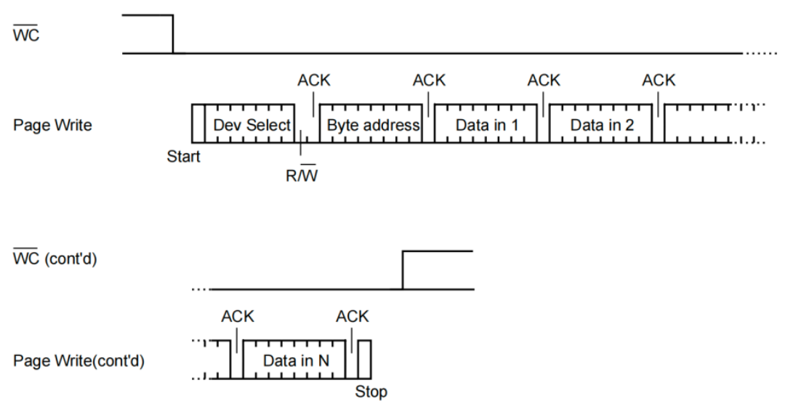  
* 读取多个字节：从设备发送数据后进行响应ACK即可，从设备就能继续发送字节，直到 NACK：
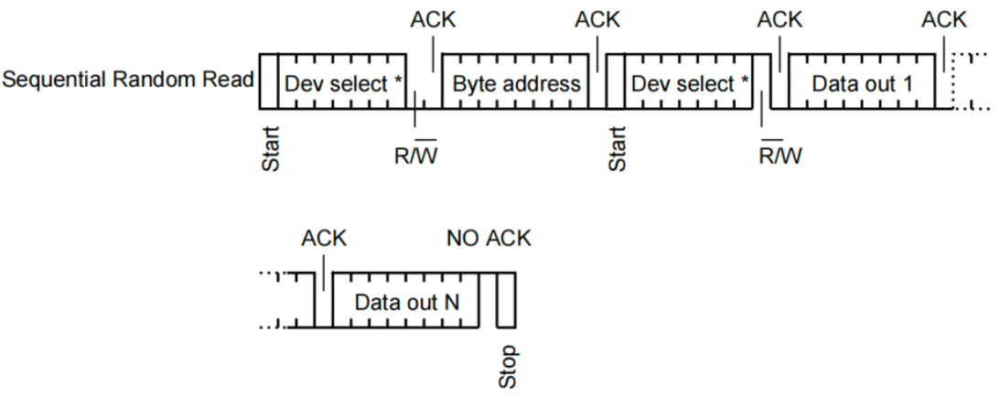  

**IIC 协议使用软件模拟方式（手动控制引脚高低频来模拟 IIC 信号），通常直接操作寄存器更简单。**

### 硬件电路实现
32芯片硬件上对IIC协议进行了支持，不需要我们通过不断的修改 SCL 和 SDA 来模拟实现，所以在开发上能简化不少。另外 SMBus2.0 协议和 IIC 很类似，所以一并实现了，通过配置可以切换此协议。
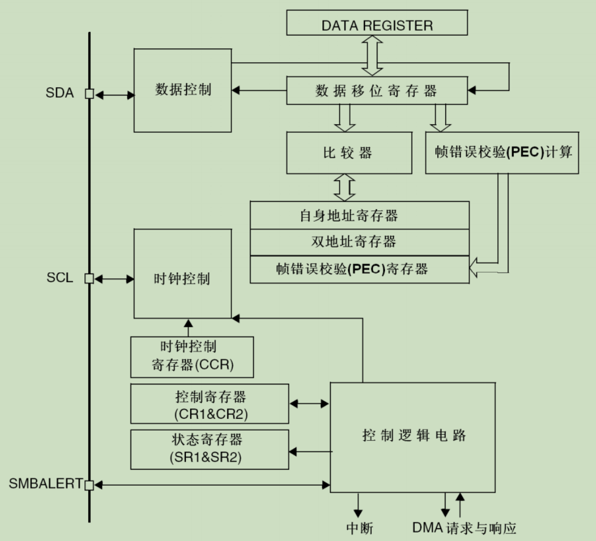  
数据控制电路用于控制数据的发送，不需要我们自己再去不断修改高低电平了。
* 发送数据时，DR 接收到数据会放入数据移位寄存器中并串转换后发送；接收数据时数据移位寄存器接收到数据会放入 DR 中，从 DR 中直接获取接收的数据。
* 帧错误校验计算类似奇偶校验的设备，不过校验算法更复杂。
* 比较器是用于比较设备地址，确定相连的设备。

时钟控制电路用于控制时钟的发送。
* 时钟控制寄存器会对时钟进行分频等操作。
* 控制寄存器可以配置是否接受应答等。
* 状态寄存器存储了是否应答等状态。

#### 寄存器
##### IIC 模式配置
```c
/* 3. 配置 I2C 外设 */
/* 3.0 选择I2C模式 i2c:0  smbus:1。默认就是0*/
I2C2->CR1 &= ~I2C_CR1_SMBUS;
/* 3.1 设置 I2C的时钟频率：36MHz （范围2-36）。一般配36就行，实际还达不到*/
I2C2->CR2 |= 36;
/* 3.2 设置I2C主模式：标准模式(0, 100kb/s)或快速模式(1, 400kb/s)  */
I2C2->CCR &= ~I2C_CCR_FS; // 设置为标准模式
/* 3.3 设置I2C的通讯速率为100KHz 通过计算为 180=5/(1/36)
        Thigh = CCR ×TPCLK1
        Thight = 5us
        Tpclk1 = 1/36us
        ccr = 5 * 36 = 180
    Thigh=tr(SCL)+tw(SCLH)，高电平时间=上升沿时间+保持高电平的时间
    Tlow=tf(SCL)+tw(SCLL)，低电平时间=下降沿时间+保持低电平的时间
简单的计算就是如果需要保持高电平5us，I2C的时钟频率是36MHz，5x36=180即可。
时钟频率是8MHz，就用5x8=40即可。
*/
I2C2->CCR |= 180;
/* 3.4 允许的 SCL 最大上升沿时间（从低电平变为高电平过程中消耗的时间）
        100KHz的时候要求最大上升沿不超过1us(手册)。
        时钟频率是36MHz则 写入：1 /（1/36） + 1 = 37
        其实就是计算的 最大上升沿时间/时钟周期 + 1
*/
I2C2->TRISE = 37;
```

##### IIC 使能
```c
/* 3.5 使能 I2C 外设 */
I2C2->CR1 |= I2C_CR1_PE;
```

##### IIC 发出开始和终止
```c
uint8_t I2C_Start(void)
{
    /* 产生起始条件。数据总线可能被占用，所以还需要判断总线是否空闲 */
    I2C2->CR1 |= I2C_CR1_START;

    // 用于超时判断，只循环 timeout 次，
    // 如果超时后起始条件还未发送成功，则返回0
    uint16_t timeout = 0xFFFF;
    /**
     * SB 为1时才说明数据总线空闲，起始条件发送成功。START 位会自动置零
     * 变为1后退出循环，并且 timeout 未变为0
     */
    while (!(I2C2->SR1 & I2C_SR1_SB) && timeout)
    {
        timeout--;
    }

    // 正常产生起始信号返回1，超时返回0
    return timeout ? 1 : 0;
}

/* 终止条件 */
void I2C_Stop(void)
{
    /**
     * 产生终止条件
     * 配置后不是立即生效，而是要等当前字节传输完成后自动生效
     */
    I2C2->CR1 |= I2C_CR1_STOP;
}
```

##### 应答和非应答信号
类似 stop，不是立即生效，在接收到一个字节后返回一个应答。
```c
/* 产生应答信号 */
void I2c_Ack(void)
{
    I2C2->CR1 |= I2C_CR1_ACK;
}

/* 产生非应答信号 */
void I2c_NAck(void)
{
    I2C2->CR1 &= ~I2C_CR1_ACK;
}
```

#### 发送设备地址
```c
// 主机发送设备地址，并等待应答
uint8_t I2C_SendAddr(uint8_t addr)
{
    // 直接将要发送的地址给到DR
    I2C2->DR = addr;

    // 等待应答
    uint16_t timeout = 0xffff;
    /**
     * @note SR1寄存器的ADDR位为1表示设备地址已经发送完毕
     */
    while ((I2C2->SR1 & I2C_SR1_ADDR) == 0 && timeout)
    {
        timeout--;
    }
    // 访问SR2，清除ADDR标志位
    if (timeout > 0)
    {
        I2C2->SR2; // 读取 SR1 后，读取SR2寄存器，硬件会清除ADDR标志位。上面已经读取了 SR1
    }

    return timeout ? OK : FAIL;
}
```

##### 收发数据
```c
    /* 发送数据前等待数据寄存器为空 */
    while (!(I2C2->SR1 & I2C_SR1_TXE) && timeout)
    {
        timeout--;
    }
    /* 为空后把数据写入到数据寄存器中 */
    I2C2->DR = byte;

    /**
     * 等待数据发送完成。判断 I2C_SR1_BTF: 1发送结束 0发送未结束
     * 变为1后退出循环，并且 timeout 未结束
     */
    timeout = 0xFFFF;
    while (!(I2C2->SR1 & I2C_SR1_BTF) && timeout)
    {
        timeout--;
    }
```

# 定时器
定时器分为系统定时器和外部定时器。（系统定时器是在内核上；外部定时器也集成在芯片中，只是没在内核上）
* 系统定时器即系统滴答定时器，位于32芯片内部，是每个芯片都有的定时器。
* 外部定时器分为基本定时器、通用定时器、高级定时器。主要在功能性上有所不同，一个比一个更强，所以根据需要选择合适的定时器。

### 系统滴答定时器
系统定时器（SysTick系统）是属于CM3内核，内嵌在NVIC中。系统定时器是一个24bit的向下递减的计数器，计数器每计数一次的时间为$1 / SYSCLK$，一般我们设置系统时钟SYSCLK（与AHB相同）等于72M，一次滴答就是$1 / 72M$秒，得到$1/72$微秒。当重装载数值寄存器的值递减到0的时候，系统定时器就产生一次中断，以此循环往复（恢复到设置的寄存器值，再一次开始递减）。所以在寄存器中设置初始值就能决定递减到0的时间，从而决定定时时间。
比如要定时10us，那么就是$720/72$得到10us，从而寄存器的值设置为720即可。

#### 寄存器
##### STK_CTRL
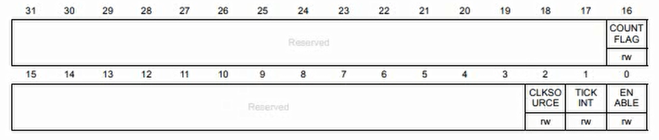  
控制和状态寄存器。高16位是状态（实际只用了一位），低16位是控制（实际只用了3位）。
* COUNT FLAG: 计数器减到0时，会置为1。
* CLK SOURCE: 配置时钟源。0是$AHB/8$；1是处理器时钟，即AHB。
* TICK INT: 中断使能位，0不开启中断；1开启中断。
* ENABLE: 计数器使能位，为1才开启计数器功能。

```c
// 1. 配置时钟源为内核时钟AHB。 CLIKSOURCE=1
SysTick->CTRL |= SysTick_CTRL_CLKSOURCE;
// 2. 中断使能。 1:使能中断
SysTick->CTRL |= SysTick_CTRL_TICKINT;
// 4. 使能计数器。 1：开启定时器  0：关闭定时器
SysTick->CTRL |= SysTick_CTRL_ENABLE;
```

##### STK_LOAD
用于配置计数器初始值的24位寄存器，从配置的值减到0就会产生一次中断。最大值为16M->16777216。
```c
    /*
       3. 计数器的重装载值
            需求：1ms产生一次中断
            72MHz的频率下，72000次计数正好是1ms
		   则需要把重装载值设置为72000 - 1（需要减1才行）
    */
    SysTick->LOAD = 72000 - 1;
```

##### STK_VAL
24位寄存器，用于读取当前计数器的值。

##### STK_CALIB
校准寄存器，基本上用不到。

### 基本定时器
基本定时器包含一个16位自动装载计数器，由各自的可编程预分频器驱动。基本定时器只能向上计数，由于没有外部IO，所以只能计时，不能对外部脉冲进行计数。
主要功能：定时中断，主模式触发DAC。

#### 功能框图
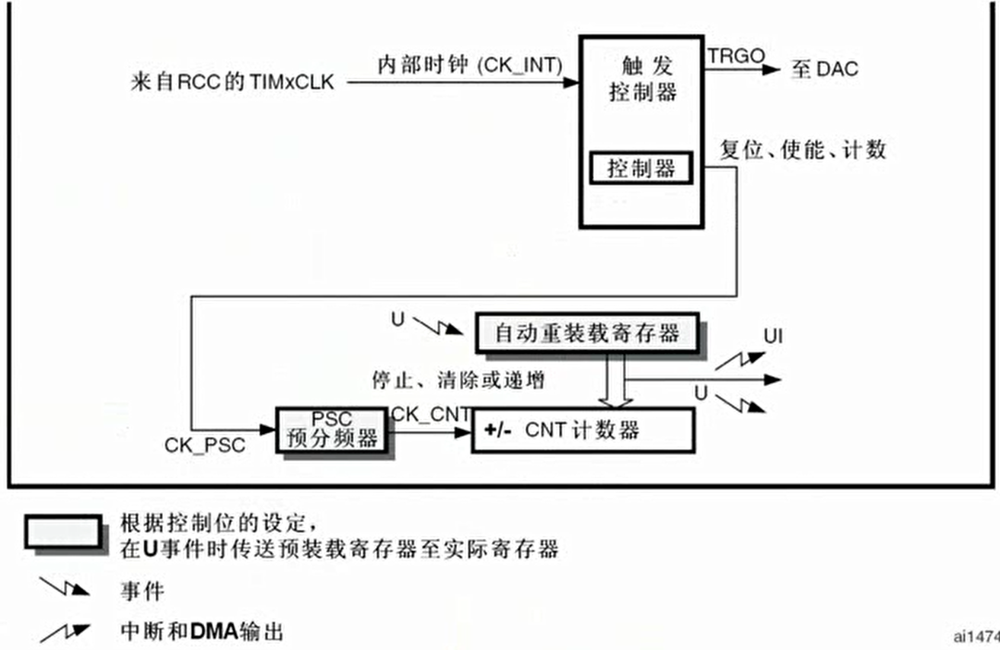  

* RCC 时钟源，只有一种时钟源——内部时钟，一般为72MHz。
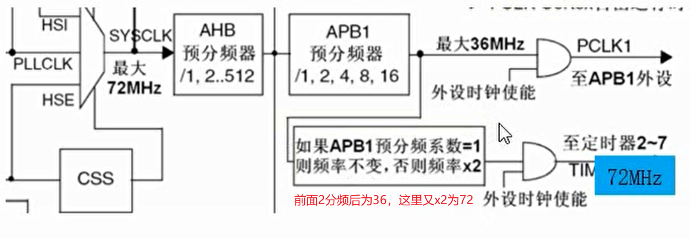  
* 触发控制器：通常用于触发其它外设的操作，使得不同的外设能够协同工作。比如触发 DAC 输出。
  TRGO（trigger out）输出触发信号，如输出给外设 DAC 信号等。
  基本定时器（控制器）只是把时钟信号传输给时基单元（下面部分）。
* PSC 预分频器：接收的时钟信号可能太高了（如72MHz），而计数器不需要这么高的信号，所以需要预分频。
* 计数器从0开始加，达到自动重装载寄存器的值时，**下一个时钟上升沿到来后**，计数器产生**溢出**，从0重新计数。并触发一个 UPDATE 更新事件，触发更新中断 UI（Update Interrupt）。
  所以想要计数10次产生中断，就应该给自动重装载寄存器赋值9。
  * 自动重装载寄存器实际包含两个寄存器：预加载寄存器和影子寄存器。写数据到自动重装载寄存器时先写到预加载寄存器，然后再更新到影子寄存器。计数器是否溢出是查看的影子寄存器的值。
  * 预加载寄存器可以开启或关闭。没有预加载时，写入的值会立即更新到影子寄存器。有预加载时，写入的值会等到产生更新事件(计数器溢出)才更新到影子寄存器。
  > 文档里的功能框图这类图中，寄存器下面有阴影的通常就表示这个寄存器还有个影子寄存器存在。当寄存器里的数据同步到影子寄存器时才生效。

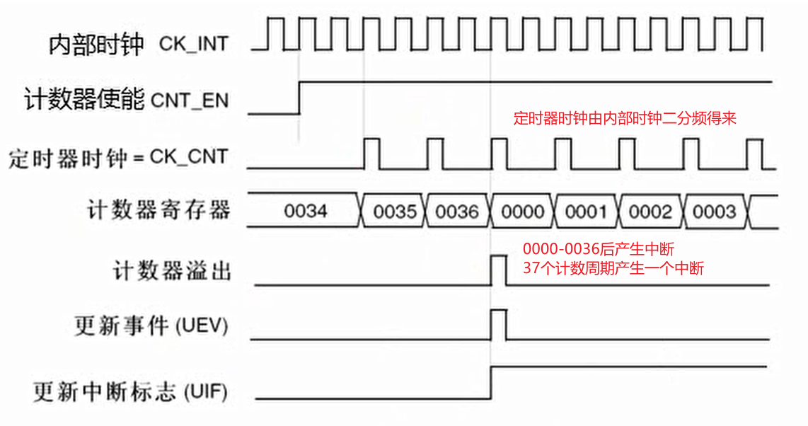  

#### 计算定时时间
1. 计数器的时钟频率是多少？
  预分频系数+1，表示真正的分频值。预分频系数是0，+1后为1，表示不分频；预分频系数是1，+1后是2，表示2分频；以此类推。
    
2. 计数器的周期是多少? 也就是累加一次需要的时间。
    
3. 计数器累加多少次产生一次更新事件？
    
4. 所以定时时间：
    
5. 假设定时1s，内部时钟频率为72MHz：
  方便计算：令预分频系数=7200-1，计数器频率=10000，则自动重装载值=10000-1

#### 寄存器
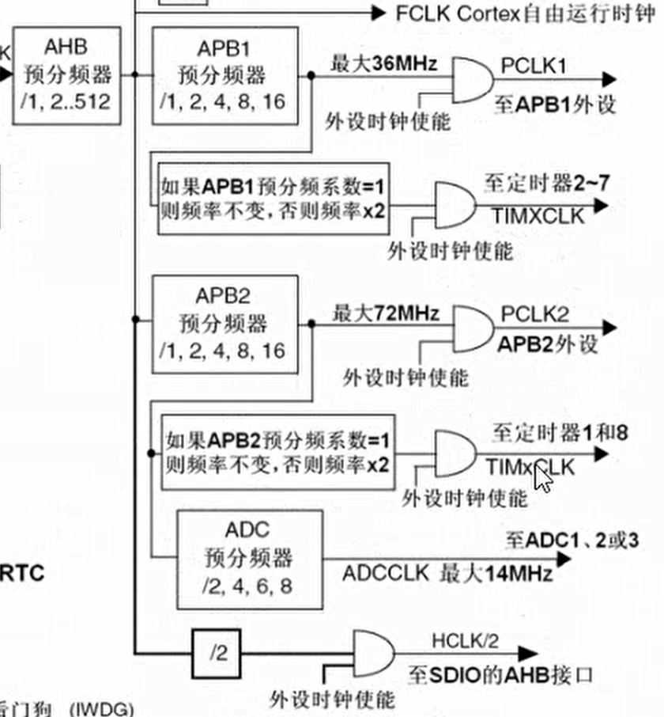  
通过查看时钟树来观察要设置哪个寄存器，比如 TIM6 就应该设置 APB1 对应的寄存器。
* 开启 TIM6 的时钟使能：
```c
    /* 1. 开启时钟 */
    RCC->APB1ENR |= RCC_APB1ENR_TIM6EN;
```
* 定时器是在芯片内部，所以不需要配置 GPIO, EXTI 这些东西。所以只需要对使用到的定时器自身进行相关配置就行了。
* 预分频和自动重装载寄存器配置：使用预分频的方式，将原始的72MHz进行分频，将72000个频率周期合并为1个变为1KHz，也就是1ms一次。这样分频后再交给后面的重装载寄存器，计1s就只需要设置为1000就行了。但是由于只有16位寄存器，无法存下72000，所以使用7200分频为10KHz，从而是100us一次，然后重装载寄存器的值设为10000也是1s中断一次。
  使用预分频的方式，就可以直接让中断是1s一次，而不是1ms一次由我们自己去计算1000次。
  * 预分频配置：
    ```c
        /* 2. 设置预分频值: 分频值7199表示7200分频。分频后频率10K，周期100us */
        TIM6->PSC = 7200 - 1;
    ```
  * 自动重装载寄存器配置：
    ```c
    /*3. 设置自动重转载寄存器的值，决定中断发生的频率。
         假设设置为9999，表示计数器计数10000次发生一次中断。
         计数一次100us，10000次1000000us，正好1s
    */
    TIM6->ARR = 9999;
    ```
  > **需要注意的是设置 PSC 时不会立即生效而是存储在缓冲区，当产生更新事件时才会写入生效，所以此时为不分频，就有72MHz的频率，从而对重装载寄存器的写入也会很快。定时器在程序初始化的时候执行到开启定时器的代码，就会立即开始计数，由于其计数很快，所以就会迅速的产生一次溢出中断。（尚硅谷STM32视频第111课23分钟有说）**
* 定时器更新中断使能：
```c
    /* 4. 使能定时器的更新中断（计数器溢出时产生中断） */
    TIM6->DIER |= TIM_DIER_UIE;
```
* 定时器使能：
```c
    /* 8. 使能计数器 */
    TIM6->CR1 |= TIM_CR1_CEN;
```
* 定时器更新中断标志位清零：当中断发生时，SR 寄存器中的 UIF 标志位会置为1，在中断程序中需要我们自己手动设置为0。
```c
    /* 务必清除中断标志位，否则会一直进入中断 */
    TIM6->SR &= ~TIM_SR_UIF;
```

### 通用定时器
通用定时器是使用最多的定时器，拥有基本定时器所有功能，并增加如下功能：
* 多种时钟源。从而可以使用外部信号来控制计数。
* 向上计数（加），向下计数（减），向上/向下（先加后减）。一般情况下都使用**向上计数**。
* 输入捕获。
* 输出比较。比如设定一个值，当计数器小于这个值时输出低电平，大于这个值时输出高电平，从而能输出一个方波信号。
* PWM生成。
* 支持针对定位的增量（正交）编码器和霍尔传感器电路。

#### 功能框图
功能框图相比基本定时器负责了很多，主要是增加了输入来源和捕获/比较寄存器的相关输出。
**捕获/比较寄存器在输入时用作捕获，在输出时用作比较。**
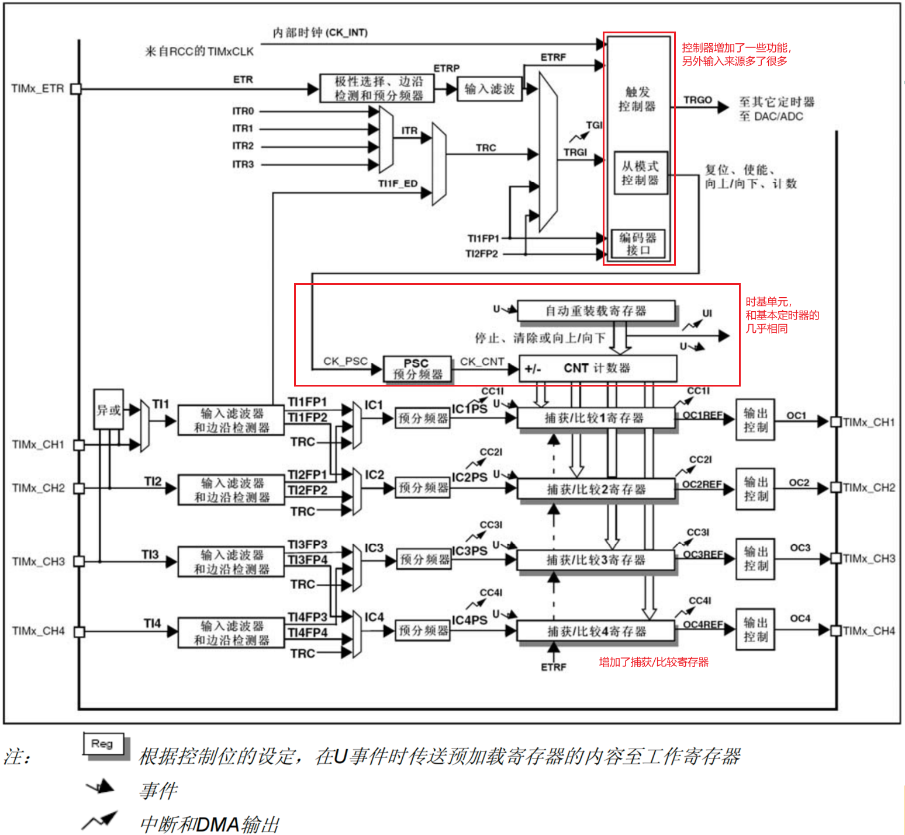  
##### 3种可选的时钟源
* 内部时钟模式，一般72MHz。与基本定时器一致。（默认时钟源就是内部时钟）
* 内部时钟级联模式：
  ITR0,ITR1,ITR2,ITR3 是内部的其它时钟信号作为时钟源进行输入，从而实现时钟的级联模式。
* 外部时钟源模式
  * 模式1：
    每个定时器有4个输入通道（TIMx_CH1,TIMx_CH2,TIMx_CH3,TIMx_CH4），其中通道1和通道2的信号可以作为时钟源（TIMx_CH1,TIMx_CH2）。
    图中 TIMx_CH1,TIMx_CH2 通道上的输入，通过输入滤波器和边沿检测器后输出 TI1FP1 和 TI2FP2，在时钟源那边的编码器接口旁作为了输入。
    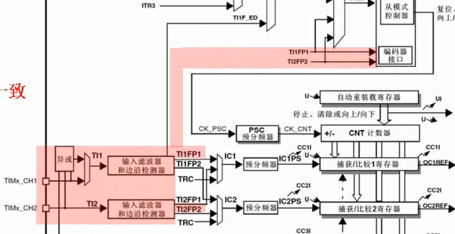  
  * 模式2：
    1. 使用定时器的特殊引脚 ETR（TIMx_ETR）的信号作为时钟源。
    2. 每个通用定时器都有一个 ETR 引脚，比如 TIM3 的 ETR 引脚是 PD2。
      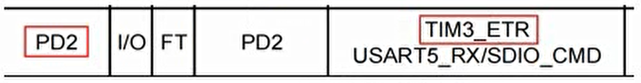  
    3. ETR 引脚引号经过极性选择，边缘检测，预分频器，输入滤波，得到信号 ETRF。

备注：
1. 外部时钟源一般用于定时器级联。
2. 大部分情况，内部时钟源足够使用。
3. 不配置时钟源的情况下，默认选择的就是内部时钟源。

#### 3种计数模式
* 向上计数模式：与基本定时器一样，都是从0开始加，一直加到自动重装载寄存器的值。然后再来一个时钟信号，计数器溢出，产生更新事件。重新从0开始计数。
  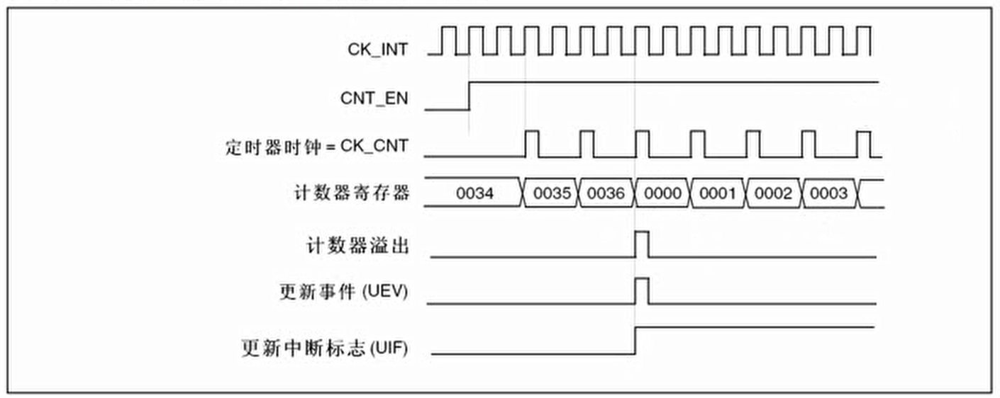  
* 向下计数模式：从自动重装载寄存器的值开始计数，直至减到0。然后再来一个时钟信号，计数器溢出，产生更新事件。重新从自动重载寄存器的值继续计数。
  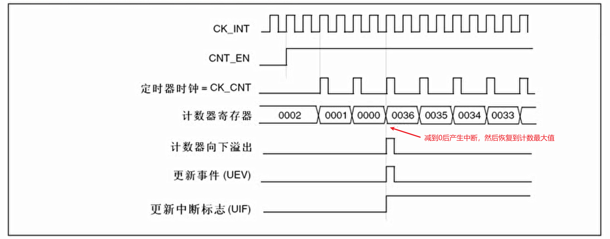  
* 中央对齐模式（向上和向下计数）：
  1. 从0开始向上计数，一直计数到 自动重装载寄存器的值 - 1。
  2. 再来一个时钟信号会产生更新事件，然后继续从自动重装载寄存器的值向下计数。
  3. 向下计数到1，再来一个时钟信号会产生更新事件，然后继续从0开始向上就计数。
  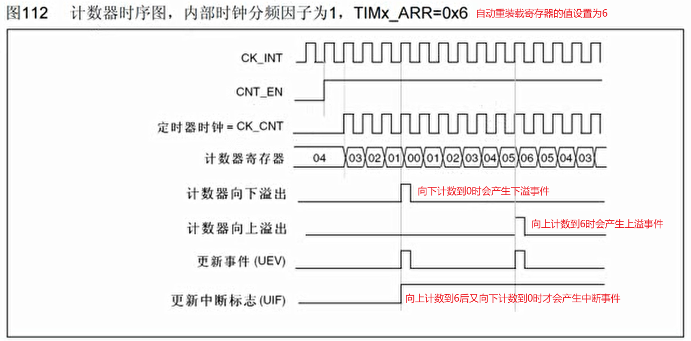  

备注：
1. 实际使用中，般向上计数是够我们使用了。
2. 默认计数方向就是向上计数。

### PWM
PWM（脉冲宽度调制 Pulse-width modulation）。是利用微处理器的**数字输出**来**对模拟电路进行控制**的一种非常有效的技术（不是数模转换）。PWM 的典型功能是输入捕获和输出比较。
数字信号只能输出0或1，所以要么是0V，要么是3.3V，如果需要控制一个灯到底多亮，那么就需要改变输出的电压值。PWM 就是用于此工作的。
#### 惯性
PWM 通常要求被控制的电路要有一定的“惯性”。所谓的“惯性”是指，电路中负载的状态不会发生突变，比如电机断电了也不会立即停止。
PWM 输出的方波本来就是一会儿高电平一会儿低电平的，在低电平的时候实际上就是没有电的，但是电机却会因为惯性而继续转动。而 LED 灯是人的视觉有惯性，不同的开关速度让人看来就是不同的亮度。
#### 面积等效原理
电压和时间不同的两组输入，如果它们的电压与时间的乘积相等（面积相等），那么输出波形基本相同。
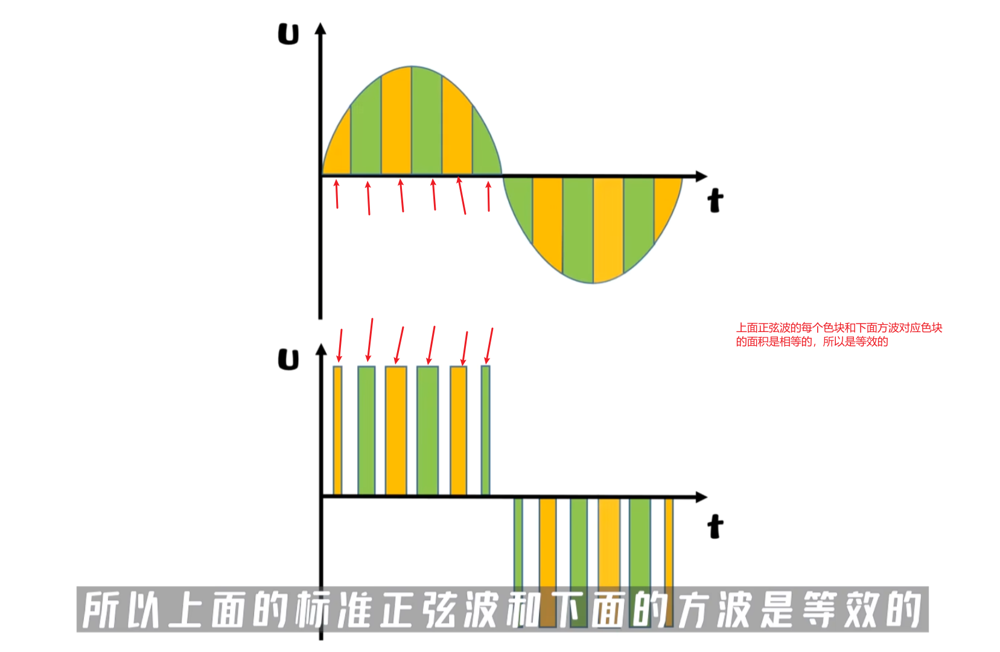  
#### 占空比
一个脉冲周期内高电平保持的时间与该 PWM 时钟周期的比值。
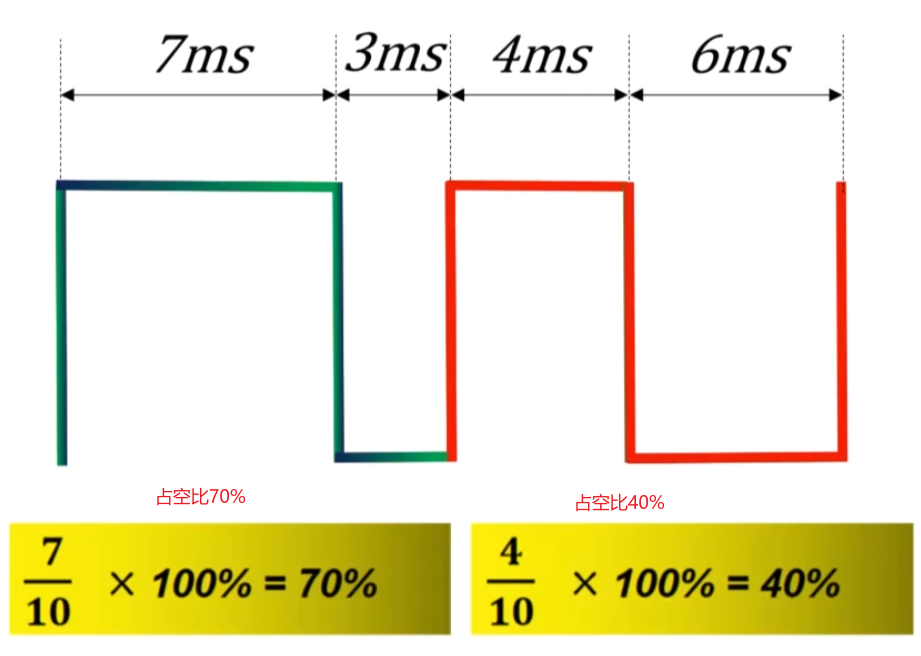  
占空比的计算：
$输出=输入×占空比$。
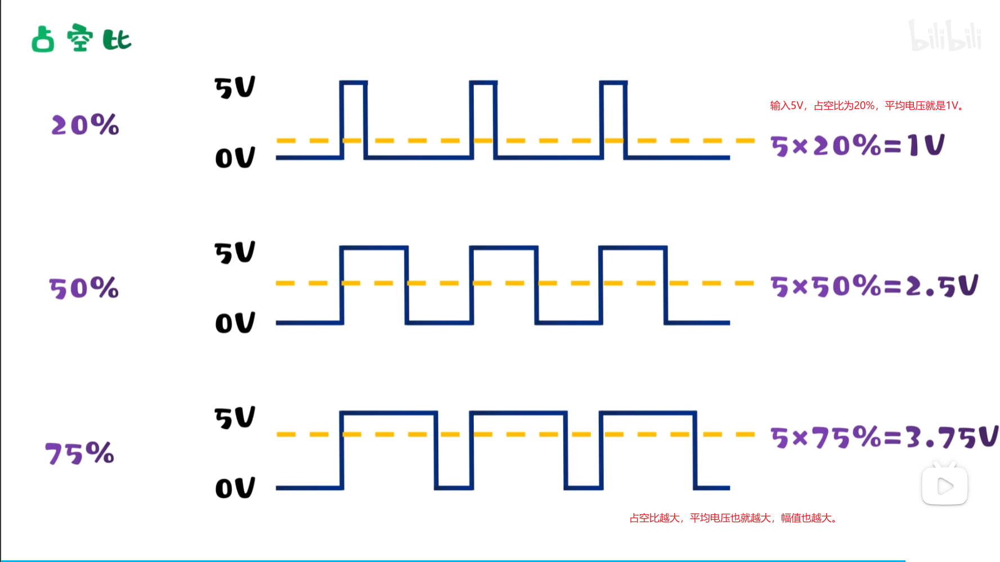  
不断改变占空比，就能让正弦波不断的变化，从而实现呼吸灯、电机转速变化的效果。

所以，在在使用PWM驱动惯性电器时，一般不改变频率和周期，通过更改占空比达到对外输出的有效电压的值。

#### 输出比较
设定的只和计数器进行比较，控制输出方波。大多用于输出 PWM 波形，能方便的控制占空比。也可以输出其它波形，但只能是方波。

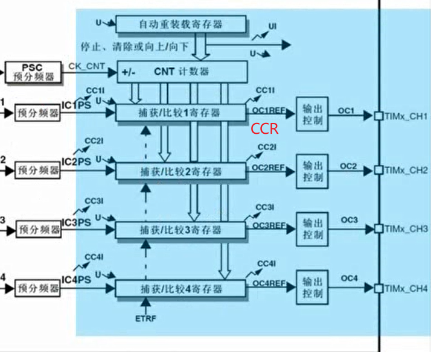  
图中便是输出比较部分，其中包含3部分内容：
* 计数器部分。
* 捕获/比较寄存器（CCR）：每个定时器有4个，可以实现4路比较。
* 输出部分：4路输出，从更上面的完整时钟框图中，可以看出每一路的输入和输出都是用的同一个引脚，所以如果要输入输出同时使用，就需要设置为输出模式（输出模式下也能进行输入）

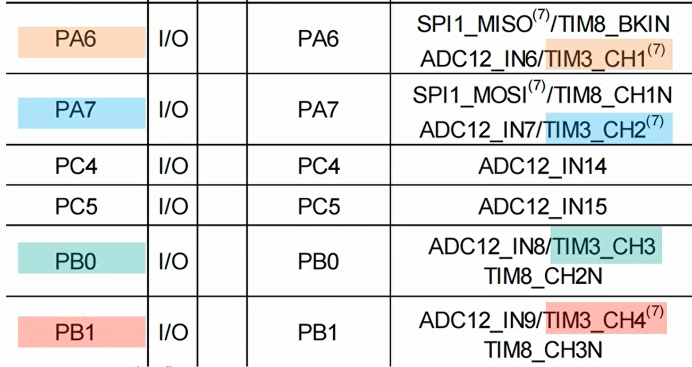  
从手册中也能看出，一个 TIM3 定时器有 CH1-4 4个通道，各自占了一个引脚。

#### 输出比较原理
以通道1为例：
1. 假设计数器向上计数，重装载寄存器的值为99。
2. 假设捕获/比较寄存器的值我们设置为60（也就是比较的基数）。

**核心思想**
比较寄存器的值和计数器的值进行大小比较，根据比较结果(>=<)不同，产生不同输出：高电平或低电平。

#### 输出比较的8种模式
由捕获/比较模式寄存器（如CCMR1）的 OC1M[2:0]，共3位来控制。
假设计数器的值是 CNT，比较寄存器1的值是 CCR=60。
* OC1M[2:0]=000：输出冻结。CNT 和 CCR 比较结果不影响输出。
* OC1M[2:0]=001：强制输出高电平。一旦 CNT=CCR，强制输出高电平，再不改变。
* OC1M[2:0]=010：强制输出低电平。一旦 CNT=CCR，强制输出低电平，再不改变。
* OC1M[2:0]=011：输出翻转。一旦 CNT=CCR，则翻转输出。高->低，低->高。
  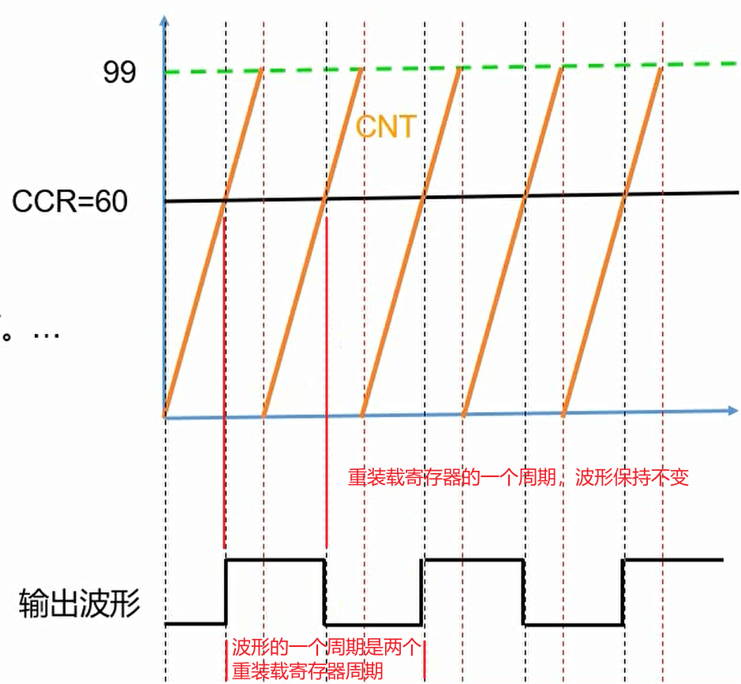  
  输出结果是一个方波：频率为计数器的溢出频率的一半，占空比为50%。
  通过调整 CCR 的值，可以使波形前后挪动，实现调整相位的功能。
* OC1M[2:0]=100：强制输出低电平。
* OC1M[2:0]=101：强制输出高电平。
* OC1M[2:0]=110：PWM 模式1。CNT < CCR 输出高电平，CNT >= CCR 输出低电平。（用的最多，计算方便）
  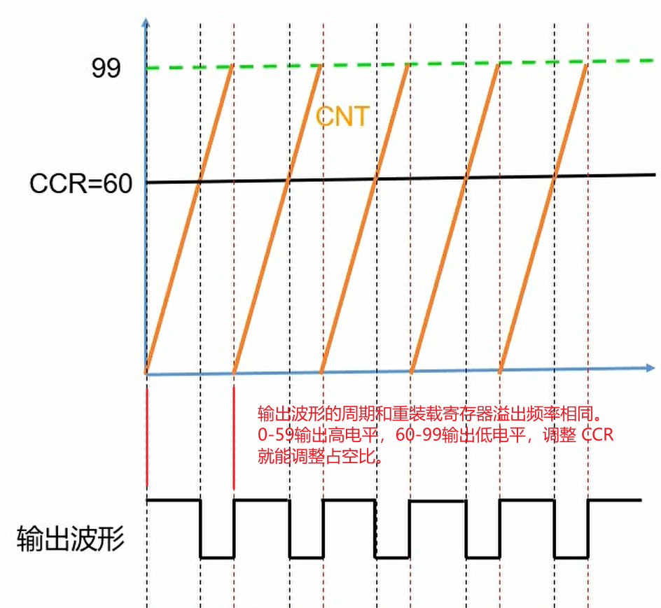  
  波形占空比：$\frac{CCR}{重装载寄存器值+1}=\frac{60}{99+1}=60\%$
* OC1M[2:0]=111：PWM 模式2.CNT < CCR 输出低电平，CNT >= CCR 输出高电平。和 PWM 模式1相反。
  波形占空比：$\frac{重装载寄存器值+1-CCR}{重装载寄存器值+1}=\frac{99+1-60}{99+1}=40\%$

#### 寄存器
##### 计数器计数方向
```c
    /* 5. 计数器计数方向: 0:向上计数 1:向下计数 */
    TIM5->CR1 &= ~TIM_CR1_DIR; // 这里是0
```
##### 配置通道方向
```c
    /* 6. CH2通道配置为输出 00表示输出 */
    TIM5->CCMR1 &= ~TIM_CCMR1_CC2S; // 这里是00
```
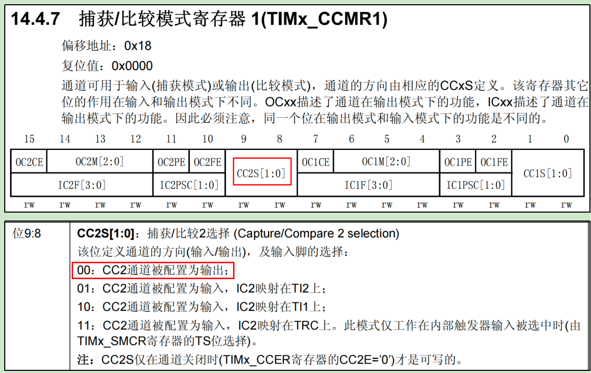  
这个寄存器即支持输入也支持输出，并且功能很多，所以配置相对复杂。上面一行都是 OCxxx，表示输出模式下的配置定义；下面一行都是 ICxxx，表示输入模式下的配置定义。
##### 配置输出比较模式
配置 OC2M（通道2所以是OC2M）的3位为110：
```c
    /* 7. 配置CH2的输出比较模式（8种模式，选择PWM1模式）为110 */
    TIM5->CCMR1 |= TIM_CCMR1_OC2M_2;
    TIM5->CCMR1 |= TIM_CCMR1_OC2M_1;
    TIM5->CCMR1 &= ~TIM_CCMR1_OC2M_0;
```
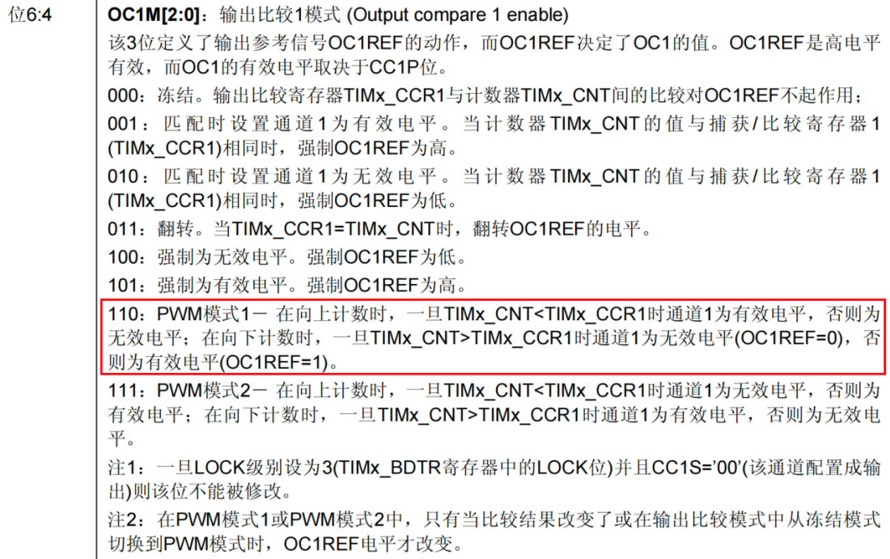  
##### 配置比较值
```c
    /* 8. 给CH2的CCR2寄存器设置比较值。比如设置为50，重装载计数器的值是100，占空比就是50% */
    TIM5->CCR2 = 50;
```
要实现呼吸灯效果，实际上是要不断的修改这个值，才能让占空比不断的变化，从而让亮度变化。
##### 配置通道极性和使能
```c
    /* 9. 设置CH2通道的极性： 0高电平有效 or 1低电平有效 */
    TIM5->CCER &= ~TIM_CCER_CC2P;
    /* 10. 使能CH2通道 0: 关闭 1：开启*/
    TIM5->CCER |= TIM_CCER_CC2E;
```
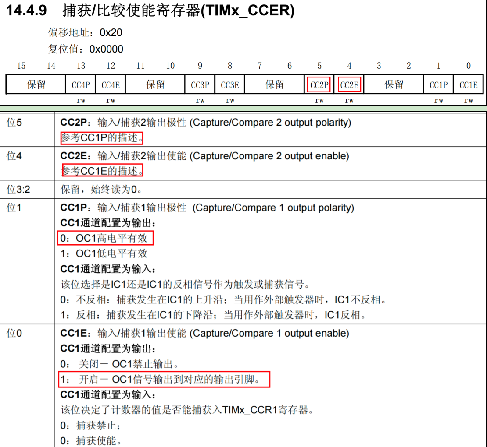  
极性的高电平有效/低电平有效，是指在PWM模式下输出什么样的电平才是有效的：
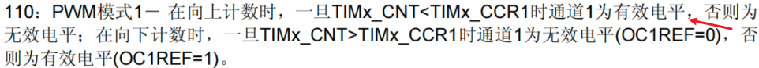  

#### 注意事项
PWM 的原理就是让设备运行一会儿停一会儿，不断循环这个步骤，然后改变运行和停止的时间比来进行控制。所以需要注意的是，如果停止时间太长，那么惯性可能就会越来越小直到消失，就达不到想要的效果了。
比如 LED 灯亮10us灭10us，占空比为50%，我们看到的是一个亮度一半的LED灯一直亮着。如果是亮1s灭1s，虽然占空比也是50%，但是我们看到的是LED等全亮1s，灭1s的效果了。
所以通常 PWM 的输出频率需要足够高，才能实现需求。

### 通用定时器输入捕获
此功能可以捕获输入通道上信号的上升沿或下降沿。
多用于测量PWM的周期/频率，只要测量出连续的两个上升沿或连续的两个下降沿的时间间隔。也可以测量占空比，只要测量出连续的一个上升沿和一个下降沿的时间间隔，然后除以周期即可
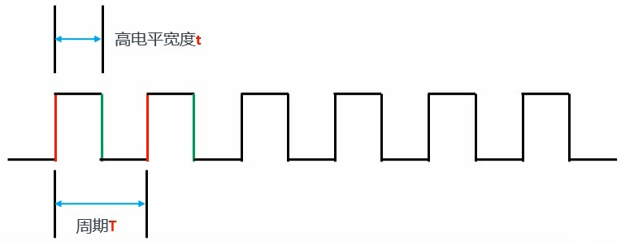  
#### 输入捕获部分：
包含3部分：
* 输入部分：共4路输入信号每路都有自己的输入引脚，注意4路输入引脚和4路的输出比较的引脚是一致的。对同一路引脚，只能处于输入捕获或输出比较。
  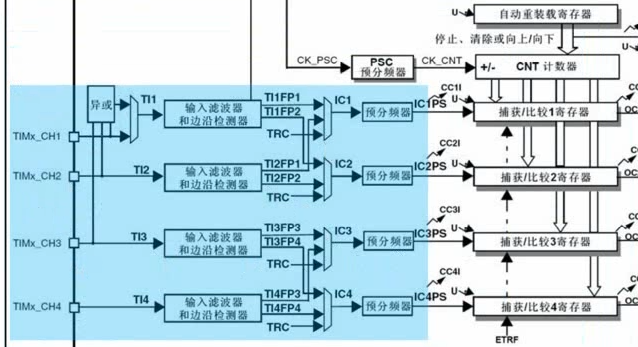  
* 计数器部分：
  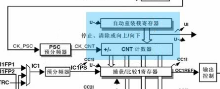  
* 捕获寄存器部分（CCR）：捕获/比较寄存器在输出时用作比较，在输入时用作捕获。
#### 输入捕获原理
以通道1为例：
假设计数器向上计数，重装载寄存器的值为65535（尽量避免计数器溢出，能检测完一个周期）。
1. 信号经过通道1的引脚进入通道1，得到 TI1。
2. TI1 信号进入滤波器和边沿检测器。
  * 滤波器用来滤掉一些毛刺信号，信号质量好可以不滤波。
  * 边沿检测器确定要捕获上升沿还是下降沿。（CCER 中的 CCxP 极性选择，就是配置捕获上升沿还是下降沿）
3. 从边沿检测器出来的上升沿或下降沿信号为 TI1FP1。
4. T1FP1 经过信号选择器得到 IC1。
5. IC1 进入预分频器，可以对信号选择分频或不分频。如果捕获的频率很高，可以分频。（频率要低于计数器的频率一两个数量级，计数器才能记得更精准）
6. 信号从预分频器出来，信号为 IC1PS。
    * 会产生一个捕获事件（上升沿/下降沿事件），然后获取计数器的值。
    * 如果开启了中断也会产生捕获比较中断。
    * 立即把计数器寄存器的值存入到捕获寄存器中。在下次捕获事件产生之前，捕获寄存器的值不会发生变化。

输入滤波器和边沿检测器后，CH1和CH2有交叉连接，CH3和CH4有交叉连接，主要用于计算占空比等功能。
#### 测量PWM周期原理
为了方便处理：不滤波；捕获上升沿；不分频。
1. 假设对计数器时钟72分频(主要是保证计数频率够快的情况下方便计算)，则计数器时钟频率为1MHz，计数器累加一次的时间为1us。
2. 设置定时器自动重装载寄存器的值为65535。把这个值设置为最大，尽量避免溢出。
  为了在重装载寄存器不溢出的情况下，能测量一个完整的信号周期，测量的信号周期就应该小于65535us即频率大于16Hz。
    1. 在一个周期内，计数器不会溢出。
    2. 当第1个上升沿到来时，重置计数器的值(让计数器从0开始计数)
    3. 当第2个上升沿到来时,计数器的值会自动copy到捕获寄存器，读出捕获寄存器的值，这个值就表示信号的周期。单位us。
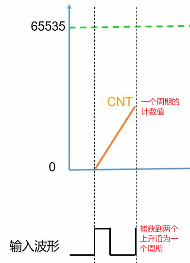  
##### 特殊情况的测量：
如果测量频率超过1MHz（超过计数器的时钟频率）
1. 第2个上升沿到了之后，计数器还没有完成一次累加，则无法测量。
2. 可以考虑测试第1个上升沿和第n个上升沿的间隔。这种一般用来测量高频信号，频率超过了计数器的时钟频率。
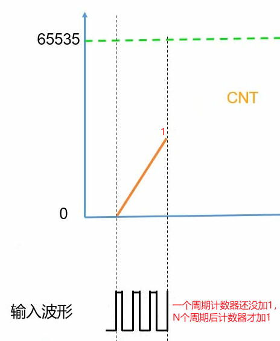  
上图中的情况就可以测量100个周期，假如计数器加到了20，那么一个周期就是20/100个计数器。不过此时准确率就下降了。

如果测量的频率很低，那么就需要提高计数器的分频值从而降低计数器的频率，否则计数器计数过快，65535都记完了，测量的频率一个周期还没走完，这也会有问题。
另一种方案是，计数器溢出后计算溢出次数，然后测到一个完整的周期后，溢出的次数×每次计数+最后未溢出那次的计数，也能得到一个周期的计数。
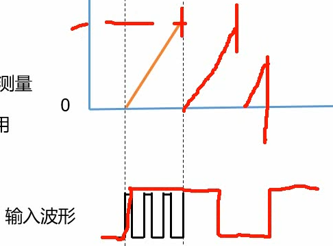  

##### 寄存器
* 输入通道滤波器设置：
```c
    /* 配置CH1的输入滤波器，可以过滤掉一些干扰信号。我们不滤波IC1F=0000 */
    TIM4->CCMR1 &= ~TIM_CCMR1_IC1F;
```
* 通道输入信号边缘检测和捕获使能
```c
    /* 设置边沿检测器 0上升沿  1下降沿*/
TIM4->CCER &= ~TIM_CCER_CC1P;
    /* 使能CH1通道捕获使能 0: 关闭 1：开启*/
    TIM4->CCER |= TIM_CCER_CC1E;
```
* 捕获比较中断
```c
    /* 开启TIM4的捕获比较中断，在中断服务函数中对捕获到的上升沿进行处理 */
    TIM4->DIER |= TIM_DIER_CC1IE;
```

#### 测量占空比原理
捕获上升沿或下降沿，只能测量周期。我们无法通过动态修改捕获方式来动态修改捕获上升沿和下降沿。那么，此时就需要通过 交叉输入的捕获 和 从模式控制器 来测量计算占空比了。

##### 定时器触发信号
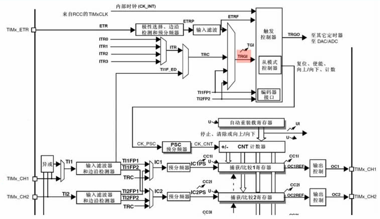  

**定时器的触发信号分两大类**
1. 触发输入信号(TRGI) trigger out
  从外部过来(也可能是自己输入通道过来)到本定时器的信号。
  用来控制本定时器一些动作，比如复位（计数器清零）、使能、计数等。（通过信号就能控制复位、使能等，比如让后面的PSC预分频器一会儿开一会儿关，而不需要软件控制）
  这个时候，本定时器就处于主从模式中的**从模式**。
2. 触发输出信号(TRGO) trigger in
  是本定时器输出到其他定时器或其他外设的信号。
  用于与其他定时器的级联(触发其他定时器的一些工作)或触发一些其他外设工作。
  这个时候本定时器就是主从模式中的**主模式**。

本触发控制器的 TRGO 接到其它定时器的 TRGI，那么本定时器就是主，另一个定时器就是从。

##### 触发输入信号
TRGI 前通过一个多路选择器来选择要接受的输入信号，通过从模式控制寄存器 SMCR 的 TS[2:0] 这3位进行配置。共8个来源可分为4类：
000:内部触发0(ITRO)，TIM1
001:内部触发1(ITR1)，TIM2
010:内部触发2(ITR2)，TIM3
011:内部触发3(ITR3)，TIM4
100:T11的边沿检测器(TI1F_ED)
101:滤波后的定时器输入1(TI1FP1)110:滤波后的定时器输入2(TI2FP2)
111:外部触发输入(ETRF)
1. TS[2:0]=000-011 共4个。来源于32内部的其它定时器的 TRGO 信号。内部连接时定死的，不能更改。比如TIM1的TRGO连接到了TIM2的ITRO。如本芯片的内部连接配置表：
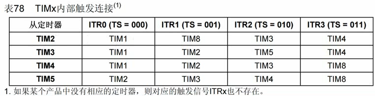  
如果当前是 TIM3，要使用 TIM2，则配置 TS 为001。注意自己是不能触发自己的。
2. TS[2:0]=111 共1个。来源于外部触发脚 ETR。经过极性选择，边沿检测和预分频器，输入滤波器，成为 TRGI 信号。
3. TS[2:0]=100 共1个。来源于定时器自身的**通道1**信号（其它通道没这个功能）。经过输入滤波器和边缘检测器，得到 TI1F_ED 信号。**上升沿和下降沿**都会产生 TI1F_ED 信号。经过信号选择器最终成为 TRGI 信号。
4. TS[2:0]=101/110 共2个。来源于定时器自身的通道1信号或通道2信号。经过输入滤波器和边沿检测器得到 TI1FP1 和 TI2FP2 信号。他们是上升沿或下降沿，只能选择一种。（教程中使用此模式）

##### 定时器从模式
TRGI 信号要控制定时器，必须把定时器配置为从模式。从模式控制寄存器(TIMx_SMCR)的 SMS[2:0] 位用来配置从模式工作模式。
**SMS[2:0]：从模式选择(Slave mode selection)**
当选择了外部信号，触发信号(TRGI)的有效边沿与选中的外部输入极性相关(见输入控制寄存器和控制寄存器的说明)
000:关闭从模式-如果CEN=1，则预分频器直接由内部时钟驱动。（默认值）
001:编码器模式1-根据TI1FP1的电平，计数器在TI2FP2的边沿向上/下计数。
010:编码器模式2-根据TI2FP2的电平，计数器在TI1FP1的边沿向上/下计数。
011:编码器模式3-根据另一个信号的输入电平，计数器在T1FP1和TI2FP2的边沿向上/下计数。
100:复位模式-选中的触发输入(TRGI)的上升沿重新初始化计数器，并且产生一个更新寄存器的信号。
101:门控模式 -当触发输入(TRGI)为高时，计数器的时钟开启。一旦触发输入变为低，则计数器停止(但不复位)。计数器的启动和停止都是受控的。
110:触发模式-计数器在触发输入TRGI的上升沿启动(但不复位)，只有计数器的启动是受控的。
111:外部时钟模式1-选中的触发输入(TRGI)的上升沿驱动计数器
1. SMS[2:0]=000，关闭从模式，默认值
2. SMS[2:0]= 001/010/011编码器模式，目前还用不到,暂不讨论。
3. SMSI2:01= 100，复位模式。触发输入的上升沿会重新初始化计数器(让计数器重新从0开始计数)这样就不需要手动清0计数器也不需要去数上升沿的个数，从而可以硬件自动完成测量。（常用）
4. SMS[2:0]= 101，门控模式。 TRGI 上升沿启动计数器，下降沿停止计数器。
5. SMS[2:0]= 110，触发模式。 TRGI 上升沿启动计数器。但是不会停止计数器。
6. SMS[2:0]= 111，外部时钟模式1。（只有这一种才是使用的外部时钟源）

#### PWM 输入模式
该模式是输入捕获模式的一个特例，操作与输入捕获模式相同。
以信号从通道1输入为例：
1. 经过输入滤波器和边沿检测器得到2路信号 TI1FP1 和 T1FP2。
2. TI1FP1 和 TI1FP2 极性相反，一个得到输入的上升沿(TI1FP1)，一个得到输入的下降沿(TI1FP2)。
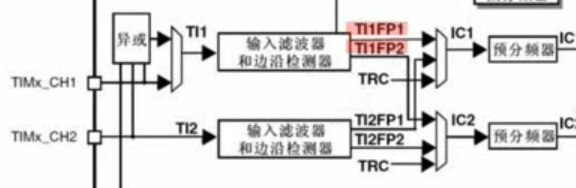  
3. TI1FP1 得到 IC1 信号，在通道1，用来测量周期；TI1FP2 得到 IC2 信号，在通道2，用来测量高电平时间。
4. TI1FP1作为触发输入信号，开启从模式中的复位模式。每次检测到上升沿执行复位操作，把 CNT 清零。（由其它时钟源来控制本时钟何时复位、开关、计数等，是从模式）
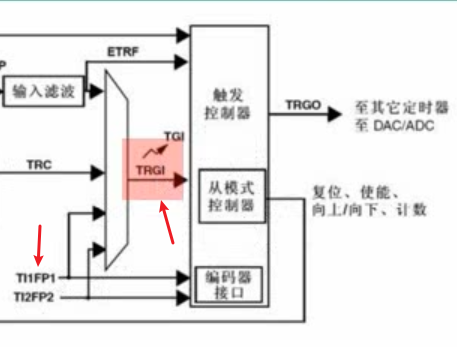  

##### 计算方式
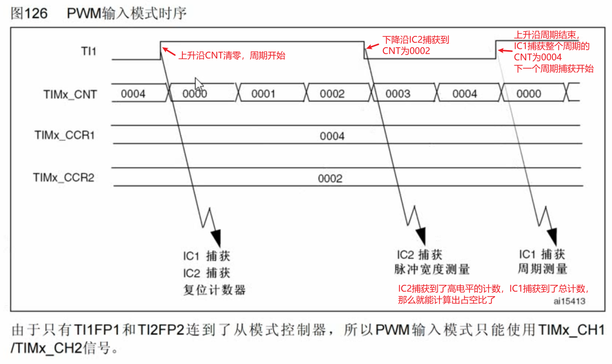  
1. 当上升沿到，通道1捕获、通道2捕获、从模式复位计数器
2. 当下降沿到，通道2捕获。CCR2存储的就是高电平宽度
3. 当上升沿到，通道1捕获。CCR1存储的就是周期。从模式会复位计数器

##### 寄存器
1. 配置通道为输入并映射正确通道。配置 TIMx_CCMR1 寄存器
```c
    /* CH1通道配置为输入，并IC1映射到TI1上：CCMR1_CC1S=01 */
    TIM4->CCMR1 &= ~TIM_CCMR1_CC1S_1; // CC1S
    TIM4->CCMR1 |= TIM_CCMR1_CC1S_0;

    /* 把IC2映射到TI1上： CCMR1_CC2S=10*/
    TIM4->CCMR1 |= TIM_CCMR1_CC2S_1; // CC2S
    TIM4->CCMR1 &= ~TIM_CCMR1_CC2S_0;
```
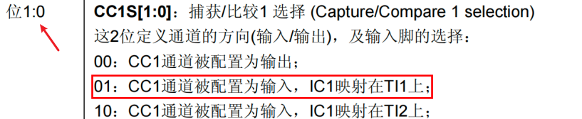  
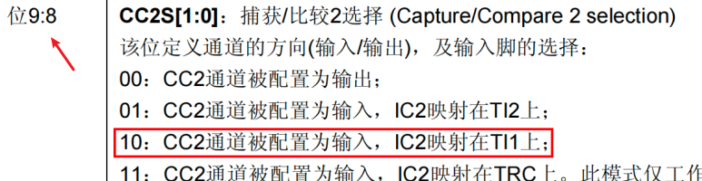  
2. 配置从模式控制器。TIMx_SMCR 的 TS 位和 SMS 位。
```c
    /* 11. 必须配置从模式控制器为复位模式 SMS=100， 触发输入信号为：TI1FP1 TS=101*/
    TIM4->SMCR |= TIM_SMCR_TS_2;
    TIM4->SMCR &= ~TIM_SMCR_TS_1;
    TIM4->SMCR |= TIM_SMCR_TS_0;

    TIM4->SMCR |= TIM_SMCR_SMS_2;
    TIM4->SMCR &= ~(TIM_SMCR_SMS_1 | TIM_SMCR_SMS_0);
```
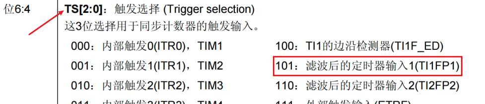  
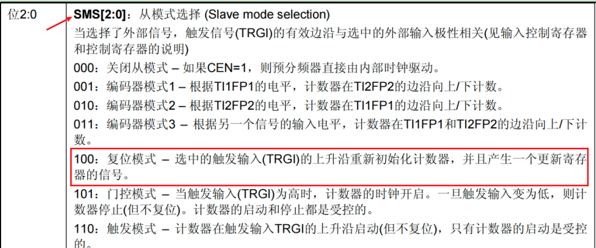  

# ADC 模数转换
将模拟信号转换为数字信号，同时还有个相反的叫 DAC，将数字信号转换为模拟信号。

### 工作原理
1. 采样阶段：ADC首先对模拟信号进行采样，即在一定时间内获取信号的**瞬时值**。模拟信号是连续的，而数字信号是不连续（离散）的，所以就要对模拟信号进行每隔一定时间的采样。需要注意的是，模拟信号的值也是连续的，对采样的值也不可能无限细分，所以采样值也是离散的，一定范围内的模拟信号值可能都是对应一个数字信号值。
2. 量化阶段：采样后的模拟信号通过量化器，将其转换为相应的**数字**形式。这个数字形式通常是二进制代码。

### 主要参数
* 参考电压：ADC使用参考电压来确定模拟信号的幅度范围。通常，ADC需要一个已知的电压作为参考，以便将模拟电压映射到数字代码。
* 通道数：表示ADC能够同时处理的模拟输入通道的数量。多通道ADC可以同时转换多个信号。
* 采样率：表示ADC每秒可以进行多少次采样。采样率越高，ADC能够捕获更高频率的信号。
* 分辨率：表示ADC可以将模拟信号分成多少个离散级别。比如0-3.3v分成1000份，精度就是3.3/1000，也就是分辨率。所以分辨率与二进制的位数有关，一般有10位、12位、16位等。例如，12位ADC具有$2^{12}$即4096个离散级别。
* 转换时间：表示ADC从开始转换到完成转换所需的时间。转换时间通常由ADC的时钟频率和分辨率决定。

### 常见类型
* 逐次逼近型：这是最常见的ADC类型之一，通过逼近法逼近模拟信号的大小。比如接收到了一个未知伏数的电压，就用自己的电压值列表使用二分法等方式去试是否相等，相等后就得到了接收到的电压的值。STM32中的ADC通常采用这种类型。
* Sigma-Delta 型：通过比较信号的累积值和一个参考值，产生一个高精度的输出。速度慢。
* Flash 型：通过一组比较器和编码器，以高速并行方式进行转换，适用于高速应用。精度低。

### 功能框图
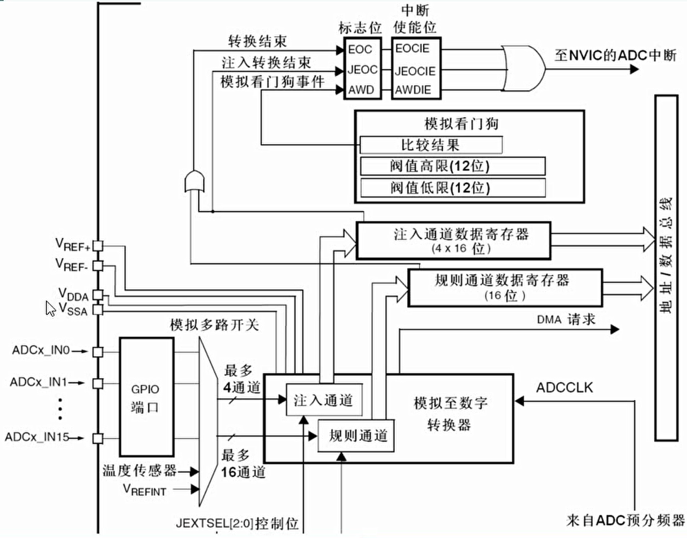  
* VDDA 模拟电源正
* VSSA 模拟电源负
* VREF+ 模拟参考电压正
* VREF- 模拟参考电压负

在实际电路设计中一般 VREF+ 和 VDDA 接3.3V，一般 VREF- 和 VSSA 接地，所以，ADC的测量范围是0-3.3V。
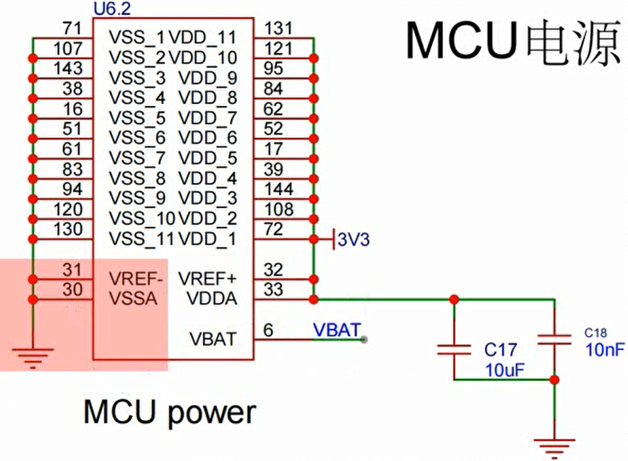  

#### 输入通道
用来输入模拟电压的通道，一共多达18个通道。
16个外部通道(ADCxIN0-ADCxIN15)，对应着16个IO口；内部温度传感器(测量芯片温度)，通道16；内部参考电压$V_{REFINT}$，通道17。

#### 输入通道组织
我们可能会同时进行多路转换，输入通道组是把多个输入通道组织在一起，然后按组内顺序进行转换。
一共有2个通道组
* 规则通道：常规通道，一个ADC通道转换优先级的列表，先转换哪个通道，然后转换哪个通道。并不是从 ADCxIN0-ADCxIN15 这样的顺序的，可以设置顺序。
规则组允许最多16个通道，规则通道组内的通道转换完成之后，会把转换后的结果存储到规则通道数据寄存器中。**当一个通道转换完后，如果不及时使用规则通道数据寄存器里的数据，会被下一个转换完的覆盖**。般会使用DMA把数据寄存器的数据取走。
* 注入通道：用于可插队的通道列表，优先级比规则通道更高。
注入组允许最多4个通道，注入通道组内的通道转换完成之后，会把转换后的结果存储到注入通道数据寄存器中。注入通道数据寄存器有4个，不用担心数据被覆盖问题。

#### 触发源
* 软件触发：操作控制寄存器ADC_CR2的一些相关位
* 硬件触发：使用定时器的TRGO触发。

在实际使用中，一般软件触发就够了
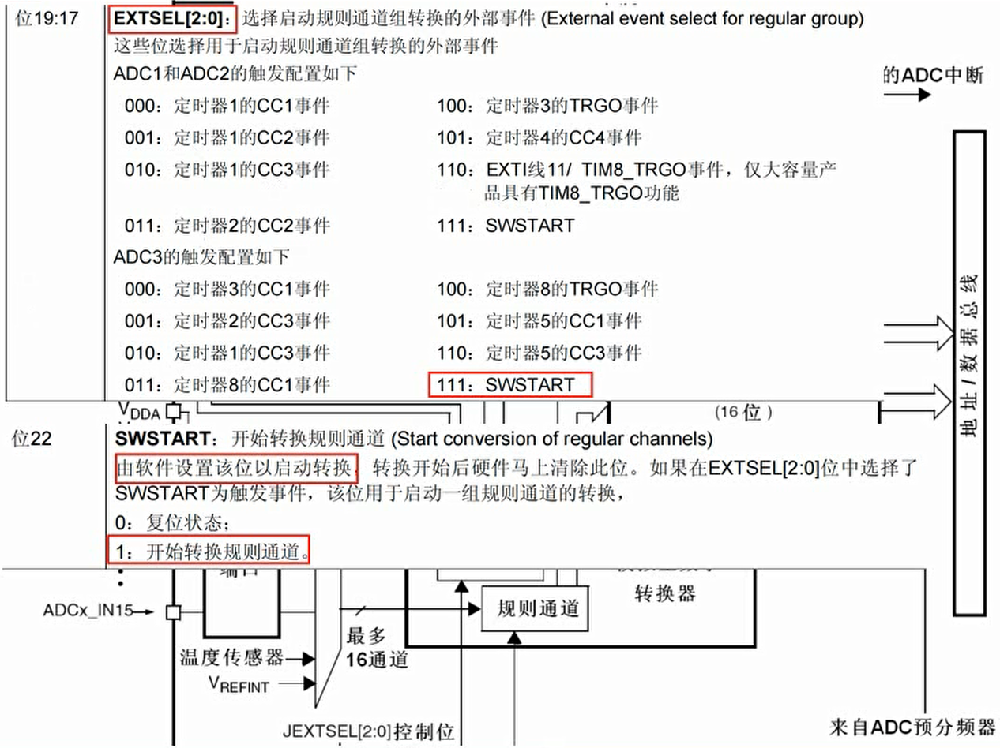  

#### 转换方式
* ADC_CR1寄存器SCAN：扫描模式(Scan mode)
开启扫描模式：多通道，顺序扫描，挨个转换。
关闭扫描模式：只转换通道组中第一个通道。

* ADC_CR2寄存器CONT：连续转换(Continuous conversion)
开启连续模式：通道组内转换一轮之后，继续转换下一轮。不会停。
关闭连续模式：通道组内转换一轮之后，停止转换，等待下次启动。(单次转换)

### 寄存器
#### 独立模式单通道寄存器
```c
/* 禁用扫描模式（只有一个通道，不需要扫描） */
    ADC1->CR1 &= ~ADC_CR1_SCAN;
/* 启用连续转换（转换不会停止）。能实时检测到模拟信号（如电阻）的变化 */
    ADC1->CR2 |= ADC_CR2_CONT; // CONT-continue
/* 转换结果右对齐 0:右对齐 1: 左对齐。默认就是右对齐，通常不需要配置即可*/
    ADC1->CR2 &= ~ADC_CR2_ALIGN;
/* 触发来源配置：禁用规则通道外部触发。默认就为0 */
    ADC1->CR2 &= ~ADC_CR2_EXTTRIG;
```

# CAN 通讯
CAN（Controller Area Network 控制器局域网，简称CAN或者CAN bus）是一种功能丰富的车用总线标准。被设计用于在不需要主机（Host）的情况下，允许网络上的单片机和仪器相互通信。
**它基于消息传递协议，设计之初在车辆上复用通信线缆，以降低铜线使用量，后来也被其他行业所使用。**
CAN拥有了良好的弹性调整能力，可以在现有网络中增加节点而不用在软、硬件上做出调整。除此之外，消息的传递不基于特殊种类的节点，增加了升级网络的便利性。
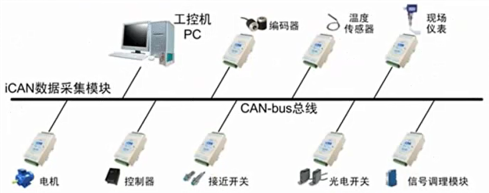  
**类似于 IIC, SPI 通讯协议，但是 IIC, SPI 这些通讯距离较短，不适合汽车上的几米、十几米的通讯。并且 CAN 协议不需要主控模块，可以避免如果主控出问题就导致所以设备出问题。所以 CAN 通讯可以在不需要主控的情况下进行任意设备的点对点通讯。**

* CAN，ControllerArea Network 控制器局域网，简称CAN或者CAN bus。
* 一种功能丰富的车用总线标准。
* 设计用于在不需要主机(Host)的情况下，允许网络上的单片机和仪器相互通信。
* 它基于消息传递协议，设计之初在车辆上复用通信线缆，以降低铜线使用量，后来也被其他行业所使用。
* CAN拥有良好的弹性调整能力，可以在现有网络中增加节点而不用在软、硬件上做出调整。
* 消息的传递不基于特殊种类的节点，增加了升级网络的便利性。

### 物理层
CAN总线上连接的每个设备叫做一个CAN网络节点。
CAN网络节点包括CAN控制器和CAN收发器：
* CAN控制器：一般MCU提供。STM32内部提供了1个CAN控制器。
* CAN收发器：收发器一般需要专门芯片提供。我们开发用的是 PD1050 收发器芯片。
  CAN控制器发送的电平（如3.3V）不足以传输较远距离，这么低的电压通常只能在一块开发板内传输高低电平，距离远了传输到的时候可能高电平就变为低电平了。所以需要CAN收发器进行转换使其传的更远。
* 控制器与收发器之间通过CAN Tx及CAN Rx信号线相连。
* 收发器与CAN总线之间使用CAN High及CAN Low信号线相连。CAN Highe和CAN Low是查分信号，通过差值来判断是高电平还是低电平。所以是同时用两根线来传递一个信号。

##### CAN网络节点发数据
当CAN节点需要发送数据时，控制器把要发送的二进制编码通过CAN Tx线发送到收发器。
收发器把这个普通的逻辑电平信号转化成差分信号通过差分线CAN High和 CAN Low线输出到CAN总线网络。
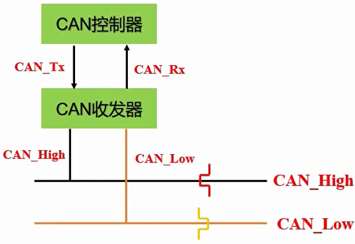  

##### CAN网络节点收数据
而通过收发器接收总线上的数据到控制器时，则是相反的过程。
收发器把总线上收到的CAN High及CAN LoW信号转化成普通的逻辑电平信号。
通过CAN Rx输出到控制器中。

##### CAN总线网络
当CAN线上接入多个设备时，就构成了CAN总线网络，根据接法不同，总线网络分为闭环总线网络和开环总线网络。
* 闭环总线网络：遵循ISO11898标准的高速、短距离“闭环网络”。
  * 最大传输距离40m。
  * 通信速度最高为1Mbps。
  * 总线的两端各要求有一个“120欧”的电阻。
  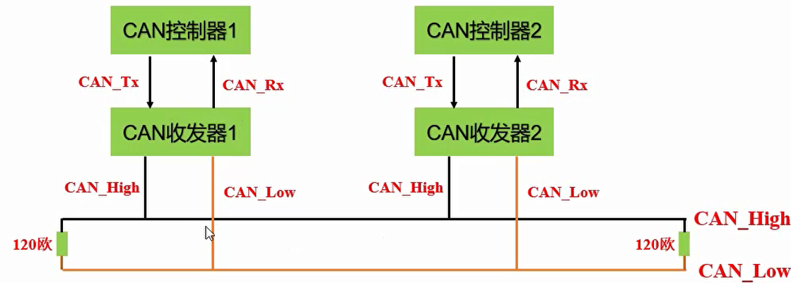  
* 开环总线网络：遵循 ISO11519-2标准的低速、远距离“开环网络”。
  * 最大传输距离1Km。
  * 通信速度最高为125Kbps。
  * 两根总线是独立的、不形成闭环，要求每根总线上各串联有一个“2.2 千欧”的电阻。
  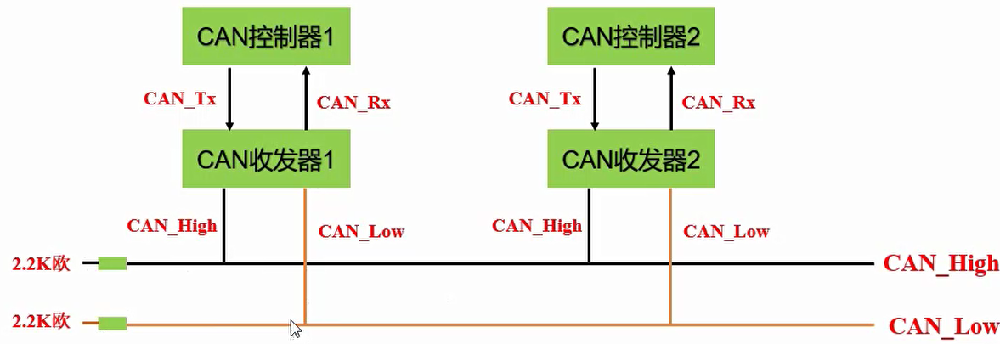  

##### 差分信号
* 差分传输是一种信号传输的技术，差分传输在这两根线上都传输信号，这两个信号的振幅相同，相位相反。
* 信号接收端比较这两个电压的差值来判断发送端发送的逻辑状态。
* 在电路板上，差分走线必须是等长、等宽、紧密靠近、且在同层面的两根线。
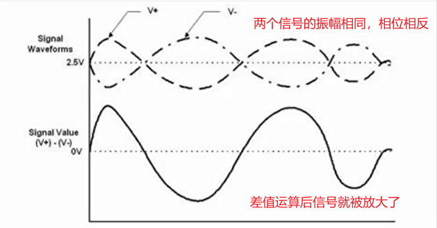  

**差分信号优缺点**
* 优点：
  1. 抗干扰能力强
    干扰噪声一般会等值、同时的被加载到两根信号线上，而其差值为0，即，噪声对信号的逻辑意义不产生影响。
  2. 能有效抑制电磁干扰(EMI)
    由于两根线靠得很近且信号幅值相等，这两根线与地线之间的耦合电磁场的幅值也相等，同时他们的信号极性相反，其电磁场将相互抵消。因此对外界的电磁干扰也小。
    
  差分信号线具有这些优点，在 USB 协议、485 协议、以太网协议及 CAN 协议的物理层中，都使用了差分信号传输。
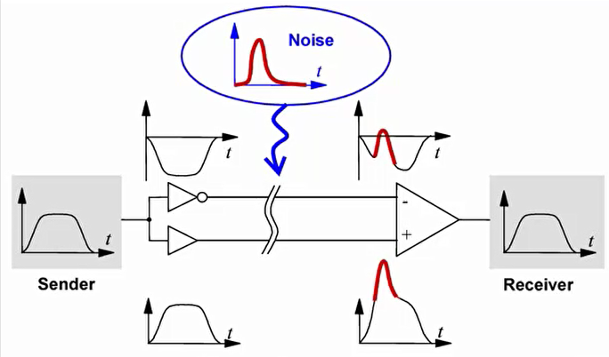  

* 缺点：
  差分信号一定要走两根等长、等宽、紧密靠近、且在同一层面的线。对电路板比较小，走线比较紧张的情况下，给布线带来挑战。

##### CAN中的差分信号 
以高速CAN协议为：
例逻辑1(隐性电平)
CAN_High = CAN_Low = 2.5V
电压差为 VH-VL=0V（没有电压差所以叫隐性电平）
逻辑0(显性电平)
CAN_High=3.5V,CAN_Low =1.5V
电压差为 VH-VL=2V（能检测到电压差所以叫显性电平）

信号传输类似于IIC，High和Low都通过上拉电阻连接电源，空闲时都输出高电平表示逻辑1。要输出数据时，输出0拉到低电平即可，并且由于**总线结构**，只要有一个设备输出0，所有设备接收到的都是0，叫做“线与”。
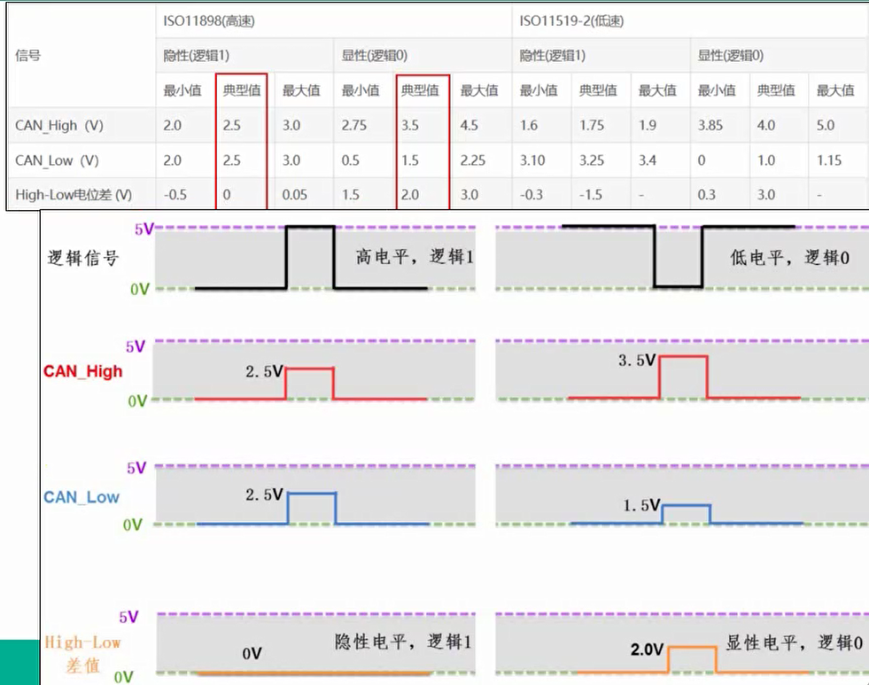  

### 协议层
#### CAN的帧（报文）种类
CAN总线是广播类型的总线。这意味着所有节点都可以侦听到所有传输的报文。无法将报文单独发送给指定节点；所有节点都将始终捕获所有报文。但是CAN硬件能够提供本地过滤功能，让每个节点对报文有选择性地做出响应。
CAN使用短报文，最大实用负载是94位。报文中没有任何明确的地址；相反，可以认为报文是通过内容寻址，也就是说，报文的内容隐式地确定其地址。
CAN总线上有5种不同的报文类型（或“帧”）：数据帧、远程帧、错误帧、过载帧和帧间隔。
1. 数据帧 ：数据帧是最常见的报文类型，用于发送单元向接收单元发送数据。
2. 远程帧（遥控帧）：远程帧用于接收单元向具有相同id的发送单元请求发送数据。
3. 错误帧：错误帧当检测出错误时向其他单元通知错误的帧。
4. 过载帧：过载帧并不常用，因为当今的CAN控制器会非常智能化地避免使用过载帧。
5. 帧间隔：用于将数据帧及遥控帧与前面的帧分离开来的帧。

其中**错误帧、过载帧、帧间隔**都是由硬件自动完成的，没有办法用软件来控制。对于一般使用者来说，只需要**掌握数据帧与遥控帧**。数据帧和遥控帧有标准格式与扩展格式。标准格式有11位标识符，扩展格式有29位标识符。

#### 数据帧
* 标准帧：11位消息类型位，位数少能表示的消息种类就少。$2^{11}$有2k种消息，但是随着CAN通讯从汽车扩大到各行各业后，2k种消息也不够用了，所以有了扩展帧。
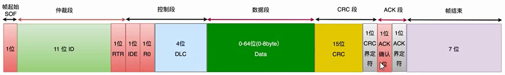  
  * 帧起始(Start Of Frame-SOF)：
    * 1bit，显性信号(逻辑0)。默认情况下两根线的电平相等，表示逻辑1。
    * 表示数据帧(或远程帧)的开始。
    * 只能在总线空闲的时候才可以发送帧起始。（总线上的电平为逻辑1时）
  * 仲裁段(Arbitration Field)包括两部分：
    * 标识符位(ldentifier field-lD)
      * 长度为11位(11 bits)，ID10\~ID0。按照ID10\~ID0的顺序进行传输。
      * 是一个功能性的地址(Functional address)，CAN接收器通过标识符来过滤数据帧。
      * 不同节点发出消息的标识符位是不能相同的。如A节点可以发ID为1,3,4的消息，B节点就不能发1,3,4这3个ID的消息了，可以发ID为2,5的消息。
    * 远程发送请求位(Remote Transfer Request-RTR)
      用于区分该帧是数据帧还是远程帧：远程帧表示是一个请求类型的消息，比如B节点不能发送ID为1的消息，但是B节点可以发送ID为1的请求类型消息来请求A节点发送数据，只需要把远程帧设为1即可。
      * 显性信号(0)代表数据帧(Data Frame)
      * 隐性信号(1)代表远程帧(Remote Frame)
  * 控制段(Control Field)一共6位：
    * IDE位(ldentifier Extension)1位：区分标准格式与扩展格式。
      显性电平(0)时表示标准格式。隐性电平(1)时表示扩展格式（即扩展帧）。
    * RO位：1位。保留位，以后使用。
    * DLC段(Data Length Code)：4位。表示本报文中的数据段含有多少个字节，用于DLC段表示的数字为0~8（最多只能到8，二进制为1000）。
  * 数据段(DATA Field)：数据帧的核心内容，它是节点要发送的原始信息。由0~8个字节组成。高位先行。
  * CRC段(CRCField)包含2部分
    * CRC校验码：15 bits，用于校验传输是否正确。（强制使用CRC校验，数据正确性比性能更重要）
    * 界定符：隐性位(1)，表示校验码的结束。
  
    当CRC发送后，总线就将控制权交给接收端，接收端接收数据后将发送ACK信息。
  * ACK段(ACK Field)包含2部分：（下面有ACK详解）
    * ACK确认位
      发送端的ACK确认位是隐性位(1)，接收端收到正确的CRC校验位后，把这一位置为显性位(0)。
    * 界定符
      1位隐性位(1)，用于与后面的帧结束隔开。
  * EOF段(End Of Frame )
    帧结束，帧结束段由发送节点发送的7个隐性位表示结束
    
---
### ACK详解
#### 核心概念：集体确认

在CAN总线中，**ACK并不是由某个特定的节点发送给发送节点的私人回执**。相反，它是一个**集体确认**的过程：

*   **发送节点**：在ACK段只提供一个**“位时隙”**（一个固定的时间段），并在这个时段内监听总线。
*   **接收节点们**：所有**正确接收到帧**的节点（无论是不是目标节点），都会在发送节点提供的这个“位时隙”内，**同时**向总线上发送一个**显性电平**（逻辑0）。
*   **最终结果**：发送节点在ACK段监听到总线被拉低（变为显性电平），它就知道**至少有一个节点成功收到了帧**。

如果发送节点在ACK段没有监听到显性电平（总线保持隐性），它就判断为**没有节点成功接收**，并启动错误处理流程（如重发）。

#### 详细过程分解

让我们结合CAN数据帧的结构来看：

一个标准CAN数据帧的结构如下：
```
[SOF] - [仲裁段] - [控制段] - [数据段] - [CRC段] - [ACK段] - [EOF]
```

ACK段由两位组成：
1.  **ACK Slot（应答位隙）**：发送节点在此位**发送一个“隐性”位（逻辑1）**。
2.  **ACK Delimiter（应答界定符）**：一个固定的“隐性”位，用于将ACK Slot与后续的EOF隔开。

整个过程分为三步：

##### 第一步：发送节点的动作（提供位隙并监听）

*   发送节点在传输完CRC段后，会继续传输ACK段。
*   在 **ACK Slot** 这个比特位上，发送节点**向总线发送一个“隐性”位（逻辑1，高电平）**。
*   **与此同时**，发送节点会**切换为接收模式**，小心翼翼地监听总线上在这个时间段内的实际电平。

**此时，总线状态暂时是“隐性”（1），因为只有发送节点在驱动。**

##### 第二步：接收节点的动作（集体拉低总线）

*   所有成功接收到前面所有数据（包括CRC校验正确）的节点（无论是目标节点还是仅监听的节点），在收到发送节点发出的这个“隐性”的ACK Slot位时，都会**覆盖**它。
*   它们会**同时**在ACK Slot位时段内，向总线**发送一个“显性”位（逻辑0，低电平）**。

**此时，由于“显性”位（0）会覆盖“隐性”位（1），总线的实际电平被拉低为“显性”（0）。**

##### 第三步：发送节点的确认（检查结果）

*   发送节点在ACK Slot位时段监听总线。
*   **如果它检测到总线是“显性”电平（0）**：这与它自己发送的“隐性”（1）不同。它由此确认**至少有一个接收器成功接收了该帧**。发送成功！
*   **如果它检测到总线仍然是“隐性”电平（1）**：这意味着**没有任何一个接收器做出响应**。发送节点由此断定本次发送失败（可能没有接收器，或者所有接收器都检测到了错误），它将触发错误标志，并自动重发该帧。

#### 注意
非目标节点的成功接收会覆盖目标节点的失败，导致发送节点误以为帧已成功送达目标。CAN总线最初是为汽车内部控制设计的，其核心思想是广播和尽力交付。它的首要目标是保证数据能够无损地、至少被一个节点正确接收，并迅速传递到总线上，而不是为特定节点提供端到端的、100%成功的保证。

可以在应用层（你的软件代码中）实现一套请求-应答机制来解决此问题：
1. 节点A（主节点）向节点B（目标节点）发送一帧命令帧或请求帧。
2. 节点B正确接收并处理后，必须主动向总线发送一帧响应帧作为答复。
3. 节点A启动一个定时器等待响应。
4. 如果节点A在超时时间内收到了节点B的响应：通信成功。
5. 如果节点A超时仍未收到响应：判断为通信失败，并可以根据策略进行重发。

举例：在BMS中，主控板（Master）命令某一块从控板（Slave）报告电压。主控板发送请求帧后，必须等待该从控板回复的电压数据帧。如果没等到，就认为与该从控板的通信中断，并上报故障。

---

* 扩展帧：29位消息类型位，$2^{29}$种消息类型。
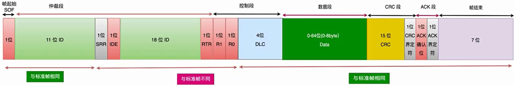  
  * SRR(Substitute Remote Request Bit)替代远程请求位(RTR)，隐性信号(1)。
  * IDE表示扩展帧还是标准帧，这里就该是隐性电平(1)表示扩展帧。
  * 18位扩展ID
  * RTR表示数据帧还是远程帧
  * R1RO保留位

不把新的ID直接加到旧的ID后来简单的实现扩展帧，是为了兼容考虑。直接加在后面，那么就不知道11位ID后的那位到底是扩展帧ID还是RTR功能位。
最初的CAN协议，IDE那一位实际上也是保留位，后面发现11位ID不够用，则把这位保留位改为了IDE用来做ID的扩展。
RTR需要在ID接收完后判断，所以往后移，而标准帧的RTR位变成了SRR位。也就是接收方需要判断了IDE位后才知道前一位是RTR还是SRR。

#### 远程帧
远程帧相较于数据帧就是没有数据段。
  

### 总线仲裁
当总线空闲时，同时有多个节点要发送数据，那么谁先发送，此时需要个裁判来判断谁优先，这就叫总线仲裁。
多个单元同时开始发送时，从仲裁段（报文id）的第一位开始进行仲裁。连续输出显性电平最多的单元可以继续发送，即首先出现隐性电平的单元失去对总线的占有权变为接收。（即报文id小的优先级高）。
竞争失败，会自动检测总线空闲，在第一时间再次尝试发送。

### 位时序
#### 位同步
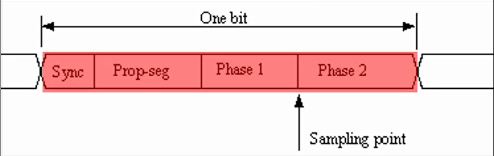  
CAN中提出了位同步的方式来确保通讯时序。
##### Tq
1位传输占用的时间通常被分为若干等长的时间单元，称为时间量化器(Time Quanta, Tq)。(每一段占用的时间单元个数会有所不同)
一个Tq的长度可以根据传输速率的需要设置。
在STM32的CAN外设中，通过设置波特率分频器的值来确定Tq的大小。

一帧中包含了很多个位，CAN把每1位（1个bit的传输）分为4段(从时间角度划分)：
* 同步段(SS:Synchronization Segment)：
  SS 段的大小固定为 1Tq。若通讯节点检测到总线上信号的跳变沿被包含在 SS 段的范围之内，则表示节点与总线的时序是同步的。
* 传播时间段(PTS:Propagation Time Segment)：
  CAN总线上数据的传输会受到各种物理延迟。比如发送单元的发送延迟、总线上信号的传播延迟、接收单元的输入延迟等。PTS段就是用来补偿这些因素产生的时间延迟。PTS段长度至少为1个Tq。一般1-8Tq。
  **比如在SS段未检测到信号的跳变，而在PTS段检测到了，那么说明信号未对齐，就需要进行调整到SS段中（拉长后面的PBS段）。但是此次数据的采样也正常进行，能正常采样。**
* 相位缓冲段1(PBS1:Phase Buffer Segment 1)：
  主要用来补偿边沿阶段的误差。它的时间长度在重新同步阶段的时候可以被自动加长。PBS1段的初始大小可以为1~8Tq。
* 相位缓冲段2(PBS2:Phase Buffer Segment 2)
  另一个相位缓冲段，也是用来补偿边沿阶段误差。它的时间长度在重新同步阶段时可以缩短。PBS2 段的初始大小可以为 2~8Tq。

4段的总时间段构成了位时间(Bit Time)，就是传输一个位所需的总时间。

* 采样点：采样点位于PBS1和PBS2的交界处。

#### 数据同步
CAN通讯传输的数据很多，可能一位误差一点点，累计起来就很大，导致接收方采样错误。所以需要进行数据同步来修正。
根据同步方式差异，CAN 的数据同步分为硬同步和再同步：
* 硬同步：接收到SOF起始位时，就按照约定的每一位的4段是多长，在采样点进行采样。
  当一个节点检测到起始位时，它会执行硬同步，以便将其内部的时间基准与数据帧的时间基准对齐。
  **但是在一帧的传输中有很多位，每一位的误差累计起来后面的位采集时就会出现偏差，硬同步不能解决这个问题。**
* 再同步：在检测到总线上的时序与节点使用的时序有相位差时(即总线上的跳变沿不在节点时序的 SS 段范围)，通过延长 PBS1 段或缩短 PBS2 段，来获得同步。

**所有的同步都是由CAN控制器硬件自动完成的。**

### CAN的波特率
各个通讯节点约定好1个Tg 的时间长度以及每一位占据多少个 Tq，就可以确定CAN通讯的波特率。
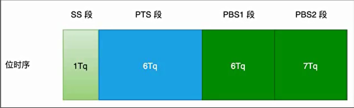  
假设图中的1Tq=1us，而每个数据位由20个Tq组成，则传输一位数据需要时间为20us，从而每秒可以传输的数据位个数为:$\frac{10^{6}}{20}=50000$
这个每秒可传输的数据位的个数即为CAN通讯的波特率。比如上面的波特率就是50kbps。

#### 位填充
问题：如果数据流中出现一长串连续的相同比特（例如一长串‘0’或一长串‘1’），电平长时间不变化，接收节点的时钟就可能因为微小的频率偏差而逐渐漂移，最终导致采样点错位，读错后续的位。
解决方案：位填充。它的核心思想是强制电平定期跳变，为接收节点提供丰富的边沿信号来不断校准自己的时钟，从而保持同步。
##### 位填充的规则
5个相同位后插入一个反相比特。
规则非常简单且强硬：
* 发送端：当发送节点检测到它已经发送了连续5个相同逻辑电平的比特（无论是5个‘1’还是5个‘0’）时，它会自动在第六个位的位置插入一个相反逻辑电平的比特。
  如果连续5个‘1’，就插入一个‘0’。
  如果连续5个‘0’，就插入一个‘1’。
* 接收端：接收节点在监听总线时，同样检测连续相同比特的数量。当它检测到连续5个相同比特后出现一个相反比特时，它就知道这个相反的比特是发送端插入的填充位，并会自动将其丢弃，不会传递给上层协议。

**例子：**
假设原始数据需要发送：111111000001 （一长串1和一长串0）

* 发送端操作：
  发送了5个‘1’后 -> 插入一个‘0’（填充位）。
  继续发送，现在数据变成了5个‘0’ -> 插入一个‘1’（填充位）。
  最终在总线上的数据流变为：11111**0**00000**1**1
  （加粗的 0 和 1 就是被插入的填充位）

* 接收端操作：
  接收到 111110 -> 发现5个‘1’后是一个‘0’，判定这个‘0’是填充位，丢弃它，得到 11111。
  继续接收 000001 -> 发现5个‘0’后是一个‘1’，判定这个‘1’是填充位，丢弃它，得到 00000。
  最后接收剩下的 1。
  最终接收端重组出的原始数据仍然是：111111000001

通过这个过程，总线上的电平最多连续5个位保持不变，之后必定发生一次跳变，从而为接收端提供了用于同步的边沿信号。
如果接收节点检测到连续6个相同电平的比特，它就会立即判定这是一个格式错误。接收节点会发送一个错误帧，通知全网所有节点丢弃当前帧，发送节点则会自动重发。

### CAN外设（CAN控制器）
#### 3种工作模式
CAN控制器有3种工作模式：初始化模式、正常模式、睡眠模式。
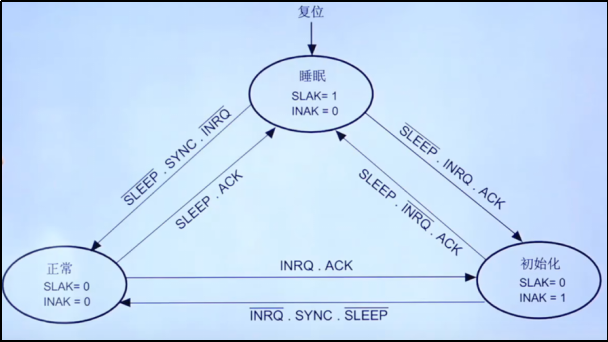  
上电复位后CAN控制器默认会进入睡眠模式，作用是降低功耗。当需要将进行初始的时候（配置寄存器），会进入初始化模式。当需要通讯的时候，就进入正常模式。
通过修改 SLEEP, INRQ 寄存器来切换状态。

#### 3种测试模式
CAN控制器有3种测试模式：静默模式、环回模式、环回静默模式。当控制器进入初始化模式的时候才可以配置测试模式。
* 静默模式：只收不发。
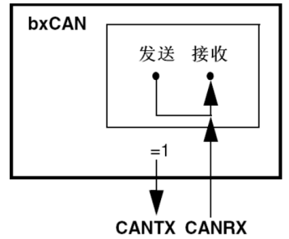  
* 环回模式：对外只发不收，且自发自收（发送的数据自己能收到）。
  
* 环回静默模式：对外不发不收，且自发自收。（自检用）
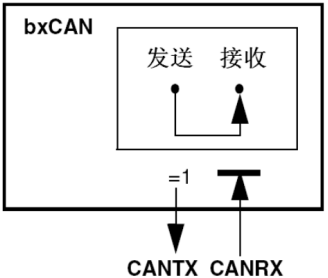  

#### 功能框图
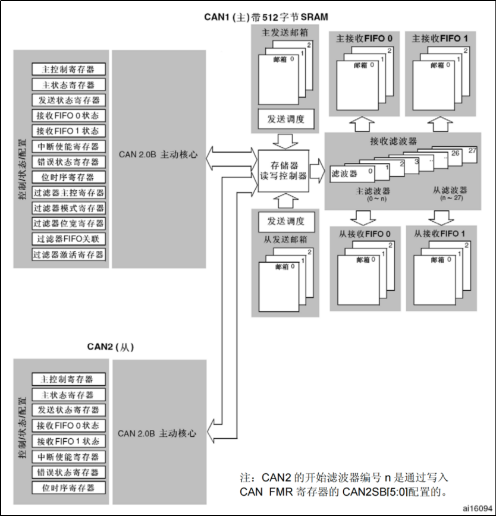  
* 接收滤波器：不是滤波，只是过滤消息用。
* 主发送邮箱：有3个邮箱可以任意使用。
* 主接收FIFO：长度为3的队列，每次只能取最前面那个。

##### 过滤器
对接到的报文进行过滤，最后放入FIFO 0或FIFO 1。当总线上报文数据量很大时，总线上的设备会频繁获取报文，占用CPU。过滤器的存在，选择性接收有效报文，减轻系统负担。

有2种过滤模式：
1. 标识符列表模式，它把要接收报文的ID列成一个表，要求报文ID与列表中的某一个标识符完全相同才可以接收，可以理解为**白名单**管理。
2. 掩码模式（屏蔽位模式），它把可接收报文ID的某几位作为列表，这几位被称为掩码，可以把它理解成关键字搜索，只要掩码（关键字）相同，就符合要求，报文就会被保存到接收FIFO。
  比如可以设置允许以00110为开头的ID，因为ID为11位，所以是00110000000（这里要注意的一点是，由于我们只关心前5位是否相等，所以后面7位可以设置为全为0，也可以设置为不为0，如001100101010，当然最好是全为0）：
    1. 设置掩码：将要进行判断的那几位设置为1，得到11111000000（掩码可以是任意位为1，也就是不一定是连续的几位高位为1的某个连续区间）
    2. 当接收到的ID为00110110001时，将掩码与接收到的ID进行按位与操作：
      11111000000 & 00110110001 -> 00110000000
    3. 将掩码和我们设置的允许的ID进行按位与操作：
      11111000000 & 00110000000 -> 00110000000
      如果允许的ID设置为了001100101010，按位与操作后结果相同
      11111000000 & 001100101010 -> 00110000000
    4. 判断2的结果和3的结果是否相等，相等则通过过滤器，不等则丢弃该报文。

如果使能了过滤器，且报文的ID与所有过滤器的配置都不匹配，CAN外设会丢弃该报文，不存入接收FIFO。
每个CAN提供了14个位宽可变的、可配置的过滤器组（13~0）。每个过滤器组x由2个32位寄存器，CAN_FxR1（过滤ID）和CAN_FxR2（过滤ID或掩码，根据模式决定）组成。
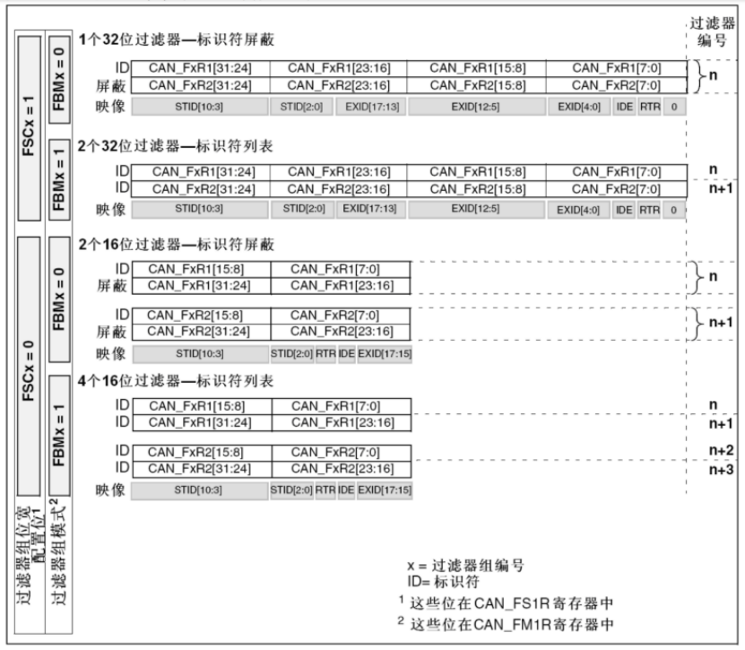  
FSCx=1时是扩展帧模式，需要32位来表示一个ID；FSCx=0时是标准帧模式，ID就是11位，使用一个16位的寄存器来存储。

### STM32中CAN的位时序
STM32 外设定义的位时序与前面解释的 CAN 标准时序有一点区别。STM32 的位时序：把传播时间段和相位缓冲段1做了合并。
* 标准：
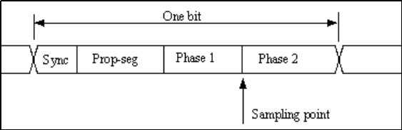  

* STM32：
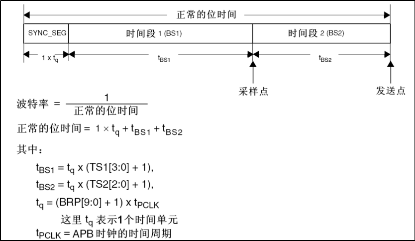  
将PTS合并到了PBS1中，PBS1可以检测信号跳变，拥有原PTS的功能。名称改为了BS1和BS2。在 CAN_BTR 寄存器中配置。

### 寄存器
1. 项目中用到了CAN的引脚重映射寄存器：
```c
    /* 重定向PB8和PB9引脚  10：CAN_RX映像到PB8，CAN_TX映像到PB9 */
    AFIO->MAPR |= AFIO_MAPR_CAN_REMAP_1;
    AFIO->MAPR &= ~AFIO_MAPR_CAN_REMAP_0;
```
2. 初始化
```c
    // 进入初始化模式
    CAN1->MCR |= CAN_MCR_INRQ; // CAN_MCR 中将 CAN_MCR_INRQ 位改为1
    // 等待 CAN_MSR 中的 INAK 变成1才进入了初始化，未变成1前就死循环等待
    while ((CAN1->MSR & CAN_MSR_INAK) == 0); /* 等待进入初始化模式 */
```
3. 退出睡眠模式
```c
    /* 退出睡眠模式，SLEEP 设置为0 */
    CAN1->MCR &= ~CAN_MCR_SLEEP;
    // 同样需要等待，判断SLAK位变成0为退出睡眠
    while ((CAN1->MSR & CAN_MSR_SLAK) != 0); /* 等待退出睡眠模式 */
```
4. 自动离线管理
```c
    /* 自动离线管理。 允许自动退出离线状态。检测到128次11位的连续的隐性位会自动离线 */
    CAN1->MCR |= CAN_MCR_ABOM;
```
5. 自动唤醒管理
```c
    /* 自动唤醒管理。 睡眠模式时检测到有CAN报文，可以从睡眠模式由硬件自动唤醒。 */
    CAN1->MCR |= CAN_MCR_AWUM;
```
6. 配置静默和回环模式：用于测试，先自发自收看能不能正常使用
```c
    /* 静默模式 用于调试 */
    CAN1->BTR |= CAN_BTR_SILM;
    /* 回环模式 用于调试 */
    CAN1->BTR |= CAN_BTR_LBKM;
```
7. 波特率配置：
```c
    /* 波特率分频器，定义Tq的长度。
     配置35表示36分频，CAN线接在低速时钟上，是36MHz，所以产生波特率的时钟为1MHz。
     Tq = 1us（即1/1MHz秒）
    */
    // 要设置的是BRP相关位，在0-9的位置上
    CAN1->BTR &= ~CAN_BTR_BRP; // 先都设置为0
    CAN1->BTR |= 35 << 0; // 左移0位是为了保持代码的一致性，其它位配置也有左移操作
```
8. 时间段1和时间段2配置
分别配置3个Tq和6个Tq，加上前面的同步段1个Tq，总共就是10个Tq，发送1位的时间就是10us，1秒钟发送100k位，传输速率就是100kbps.
```c
    /* 时间段1(3*Tq)和时间段2(6*Tq) */
    CAN1->BTR &= ~CAN_BTR_TS1; // 先重置为0
    CAN1->BTR &= ~CAN_BTR_TS2; // 先重置为0
    CAN1->BTR |= (2 << 16); // 赋值为3-1得2，左移16位到对应位上
    CAN1->BTR |= (5 << 20); // 赋值为6-1得5，左移20位到对应位上
```
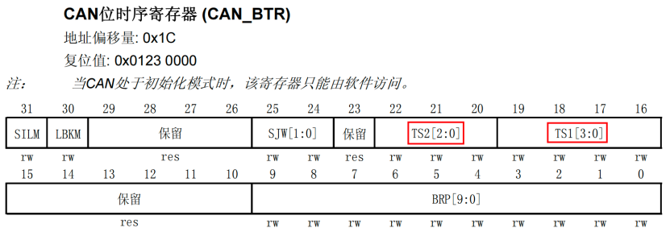  
9. 再同步跳跃宽度
```c
    /* 再同步跳跃宽度 2*Tq*/
    CAN1->BTR &= ~CAN_BTR_SJW;
    CAN1->BTR |= (1 << 24); // 赋值为2-1得1，左移24位到对应位上
```