# 什么是BMS
**BMS**，全称是 **Battery Management System**，中文叫**电池管理系统**。

你可以把它想象成一个非常尽职尽责、无所不能的 **“电池保姆”** 或 **“电池大脑”**。它的核心任务就是**时刻照顾电池组（通常是锂离子电池）的健康与安全，并让其发挥最佳性能**。

为什么需要这么一个“保姆”呢？因为锂离子电池虽然性能优异，但也很“娇气”：
*   **过充**（充电太多）、**过放**（放电太狠）、**过热**、**过流**（电流太大）都会对其造成不可逆的损伤，甚至引发燃烧、爆炸等严重安全事故。
*   电池本身无法直接告诉我们它还剩多少电（SOC）或者是否老化（SOH）。

而BMS，就是为解决这些问题而生的。

---

### BMS的核心职责（四大功能）

这个“电池保姆”的工作主要分为以下四个方面：

#### 1. 监测 - “眼睛”和“耳朵”
这是BMS最基本的功能，即**实时采集**电池的各项物理参数。
*   **电压监测**：精确测量**每一节电芯**的电压。这是防止过充和过放的第一道防线。
*   **电流监测**：测量流入（充电）和流出（放电）电池组的**总电流**。这是计算电量、判断过流的基础。
*   **温度监测**：在电池组的关键位置安装温度传感器，监测温度。锂电池怕冷又怕热，温度管理至关重要。

> **对你而言**：这部分需要你熟悉**ADC（模数转换）** 原理，以及如何通过**I2C/SPI**等总线与专门的模拟前端（**AFE**）芯片通信来获取这些数据。

#### 2. 保护 - “肌肉”和“反射弧”
基于监测到的数据，BMS需要做出判断，并在危险发生时果断采取行动，就像人的条件反射。
*   **判断**：将测量值与设定的阈值进行比较。
*   **行动**：一旦发现**过压、欠压、过流、短路、超温**等情况，立即控制**继电器**或**MOSFET**（一种电子开关）断开电路，从而保护电池。这是安全性的根本保障。

> **对你而言**：你需要编写逻辑判断代码，并学会控制**GPIO**口来驱动这些开关器件。

#### 3. 估算 - “大脑”
这是BMS技术中的**难点和核心**，体现了系统的智能程度。它需要根据监测到的数据，计算出一些无法直接测量的、至关重要的“状态”。
*   **SOC估算**：**荷电状态**，也就是我们常说的“还剩多少电”。就像燃油车的油表。最常用的方法是**安时积分法**（通过累计电流计算）并结合**电压校正**。
*   **SOH估算**：**健康状态**，反映电池的寿命还剩多少。就像人的健康度。通常通过容量衰减和内阻增大的程度来判断。
*   **SOP估算**：**功率状态**，电池当前能提供或接受多大功率。这决定了电动车能瞬间加速多快或能多快进行能量回收。

> **对你而言**：这将涉及复杂的算法。初期你可能只需要调用现有算法函数，但后期需要深入理解并参与优化这些模型（如卡尔曼滤波）。

#### 4. 均衡 - “理疗师”
由于制造工艺的微小差异，电池组中数百甚至数千节电芯的老化速度不可能完全一致。有的电芯电量多点，有的少点。BMS的均衡功能就是**主动减少电芯之间的这种不一致性**，延长整个电池组的寿命。
*   **被动均衡**：给电量高的电芯并联一个电阻，把多余的电能以热量形式消耗掉。简单、成本低，但浪费能量。
*   **主动均衡**：通过电容或电感等元件，把电量高的电芯的能量转移给电量低的电芯。效率高，但电路复杂，成本高。

> **对你而言**：你需要配置AFE芯片的均衡控制寄存器，并设计合理的均衡策略（何时开启、对哪节电芯均衡）。

#### 5. 通信 - “嘴巴”
BMS不能默默无闻地工作，它需要把电池的所有信息（电压、电流、温度、SOC、SOH、故障码等）**报告给上层设备**（如整车控制器、充电机、仪表盘），同时也能接收指令。
*   **常用通信方式**：**CAN总线**（汽车领域绝对主流）、**UART**（串口，常用于内部调试）、**RS485**等。

> **对你而言**：学习**CAN总线**协议将是你的必修课。你需要编写代码来打包（发送）和解包（解析）CAN报文。

---

### 总结与比喻

为了让概念更清晰，我们做一个有趣的比喻：

| 功能 | 比喻 | 目的 |
| :--- | :--- | :--- |
| **监测** | **护士量体温、测血压** | 收集生命体征数据 |
| **保护** | **医生喊停、紧急抢救** | 在危险时立即中断，保命第一 |
| **估算** | **专家会诊、预测病情** | 判断健康状况和预后（还有多少“日子”） |
| **均衡** | **理疗师做按摩调理** | 让身体各部分机能恢复平衡 |
| **通信** | **病人家属汇报情况** | 与外界保持信息畅通 |

对于你——一名嵌入式软件工程师来说，BMS就是你将要编写程序的那个“大脑”。你的代码将负责：
1.  **驱动硬件**（读取AFE、控制开关）。
2.  **实现逻辑**（判断是否过压过流）。
3.  **运行算法**（计算SOC、SOH）。
4.  **管理通信**（收发CAN报文）。

### 举例说明
如磷酸铁锂的电压是2.5V-3.65V，三元锂（镍钴锰锂）的电压是2.7V-4.25V，这些电池会先进行并联再进行串联，从而增加容量与输出电压、电流。
* 电压：
    * 初始容量：首先需要检测初始容量；
    * 过压/欠压：当电压过压/欠压时需要做保护动作；
    * 均衡：当电压不均衡时需要进行均衡来提高电池使用寿命；
    * SOC：需要使用 SOC 估算初始容量等
* 电流：
    * SOC：电池通过并联提高电流，在充放电过程中对电流进行实时检测，通过安时积分法`当前SOC = 上次SOC + (充电电流 × 时间) / 总容量`等计算 SOC；
    * 过流/短路：当电流超过正常值时需要进行过流保护，当电池短路时瞬间出现非常大的电流需要进行短路保护；
    * 充放电电流：在低温条件下、低SOC等情况，需要对充放电电流进行限制；
    * 内阻：电流会影响内阻大小；
* 温度
    * SOC：充放电过程中会导致温度的变化、环境温度也会有不同，这些都会对SOC产生影响；
    * 热管理：在高温/低温下需要进行热管理，以保证电池的安全；
    * 充放电电流：会导致温度的变化；
    * 内阻：会导致温度的变化；

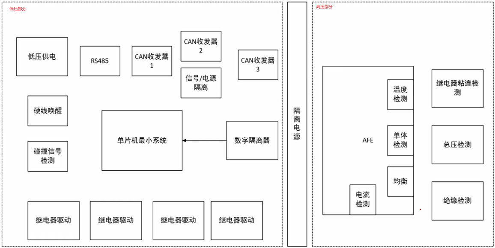  

# SOC 与电压的关系
1. 平台期间的电压采样需要较高精度的采样
    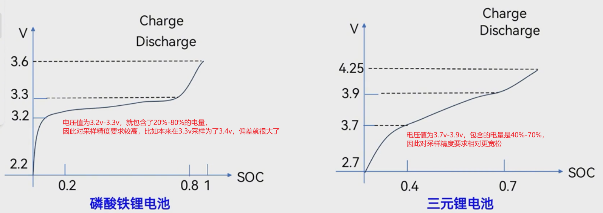  
    * OCV（Open Circuit Voltage，开路电压）设备是用于测试锂电池的开路电压的工具。其工作原理是基于锂电池在开路条件下的电化学特性。
    当锂电池处于开路状态时，没有电流流过电池的外部电路，此时电池内部的化学反应会导致电位差的产生。锂电池的正极和负极之间存在一定的电势差，这就是开路电压。
    OCV测试设备通过将电极针对锂电池的正负极分别连接到测试装置上，在无电流流过的情况下测量电压。这种测试方式消除了电流的影响，使得测量结果准确反映出锂电池在静止状态下的开路电压。在测试过程中，OCV设备会记录下开路电压的数值。通过对锂电池在不同充放电状态下的开路电压进行测试，可以获取锂电池的电压特性曲线。这些数据可以评估锂电池的健康状态、容量和剩余电量等参数，帮助用户了解锂电池的性能和使用情况。
2. 电压的采样会影响SOC的计算
    OCV的测量精度会直接影响初始SOC。磷酸铁锂电压平台非常窄，因此测量OCV是个难点。
3. 在不同温度下，温度会影响SOC与电压的曲线
4. 可利用SOC曲线末端对电池的容量进行标定和修正
    充放电末端电压的变化曲线比较陡峭，可以在此阶段对电池的容量进行标定和修正。

# BMS中电压采样的方法

## 共模电压和差模电压
### 核心比喻：测量“漂浮”在水面上的高度差

想象一下，有两个木块漂浮在一条流动的河流上：
*   **木块A** 高出水面 2 cm。
*   **木块B** 高出水面 5 cm。

**问题：** 木块B比木块A高多少？

**答案：** 很简单，**5cm - 2cm = 3cm**。这个 **3cm** 就是你关心的**有效信号**，也就是两个测量点之间的**差值**。在电学里，这被称为 **差模电压**。

现在，关键来了：整条**河流的水面**正在快速上涨和下跌（比如因为上游开了闸）。也就是说，这两个木块相对于**河岸（大地）** 的高度在剧烈地、同步地变化。

*   水面涨1米，木块A对河岸的高度就是 1m + 2cm，木块B是 1m + 5cm。
*   水面涨10米，木块A对河岸的高度就是 10m + 2cm，木块B是 10m + 5cm。

这个**不断变化的水面高度**，就是 **共模电压**。它是两个测量点**共同拥有**的电压基准。

**你的目标**：你只关心那两个木块的**相对高度差（3cm）**，而完全不想知道现在水面到底有多高（10米？100米？）。这个水面高度（共模电压）对你来说是巨大的、无用的、甚至是有害的“噪声”。

---

### 转换到BMS的真实世界

在BMS中，你要测量第10节电芯的电压（假设是Cell10）。
*   你的测量方式是：测量 **Cell10正极** 和 **Cell10负极** 之间的电位差。
*   在电池包里，Cell10的负极，其实就是Cell9的正极。
*   整个电池包的第1节电芯的负极，才是整个系统的“地”。

所以，当你去测量Cell10时，你相当于站在一个很高的“水面”上（即Cell9的正极电压，可能是 9 * 3.7V ≈ 33.3V）去测量那一点点高度差（3.7V）。

*   **差模电压**：你真正想测的Cell10的电压，例如 **3.7V**。
*   **共模电压**：Cell10负极相对于系统地的电压，也就是下面9节电芯的总电压，例如 **33.3V**。

**你的测量仪器（ADC）面临的最大挑战就是：**
它必须能忽略掉那个巨大的、33.3V的“共模电压”，并极其精确地测量出那个微小的、3.7V的“差模电压”。

---

### 为什么共模电压很讨厌？

1.  **超出测量范围**：大部分普通的ADC和运算放大器的工作电压范围很小（比如0-5V）。你无法用一个0-5V的ADC去测量一个（33.3V + 3.7V）= 37V的信号，它直接就饱和甚至烧毁了。
2.  **精度干扰**：即使ADC能承受高电压，那个巨大的共模电压的任何微小波动，都会淹没掉你想测量的微小差模信号，导致测量结果完全不准。

### BMS是如何解决这个问题的？—— 差分测量与共模抑制比

BMS中的核心芯片——**AFE** 采用了一种非常巧妙的方法：

1.  **差分输入**：AFE的每个电压检测通道都有两个输入端：**V+** 和 **V-**。
    *   V+ 接在Cell10的正极。
    *   V- 接在Cell10的负极。
2.  **内部减法器**：AFE内部电路的核心功能是做减法：`输出电压 = (V+) - (V-)`。
    *   代入我们的例子：`输出电压 = (33.3V + 3.7V) - (33.3V) = 3.7V`。
    *   看到了吗？那个讨厌的共模电压（33.3V）在减法过程中**被完美地抵消掉了**！最后输出的正是我们想要的差模电压（3.7V）。

3.  **共模抑制比**：衡量AFE芯片性能的一个**极其重要**的参数。
    *   **是什么**：它表示芯片抑制共模电压信号、放大差模电压信号的能力。**CMRR值越高，芯片性能越好**。
    *   **比喻**：就像你的助听器能完美屏蔽背景噪音（共模），只清晰放大对话声（差模）。CMRR越高，这个“降噪”能力就越强。

### 总结对你来说的意义

| 概念 | 说明 | 对你的重要性 |
| :--- | :--- | :--- |
| **差模电压** | 你**真正想测量**的信号，即**单节电芯的电压**。 | 你的最终目标，算法依赖的原始数据。 |
| **共模电压** | 测量点相对于系统参考地的**共同电压**，在电池串联中会**累积得非常高**。 | **需要被硬件克服的干扰源**。理解它才能明白为什么BMS需要特殊的AFE芯片。 |
| **CMRR** | 芯片**抑制共模干扰**能力的指标。 | 阅读AFE芯片数据手册时必须要关注的关键参数。值越高，测量越准确。 |

**结论：**
共模电压是BMS硬件设计者必须用电路去解决的核心问题。对于你（嵌入式软件工程师）而言，理解这个概念能让你：
1.  **看懂芯片手册**：明白为什么AFE芯片要强调高CMRR和高压工艺。
2.  **理解系统局限**：知道测量误差的可能来源之一。
3.  **与硬件工程师沟通**：有了共同语言，能更好地理解整个系统的工作原理。

## 单体电压采样的基本原理
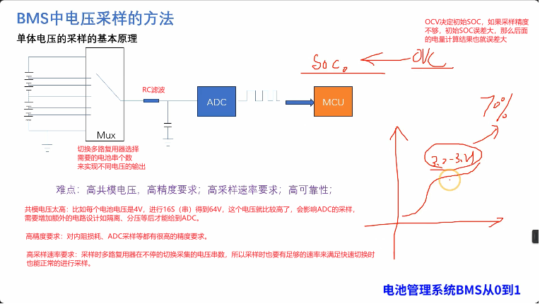  

## 分立器件采样单体电压
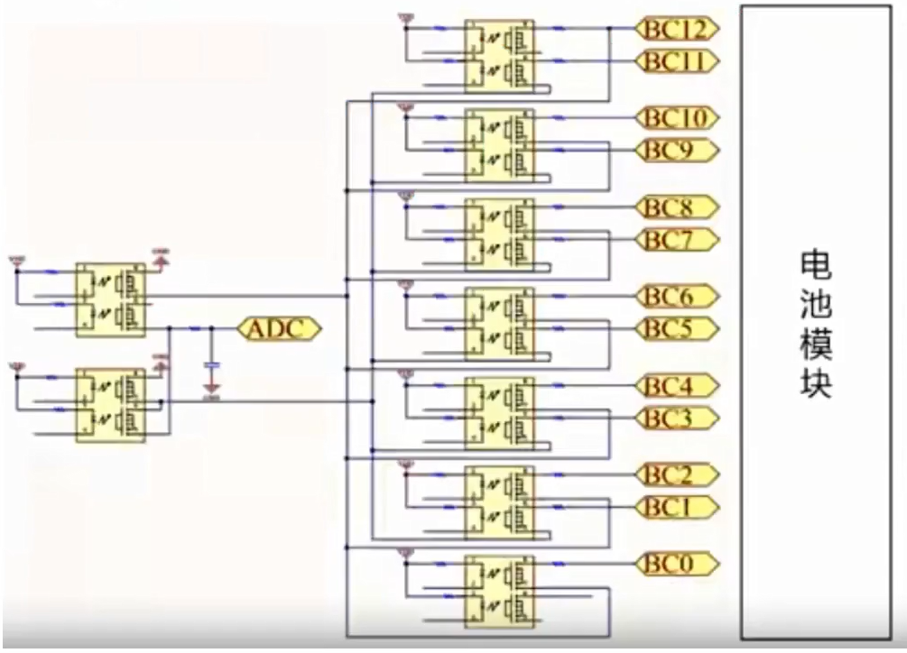  
传统方式，通过切换不同的通道得到电池的单体电压，然后输入到ADC里。传统方式采样速率、精度、可靠性这些都较差。

## AFE采样单体电压
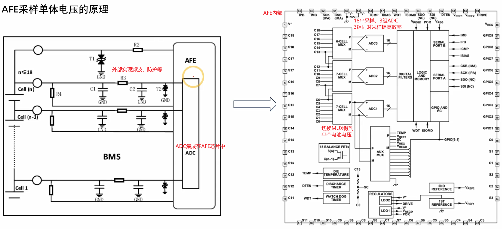  

# 主流BMS硬件拓扑结构
主流的BMS分为集中式，主从式，菊花链三种架构：
  
### 集中式
控制板和采集板在一个硬件板子上，实现采集控制功能。成本较低，结构比较简单，适用于小电池包，且总电压及单体采集串数不多的场景。即一个板子包含所有的功能，硬件功能都在一个板子上。
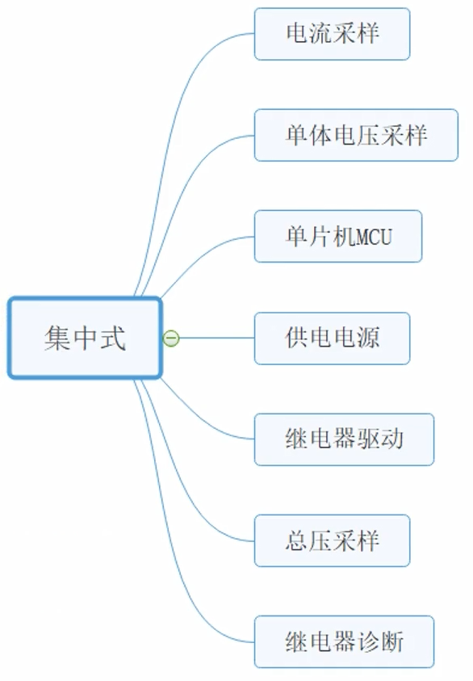  
一块板子包含所有BMS功能。
### 主从式
这种结构相对于比较复杂，一般分为一个一体机包含控制和采集功能，和另外多个采集板，其中采集板都挂在通讯总线上(通过CAN总线)。因为该架构是通过通讯总线连接交互数据信息，所以适用于电池较大，电池由多个模组组成的场景。但成本相对较高。
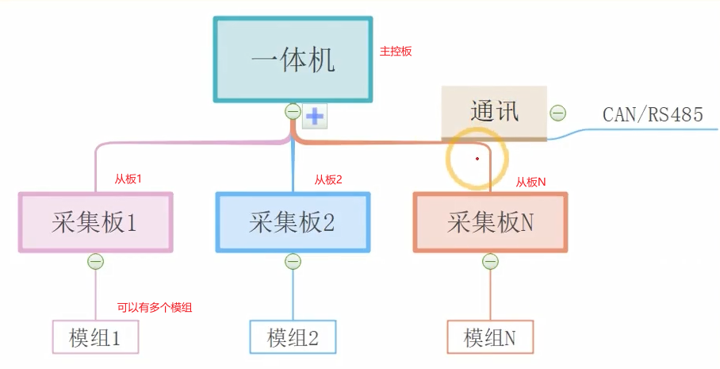  
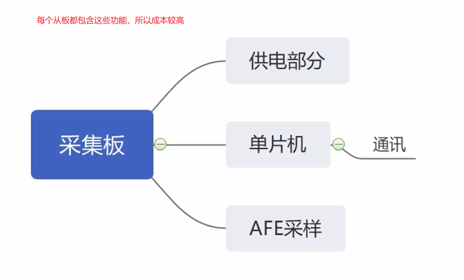  
### 菊花链式
菊花链架构一般用在乘用车或商用车比较多。菊花链架构指的是采集器与主控之间数据交互的方式，现在很多AFE芯片之间通过菊花链形式将数据传递到主控，将多个AFE芯片通过菊花链交互数据，可以达到采集更高串电压的目的。菊花链架构的形式由AFE的形式决定，目前主流的方案，主从式结构中的一体机或从板都为菊花链架构。
菊花链的从板相较于主从式就更为简单，从板只有AFE芯片，不包含MCU、供电等，这些由主控板提供。菊花链形式受距离影响较大，采样板之间不能离得太远。
有些厂家将主控板和采样板都做在一块板子上，只是采样板以菊花链的形式连接到主控板上。
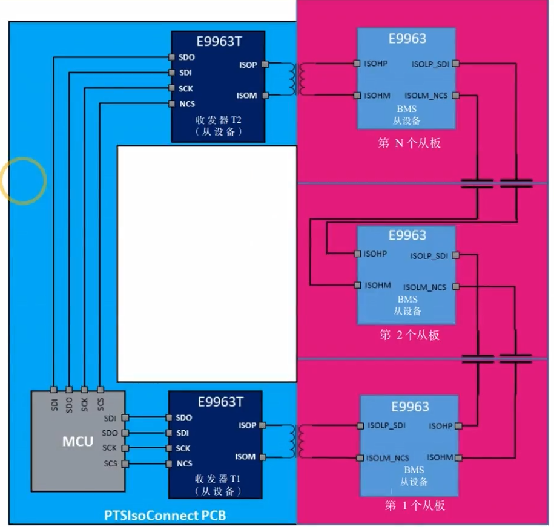  

# BMS的硬件架构
在BMS中，按照电路等级来划分的话，可以分为高压电路(B级)与低压电路(A级)两个部分，等级划分来源于《GB|18384-2020电动汽车功能要求》，如下图所示，我们就根据这个标准去定义每个部分的硬件功能。(如果想了解标准中更多的内容，可以在网上查找到该标准，在硬件设计中很多是参考标准去做的。)
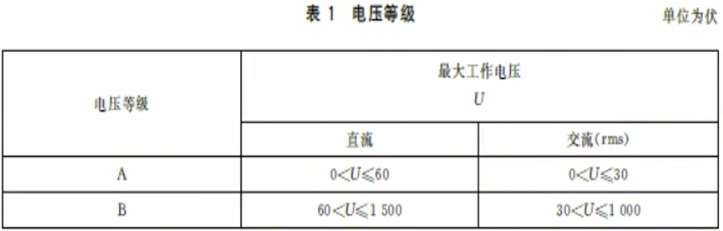  
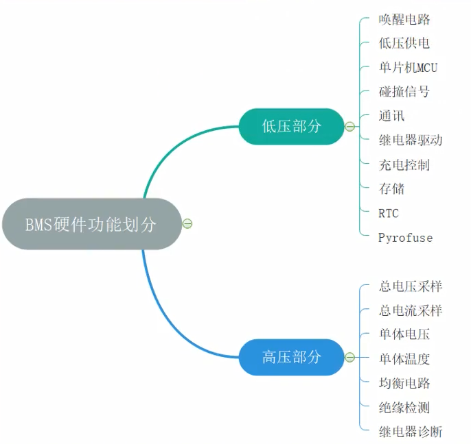  

按照大的硬件架构划分BMS包含主控板和从板，在动力电池中，因电池体积不是很庞大，很多将主控和从板放在一个板子上，成为一体机。下图就是按照功能划分的一体机框架。主要是分为低压和高压部分。
在大型工商业储能系统中，BMS分为三级架构，从下到上分为从控(BMU),主控(BCU),总控(BAU)。
### 低压、高压模块
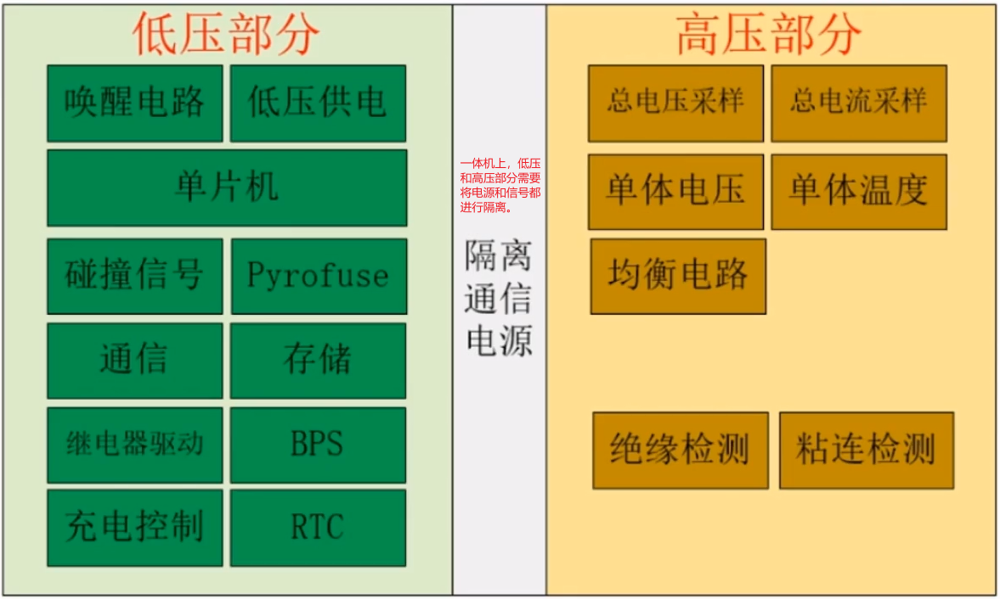  
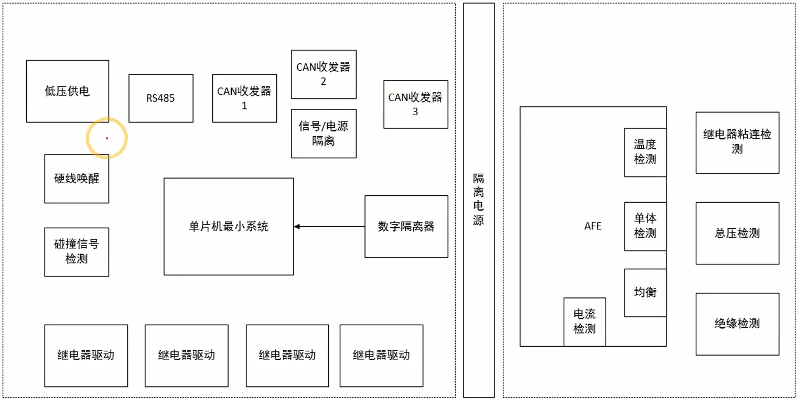  
* 低压部分和高压部分是要进行信息交互的，信号隔离是隔离的干扰信息。
* 低压部分可以单独做成一个主控板。
* 高压部分可以有多个AFE，一个AFE串数有限，当电池包个数太多就需要多个AFE，通常以菊花链的形式连接起来。
### 低压部分模块说明
| 模块       | 功能说明                                                                 | 备注               |
|------------|--------------------------------------------------------------------------|--------------------|
| 唤醒电路   | 在电池包处理休眠状态下时，触发唤醒源的电路                               |                    |
| 低压供电   | 提供给MCU，通讯，RTC，存储等低压模块供电电源                             | 通常为12V或24V     |
| 单片机     | 通讯，数据交互处理，算法及控制逻辑实现                                   |                    |
| 碰撞信号   | 外部碰撞的信号会触发该部分，让BMS系统检测到的电路模块                     | 动力电池常用       |
| 通讯       | 一般有CAN ,LIN,RS485对外通讯，对内SPI，IIC，短距离的UART等，实现对内，对外信息与数据的交互 |                   |
| pyrofuse   | 爆炸熔断器，在电池包发生短路，起火等安全事故时，爆破熔断，以达到切断电源保证安全的目的。 | 动力电池               |
| 继电器驱动 | 驱动继电器关断与闭合的电路                                               | 高边驱动，底边驱动 |
| 存储       | 记录电池数据信息，异常历史记录数据                                       |                    |
| BPS        | 压力传感器，一般在热失控中使用                                           | 动力电池               |
| RTC        | 实时时钟                                                                 |                    |
### 高压部分模块说明
| 模块       | 功能说明                                                                 | 备注   |
|------------|--------------------------------------------------------------------------|--------|
| 总压采集   | 采集整个电池包的总电压                                                   |        |
| 总电流采样 | 采集整个电池包充电或放电的电流                                           |        |
| 单体电压   | 采样整个电池包中单体电芯的电压                                           |        |
| 单体温度   | 采样电池内部的温度，可对每一个单体电芯的温度进行检测                       |        |
| 均衡电路   | 大多数用被动均衡，保证电池处于均衡状态                                     |        |
| 绝缘检测   | 电池包总正或总负对外壳的绝缘电阻                                         | 动力   |
| 粘连检测   | 继电器粘连诊断检测                                                       |        |

### 高低压隔离电源
在高压储能或汽车电池用的高压BMS中，低压部分与高压部分的供电必须要隔离，这样做主要是为安全考虑。(低压与高压之间不共地)高压与低连接关系主要是通过数据交互，即通讯连接。
这里我们不仅要考虑电源的隔离，还要考虑信号的隔离只有高压与低压的信号和电源都隔离了，才叫真正的隔离。
有以下几个地方要做隔离：
1. AFE与AFE之间的隔离：从下图中可以看到，以ADBMSI818为例，AFE与AFE之间通过数字隔离变压器交互数据。这里仅仅是数据通讯的隔离。各个AFE的取电是从电池端来。AFE与MCU之间的交互数据是通过数字隔离变压器和隔离通讯数字芯片。MCU与数字芯片是属于低压部分供电。
**数字隔离变压器和隔离通讯数字芯片就起到了隔离的作用。**
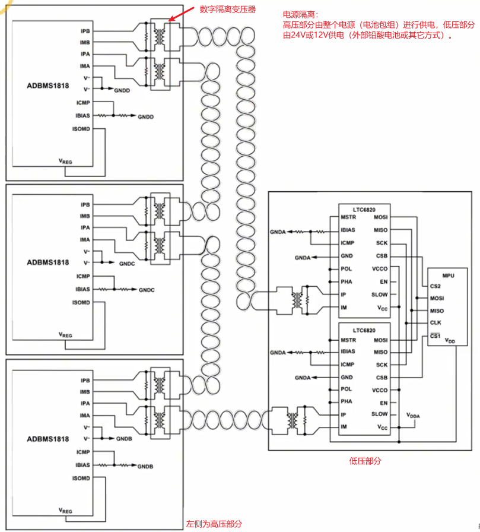  
2. 高压检测的隔离：绝缘电阻检测，继电器粘连检测，本质上就是对高压电压的检测。高压电压的检测部分，需要低压部分得到高压的数据，也需要做电源和信号的隔离。
  
3. 通讯芯片实现外部与内部之间的数据交互：将检测到的信息传送给用户端，可能需要做隔离。
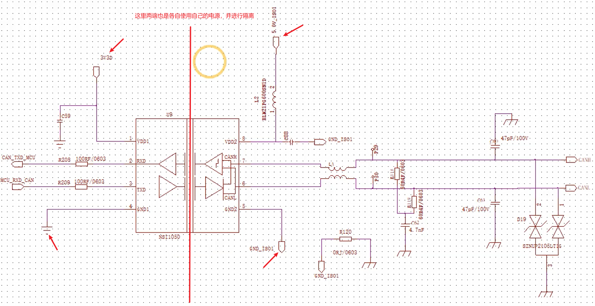  

# MCU最小系统
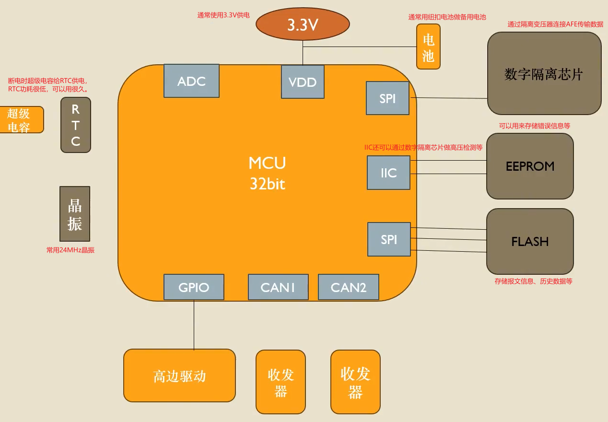  

# 电池总压采样
1. 哪些总电压需要采样?
    * 电池总电压：BMS检测动力电池总电压，并将检测到的数据发送给整车控制器，整车控制器根据接收到的数据判断当前电池状态并发出相应指令，比如是否需要充电，决定充电何时结束、电池是否正常。
    * 电池继电器的前后的电压：检测主正、主负接触器前、后电压并根据电压差来判断接触器的粘连情况和接触电阻老化情况。
2. 如何进行总压的采样
    * 通过电阻分压进行采样
    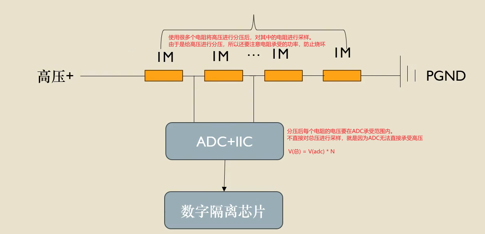  
    * 通过电芯电压的累计
    $V_{total}=V_{CELL1}+V_{CELL2}+...+V_{CELLN}$
    通过MCU读取各个电芯的电压，最终通过电芯电压的累加和得到总压。
    这种方式的缺点：
        1. 容易产生误差。每个电芯在测量的时候都会有一点点误差，如果电芯数量很多，误差又都往一边偏，误差累加起来就会比较大。
        2. 如果某一条采样线断了，那么总压就差很多。
        **所以这种方式通常作为电压采样的冗余设计，而不作为主要方式。**

# 电芯电压采样
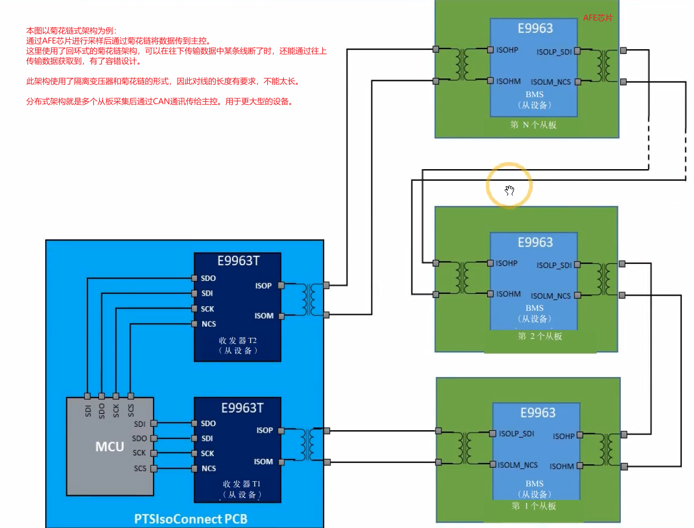  

# 电池包内部故障怎么办？
一个电池包内部包含多个电池，而BMS的采集线是连接在电池包上对整个模块进行采集，所以无法及时发现模块内部单电芯的故障。因此需要想办法解决此问题。
解决方法从BMS软件层面和硬件设计两方面入手。
### 模块内单节电芯失效的场景与BMS的应对

假设一个由4节电芯并联组成的模块。BMS只有一对采样线接在这个模块的总正极和总负极上。

#### 场景一：电芯内部短路（最危险的情况）

*   **发生了什么？** 模块中的某一节电芯发生了内短路。它的电压会急速下降，并开始剧烈发热。
*   **BMS能发现吗？** **很难立即通过电压发现！** 因为其他三节好的电芯会通过并联连接拼命给这节坏的电芯“充电”，试图把整个模块的电压拉平。BMS读取的**模块总电压可能暂时完全正常**。
*   **危险何在？** 巨大的电流会在并联组内部循环，导致坏的电芯温度急剧升高（热滥用），最终可能引发热失控，并蔓延到整个模块。
*   **BMS的间接防御手段：**
    1.  **温度监测（Temperatue Monitoring）**：这是最关键的一道防线！好的BMS会在每个模块上布置**多个温度传感器（NTC）**。当某个点温度异常升高时，BMS会立即报警并切断回路。
    2.  **电流监测**：虽然电压不变，但系统可能会检测到异常的电流波动或库仑效率（充入电量与放出电量不匹配）。
    3.  **电压缓慢变化**：长期来看，这个有问题的模块其充电和放电速度会和其他模块不一致，导致模块间电压差异（不一致性）变大，BMS的均衡系统会告警。

#### 场景二：电芯断路（开路）

*   **发生了什么？** 模块中某一节电芯内部连接断开。
*   **BMS能发现吗？** **基本无直接危险，但会影响性能。** 这节电芯不再工作，整个模块的有效容量会减少（例如4节变3节）。BMS读取的仍然是整个模块的电压，所以无法直接知道有一节已经失效。
*   **如何发现？** 在充放电时，这个模块的电压变化会比其他模块更快（因为实际容量变小了）。在充电时，它会最先充满；放电时，它会最先放空。BMS通过监测各模块间的**电压差异**，可以判断出某个模块可能存在问题。

#### 场景三：电芯严重老化，容量骤减或内阻激增

*   **发生了什么？** 模块中某一节电芯性能远远落后于其他电芯。
*   **BMS能发现吗？** 和断路类似，BMS无法直接定位到是哪一节，但会发现这个**整个模块**的内阻变大、容量变小，与其他模块不一致，从而提示故障。

---

### 系统级的安全设计（第二道防线）

为了降低这种风险，电池包的设计不会只依赖BMS的软件算法，还会有硬件保护：

1.  **每节电芯配备保险丝（Fuse）**：在一些高端或严谨的设计中，**每个并联组内的每节电芯**都会串联一颗微小的保险丝。如果某节电芯发生严重短路，巨大的环流会首先熔断这节电芯的保险丝，将其从并联组中隔离，从而保护整个模块。这是最有效的物理防护手段。
2.  **物理隔离与热管理**：用物理隔断和高效的冷却系统（如液冷）来延缓或阻止热失控在模块内部的蔓延。
3.  **泄压阀（Vent）**：每个电芯都有泄压阀，在内部压力过大时定向释放，防止爆炸。

### 总结
换句话说，BMS虽然不是“火眼金睛”能直接看穿每一个电芯，但它作为一个“智能指挥官”，通过综合判断电压、温度、电流等多种情报，并依靠硬件上的“哨兵”（保险丝、泄压阀），依然能够有效地保卫整个电池系统的安全。