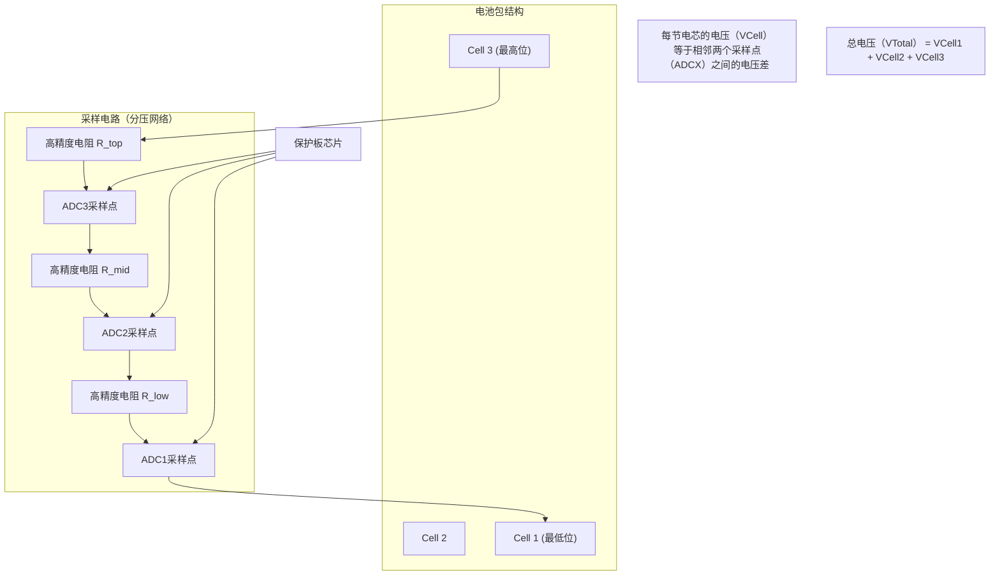

# 为什么需要保护板
保护板（BMS - Battery Management System，电池管理系统）是锂电池组的“大脑”和“守护神”，它的存在至关重要，主要原因有以下几点：

### 1. 核心安全防护（防止“车毁人亡”）

这是保护板最首要、最关键的使命。锂电池本身的化学特性非常活跃，必须在安全的电压和电流范围内工作。

*   **过充保护（Overcharge Protection）**
    *   **危险：** 当电池已经充满（如4.2V），如果继续充电，锂离子会过度嵌入负极，导致正极结构崩塌、产热，并析出金属锂。这极易引发**短路、鼓包、起火甚至爆炸**。
    *   **保护板的作用：** 保护板会实时监测每一节电芯的电压。达到充电截止电压时，它会自动切断充电回路，停止充电。

*   **过放保护（Over-discharge Protection）**
    *   **危险：** 将电池电量耗尽（如电压低于2.5V）再继续放电，会导致电池负极的铜集流体溶解，并在下次充电时析出金属铜枝晶，刺穿隔膜，造成**永久性损坏和内部短路**，同样有起火风险。
    *   **保护板的作用：** 当监测到电压过低时，保护板会切断放电回路，设备会自动关机，防止电池被“榨干”。

*   **过流/短路保护（Over-current/Short-circuit Protection）**
    *   **危险：** 当电池输出电流太大（如电机卡死）或正负极直接短路时，会产生巨大的热量，瞬间烧毁导线、引发火灾。
    *   **保护板的作用：** 保护板能检测到异常大的电流，并在毫秒级的时间内迅速切断电路，就像家里的“保险丝”一样。

### 2. 延长电池寿命（当好“管家”）

除了保命，保护板还能细心照料电池，让它用得更久。

*   **均衡功能（Balancing）**
    *   **问题：** 一个电池组通常由多节电芯串联而成（比如3串就是11.1V）。由于制造工艺的微小差异，没有任何两节电芯的性能是完全一致的。在多次充放电后，这些电芯的电压会产生差异（不一致）。
    *   **后果：** 充电时，有的电芯先满了，但其他的还没满。为了保护先满的电芯不过充，保护板会停止充电，导致整组电池永远无法充满。放电时，电量少的电芯会先被过放，从而加速损坏。**木桶效应**在这里非常明显——整组电池的寿命取决于最差的那一节电芯。
    *   **保护板的作用：** 带均衡功能的保护板，会在充电末期，对电压较高的电芯进行单独放电（或将其能量转移给电压低的电芯），让所有电芯的电压趋于一致，从而保证整组电池的容量和寿命。

### 3. 其他重要功能

*   **温度监控（Temperature Monitoring）**
    *   电池在高温下充电/放电非常危险。保护板通常装有温度传感器（NTC），当检测到温度异常（如超过60°C）时，会断开电路，停止工作，待温度恢复正常后再启用。

*   **通信与状态显示（Communication & Status Display）**
    *   高级的保护板（BMS）可以通过数据线（如SMBus）与设备通信，提供精确的剩余电量（电量计）、健康状态、循环次数等信息。你手机上显示的电池百分比，就是来自这方面的数据。

### 总结与比喻

| 风险         | 无保护板的后果           | 保护板的作用           |
| :----------- | :----------------------- | :--------------------- |
| **过充电**   | 起火、爆炸               | 电压达上限时停止充电   |
| **过放电**   | 永久损坏、存在短路风险   | 电压达下限时停止放电   |
| **过大电流** | 发热、烧毁、起火         | 瞬间切断电路           |
| **电芯不均** | 容量骤减、寿命大幅缩短   | 均衡电芯电压           |
| **温度过高** | 加速老化、有热失控风险   | 高温暂停工作           |

**所以，结论是：**

**任何正规的、用于商业产品的锂电池组（无论是手机、笔记本还是电动车）都必须配备保护板。** 这是绝对的安全底线。我们平时看到的18650等电芯，如果是“裸奔”单独出售的，那它注定要被组装成带保护板的电池组才能安全使用。

# 小型的保护板能称为BMS吗？
严格来说，**即使是最小、功能最简单的保护板，其本质也是一个BMS（电池管理系统）**，但通常我们会在行业和实践中进行更细致的区分。

在日常使用、采购和行业交流中，人们通常会根据**功能的复杂程度**来区分这两个术语：

| 特性 | **保护板 (Protection Circuit Module, PCM)** | **电池管理系统 (Battery Management System, BMS)** |
| :--- | :--- | :--- |
| **核心功能** | **基础安全保护** | **全面管理 + 高级功能** |
| **典型功能** | 过充、过放、过流、短路保护 | **包含所有PCM功能**，外加：  - **电量均衡** (被动/主动)  - **电量计算** (库仑计)  - **温度监控** (多个传感器)  - **通信接口** (如UART, CAN, I2C)  - **状态显示**  - **故障诊断**  - **历史数据记录** |
| **硬件复杂度** | 低，通常只有一个保护IC和几个MOSFET | 高，通常以MCU（微控制器）为核心，集成更多外围电路 |
| **应用场景** | 消费电子产品（手机、蓝牙耳机、移动电源）、单节或两节电池应用 | 电动汽车、电动自行车、大型储能系统、多节串联电池组（如无人机、笔记本） |
| **比喻** | **一个尽职的门卫**：只负责开关大门，检查进出人员的基本安全。 | **一个专业的安保指挥中心**：不仅有门卫，还有监控系统、调度中心、数据分析员和对外通信。 |

**“均衡功能”** 是区分传统保护板和智能BMS的一个非常关键的分水岭。简单的单节/两节电池保护板通常**没有均衡功能**，因为不存在串联合联电芯之间的电压差异问题。而一旦电池组需要多节串联（3串及以上），**均衡就变得至关重要**，具备此功能的系统会毫无争议地被称为BMS。

# 为什么B-和P-要接粗线
简单直接的回答是：**因为B-线需要承担电池组放电和充电的全部电流，电流非常大，所以必须使用很粗的线来防止过热、减少能量损耗并确保安全。**

下面我们来详细解释一下原因：

### 1. 电流与发热（核心原因：焦耳定律）

这是最根本的物理学原理。导线有电阻，当电流流过时，会发热。产生的热量遵循 **焦耳定律**：Q = I² * R * t
*   **Q** 是产生的热量
*   **I** 是流过导线的电流
*   **R** 是导线本身的电阻
*   **t** 是时间

**关键点在于，发热量与电流的平方（I²）成正比。** 这意味着电流稍微增大一点，发热量会急剧增加。

*   **举例**：一个电动工具的电池组，工作电流可能达到20A甚至30A以上。
    *   如果使用细线，电阻R较大，根据公式，会产生大量热量，可能烫坏线材绝缘皮，甚至引发火灾。
    *   使用粗线，可以显著降低电阻R，从而在相同电流下，产生的热量大大减少。

### 2. 减小电压降，提升效率

导线有电阻，电流流过时就会产生电压降（U = I * R）。
*   **电压降意味着能量损耗**：这部分能量没有输送给用电器（比如电机），而是白白浪费在线材上变成了热量，导致电池组效率降低。
*   **影响设备性能**：对于电机这类设备，电压降低会导致功率下降，表现为“没劲儿”。设备可能会因为检测到低电压而提前关机。
*   使用粗线可以减小电阻R，从而减小电压降，让电池的能量更高效地输送给设备。

### 3. B-线的特殊角色

要理解为什么是B-线需要这么粗，我们需要看保护板的接线原理：

*   **B-（电池负极）**：这根线直接连接**电池包**的总负极。**所有流出和流入电池包的电能都必须经过这根线。** 它是电流的“主干道”。
*   **P-（输出/输入负极）**：这根线连接**用电器或充电器**。电流同样要经过它，但它之后就会分散到各个设备了。

**可以把电池组想象成一个水塔：**
*   **电芯**是水库里的水。
*   **保护板**是水闸和控制系统。
*   **B-线**是连接水库和水闸的那根**主水管**，所有水都必须从这根管子流过。
*   **P-线**是水闸出来之后通往用户的水管。

主水管（B-线）的粗细决定了整个系统的供水（供电）能力。如果主水管很细，即使用户家的水管很粗，也得不到足够的水流。

### 与其他线路的对比

*   **电芯采样线（Balance Lines）**：这些细线只负责检测每个电芯的电压，几乎不流过电流（通常只有毫安级），所以不需要很粗。它们的任务是指挥，而不是干重活。
*   **温度传感器线（NTC）**：同样只传递微弱的信号电流，所以也很细。

### 总结

锂电池保护板的 **B-线需要接很粗的线**，主要原因有三：

1.  **安全第一**：防止大电流下导线过热，引发绝缘皮熔化、短路或火灾风险。
2.  **保证性能**：减小电压降，确保设备能获得足够的电压以发挥全部功率，避免提前低压关机。
3.  **提高效率**：减少能量在线路上的损耗，让电池的续航更长。

**选择多粗的线取决于电池组的最大持续放电电流**。通常可以参考线材的“载流量”表来选择。例如，10A电流可能选择16AWG线，20-30A电流会选择12AWG或10AWG线，更大电流的电池组甚至会使用更粗的线或铜条。

**P-线和B-线同理，电流从B-进入，经过MOS管、继电器等保护措施，再从P-出去。所以P-承受的电流和B-是相同的，也需要相同的粗线。**

# 为什么采集线可以很细
采集线的路径和用电设备是不同的两条路径。
用电设备：电池组总负极 -> B- -> P- -> 用电器 -> P+(非必须) -> 电池组总正极
采集线：电池组总负极 -> B-(采集口) -> 各个电芯的采集端 -> 电池组总正极
**所以，采集功能是独立供电的，没和用电器串联在一起，而是并联。**

而采集线上连接着很大的电阻，100kΩ甚至1MΩ，电流就只会有很小部分通过，所以不需要很粗的线。

## 为什么没有P+
没有 P+ 的保护板通常被称为 **“同口保护板”** 或 **“同口同充放”**。

### 1. “同口”与“分口”保护板

首先，我们要理解两种保护板的区别：

*   **分口保护板**：
    *   有明确的 **P+** 和 **P-** 两个输出端口。
    *   **充电**和**放电**的电流路径是**分开**的。
    *   **接线**：充电器接 `P+` 和 `P-`；用电器也接 `P+` 和 `P-`。
    *   **特点**：内部电路更复杂一些，成本稍高。

*   **同口保护板**：
    *   只有 **P-** 和 **B-** 等端口，**没有单独的 P+ 端口**。
    *   **充电**和**放电**共用**同一个**电流路径。
    *   **特点**：结构更简单，成本更低，非常常见。

### 2. 同口保护板的工作原理

这种保护板之所以不需要独立的 P+ 端口，是因为：

**电池组的总正极（B+）直接作为输出正极使用！**

它的接线和工作方式如下：

1.  **正极连接**：电池组的总正极（B+）**不接任何线到保护板上**，而是直接用一根**很粗的导线**引出来，作为对外输出的**正极（正极输出线）**。
2.  **负极连接**：电池组的总负极（B-）用粗线连接到保护板的 **B-** 端口。
3.  **输出/输入**：保护板的 **P-** 端口，就是整个电池包的**输出/输入负极**。

**电流路径如下：**
*   **放电时**：
    `电池总正极 (B+)` → `用电器` → `P-端口` → `保护板内部（放电MOS管导通）` → `B-端口` → `电池总负极 (B-)`

*   **充电时**：
    `充电器正极` → `电池总正极 (B+)` → `电池总负极 (B-)` → `B-端口` → `保护板内部（充电MOS管导通）` → `P-端口` → `充电器负极`

您会发现，无论是充电还是放电，电流都**必须流经保护板**，因此保护板可以同时对充电和放电过程进行控制和管理。

### 总结对比
| 特性 | **分口保护板** | **同口保护板** |
| :--- | :--- | :--- |
| **端口** | 有 **P+** 和 **P-** | **没有P+**，只有 **P-** 和 **B-** |
| **正极输出** | 来自保护板的 **P+** 端口 | **直接来自电池总正极 (B+)** |
| **充放电路径** | 充电和放电路径**分离** | 充电和放电**共用同一路径** |
| **成本** | 稍高 | 更低，更常见 |
| **接线** | 稍复杂，正负极都接到保护板 | 简单，正极直接引出，负极接保护板 |

## 采集线电阻的作用
在保护板的电压采样电路中，每两根采集线之间（或者说，每个电芯的正负极之间）都连接着一个**精度非常高、阻值非常大**的电阻。

这些电阻构成了一个至关重要的电路——**电阻分压网络**。

下面我为您详细解释为什么需要这些大电阻以及它们是如何工作的：

### 1. 为什么需要大电阻？—— 精度与功耗的平衡

*   **核心目的：精确测量电压**
    保护板芯片无法直接测量高达几伏特的电芯电压。它的模数转换器（ADC）输入范围通常是固定的（比如0-5V）。分压电阻网络的作用就是将电芯的电压（例如3.7V）按比例缩小到一个适合芯片测量的范围。

*   **为什么“大”电阻？**
    1.  **减小功耗，避免耗电**：这是最主要的原因。根据公式 P = V² / R，功率（P）与电阻（R）成反比。如果电阻很小（比如1kΩ），在一个4V的电芯上会产生 P = (4²) / 1000 = 0.016W 的功耗，虽然不大，但多个电阻加起来，会持续消耗电池电量，影响待机时间。而如果使用**很大的电阻（比如100kΩ甚至1MΩ）**，功耗会急剧下降：P = (4²) / 100,000 = 0.00016W，几乎可以忽略不计，从而实现了**超低静态功耗**。
    2.  **避免影响测量精度**：如果电阻太小，流过分压电路的电流就会较大。采样线路很细，其本身的微小电阻（线阻）就会在这个电流下产生不可忽略的电压降，从而导致测量到的电压低于电芯的真实电压。使用大电阻后，流过的电流极小（微安级），细导线上的压降也近乎为零，测量结果就非常精准。

### 2. 它是如何工作的？—— 分压原理

电阻分压网络是模拟电路中最基础的电路之一。其工作原理如下图所示：

通过测量 `ADC1`, `ADC2`, `ADC3` 对地（B-）的电压，芯片内部程序通过减法运算即可得到每一节电芯的真实电压：
*   **Cell1 电压** = V_ADC1
*   **Cell2 电压** = V_ADC2 - V_ADC1
*   **Cell3 电压** = V_ADC3 - V_ADC2

### 3. 电阻的要求：高精度与匹配性

这些电阻不仅仅是“大”，更重要的是：
*   **高精度**：通常使用 **1%** 甚至 **0.1%** 精度的电阻。如果电阻值偏差很大，分压比例就不准，会导致芯片读出的电压值严重失准，造成保护功能失效。
*   **良好的温度稳定性**：阻值不能随温度变化而剧烈波动。
*   **匹配性**：所有电阻的温度系数和精度最好一致，这样才能保证在整个工作温度范围内，测量都是准确的。

### 总结

所以，保护板采样线之间确实连接着**阻值很大、精度很高**的电阻，它们构成了一个**分压网络**，其主要作用是：
1.  **为芯片ADC提供适合测量的电压范围**。
2.  **将功耗降到极低，几乎不消耗电池电量**。
3.  **确保电压采样的高精度和可靠性**，从而保障电池安全。

正是这个巧妙的设计，使得保护板能够用极细的采样线，几乎不耗电地完成对电芯电压的精准监控。

#### 电阻材料
采集线上的电阻并不是用“线”的材质做的，它们通常是独立的分立电子元件，最常用的是厚膜工艺制成的贴片电阻，其核心材料是钌氧化物（RuO₂）或类似的金属陶瓷材料。

# 采集线接错会怎样
采集线（均衡线）接错的情况非常危险，是组装锂电池时**最严重的错误之一**。它**几乎必然会导致保护板瞬间烧毁**，并可能引发电池短路等风险。

让我们来详细分析会发生什么：

### 1. 电压感知完全错乱（核心问题）

保护板芯片通过采集线来感知**每节电芯**的电压。接错线意味着芯片“看”到的世界和现实世界是完全错乱的。

**假设一个3节电池串联（3S）的例子：**
*   **正确接法**：
    *   线1（B0）： 接总负极（0V）
    *   线2（B1）： 接第1节正极/第2节负极（~3.7V）
    *   线3（B2）： 接第2节正极/第3节负极（~7.4V）
    *   线4（B3）： 接总正极（~11.1V）
    *   芯片计算：`Cell1 = B1 - B0 = 3.7V`, `Cell2 = B2 - B1 = 3.7V`, `Cell3 = B3 - B2 = 3.7V`

*   **错误接法**（B1和B2接反）：
    *   线1（B0）： 接总负极（0V）**（正确）**
    *   线2（B1）： **本应接3.7V，却接到了7.4V**（接错了）
    *   线3（B2）： **本应接7.4V，却接到了3.7V**（接错了）
    *   线4（B3）： 接总正极（~11.1V）**（正确）**
    *   芯片会**按照它固有的逻辑**去计算，但它读取的电压值是错的：
        *   `Cell1（芯片以为） = B1（实际7.4V） - B0（0V） = 7.4V`
        *   `Cell2（芯片以为） = B2（实际3.7V） - B1（实际7.4V） = -3.7V`
        *   `Cell3（芯片以为） = B3（11.1V） - B2（实际3.7V） = 7.4V`

### 2. 导致的严重后果

根据上述错误的电压值，会发生以下一种或多种情况：

1.  **过压保护（OVP）误触发或烧毁芯片**：
    *   芯片检测到 `Cell1` 和 `Cell3` 的电压竟然高达 `7.4V`（远超过锂电的4.2V-4.35V保护电压）。
    *   **后果**：保护板会立即触发过压保护，切断充电回路（如果此时在充电）。更可能的是，如此高的电压**直接超过了芯片采样引脚所能承受的最大电压范围**，导致采样电路被**击穿烧毁**。芯片会永久性损坏。

2.  **负压报警或逻辑错误**：
    *   芯片检测到 `Cell2` 的电压是 `-3.7V`，这是一个完全不可能且非法的值。
    *   **后果**：芯片的逻辑电路可能会陷入混乱，报错，或直接锁死/宕机。

3.  **均衡功能彻底混乱**：
    *   如果芯片没有立即烧毁，它可能会试图去“均衡”它认为电压过高的电芯（实际上是正常的电芯），或者对它认为电压异常的电芯进行错误操作，进一步加剧电池组的不平衡。

4.  **物理短路风险**：
    *   采集线排线本身非常密集，在接错的情况下，很容易在排线插头或PCB上导致原本不该连接的点之间发生短路，例如让两节电芯的正负极直接短接，瞬间产生巨大电流，烧毁排线。

### 如何避免
1.  **接线前再三确认**：在给保护板通电前，必须用万用表逐根测量，确保每一根采集线的电压与它在排线上的顺序完全对应。
2.  **遵循顺序**：必须从电池组的**总负极（B-）开始，依次向上**连接（B0->B1->B2->B3...）。
3.  **使用顺序式接线法**：先只接最靠近B-的第一根线，确认无误后再接第二根，以此类推。

