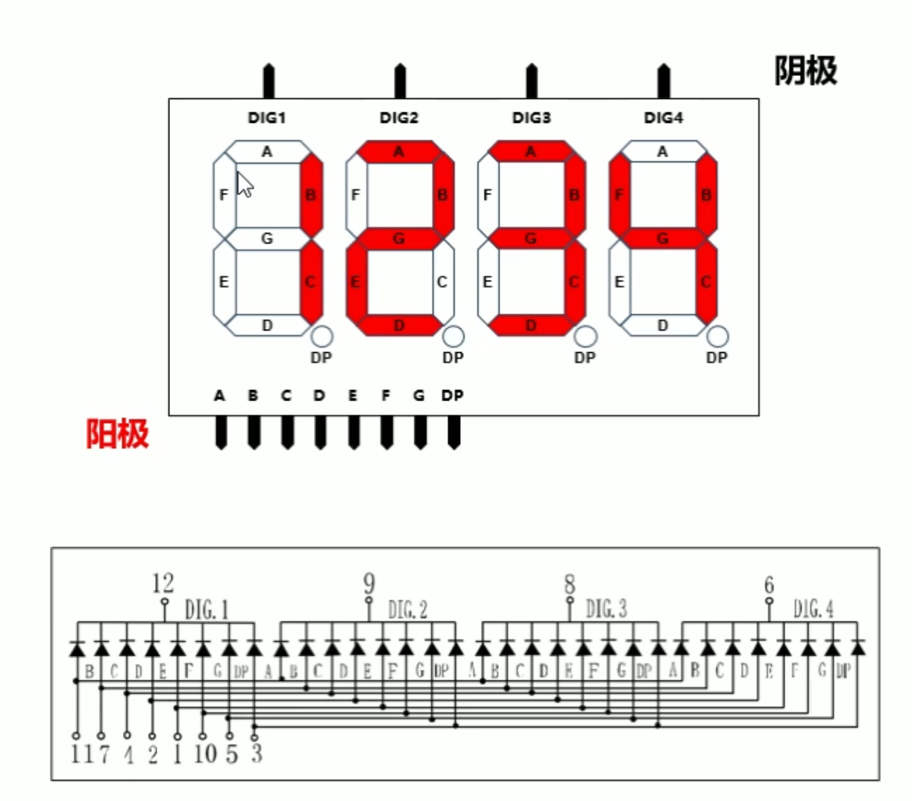
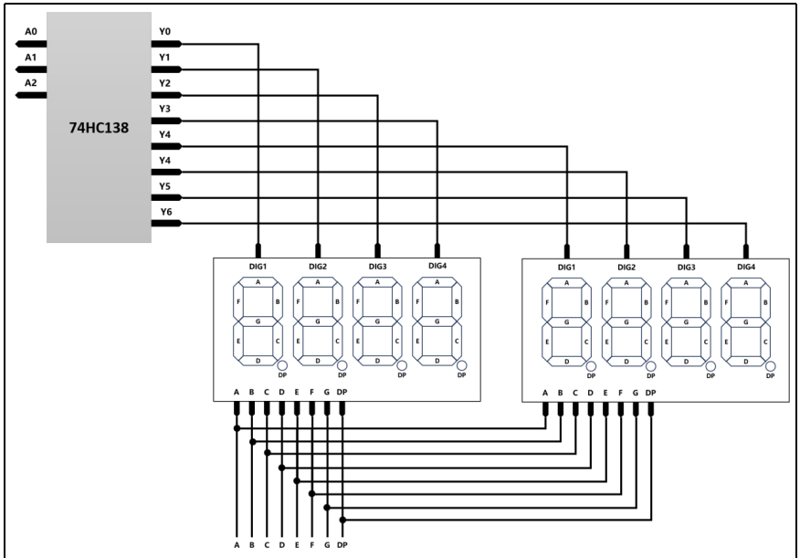
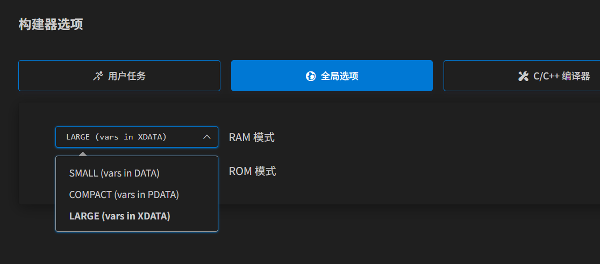
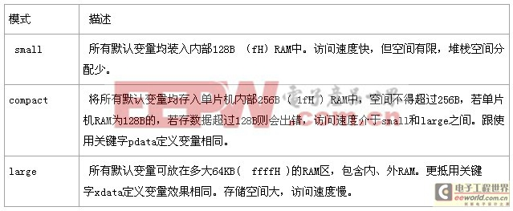

# 动态扫描
  
这个图中 ，通过电路可以看出我们要显示1234是无法“正常”实现的。要实现同时显示1234的效果只有快速的切换4个数码管的显示内容，从而欺骗眼睛达到同时显示1234的目的。
实际上显示器也是类似的实现原理，不会每个像素点都接一个单独的控制器。

在电路设计中，可以使用三八译码器等设计来减少引脚的占用。
  

# 内存
51单片机的，声明的变量、函数、数组等过多都可能导致内存不足，所以在编写代码时要注意这点。
然后项目配置时也可以修改内存配置，如下图所示，构建器选项中 RAM 模式默认是 SMALL，修改为 LARGE 也能增加内存的使用。
  
  

另外，在编译器中配置优化级别也可以优化内存的使用等：
* 0级优化：
    1. 常数折叠：只要有可能，编译器就执行将表达式化为常数数字的计算，其中包括运行地址的计算。
    2. 简单访问优化：对8051系统的内部数据和位地址进行访问优化。
    3. 跳转优化：编译器总是将跳转延至最终目标上，因此跳转到跳转之间的命令被删除。
* 1级优化：
    1. 死码消除：无用的代码段被消除。
    2. 跳转否决：根据一个测试回溯，条件跳转被仔细检查，以决定是否能够简化或删除。
* 2级优化：
    1. 数据覆盖：适于静态覆盖的数据和位段被鉴别并标记出来。连接定位器BL51通过对全局数据流的分析，选择可静态覆盖的段。
* 3级优化：
    1. “窥孔”优化：将冗余的MOV命令去掉，包括不必要的从存储器装入对象及装入常数的操作。另外如果能节省存储空间或者程序执行时间，复杂操作将由简单操作所代替。
* 4级优化：
    1. 寄存器变量：使自动变量和函数参数尽可能位于工作寄存器中，只要有可能，将不为这些变量保留数据存储器空间。
    2. 扩展访问优化：来自IDATA、XDATA、PDATA和CODE区域的变量直接包含在操作之中，因此大多数时候没有必要将其装入中间寄存器。
    3. 局部公共子式消除：如果表达式中有一个重复执行的计算，第一次计算的结果被保存，只要有可能，将被用作后续的计算，因此可从代码中消除繁杂的计算。
    4. CASE/SWITCH语句优化：将CASE/SWITCH语句作为跳转表或跳转串优化。
* 5级优化：
    1. 全局公共子式消除：只要有可能，函数内部相同的子表达式只计算一次。中间结果存入一个寄存器以代替新的计算。
    2. 简单循环优化：以常量占据一段内存的循环再运行时被优化。
* 6级优化：
    1. 回路循环：如果程序代码能更快更有效地执行，程序回路将进行循环。
* 7级优化：
    1. 扩展入口优化：在适合时对寄存器变量使用DPTR数据指针，指针和数组访问被优化以减小程序代码和提高执行速度。
* 8级优化：
    1. 公共尾部合并：对同一个函数有多处调用时，一些设置代码可被重复使用，从而减小程序代码长度。
* 9级优化：
    1. 公共子程序块：检测重复使用的指令序列，并将它们转换为子程序。C51甚至会重新安排代码以获得更多的重复使用指令序列。

**当然，优化级别并非越高越好，应该根据具体要求适当选择。**

# code 关键字
C51 的内存大小有限，当要声明大的数据时很容易导致内存不足无法编译，此时可以使用C51提供的 `code` 关键字声明，数据就会被存储在 ROM 中以节省内存空间，不过 code 声明的数据不能修改，视作常量。
```c
code const u8 Int_Oled_Font[][16]= {
    // 这里是个很大的数组。。。
};
```
### C51 特定关键字
* bit：用于定义位变量，占用 1 位内存。
* sfr：用于定义特殊功能寄存器，映射硬件寄存器地址。
* sbit：用于定义特殊功能寄存器中的位。
* data：用于将变量存储在内部数据存储器中。
* idata：用于将变量存储在内部间接数据存储器中。
* pdata：用于将变量存储在页间接数据存储器中。
* xdata：用于将变量存储在外部数据存储器中。
* code：用于将常量或只读数据存储在程序存储器（ROM）中。
* bdata：用于将变量存储在位寻址区域中。
* interrupt：用于定义中断服务函数。
* using：用于指定寄存器组，以优化寄存器使用。
* reentrant：用于定义可重入函数，允许函数在中断中被调用。

# 32.768kHz
$2^{15}$是32768，32.768kHz通过15次二分频就能得到频率是1Hz的信号。
32.768KHZ的晶振常用于RTC(实时时钟)电路，因为其频率经过15次分频可得到1HZ的秒脉冲，适合时间计算。RTC电路包含RTC芯片，通常连接纽扣电池以保持断电时的时间。MCU通过IIC总线读取RTC时间信息。
[32.768KHZ的晶振有什么用](https://blog.csdn.net/weixin_42693097/article/details/130418675)