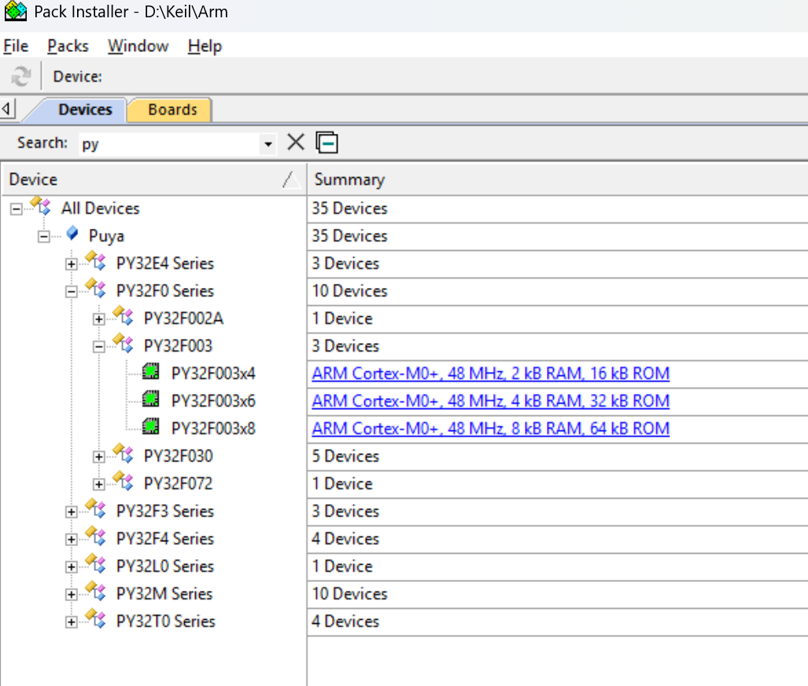

# 寄存器和变量的区别
寄存器从软件的角度确实很像变量。但是更准确地说，**嵌入式中的寄存器同时具备了“变量”和“硬件开关”的双重属性**。

下面我们来详细拆解这个类比，这能帮助您更深刻地理解嵌入式的本质。

### 相似之处：确实像“变量”

从纯粹的软件视角看，您的类比完全正确：

1.  **有地址和内容**：就像一个变量有内存地址和存储的值一样，一个硬件寄存器也有一个绝对的内存映射地址（或端口地址），并且其内部有特定的比特位（Bit）存储着数据。
2.  **可读可写**：大多数寄存器都可以通过程序进行读取和写入操作，这就像对变量进行赋值和读取其值。
    *   `variable = 100;` （给软件变量赋值）
    *   `GPIOA->ODR = 0x80;` （给STM32的GPIO输出数据寄存器赋值，从而控制引脚的输出电平）

在这个层面上，程序员确实像是在操作一些定义在特定地址上的“特殊变量”。现代嵌入式开发中，芯片厂商提供的**硬件抽象层（HAL）库**或**设备驱动包**，正是通过头文件定义了大量的结构体和宏，把这些寄存器“包装”成了看起来像变量一样的东西，极大地简化了开发。

---

### 关键区别：它更是“硬件开关”

这才是理解寄存器最核心的部分。**操作寄存器本质上是在直接配置和操控硬件电路**，这与操作纯软件变量有天壤之别。

| 特性 | 互联网开发中的变量/常量 | 嵌入式开发中的寄存器 |
| :--- | :--- | :--- |
| **本质** | **软件概念**：是内存中的一块数据区域，用于存储程序运行时的信息。 | **硬件概念**：是CPU与外部设备（如GPIO, UART, SPI, ADC）之间的**硬件接口**或**控制开关**。 |
| **操作后果** | 改变的是软件自身的状态。通常不会直接导致物理世界发生变化。 | **直接改变硬件电路的工作状态**。例如：  • 写一个比特到寄存器，可能让一个LED灯亮灭、电机启动。  • 读一个寄存器，是在读取物理引脚上的实际电压电平。 |
| **行为** | 行为是可预测的、确定的。`a = 5;` 之后 `a` 一定是 `5`。 | 行为可能受**物理世界**影响。你写入一个值，但读回来可能不同（例如，配置了输入模式时，读的是外部引脚状态）。某些位可能是**只读**的（如状态寄存器），反映了硬件的实时状态。 |
| **易失性** | 变量值由程序控制。 | 寄存器值可能被**硬件自身**改变（例如，串口接收到数据后，硬件会自动置位“接收完成”标志位）。因此必须用 **`volatile`** 关键字声明，防止编译器做错误优化。 |
| **地址意义** | 地址由操作系统在内存中分配，是**逻辑地址**。 | 地址由**芯片手册**固定规定，是**物理地址**。每个寄存器都有一个唯一的、绝对不能出错的地址。 |

**最准确的表述是：**

**寄存器是硬件功能的软件接口。操作寄存器，就是通过软件指令的方式去直接配置和控制硬件行为。它既有“变量”的可操作性，又有“硬件开关”的物理效用。**

理解这个区别至关重要，它能帮助您避免以纯软件的思维去调试硬件问题，比如明白为什么需要查看芯片手册、为什么要注意时序、为什么需要`volatile`关键字，以及为什么一个错误的寄存器操作可能导致整个系统崩溃。

# 上位机和下位机
### 上位机
上位机指的是可以直接发送操作指令的计算机或者单片机，一般提供用户操作交互界面并向用户展示反馈数据。

典型设备：电脑、平板、手机、面板、触摸屏
上位机软件是用于完成上位机操作交互的软件

### 下位机
下位机指的是与机器相连接的计算机或者单片机，一般用于接收和反馈上位机的指令，并根据指令控制机器执行动作以及从机器传感器读取数据。

典型设备：PLC、stm32、51、FPGA、ARM等各类可编程芯片。

### 上位机和下位机的关系
* 上位机给下位机发送控制命令，下位机接收到此命令并执行相应的动作；
* 上位机给下位机发送状态获取命令，下位机接收到此命令后调用传感器测量，然后转化为数字信息反馈给上位机；
* 下位机主动发送状态信息或者报警信息给上位机。
* 为了实现以上过程，上位机和下位机都需要独立进行编程，都需要专门的开发人员在各自的平台上编写代码。

# 串口
USB 转串口上的 TXD 和 RXD 是串口传输和读取数据的接口。烧录程序就是走的串口。
### 串口占用
如果在某个程序中开启了串口进行收发数据，那么烧录时也会报错，因为串口被占用了。

# pack 包
又叫芯片支持包、芯片库、芯片包，由单片机厂家提供。双击安装即可，安装后在 PackInstaller.exe 里就能看到对应的芯片。
  

# 寄存器
### 上拉下拉寄存器
GPIO（通用输入/输出）的上下拉寄存器（Pull-up/Pull-down Register）是MCU（如STM32）中用于控制引脚内部上拉或下拉电阻的配置寄存器。其核心作用是防止引脚悬空（浮空），确保输入信号的稳定性，避免因外部干扰导致误触发或电平不确定的问题。以下是其作用及配置后的具体效果：

##### 一、上下拉寄存器的作用
* 防止引脚悬空
    * 当GPIO配置为输入模式且未连接外部电路时，引脚可能因电磁干扰或噪声导致电平波动（即“浮空”状态）。
    * 通过配置上下拉寄存器，内部上拉电阻（Pull-up）或下拉电阻（Pull-down）会将引脚电平拉至高（VDD）或低（GND），确保引脚处于确定状态。
* 简化外部电路设计
    * 内部上拉/下拉电阻可替代外部物理电阻，节省PCB空间和成本。例如，按键输入时无需外接电阻。
* 增强抗干扰能力
    * 弱上拉/下拉电阻（通常阻值较大，如40kΩ~50kΩ）在保持引脚稳定的同时，避免因外部负载过大导致电流过载。
* 支持开漏输出模式
    * 在开漏输出（Open-Drain）模式下，上拉电阻可配合外部电路实现高电平输出（否则仅能输出低电平或高阻态）。
##### 二、配置后的效果
1. 上拉（Pull-up）配置
* 输入模式：
    * 当引脚未连接外部信号时，内部上拉电阻将引脚电平拉高至VDD（逻辑高电平）。
    * 若外部设备将引脚拉低（如按键接地），引脚电平变为低电平。
    * 典型应用：按键检测（按键接地）、I2C总线（数据线默认高电平）。
* 输出模式：
    * 上拉配置对输出电平无直接影响（输出电平由ODR寄存器决定）。
    * 但若输出模式为开漏输出，上拉电阻可确保输出高电平时引脚处于高电平。
2. 下拉（Pull-down）配置
* 输入模式：
    * 当引脚未连接外部信号时，内部下拉电阻将引脚电平拉低至GND（逻辑低电平）。
    * 若外部设备将引脚拉高（如按键接VCC），引脚电平变为高电平。
    * 典型应用：按键检测（按键接VCC）、复位信号（默认低电平）。
* 输出模式：
    * 下拉配置对输出电平无直接影响（输出电平由ODR寄存器决定）。
    * 但若输出模式为开漏输出，下拉电阻可确保输出低电平时引脚处于低电平。
3. 无上下拉（No Pull）配置
* 输入模式：
    * 引脚电平完全由外部电路决定。若未连接外部电路，引脚处于浮空状态，易受干扰。
    * 典型应用：模拟输入（ADC）、开漏输出（需外部上拉电阻）。
* 输出模式：
    * 输出电平由ODR寄存器直接控制，无额外影响。

# 时钟
### 缩写
* OSC：晶振
* RC：振荡电路。RC 振荡器。容易受干扰，周期不稳定。
* HSE：高速外部时钟源。HSE OSC 
* LSE：低速外部时钟源。LSE OSC
* HSI：高速内部时钟源。HSI RC
* PLL: 锁相环。PLLMUL 锁相环倍频

# 三相电
三相电是由三个频率相同、电压相等、但相位彼此相差120度的交流电所组成的供电系统。
### 常见接线方式
* 三相四线制：这是最常见的配电方式。包含三根火线（L1, L2, L3，通常用黄、绿、红三色区分）和一根零线（N，蓝色）。
    任意一根火线与零线之间是 220V，用于家庭和办公室（照明、插座）。
    任意两根火线之间是 380V，用于工业动力设备。
* 三相三线制：主要用于高压输电和平衡性非常好的负载（如大型三相电机），没有零线。
### 没有二相电
在电力发展早期，尼古拉·特斯拉曾推广过一种使用四根线（两个分离的相位，相差90度）的“二相系统”。
它比单相好，但很快就被证明远不如三相系统那样高效和经济。三相系统以压倒性优势赢得了“电流之战”，成为了全球标准。

# 高边和低边
#### 低边开关

*   **位置**：开关（MOS管）连接在**负载和地（GND）之间**。
*   **工作原理**：
    *   **导通时**：电流路径为：电源 -> 负载 -> **MOS管** -> 地。负载得电工作。
    *   **关闭时**：电流路径在MOS管处被切断。负载的**一端悬空**，另一端始终连接在电源电压上。
*   **控制方式**：非常简单。MCU的GPIO输出一个相对地的电压（如3.3V）就可以直接驱动MOS管的栅极，因为MOS管的源极直接接地，电压基准是固定的。
*   **优点**：**驱动简单，成本低**。
*   **缺点**：负载的**另一端不接地**。这在某些情况下是危险的，如果负载外壳意外接地，即使开关断开，也可能造成短路。

#### 高边开关

*   **位置**：开关（MOS管）连接在**电源和负载之间**。
*   **工作原理**：
    *   **导通时**：电流路径为：电源 -> **MOS管** -> 负载 -> 地。负载得电工作。
    *   **关闭时**：电流路径在MOS管处被切断。**负载的两端电位都接近地**，整个负载回路都是安全的低电位。
*   **控制方式**：**复杂**。要导通一个N-MOS管，栅极（G）电压必须比源极（S）电压高出一个阈值（如2.5V~10V）。但在高边配置中，MOS管的源极是连接负载的，其电压是变化的。当MOS管关闭时，源极电压是0V，可以用3.3V驱动。但当MOS管开始导通，源极电压会上升至接近电源电压，此时MCU的3.3V GPIO就无法满足“栅极比源极高”的条件，MOS管会无法完全导通。
    *   **解决方案**：需要使用专门的 **“高边驱动芯片”** 或 **“自举电路”** 来产生一个比电源电压还要高的电压，用以驱动栅极。
*   **优点**：**安全性高**。当开关断开时，负载的整个回路都与电源高压隔离，没有意外的短路风险。方便进行负载电流检测（通常在负载地路径上放一个采样电阻即可）。
*   **缺点**：**驱动电路复杂，成本更高**。

1.  **高边开关的应用**：
    *   **整个电池包的总输出开关**：这是高边开关最典型的应用。当需要切断电池包输出时，高边开关可以确保整个外部回路（包括你的电线、连接器）都与电池高压断开，极大地提升了安全性，防止意外短路。
    *   **充电管理开关**：控制充电回路。

2.  **低边开关的应用**：
    *   **电流检测**：通常会在电池包的负端（低边）串联一个非常精密的采样电阻。通过测量电阻两端的电压，就可以计算出整个回路的电流。这里必须用低边，因为测量电路是以地为参考的。
    *   **控制低功率负载**：如控制冷却风扇、继电器的线圈等。

### 总结对比

| 特性 | **低边开关** | **高边开关** |
| :--- | :--- | :--- |
| **位置** | 负载与地之间 | 电源与负载之间 |
| **驱动难度** | **简单**（可直接用MCU GPIO驱动） | **复杂**（需要专用驱动芯片或自举电路） |
| **成本** | 低 | 高 |
| **安全性** | 较低（负载一端可能带高压） | **高**（负载两端均可与电源隔离） |
| **负载参考地** | 是 | 否 |
| **电流检测** | **方便**（采样电阻接地） | 不方便 |
| **常见应用** | 电流检测、低功率负载控制 | **总电源开关**、安全关断 |

**结论：**
简单来说，选择高边还是低边，是一个在 **“成本与复杂度”** 和 **“安全性与性能”** 之间的权衡。

* 如果你的电路不需要考虑负载意外短路的风险，且要控制成本，**低边开关**是首选。
* 如果你控制的是总电源通路，安全性至关重要（尤其是在BMS这种高压系统中），那么即使成本高、设计复杂，也必须使用**高边开关**。

# 整流器和逆变器
整流器：将交流电（AC）转换为直流电（DC）的设备。
逆变器：将直流电（DC）转换为交流电（AC）的设备。

# DCDC
DCDC转换器（DC-DC Converter），中文叫直流-直流变换器。顾名思义，它是一种将一种直流电（Direct Current）转换为另一种直流电的电力电子设备。
它的核心作用是改变电压等级：可以将一个固定的直流输入电压（比如12V），转换成另一个更高或更低的直流输出电压（比如5V或24V），并且保证转换后的电压稳定、可靠。

### BMS中为什么需要DCDC
简单来说，**BMS中的DCDC转换器（又称“双向DCDC”或“低压DCDC”）的核心作用是解决高压平台与低压平台之间的电压差问题，实现电能的高效转换和双向流动，以确保车辆所有低压用电设备的正常供电，并为低压蓄电池充电。**

下面我们从几个方面详细解释它的作用：

### 1. 核心问题：为什么需要DCDC？

现代电动汽车和储能系统通常采用**高压平台**（例如400V或800V）的动力电池来驱动电机，以获得高效率和大功率。然而，车辆上许多传统的用电设备（如车灯、音响、仪表盘、车窗、控制器、传感器等）仍然工作在**低压平台**（通常是12V或24V）。

这就产生了一个矛盾：**一个高压电源（动力电池）如何为一个低压系统（车载电器）供电？**
DCDC转换器就是解决这个矛盾的“桥梁”和“变压器”。

---

### 2. 主要作用与功能

#### a. 电压转换（核心功能）
*   **降压（Buck模式）：** 这是其最主要的工作模式。当车辆运行时，DCDC将动力电池的高压直流电（如400V）高效地降低为稳定的低压直流电（如14V），为整个低压电气系统供电，并为低压蓄电池充电。
    *   **类比：** 就像家里的交流变压器，把220V的市电转换成手机充电器需要的5V电压。

#### b. 替代传统发电机
在燃油车上，为12V蓄电池充电和供应低压电的是**发电机**（由发动机带动）。电动车没有发动机，因此这个任务就完全由DCDC转换器承担。它是电动汽车低压系统的“动力源泉”。

#### c. 双向功能（在先进BMS中）
在许多现代电动汽车中，DCDC是**双向的**：
*   **正向（降压）：** 如上所述，从高压电池取电，为低压系统供电。
*   **反向（升压）：** 在特定情况下（例如高压电池电量极低，无法为DCDC本身供电时），可以从12V蓄电池取电，升压后为高压电池的唤醒电路和主继电器供电，从而完成高压系统的上电流程。这对于故障救援和系统唤醒至关重要。

#### d. 电压稳定与隔离
*   **稳压：** 无论高压电池的电压如何变化（随着电量下降而降低），DCDC都能输出一个非常稳定且纯净的低压电源，确保所有精密低压电子设备可靠工作。
*   **电气隔离：** 一些DCDC设计还提供高压与低压系统之间的电气隔离，增强了系统的安全性。

#### e. 节能与效率
DCDC转换器通常具有很高的转换效率（90%-95%以上），这意味着它能以极小的能量损耗完成电压转换，有助于延长车辆的续航里程。

