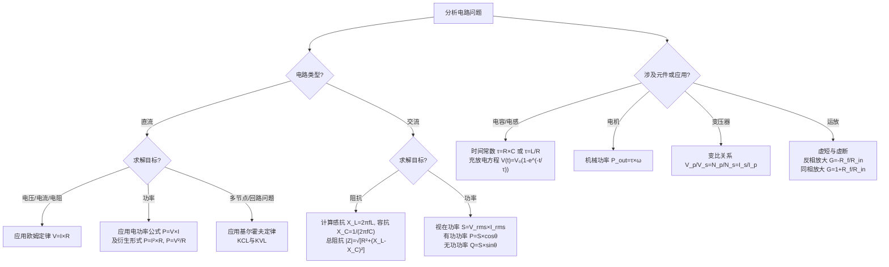

### 核心基础定律

这些是分析任何电路都离不开的基石。

1.  **欧姆定律**
    *   **公式**: `V = I × R`
    *   **含义**: 导体两端的**电压 (V)** 等于流过导体的**电流 (I)** 乘以导体的**电阻 (R)**。
    *   **变形**: `I = V / R`, `R = V / I`
    *   **应用**: 计算电路中任意元件的电压、电流或电阻。是电路分析的起点。

2.  **电功率公式**
    *   **公式**: `P = V × I`
    *   **含义**: 消耗或产生的**功率 (P)** 等于电压与电流的乘积。
    *   **结合欧姆定律的变形**:
        *   `P = I² × R` (当电阻已知时，计算电流产生的热损耗非常有用)
        *   `P = V² / R` (当电压和电阻已知时)
    *   **应用**: 计算电阻的发热量、电源的输出功率、设备的功耗。

3.  **基尔霍夫定律**
    *   **KCL (电流定律)**: 流入任一节点的电流之和等于流出该节点的电流之和。`ΣI_in = ΣI_out`
        *   **理解**: 就像水管的一个接头，流进去的水总和一定等于流出来的水总和。
    *   **KVL (电压定律)**: 沿任一闭合回路，所有电压降的代数和等于零。`ΣV = 0`
        *   **理解**: 就像爬山，无论你走哪条路径，从山脚到山顶再回到山脚，高度的总变化为零。
    *   **应用**: 分析复杂电路，列写方程求解多个未知电压和电流。

---

### 直流电路分析

4.  **电阻串并联**
    *   **串联电阻**: `R_total = R1 + R2 + R3 + ...`
        *   电流相同，电压按电阻值分配。
    *   **并联电阻**: `1/R_total = 1/R1 + 1/R2 + 1/R3 + ...`
        *   电压相同，电流按电阻倒数分配（电阻越小，分得电流越大）。

---

### 交流电路分析

交流电引入了相位概念，需要用到复数或相量法。

5.  **阻抗**
    *   阻抗 `Z` 是电阻、电容感抗的综合效应，单位是欧姆 (Ω)。
    *   **感抗**: `X_L = 2πfL` (f:频率, L:电感)
    *   **容抗**: `X_C = 1 / (2πfC)` (f:频率, C:电容)
    *   **总阻抗大小 (对于RLC串联电路)**: `|Z| = √[R² + (X_L - X_C)²]`

6.  **交流功率**
    *   **视在功率 (S)**: `S = V_rms × I_rms`，单位：伏安 (VA)
    *   **有功功率 (P)**: `P = V_rms × I_rms × cosθ = S × cosθ`，单位：瓦特 (W)
        *   真正做功的功率，`cosθ` 是功率因数。
    *   **无功功率 (Q)**: `Q = V_rms × I_rms × sinθ = S × sinθ`，单位：乏 (VAR)
        *   在电感和电容与电源之间交换的功率，不做功。

---

### 电容与电感

7.  **电容公式**
    *   **定义式**: `C = Q / V`
    *   **平行板电容**: `C = ε₀εr × A / d` (A:极板面积, d:距离)
    *   **电容充放电电压**: `V(t) = V₀ × (1 - e^(-t/τ))` (充电)
    *   **时间常数**: `τ = R × C`，表示充放电快慢。

8.  **电感公式**
    *   **感应电动势**: `V = L × (di/dt)` (电流变化率越大，感应电压越高)
    *   **电感时间常数**: `τ = L / R`

---

### 电机与变压器

9.  **电机功率与转矩**
    *   **输出机械功率**: `P_out = τ × ω`
        *   `τ`: 转矩 (Nm)，`ω`: 角速度 (rad/s)

10. **变压器变比**
    *   `V_p / V_s = N_p / N_s = I_s / I_p`
    *   **含义**: 原边和副边的**电压**与**匝数**成正比，**电流**与匝数成反比。

---

### 运算放大器

11. **理想运放公式**
    *   **黄金法则**:
        1.  虚短: `V+ ≈ V-`
        2.  虚断: `I+ = I- ≈ 0`
    *   **反相放大**: `G = V_out / V_in = - R_f / R_in`
    *   **同相放大**: `G = V_out / V_in = 1 + R_f / R_in`

---

为了更直观地展示这些公式如何应用于不同场景，以下流程图梳理了根据已知条件选择合适公式的分析路径：

## 限流电阻该多大
#### 核心计算公式

**限流电阻 R 的计算公式为：**

`R = (电源电压 - 用电器正向电压) / 用电器期望的工作电流`

或者写为：
`R = (V_supply - V_f) / I_f`

其中：
*   **R**：你要计算的限流电阻阻值，单位是欧姆（Ω）。
*   **V_supply**：电源电压，也就是你的电池电压（比如10串电池的36V或42V），单位是伏特（V）。
*   **V_f**：用电器的**正向压降**，单位是伏特（V）。这是用电器发光时自身需要的固定电压。
*   **I_f**：你希望让用电器工作的**电流**，单位是安培（A）。这个值必须小于用电器的最大额定电流。

---

#### 详细计算步骤（附举例说明）

我们以一个 **10串三元锂电池**（电压按 **36V** 计算）驱动一个 **普通的5mm白光LED** 为例。

##### 第1步：确定电源电压 (V_supply)
*   你的电源是10串锂电池。我们不按满电算，取一个平均工作电压：**36V**。
*   （注：如果是满电42V，电阻需要重新计算，功率会更大）

##### 第2步：查找LED的正向压降 (V_f)
*   不同颜色和材料的LED，V_f不同。**你必须查手册或根据经验估算**。
    *   普通红光/黄光/黄绿光LED：约 **1.8V - 2.2V**
    *   纯绿光/蓝光/白光LED：约 **3.0V - 3.4V**
*   本例中，我们使用白光LED，取 **V_f = 3.2V**。

##### 第3步：确定LED的工作电流 (I_f)
*   普通小功率LED（如3mm, 5mm灯珠）的**最大连续电流通常是20mA（0.02A）**。为了安全和长寿，我们通常工作在 **10mA-20mA** 之间。
*   本例中，我们取 **I_f = 20mA = 0.02A**。

##### 第4步：代入公式计算电阻值 (R)
`R = (36V - 3.2V) / 0.02A = 32.8V / 0.02A = 1640 Ω`

*   电阻有标准阻值，我们选择一个最接近的常见标准值：**1.8 kΩ** (1800 Ω) 或 **2.0 kΩ** (2000 Ω) 都可以。选择 **1.8 kΩ** 会更亮一点。

##### 第5步：【至关重要】计算电阻的功率 (P)
电阻不仅会限制电流，还会因为自身发热而消耗功率。如果功率太小，电阻会过热烧毁。
功率计算公式为：`P = I² * R` 或 `P = (V_supply - V_f) * I`

*   `P = (0.02A)² * 1800Ω = 0.0004 * 1800 = 0.72W`
*   `P = (36V - 3.2V) * 0.02A = 32.8V * 0.02A = 0.656W`

*   **结论**：计算出的功率约为 **0.7W**。**绝对不能用普通的1/4W（0.25W）电阻！**
*   **选择**：必须选择额定功率**大于**这个值的电阻。通常为了可靠和散热，我们会选择额定功率是计算值 **2倍甚至以上** 的电阻。因此，我们应选择至少 **1W** 的电阻，**选择2W的电阻会更安全、更不易发热**。

## 能量和功率的关系
**功率是能量转换的速率，能量是功率对时间的积累。**

您可以把它想象成：

*   **能量** 就像 **一整箱汽油的总量**。
*   **功率** 就像 **发动机消耗汽油的快慢（油耗）**。

---

### 详解与比喻

#### 1. 能量（E-Energy）

*   **它是什么？** 能量是做功的能力的总量。它是“总量”概念。
*   **比喻：**
    *   一整箱汽油。
    *   一座水库里储存的总水量。
    *   您银行账户里的总存款。
*   **单位：**
    *   国际单位：**焦耳（Joule）**
    *   常用单位：**千瓦时（kW·h）**，也就是我们生活中说的 **“度”电**。
        *   `1度电 = 1kW·h = 1000W·3600s = 3,600,000焦耳`

##### 焦耳
焦耳（符号J）是国际单位制中表示能量、功或热量的导出单位，得名于英国物理学家詹姆斯·焦耳。1焦耳等于1牛顿的力使物体在力的方向上移动1米所做的功，也可表示为1瓦特的功率在1秒内所做的功。
**焦耳的定义和换算：**
机械能和功的单位：1焦耳定义为施加1牛顿的力使物体沿力的方向移动1米所消耗的能量。
热量的单位：焦耳也是热量的单位，1焦耳约等于0.24 卡路里(cal)。
功率单位：1焦耳还等于1瓦特(W)的功率在1秒(s)内所做的功，即1J = 1W·s。

#### 2. 功率（P-Power）

*   **它是什么？** 功率是单位时间内消耗或产生能量的速率。它是“速率”概念。
*   **比喻：**
    *   汽车的油耗（例如：升/百公里）。
    *   水龙头的流速（例如：升/分钟）。
    *   您花钱的速度（例如：元/月）。
*   **单位：**
    *   国际单位：**瓦特（Watt）**
    *   `1 瓦特 = 1 焦耳/秒`

---

### 它们之间的数学关系（公式）

这个关系是理解它们的关键：

**能量 = 功率 × 时间**

用字母表示为：**`E = P × t`**

**从这个公式可以看出：**
*   **功率（P）越大**，在**相同时间（t）** 内消耗或产生的**能量（E）就越多**。
*   **时间（t）越长**，以**相同功率（P）** 运行所消耗或产生的**能量（E）就越多**。

#### 举例说明：

1.  **两个灯泡**
    *   一个 **100W** 的灯泡比一个 **40W** 的灯泡**功率更大**（更亮）。
    *   让100W的灯泡工作 **10小时**，消耗的能量是：`E = 100W × 10h = 1000 Wh = 1 kW·h (1度电)`。
    *   让40W的灯泡工作 **10小时**，消耗的能量是：`E = 40W × 10h = 400 Wh = 0.4 kW·h (0.4度电)`。
    *   **结论：** 功率大的灯泡，在相同时间内消耗的能量更多。

2.  **同一个电器**
    *   一台 **2000W** 的电磁炉。
    *   用它**大火（2000W）炒菜10分钟（1/6小时）**：`E = 2000W × (1/6)h ≈ 333 Wh`。
    *   用它**小火（1000W）煲汤1小时**：`E = 1000W × 1h = 1000 Wh`。
    *   **结论：** 即使功率较小，但使用时间很长，消耗的总能量也会更多。

### 在电学中的具体计算

在电路中，功率（P）可以通过电压（U）和电流（I）来计算：

**`P = U × I`**

因此，能量的公式可以扩展为：
**`E = U × I × t`**

**电池的例子：**
*   一个标称 **72V 32Ah** 的电池，它的**能量**是：
    `E = U × I × t = 72V × 32A × 1h = 2304 Wh = 2.304 kWh`（约2.3度电）。
*   这里的 **Ah** 本质上是 **（A × h）**，已经包含了电流和时间。

#### 安时Ah
安时是容量单位，一个12伏特的10安时电池可以产生10安的电流1小时，或者提供1安的电流12小时。因此，Ah值越高，电池的容量就越大，能提供的电量也就越多。

### 总结表格

| 概念 | 功率 (Power) | 能量 (Energy) |
| :--- | :--- | :--- |
| **它是什么** | **做功的速率** | **做功的总量** |
| **比喻** | **流速**（花钱速度） | **总量**（存款总额） |
| **问题** | **它有多快？** | **总共有多少？** |
| **单位** | 瓦特 (**W**), 千瓦 (**kW**) | 焦耳 (**J**), 千瓦时 (**kW·h**), “度” |
| **关系** | **`P = E / t`** | **`E = P × t`** |

**最终结论：功率就像速度，能量就像距离。速度决定了你跑多快，而速度乘以时间才得到你跑了多远。同样，功率决定了电器工作多“猛”，而功率乘以时间才得到它最终消耗了多少能量（电费）。**