# Keil
### 破解
51和ARM两个版本分辨安装到两个目录后，把51版本中的 C51 目录拷贝到ARM版本里，然后把 51目录里的 TOOLS.INI 文件中的 [c51] 相关内容也复制到 ARM 里的 TOOLS.INI 里，并且需要修改 PATH 路径为 ARM 目录。运行 ARM 里的 Keil 程序进行破解。以后就使用 ARM 里的 Keil 就行了。


### 配置
#### 输出十六进制编译文件


#### 生成 bin 文件
[Keil开发环境如何生成BIN文件](https://www.cnblogs.com/whik/p/9873195.html)
##### 为什么需要BIN文件呢？
* 有些烧录器只支持BIN文件。
* 进行OTA远程升级时，只能使用BIN文件。
* 使用JLink脚本文件进行一键烧录时，只支持BIN文件。
* BIN文件要比HEX和AXF文件小的多。

在 After Build/Rebuild 配置 `fromelf --bin -o "$L@L.bin" "#L"` 并勾选启用。就会生成 bin 文件到输出目录（和 axf, hex 同目录）。
也可以手动指定编译命令：
`D:\Keil\Keil_ARM\ARM\ARMCLANG\bin\fromelf.exe --bin -o E:\Keil_Project\myProject.bin E:\Keil_Project\myProject.axf`

#### 使用 C99
默认使用的 C89/C90 编译器，变量这些必须定义在作用域的头部，所以 for 循环这些里面都不能声明变量。将编译器配置为 C99 可以解决此问题。


#### 项目文件配置
我们在 Windows 的资源管理器中创建的文件是物理文件，但是创建文件后并不会自动添加到 Keil 项目中。Keil 项目是一套自己的文件管理机制，可以看做是逻辑上的文件目录结构。
要将物理文件添加到 Keil 的逻辑文件中，需要点击三个小方块按钮进行添加：
  

#### Include Paths 配置
如果需要引入某些头文件，可以编辑 Include Paths：
  

#### ST-Link 烧录配置
Keil 中点击魔法棒配置 debug，开启烧录后自动重启，关闭烧录生成 debug 文件：
  
  

**注意：当使用多个烧写器插了多个开发板进行烧录时，需要选择不同的烧写器（CAN双机手收发测试讲解）：**
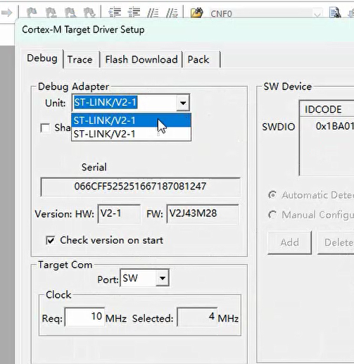  
虽然两个的名字一样，但是是不同的烧写器（Serial不同）。不好区分，所以最好一次只插一块开发板进行开发和烧写。
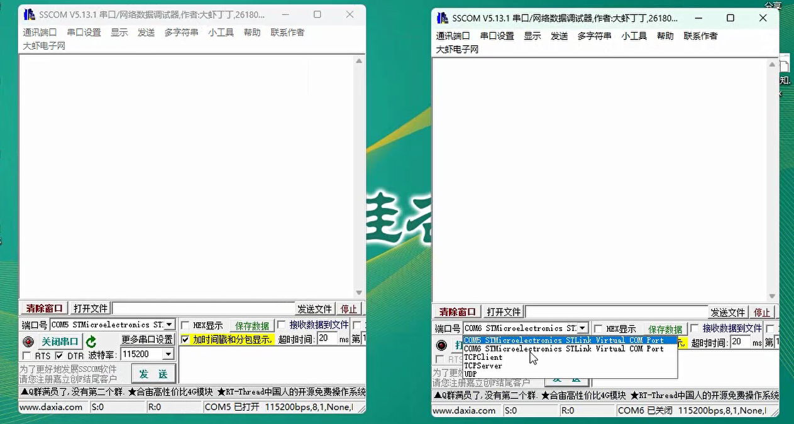  
当然，两块板子使用的COM口也是不一样的，需要修改。
**要区分的话只能先插入一块板子，记下它的Serial和COM，再插入另一块板子，就知道另一个Serial和COM是它了。**

# VScode
### EIDE 插件的配置
#### 设置编译工具链-C51


#### 设置包含的头文件
包含目录即 includePath


#include 使用 <> 引入的头文件就是在 includePath 中：


现在就能正常编译了！

当我们自己新建了目录，需要被其它文件引入时，也需要将这些目录添加到 includePath 中。


#### 输出文件
编译后的16进制文件在项目目录的 /build/Release 中


#### 烧录
vscode 的烧录工具使用 python 开发，但是现在 Win11 中安装了 python 会出现不能使用 python 命令，只能使用 py 命令。需要在这里关闭后才能使用 python 命令 ：


vscode 烧录依赖 python 命令，并且依赖一个 python 包 serial。需要使用 `pip install pyserial` 命令安装。

安装后便可开始尝试烧录了：

由于烧录工具使用的串口默认使用第一个，比如我连接了蓝牙键盘、鼠标等，蓝牙设备会虚拟串口，所以第一个不一定是我们要使用的串口号。


点击编辑后将 `${port}` 修改为需要的串口号就行，如：`python ./tools/stcflash.py -p COM3 "${hexFile}"`

串口号错误烧录时会提示：


#### 导出模板
可以将项目结构和配置搞好后，导出为 EIDE 模板，后面的新项目通过此模板快速创建。


#### .eide 目录
当导入项目后会生成一个 .eide 目录，里面包含了项目的配置信息，包括一些路径。如果直接将此项目目录拷贝到其它电脑上，如果连同 .eide 一起拷贝，则可能出现别的电脑项目存放路径不同，而找不到头文件等问题。如果遇到此问题，可以删除 .eide 目录，重新导入项目。

## ARM 项目的配置
ARM 项目可以使用 EIDE，也可以使用 Keil Assistant 插件。
### EIDE 说明
[超详细教程：VSCode搭建STM32/51开发环境（EIDE插件）](https://www.bilibili.com/video/BV1odZRYKE6A/?vd_source=8220e726dcb3a350fd156cea947bd58b)
[再见了，Keil君！我已经爱上了EIDE插件（vscode+嵌入式开发）](https://www.bilibili.com/video/BV1XGLozvEJf/?spm_id_from=333.337.search-card.all.click&vd_source=8220e726dcb3a350fd156cea947bd58b)
#### 导入 Keil 项目
在 EIDE 中需要使用导入功能导入 .uvprojx 项目：
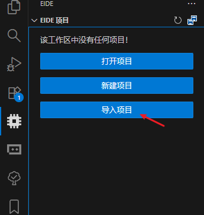  
需要注意的是：使用 EIDE 导入 Keil 项目时，Keil 项目文件可能未在项目根目录下，如下所示：
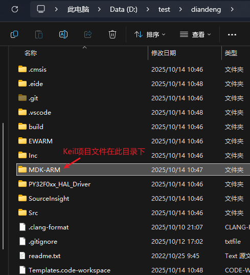  
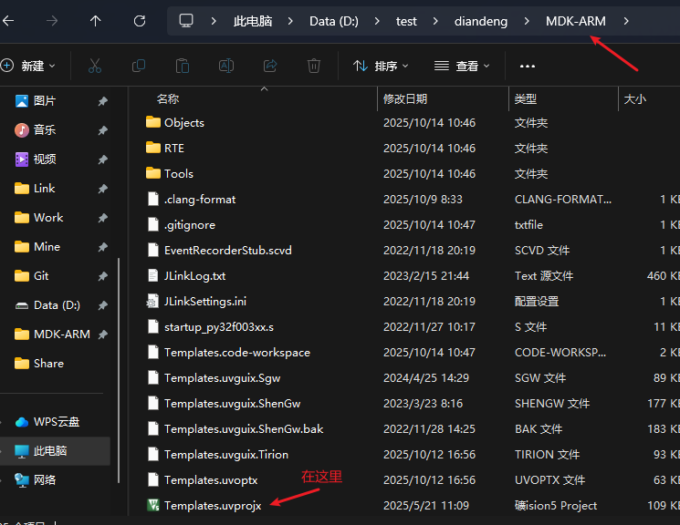  
导入后 EIDE 提示是否以当前目录打开，此时要选择 No，然后会弹出选择项目目录的对话框，再选择实际的项目目录（这里就是 diandeng 目录）。
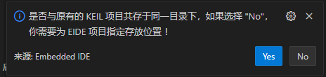  
如果 Keil 项目文件在项目根目录下，导入后 EIDE 会提示是否以当前目录打开，此时选择 Yes 即可。
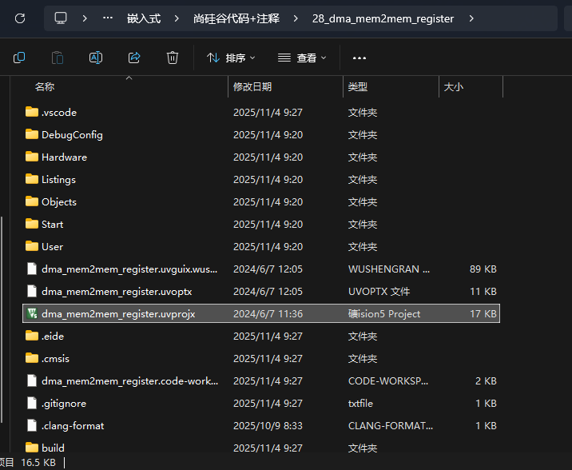  
#### 配置Keil编译器
点击此处可切换不同的编译器，其中AC5和AC6就是 Keil 中的编译器（Compiler Version5即ARM Compiler 5，简称AC5）。在设置中将编译器配置为Keil中对应的目录，它就会去找配置目录下的bin目录中的编译器文件。
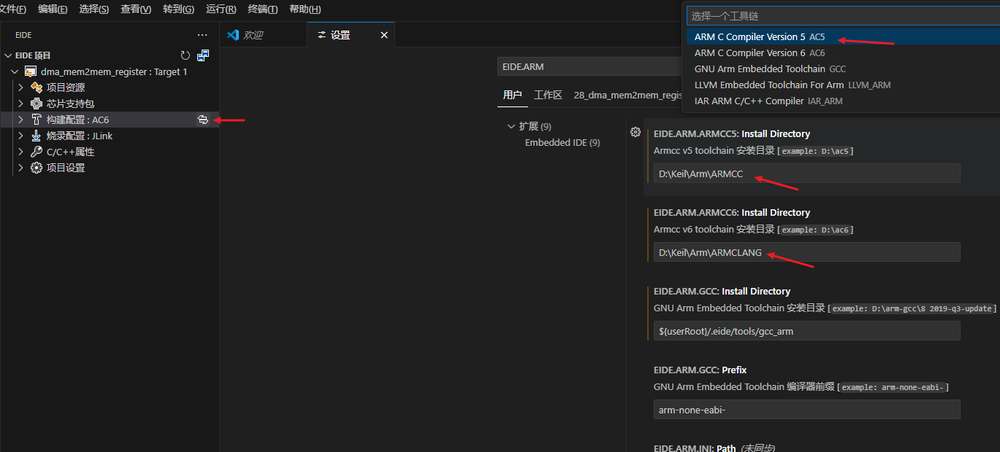  
#### debug
使用扩展 Cortex-Debug 可以像 Keil 中一样进行 debug。(比较麻烦，很多人还是推荐 vscode 写代码，keil 中调试)


### Keil Assistant 说明
Keil Assistant 中点击 + 号导入项目。

Keil Assistant 是直接使用 Keil 的配置进行编译打包的，所以不需要再在这边做过多的配置，只需要配置好 Keil 路径即可。

如果修改了 Keil 的配置，想在 Keil Assistant 中生效，需要关闭 Keil，这边就自动生效了。

#### 编译
这里可以进行编辑。如果是导入的项目，最好先在 Keil 中编译验证下看是否能正常编译，可能需要修改 Keil 的配置等，Keil 编译通过了再在这里使用。


#### 和 Keil 的同步
VSCode 中修改了文件，切换到 Keil 会自动提示是否应用更改，点击允许全部就行。在 Keil 中修改了一些配置，如点击三个小方块图标添加了文件等，VSCode 是无法感知到进行更新的，需要关闭 VSCode 再打开才会生效。

## VSCode 中格式化代码
在 VSCode 中格式化代码可以使用 C/C++ 插件进行格式化。安装插件后在插件的设置中自定义格式化规则。
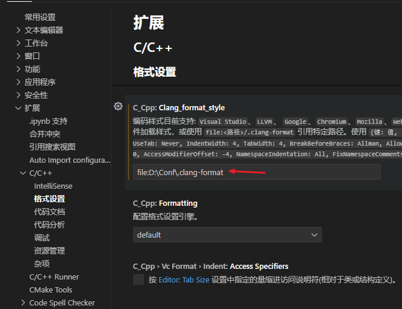  
在 .clang-format 文件中可以自定义格式化规则，然后放在自定义的目录中，配置 file 为此路径就能使用此规则进行格式化了。不过这样配置后，就不会使用当前项目中的 .clang-format 文件了。因为 VSCode 中打开 Keil 项目，文件路径和实际的目录结构不同，所以不能直接使用当前项目中的 .clang-format 文件，只能使用固定路径的格式化文件。

## 自定义代码片段
通过首选项中的配置代码片段功能可以自定义代码片段。点击配置用户代码片段后，选择 c.json 打开配置文件，添加如下内容后，即可通过输入 `header` 后按 Tab 键插入代码片段。
```json
{
	"C C++ Header": {
		"scope": "c, cpp",
		"prefix": "header",
		"description": "Add #ifndef, #define and #endif",
		"body": [
			"#ifndef __${TM_FILENAME_BASE/(.*)/${1:/upcase}/}_H__",
			"#define __${TM_FILENAME_BASE/(.*)/${1:/upcase}/}_H__",
			"",
			"$0",
			"",
			"#endif /* __${TM_FILENAME_BASE/(.*)/${1:/upcase}/}_H__ */"
		]
	}
}
```

# 注意事项
## 解决“未定义标识符”
开发 Keil 项目时，如果出现提示“未定义标识符”，但是却能正常点击跳转，可能时因为 C/C++ 的 intelliSense 引擎没有正确识别到头文件中的标识符。
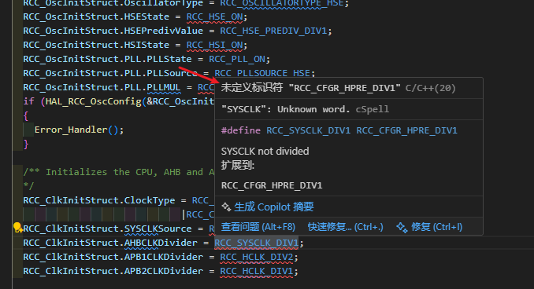  
方法一：删除项目目录中的 .vscode 和 .eide 目录，重新导入项目。如果此方法不行再尝试下面的方法。
方法二：可以通过修改项目的配置文件来修改 intelliSense 模式来解决：
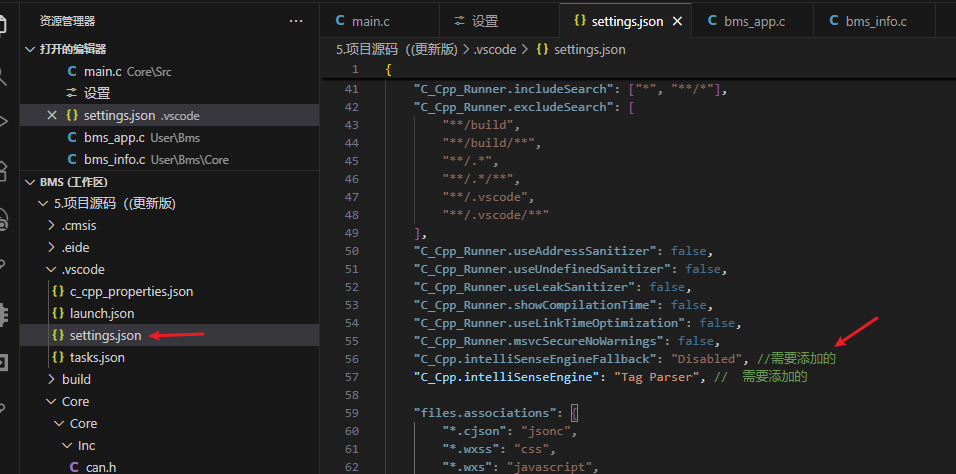  
```json
"C_Cpp.intelliSenseEngineFallback": "Disabled", //需要添加的
"C_Cpp.intelliSenseEngine": "Tag Parser",  //  需要添加的
```
方法三：在设置中将 C/C++ 配置中的 intelliSense 引擎模式修改为 Tag Parser。不过这里的修改就会对所有项目生效。
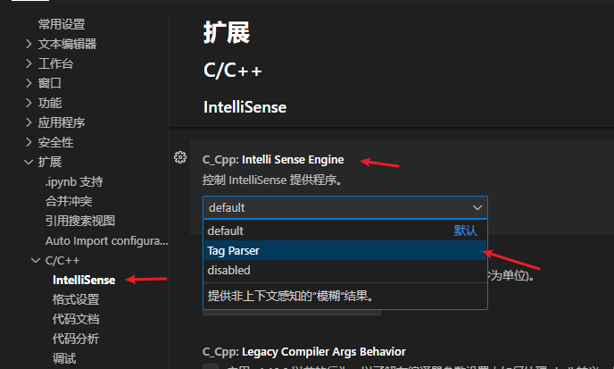  
