# Keil
### 破解
51和ARM两个版本分辨安装到两个目录后，把51版本中的 C51 目录拷贝到ARM版本里，然后把 51目录里的 TOOLS.INI 文件中的 [c51] 相关内容也复制到 ARM 里的 TOOLS.INI 里，并且需要修改 PATH 路径为 ARM 目录。运行 ARM 里的 Keil 程序进行破解。以后就使用 ARM 里的 Keil 就行了。
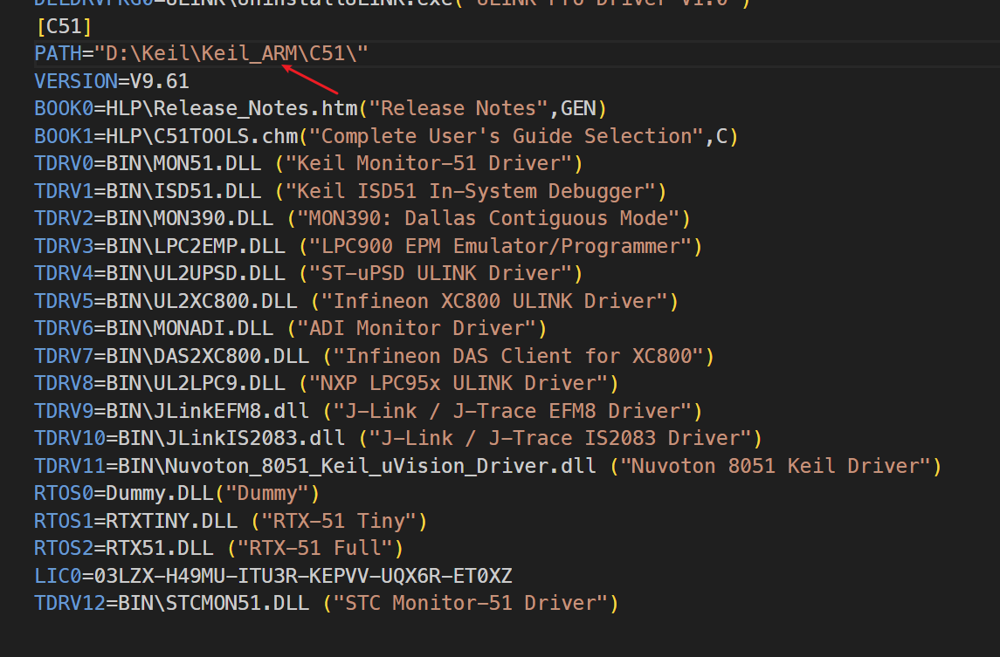

### 配置
#### 输出十六进制编译文件
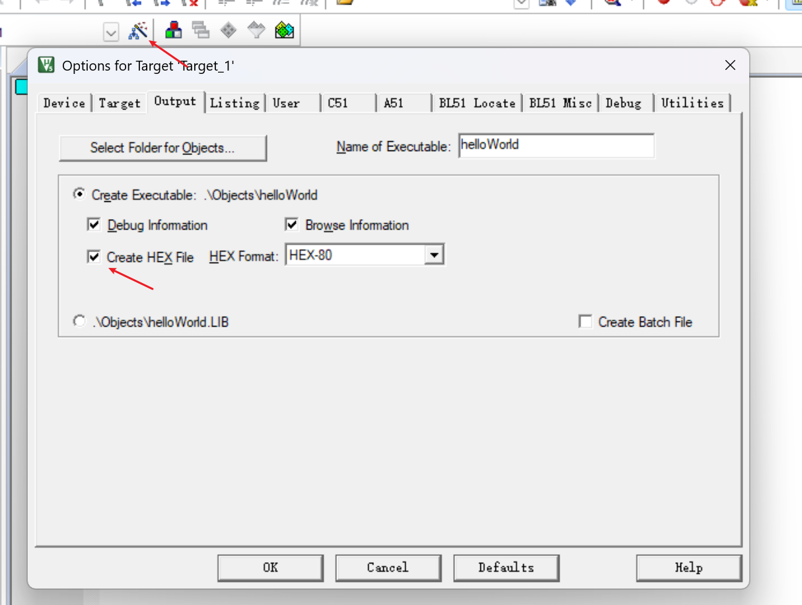

#### 生成 bin 文件
[Keil开发环境如何生成BIN文件](https://www.cnblogs.com/whik/p/9873195.html)
##### 为什么需要BIN文件呢？
* 有些烧录器只支持BIN文件。
* 进行OTA远程升级时，只能使用BIN文件。
* 使用JLink脚本文件进行一键烧录时，只支持BIN文件。
* BIN文件要比HEX和AXF文件小的多。
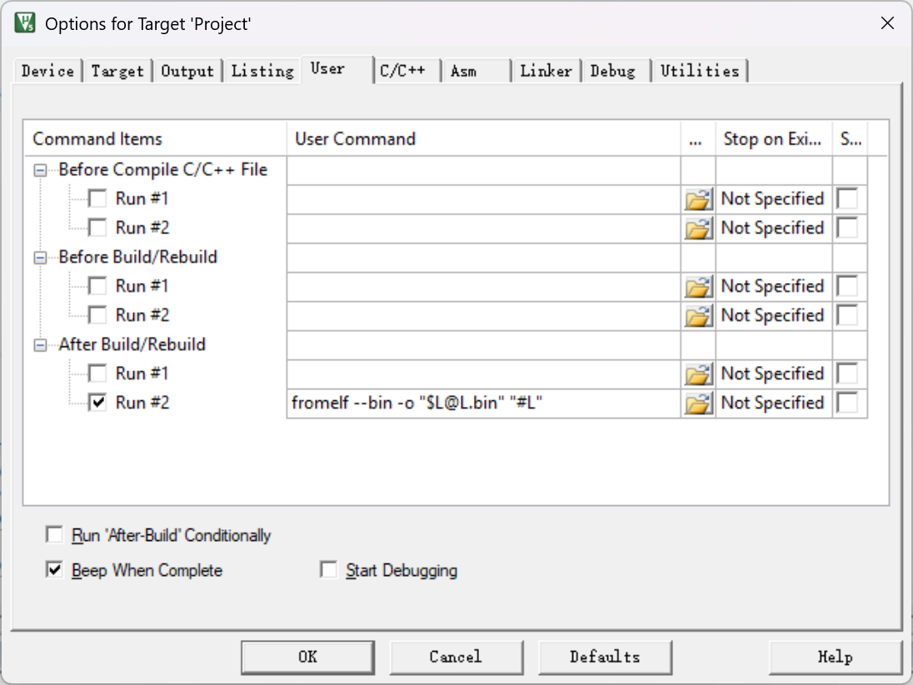
在 After Build/Rebuild 配置 `fromelf --bin -o "$L@L.bin" "#L"` 并勾选启用。就会生成 bin 文件到输出目录（和 axf, hex 同目录）。
也可以手动指定编译命令：
`D:\Keil\Keil_ARM\ARM\ARMCLANG\bin\fromelf.exe --bin -o E:\Keil_Project\myProject.bin E:\Keil_Project\myProject.axf`

#### 使用 C99
默认使用的 C89/C90 编译器，变量这些必须定义在作用域的头部，所以 for 循环这些里面都不能声明变量。将编译器配置为 C99 可以解决此问题。
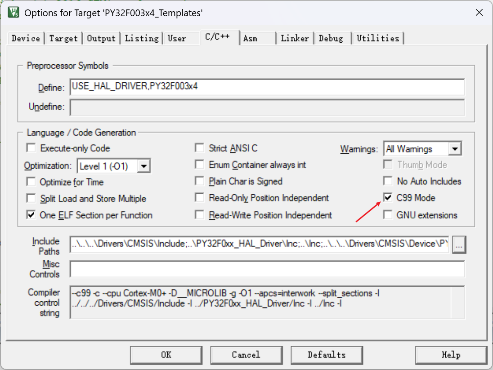

#### 项目文件配置
我们在 Windows 的资源管理器中创建的文件是物理文件，但是创建文件后并不会自动添加到 Keil 项目中。Keil 项目是一套自己的文件管理机制，可以看做是逻辑上的文件目录结构。
要将物理文件添加到 Keil 的逻辑文件中，需要点击三个小方块按钮进行添加：
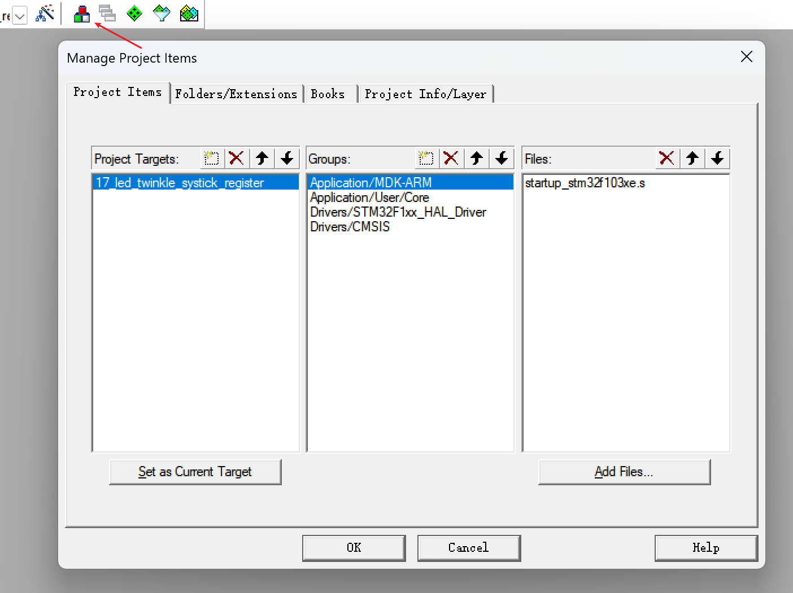  

#### Include Paths 配置
如果需要引入某些头文件，可以编辑 Include Paths：
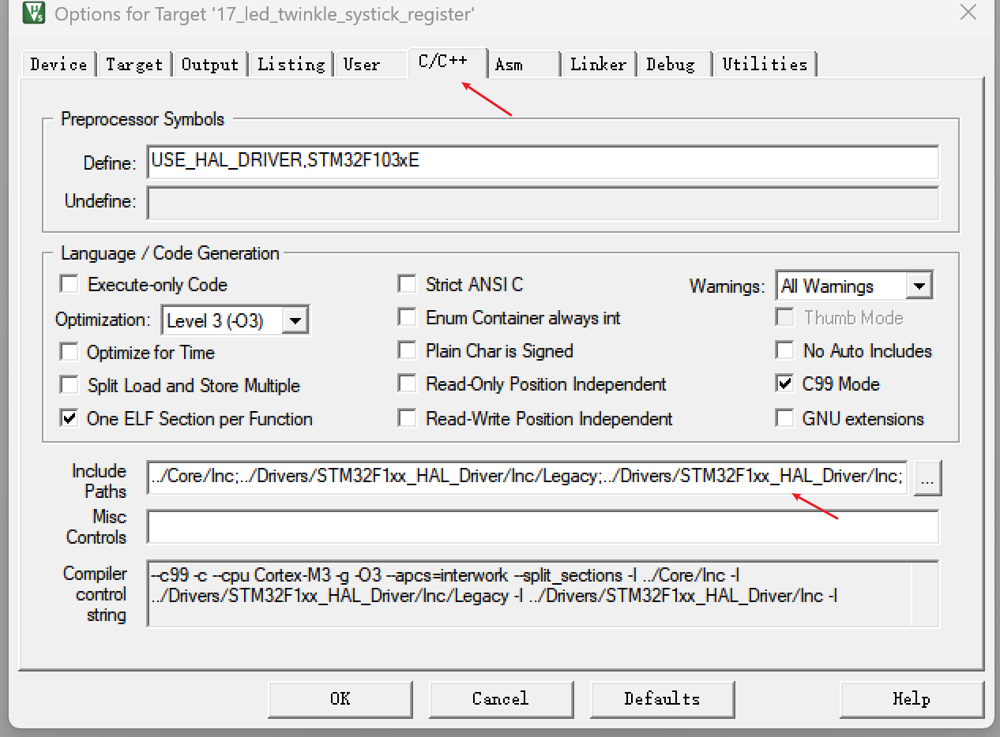  

#### ST-Link 烧录配置
Keil 中点击魔法棒配置 debug，开启烧录后自动重启，关闭烧录生成 debug 文件：
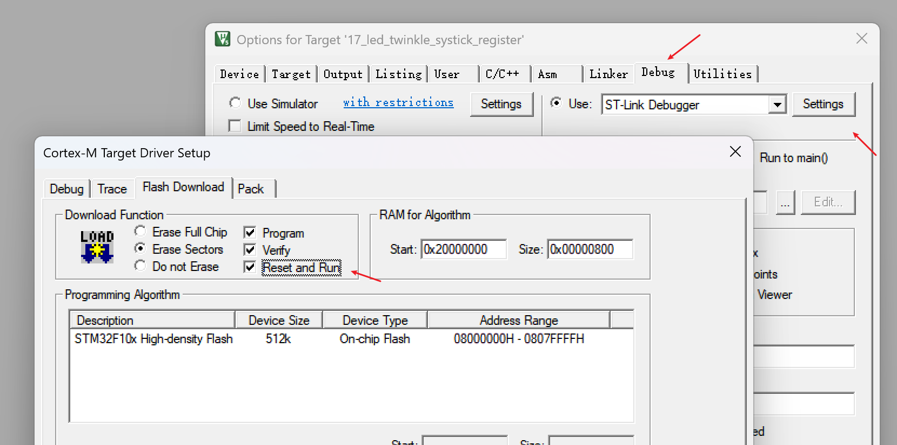  
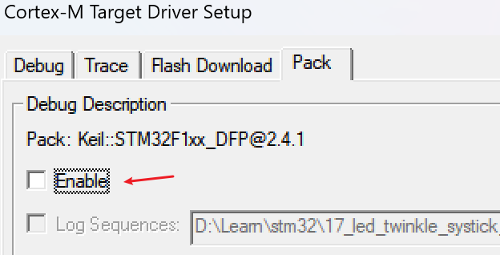  

# VScode
### EIDE 插件的配置
#### 设置编译工具链
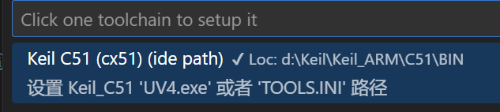

#### 设置包含的头文件
包含目录即 includePath

#include 使用 <> 引入的头文件就是在 includePath 中：
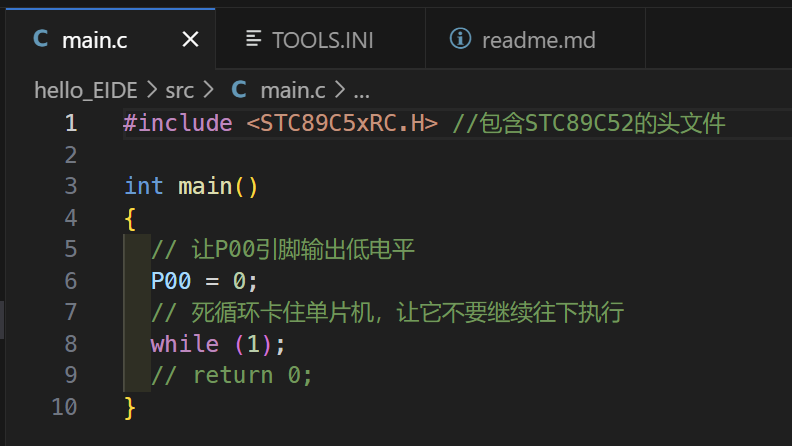

现在就能正常编译了！

当我们自己新建了目录，需要被其它文件引入时，也需要将这些目录添加到 includePath 中。
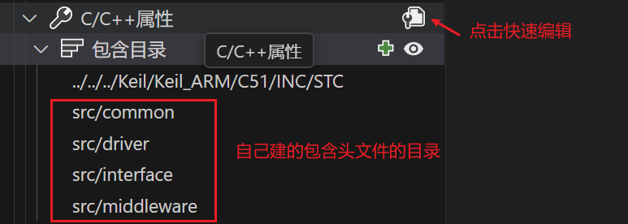

#### 输出文件
编译后的16进制文件在项目目录的 /build/Release 中
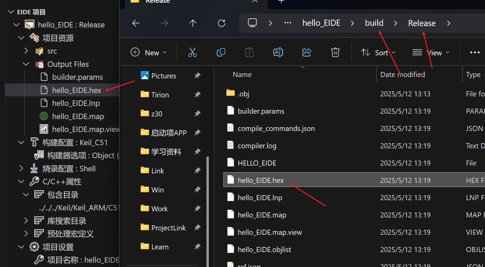

#### 烧录
vscode 的烧录工具使用 python 开发，但是现在 Win11 中安装了 python 会出现不能使用 python 命令，只能使用 py 命令。需要在这里关闭后才能使用 python 命令 ：
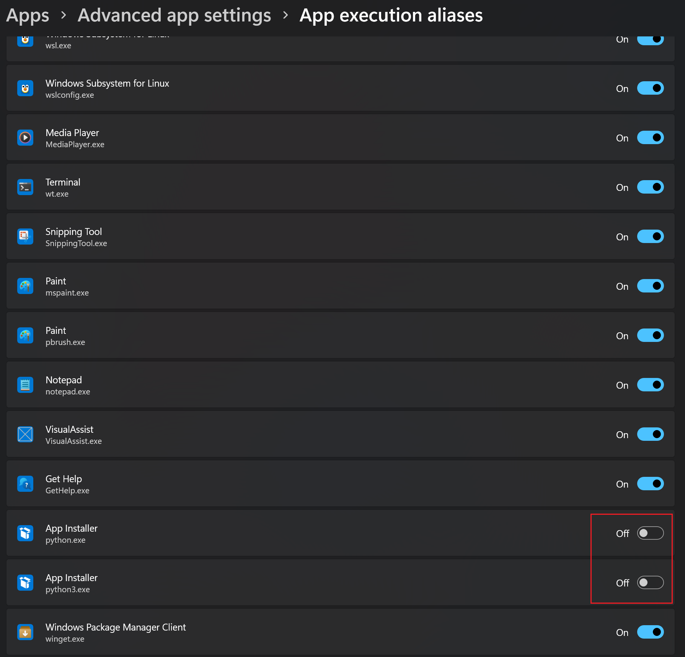

vscode 烧录依赖 python 命令，并且依赖一个 python 包 serial。需要使用 `pip install pyserial` 命令安装。
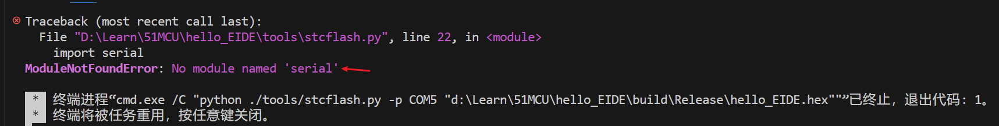
安装后便可开始尝试烧录了：
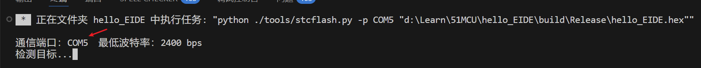
由于烧录工具使用的串口默认使用第一个，比如我连接了蓝牙键盘、鼠标等，蓝牙设备会虚拟串口，所以第一个不一定是我们要使用的串口号。
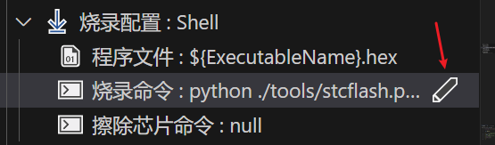

点击编辑后将 `${port}` 修改为需要的串口号就行，如：`python ./tools/stcflash.py -p COM3 "${hexFile}"`

串口号错误烧录时会提示：

#### 导出模板
可以将项目结构和配置搞好后，导出为 EIDE 模板，后面的新项目通过此模板快速创建。

## ARM 项目的配置
ARM 项目可以使用 EIDE，也可以使用 Keil Assistant 插件。
在 EIDE 中需要使用导入功能导入 .uvprojx 项目；Keil Assistant 中点击 + 号导入项目。
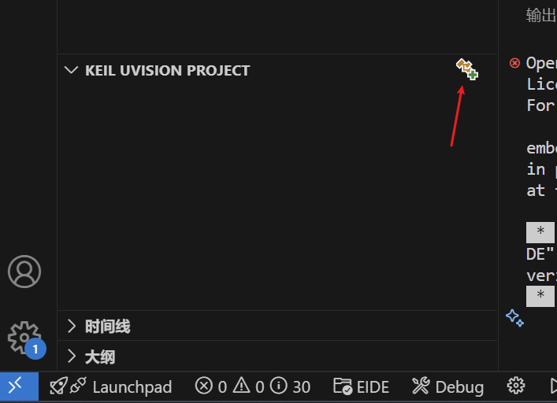

### Keil Assistant 说明
Keil Assistant 是直接使用 Keil 的配置进行编译打包的，所以不需要再在这边做过多的配置，只需要配置好 Keil 路径即可。
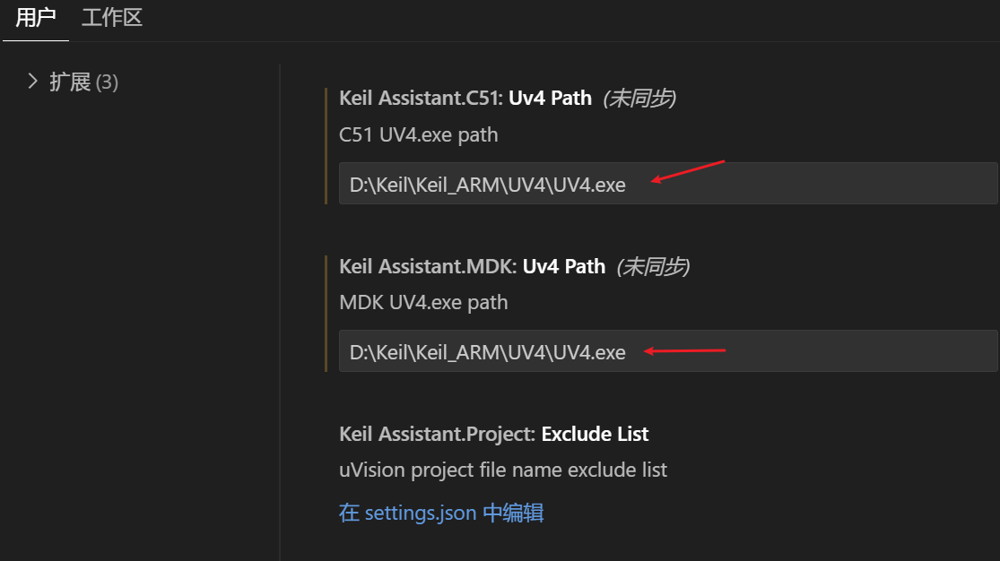
如果修改了 Keil 的配置，想在 Keil Assistant 中生效，需要关闭 Keil，这边就自动生效了。

#### 编译
这里可以进行编辑。如果是导入的项目，最好先在 Keil 中编译验证下看是否能正常编译，可能需要修改 Keil 的配置等，Keil 编译通过了再在这里使用。
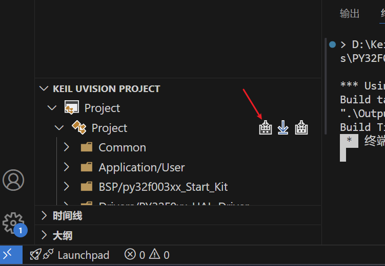

#### 和 Keil 的同步
VSCode 中修改了文件，切换到 Keil 会自动提示是否应用更改，点击允许全部就行。在 Keil 中修改了一些配置，如点击三个小方块图标添加了文件等，VSCode 是无法感知到进行更新的，需要关闭 VSCode 再打开才会生效。