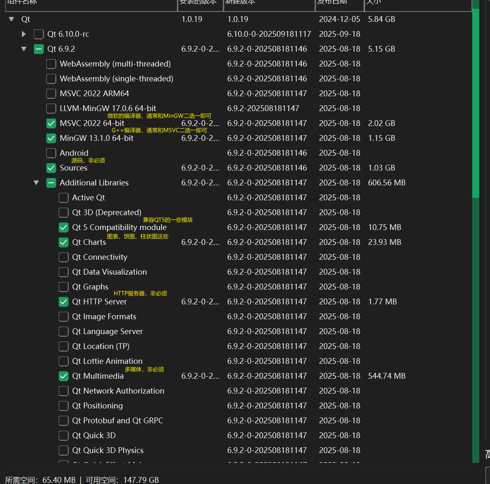
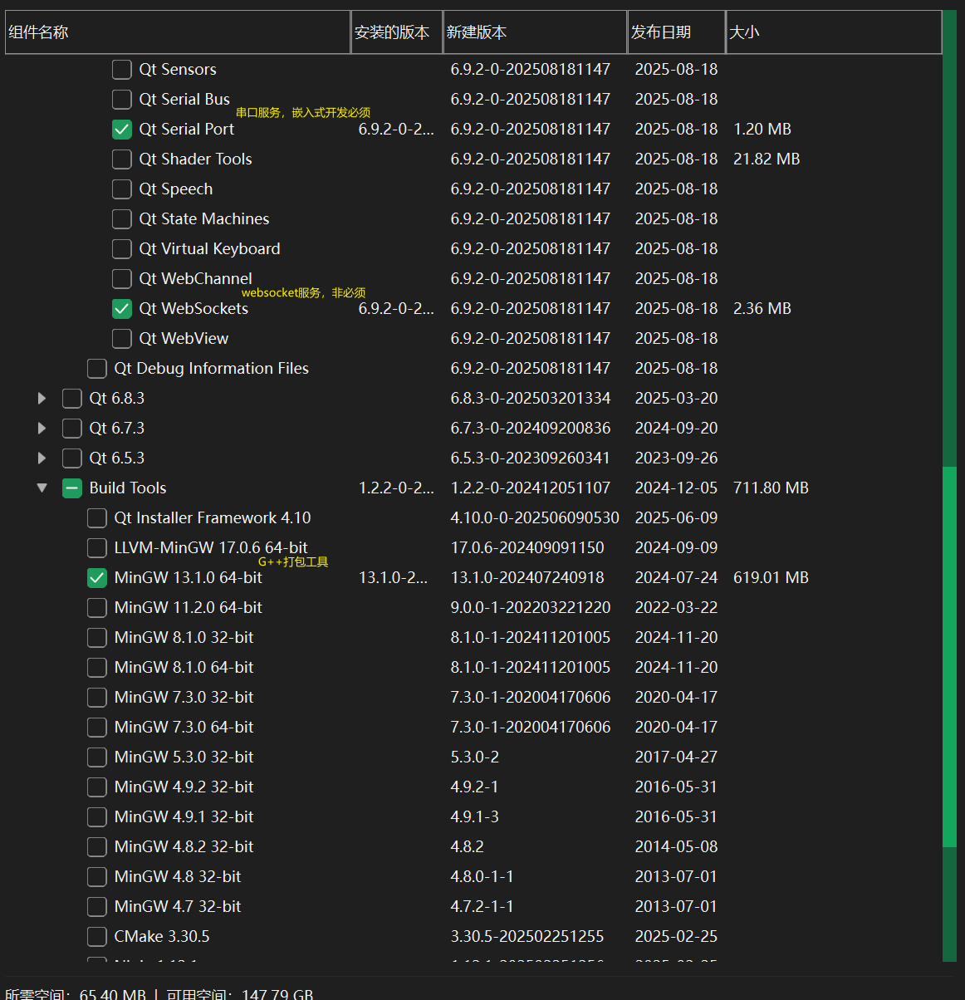
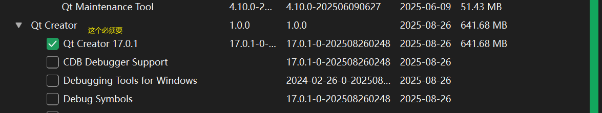

# 镜像配置
Qt 新版本只能使用在线安装，下载Qt安装器后，需要使用命令行的修改“源”才能正常安装：
`D:\Download\Edge\qt-online-installer-windows-x64-online.exe --mirror https://mirrors.aliyun.com/qt`
qt-online-installer-windows-x64-online.exe 就是下载的Qt安装器，--mirror https://mirrors.aliyun.com/qt 是指定安装源为阿里云的Qt镜像。
可以直接将安装器拖入CMD窗口（不能用powershell），就能自动获取安装器的路径，再添加镜像源命令即可，回车后会启动安装器并使用指定的镜像源进行安装。

# 安装选项
Qt有很多安装选项，而且很多是没用的，全部下载会很大吗，所以使用自定义安装，这里介绍一些常用的：
  
  
  

