# 配置
### 基本配置
1. 选择 debug 模式和时基的来源：
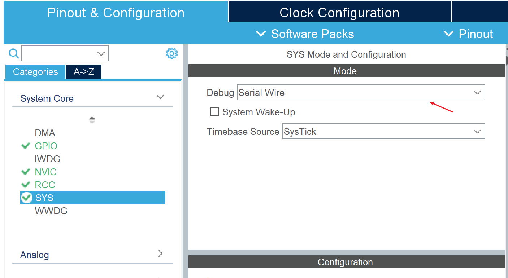  
2. 选择时钟源为晶振：
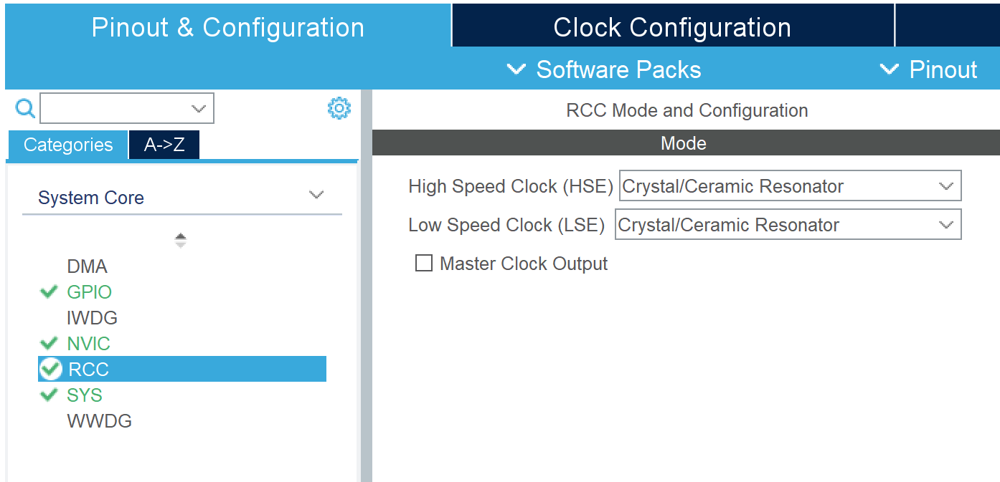  
3. 时钟配置：
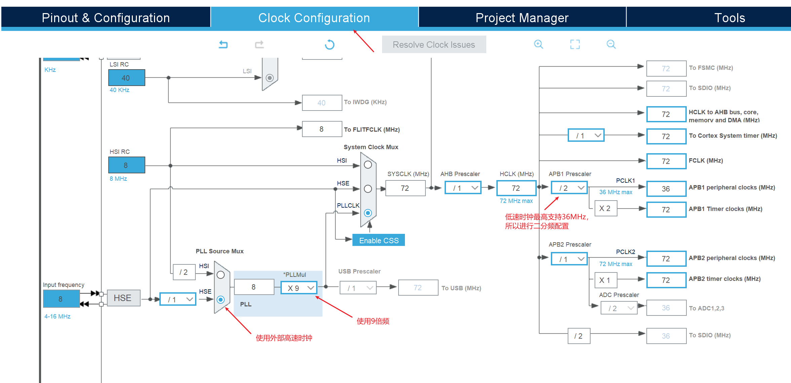  
4. 项目配置：
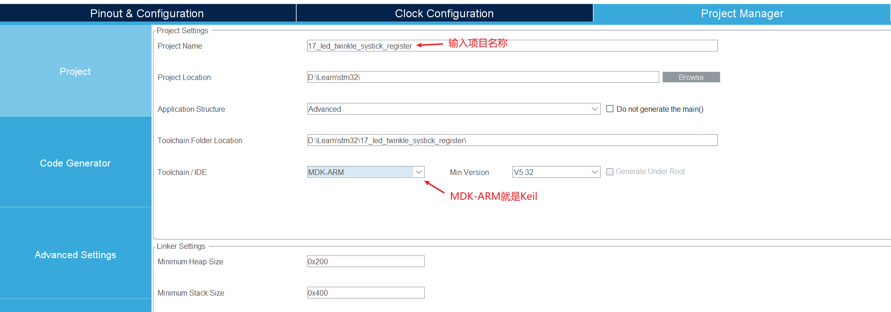  
按下图勾选：
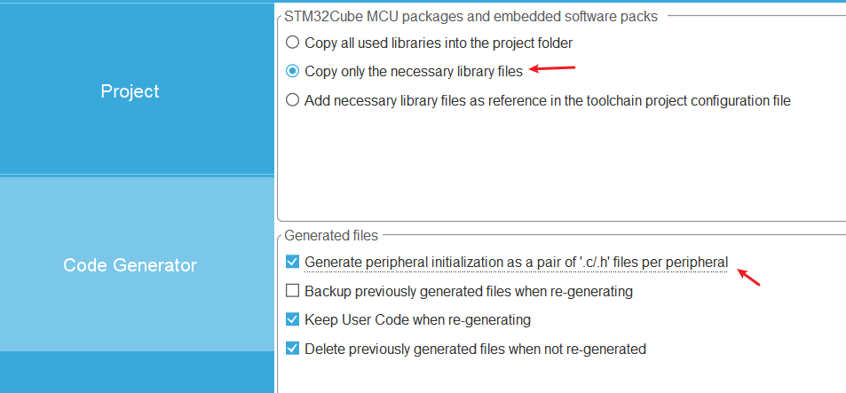  
5. 配置完成后点击 GENERATE CODE 生成项目，然后点击 Open Project 就会自动用 Keil 打开项目（项目配置中选择的 Keil）:
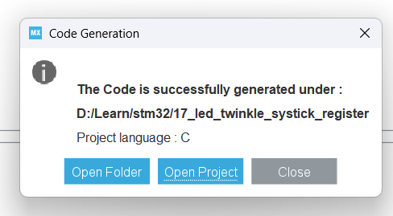  
6. Keil 中点击魔法棒配置 debug，开启烧录后自动重启，关闭烧录生成 debug 文件：
  
  
如果 Keil 中新增文件等操作，需要添加到项目中：
  
如果需要引入某些头文件，可以编辑 Include Paths：
  

### 可选配置
* GPIO 配置：
普通输出/输入模式配置：
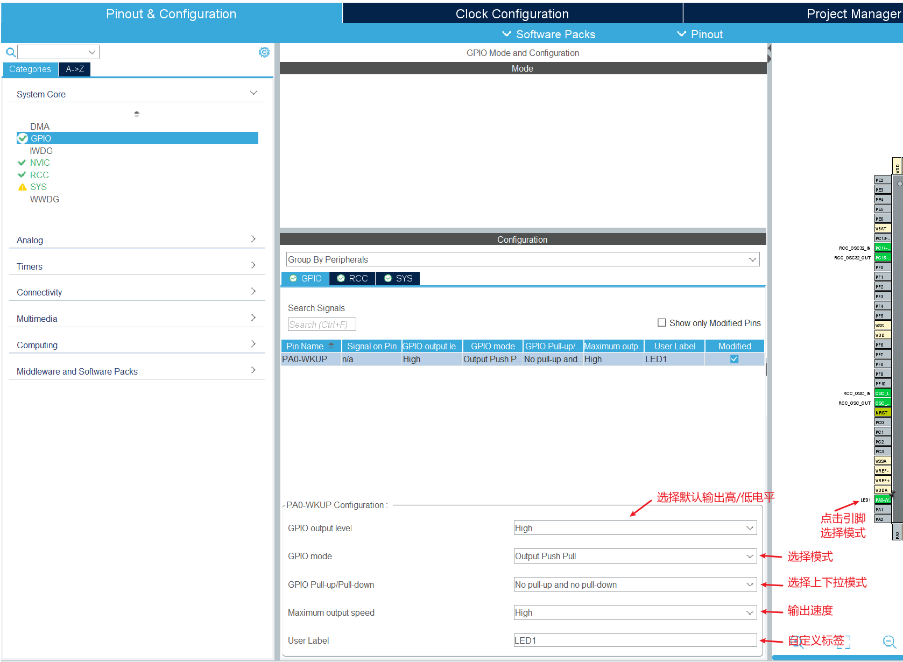  
中断模式配置：
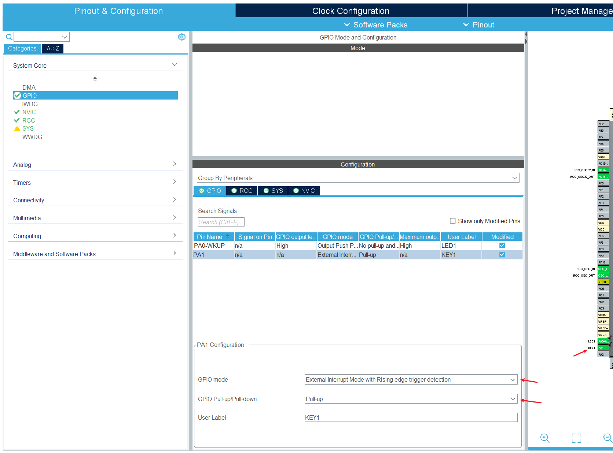  

* NVIC 配置：
GPIO 配置为中断等情况，需要继续对 NVIC 进行配置：
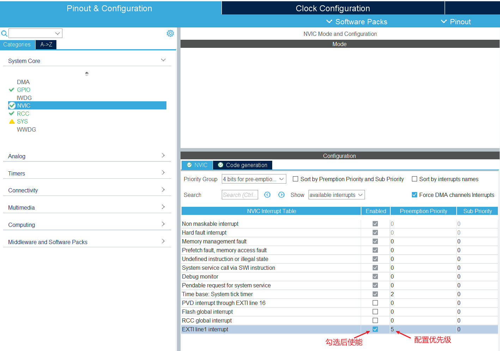  
**注意配置的优先级通常要低于滴答定时器的优先级，才能在中断函数中调用滴答定时器的延迟函数。**

* TIM 配置：
当要使用 TIM 相关功能时，需要对 TIM 模块进行配置：
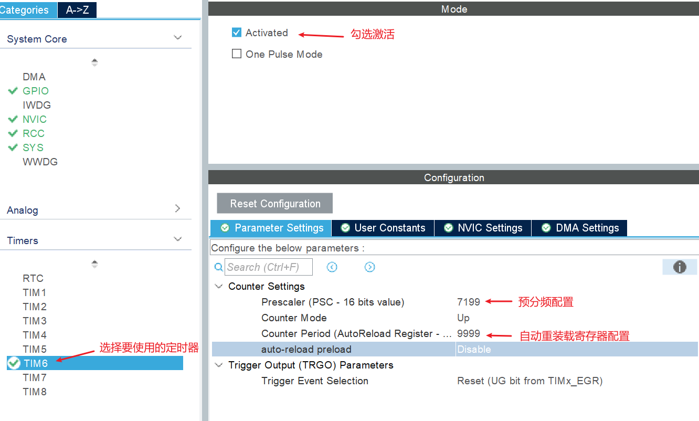  
若要使用中断，在 NVIC 中勾选中断使能，并根据需要配置优先级，需注意优先级是否会和系统滴答定时器冲突：
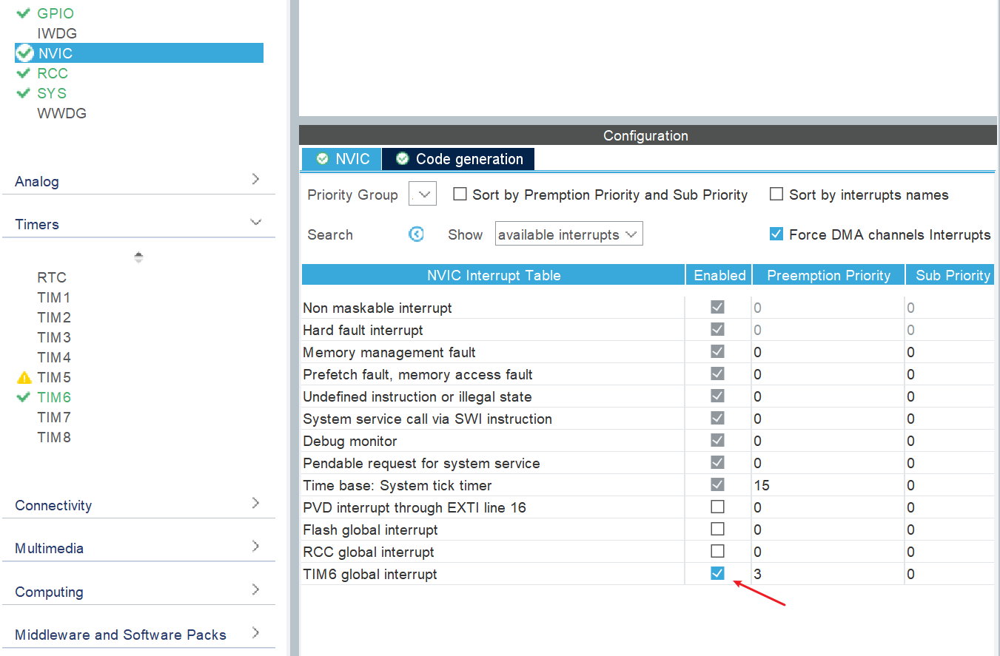  

* PWM 配置：
PWM 也是配置时钟，只不过需要通用定时器才支持。这里的 TIM5 是个通用定时器，将其配置为 PWM 输出模式：
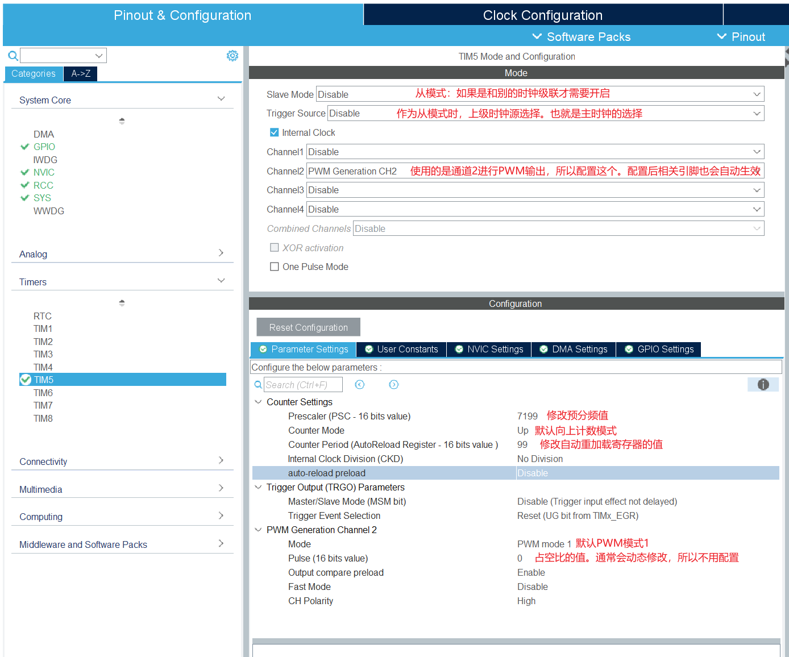  

* TIM 捕获配置：
这里是将其它内部时钟的输出作为输入，进行捕获。（尚硅谷126讲）
注意，这不是级联，所以不需要使用 slave 模式。级联是由其它时钟进行驱动，而这只是将其它时钟作为普通的输入进行捕获分析。
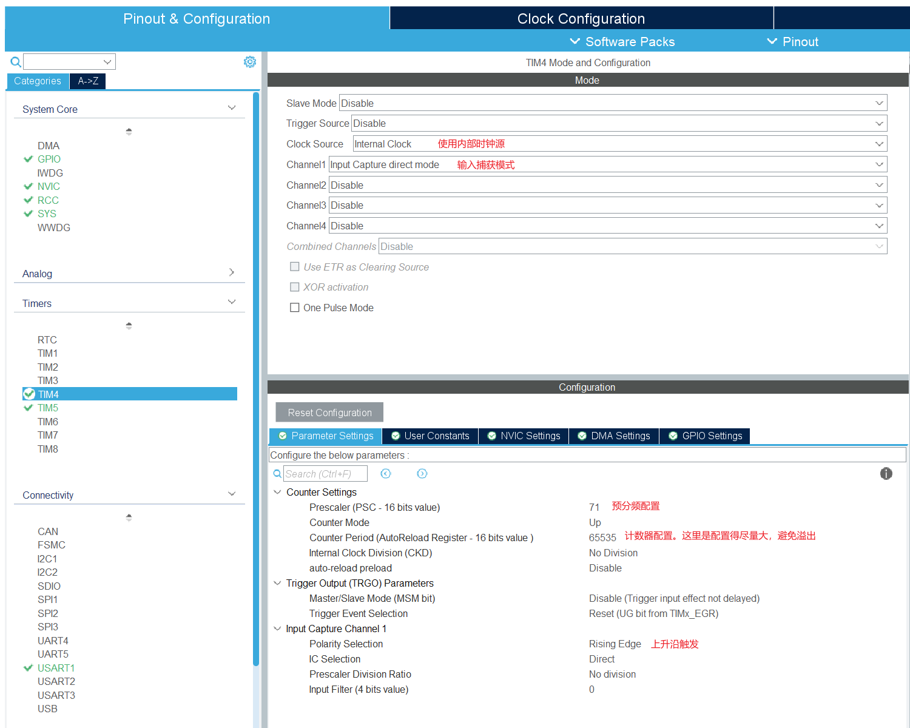  

这里还要注意另一个 GPIO 相关配置。GPIO 可以有多个复用功能，当要使用的功能不是在第一优先级，那么 CubeMX 默认配置可能就会使用重映射的 GPIO 引脚：
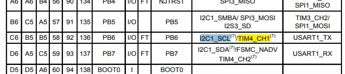  
这里 I2C1 是第一优先级，而我们要用的 TIM4_CH1 是次优先级，所以 CubeMX 认为 PB6 引脚使用了 I2C1 功能，从而不使用 PB6 引脚。
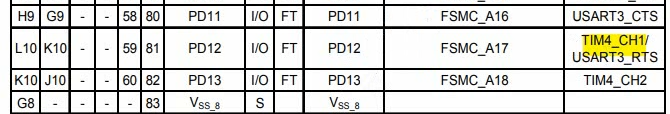  
最后一列是重映射列，TIM4_CH1 重映射到了 PD12 引脚，所以默认使用的是 PD12：
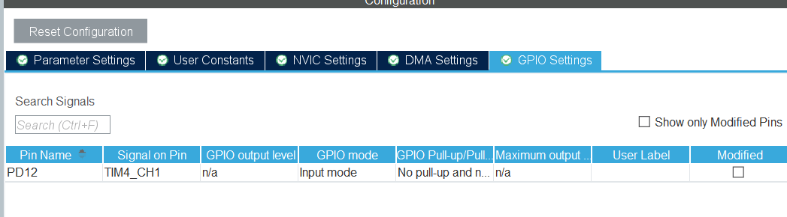  
但是在这里无法手动修改引脚，需要在芯片上进行修改：
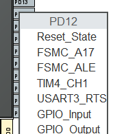  
PD12 点击 reset 重置。
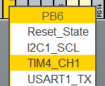  
PB6 选择 TIM4_CH1。
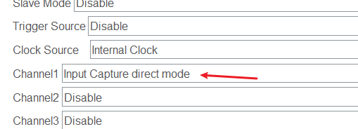  
由于修改了引脚，配置的这个选项会重置，需要重新选一次。

* TIM 从模式配置
要测算 PWM 占空比时，使用 TIM4 作为从设备接收 TIM5 的输入，所以要将 TIM4 配置为从模式：
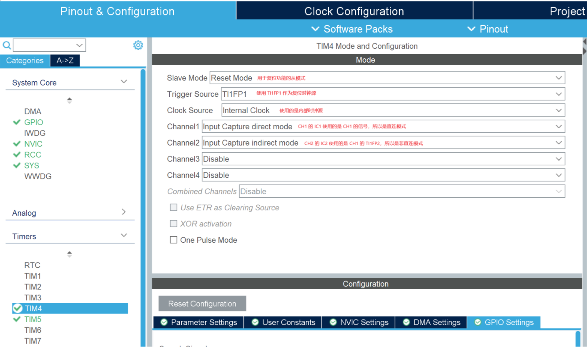  
由于 GPIO 引脚使用的 PD12，没有用默认的 PB6，而是使用重定义的 PD12。所以需要将 PD12 重置：
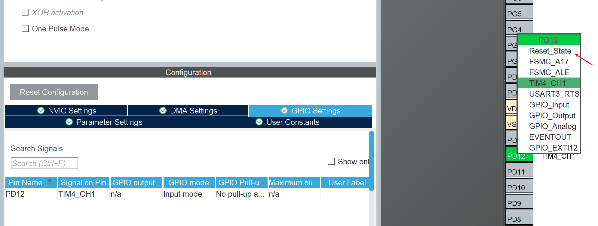  
然后将 PB6 改为 TIM4_CH1：
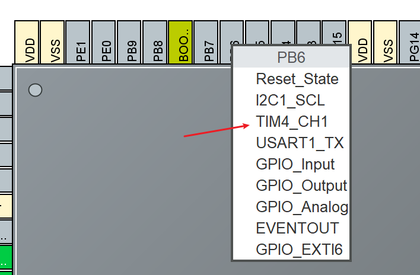  
然后左边的需要重新选择一下，就会使用 PB6 引脚了：
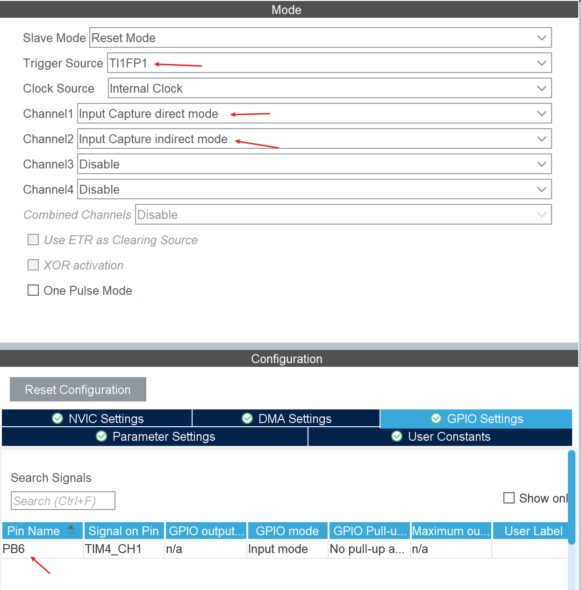  
parameter setting 配置：
  

# 问题
### 双击安装程序没反应
我下载安装包后双击，只出现了自解压流程后就没反应了，然后重启电脑进行安装才能正常安装。

### 下载芯片包网络连接失败
不知道为什么安装好 STM32CubeMX 后，通过软件下载芯片包提示连接失败，然后通过配置防火墙解决。
防火墙配置参考：[STM32CubeMX lost connection问题解决办法](https://blog.csdn.net/yu20057029/article/details/147688312)

### full_crdb.zip 下载失败
点击 ACCESS TO MCU SELECTOR 时，提示 full_crdb.zip 下载失败，目前成功过的解决办法是使用手机网络开热点，电脑连接后能正常下载。
也可以尝试在 Help -> Connection & Updates -> Connection Parameters 中选择 Use System Proxy Parameters 选项尝试。默认选择的是 No Proxy，选择使用系统代理后尝试通过 clash 翻墙下载。