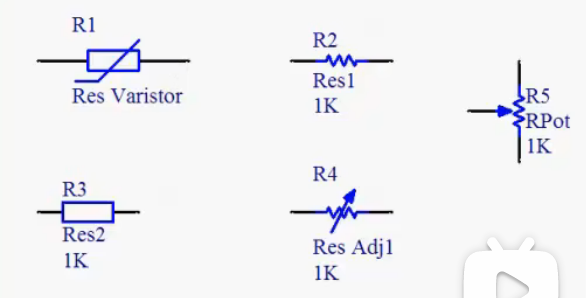

[电子元器件电路符号+实物图+命名规则](https://zhuanlan.zhihu.com/p/151307627)
[【0基础】从零开始认识电子元器件，硬件工程师必备](https://www.bilibili.com/video/BV1N8411T77d/?spm_id_from=333.788.videopod.episodes&vd_source=8220e726dcb3a350fd156cea947bd58b)

# 电阻
表示方法：直标法或色标法，色标法需要去查不同颜色表示的电阻值
测量方法：万用表或数字电桥
在原理图中的表示：
  
