[模拟电路 PPT](https://ppt.sankki.com/s/0waztzjh5z)
# 模电和数电
### 模拟电路
模拟电路是处理连续变化的模拟信号，信号在时间、幅度上均无限连续（如声音波形、温度变化）。典型应用包括音频放大器、传感器信号调理、射频收发器等。
比如麦克风、温度计传感器，任何一点声音、温度的变化都会导致模拟电路的变化（如电压的变化）。而不是每隔一定时间去监测下当前的声音、温度。所以模拟电路是连续的。
模拟电路是纯硬件编程，通过各种元器件调解电阻、电容、电压的大小，设计各种复杂的电路，来实现想要的功能。[如使用模拟电路实现电子琴功能](https://www.bilibili.com/video/BV1cM4y1s7Qk?spm_id_from=333.788.player.switch&vd_source=8220e726dcb3a350fd156cea947bd58b&p=49)
模拟电路接收到自然界的信号后都需要通过ADC(Analog to Digital Converter)转换为数字信号来处理。

ADC的主要功能就是以固定频率对模拟信号进行采样并转换为数字信号（二进制码流）。

### 数字电路
电荷的定向移动形成了电流，衡量电流的大小要看单位时间内  通过导体横切面的电荷量。
电子从负极流向正极形成电流，但是由于历史原因，电流被定义为从正极流向负极。
数字电路是模拟电路接收到的模拟信号，通过ADC转换后变成数字信号，用于处理这些数字信号的相关电路。数字电路占据着更为重要的作用，大部分时候都是在处理数字信号。
数字电路在输出时某些情况下（如喇叭、电机控制等）需要通过DAC（Digital to Analog Converter）将数字信号转换为模拟信号输出。

# 电流
电流的单位是安培（A）。1秒内有6.2415093×10^18个元电荷通过横截面的电流 就是1A
电流类似理解可以理解成水管的流量，这是常见的电流的大小。
1A的元电荷是固定值，那么电线粗细不同能承受电流大小也就不同，越粗能承受的电流就越大，越细则越小，如果细电线承受较大的电流就会烧毁。
1000mA = 1A
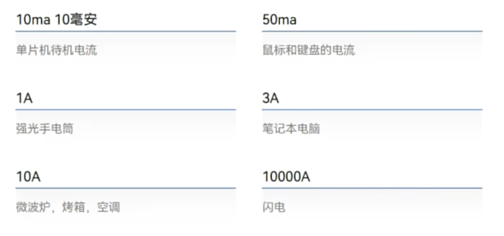  

### 直流电和交流电
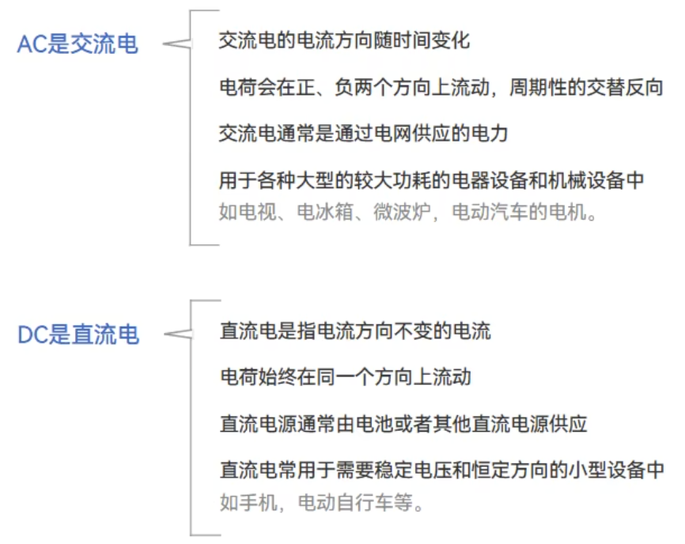  
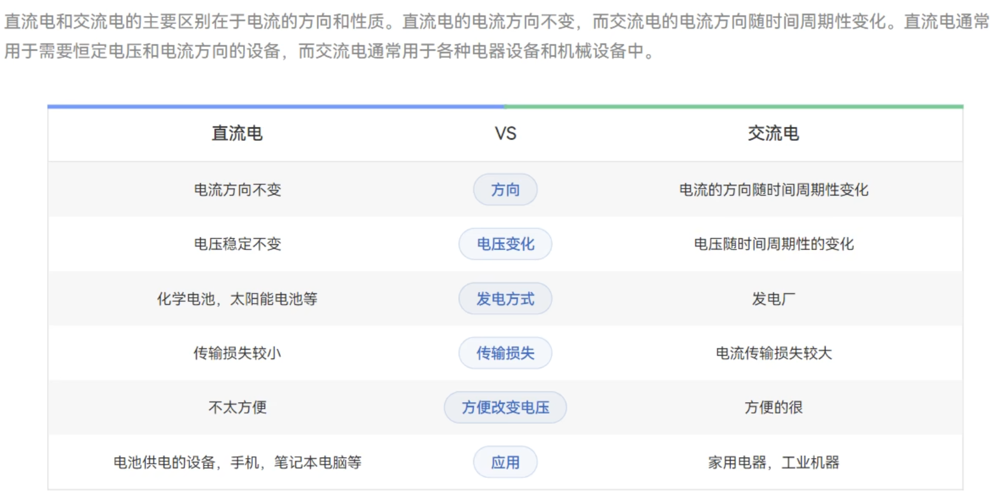  

#### 家庭用电
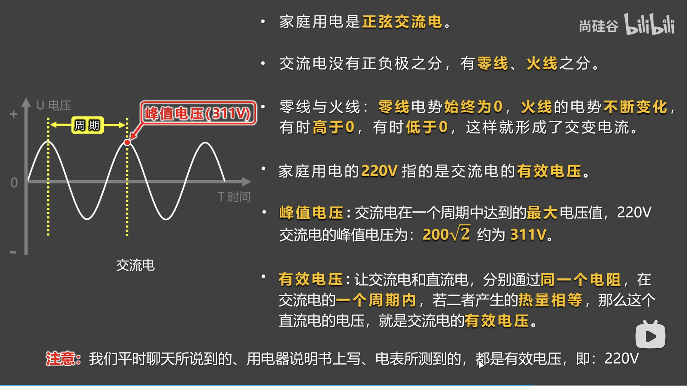  
家庭用电交流电的频率是50Hz，表示1秒内完成了50个周期，每个周期包含2次方向的变化，所以家用交流电1秒内电流的方向变化了100次。
交流(AC) → 直流(DC)：整流(Rectification)
直流(DC) → 交流(AC)：逆变(Inversion)

# 电压
电压术语叫电势能。**什么是势能呢？势能是物理学描述的能量类型，说明物体具备的能量。**
电压，电势能是指电子在电路中的动能。单位通常为伏特（V）。电压是电力系统中的一种重要概念，它决定着电流流动的强度。电压越高，电子移动的越快，电流就会越大，而电压越低，电流就会越小。

**AI：**
电压，又称电势差或电位差，是衡量单位电荷在静电场中由于电势不同所产生的能量差异的物理量。简单来说，电压是指电路中两点之间的电势差，它推动电子在电路中移动，从而形成电流。电压的大小通常用伏特（Volt, V）作为单位来衡量。
在电路中，电压可以被视为“推动力”，促使电荷（通常是电子）从一个点流向另一个点。没有电压，电流就无法流动。例如，在电池供电的设备中，电池提供的电压就是驱动电子通过电路的动力来源。
电压可以通过欧姆定律与电流和电阻联系起来，表达式为 \(U = I \times R\)，其中 \(U\) 是电压（单位：伏特V），\(I\) 是电流（单位：安培A），\(R\) 是电阻（单位：欧姆Ω）。这个关系表明了电压是如何影响电流的大小，以及如何通过已知的电流和电阻值来计算电压。

升高电压后，就会产生更大的电流，通过的电流变大了，LED就会更亮一些，电机也会转的更快一些，但是电压不能无限增大，过大的电压会产生过多的电流，导致LED和电机烧毁。

# 电阻和欧姆定律
电压产生电势差，推动电流的流动。阻碍电流的流动就是电阻。电阻是电子学中的基本概念，它是指电流经过导体时阻碍电流流动的程度。电阻的单位是欧姆。

电压推动电子的移动，电阻阻止电子的移动。欧姆公式：I = U/R，电压越大，电阻越小，电流就越大。

### 串联电路和并联电路
[尚硅谷-串联并联电路](https://www.bilibili.com/video/BV1ho9vYFE7b?spm_id_from=333.788.player.switch&vd_source=8220e726dcb3a350fd156cea947bd58b&p=12)

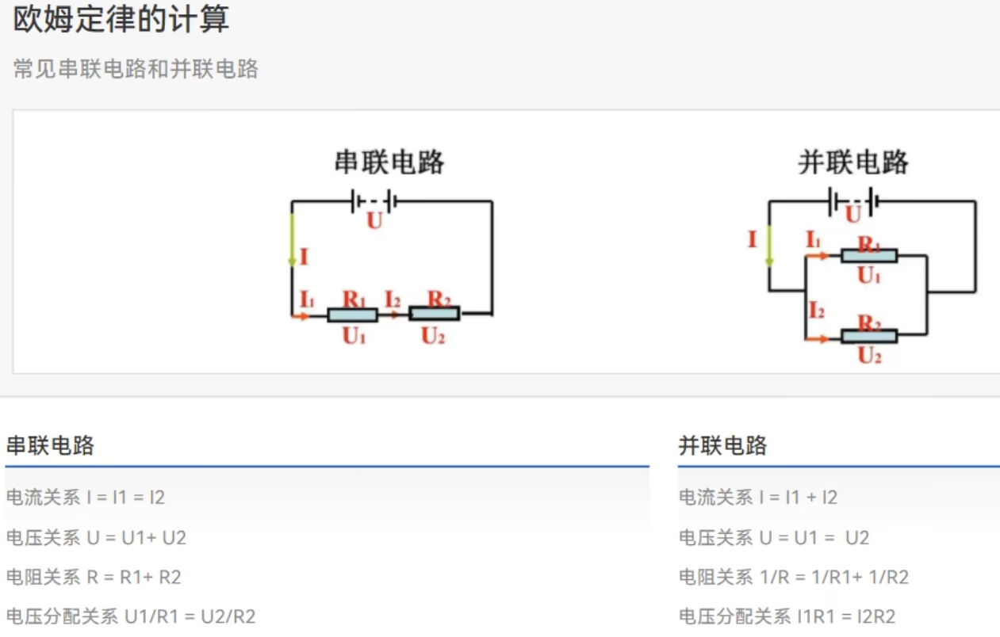  
两个并联的电阻总阻值：$R_总=\frac{R_1R_2}{R_1+R_2}$
n个阻值相等的电阻并联：$R_总=\frac{R}{n}$，R 是其中任一一个电阻。

串联电路和并联电路是两种基本的电路连接方式，它们各自有着不同的特点：

**串联电路的特点**
1. **电流相同**：在串联电路中，通过每个组件的电流是相同的。这意味着整个电路中的电流处处相等。
2. **电压分配**：总电压等于各组件电压之和。即如果一个电池提供的电压是 \(V\)，而电路中有两个电阻 \(R_1\) 和 \(R_2\)，则电池电压 \(V\) 等于 \(R_1\) 上的电压降加上 \(R_2\) 上的电压降。
3. **电阻相加**：总电阻等于所有单个电阻值之和。如果电路中包含多个电阻，则总电阻 \(R_{total} = R_1 + R_2 + ... + R_n\)。
4. **分压作用**：由于电压在串联电路中是分布的，因此可以利用这一点来实现分压。

### 并联电路的特点

1. **电压相同**：在并联电路中，每条支路两端的电压是相同的，等于电源电压。
2. **电流分配**：总电流等于各支路电流之和。即 \(I_{total} = I_1 + I_2 + ... + I_n\)，这里 \(I_1, I_2, ..., I_n\) 分别为各个支路中的电流。
3. **电阻计算**：总电阻的倒数等于各支路电阻倒数之和。也就是说 \(\frac{1}{R_{total}} = \frac{1}{R_1} + \frac{1}{R_2} + ... + \frac{1}{R_n}\)。这表明并联电路的总电阻总是小于任何一个单独的电阻。
4. **分流作用**：由于电流在并联电路中被分散到各个支路，因此可以利用这一点来进行分流。

这两种电路类型根据实际需要选择使用，例如，在需要确保流过每个元件的电流相同的情况下，会选择串联电路；而在希望保证每个元件两端的电压相同的情况下，则可能更倾向于使用并联电路。

#### 是电压杀人还是电流杀人
根据美国国家工作安全与健康研究所NIOSH（National Institute for Occupational Safety and Health）的资料，10ma一下的电流，人体基本上没有感觉。超过16ma的电流，会感觉到轻微的肌肉刺痛，电流针灸和一些颈椎按摩仪的原理就是产生这样的电流。长期超过80ma的电流，可能会导致肌肉麻痹。 长期超过300ma的电流会导致心脏肌肉收缩异常，导致心脏紊乱，停搏，甚至骤停。 从资料上感觉是电流在杀人。但是电流是怎么产生的，还是靠的是电压，电压是产生电流的原因。人体是70%由水组成，组织液和血液是非常好的电流导体，人的皮肤上的角质层是天然的大电阻，干燥的皮肤电阻大概有10万欧姆。但是人体皮肤的电阻跟环境有关，比如说潮湿的时候电阻可能只有几百欧。所以一般来说36V以下对人来说是安全的电压。

### 短路
短路（英语：Short circuit）是指在正常电路中电势不同的两点不正确地直接碰接或被阻抗（或电阻）非常小的导体接通时的情况。 短路时电流强度很大，往往会损坏电气设备或引起火灾。 电力系统在运行中，相与相之间或相与地（或中性线）之间发生非正常连接（即短路）时而流过非常大的电流。
根据欧姆定律 $I=U/R$ 当电阻 R 值越小，则电流 R 就越大，当电阻为0时，电流就是无穷大，所以什么电子元件都会烧毁。但是现实生活中，通常不会遇到电阻为0的导体（超导体），电压也不会无穷大，所以短路时电流也不会无穷大。

#### 不危险的短路
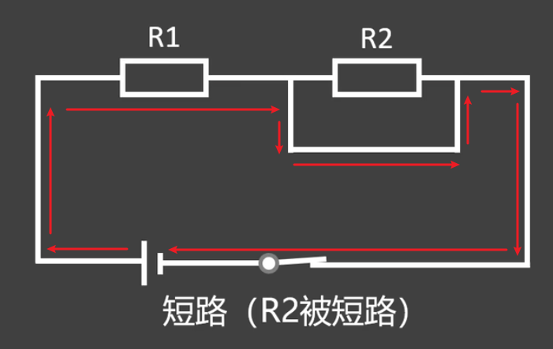  
这样的电路由于有 R1 电阻的存在，虽然 R2 短路了，但是并不会导致危险。

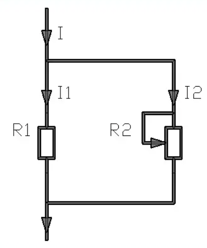  
如果是并联的电路，则电流会被两条电路分摊，如果 R2 电阻为0，则会分摊全部电流；如果 R2 电阻为无穷大即断开状态，则 R1 会分摊全部电流；如果 R1 和 R2 相等，则各分摊一半。

# 电功率
⽤于衡量电流在单位时间内所做的功（⽤来表示⽤电器消耗电能快慢的物理量）。单位：瓦特（简称瓦），符号是W。公式：$P = UI$

### 瓦时和千瓦时
⼆者都是表示电能的⼀种单位。
1. 瓦时：
    * 瓦时是功率（W）与时间（h）的乘积， 即：瓦时 = 功率 × 时间。
    * ⼀个 1W 的⽤电器，⼯作 1h ，它消耗的电量就是1瓦时（ 1Wh ）。
2. 千瓦时：
    * 千瓦时是瓦时的千倍， 通常⽤于描述⼤型电⼒设备，如电表读数、新能源汽⻋等。
    * ⼀个 1kW 的电器⼯作 1h ，它消耗的电量就是1千瓦时（ 1kWh ，俗称1度电）。

### 安时和毫安时
⼆者都是描述电池容量的单位。
1. 安时：表示该电池能以 1A 的电流持续⼯作 1h ，通常⽤于描述⼤容量的电池。
2. 毫安时：安时的千分之⼀，通常⽤于描述⼩容量的电池。

例如：华为『Mate70 Pro』⼿机电池容量为 5700mAh ，充电宝的电池容量为 20000mAh ，有些时候我们也省略 h ，直接说：⼿机的电池容量和为 5700mA ，充电宝电池容量为： 20000mA 。

# 焦⽿定律
焦⽿(J)，简称焦。与电流通过导体产⽣的热量与电流的平⽅成正⽐，跟导体的电阻成正⽐，跟通电时间成正比。$Q=I^2Rt$

例如：⼀根 60Ω 的电阻丝接在 36V 的电源两端，在 5s 内共产⽣多少热量？
$(\frac{36v}{60Ω})^2\times60Ω\times5s$

# 公式梳理
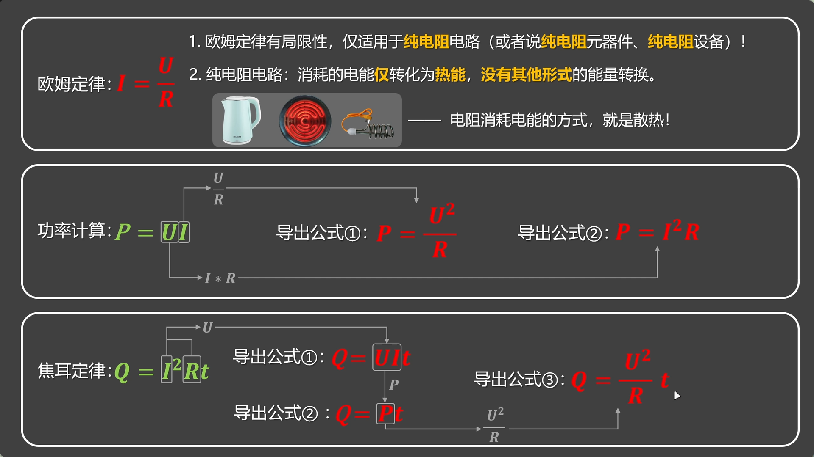  
**注意：欧姆定律只适用于纯电阻设备，所以根据欧姆定律推到出的公式也只能用于纯电阻设备（红色公式）。**

# 电阻器
电阻器是一种电子元器件，它可以提供一定的电阻，限制电流的流动。电阻器是由导体材料（不同的材料电阻差别也很大）制成的，通过将导体材料绕制成螺旋状或折叠状，并将两端引出，形成一个固定电阻值的器件。
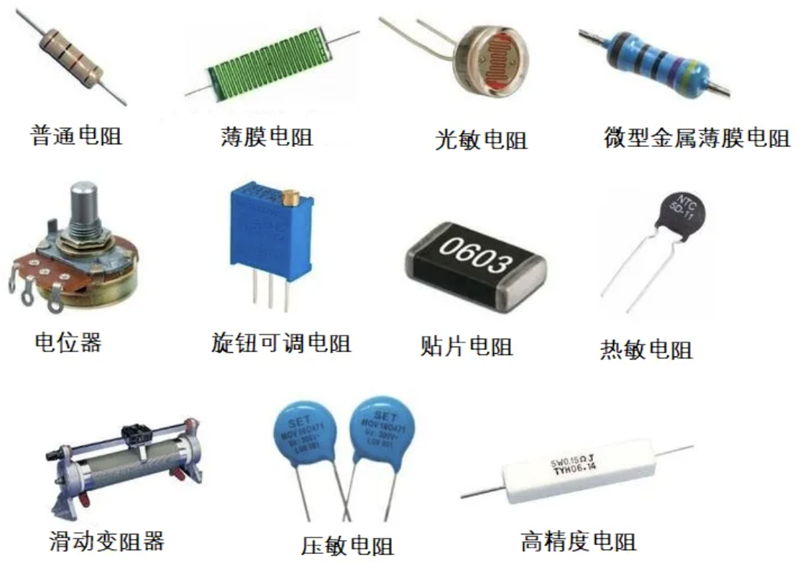  
电阻阻碍电子流动，副作用就是发热。热水器这些就是通过这样的副作用来烧水。

### 基于功能和制作工艺划分
* 普通电阻：普通电阻是一种最基本的电阻器，通常由一根或多根绕在绝缘体上的金属丝或碳膜组成，可以提供固定的电阻值，适用于各种电路中。
* 薄膜电阻：薄膜电阻是一种由金属或合金薄膜制成的电阻器，可以提供高精度和稳定性的电阻值，常用于精密仪器、测量仪器等高要求的场合。
* 光敏电阻：光敏电阻是一种电阻值受光照强度影响的电阻器，常用于光敏电路和光控系统中。
* 金属薄膜电阻：金属薄膜电阻器是一种由金属薄膜制成的电阻器，具有较高的精度和稳定性，适用于高精度电路中。
* 电位器：电位器是一种可调电阻器，通常由一个旋转或滑动的电阻器件和一个旋钮或滑动器组成，可以提供可调的电阻值，常用于电路的调节和控制。
* 旋钮可调电阻：旋钮可调电阻是一种可调电阻器，与电位器类似，但是旋钮可调电阻通常是用旋钮来改变电阻值，通常用于电子设备的调节和控制。
* 热敏电阻：热敏电阻是一种电阻值随温度变化而变化的电阻器，通常用于温度测量和控制系统中。
* 压敏电阻：压敏电阻是一种电阻值随压力变化而变化的电阻器，通常用于压力传感器和压力测量等应用场合。
* 高精度电阻：高精度电阻是一种精度较高的电阻器，通常具有稳定的电阻值和温度系数，适用于高精度仪器和精密测量仪器等场合。

### 电阻我们主要关心： 封装，标称，额定功率
* 封装： 看电阻是什么样的，是直插的还是贴片的，大小是多大。
* 标称： 看电阻表的电阻阻值是多少，精确度是多少，误差1%的，还是5%的，还是20%的，精度越高越贵。
* 额定功率： 额定功率是$P = I^2R = I \cdot U$ ,额定功率其实决定了耐压值。电阻能通过的最大电流是固定的，额定功率越高，耐压值就越高，超过了电阻的耐压值会导致电阻烧毁。

# 电容器
**电容就是装电的容器**
电容器是一种电子元件，用于储存电荷和能量。它由两个导体板和介质层组成，介质层位于两个导体板之间。
当电容器接入电路时，负电荷被储存在导体板上，并在两板之间产生电场。
电容器的单位是法拉（F），一个法拉等于存储一库仑电荷所需的电势差为一伏特的电容器。常见的电容器有电解电容器、陶瓷电容器、聚酯薄膜电容器、铝电解电容器等。
不同的材料介质，容纳电荷的能力不一样。电容的充放电是基于静电力的，不涉及化学反应变化，比锂电池更安全一些。
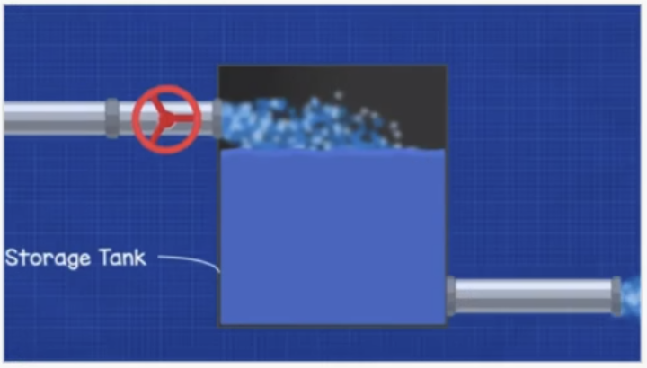  
(电容就像个蓄水箱)

连接到电容的电源电压不应该超过电容能承受的最大值，否则会被击穿。当电容充满电后，电容的电压通常和电源电压相等，电容就可视作开路状态。

**电容与电池的区别**
  

不同的材料介质，容纳电荷的能力不一样。
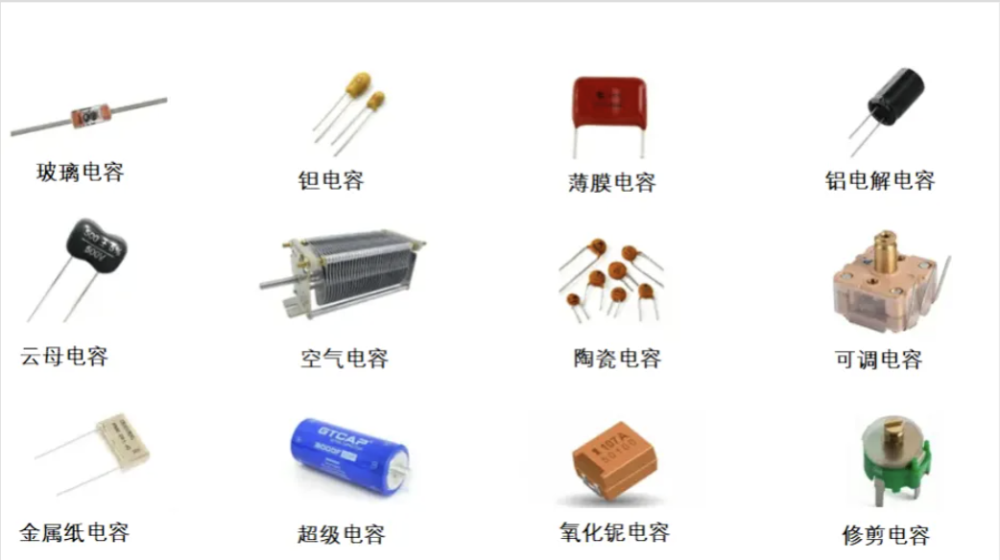  

电容单位是法拉F，其他单位为mf，uf， nf，pf ，
1F（法拉）=  1000 mF（毫法），
1mF（毫法）=1000 μF（微法），
1μF（微法）=1000 nF（纳法） ，
1nF（纳法）=1000 pF（皮法）
**注意： 法拉是个非常大非常大的单位哦，通常电容都是\(10^{-n}\)次方法拉。微法、纳法、皮法是常见单位。**

### 电容器的作用：
阻止电压的突变， 储能，滤波（大电容滤低频，小电容滤高频）。
生活中的电容： 充电器的电源灯并不是立刻断开，里面有电容，电荷慢慢释放掉。
差点的耳机，滤波不好，噪音大。

### 基于功能和制作工艺划分
* 玻璃电容：使用玻璃作为介质的电容器，具有高温稳定性和低损耗等特点，常用于高频和高温环境下的电路中。
* 钽电容：使用钽金属作为电极的电容器，具有小尺寸、大电容量和高频特性等优点，常用于微型电路中。
* 薄膜电容：使用金属膜或金属箔作为电极的电容器，具有高精度、稳定性好等特点，常用于高性能电子器件中。
* 铝电解电容：使用铝箔和电解液作为电极的电容器，具有大电容量、低成本等特点，常用于低频和直流电路中。
* 云母电容：使用云母作为介质的电容器，具有高精度、高频特性等特点，常用于精密仪器和高频电路中。
* 空气电容：使用空气作为介质的电容器，具有高精度、稳定性好等特点，但体积较大，常用于高频和高压电路中。
* 陶瓷电容：使用陶瓷作为介质的电容器，具有小尺寸、高频特性和高温稳定性等优点，常用于电子设备中。
* 可调电容：具有可变电容值的电容器，常用于无线电和调谐电路中。
* 金属纸电容：使用金属化薄膜作为电极的电容器，具有高精度、稳定性好等特点，常用于高性能电子器件中。
* 超级电容：也称为电化学电容器，具有高能量密度、高功率密度和长寿命等特点，常用于储能系统和电动汽车中。

### 有的电容有极性
正负极接错了会爆炸哦！！！

铝电解电容是一种极性电容，由于其特殊的结构和工作原理，如果接反了极性，可能会导致电容器失效或者损坏，甚至可能导致电容器短路或者起火等危险情况。

铝电解电容的结构是由一层氧化铝薄膜和一层电解液构成的。当正极连接正电压，负极连接负电压时，电解液中的氢离子会向氧化铝膜的负极移动，而负离子则向电解液的正极移动，形成一个稳定的电场，从而形成电容效应。如果电容器反接了极性，电解液中的氢离子会向氧化铝膜的正极移动，形成氢气，铝电解电容会爆浆。电容爆浆后压力较大,电解电容的外壳也是无规律的变形,有可能产生手榴弹爆炸后的效果,容易造成其他元器件的损坏。

**上面图中的铝电解电容、云母电容，这种脚一长一短的就是有极性的，一般长脚为正极，短脚为负极。**
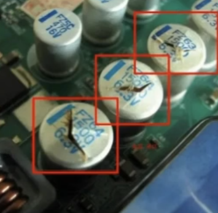  
（铝电解电容鼓包爆浆）

##### 超级电容
灯能亮多久？
t = (C * V) / I
t 是放电时间（单位：秒）
C 是电容的容量（单位：法拉）
V 是电容的电压（单位：伏特）
I 是放电电流（单位：安培）
 
C = 1.5F
V = 2.8V
I = 20mA = 0.02A
将这些值代入公式，计算放电时间：
t = (1.5 * 2.8) / 0.02 ≈ 210秒

### 容抗
电容器就像连接在自来水管里的水箱，水箱可以储水和放水。电容器在电路里也具有充电和放电的功能，是一个储能容器。当把它接在交流电路上的时候，由于交流电的大小和方向随时间变化而变化，因此电容器也在不断的充电和放电，电容器的板极上所带的电荷就对发生定向移动的电荷具有阻碍的作用，我们把这种阻碍作用就叫做电容器的容抗，用字母表示，其大小由公式$Xc=\frac{1}{(2πfC)}$来确定。式中： Xc 容抗，国际单位制单位为欧姆(Ω)，f交流电的频率，国际单位制单位为赫兹（Hz），C电容器的容量，国际单位制单位为法拉(F)。由式中可以看出：交流电的频率越高、电容器的容量越大，电容器的容抗就越小。因此电容器具有**通交流阻直流，通高频阻低频**的作用，直流电(f=0， Xc →∞ )不能通过电容器的 ，电容器的这点特性刚好与前面讲的电感线圈的特性刚好相反。**感抗和容抗只存在于交流电路中**，在纯电阻电路里只有一些分布电感和分布电容存在，对线路影响不大。

交流电频率越高，刚压进去一些电子，正负极就变了，电容开始放电，此时电子还没有压入多少，所以阻碍作用低，说明容抗低。频率越低就会压越多的电子后才改变正负极，阻碍作用就会更大，容抗越高。

#### 电阻与电容
在交流电中，电容和电阻都能对电流与产生阻碍作用，但是电阻会发热，电容不发热。所以在大功率用电器中可能会使用电容来代替电阻作为限流/降压元件。

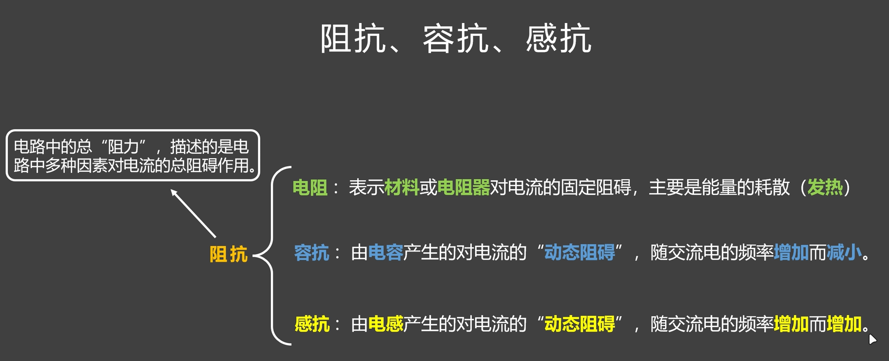  

# 电感器
**电和磁之间有密切的关系**

当我们在水里扔一块石头时，会产生一个涟漪，涟漪会从石头周围向外扩散。电和磁也是如此。当电通过导线时，它就像是在水中扔了一块石头一样，会在周围产生一个磁场，这个磁场就像是涟漪一样向外扩散。反过来，当一个磁场改变时产生的涟漪又会带动周围的电子运动，这些涟漪会产生电场，这就是电磁感应的原理。

**电和磁可以互相转换。**

电机中的电流流过线圈，从而产生磁场，这个磁场将旋转部件（例如电动机轴）带动起来。这就是电磁感应原理的应用。

发电机和电机相反。通过旋转磁场，发电机可以转换机械能为电能。
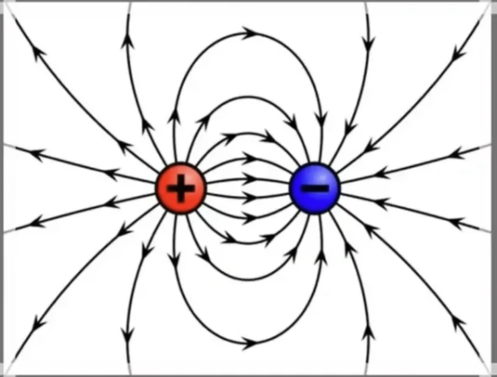  

### 什么是电感器
电感器是一种电子元件，用于在电路中存储和释放能量。它由一个线圈组成，通常由铜线绕成，通常带有一个铁芯。当电流通过电感器时，它会在线圈中产生一个磁场，从而存储能量。当电流停止流动时，磁场会崩溃，导致电感器释放存储的能量。

电感器的主要作用是在电路中调节电流的变化率。它可以用来过滤电路中的高频噪声，电感器两端的电流不会突变，保护其他电子元件不受到电磁干扰的影响。

### 电感器的核心要点
* 通过磁场存储能量
* 阻止电流的突变（电流从电感器流过，产生磁场。当电流突然中断的时候，电感器产生的磁场会转化为电流，慢慢的消失）
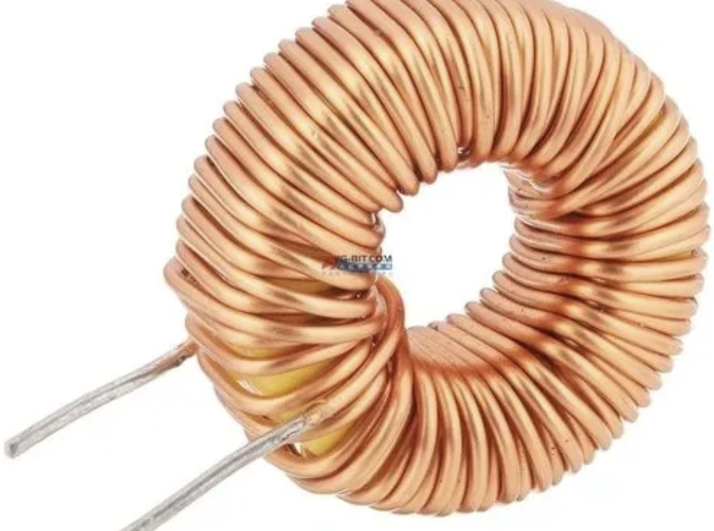  
（电感器）

**电容稳压，电感稳流。**

### 电感和电阻
**理想的电感没有能量损耗**（但是线圈有电阻，所以会产生能量损耗。如果有常温超导体就可以实现无能量损耗了。）

电感： 电磁感应元器件，电会产生磁场，磁场又会抵制电流的变化。理想的电感没有能量损耗。
跟电阻不同，电阻阻碍电流，发热。

电感使用漆包线，纱包线等外部绝缘导线缠绕到铁芯上

电感的单位是亨利（Henry）表示为H，它的中文读法是“恒利”，以英国物理学家亨利的名字命名。
电感的基本单位是：H（亨），它和电容一样，也是一个很大的计量单位，另外还有毫亨mh、微亨uh、纳亨nh

**电感的作用：**
电感可以作为电路稳定器的一部分，通过抵抗电路中电流的变化，保持电路的稳定性和可靠性。
由于电感器在电流变化的时候会产生阻碍电流，所以在交流电中，如果交流电变化频率很快，那么在半个周期内的电流不足以克服阻碍电流，所以会导致电流永远过不去，即**通直流，阻交流**的作用。

### 电感电容组成LRC振荡电路
##### 振荡电路原理
LRC振荡电路是一种基本的振荡电路，由电感L、电容C和电阻R组成，可以产生稳定的交流电信号。在LRC振荡电路中，电感和电容通过共振的方式相互作用，导致电荷周期性地从电容器到电感器和反向流动，从而产生周期性的电流和电压信号。

LRC振荡电路的工作原理是当电容器放电时，电感器中的电流开始增加，而电容器的电荷开始减少。当电容器的电荷达到零时，电感器中的电流达到最大值，并开始流回电容器中，导致电容器的电荷开始增加。当电容器的电荷重新达到最大值时，电感器中的电流达到零值，并开始再次增加。这个过程不断重复，从而形成一个周期性的交流电信号。

**LRC振荡电路的频率由电感L和电容C的值决定，可以通过调整电感和电容的值来改变输出信号的频率。**
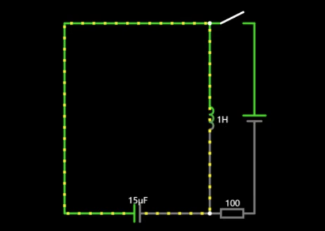  

# 保险丝，熔断器
保险丝和熔断器都是用来保护电路免受过载或短路等电气故障的设备。

保险丝是一种电气元件，通常由金属丝或铜箔制成，其作用是在电流过载时断开电路，以保护电路中其他电气元件不受损坏。当电流达到或超过保险丝的额定电流时，保险丝中的金属丝或铜箔会被加热，最终熔断，中断电路，以避免电气火灾等危险情况。

熔断器与保险丝类似，与保险丝不同，熔断器通常可以重复使用（如使用某些金属材质，电流过高导致温度升高导致金属熔化断电，电流恢复导致温度降低导致金属凝固通电）。熔断器的另一个优点是它们通常比保险丝更快地响应电气故障，因此能更好地保护电路。

（如烧水壶达到100度后会断电，就是用的熔断器，只是另一种原理的熔断器。它利用了两种不同膨胀系数的金属贴合在一起形成的双金属片。当温度升高时，由于两种金属膨胀程度不同，导致双金属片弯曲变形。在烧水壶中，当水温接近沸点（如100度），双金属片会因为感受到的温度变化而弯曲到一定程度，从而触发一个机械动作断开电路，停止加热。随着水壶冷却，双金属片恢复原状，但为了安全和功能设计，通常需要手动复位。）

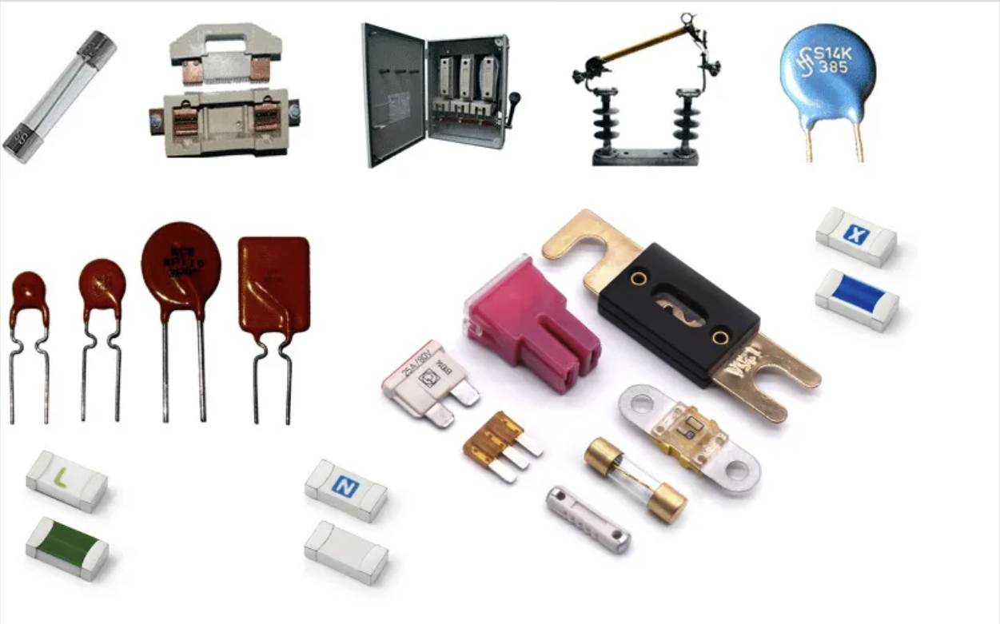  

##### 购买元器件最重要的看参数
熔断速度，慢速，中速，快速，特快速。
* 快速熔断器： 熔断时间小于0.001秒
* 电压额定值：所能承受的最高电压
* 电流额定值：所能承受的最高电流
（电压、电流额定值的，通常要留一些冗余，）

熔断特性：快速熔断器适用于对电路的保护要求较高的场合，能够在短时间内切断过载电流或短路电流；而慢速熔断器则适用于对电路保护要求不高的场合，能够在一定时间内承受额定电流的2-3倍电流。

# 接插件
开关，按键，连接端子本质上都是电路连接器。
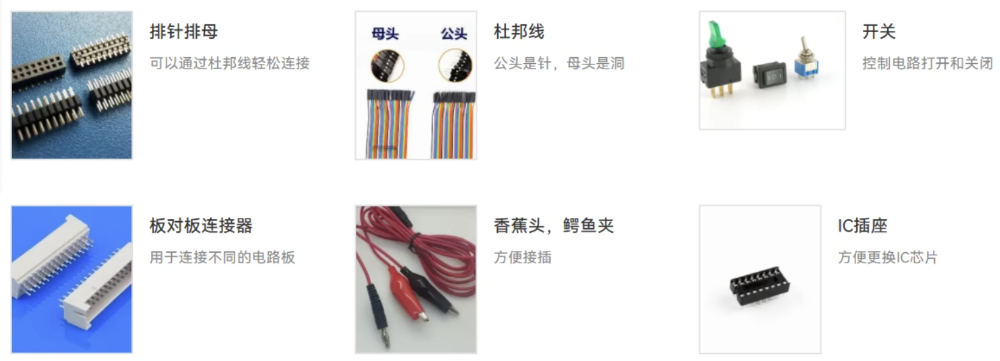  
接插件，也称为连接器，主要用于电路内线与线之间的连接，它的作用主要体现在以下几个方面：

1. **快速连接与断开**：接插件使得电气设备和电子装置之间的连接变得简单快捷。通过接插件，可以在不需要焊接的情况下实现电线、电缆或电路板之间的连接与断开，这极大地方便了生产和维护。

2. **增强设计灵活性**：在产品设计阶段，使用接插件可以增加设计的灵活性。例如，在需要根据客户需求调整功能模块时，采用接插件可以使模块化设计更容易实现，便于后续升级或修改。

3. **提高可靠性**：良好的接插件设计能够提供可靠的电气连接，减少因接触不良导致的故障。特别是在震动或者环境条件较为恶劣的应用场景中，合适的接插件能保证稳定连接，避免由于连接问题引发的系统故障。

4. **简化制造过程**：在大规模生产过程中，使用接插件可以显著简化装配流程，降低人工成本和时间成本。同时也有助于自动化生产的实施，提高生产效率。

5. **保护接口**：一些接插件还具有防水、防尘等功能，可以保护内部电路不受外界环境的影响，从而延长设备使用寿命。

综上所述，接插件不仅在电子电器产品的组装、维修和升级中扮演着重要角色，而且对接口提供必要的保护，提高了产品的可靠性和耐用性。随着技术的发展，接插件也在不断进化，以满足更多样化的应用需求。

# 蜂鸣器
**能发出哔哔哔的声音的小元器件。**
声音是由物体的震动产生，一切发生的物体都是在震动。 震动的频率不同，声音的音调就不同。
蜂鸣器分有源蜂鸣器和无源蜂鸣器， 源是震动源。有源蜂鸣器插电就叫， 无源蜂鸣器插电不叫，需要一定周期的高低电压信息给他，他才会叫。
蜂鸣器的音频是指蜂鸣器发出的声音的声波频率，是指每秒连续循环的次数。频率的计量单位是“赫兹”(Hz)，人类听觉的频率范围约为20-20kHz。20Hz以下是次声，20kHz以上是超声波。
蜂鸣器常用产品的谐振频率为2-4 kHz。

**LED 灯、蜂鸣器、显示屏，都是可用于人机交互的物件。通过 LED 灯的闪烁方式，蜂鸣器的声音节拍，显示屏显示的内容，可以让人明白机器所要表达的内容。**

# 万用表
**万用表是我们必须熟练掌握的工具**
万用表是一种电子测量仪器，可用于测量电压、电流和电阻等电学量。它通常具有多个量程和功能，可以通过旋钮、按钮或选择开关进行选择。

### 万用表的使用
##### 万用表测电阻
1. 预估电阻阻值
2. 调整到合适的欧姆档位
3. 把万用表的笔的两端接到电阻的两端
4. 读取万用表显示的数字
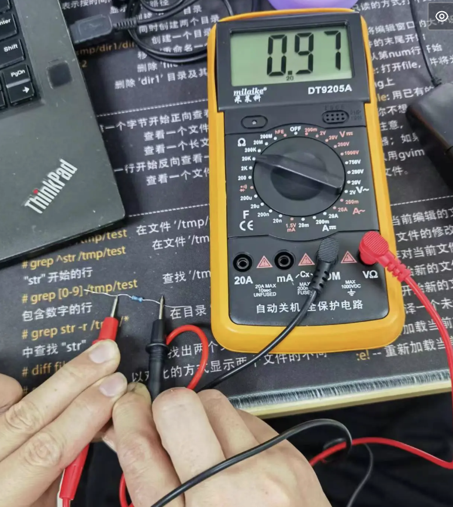  

##### 万用表测电压
1. 预估测试的电压
2. 调整到合适的电压档位（注意区分直流，交流）
3. 把万用表的笔的两端接到供电电源的两端
4. 读取万用表显示的数字
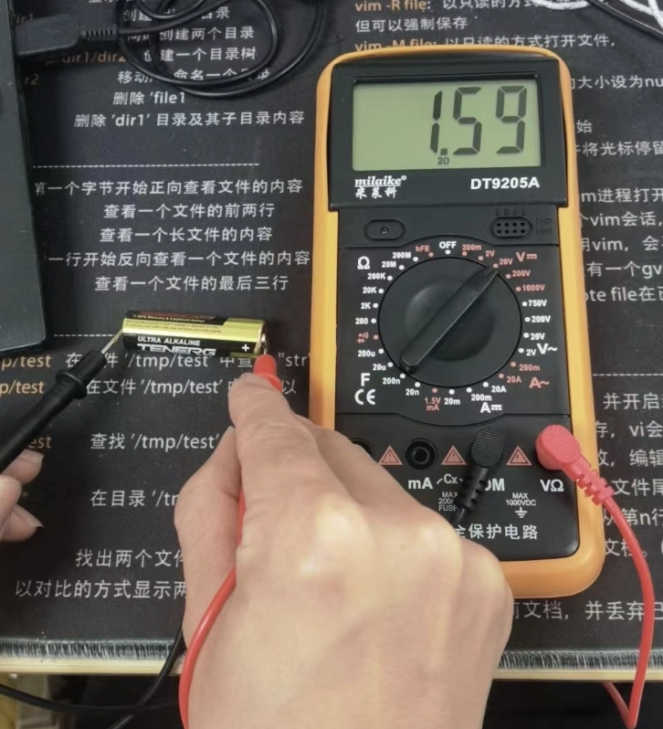  

##### 万用表测电流
1. 预估测试的电流
2. 调整到合适的电流档位（注意区分直流，交流）
3. 把万用表的笔的两端串联到电路中
4. 读取万用表显示的数字
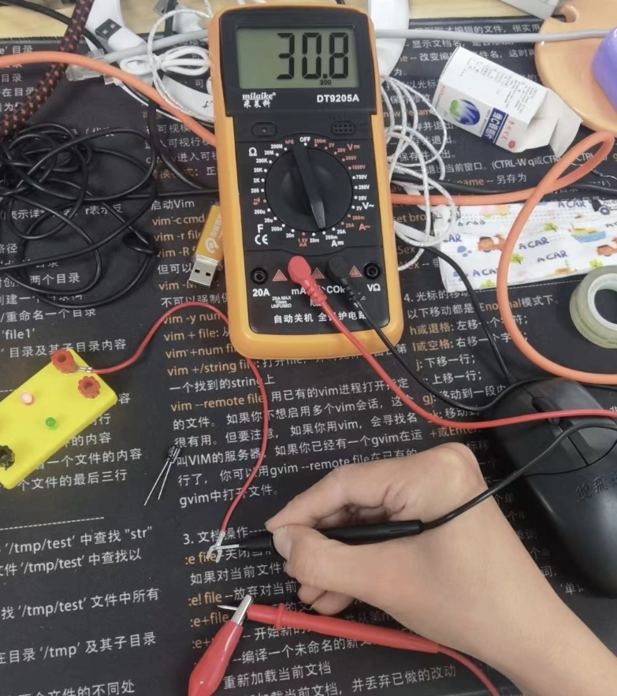  
测电流的实际应用场景不多

# circuit 使用讲解
  
* 欧姆定律：演示电压电阻的关系
* 电阻：计算电阻串并联的阻值
* 电容器：观察电容器的充放电
* 电感器：观察电感器对电流变化的阻碍作用
* LRC振荡电路：利用电容和电阻组成振荡电路
* 分压器：电阻分压，观察不同位置的电压
* 可变电阻：电阻可以拖动改变大小
* 电位器：拖动电位器，电位器的电压会发生变化
* 戴维宁定理：任何复杂电路可以等效为一个电压源和一个电阻器组成
* 诺顿定理：任何复杂电路可以等效为一个电流源和一个电阻器组成
* 基尔霍夫定律：对于电路中任一节点,流入节点的电流之和必等于流出该节点的电流之和

# 毫安时和毫瓦时
毫安时（mAh）和毫瓦时（mWh）是两个不同的物理量，它们分别表示电量和能量的度量单位。
3400mAh的电池可以以3.4A的电流放电一小时。
12580mWh电池以12.580瓦的功率输出一小时 P = IU（功率=电压*电流）。
所以12580mWh换算为毫安时为：12580/3.7=3400mA（3.7是电池的电压）。

### 一节5号电池含有几度电？
5号电池容量800mAh
5号电池的电压是1.5V， 1.5V乘以0.8得到的是1.2wh， 说明5号电池以1.2瓦的功率工作可以工作1小时， 1度电又叫一千瓦时。 1000除以1.2等于833，也就是833节5号电池相当于1度电。
特斯拉含有7000节18650电池，每个18650电池12.5瓦时,充满特斯拉汽车需要12.5*7000的能量，约等于87.5度电， 一度电5毛钱。不到50元的电费，跑500公里，所以非常非常划算。

# 开关电路
**用电去控制电是计算机工作的核心原理**
开关电路是一种基本的电路，它可以控制电流或电压的流动或输出。简单的讲就是用电来控制负载电流或电压的输出。
开关电路在现代电子技术中有着广泛的应用，是电子电路设计和实现中必不可少的一部分。
用电去控制电，也是计算机工作的核心原理。

# 继电器
用电信号去控制电
继电器、真空管和晶体管都是用于实现电信号的开关控制的电子元件，继电器最容易理解，我们先讨论继电器。
继电器是一种电气元器件，它通过接受一个电信号来控制另一个电路中的电压或电流。继电器通常由一个磁铁和一个电磁线圈组成。当通过线圈流过一定电流时，磁铁会产生磁场，使触点间距变小，进而接通电路。继电器由于具有绝对稳定、高效率、长寿命、安全可靠等优点，因而在自动化、电力、通信、电子等领域中广泛应用。
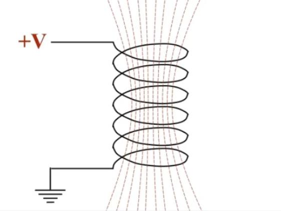  
继电器用到了电和磁的特性，通电的螺线圈会产生磁场，从而可以吸起一些金属达到通电的目的。
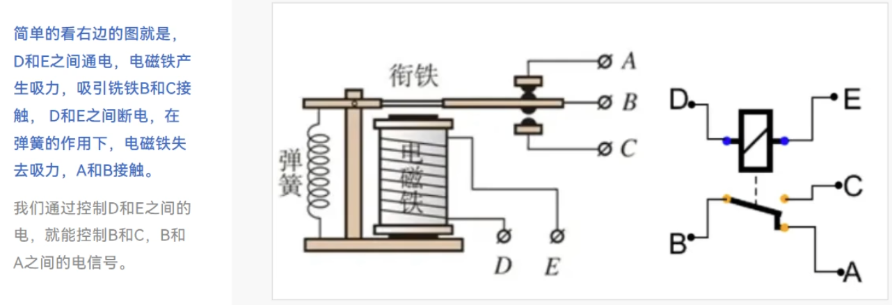  
AB叫常闭端口，CB叫常开端口。
现代计算机使用晶体管替代了继电器。

# 二极管
我们都听说过硅半导体，其实纯净的硅导电性很差，接近于绝缘体，基本上是不导电的。但是在硅中掺杂一些三价硼五价磷硅的导电性就会增加。
p的英文是positive，带正电
n的英文是negative，带负电
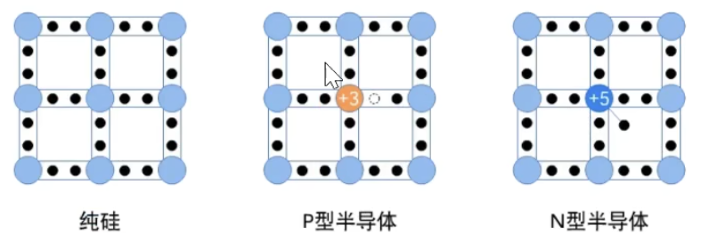  
纯硅每个原子周围有4个电子，是稳定结构，不导电的。当掺杂了硼后，硼每个原子只有3个电子，从而形成了空洞，变成了“P型半导体”带正电。掺杂了磷后，磷每个原子有5个电子，从而多了个电子形成“N型半导体”带负电。

二极管是一种电子元件，它由两种不同类型的半导体材料制成。这些材料被安排在一起，形成了一个名为 P-N 结的结构。**这种结构使得电流只能沿一个方向通过二极管，而另一个方向则无法通过。**
因为二极管只允许电流在一个方向上通过，所以它在电子学中有很多用途。例如，我们可以使用二极管制作电池充电器、电源适配器和许多其他电子设备。
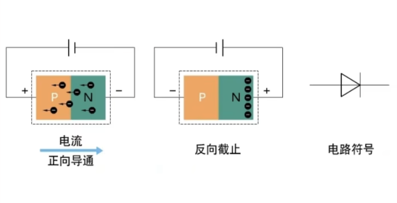  

### 二极管整流
将交流电变换为直流电称为AC/DC变换，这种变换的功率流向是由电源传向负载，称之为整流。
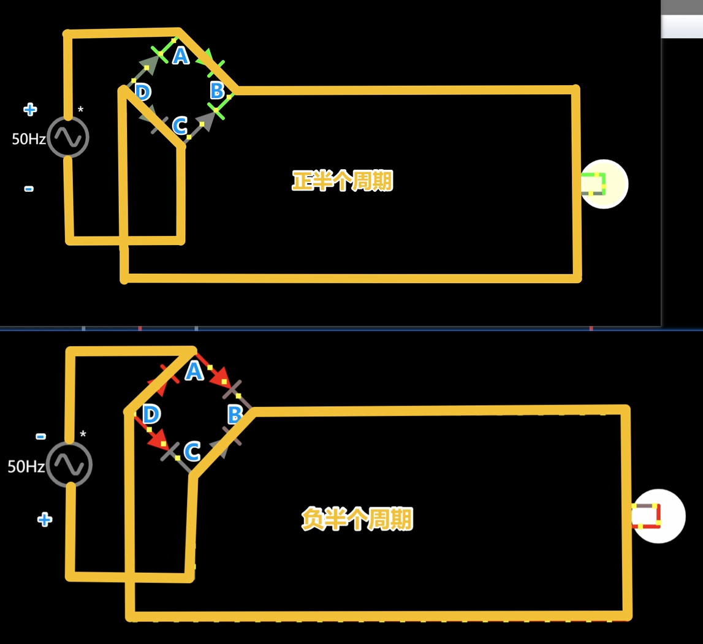  
二极管按照图中方式布局后，可将交流电整流为直流电。
**图一中为什么电流达到D点后不会走A点，是因为电流只会往电压更低的地方流动，A点的电压明显比D点更高（D点经过用电器灯泡后电压肯定会降低）；而C点接地，所以会从C点流往负极。图二同理。**

#### 全波整流
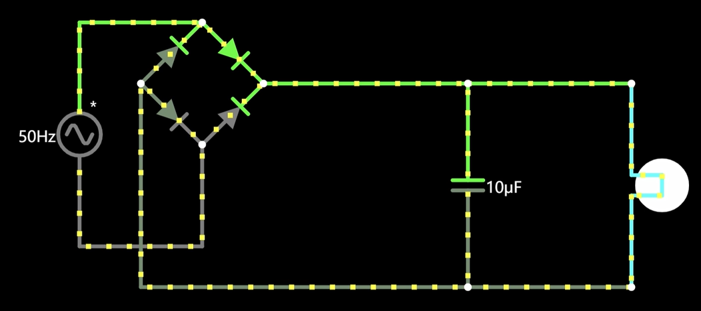  
在二极管整理之上，加个电容，用于解决交流电在正负变换时，低电压导致电压不足的情况。低电压时电容里的电进行补充。

# 三极管
**三极管是一种非常重要的电子元器件**
三极管有三个区域，所以它被称为三极管。这三个区域分别被称为发射极、基极和集电极。
当在三极管的基极输入电流信号时，这个信号可以控制三极管的集电极和发射极之间的电流流动。这样的话，我们就可以通过改变输入信号的电流来控制输出电流的大小。
三极管常常被用来放大电信号，例如在无线电和音频放大器中。它们也可以用来控制电路中的电流，例如在电子开关和电源电路中。

我们可以将水龙头比作三极管的电路，水流就相当于电流，水龙头的开关就相当于控制三极管的输入信号。
当我们打开水龙头时，水就从水管中流过来，当水龙头的开关处于开启状态时，水就会顺畅地从水龙头中流出来，当开关处于关闭状态时，水流就会停止。
同样地，当我们将电路中的电源连接到三极管时，电流就会流过来。当三极管的输入信号（比如控制信号）被送到三极管的基极时，三极管就会开启，电流就会从三极管的集电极流出来，当控制信号消失时，三极管就会关闭，电流就会停止流动。

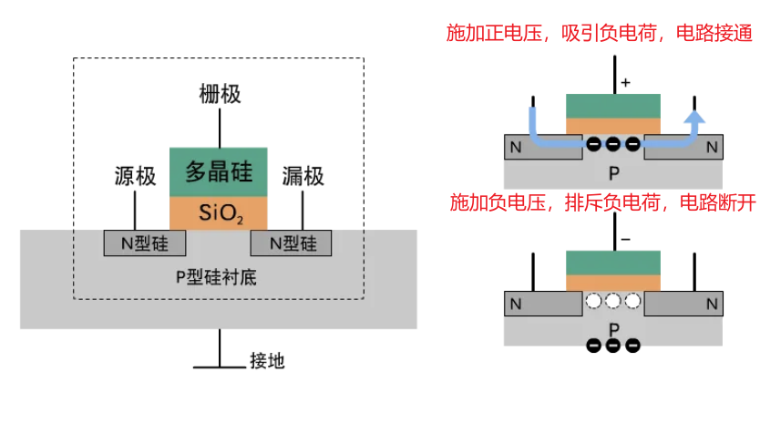  
（特殊的三极管——MOS管）

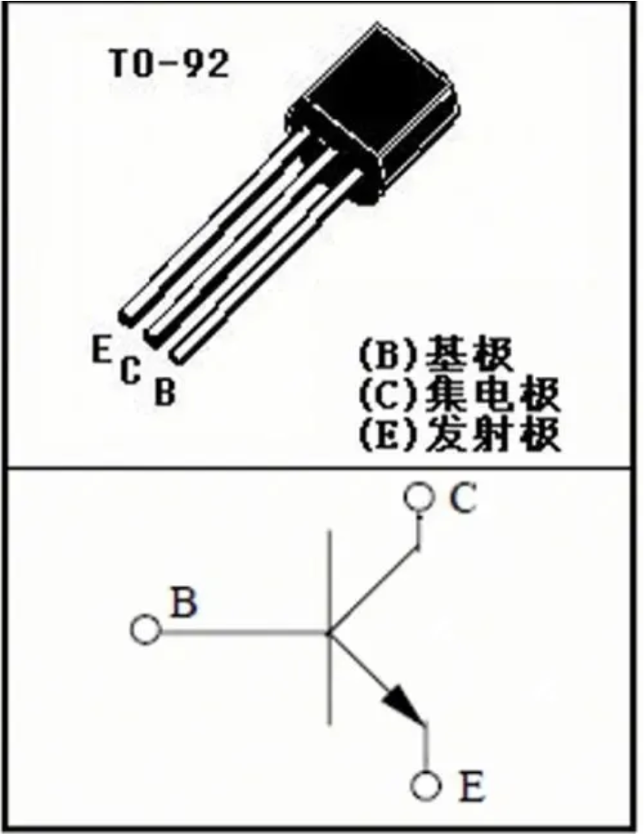  
（B给正电压C和E就导通，B给负电压C和E就断开。这就是用电控制电。）

二极管、三极管、MOS管这些都是晶体管，在CPU上可以做到纳米级别的大小，所以非常省电。

##### 两种不同类型的三极管
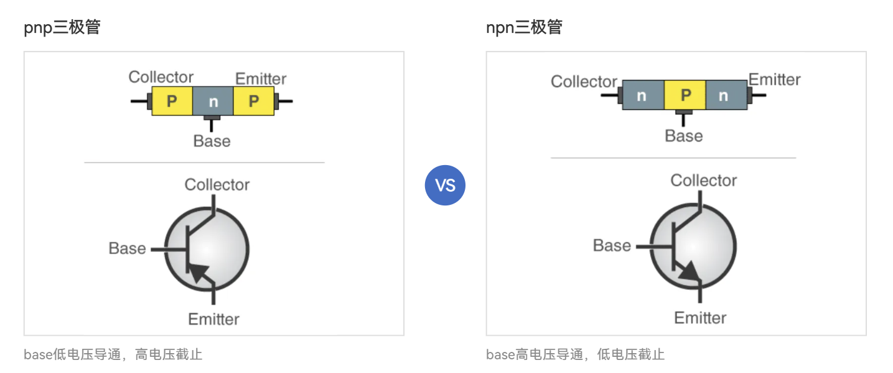  

三极管的放大特性：三极管可以用小电流去控制大电流。

##### 三极管应用案例
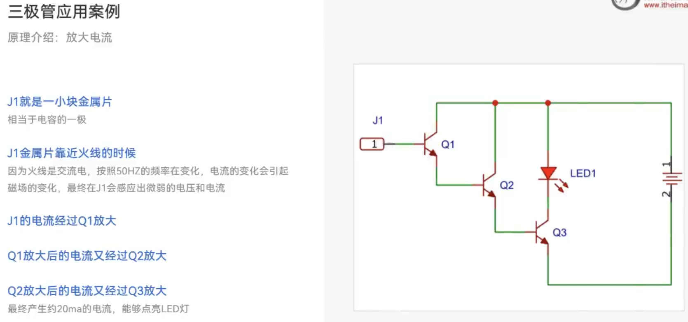  

##### MOS管
三极管控制端使用电流控制，会耗一些电，并且在集电极那端的电压不能太大。MOS管控制端使用电压控制，并且集电极那端能承受更高的电压。

# 比较器（运放）
**运放是一种电路元件，可以处理两路电信号**
运放一般是通过比较输入信号的电压大小来产生输出信号的。在运放的差分输入端口，通常会接入两个电压信号，一个是（+IN）的电压，一个是（-IN）的电压。运放会通过放大、比较这两个电压信号的大小关系，然后产生一个输出电压信号。
需要配置输出的高电压，低电压和运放的阻抗。阻抗越大，运放对电路的影响越小。
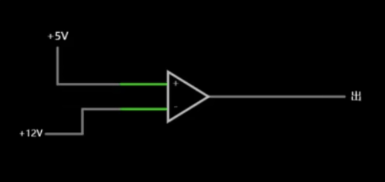  
比如：上面的电压大于下面的电压，输出高电平的信号；上面的电压小于下面的电压，输出低电平的信号。

# 反相门（非门）
**高电压变低电压，低电压变高电压**
非门（NOT gate）：非门是一种只有一个输入端口和一个输出端口的逻辑门，它的输出等于输入的反向，即当输入为高电平时，输出为低电平，反之亦然。因此，非门有时也被称为"反相器"。
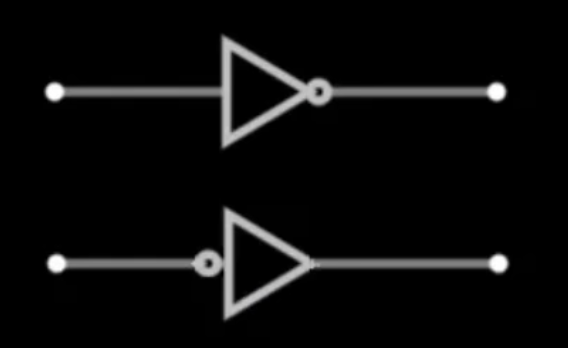  

# 或非门
**电子电路中一种常见的元器件**
或非门（NOR gate）是电子电路中常见的一种逻辑门。或非门的输出信号取决于所有输入信号的状态，但是只要有一个输入信号是高电平，那么它的输出信号就会是低电平；只有当所有的输入信号都是低电平时，它的输出信号才会是高电平。
换句话说，或非门就像一个大门，只有所有的输入都是关着的（低电平），才会打开大门（输出高电平），否则大门就会保持关闭（输出低电平）。
  
从代码角度看就是 `!(A || B || C || D)` 当ABCD都是false才输出true。

# 双稳态触发器
**电子电路中一种常见的元器件**
1. 有两个稳定状态低电压0态和高电压1态；
2. 能根据输入信号S将触发置成0或1态；
3. 输入信号消失后，被置成的0或1态能保存下来，
4. 即具有记忆功能，直到R端高电压重置为止。

输出的电压根据你第一次输入的电压相关，具有记忆功能，直到R端被高电压电压重置。
 
重点在于一个或非门的其中一个输入使用了另一个或非门的输出。

# NE555 的实现原理
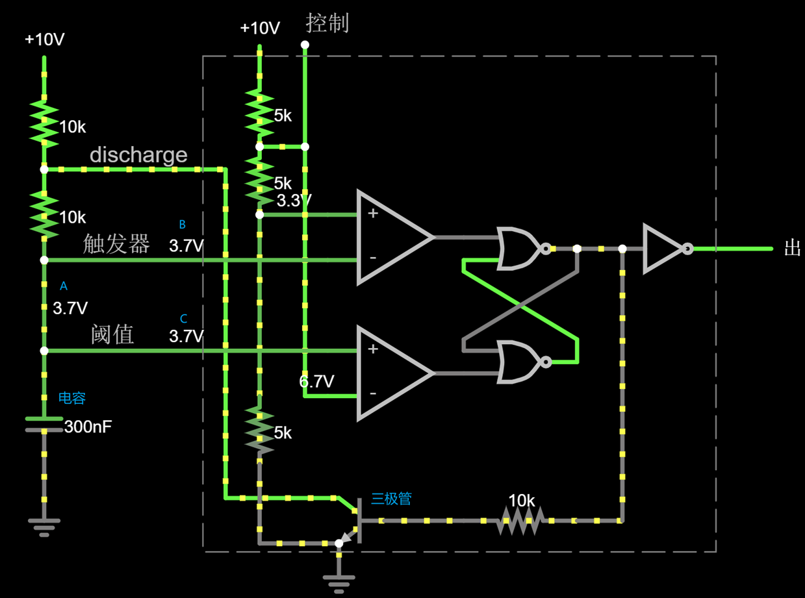  
（图1）
* NE555 中 A,B,C 三点的电压是相等的，等同于电容的电压。
* 第二列有3个5k欧电阻，所以叫NE555。3个电阻将这条线上的电压三等分，从而实现电压变化时在比较器（运放）上进行比较后会触发双稳态触发器的变化，从而控制电流的流动。
* 当ABC电压低于6.7V时，如图1所示，输出端由于非门前为低电平，所以输出高电平。
* 当电容充电，ABC电压也会逐渐升高，当电压达到6.7V时，下面的比较器会输出高电平，从而导致双稳态触发器的切换。
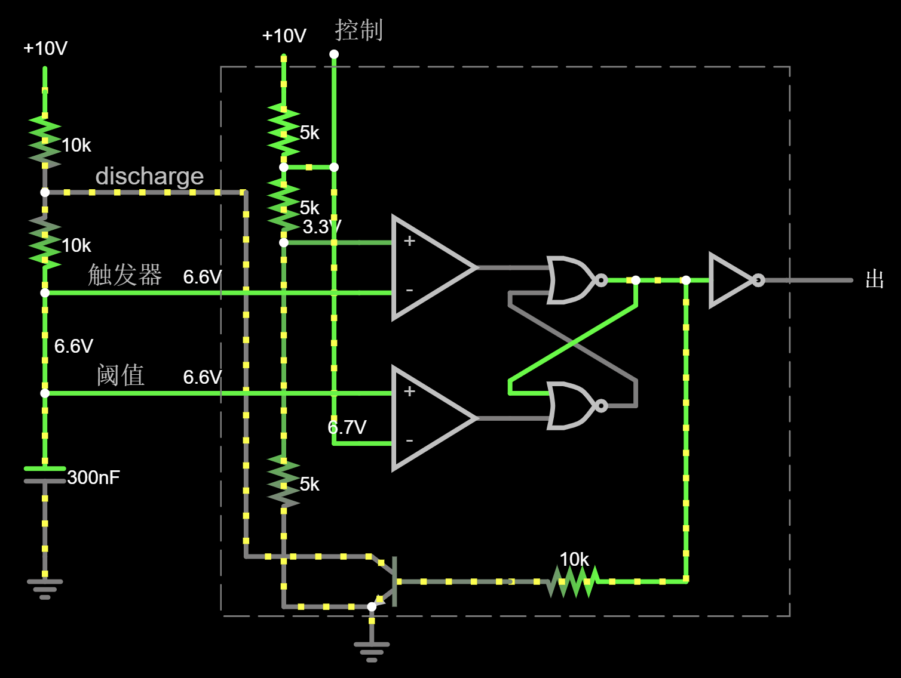  
（图2）
* 双稳态触发器切换后，输出由于非门前的电路变成了高电平，所以输出变成了低电平。同时底部的三极管激活，discharge 便与接地连通，开始漏电。
* 漏电导致ABC的电压逐渐降低，当电压降低到3.3V时上方的比较器输出高电平，从而导致双稳态触发器上方的输出为低电平，再次进行切换又回到图1状态，输出高电平，漏电停止，电容开始充电。

NE555 的输出波形就是一个典型的振荡器的波形。

### NE555工作原理
NE555是一种常用的集成电路，也被称为555定时器。它可以用来产生各种类型的脉冲波形，包括方波、脉冲、正弦波等。其工作原理是基于内部比较器、多种外部电阻和电容等元件构成的时序电路。NE555通常由电源电压Vcc、地GND、控制电压CV、输出OUT和复位RST等引脚组成。

NE555的工作原理是：当电源电压Vcc被接通时，电路开始工作，电容器C开始充电，直到其电压达到2/3的Vcc时，内部比较器的输出将变为高电平。此时，输出OUT也会由低电平变为高电平。当电容器C电压下降到1/3的Vcc时，内部比较器的输出将变为低电平，此时输出OUT也会由高电平变为低电平。电容器C又开始充电，电路又开始了一个新的周期。
周期T（秒）是由外部电容器C和两个外部电阻R1、R2的值决定的，公式为T=0.693×(R1+2×R2)×C。占空比D是指方波周期中高电平的时间比例，公式为D=(R1+R2)/(R1+2×R2)。因此，通过改变电容器C和电阻R1、R2的值，可以改变方波波形的周期和占空比。
总之，NE555工作的原理是基于时序电路的构建，通过改变外部电容器和电阻的数值来控制周期和占空比，实现各种脉冲波形的产生。

**一般我们用芯片计算公式都会在里面给出，如果大家纠结公式的细节，就需要好好学习电学的各种知识。不过我们工程师以应用为主的话，只需要看数据手册就可以了。**

0.693是自然对数e的一个近似值，通常也用符号ln(2)表示。在NE555定时器的工作原理中，0.693是指电容器C充电或放电的时间常数，可以用来计算电容器充电或放电的时间。具体来说，当电容器充电或放电时，其电压会以指数形式增加或减小，电容器电压到达63.2%（即1-1/e）时，电容器的充电或放电时间就等于0.693×R×C，其中R是电阻的值，C是电容器的电容值。因此，0.693常常被用于计算电容器充电或放电的时间。在NE555定时器中，由于电容器充电或放电的时间常数是0.693×(R1+2×R2)×C，所以0.693也会出现在计算定时器的周期和占空比的公式中。

# PCB
[PCB PPT](https://ppt.sankki.com/s/97bw4plzw2)
### 什么是PCB
**PCB就是印刷电路板**
PCB是一种非常重要的电子零件，它像电子设备的底板一样，可以帮助各种电子元件连接在一起。就像我们在做搭积木一样，需要一个底板来支撑和连接各种积木一样，PCB就是电子设备中的底板，支撑和连接各种电子元件。现在我们的手机、电脑、电视任意的电子设备里面都必须有PCB。
PCB是Printed Circuit Board的缩写，中文名称为印刷电路板，是一种用于电子设备中的基础组件。它通常是由一个薄而平坦的非导体材料制成，表面印有金属线路和其他电子元件，用于连接和支持电子元件，使它们可以按照设计的方式相互通信和交互。

**PCB 上的线路不要走直角，容易形成干扰。**