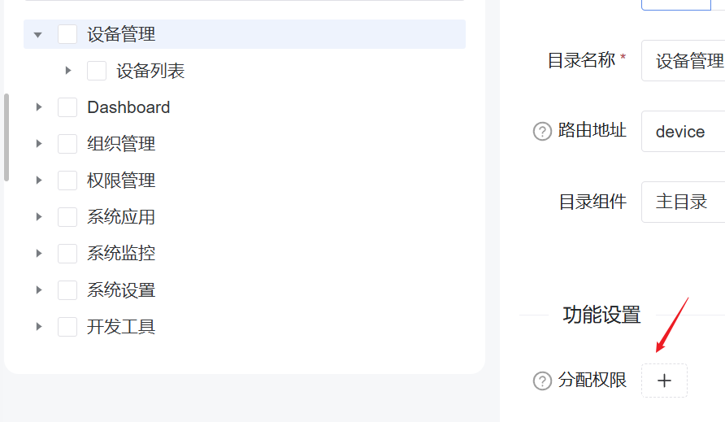
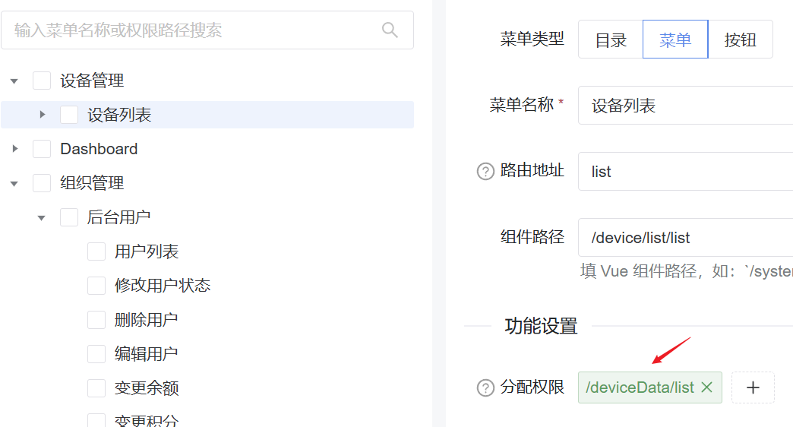
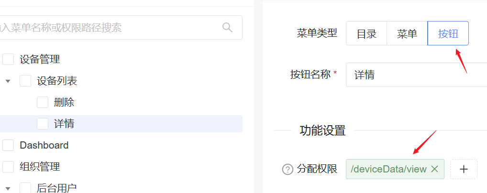
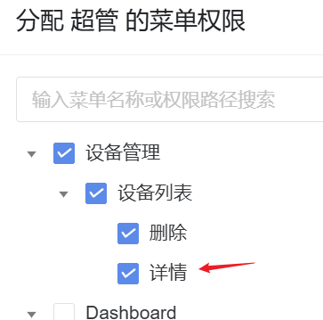
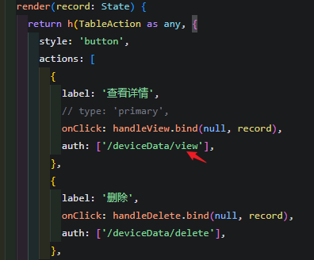
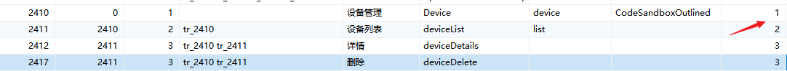

## 登录
1. 进入`internal\logic\admin\site.go`中的`AccountLogin`方法，会进行账号登录校验。校验时会调用`dao.AdminMember.Ctx(ctx).Where`查询用户信息。校验通过调用`handleLogin`方法进行登录。
2. `handleLogin`会使用用户的信息，作为生成JWT Token的基础数据，然后调用`token.Login`方法生成token、有效期等。
3. `token.Login`方法中会使用`jwt.NewWithClaims`方法生成JWT Token，生成时会使用`Claims`结构体，包含用户信息、有效期等。此方法会返回token和有效期。
4. 最后将生成的token和有效期等返回给前端。
5. 前端收到token和有效期等后，会将token存储到本地，后续请求会将token作为header中的Authorization字段发送。

### 登录后的请求
1. 前端每次请求会带上token。后端收到请求后，会进入`DeliverUserContext`这个middleware中，并调用`ParseLoginUser`方法解析token中的用户信息。
2. `ParseLoginUser`方法会调用`parseToken`方法解析token，得到用户信息。
3. 返回`ParseLoginUser`方法，会进行一些校验，没问题后，通过解析token得到的用户id，从缓存中获取到用户信息并返回。
4. `DeliverUserContext`拿到用户信息，添加到`ctx.User`中。

## 缓存
在使用`cache`包时，默认是使用file缓存，在`config.yaml`中的`缓存驱动`配置。缓存和消息队列默认都是文件存储，避免强行依赖其它工具（如Redis），实际开发可都改为Redis。

## 安全
### AES加密
内置了AES加密功能，后端在`utility\encrypt\aes.go`中，前端在`src\utils\encrypt.ts`中。接口中加密时不要整个接口都加密，只加密敏感字段。
### 密码加密
密码使用MD5加密`gmd5.MustEncryptString(pwd + user.Salt)`。
当新增用户时，会使用`data.Salt = grand.S(6)`生成一个随机盐值，`data.InviteCode = grand.S(12)`生成一个随机邀请码，`data.PasswordHash = gmd5.MustEncryptString(data.Password + data.Salt)`生成密码的哈希值，会存储到数据库用户表中。

## 角色权限配置
1. 所有用户的`菜单权限`需要开启`个人中心-个人设置`相关权限，否则无法进入个人设置页面，无法修改密码等。

## 注意点
1. 超级管理员在源码中有些地方是通过`id === 1`来判断的，所以超级管理员的用户id必须为1。如后台用户里的操作按钮。

## 权限
### 后台管理系统中分配权限流程
权限配置中分配权限功能是分配给此页面调用的API地址，要填写合理的API地址才能正常访问。
**注意：菜单权限功能中，修改了权限后多点几次保存修改似乎才会生效。**
1. 一级菜单通常不用分配权限，因为只设计到展开功能，通常不会调接口。
      
2. 二级菜单需要分配权限，因为二级菜单通常涉及到页面的访问，需要调用接口来获取数据等。
      
    这里页面会调用`/deviceData/list`接口来获取设备列表数据，如果没有分配权限，就无法访问此接口，页面就无法正常显示数据。
3. 按钮权限要分配它触发的接口的权限，并且前端可以根据权限地址来决定按钮是否显示。
      
      
      
    ==如果在`角色权限`中没有给相应的用户授权详情功能，则此角色就没有`/deviceData/view`接口的权限，而`auth`字段中填了`/deviceData/view`，用户需要有此权限才会显示此按钮，否则就不会显示此按钮。==

==用户分配了二级菜单的权限，那么一级菜单也会显示。比如hotgo默认的权限菜单中，个人中心在系统应用下，但是个人中心里的修改密码等操作又是在顶部菜单按钮中，所以分配了个人中心的操作后系统应用也会显示。而且个人中心配置了隐藏菜单，导致没注意是此问题让系统应用一直显示。。。然后我把个人中心移到顶部菜单并隐藏才正常。也可以看出，非侧边栏菜单的功能可能也需要建立菜单，这样才能配置权限，然后把此菜单隐藏，实现不在侧边栏显示而其它地方能用。==

### 后端权限列表获取流程
1. 前端调用`/admin/member/info`接口获取用户信息，包括用户的权限列表`permissions`。
2. 后端进入 controller 中的`MemberInfo`方法，查询用户信息和权限：
    ```go
    func (c *cMember) MemberInfo(ctx context.Context, _ *member.InfoReq) (res *member.InfoRes, err error) {
        // 在 logic 中的 LoginMemberInfo 方法中，具体实现。
        data, err := service.AdminMember().LoginMemberInfo(ctx)
        if err != nil {
            return
        }

        res = new(member.InfoRes)
        res.LoginMemberInfoModel = data
        return
    }
    ```
3. 进入`LoginMemberInfo`方法，查询用户信息和权限：
    ```go
    func (s *sAdminMember) LoginMemberInfo(ctx context.Context) (res *adminin.LoginMemberInfoModel, err error) {
	    // 获取登录用户ID
        var memberId = contexts.GetUserId(ctx)
        if memberId <= 0 {
            err = gerror.New("用户身份异常，请重新登录！")
            return
        }

        // 使用ORM的Hook获取用户信息，保存到res。（不含permissions）
        if err = dao.AdminMember.Ctx(ctx).Hook(hook.MemberInfo).WherePri(memberId).Scan(&res); err != nil {
            err = gerror.Wrap(err, "获取用户信息失败，请稍后重试！")
            return
        }

        if res == nil {
            err = gerror.New("用户不存在！")
            return
        }

        // 调用封装的`LoginPermissions`方法，获取用户权限列表。
        permissions, err := service.AdminMenu().LoginPermissions(ctx, memberId)
        if err != nil {
            return
        }
        res.Permissions = permissions

        // 获取登录统计信息（上次登录时间/IP、登录次数）
        stat, err := s.MemberLoginStat(ctx, &adminin.MemberLoginStatInp{MemberId: memberId})
        if err != nil {
            return
        }
        res.MemberLoginStatModel = stat
        // 手机号/邮箱脱敏处理
        res.Mobile = gstr.HideStr(res.Mobile, 40, `*`)
        res.Email = gstr.HideStr(res.Email, 40, `*`)
        // 获取微信OpenID
        res.OpenId, _ = service.CommonWechat().GetOpenId(ctx)
        // 获取部门类型
        res.DeptType = contexts.GetDeptType(ctx)
        return
    }
    ```
4. 分析`LoginPermissions`方法，获取用户权限列表：
    ```go
    func (s *sAdminMenu) LoginPermissions(ctx context.Context, memberId int64) (lists adminin.MemberLoginPermissions, err error) {
        // 定义权限结构体（似乎是ORM操作保存数据必须用到结构体）
        type Permissions struct {
            Permissions string `json:"permissions"`
        }

        var (
            allPermissions []*Permissions
		    // 从 admin_menu 数据表查询所有启用（status=1）并且 permissions 字段不为空的数据
            mod            = dao.AdminMenu.Ctx(ctx).Fields(dao.AdminMenu.Columns().Permissions).
                    Where(dao.AdminMenu.Columns().Status, consts.StatusEnabled).
                    WhereNot(dao.AdminMenu.Columns().Permissions, "")
        )

        // 非超级管理员要根据角色来进行菜单过滤
        if !service.AdminMember().VerifySuperId(ctx, memberId) {
		    // 查询 admin_role_menu 数据表，根据当前角色的 role_id 查询拥有的 menu_id 列表
            menuIds, err := dao.AdminRoleMenu.Ctx(ctx).Fields(dao.AdminRoleMenu.Columns().MenuId).Where(dao.AdminRoleMenu.Columns().RoleId, contexts.GetRoleId(ctx)).Array()
            if err != nil {
                return nil, err
            }
		    // 在上面 mod 的查询条件中增加 WHERE id IN (menuIds) 进行权限范围过滤，得到当前角色的菜单权限
            mod = mod.Where("id", menuIds)
        }

	    // 执行查询，把结果保存到 []*Permissions 切片中，这时候每个元素是一条菜单记录的权限标识字符串。
        if err = mod.Scan(&allPermissions); err != nil {
            return
        }

        // 什么权限都没有，返回 permissions: ["value"]
        if len(allPermissions) == 0 {
            lists = append(lists, "value")
            return
        }

	    // 遍历所有权限，将原始数据中权限以逗号分隔的字符串提取出来，最后平铺到 lists 中
        for _, v := range allPermissions {
            for _, p := range gstr.Explode(`,`, v.Permissions) {
                lists = append(lists, p)
            }
        }

	    // 去重
        lists = convert.UniqueSlice(lists)
        return
    }
    ```
    通过此方法得到用户的所有权限列表。

### 按钮和接口权限
前端：通过上面的方法，前端就能获取到 permissions 权限列表。根据这个列表，前端就可以判断用户是否有某个按钮或接口的权限。
后端：后端在 `internal\service\middleware.go` 中添加了 `AdminAuth` 中间件，用于判断用户是否有某个接口权限。
```go
// 调用 logic 中的 Verify 方法，判断用户是否有当前接口权限。内部使用了 casbin 来判断权限。
if !service.AdminRole().Verify(ctx, path, r.Method) {
    g.Log().Debugf(ctx, "AdminAuth fail path:%+v, GetRoleKey:%+v, r.Method:%+v", path, contexts.GetRoleKey(ctx), r.Method)
    response.JsonExit(r, gcode.CodeSecurityReason.Code(), "你没有访问权限！")
    return
}
```

### 后端根据角色返回菜单流程
前端调用`/admin/role/dynamic`获取动态菜单。
后端返回菜单列表是在`internal\logic\admin\menu.go`中的`GetMenuList`方法中，根据用户的角色来返回对应的菜单列表。超级管理员会返回所有菜单，普通用户会根据分配的权限返回对应的菜单。
1. 查询 admin_menu 数据表，获取 status 为 1 且 type 为 1 或 2 的菜单。
    ```go
	var (
		allMenus []*adminin.MenuRouteSummary
		menus    []*adminin.MenuRouteSummary
		treeMap  = make(map[string][]*adminin.MenuRouteSummary)
		// 查询 admin_menu 数据表，获取 status 为 1 且 type 为 1 或 2 的菜单
		mod = dao.AdminMenu.Ctx(ctx).Where(dao.AdminMenu.Columns().Status, consts.StatusEnabled).WhereIn(dao.AdminMenu.Columns().Type, []int{1, 2})
	)
    ```
      
2. 非超级管理员要根据角色来进行菜单过滤，超级管理员就返回所有菜单。
    ```go
    // 不是超管角色，根据角色菜单权限查询允许的菜单列表
	if !service.AdminMember().VerifySuperId(ctx, memberId) {
		// 查询 admin_role_menu 数据表，根据当前角色的 role_id 查询拥有的 menu_id
        // contexts.GetRoleId(ctx) 是从上下文获取当前角色的 role_id。admin_member 表中有当前用户的 role_id；admin_role 中也能看到角色的 role_id。
		menuIds, err := dao.AdminRoleMenu.Ctx(ctx).Fields(dao.AdminRoleMenu.Columns().MenuId).Where(dao.AdminRoleMenu.Columns().RoleId, contexts.GetRoleId(ctx)).Array()
		if err != nil {
			return nil, err
		}
		if len(menuIds) > 0 {
			// 查询这些菜单的父级ID列表，确保父级菜单也被添加到菜单列表中
			// Fields: 只查询Pid字段，减少数据传输
			// WhereIn: 根据已授权的菜单ID查询对应的父级ID
			// Group: 对父级ID进行分组去重，避免重复数据
			// Array: 返回数组格式的结果
			pidList, err := dao.AdminMenu.Ctx(ctx).Fields(dao.AdminMenu.Columns().Pid).WhereIn(dao.AdminMenu.Columns().Id, menuIds).Group("pid").Array()
			if err != nil {
				return nil, err
			}
			if len(pidList) > 0 {
                // 合并父级菜单（父级菜单在前面，并且此时 menuIds 中可能有重复的id，比如3级按钮菜单的父级是2级菜单，这个2级菜单就会出现在 pidList 中，而 menuIds 中也会有这个2级菜单的id）
				menuIds = append(pidList, menuIds...)
			}
		}
        // 使用 menuIds 重新在 admin_menu 数据表中查询菜单列表，此时查询出来的菜单列表就是当前用户有权限访问的菜单列表（上面 menuIds 中虽然有重复的id，但是查询出来的菜单列表中不会重复出现）
		mod = mod.Where(dao.AdminMenu.Columns().Id, menuIds)
	}
    ```
    此时就将用户有权限访问的菜单列表查询出来了。
3. 将菜单列表排序后保存到 allMenus 中。
    ```go
	// 按排序字段 sort 正序、 id 倒序保存到 allMenus 中。
	if err = mod.Order(dao.AdminMenu.Columns().Sort, dao.AdminMenu.Columns().Id, "desc").Scan(&allMenus); err != nil || len(allMenus) == 0 {
		return
	}
    ```
4. 生产环境通过 name 字段过滤掉不需要显示的菜单。
    ```go
	if gmode.IsProduct() {
		newMenus := make([]*adminin.MenuRouteSummary, 0)
		// 根据 name 字段过滤出需要隐藏的菜单
		devMenus := []string{"Develops", "doc"} // 如果你还有其他需要在生产环境隐藏的菜单，将菜单别名加入即可
		for _, menu := range allMenus {
            // menu.Name 不在 devMenus 中，说明需要显示
			if !validate.InSlice(devMenus, menu.Name) {
				newMenus = append(newMenus, menu)
			}
		}
        // 更新 allMenus 为 newMenus
		allMenus = newMenus
	}
    ```
5. 构建菜单树结构，返回给前端。
    ```go
    // 将所有菜单通过PID进行分组，key为父菜单ID的字符串形式，value为该父ID下的所有子菜单数组。这是构建树形结构的高效预处理方式。
	for _, v := range allMenus {
		treeMap[gconv.String(v.Pid)] = append(treeMap[gconv.String(v.Pid)], v)
	}
    // 从 treeMap["0"] 获取所有顶层菜单（父ID为0）。menus 为顶层菜单数组。
	menus = treeMap["0"]
	for i := 0; i < len(menus); i++ {
        // 调用 getChildrenList 递归遍历，为每个顶层菜单填充其所有子菜单，最终形成完整的菜单树结构。
		err = s.getChildrenList(menus[i], treeMap)
	}

    // 最后转换为 naive-ui-admin 所需的格式
	res = new(role.DynamicRes)
	res.List = append(res.List, s.genNaiveMenus(menus)...)
	return
    ```


## 路由
项目采取的动态路由机制（从后端获取），所以`router/index.ts`中的路由配置只有`[LoginRoute, RootRoute, RedirectRoute]`。而动态路由通过`store/modules/asyncRoute.ts`中获取。
### 添加路由
1. 在`权限管理-菜单权限`中添加菜单、子菜单等，添加时可参考别的菜单。比如要注意路由地址以`/`开头，分配权限的配置等。
    * 二级菜单路由会自动拼接上一级菜单路由。如一级菜单路由为`device`，二级菜单路由为`list`，则二级菜单路由为`device/list`。
    * 组件路径设置对应前端项目中的`views`目录，如`/device/list/list`会加载`views/device/list/list.vue`组件。
    * 路由别名要保证唯一性。
    * 分配权限中可填写此页面用到的所有API地址，用于更细腻的权限控制。
2. 创建新页面相关数据库，然后运行`gf gen dao`, `gf gen ctrl`, `gf gen service`。（代码生成功能感觉不太行，还是自己手动操作好）
3. 在`views`目录下创建对应的组件，如`views/device/list/list.vue`。
4. 根据页面内容调整菜单权限和配置角色权限。

## 页面功能
### 列表头部筛选功能
列表的头部筛选使用的`naive-ui-admin`的`BasicForm`组件，要添加筛选表单步骤为：
1. 在前端对应页面的`model.ts`中添加schemas，如：
    ```ts
    export const schemas = ref<FormSchema[]>([
    {
        field: 'id',
        component: 'NInput',
        label: '设备ID',
        componentProps: {
        placeholder: '请输入设备ID',
        onUpdateValue: (e: any) => {
            console.log(e);
        },
        },
    },
    // 新增了一个时间筛选功能
    {
        field: 'created_at', // 对应数据库中的字段名
        component: 'NDatePicker', // 组件类型，naive-ui-admin内置
        label: '创建时间',
        componentProps: { // 传给component的props，这里就是NDatePicker的props
            type: 'datetimerange', // naive-ui的DatePicker组件的type，具体看naive-ui的文档
            clearable: true,
            shortcuts: defRangeShortcuts(), // naive-ui的DatePicker组件的自定义快捷按钮属性，这个方法是hotgo封装的
            onUpdateValue: (e: any) => {
                console.log(e);
            },
        },
    },
    ]);
    ```
    当添加了此项后，页面就会多出筛选创建时间的功能，选择时间后点查询，就会调用接口并传入`created_at[]`参数。
2. 在后端的`/api`目录中找到对应的接口声明，如：
    ```go
    type ListReq struct {
        g.Meta `path:"/deviceData/list" method:"get" tags:"设备列表" summary:"获取设备列表列表"`
        sysin.DeviceDataListInp
    }
    ```
3. 点击上面的`sysin.DeviceDataListInp`进入对应的model中，添加新增的接收字段：
    ```go
    type DeviceDataListInp struct {
        form.PageReq
        Id        string  `json:"id" dc:"设备ID"`
        CreatedAt []int64 `json:"createdAt"  dc:"创建时间"` // 新增接收CreatedAt字段，类型为int64数组，对应前端传入的created_at[]参数
    }
    ```
4. 在`/internal/controller`中找到`ListReq`对应的处理函数：
    ```go
    func (c *cDeviceData) List(ctx context.Context, req *devicedata.ListReq) (res *devicedata.ListRes, err error) {
        list, totalCount, err := service.SysDeviceData().List(ctx, &req.DeviceDataListInp)
        if err != nil {
            return
        }

        if list == nil {
            list = []*sysin.DeviceDataListModel{}
        }

        res = new(devicedata.ListRes)
        res.List = list
        res.PageRes.Pack(req, totalCount)
        return
    }
    ```
    可以看到调用了`service.SysDeviceData().List(ctx, &req.DeviceDataListInp)`来对数据库进行查询。
5. 右键`List`方法，选择`跳转实现`，即可跳转到对应的实现函数，在函数中添加对应的查询逻辑：
    ```go
    func (s *sSysDeviceData) List(ctx context.Context, in *sysin.DeviceDataListInp) (list []*sysin.DeviceDataListModel, totalCount int, err error) {
        mod := s.Model(ctx)
        cols := dao.DeviceData.Columns() // 获取数据库表的字段信息

        mod = mod.Fields(sysin.DeviceDataListModel{})

        if in.Id != "" {
            mod = mod.WhereLike(dao.DeviceData.Columns().Id, in.Id)
        }

        // 新增了一个时间筛选功能，判断如果前端传入了createdAt参数，并且长度为2（即有开始时间和结束时间），则使用WhereBetween方法进行时间范围查询
        if len(in.CreatedAt) == 2 {
            mod = mod.WhereBetween(cols.CreatedAt, gtime.New(in.CreatedAt[0]), gtime.New(in.CreatedAt[1]))
        }

        mod = mod.Page(in.Page, in.PerPage)

        mod = mod.OrderDesc(dao.DeviceData.Columns().Id)

        if err = mod.ScanAndCount(&list, &totalCount, false); err != nil {
            err = gerror.Wrap(err, "获取设备列表列表失败，请稍后重试！")
            return
        }
        return
    }
    ```
    至此，后端就完成了时间筛选功能的实现。整个功能也就完成了。
    
==上面的流程是hotgo生成代码功能生成了对应文件后的修改流程，如果自己写的话参考此流程即可。==

#### 总结
1. 前端修改`schemas`。
2. 后端修改`/internal/model`中的接收字段。在`/internal/logic`中添加对应的数据库操作逻辑即可。