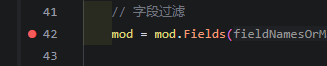
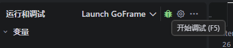
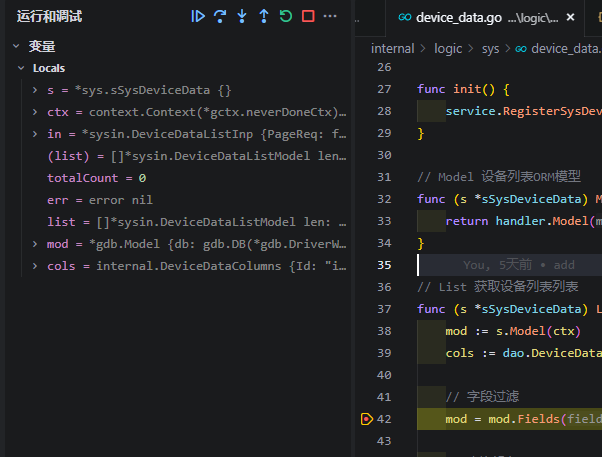

# vscode 断点调试
可参考：https://zhuanlan.zhihu.com/p/10789331128
1. 如果程序正在运行需要先关闭运行。
2. 按F5进入调试，创建一个 launch.json 文件（在.vscode目录下）。内容为：
    ```json
    {
        "version": "0.2.0",
        "configurations": [
            {
            "name": "Launch GoFrame",
            "type": "go",
            "request": "launch",
            "mode": "debug",
            "program": "${workspaceFolder}/main.go" // 这里是 main.go 的路径
            }
        ]
    }
    ```
3. 在需要调试的代码行上点击行号左侧，添加断点。
      
4. 按F5或点击调试按钮开始调试，程序会在断点处暂停。
      
5. 操作浏览器调用接口，触发断点。
      
