# 什么是MQTT
MQTT（Message Queuing Telemetry Transport）是一种基于发布/订阅模式的轻量级消息传输协议，用于在物联网（IoT）设备之间进行通信。它被设计为简单、可靠和低功耗，适用于资源受限的设备。
在物联网开发中，设备通过WIFI或4G等网络连接到EMQX服务器。（EMQX是一个开源的MQTT消息代理服务器，用于处理设备之间的消息传递。）当设备连接到EMQX服务器后，它可以发布消息到指定的主题（topic），也可以订阅感兴趣的主题。其他设备可以订阅相同的主题，从而接收发布到该主题的消息。
服务器端应用也会连接到EMQX服务器，订阅感兴趣的主题。当有设备发布消息到这些主题时，服务器端应用会收到通知，并可以根据需要进行处理。

# EMQX
EMQX 是一个开源（新版开始收费了）的 MQTT 消息代理服务器（broker），用于处理设备之间的消息传递。它支持高并发、低延迟的消息传输，适用于物联网设备的通信。
## 部署
EMQX在5.9版本后合并了社区版和企业版开始收费，所以免费使用只能使用5.8版本。（5.9后单节点也属于社区版，但是线上环境不知道会不会被要求交保护费）
[EMQX 5.8 开源版本 Docker 部署](https://www.emqx.com/zh/downloads-and-install/broker?os=Docker)
```bash
# 获取镜像
docker pull emqx/emqx:5.8.8
# 启动容器
docker run -d --name emqx -p 1883:1883 -p 8083:8083 -p 8084:8084 -p 8883:8883 -p 18083:18083 emqx/emqx:5.8.8
```
> 这里有个坑：我在Windows上安装了Docker Desktop，但是启动时报错，1883端口被占用了。所以需要修改启动命令，将1883端口映射到其他端口，如8888:1883，然后在MQTTX中连接时，需要填写8888端口。

## 访问dashboard
EMQX 提供了一个 Web 界面的 dashboard，用于监控和管理 MQTT 服务器。默认情况下，dashboard 监听在 18083 端口。
可以通过浏览器访问 `http://服务器IP:18083` 来登录 dashboard。默认用户名和密码是 `admin/public`。


# MQTTX
MQTTX 是一个跨平台的 MQTT 客户端工具，用于测试和调试 MQTT 协议的实现。它提供了一个用户友好的界面，用于连接到 MQTT 服务器、发布和订阅消息、查看消息历史记录等。（功能类似于postman，只是MQTTX用于测试MQTT协议，而postman用于测试HTTP协议。新版的postman也支持测试MQTT）
MQTTX提供了桌面端、Web端和命令行接口（CLI）三种方式。

## 桌面端
下载安装MQTTX桌面端，根据提示安装即可。
### 新建连接
点击MQTTX界面的“新建连接”按钮，填写连接信息。
* 连接名称：自定义一个名称，用于标识该连接。
* 服务器地址：填写MQTT服务器的地址，例如 `mqtt://127.0.0.1:1883`。
* 端口：填写MQTT服务器的端口，默认是 1883。
* 用户名和密码：如果MQTT服务器要求认证，填写对应的用户名和密码。
* 客户端ID：填写一个唯一的客户端ID，用于标识该连接的设备。
  
> 服务器地址如果是本机，可填写`127.0.0.1`但是不能用`localhost`。端口号如果修改了，需要填写修改后的端口号，如8888。

*连接后在EMQX的dashboard中通过“客户端”可以看到该连接。*

### 添加订阅
点击MQTTX界面的“添加订阅”按钮，填写订阅信息。
* 主题：填写要订阅的主题，例如 `test/topic`。
* QoS：选择订阅的 QoS 级别，0、1 或 2。
  
  
*订阅后在EMQX的dashboard中通过“订阅管理”可以看到该订阅。*

### 发布订阅消息
一个连接订阅主题后，可以通过另一个连接发布消息到该主题，订阅连接就会收到该消息。
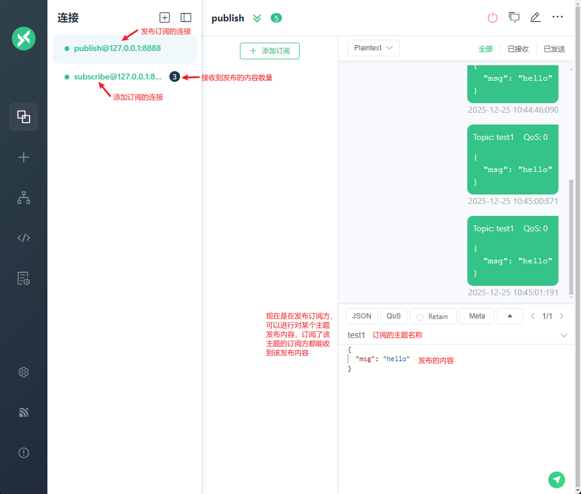  

## MQTTX-CLI
MQTTX-CLI 是 MQTTX 的命令行接口版本，用于在终端中执行 MQTT 相关操作。它提供了一些方便的命令，用于连接到 MQTT 服务器、发布和订阅消息等。
### 安装
MQTTX-CLI 可以在 Windows、macOS 和 Linux 上运行。可以从 [MQTTX 官方网站](https://mqttx.app/) 下载适用于您操作系统的二进制文件。
### 使用
安装后可以使用`mqttx-cli`命令来执行相关操作。（在Windows上需要将`mqttx-cli.exe`添加到环境变量中，或是进入`mqttx-cli.exe`所在目录执行）
#### 连接到 MQTT 服务器
要连接到 MQTT 服务器，使用以下命令：
```bash
mqttx-cli connect -h 127.0.0.1 -p 1883 -u admin -P public -c my-client
```
`-h`：指定 MQTT 服务器的地址。
`-p`：指定 MQTT 服务器的端口。
`-u`：指定连接的用户名。
`-P`：指定连接的密码。
`-c`：指定连接的客户端ID。
#### 发布消息
要发布消息到指定主题，使用以下命令：
```bash
mqttx-cli pub -t test/topic -q 0 -h 127.0.0.1 -p 1883 -m "Hello, MQTT!"
```
`-t`：指定要发布的主题。
`-q`：指定发布消息的 QoS 级别，0、1 或 2。
`-h`：指定 MQTT 服务器的地址。
`-p`：指定 MQTT 服务器的端口。
`-m`：指定要发布的消息内容。
#### 订阅消息
要订阅指定主题，使用以下命令：
```bash
mqttx-cli sub -t 'test/topic' -h 127.0.0.1 -p 1883 -v
```
`-t`：指定要订阅的主题。
`-h`：指定 MQTT 服务器的地址。
`-p`：指定 MQTT 服务器的端口。
`-v`：收到消息后，打印详细的消息信息。

## web端
功能和桌面端基本相同，只是操作在浏览器中进行。可以使用docker部署web端。用桌面端即可，所以不多做介绍。

# MQTT报文格式
报文包括固定头、可变头、有效载荷（Payload）三部分。其中：
* 固定头：包含了报文的类型、标志位和剩余长度。（必须）
* 可变头：根据消息类型不同而不同，例如连接报文包含了协议名称、协议级别、连接标识、长链接标识、属性。（可选）
* 有效载荷（Payload）：包含了具体的消息内容，例如发布消息中的数据。（可选）

比如心跳数据`PINGREQ`和心跳响应数据`PINGRESP`就没有可变头和有效载荷，而包含数据的`PUBLISH`报文就有可变头和有效载荷。

## 固定头
固定头由 MQTT Control Packet Type（控制报文类型）、 Flags（标志位）、Remaining Length（剩余长度）三部分组成。
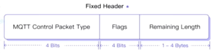  

### 控制报文类型
类型|值|描述
---|---|---
RESERVED|0|保留
CONNECT|1|连接报文
CONNACK|2|连接确认报文
PUBLISH|3|发布报文
PUBACK|4|发布确认报文
PUBREC|5|发布接收报文
PUBREL|6|发布释放报文
PUBCOMP|7|发布完成报文
SUBSCRIBE|8|订阅报文
SUBACK|9|订阅确认报文
UNSUBSCRIBE|10|取消订阅报文
UNSUBACK|11|取消订阅确认报文
PINGREQ|12|心跳请求报文
PINGRESP|13|心跳响应报文
DISCONNECT|14|断开连接报文
AUTH|15|认证报文

### 标志位
目前只有`PUBLISH`报文的标志位被赋予了明确的含义：
* bit0: Retain，是否保留消息，1表示保留，0表示不保留。
* bit1|2: QoS Level，QoS 级别，0表示最多一次传输，1表示至少一次传输，2表示恰好一次传输。
* bit3: Dup，是否是重传的报文，1表示是重传，0表示不是重传。

### 剩余长度
剩余长度字段表示可变头和有效载荷的总长度，以字节为单位。

## 可变头
不同的报文类型有不同的可变头。
例如`CONNECT`连接报文包含了协议名称、协议级别、连接标识、长链接标识、属性。
  
`PUBLISH`发布报文包含了主题名称、标识符、属性。
  

### 属性
属性是MQTT 5.0新增的功能，用于在连接、订阅、发布等报文中传递额外的信息。
属性由长度和属性列表组成。
* 属性长度：属性列表的长度，以字节为单位。
* 属性列表：包含了属性的名称、数据类型和属性值。
  
属性根据报文类型不同而不同：[MQTT属性说明](https://docs.oasis-open.org/mqtt/mqtt/v5.0/os/mqtt-v5.0-os.html#_Toc3901027)

## 有效载荷
有效载荷（Payload）包含了具体的消息内容。
例如在`PUBLISH`发布报文中，有效载荷包含了要发布的消息数据；在`SUBSCRIBE`订阅报文中，有效载荷包含了要订阅的主题以及对于的订阅选项。

# 报文验证
可使用wireshark等工具来抓包验证MQTT报文。
  

# QOS
QoS（Quality of Service）是MQTT协议中用于确保消息传输质量的机制。
MQTT 5.0 新增了 QoS 级别2，相比 QoS 级别1，它提供了更可靠的消息传输。
## QoS 级别
* QoS 级别0：最多一次传输，消息可能会丢失（接收端不需要回复ACK，所以效率高）。
    传输高频但不那么重要的数据，比如传感器数据、状态更新等。
* QoS 级别1：至少一次传输，消息不会丢失，但可能会重复（比如接收端接收到了，响应的ACK丢失了，那么会重新发送再次收到）。
    传输一些较为重要的数据，如命令控制、配置更新等，要注意即使重复也不会有问题。
* QoS 级别2：恰好一次传输，消息不会丢失，也不会重复（发送/接收消息后，还要释放消息ID；双方都会缓存消息ID，所以可以去重，占用资源较多）。
    通常用于重要的领域，比如金融交易、医疗设备等。

在发送消息的时候可以指定QoS级别，一般情况下broker收到消息后会根据指定的QoS级别来处理消息。特殊情况下，QoS级别可能会发生改变（订阅者指定了QoS最大级别）。

# 主题（Topic）
主题（Topic）是MQTT协议中用于消息路由的机制。
它是一个字符串，用于标识消息的类型或内容。
主题可以包含多个层级，每个层级之间用斜杠（/）分隔，不要以斜杠开头或结尾。
例如，`sensor/temperature`表示传感器温度数据，`home/light/status`表示家庭灯的状态。

## 主题通配符
MQTT 5.0 新增了主题通配符，用于订阅多个主题。
通配符包括：
* `+`：表示匹配一个层级的主题。
    例如，`sensor/+/temperature`可以匹配`sensor/room1/temperature`和`sensor/room2/temperature`。
* `#`：表示匹配多个层级的主题，必须放在最后。
    例如，`home/#`可以匹配`home/light/status`、`home/door/status`、`home/light/level`等。

## 系统主题
以`$SYS`开头的主题是MQTT 5.0新增的系统主题。系统主题主要用于获取 MQTT 服务器`自身运行状态、消息统计、客户端上下线事件等数据`。但是目前，MQTT 协议暂未明确规定 `$SYS/`
例如，`$SYS/broker/version`可以订阅MQTT broker的版本信息。
EMQX支持的系统主题可以参考文档：[MQTT系统主题](https://docs.emqx.com/zh/emqx/v5.0/observability/mqtt-system-topics.html)

MQTTX要订阅系统主题，需要在EMQX的`dashboard`中的客户端授权中开启权限。在`File`行点击设置，新增`{allow, all, subscribe, ["$SYS/#", "#"]}.`
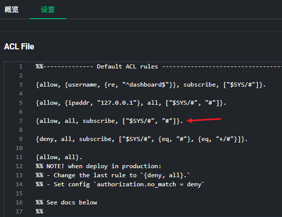  

# 会话（Session）
会话（Session）是MQTT协议中用于保持客户端与broker之间通信状态的机制。每个MQTT客户端都可以启动一个或多个会话，通过会话可以实现客户端和服务器之间的消息传递。
## 常见配置参数
### Clean Start
Clean Start作用：用于指示客户端在和服务器建立连接的时候应该尝试恢复之前的会话还是直接创建全新的会话。
常见取值以及含义：
* 0：服务端存在一个关联此客户端标识符（Client ID）的会话，服务端**必须**基于此会话的状态恢复与客户端的通信（之前的订阅信息会再次绑定，并且会接收到客户端断开时，发布者所发布的消息）。如果不存在任何关联此客户端标识符的会话，服务端**必须**创建一个新的会话。
* 1：客户端和服务端**必须**丢弃任何已存在的会话，并开始一个新的会话。
### Session Expiry Interval
Session Expiry Interval 决定了会话状态数据在服务端的存储时长。
常见取值：
* **没有指定此属性或者设置为 0**，表示会话将在网络连接断开时立即结束。
* **设置为一个大于 0 的值**，则表示会话将在网络连接断开的多少秒之后过期。
* **设置为 0xFFFFFFFF**，即 Session Expiry Interval 属性能够设置的最大值时，表示会话数据永不过期。

服务端使用 `Client ID` 来唯一地标识每个会话，如果客户端想要在连接时复用之前的会话，那么必须使用与此前一致的 Client ID。
  

# 消息
消息分为普通消息和保留消息：
* 普通消息：普通消息在发送之前其所对应的主题如果不存在订阅者，普通消息MQTT服务器会直接将其丢弃。
* 保留消息：保留消息可以保留在 MQTT 服务器中。任何新的订阅者订阅与该保留消息中的主题匹配的主题时，都会立即接收到该消息，即使这个消息是在它们订阅主题之前发布的。

## 保留消息
当客户端订阅主题时，如果服务端存在该主题匹配的保留消息，则该保留消息将被立即发送给该客户端。
  

### 常见使用场景
* 智能家居设备的状态在变更时就会上报，但是控制端需要在上线后就能获取到设备的状态；
* 传感器上报数据的间隔太长，但是订阅者需要在订阅后立即获取到最新的数据；
* 传感器的版本号、序列号等不会经常变更的属性，可在上线后发布一条保留消息告知后续的所有订阅者；

### 使用
发布保留消息
  
发布后在EMQX的dashboard中可以看到该保留消息。
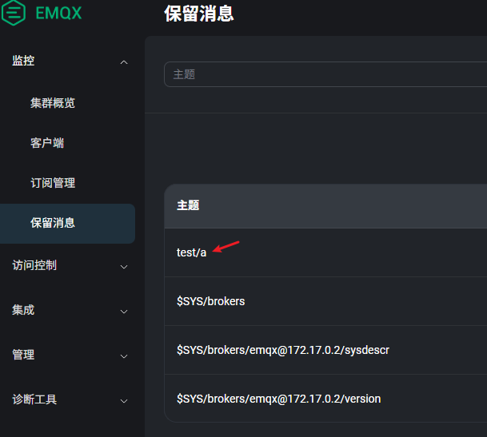  
> 注意：发布的同一个主题的保留消息，只有最后一条会被保留。先发了个内容为1的保留消息，后发了个内容为2的保留消息，那么只有内容为2的保留消息会被保留，订阅端 新增了此主题的订阅/已订阅此主题的上线后 只能收到内容为2的保留消息。

保留消息默认存储在内存中，broker重启后会丢失。可以修改为存储在磁盘中。
  

### 删除保留消息
如果发布了某个主题的保留消息，要删除该保留消息，有以下方式：
* 可以再发布一个空内容的此主题保留消息，那么该主题的保留消息就会被删除。
* 在EMQX的dashboard中删除该保留消息。
* 发布消息的时候设置消息过期时间。
      

## 消息过期时间
保留消息的过期时间通常用于比较长时间的消息，而有些消息具有即时性，比如客户端暂时因为网络原因离线了，几秒钟后又网络恢复上线，但是此时再收到该消息时，客户端可能已经不再需要该消息了，那么这种情况就应该使用“**消息的过期时间**”而不是“**保留消息的过期时间**”来实现。
比如：智能驾驶的汽车，我们可以向车辆发送`建议车速`使它能够在绿灯期间通过路口，这类消息通常仅在车辆到达下一个路口之前有效，生命周期非常短暂。
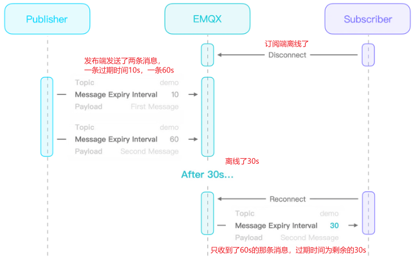 
普通消息设置过期时间发送： 
  

### 保留消息和普通消息过期时间的区别
#### 1. 普通消息设置过期时间

**场景：** 传感器每隔 10 秒发送一次实时温标。

* **核心逻辑：** 消息只对**当前已在线**的订阅者有效。如果由于网络波动，消息在 Broker（服务器）中排队等待发送给某个订阅者，过期时间就会开始倒计时。
* **过期后果：**如果倒计时归零时，消息还没发出去，Broker 会直接**丢弃**该消息。
* **新进来的订阅者**永远看不到这条消息，因为普通消息在 Broker 转发完后是不留底的。

#### 2. 保留消息设置过期时间

**场景：** 设置一个“限时公告”或“临时配置”，要求新上线的设备能看到，但过时就作废。

* **核心逻辑：** Broker 会把这条消息**存入硬盘/内存**。每当有一个新客户端订阅该主题时，Broker 都会把这条“旧消息”推送给它。
* **过期后果：**
* **倒计时：** 从消息到达 Broker 的那一刻起，过期计时器就开始工作。
* **自动清理：** 一旦到达过期时间，Broker 不仅不会再转发这条消息，还会**自动从存储中删除**这条保留消息。
* **状态同步：** 如果消息没过期，新订阅者上线会收到它；如果过期了，新订阅者上线会看到“空”。

#### 核心区别对比表

| 特性 | 普通消息 + 过期时间 | 保留消息 + 过期时间 |
| --- | --- | --- |
| **消息去向** | 转发给当前在线订阅者后立即消失。 | 存储在 Broker 中，等待新订阅者。 |
| **过期后的动作** | 从发送队列中剔除，不再下发。 | **从 Broker 存储中彻底抹除**。 |
| **对新订阅者的影响** | 无影响（新订阅者收不到旧消息）。 | 过期前能收到，过期后收不到。 |
| **典型用途** | 具有时效性的指令（如：开灯，3秒没响应就作废）。 | 具有时效性的状态（如：临时促销信息、短期设备配置）。 |

#### 3. 一个关键细节：接收端看到的剩余时间

在 MQTT 5.0 中，当 Broker 转发带有过期时间的消息时，它会**更新**消息头里的过期时间字段。

> **举例：**
> 你发送了一条保留消息，设置过期时间为 **3600秒**。
> 3000秒后，一个新设备上线并订阅。
> 该设备收到的消息中，过期时间字段会自动显示为 **600秒**。

这保证了接收端能够准确知道这条信息还能“活”多久，从而决定是否要执行相关逻辑。

#### 总结

* **普通消息过期**是为了防止**网络拥塞**导致下发了过时的废话。
* **保留消息过期**是为了实现**自动清理的状态同步**，确保新上线的设备不会读取到陈旧的、已经失效的状态信息。

## 遗嘱消息
客户端可以在**连接时**在服务端中注册一个遗嘱消息，与普通消息类似，我们可以设置遗嘱消息的主题、有效载荷等等。当该客户端**意外断开连接**，服务端就会向其他订阅了相应主题的客户端发送此遗嘱消息。这些接收者也因此可以及时地采取行动，例如向用户发送通知、切换备用设备等等。借助于遗嘱消息可以感知到客户端是意外断开。

遗嘱消息和普通消息的区别：
  
遗嘱消息多了一个专属属性：Will Delay Interval。这个属性决定了服务端将在网络连接关闭后延迟多久发布遗嘱消息，并以秒为单位。
### 为什么需要延迟时间
默认情况下，服务端总是在网络连接意外关闭时立即发布遗嘱消息。但是很多时候，网络连接的中断是短暂的，所以客户端往往能够重新连接并继续之前的会话。这导致遗嘱消息可能被频繁地且无意义地发送。
如果没有指定 Will Delay Interval 或者将其设置为 0，服务端将仍然在网络连接关闭时立即发布遗嘱消息。
但如果将 Will Delay Interval 设置为一个大于 0 的值，并且客户端能够在 Will Delay Interval 到期前恢复连接，那么该遗嘱消息将不会被发布。

### 使用
* 发布端需要发布一条遗嘱消息：
      
* 订阅端也需要订阅遗嘱消息的主题，才能收到遗嘱消息：
    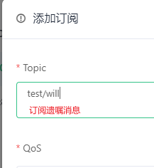  
* 当发布端意外断开时，订阅端会收到遗嘱消息。
    **发现订阅端会立即收到而不是10s后收到，是因为发布端的会话过期时间设置的0，而MQTT服务器发现发布端断开就不会保留此会话而是立即清理，清理会话时会强制触发遗嘱发送。修改发布端的会话时间就能实现延迟10s后发送。**
      

## 延迟发布（定时发布）
**延迟发布简介**：MQTT服务端收到发布者发布的消息以后，延迟一段时间以后再把消息转发给订阅者。

**延迟发布的使用场景**：
* 农业智能化管理：在智能农业中，可能需要`在特定时间启动灌溉系统或调节温室环境。`通过MQTT延迟发布，可以预先设定好指令发布时间，如在清晨或傍晚自动发送开启灌溉的信号，确保水资源的有效利用且不对作物生长周期造成干扰。
* 能源管理与自动控制：智能家居或智能建筑中的照明、供暖、通风系统可以根据居民生活习惯或节能策略，利用延迟发布在预设时间自动调整，如在居民到家前半小时开启空调或在离开家后一定时间关闭所有非必要电器，以达到节能减排的目的。
* 公共设施维护：城市中的公共照明、广告牌等设施可能需要在特定时间统一开关，以节省能源或遵守当地法规。通过MQTT延迟发布功能，可以安排在夜间自动发送开关指令，无需人工干预，简化运维流程。
* 医疗健康监护：在远程医疗监护中，设备可能需要在一天中的特定时间收集患者数据或发送提醒，如定时提醒患者服药或在固定时间收集心率、血压等生理参数，以优化患者护理计划。

**实现延迟发布需要使用特定的主题格式：**`$delayed/{DelayInterval}/{TopicName}`。
* `$delayed`: 使用 `$delay` 作为主题前缀的消息都将被视为需要延迟发布的消息
* `DelayInterval`： 延迟发布的时间间隔，单位为妙，允许的最大间隔是 4294967 秒。如果 `{DelayInterval}` 无法被解析为一个整型数字，EMQX 将丢弃该消息，客户端不会收到任何信息。
* `TopicName`：MQTT消息的主题名称
如：
```shell
 $delayed/15/x/y 表示 15 秒后将 MQTT 消息发布到主题 x/y。
 $delayed/60/a/b 表示 1 分钟后将 MQTT 消息发布到 a/b。
```
### 使用
* 订阅端订阅一个延迟发布的主题：
    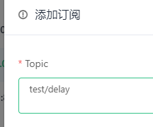  
* 发布端以指定的格式发布延迟消息：
      
    发布后订阅端就会在3s后收到此消息。

## 用户属性
允许在Publish、Subscribe、Connect、Disconnect等报文中携带附加信息。类似于http协议的请求头。
**用户属性的应用场景：**
* 日志记录：在发布（PUBLISH）和订阅（SUBSCRIBE）报文中加入用户属性，可以帮助记录操作者信息、操作时间、原因说明等，便于后续的审计跟踪和问题排查。
* 消息分类与标记：用户属性可以用来给消息添加标签或分类信息，如消息类型等，使得接收方能根据这些属性对消息进行过滤、排序或特殊处理。
### 使用
* 发布端添加用户属性：
      
* 订阅端就能收到用户属性：
    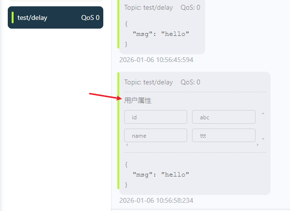  

# 订阅
## 订阅选项
订阅的组成：
* 主题过滤器：决定了服务端将向我们转发哪些主题下的消息
* 订阅选项：允许我们进一步定制服务端的转发行为
    MQTT 5.0提供了4个订阅选项：QoS、No Local、Retain As Published、Retain Handling

### QoS
QoS 是**最常用**的一个订阅选项，它表示服务端在向订阅端发送消息时可以使用的`最大QoS等级。`

* 情况1：服务端支持的最大 QoS < 客户端订阅时请求的最大QoS
    服务端将无法满足客户端的要求，这时服务端就会通过订阅的响应报文（SUBACK）告知订阅端最终授予的最大 QoS 等级，订阅端可以**自行评估是否接受并继续通信。**
     

* 情况2：订阅时请求的最大QoS < 消息发布时的QoS
    为了尽可能地投递消息，服务端不会忽略这些消息，而是会在转发时对这些消息的 QoS 进行**降级处理。**
     

#### 使用
1. 创建sub客户端连接，并且订阅`sub/qos/demo`主题, 并指定`QOS为0`
     
2. 订阅成功以后，通过sub客户端连接向`sub/qos/demo`主题发布消息，并且指定QOS的登记为1
    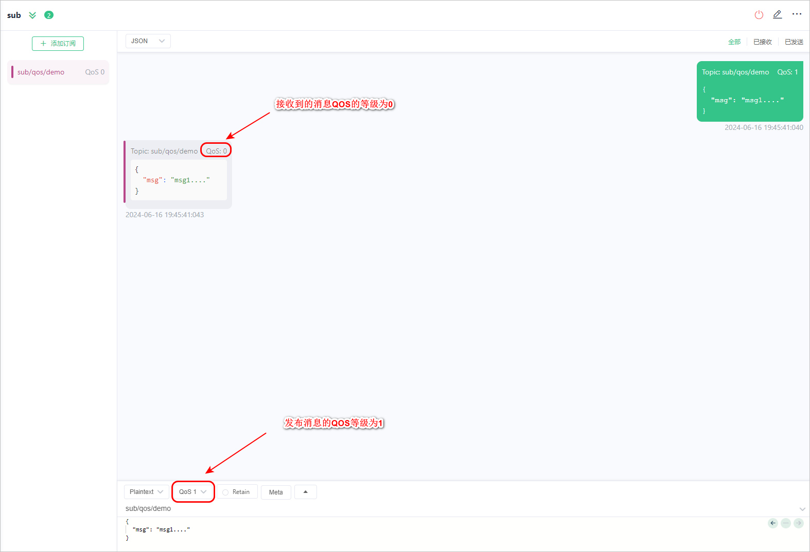 
    结果：sub客户端收到的消息的QOS值为0

### No Local
No Local取值：
* 0(默认值)：服务端`可以`将消息转发给发布这个消息的客户端
* 1：服务端`不可以`将消息转发给发布这个消息的客户端

这个订阅选项尝尝被用在***桥接场景***中，桥接本质上是两个 MQTT Server 建立了一个 MQTT 连接，然后相互订阅一些主题，Server 将客户端的消息转发给另一个 Server，而另一个 Server 则可以将消息继续转发给它的客户端。
 
在桥接的场景中，如果没有将No Local订阅选项的值设置为1，那么此时会形成`转发风暴`。
**举例**：假设两个 MQTT Server 分别是 Server A 和 Server B，它们分别向对方订阅了`#`主题。现在，Server A 将一些来自客户端的消息转发给了 Server B，而当 Server B 查找匹配的订阅时，Server A  也会位于其中。如果 Server B 将消息转发给了 Server A，那么同样 Server A 在收到消息后又会把它们再次转发给  Server B，这样就陷入了无休止的转发风暴。而如果 Server A 和 Server B 在订阅 `#` 主题的同时，将 No Local 选项设置为 1，就可以完美地避免这个问题。

#### 使用
具体步骤：
1. 创建sub客户端连接，并订阅`sub/local/demo`主题,并且设置`No Local订阅选项为1`

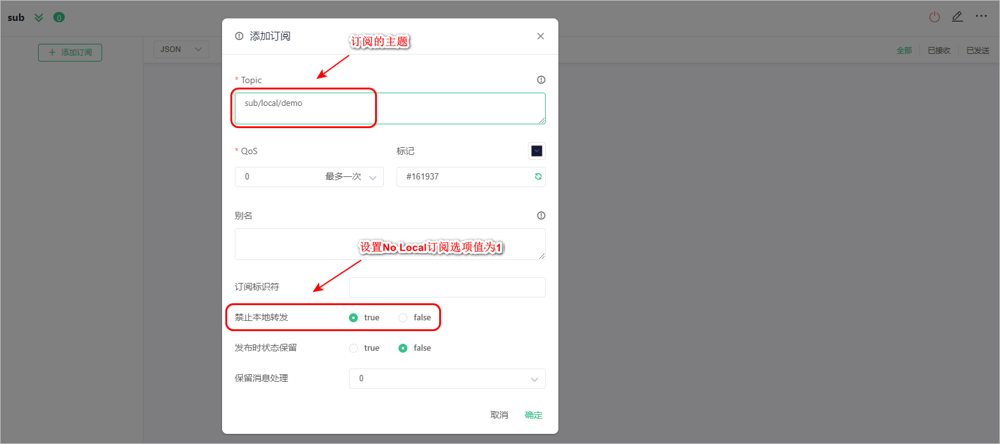

2. 使用sub客户端连接向`sub/local/demo`主题发布消息

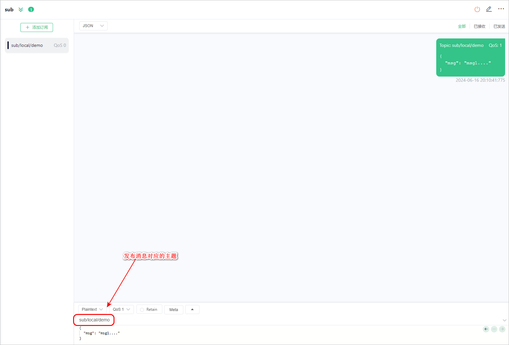

结果：当前的客户端连接没有收到该主题中的消息。

### Retain As Published
Retain As Published取值：
* 0(默认值)：服务端在向此订阅转发应用消息时需要`清除`消息中的 Retain 标识不变
* 1：服务端在向此订阅转发应用消息时需要`保持`消息中的 Retain 标识不变

应用场景：***桥接场景***
桥接场景下带来了一些问题。我们继续沿用前面的设定，当 Server A 将保留消息转发给 Server B 时，由于消息中的 Retain  标识已经被清除，Server B 将不会知道这原本是一条保留消息，自然不会再存储它。这就导致了保留消息无法跨桥接使用。
那么在 MQTT 5.0 中，我们可以让桥接的服务端在订阅时将 Retain As Published 选项设置为 1，来解决这个问题。
 

#### 使用
具体步骤如下：
1. 创建sub客户端连接，分别订阅主题`sub/rap/demo01`和`sub/rap/demo02`, 并且将Retain As Published设置为 0 和 1
     
     
2. 通过sub客户端连接分别向`sub/rap/demo01`和`sub/rap/demo02`主题发布`保留消息`
    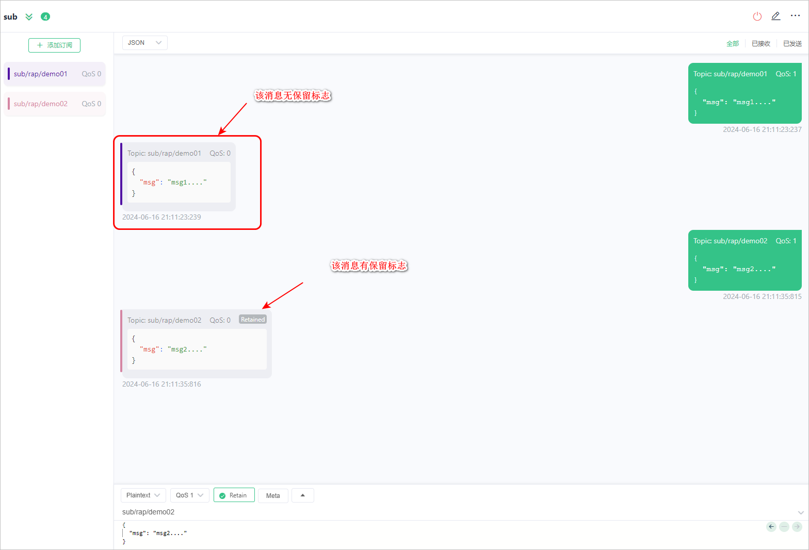 

### Retain Handling
作用：Retain Handling 这个订阅选项被用来向服务端指示当订阅建立时，`是否需要发送保留消息`。
Retain Handling常见取值：
* 0(默认值)：表示只要订阅建立，就发送保留消息；
* 1：表示只有建立全新的订阅而不是重复订阅时，才发送保留消息；
* 2：表示订阅建立时不要发送保留消息；

#### 使用
具体步骤如下所示：
* 情况1：Retain Handling值设置为0
    1. 开启客户端的自动重订阅功能
    2. 创建sub客户端连接(Clean Start值设置为1，并且将Session Expiry Interval设置为300)，并且向`sub/rh/demo`主题中发布一个保留消息
     
    3. 在sub客户端连接中，订阅`sub/rh/demo`主题，并且将`Retain Handling的值设置为0`
    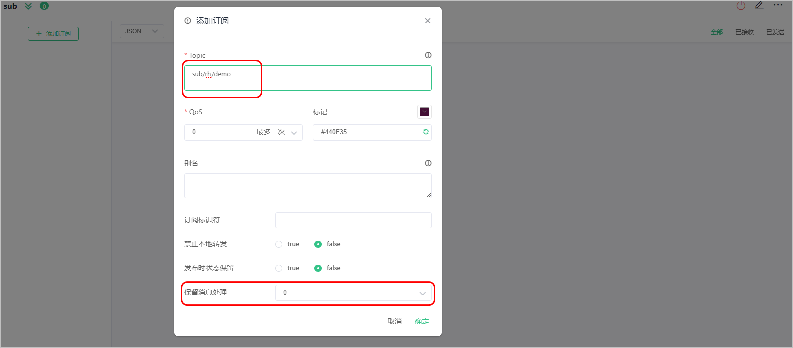 
    结果：只要订阅成功了，那么此时立马会收到保留消息
    4. 关闭客户端连接，设置客户端的`Clean Start值设置为0`表示需要复用之间的会话
     
    注意：只要是重新订阅成功了，那么此时就会收到保留消息

* 情况2：Retain Handling设置为1
    删除sub客户端连接中的订阅，重新订阅`sub/rh/demo`主题，并且将`Retain Handling的值设置为1`，新建立的订阅是可以获取到保留消息的。
    关闭当前连接，重新建立连接【会自动复用之前的订阅】，此时无法获取到保留消息。
* 情况3：Retain Handling设置为2
    删除sub客户端连接中的订阅，重新订阅`sub/rh/demo`主题，并且将`Retain Handling的值设置为2`
    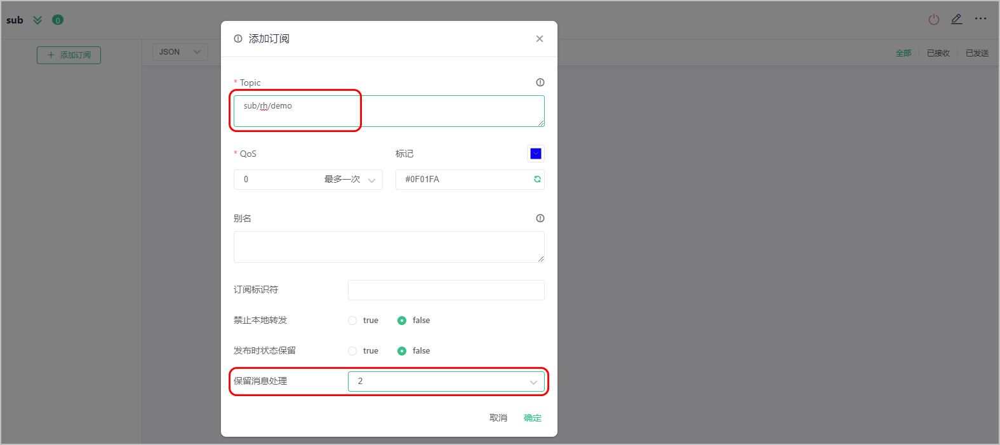 
    结果：即使订阅成功了，那么此时也不会收到保留消息

## 共享订阅
**类似负载均衡**。它使得 MQTT 服务端可以在使用特定订阅的客户端之间均衡地分配消息负载。这表示，当我们有两个客户端共享一个订阅时，那么每个匹配该订阅的消息都只会有一个副本投递给其中一个客户端。 
 
（这里的两个订阅者可以是处理数据的服务，如果其中一个出问题，另一个就会接收所有的消息）

共享订阅不仅为消费端带来了极佳的水平扩展能力，使我们可以应对更**高的吞吐量**，还为其带来了**高可用性**，即使共享订阅组中的一个客户端断开连接或发生故障，其他客户端仍然可以继续处理消息，在必要时还可以接管原先流向该客户端的消息流。

***举个实际例子：***
* 你有 5 台温湿度设备（发布者），持续向 EMQX 的 `iot/sensor/temp` 主题发布数据；
* 你部署了 3 个数据处理服务实例（订阅者 A/B/C），都以共享订阅方式订阅`$share/sensor_group/iot/sensor/temp`（sensor_group是共享组名）；
* 当设备发布 100 条消息到`iot/sensor/temp`时，EMQX 会把这 100 条消息分发给 A/B/C，比如 A 处理 34 条、B 处理 33 条、C 处理 33 条，同一条消息不会被多个订阅者收到，这就是消费端的负载均衡。

### 共享订阅分类
启用共享订阅：为一组订阅者的原始主题添加指定前缀
共享订阅分类：
| 前缀格式     | 示例           | 前缀       | 真实主题名 |
| ------------ | -------------- | ---------- | ---------- |
| 带群组格式   | $share/abc/t/1 | $share/abc | t/1        |
| 不带群组格式 | $queue/t/1     | $queue/    | t/1        |

#### 带群组的共享订阅
可以通过在原始主题前添加 `$share/<group-name>` 前缀为分组的订阅者启用共享订阅。组名可以是任意字符串。EMQX 同时将消息转发给不同的组，属于同一组的订阅者可以使用负载均衡接收消息。

例如，如果订阅者 `s1`、`s2` 和 `s3` 是组 `g1` 的成员，订阅者 `s4` 和 `s5` 是组 `g2` 的成员，而所有订阅者都订阅了原始主题 `t1`。共享订阅的主题是 `$share/g1/t1` 和 `$share/g2/t1`。当 EMQX 发布消息 `msg1` 到原始主题 `t1` 时：

- EMQX 将 `msg1` 发送给 `g1` 和 `g2` 两个组。
- `s1`、`s2`、`s3` 中的一个订阅者将接收 `msg1`。
- `s4` 和 `s5` 中的一个订阅者将接收 `msg1`。

 

#### 不带群组的共享订阅
以 `$queue/` 为前缀的共享订阅是不带群组的共享订阅。它是 `$share` 订阅的一种特例。您可以将其理解为所有订阅者都在一个订阅组中：
 

### 负载均衡算法
在`管理-集群配置-MQTT配置-通用`中可以配置负载均衡算法，默认是`round_robin`。
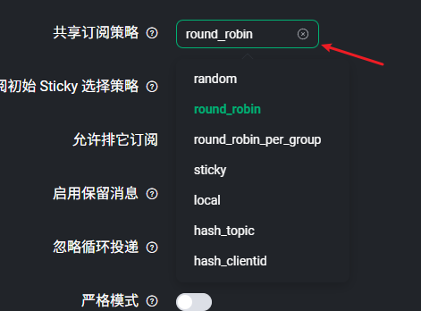  
* 随机（Random），在共享订阅组内随机选择一个会话发送消息。
* 轮询（Round Robin），在共享订阅组内按顺序选择一个会话发送消息，循环往复。
* 哈希（Hash），基于某个字段的哈希结果来分配。
* 粘性（Sticky），在共享订阅组内随机选择一个会话发送消息，此后保持这一选择，直到该会话结束再重复这一过程。
* 本地优先（Local），随机选择，但优先选择与消息的发布者处于同一节点的会话，如果不存在这样的会话，则退化为普通的随机策略。

## 排它订阅
排它订阅允许对主题进行互斥订阅，`一个主题同一时刻仅被允许存在一个订阅者，在当前订阅者未取消订阅前，其他订阅者都将无法订阅对应主题。`
要进行排它订阅，您需要为主题名称添加`$exclusive/`前缀，如以下表格中的示例：
| 示例           | 前缀        | 真实主题名 |
| -------------- | ----------- | ---------- |
| $exclusive/t/1 | $exclusive/ | t/1        |
当某个客户端 **A** 订阅 `$exclusive/t/1` 后，其他客户端再订阅 `$exclusive/t/1` 时都会失败，直到 **A** 取消了对 `$exclusive/t/1` 的订阅为止。
**注意**: 排它订阅必须使用 `$exclusive/` 前缀，在上面的示例中，其他客户端依然可以通过 `t/1` 成功进行订阅。

订阅失败的常见错误码：
 

### 使用
默认情况下排它订阅是关闭的。
具体步骤：
1. 创建sub1客户端连接，并且添加`$exclusive/t/1`订阅
     
2. 在Dashboard开启排它订阅配置【管理====>MATT配置】
     
3. 在sub2客户端连接中重新添加`$exclusive/t/1`订阅
4. 创建sub2客户端连接，并且添加`$exclusive/t/1`订阅
    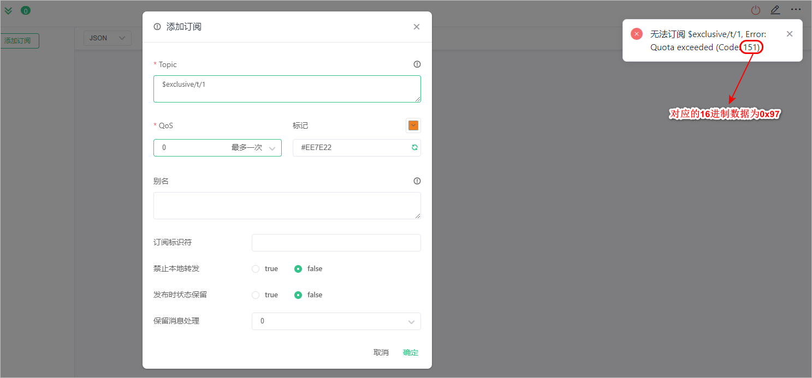 
5. 创建sub2客户端连接，并且添加`t/1`订阅，此时订阅成功

## 自动订阅
***开源版的 dashboard 中移除了，不过还是可通过对应的 HTTP API 来设置的。***
自动订阅能够给 EMQX 设置多个规则，在设备成功连接后按照规则为其订阅指定主题，不需要额外发起订阅。
### 配置自动订阅规则
通过 Dashboard 配置自动订阅规则：【管理 ====> MQTT高级特性 =====> 自动订阅 ====> 添加】
 
### 使用
具体步骤：
1. 创建pub客户端连接，作为发布者
2. 创建sub客户端连接，作为订阅者
3. 在pub客户端连接中向a/1主题发布消息
 


# dashboard的使用
## 访问控制
### 认证
认证：就是验证客户端的身份是否合法。
需要在broker上添加认证器，创建认证器大致步骤：
1. 选择认证方式
    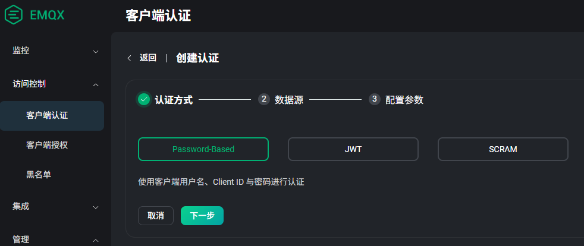  
2. 配置数据源
    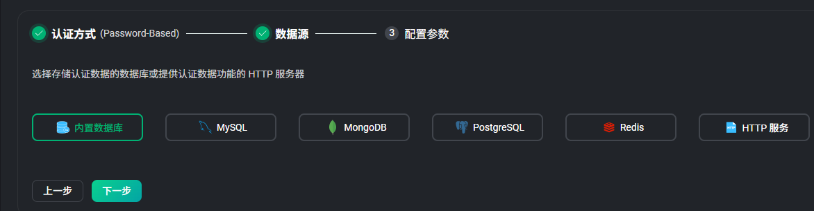  
3. 配置数据源相关参数
    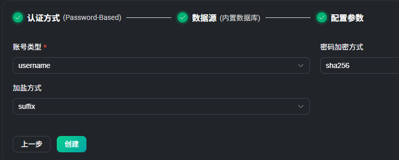  
    账号类型可以选username或clientid，加密方式很多，可以sha265或md5等，默认为sha265。加盐可以不修改。

3步执行完后就创建成功：
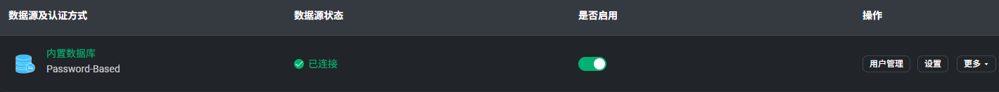  
点击用户管理可以添加用户：
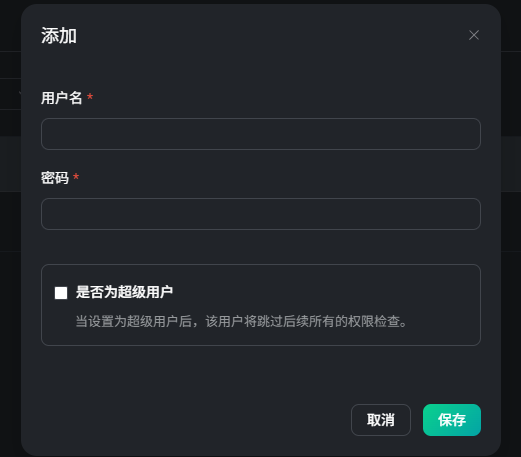  
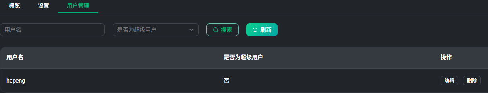  
添加用户后，后续客户端的连接就需要用户名和密码才能连接上broker。

之前创建的发布/订阅者再进行连接时就会报错：
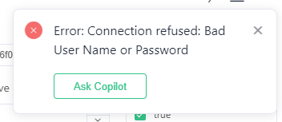  
配置里输入用户名和密码，才能正常连接：
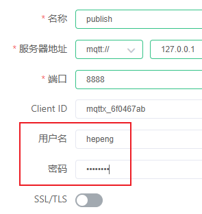  

EMQX 可以创建多个认证器，比如再创建一个使用 mysql 数据库的认证器：
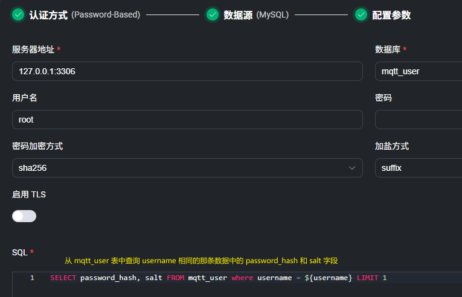  

当创建多个认证器后，进行认证时有两种情况：
1. 客户端的username在第一个认证器中不存在时，会尝试第二个认证器。
2. 客户端的username在第一个认证器中存在，就会使用第一个认证器的密码进行验证。如果验证失败也不会尝试第二个认证器。

### 授权
通常情况下，认证只是验证了客户端的身份是否合法，而该客户端是否具备发布、订阅某些主题的权限，还需要由`授权系统`来判断。

**授权检查器链：**
1. EMQX支持多种授权检查机制：基于ACL文件(默认配置)、基于内置数据库、基于MySQL进行授权、基于 MongoDB 进行授权 、基于 PostgreSQL 进行授权 、基于Redis进行授权、基于HTTP应用进行授权 ...
2. EMQX 支持用户通过配置多个授权检查器构成`授权链`，以实现更灵活的授权检查。EMQX 将按照授权链中配置的检查器顺序依次执行授权检查。如果在当前授权检查器中未检索到权限数据，将会切换至链上的下一个启用的授权检查器继续权限检查。但如果在当前授权检查器中检索到了权限数据，就不会再到下一个授权检查器进行检查（如果同一个规则第一个是允许，第二个是拒绝，那么就是允许）。

#### ACL文件授权
EMQX默认使用基于ACL文件的授权检查器。在收到客户端的操作请求后，EMQX 会按照从上到下的顺序进行授权规则匹配；在成功匹配到某条规则后，EMQX 将按设定允许或拒绝当前请求，并停止后续规则的匹配。
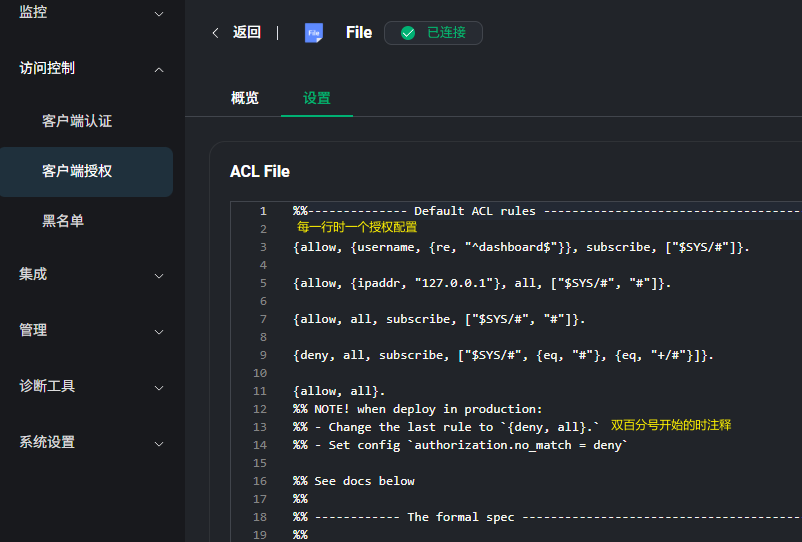  

##### 授权语法
基本语法和概念如下：
- 一组授权规则一个花括号包起来，花括号内的各个元素用逗号分隔
- 每条规则应以 `.` 结尾
- 注释行以 `%%` 开头，在解析过程中会被丢弃

代码示例：
```shell
%% 允许用户名是 dashboard 的客户端订阅 "$SYS/#" 这个主题
{allow, {user, "dashboard"}, subscribe, ["$SYS/#"]}.

%% 允许来自127.0.0.1 的用户发布和订阅 "$SYS/#" 以及 "#"
{allow, {ipaddr, "127.0.0.1"}, all, ["$SYS/#", "#"]}.

%% 拒绝其他所有用户订阅 `$SYS/#`，`#` 和 `+/#` 主题
{deny, all, subscribe, ["$SYS/#", {eq, "#"}, {eq, "+/#"}]}.

%% 如果前面的规则都没有匹配到，则允许所有操作
%% 注意：在生产环境中，最后一条规则应该设置为 `{deny, all}`，并且配置 `authorization.no_match = deny`
{allow, all}.
```

在每一组授权规则中：
1. 第一个元素表示该条规则对应的权限；可选值：
    - `allow` （允许）
    - `deny`（拒绝）
2. 第二个元素用来指定适用此条规则的客户端，比如：
    - `{username, "dashboard"}`：用户名为 `dashboard` 的客户端；也可写作`{user, "dashboard"}`
    - `{username, {re, "^dash"}}`：用户名匹配 正则表达式 `^dash` 的客户端
    - `{clientid, "dashboard"}`：客户端 ID 为 `dashboard` 的客户端，也可写作`{client, "dashboard"}`
    - `{clientid, {re, "^dash"}}`：客户端 ID 匹配 正则表达式 `^dash` 的客户端
    - `{ipaddr, "127.0.0.1"}`：源地址为 `127.0.0.1` 的客户端；支持 CIDR 地址格式。注意：如果 EMQX 部署在负载均衡器后侧，建议为 EMQX 的监听器开启 `proxy_protocol` 配置 ，否则 EMQX 可能会使用负载均衡器的源地址。
    - `{ipaddrs, ["127.0.0.1", ..., ]}`：来自多个源地址的客户端，不同 IP 地址之间以 `,` 区分
    - `all`：匹配所有客户端
    - `{'and', [Spec1, Spec2, ...]}` ：满足列表中所有规范的客户端。
    - `{'or', [Spec1, Spec2, ...]}` ：满足列表中任何规范的客户端。
3. 第三个元素用来指定该条规则对应的操作：
    - `publish`：发布消息
    - `subscribe`：订阅主题
    - `all`：发布消息和订阅主题
    - 从 v5.1.1 版本开始，EMQX 支持检查发布与订阅操作中的 QoS 与保留消息标志位，您可以在第三个元素中加上 `qos`或者`retain`来指定检查的 QoS 或保留消息标志位，例如： 
    - `{publish, [{qos, 1}, {retain, false}]}`：拒绝发布 QoS 为 1 的保留消息
    - `{publish, {retain, true}}`：拒绝发布保留消息
    - `{subscribe, {qos, 2}}`：拒绝以 QoS2 订阅主题
4. 第四个元素用于指定当前规则适用的 MQTT 主题，支持通配符（主题过滤器），可以使用`主题占位符`：
    - `"t/${clientid}"`：使用了主题占位符，当客户端 ID 为 `emqx_c` 的客户端触发检查时，将精确匹配 `t/emqx_c` 主题
    - `"$SYS/#"`：通过通配符匹配 `$SYS/` 开头的所有主题，如 `$SYS/foo`、 `$SYS/foo/bar`
    - `{eq, "foo/#"}`：精确匹配 `foo/#` 主题，主题 `foo/bar` 将无法匹配，此处 `eq` 表示全等比较（equal）

另外还有 2 种特殊的规则，通常会用在 ACL 文件的末尾作为默认规则使用。
- `{allow, all}`：允许所有请求
- `{deny, all}`：拒绝所有请求

#### 内置数据库授权
添加内置数据库授权后，可以针对客户端ID、用户名、所有用户进行授权配置：
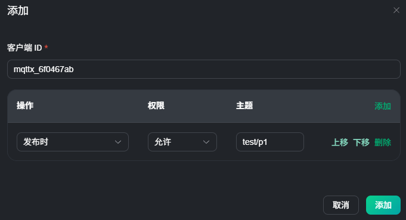  
这里要注意的是，为一个客户端ID添加规则后，要为它再添加规则不能再创建一个相同的客户端ID，只能编辑这个已存在的客户端ID，在编辑时可以添加新的规则。

## 黑名单与连接抖动检测
### 黑名单
EMQX 为用户提供了黑名单功能来`禁止`某些客户端的访问，除了可以`封禁客户端 ID `以外，还支持直接`封禁用户名甚至 IP `地址。
封禁还可以通过规则来实现，这些规则包括：
1. 使用正则表达式匹配客户端标识符和用户名。
2. 使用 CIDR 范围匹配源 IP 地址。
    如 `192.168.1.0/24` 表示匹配 `192.168.1.0` 到 `192.168.1.255` 之间的所有 IP 地址。
    如 `10.0.0.0/8` 表示匹配 `10.0.0.0` 到 `10.255.255.255` 之间的所有 IP 地址。
    如 `172.16.0.0/12` 表示匹配 `172.16.0.0` 到 `172.31.255.255` 之间的所有 IP 地址。
    /x中的x是子网掩码中的1的数量，从左开始。

在`访问控制->黑名单`中添加黑名单：
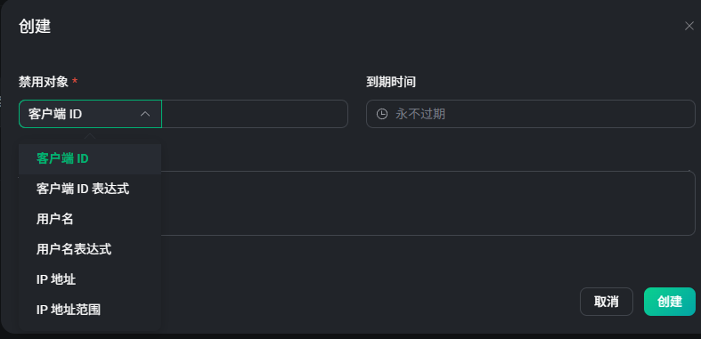  

### 连接抖动检测
（开源版没有此功能）
EMQX 支持`自动封禁那些被检测到短时间内频繁登录的客户端，并且在一段时间内拒绝这些客户端的登录，以避免此类客户端过多占用服务器资源而影响其他客户端的正常使用。`
需要注意的是，连接抖动检测功能`只会封禁客户端 ID，并不封禁用户名和 IP 地址`，即该机器只要更换客户端标 ID 就能够继续登录。
抖动检测功能默认关闭，您可以通过 EMQX Dashboard 或配置文件开启该功能。

## 数据集成
EMQX在接收到发布者的消息后，不需要订阅者来订阅此消息，而是EMQX通过HTTP请求主动将消息发送到指定的服务器等外部系统。这样就减少了订阅的麻烦。
### 工作原理
#### sink和source组件
数据集成使用 `Sink` 与 `Source` 组件与外部数据系统对接。
1. Sink 用于将消息发送到外部数据系统，例如 MySQL、Kafka 或 HTTP  服务等。
2. Source 则用于从外部数据系统接收消息，例如 MQTT、Kafka 或 GCP PubSub。

#### 连接器
连接器负责与外部数据系统的连接，用户可以为不同的外部数据系统创建不同的连接器，一个连接器可以为多个 Sink/Source 提供连接。
 

#### 规则引擎
规则引擎是 EMQX 内置基于 SQL 的数据处理组件，搭配数据集成无需编写代码即可实现一站式的 IoT 数据提取、过滤、转换、存储与处理，以加速应用集成和业务创新。
 
规则的组成：规则描述了 **数据来源**、**数据处理过程**、**处理结果去向** 三个方面：
 
1. 数据来源：规则的数据源可以是消息或事件，也可以是外部的数据系统 (**source**)。规则通过 SQL 的 FROM 子句指定数据的来源；
2. 数据处理过程：规则通过 `SQL` 语句和`函数`来描述数据的处理过程。SQL 的 WHERE 子句用于过滤数据，SELECT 子句以及 SQL 函数用于提取和转换数据；
3. 处理结果去向：规则可以定义一个或多个动作来处理 SQL 的输出结果。如果 SQL 执行通过，规则将按顺序执行相应的动作，比如将处理结果存储到数据库、或者重新发布到另一个 MQTT 主题等。支持的动作如下： 
    - 消息重发布：将结果发布到指定 MQTT 主题
    - 控制台输出：将结果输出到控制台或日志中
    - 发送到各类 Sink：将结果发送到外部数据系统中，如 MQTT 服务，Kafka，PostgreSQL 等

> 这里开始主要就是讲一些Redis，Kafka与EMQX的数据集成，但是开源版不支持。不过也可以通过其它方式来实现数据集成，比如通过WebHook来实现。

### 使用其它方式实现数据集成
EMQX开源版（Community Edition）确实只内置了**MQTT服务**和**HTTP服务**两种官方连接器，没有企业版（Enterprise Edition）那种开箱即用的MySQL/Redis/Kafka原生连接器，但这**不代表没法和Redis、MySQL做数据集成**——只是需要多一步轻量开发。

**一、开源版EMQX对接Redis/MySQL的核心思路**
开源版的核心能力是**规则引擎（Rule Engine）**，它能对MQTT消息做过滤、转换，只是缺少“直接写入数据库”的原生连接器；我们可以通过规则引擎+轻量中间层，绕开连接器限制实现数据集成，核心有两种可行方案：

**二、方案1：规则引擎 + WebHook + 自定义HTTP服务（最推荐，易上手）**
这是开源版对接Redis/MySQL最常用的方式，本质是：  
`EMQX规则引擎（处理消息） → WebHook推送 → 自研HTTP服务（写入Redis/MySQL）`  

这种方式对你的IoT全栈场景（小程序/嵌入式+服务器）非常友好，因为你本身就需要开发后端服务，只需在现有服务中新增一个接口即可。

**实操示例（以对接MySQL为例）**
**1. 第一步：配置EMQX规则引擎（WebHook推送）**
在EMQX Dashboard中配置规则，将过滤后的消息通过WebHook推送到你的HTTP服务：
```sql
-- EMQX规则引擎SQL（筛选温度>35℃的设备消息）
SELECT
  clientid as device_id,
  payload.temperature as temp,
  timestamp() as report_time
FROM
  "device/+/temperature"  -- 监听设备上报温度的主题
WHERE
  payload.temperature > 35

-- 动作配置（WebHook）：
-- 请求URL：http://你的服务器IP:8080/emqx/mysql/write （你的HTTP接口）
-- 请求方法：POST
-- 请求体格式：JSON
-- 超时时间：5000ms
-- 开启重试（避免消息丢失）
```

**2. 第二步：开发轻量HTTP服务（接收WebHook并写入MySQL）**
用你熟悉的语言（比如Node.js/Java/Python）写一个简单的HTTP接口，接收EMQX推送的消息并写入MySQL：
```python
# 示例：Python + FastAPI 实现HTTP服务（可直接集成到你的后端项目）
from fastapi import FastAPI, Request
import pymysql

app = FastAPI()

# 初始化MySQL连接池（实际项目中建议用连接池，避免频繁创建连接）
def get_mysql_conn():
    return pymysql.connect(
        host="localhost",
        user="root",
        password="你的密码",
        database="iot_db",
        charset="utf8mb4"
    )

# 接收EMQX WebHook消息并写入MySQL
@app.post("/emqx/mysql/write")
async def emqx_write_mysql(request: Request):
    try:
        # 解析EMQX推送的JSON数据
        data = await request.json()
        device_id = data["device_id"]
        temp = data["temp"]
        report_time = data["report_time"]

        # 写入MySQL
        conn = get_mysql_conn()
        cursor = conn.cursor()
        sql = "INSERT INTO device_temp (device_id, temp, report_time) VALUES (%s, %s, %s)"
        cursor.execute(sql, (device_id, temp, report_time))
        conn.commit()
        cursor.close()
        conn.close()

        return {"code": 200, "msg": "写入成功"}
    except Exception as e:
        # 记录异常日志，返回失败（EMQX会自动重试）
        print(f"写入失败：{str(e)}")
        return {"code": 500, "msg": "写入失败"}
```

**优势&劣势**
- ✅ 优势：开发成本低、易调试，可复用现有后端服务，适合你的全栈开发场景；
- ❌ 劣势：多了一层HTTP转发，高并发（1万+设备）下需优化HTTP服务性能（如增加连接池、异步写入）。

**三、方案2：规则引擎 + Lua脚本（进阶，减少中间层）**
EMQX开源版支持在规则引擎中嵌入**Lua脚本**，可以直接调用Redis/MySQL的客户端库（需提前安装依赖），无需经过WebHook，性能更高。

**实操示例（对接Redis）**
**1. 第一步：给EMQX安装Redis Lua客户端**
```bash
# 进入EMQX安装目录，下载Redis Lua客户端
cd /usr/local/emqx/lib/emqx-5.x/ebin
wget https://raw.githubusercontent.com/nrk/redis-lua/master/src/redis.lua
```

**2. 第二步：配置EMQX规则引擎（Lua脚本写入Redis）**
```sql
-- EMQX规则引擎SQL
SELECT
  clientid as device_id,
  payload.temperature as temp
FROM
  "device/+/temperature"

-- 动作配置：选择「执行Lua脚本」，写入以下脚本
local redis = require 'redis'
local client = redis.connect('127.0.0.1', 6379)  -- Redis地址
-- 可选：如果Redis有密码，添加 client:auth('你的密码')

-- 将设备温度存入Redis（key: device:{device_id}, value: temp）
local key = "device:" .. device_id
client:set(key, temp)
client:expire(key, 3600)  -- 设置1小时过期

return {code = 200}
```

**优势&劣势**
- ✅ 优势：少了HTTP中间层，性能更高，适合高并发场景；
- ❌ 劣势：需要熟悉Lua语法，MySQL的Lua客户端支持不如Redis成熟，且开源版无官方维护，调试成本略高。

---

**四、对你的项目建议**
结合你的“小程序/Uniapp + 嵌入式硬件 + 服务器端”全栈场景：
1. **优先选方案1（WebHook+HTTP服务）**：你本身需要开发后端服务，只需新增一个接口即可，无需额外学习Lua，调试和维护更简单；
2. **仅当并发量极高（如10万+设备）时考虑方案2**：如果只是中小型项目（设备数＜1万），方案1完全够用；
3. **无需局限于“只能用WebHook”**：WebHook是手段，不是目的——核心是通过规则引擎处理消息后，用你熟悉的方式对接数据库即可。

**总结**
1. 开源版EMQX没有Redis/MySQL原生连接器，但**可以通过规则引擎+轻量中间层实现集成**，并非只能用WebHook；
2. 对新手/中小型IoT项目，**WebHook+自定义HTTP服务**是最优解，开发成本低、易维护，适配你的全栈开发场景；
3. 进阶场景可尝试Lua脚本减少中间层，提升性能，但需付出一定的学习成本。


### SQL语法
在使用数据集成功能时，往往需要使用SQL语句对消息进行处理。
[SQL语法的使用](./尚硅谷课件/第三章【MQTT%20Dashboard】/课件/第三章【MQTT%20Dashboard】.md#4.5-SQL语法介绍)

### WebHook的使用
WebHook 是一种基于 HTTP 协议的事件驱动机制，用于在不同系统之间实现实时通信。当某个事件发生时，系统会自动向预先配置好的 URL 发送 HTTP 请求，将事件数据作为请求体发送。
Webhook 是 EMQX 中开箱即用的功能。当客户端向特定主题发布消息，或执行特定操作时就会触发 Webhook，将事件数据和消息数据转发到预设的 HTTP 服务器中。
 

### 使用
1. 定义http的请求接口：定义了一个`/webHook/notify`接口，用于接收EMQX发送的消息。
    ```java
    @RestController
    @RequestMapping(value = "/webHook")
    public class WebHookController {

        @PostMapping(value = "/notify")
        public void notify(@RequestBody Map<Object , Object> body) {
            System.out.println(body);
        }

    }
    ```
2. 在Dashboard中创建Webhook。url为`http://127.0.0.1:8080/webHook/notify`，表示请求`webHook/notify`接口。
     
3. 通过MQTTX向`a/1`主题发布消息，观察http服务控制台输出

## 日志
日志分为控制台日志和文件日志。
* 使用控制台日志在开发调试时可通过控制台输出来进行debug等，或运维快速排查运行时问题。
* 使用文件日志在生产环境中记录系统运行日志，用于对系统的长期监控，进行数据分析或排查一些顽固BUG。

[日志管理](./尚硅谷课件/第三章【MQTT%20Dashboard】/课件/第三章【MQTT%20Dashboard】.md#5-日志管理)


# 开发
* 前端通过websocket和EMQX建立连接，使用mqtt.js库。建立连接后可以通过websocket发送订阅消息，接收EMQX发布的消息。
    前端控制硬件的操作通常会先调用后端接口，由后端接口将操作指令发布到EMQX。这样更安全，并且可记录操作日志，多平台都可通过调用后端接口来控制硬件而不用每个平台自己编写操作硬件的代码。
    以此类推，前端展示硬件的状态也需要通过后端接口获取，使用websocket、轮询、按钮触发等方式获取数据。
* 后端通过MQTT协议与EMQX建立连接，订阅EMQX的消息。
    硬件发布的数据通过EMQX发送到后端，后端可以根据消息内容来更新数据库或其他状态。
    后端接收到EMQX发送的数据可通知前端；也可提供接口给前端调用，调用后向EMQX发布消息，再由EMQX发送到订阅消息的硬件。
* 硬件端通过MQTT协议与EMQX建立连接，发布消息到EMQX，订阅EMQX的消息。

物联网全链路通信的核心是 **“前端交互层 → 后端管控层 → EMQX 消息枢纽 → 硬件执行层”** 的四层架构，所有数据流转都围绕 **MQTT 消息路由** 展开。根据场景不同分为 **生产环境标准流程** 和 **测试环境极简流程**，以下是详细总结：

### 一、 生产环境标准通信流程（推荐，安全可控）
这是中小公司物联网项目的主流架构，核心是 **后端作为“安全管控中枢”**，隔离前端与硬件的直接通信，兼顾安全性、可维护性和扩展性。
涉及四端：**前端（微信小程序/Uniapp）**、**后端服务（Node.js/Go/PHP）**、**EMQX（MQTT 服务器）**、**硬件设备（单片机/模组）**

#### 1.  核心流程1：前端下发指令控制硬件（如开关灯）
```
前端 → 后端接口（权限校验） → 后端发 MQTT 消息 → EMQX 路由 → 硬件接收指令 → 硬件执行+上报状态
```
**分步拆解**
1.  **前端发起请求**：用户在小程序/页面点击“开灯”按钮，前端携带用户 token 调用后端控制接口（如 `POST /api/light/control`），参数包含 `lightId` 和 `status:on`。
2.  **后端管控处理**
    - 权限校验：验证用户 token 是否有效，是否有权限控制该灯；
    - 参数校验：检查 `lightId` 和 `status` 是否合法；
    - 记录日志：将操作人、操作时间、指令内容存入数据库，便于审计。
3.  **后端转发 MQTT 指令**：后端通过原生 MQTT 协议连接 EMQX，向主题 `light/{lightId}/control` 发布指令消息（如 `{status:"on",operator:"user123"}`），设置 QoS=1 确保消息送达。
4.  **EMQX 消息路由**：EMQX 接收后端的 MQTT 消息，根据主题路由到所有订阅该主题的设备。
5.  **硬件执行指令**：硬件（如 ESP8266）早已订阅 `light/{lightId}/control` 主题，接收到指令后，控制 GPIO 引脚打开灯光。
6.  **硬件主动上报状态**：硬件执行完指令后，立即向 EMQX 发布状态主题 `light/{lightId}/status` 的消息（如 `{lightId:"1",status:"on",timestamp:1735689000000}`）。

#### 2.  核心流程2：硬件上报状态，前端实时/非实时获取
硬件状态的**源头始终是硬件主动发布到 EMQX**，前端获取状态分两种模式，均由后端中转：
##### 模式A：非实时获取（前端主动查询）
```
硬件发布状态 → EMQX → 后端订阅+缓存 → 前端调用接口 → 后端返回缓存状态
```
- 硬件定时/状态变化时，向 EMQX 发布 `light/{lightId}/status` 消息；
- 后端长期订阅该主题，收到消息后存入 Redis 缓存（设置过期时间，避免脏数据）；
- 前端需要时调用后端查询接口（如 `GET /api/light/{lightId}/status`），后端从缓存读取并返回状态。

##### 模式B：实时获取（后端主动推送）
```
硬件发布状态 → EMQX → 后端订阅 → 后端 WebSocket/SSE 推送 → 前端实时展示
```
- 硬件和后端的操作同模式A；
- 后端启动 WebSocket/SSE 服务，维护与前端的长连接；
- 后端收到 EMQX 的状态消息后，立即通过长连接推送给所有已授权的前端客户端；
- 前端接收消息后，即时更新页面的灯状态展示，无需用户刷新。

### 二、 测试环境极简通信流程（无后端中转）
适合**本地功能验证、单机设备调试**，去掉后端层，前端和硬件直接与 EMQX 通信，**生产环境严禁使用**。
```
前端 ↔ EMQX ↔ 硬件
```
#### 1.  控制流程
前端通过 `mqtt.js` 直连 EMQX 的 WebSocket 端口（`ws://ip:8083/mqtt`），直接向 `light/{lightId}/control` 发布控制指令 → EMQX 路由 → 硬件接收执行。

#### 2.  状态获取流程
硬件向 EMQX 发布 `light/{lightId}/status` 消息 → 前端订阅该主题，直接接收 EMQX 推送的状态消息 → 更新页面展示。

#### 核心缺点
- 前端暴露 EMQX 账号密码，易被抓包盗用；
- 无权限校验，任意前端都能控制/查看设备；
- 无日志审计，设备异常时无法追溯操作记录。

### 三、 各端核心角色与协议总结
| 终端         | 核心角色                | 与 EMQX 通信协议       | 关键作用                     |
|--------------|-------------------------|------------------------|------------------------------|
| 前端（小程序）| 人机交互入口            | MQTT over WebSocket    | 发起控制请求、展示设备状态   |
| 后端服务     | 安全管控+数据枢纽       | 原生 MQTT（TCP）| 权限校验、日志、缓存、推送   |
| EMQX         | 消息路由中枢            | MQTT 核心协议载体      | 消息发布订阅、路由、离线缓存 |
| 硬件设备     | 指令执行+状态采集源头   | 原生 MQTT（TCP）| 执行控制指令、上报设备状态   |

### 最终总结
物联网全链路通信的**核心是 EMQX 作为 MQTT 消息枢纽**，串联前端、后端和硬件：
1.  **生产环境必选后端中转**：核心价值是安全管控（权限、日志）和系统扩展性（多端同步、数据缓存）；
2.  **硬件必须直连 EMQX**：这是物联网标准设计，避免后端单点故障，最大化通信效率；
3.  **前端与 EMQX 的交互**：始终通过后端中转（生产）或仅用于测试（直连），WebSocket 只是前端连接 EMQX 的“传输载体”，核心协议仍是 MQTT。

## Redis的使用
### 一、先明确：Redis 在物联网架构中的核心作用
Redis 是**高性能的内存键值数据库**（读写速度可达百万级 QPS），在之前的灯控物联网架构中，它是后端管控层的“核心辅助组件”，解决了 EMQX 和数据库无法覆盖的关键问题，具体作用如下：

| 作用                | 具体场景（灯控示例）| 为什么需要 Redis（而非 EMQX/数据库）|
|---------------------|---------------------------------------------|---------------------------------------------|
| 设备状态缓存        | 后端订阅 EMQX 的灯状态后，存入 Redis；前端查询时直接从 Redis 取 | 1. EMQX 是“消息队列”，不存储历史状态，仅转发实时消息；<br>2. 数据库读写速度慢（磁盘IO），前端高频查询会压垮数据库；<br>3. Redis 内存读写，响应时间<1ms，提升前端查询体验 |
| 设备在线状态管理    | 灯设备每10秒上报心跳，Redis 存储 `light:1:online` 并设15秒过期；超时则标记离线 | 1. 过期策略自动处理“设备断连”，无需后端写定时任务；<br>2. 支持快速查询“所有在线灯设备”（Set 结构） |
| 避免重复控制指令    | 前端连续点击“开灯”，Redis 记录 `light:1:lastCmdTime`，1秒内拒绝重复指令 | 防止硬件频繁执行重复指令（如灯反复开关），保护硬件寿命 |
| 临时数据存储        | 缓存灯的开关次数、今日运行时长等临时统计数据，定时同步到数据库 | 减轻数据库写入压力（批量同步而非单次写入） |
| 分布式锁（集群场景）| 后端集群部署时，用 Redis 分布式锁确保“同一灯设备只有一个后端实例发指令” | 避免多个后端实例同时向 EMQX 发冲突指令（如同时发“开”和“关”） |

### 二、Redis 的通用核心作用（不止物联网）
Redis 支持字符串（String）、哈希（Hash）、集合（Set）、有序集合（ZSet）、列表（List）等多种数据结构，是后端开发的“万能工具”，核心通用作用如下：
1. **热点数据缓存**（最核心）：将数据库中查询频繁、更新少的数据（如用户信息、设备基础配置）缓存到 Redis，替代直接查库，提升响应速度；
2. **分布式数据共享**：分布式系统中（如多台后端服务器），Redis 作为“共享内存”存储全局数据（如在线用户列表、设备在线状态）；
3. **分布式锁**：解决分布式系统的并发问题（如多服务实例操作同一资源）；
4. **计数器/限流**：如接口访问频率限流（用 INCR 指令计数，超过阈值拒绝请求）、设备上报频率限制；
5. **简易消息队列**：用 List 结构的 LPUSH/RPOP 实现轻量消息队列（如物联网中指令重试队列）；
6. **会话存储**：存储用户登录态（如 token），替代传统的 Session，支持分布式部署。

### 三、Redis 的使用（结合物联网场景实战）
#### 1. 基础准备：安装 Redis（Linux/Mac 示例）
```bash
# 安装（Ubuntu/Debian）
sudo apt update && sudo apt install redis-server

# 启动服务
sudo systemctl start redis-server

# 验证是否启动成功（进入Redis客户端）
redis-cli
# 输入 ping，返回 PONG 则成功
127.0.0.1:6379> ping
PONG
```

#### 2. 核心数据结构与物联网场景操作
Redis 命令简洁直观，以下是物联网中最常用的 3 种数据结构及操作：

##### （1）String 结构（最常用：存储设备状态、心跳时间）
**作用**：存储单个值（如设备状态、数字、字符串），支持原子增减。
**物联网实战示例**：缓存灯的最新状态
```bash
# 1. 存储1号灯的状态（JSON字符串），设置1小时过期（防止脏数据）
127.0.0.1:6379> SET light:1:status '{"lightId":"1","status":"on","timestamp":1735689000000}' EX 3600
OK

# 2. 查询1号灯的状态
127.0.0.1:6379> GET light:1:status
"{\"lightId\":\"1\",\"status\":\"on\",\"timestamp\":1735689000000}"

# 3. 记录1号灯的心跳时间（原子更新）
127.0.0.1:6379> SET light:1:heartbeat 1735689010000 EX 15
OK

# 4. 灯的开关次数计数（原子递增）
127.0.0.1:6379> INCR light:1:switchCount
(integer) 1
```

##### （2）Hash 结构（存储设备多维度信息）
**作用**：存储一个键的多个字段（如设备的ID、型号、在线状态、位置），无需拼接JSON。
**物联网实战示例**：存储灯的基础信息
```bash
# 1. 设置1号灯的多个属性
127.0.0.1:6379> HSET light:1:info model "ESP8266" location "客厅" online 1
(integer) 3

# 2. 查询1号灯的型号
127.0.0.1:6379> HGET light:1:info model
"ESP8266"

# 3. 查询1号灯的所有属性
127.0.0.1:6379> HGETALL light:1:info
1) "model"
2) "ESP8266"
3) "location"
4) "客厅"
5) "online"
6) "1"
```

##### （3）Set 结构（存储在线设备列表）
**作用**：存储不重复的集合（如所有在线灯设备ID），支持快速增删和查询。
**物联网实战示例**：管理在线灯设备
```bash
# 1. 1号灯上线，加入在线集合
127.0.0.1:6379> SADD online:lights 1
(integer) 1

# 2. 2号灯上线
127.0.0.1:6379> SADD online:lights 2
(integer) 1

# 3. 查询所有在线灯设备
127.0.0.1:6379> SMEMBERS online:lights
1) "1"
2) "2"

# 4. 1号灯离线，移除集合
127.0.0.1:6379> SREM online:lights 1
(integer) 1
```

#### 3. 代码示例：Node.js 操作 Redis（物联网场景）
结合之前的灯控后端代码，实现“缓存设备状态+管理在线状态”：
```javascript
const redis = require('redis');
// 连接Redis
const redisClient = redis.createClient({
  url: 'redis://localhost:6379',
  // 可选：设置连接超时、重试策略
  socket: {
    timeout: 5000,
    reconnectStrategy: (retries) => Math.min(retries * 100, 3000)
  }
});

// 连接Redis并处理错误
redisClient.connect()
  .then(() => console.log('Redis连接成功'))
  .catch(err => console.error('Redis连接失败：', err));

// 1. 缓存灯的状态（后端订阅EMQX后调用）
async function cacheLightStatus(lightId, status) {
  const statusData = {
    lightId,
    status,
    timestamp: Date.now()
  };
  // 存储JSON字符串，设置1小时过期
  await redisClient.set(
    `light:${lightId}:status`,
    JSON.stringify(statusData),
    { EX: 3600 }
  );
  // 更新在线状态（设15秒过期，设备心跳会刷新）
  await redisClient.set(`light:${lightId}:heartbeat`, Date.now(), { EX: 15 });
  // 将设备加入在线集合
  await redisClient.sAdd('online:lights', lightId);
}

// 2. 查询灯的状态（前端接口调用）
async function getLightStatus(lightId) {
  // 先查缓存
  const statusStr = await redisClient.get(`light:${lightId}:status`);
  if (!statusStr) {
    return { code: 404, msg: '未获取到设备状态' };
  }
  // 检查设备是否在线（心跳是否过期）
  const heartbeat = await redisClient.get(`light:${lightId}:heartbeat`);
  const isOnline = !!heartbeat;
  
  return {
    code: 200,
    data: {
      ...JSON.parse(statusStr),
      isOnline
    }
  };
}

// 3. 示例调用：缓存1号灯的开启状态
cacheLightStatus('1', 'on').then(() => {
  getLightStatus('1').then(res => console.log(res));
});
```

### 四、Redis 使用的注意事项（物联网场景）
1. **内存管理**：Redis 是内存数据库，需设置最大内存限制（`maxmemory`）和淘汰策略（如 `volatile-lru`，优先淘汰过期键），避免占满服务器内存；
2. **过期策略**：设备状态、心跳等临时数据必须设置过期时间，防止脏数据（如设备离线后，Redis 仍显示在线）；
3. **数据持久化**：开启 Redis 的 RDB/AOF 持久化，防止服务器重启后缓存数据丢失（物联网中状态缓存可丢失，但设备基础信息建议持久化）；
4. **避免大Key**：不要将所有设备状态存在一个Key中（如 `all:lights:status`），应按设备ID拆分（`light:1:status`），提升读写效率；
5. **原子操作**：计数器、分布式锁等场景必须用 Redis 原子指令（如 INCR、SETNX），避免并发问题。

### 总结
1. **Redis 在物联网中的核心价值**：缓存设备状态（提升查询速度）、管理设备在线状态（过期策略）、解决并发问题（分布式锁），是后端管控层的“性能和可靠性保障”；
2. **Redis 通用核心作用**：热点数据缓存、分布式数据共享、分布式锁、计数器/限流，是后端开发的基础组件；
3. **使用关键**：选对数据结构（String存状态、Hash存多属性、Set存在线列表）、合理设置过期时间、做好内存管理。

### 一、为什么 Redis 几乎成为现代互联网应用的标配
现代互联网应用的核心痛点是 **高并发读写压力、分布式协作、临时数据快速处理**，而 Redis 恰好是为解决这些问题而生的，具体体现在以下 4 个核心场景：

#### 1. 高并发读写的“性能救星”
现代应用（如电商商品详情、社交动态、物联网设备状态）都面临“读多写少”的高并发场景，直接查询数据库会导致：
- 磁盘 IO 速度慢（毫秒级），无法支撑每秒数万次的查询；
- 数据库连接池被占满，引发整个系统雪崩。

**Redis 的解决方案**：
将热点数据缓存到内存中，读写速度可达 **百万级 QPS**，响应时间**亚毫秒级**，能轻松扛住高并发查询。
- 示例：电商“618”秒杀时，商品库存、价格等热点数据全量缓存到 Redis，避免直接冲击数据库；
- 对比：没有 Redis，要么用数据库分库分表+读写分离（成本高、复杂度高），要么用 Memcached（仅支持 String 结构，功能单一）。

#### 2. 分布式系统的“协作中枢”
现代应用基本都是分布式部署（多台服务器集群），会面临**数据共享、并发冲突**等问题：
- 如何让多台服务器共享“在线用户列表”“设备在线状态”？
- 如何防止多台服务器同时修改同一数据（如秒杀库存扣减）？

**Redis 的解决方案**：
- **分布式数据共享**：用 Set/Hash 结构存储全局数据（如 `online:users` 集合存储在线用户 ID），所有服务器都能读写；
- **分布式锁**：用 `SETNX` 指令实现分布式锁，确保同一时刻只有一台服务器操作临界资源（如库存扣减），避免超卖。
- 对比：没有 Redis，要么用数据库乐观锁/悲观锁（性能差），要么用 Zookeeper（部署复杂、性能低于 Redis）。

#### 3. 临时数据的“高效容器”
应用中大量临时数据（如用户登录 token、验证码、接口限流计数）需要**快速写入、自动过期**：
- 用户登录 token 需存储 2 小时，过期自动失效；
- 接口限流需统计 1 分钟内的访问次数，超过阈值拒绝请求。

**Redis 的解决方案**：
- 支持**键过期策略**，无需手写定时任务清理数据；
- 支持**原子递增/递减**（`INCR/DECR`），完美实现计数器/限流功能。
- 示例：物联网中设备心跳记录，设置 15 秒过期，超时则自动标记设备离线，无需后端轮询。

#### 4. 轻量功能的“万能工具”
Redis 支持 5 种核心数据结构+多种扩展功能，能替代很多专用组件，降低系统复杂度：
- **简易消息队列**：用 List 结构的 `LPUSH/RPOP` 实现异步任务队列（如订单异步通知、设备指令重试），替代 RabbitMQ/Kafka（轻量场景下更易用）；
- **排行榜功能**：用 ZSet 结构实现商品销量榜、用户积分榜，支持按分数排序和范围查询；
- **发布订阅**：用 `PUBLISH/SUBSCRIBE` 实现简单的消息广播（如系统通知）。

### 二、哪些场景可以不用 Redis
Redis 不是“银弹”，在以下极简场景中，不用 Redis 反而更简单：
1.  **单机低并发的小型应用**
    如个人博客、企业内部管理后台（每日访问量<1 万），直接用数据库+应用内存缓存即可，引入 Redis 会增加部署和维护成本。
2.  **纯静态内容的应用**
    如纯 HTML 官网、文档站点，内容全由 CDN 缓存，无需 Redis 参与。
3.  **对数据持久化要求极高的场景**
    如金融交易记录、核心业务数据，Redis 的持久化（RDB/AOF）是“内存数据落地磁盘”，存在极小的数据丢失风险，这类场景需以数据库为核心存储。

### 三、Redis vs 替代方案：为什么它是首选
很多人会问“不用 Redis，用 Memcached/Zookeeper/数据库缓存行不行？”，我们用表格对比核心差异：

| 工具         | 核心优势                  | 核心劣势                  | 适用场景                  |
|--------------|---------------------------|---------------------------|---------------------------|
| **Redis**    | 多数据结构、高性能、功能全 | 需管理内存、存在数据丢失风险 | 绝大多数互联网/物联网场景 |
| Memcached    | 部署简单、内存占用低       | 仅支持 String、无持久化    | 早期极简缓存场景          |
| Zookeeper    | 强一致性、分布式协调       | 性能低、部署复杂          | 分布式锁（高一致性要求）|
| 数据库缓存   | 数据持久化、无需额外组件   | 性能差、扛不住高并发      | 低并发小型应用            |

### 总结
1.  **对中高并发、分布式架构的现代应用**：Redis **是近乎必不可少的工具**，它用极低的成本解决了性能、分布式协作等核心痛点，替代方案要么成本高、要么功能弱；
2.  **对极简低并发应用**：Redis 是“可选工具”，不用反而能降低系统复杂度；
3.  **本质定位**：Redis 不是“替代数据库”，而是**数据库的“性能加速器”**+**分布式系统的“协作工具”**，是现代互联网应用架构的“黄金搭档”。
