# 什么是MQTT
MQTT（Message Queuing Telemetry Transport）是一种基于发布/订阅模式的轻量级消息传输协议，用于在物联网（IoT）设备之间进行通信。它被设计为简单、可靠和低功耗，适用于资源受限的设备。
在物联网开发中，设备通过WIFI或4G等网络连接到EMQX服务器。（EMQX是一个开源的MQTT消息代理服务器，用于处理设备之间的消息传递。）当设备连接到EMQX服务器后，它可以发布消息到指定的主题（topic），也可以订阅感兴趣的主题。其他设备可以订阅相同的主题，从而接收发布到该主题的消息。
服务器端应用也会连接到EMQX服务器，订阅感兴趣的主题。当有设备发布消息到这些主题时，服务器端应用会收到通知，并可以根据需要进行处理。

# EMQX
EMQX 是一个开源（新版开始收费了）的 MQTT 消息代理服务器（broker），用于处理设备之间的消息传递。它支持高并发、低延迟的消息传输，适用于物联网设备的通信。
## 部署
EMQX在5.9版本后合并了社区版和企业版开始收费，所以免费使用只能使用5.8版本。（5.9后单节点也属于社区版，但是线上环境不知道会不会被要求交保护费）
[EMQX 5.8 开源版本 Docker 部署](https://www.emqx.com/zh/downloads-and-install/broker?os=Docker)
```bash
# 获取镜像
docker pull emqx/emqx:5.8.8
# 启动容器
docker run -d --name emqx -p 1883:1883 -p 8083:8083 -p 8084:8084 -p 8883:8883 -p 18083:18083 emqx/emqx:5.8.8
```
> 这里有个坑：我在Windows上安装了Docker Desktop，但是启动时报错，1883端口被占用了。所以需要修改启动命令，将1883端口映射到其他端口，如8888:1883，然后在MQTTX中连接时，需要填写8888端口。

## 访问dashboard
EMQX 提供了一个 Web 界面的 dashboard，用于监控和管理 MQTT 服务器。默认情况下，dashboard 监听在 18083 端口。
可以通过浏览器访问 `http://服务器IP:18083` 来登录 dashboard。默认用户名和密码是 `admin/public`。


# MQTTX
MQTTX 是一个跨平台的 MQTT 客户端工具，用于测试和调试 MQTT 协议的实现。它提供了一个用户友好的界面，用于连接到 MQTT 服务器、发布和订阅消息、查看消息历史记录等。（功能类似于postman，只是MQTTX用于测试MQTT协议，而postman用于测试HTTP协议。新版的postman也支持测试MQTT）
MQTTX提供了桌面端、Web端和命令行接口（CLI）三种方式。

## 桌面端
下载安装MQTTX桌面端，根据提示安装即可。
### 新建连接
点击MQTTX界面的“新建连接”按钮，填写连接信息。
* 连接名称：自定义一个名称，用于标识该连接。
* 服务器地址：填写MQTT服务器的地址，例如 `mqtt://127.0.0.1:1883`。
* 端口：填写MQTT服务器的端口，默认是 1883。
* 用户名和密码：如果MQTT服务器要求认证，填写对应的用户名和密码。
* 客户端ID：填写一个唯一的客户端ID，用于标识该连接的设备。
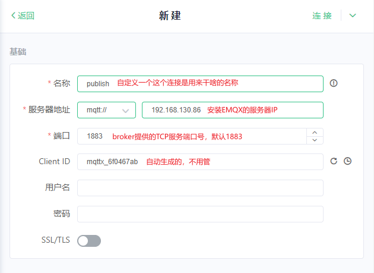  
> 服务器地址如果是本机，可填写`127.0.0.1`但是不能用`localhost`。端口号如果修改了，需要填写修改后的端口号，如8888。

*连接后在EMQX的dashboard中通过“客户端”可以看到该连接。*

### 添加订阅
点击MQTTX界面的“添加订阅”按钮，填写订阅信息。
* 主题：填写要订阅的主题，例如 `test/topic`。
* QoS：选择订阅的 QoS 级别，0、1 或 2。
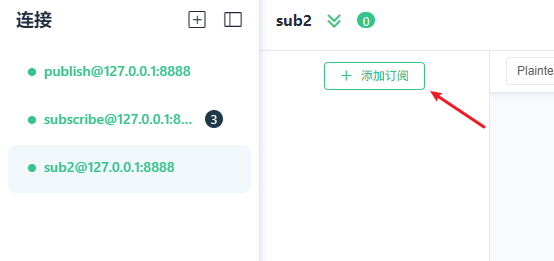  
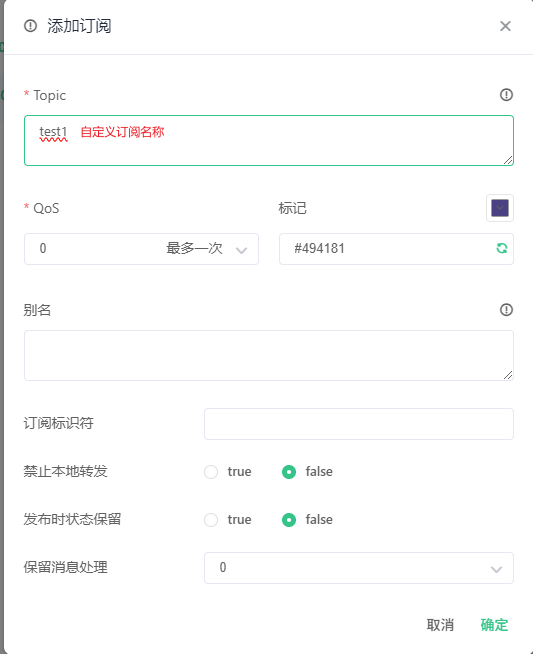  
*订阅后在EMQX的dashboard中通过“订阅管理”可以看到该订阅。*

### 发布订阅消息
一个连接订阅主题后，可以通过另一个连接发布消息到该主题，订阅连接就会收到该消息。
  

## MQTTX-CLI
MQTTX-CLI 是 MQTTX 的命令行接口版本，用于在终端中执行 MQTT 相关操作。它提供了一些方便的命令，用于连接到 MQTT 服务器、发布和订阅消息等。
### 安装
MQTTX-CLI 可以在 Windows、macOS 和 Linux 上运行。可以从 [MQTTX 官方网站](https://mqttx.app/) 下载适用于您操作系统的二进制文件。
### 使用
安装后可以使用`mqttx-cli`命令来执行相关操作。（在Windows上需要将`mqttx-cli.exe`添加到环境变量中，或是进入`mqttx-cli.exe`所在目录执行）
#### 连接到 MQTT 服务器
要连接到 MQTT 服务器，使用以下命令：
```bash
mqttx-cli connect -h 127.0.0.1 -p 1883 -u admin -P public -c my-client
```
`-h`：指定 MQTT 服务器的地址。
`-p`：指定 MQTT 服务器的端口。
`-u`：指定连接的用户名。
`-P`：指定连接的密码。
`-c`：指定连接的客户端ID。
#### 发布消息
要发布消息到指定主题，使用以下命令：
```bash
mqttx-cli pub -t test/topic -q 0 -h 127.0.0.1 -p 1883 -m "Hello, MQTT!"
```
`-t`：指定要发布的主题。
`-q`：指定发布消息的 QoS 级别，0、1 或 2。
`-h`：指定 MQTT 服务器的地址。
`-p`：指定 MQTT 服务器的端口。
`-m`：指定要发布的消息内容。
#### 订阅消息
要订阅指定主题，使用以下命令：
```bash
mqttx-cli sub -t 'test/topic' -h 127.0.0.1 -p 1883 -v
```
`-t`：指定要订阅的主题。
`-h`：指定 MQTT 服务器的地址。
`-p`：指定 MQTT 服务器的端口。
`-v`：收到消息后，打印详细的消息信息。

## web端
功能和桌面端基本相同，只是操作在浏览器中进行。可以使用docker部署web端。用桌面端即可，所以不多做介绍。

# MQTT报文格式
报文包括固定头、可变头、有效载荷（Payload）三部分。其中：
* 固定头：包含了报文的类型、标志位和剩余长度。（必须）
* 可变头：根据消息类型不同而不同，例如连接报文包含了协议名称、协议级别、连接标识、长链接标识、属性。（可选）
* 有效载荷（Payload）：包含了具体的消息内容，例如发布消息中的数据。（可选）

比如心跳数据`PINGREQ`和心跳响应数据`PINGRESP`就没有可变头和有效载荷，而包含数据的`PUBLISH`报文就有可变头和有效载荷。

## 固定头
固定头由 MQTT Control Packet Type（控制报文类型）、 Flags（标志位）、Remaining Length（剩余长度）三部分组成。
  

### 控制报文类型
类型|值|描述
---|---|---
RESERVED|0|保留
CONNECT|1|连接报文
CONNACK|2|连接确认报文
PUBLISH|3|发布报文
PUBACK|4|发布确认报文
PUBREC|5|发布接收报文
PUBREL|6|发布释放报文
PUBCOMP|7|发布完成报文
SUBSCRIBE|8|订阅报文
SUBACK|9|订阅确认报文
UNSUBSCRIBE|10|取消订阅报文
UNSUBACK|11|取消订阅确认报文
PINGREQ|12|心跳请求报文
PINGRESP|13|心跳响应报文
DISCONNECT|14|断开连接报文
AUTH|15|认证报文

### 标志位
目前只有`PUBLISH`报文的标志位被赋予了明确的含义：
* bit0: Retain，是否保留消息，1表示保留，0表示不保留。
* bit1|2: QoS Level，QoS 级别，0表示最多一次传输，1表示至少一次传输，2表示恰好一次传输。
* bit3: Dup，是否是重传的报文，1表示是重传，0表示不是重传。

### 剩余长度
剩余长度字段表示可变头和有效载荷的总长度，以字节为单位。

## 可变头
不同的报文类型有不同的可变头。
例如`CONNECT`连接报文包含了协议名称、协议级别、连接标识、长链接标识、属性。
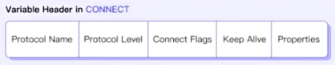  
`PUBLISH`发布报文包含了主题名称、标识符、属性。
  

### 属性
属性是MQTT 5.0新增的功能，用于在连接、订阅、发布等报文中传递额外的信息。
属性由长度和属性列表组成。
* 属性长度：属性列表的长度，以字节为单位。
* 属性列表：包含了属性的名称、数据类型和属性值。
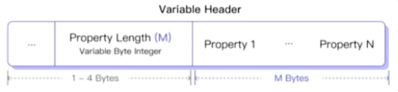  
属性根据报文类型不同而不同：[MQTT属性说明](https://docs.oasis-open.org/mqtt/mqtt/v5.0/os/mqtt-v5.0-os.html#_Toc3901027)

## 有效载荷
有效载荷（Payload）包含了具体的消息内容。
例如在`PUBLISH`发布报文中，有效载荷包含了要发布的消息数据；在`SUBSCRIBE`订阅报文中，有效载荷包含了要订阅的主题以及对于的订阅选项。

# 报文验证
可使用wireshark等工具来抓包验证MQTT报文。
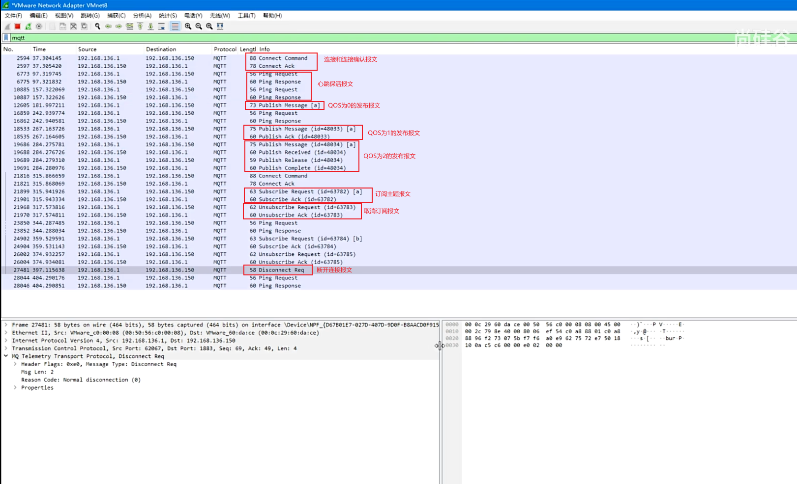  

# QOS
QoS（Quality of Service）是MQTT协议中用于确保消息传输质量的机制。
MQTT 5.0 新增了 QoS 级别2，相比 QoS 级别1，它提供了更可靠的消息传输。
## QoS 级别
* QoS 级别0：最多一次传输，消息可能会丢失（接收端不需要回复ACK，所以效率高）。
    传输高频但不那么重要的数据，比如传感器数据、状态更新等。
* QoS 级别1：至少一次传输，消息不会丢失，但可能会重复（比如接收端接收到了，响应的ACK丢失了，那么会重新发送再次收到）。
    传输一些较为重要的数据，如命令控制、配置更新等，要注意即使重复也不会有问题。
* QoS 级别2：恰好一次传输，消息不会丢失，也不会重复（发送/接收消息后，还要释放消息ID；双方都会缓存消息ID，所以可以去重，占用资源较多）。
    通常用于重要的领域，比如金融交易、医疗设备等。

在发送消息的时候可以指定QoS级别，一般情况下broker收到消息后会根据指定的QoS级别来处理消息。特殊情况下，QoS级别可能会发生改变（订阅者指定了QoS最大级别）。

# 主题（Topic）
主题（Topic）是MQTT协议中用于消息路由的机制。
它是一个字符串，用于标识消息的类型或内容。
主题可以包含多个层级，每个层级之间用斜杠（/）分隔，不要以斜杠开头或结尾。
例如，`sensor/temperature`表示传感器温度数据，`home/light/status`表示家庭灯的状态。

## 主题通配符
MQTT 5.0 新增了主题通配符，用于订阅多个主题。
通配符包括：
* `+`：表示匹配一个层级的主题。
    例如，`sensor/+/temperature`可以匹配`sensor/room1/temperature`和`sensor/room2/temperature`。
* `#`：表示匹配多个层级的主题，必须放在最后。
    例如，`home/#`可以匹配`home/light/status`、`home/door/status`、`home/light/level`等。

## 系统主题
以`$SYS`开头的主题是MQTT 5.0新增的系统主题。系统主题主要用于获取 MQTT 服务器`自身运行状态、消息统计、客户端上下线事件等数据`。但是目前，MQTT 协议暂未明确规定 `$SYS/`
例如，`$SYS/broker/version`可以订阅MQTT broker的版本信息。
EMQX支持的系统主题可以参考文档：[MQTT系统主题](https://docs.emqx.com/zh/emqx/v5.0/observability/mqtt-system-topics.html)

MQTTX要订阅系统主题，需要在EMQX的`dashboard`中的客户端授权中开启权限。在`File`行点击设置，新增`{allow, all, subscribe, ["$SYS/#", "#"]}.`
  

# 会话（Session）
会话（Session）是MQTT协议中用于保持客户端与broker之间通信状态的机制。每个MQTT客户端都可以启动一个或多个会话，通过会话可以实现客户端和服务器之间的消息传递。
## 常见配置参数
### Clean Start
Clean Start作用：用于指示客户端在和服务器建立连接的时候应该尝试恢复之前的会话还是直接创建全新的会话。
常见取值以及含义：
* 0：服务端存在一个关联此客户端标识符（Client ID）的会话，服务端**必须**基于此会话的状态恢复与客户端的通信（之前的订阅信息会再次绑定，并且会接收到客户端断开时，发布者所发布的消息）。如果不存在任何关联此客户端标识符的会话，服务端**必须**创建一个新的会话。
* 1：客户端和服务端**必须**丢弃任何已存在的会话，并开始一个新的会话。
### Session Expiry Interval
Session Expiry Interval 决定了会话状态数据在服务端的存储时长。
常见取值：
* **没有指定此属性或者设置为 0**，表示会话将在网络连接断开时立即结束。
* **设置为一个大于 0 的值**，则表示会话将在网络连接断开的多少秒之后过期。
* **设置为 0xFFFFFFFF**，即 Session Expiry Interval 属性能够设置的最大值时，表示会话数据永不过期。

服务端使用 `Client ID` 来唯一地标识每个会话，如果客户端想要在连接时复用之前的会话，那么必须使用与此前一致的 Client ID。
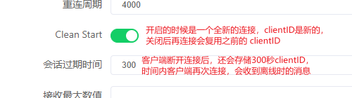  

# 消息
消息分为普通消息和保留消息：
* 普通消息：普通消息在发送之前其所对应的主题如果不存在订阅者，普通消息MQTT服务器会直接将其丢弃。
* 保留消息：保留消息可以保留在 MQTT 服务器中。任何新的订阅者订阅与该保留消息中的主题匹配的主题时，都会立即接收到该消息，即使这个消息是在它们订阅主题之前发布的。

## 保留消息
当客户端订阅主题时，如果服务端存在该主题匹配的保留消息，则该保留消息将被立即发送给该客户端。
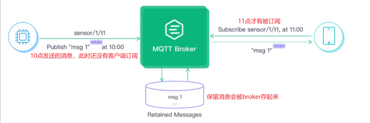  

### 常见使用场景
* 智能家居设备的状态在变更时就会上报，但是控制端需要在上线后就能获取到设备的状态；
* 传感器上报数据的间隔太长，但是订阅者需要在订阅后立即获取到最新的数据；
* 传感器的版本号、序列号等不会经常变更的属性，可在上线后发布一条保留消息告知后续的所有订阅者；

### 使用
发布保留消息
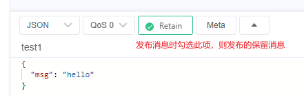  
发布后在EMQX的dashboard中可以看到该保留消息。
  
> 注意：发布的同一个主题的保留消息，只有最后一条会被保留。先发了个内容为1的保留消息，后发了个内容为2的保留消息，那么只有内容为2的保留消息会被保留，订阅端 新增了此主题的订阅/已订阅此主题的上线后 只能收到内容为2的保留消息。

保留消息默认存储在内存中，broker重启后会丢失。可以修改为存储在磁盘中。
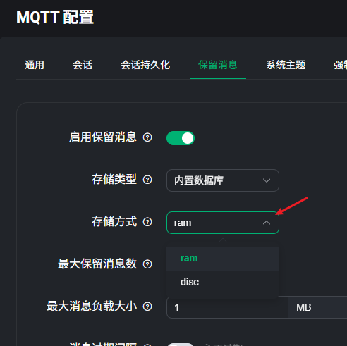  

### 删除保留消息
如果发布了某个主题的保留消息，要删除该保留消息，有以下方式：
* 可以再发布一个空内容的此主题保留消息，那么该主题的保留消息就会被删除。
* 在EMQX的dashboard中删除该保留消息。
* 发布消息的时候设置消息过期时间。
    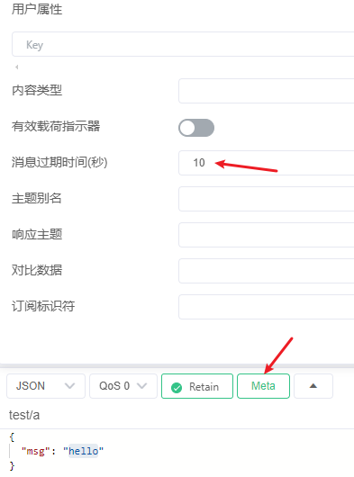  

## 消息过期时间
保留消息的过期时间通常用于比较长时间的消息，而有些消息具有即时性，比如客户端暂时因为网络原因离线了，几秒钟后又网络恢复上线，但是此时再收到该消息时，客户端可能已经不再需要该消息了，那么这种情况就应该使用“**消息的过期时间**”而不是“**保留消息的过期时间**”来实现。
比如：智能驾驶的汽车，我们可以向车辆发送`建议车速`使它能够在绿灯期间通过路口，这类消息通常仅在车辆到达下一个路口之前有效，生命周期非常短暂。
 
普通消息设置过期时间发送： 
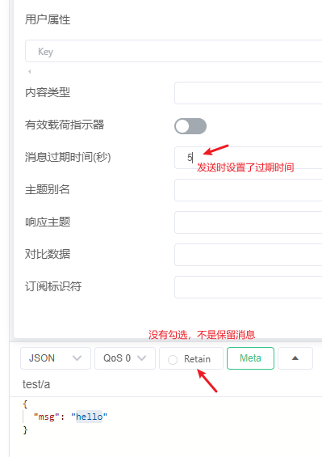  

### 保留消息和普通消息过期时间的区别
#### 1. 普通消息设置过期时间

**场景：** 传感器每隔 10 秒发送一次实时温标。

* **核心逻辑：** 消息只对**当前已在线**的订阅者有效。如果由于网络波动，消息在 Broker（服务器）中排队等待发送给某个订阅者，过期时间就会开始倒计时。
* **过期后果：**如果倒计时归零时，消息还没发出去，Broker 会直接**丢弃**该消息。
* **新进来的订阅者**永远看不到这条消息，因为普通消息在 Broker 转发完后是不留底的。

#### 2. 保留消息设置过期时间

**场景：** 设置一个“限时公告”或“临时配置”，要求新上线的设备能看到，但过时就作废。

* **核心逻辑：** Broker 会把这条消息**存入硬盘/内存**。每当有一个新客户端订阅该主题时，Broker 都会把这条“旧消息”推送给它。
* **过期后果：**
* **倒计时：** 从消息到达 Broker 的那一刻起，过期计时器就开始工作。
* **自动清理：** 一旦到达过期时间，Broker 不仅不会再转发这条消息，还会**自动从存储中删除**这条保留消息。
* **状态同步：** 如果消息没过期，新订阅者上线会收到它；如果过期了，新订阅者上线会看到“空”。

#### 核心区别对比表

| 特性 | 普通消息 + 过期时间 | 保留消息 + 过期时间 |
| --- | --- | --- |
| **消息去向** | 转发给当前在线订阅者后立即消失。 | 存储在 Broker 中，等待新订阅者。 |
| **过期后的动作** | 从发送队列中剔除，不再下发。 | **从 Broker 存储中彻底抹除**。 |
| **对新订阅者的影响** | 无影响（新订阅者收不到旧消息）。 | 过期前能收到，过期后收不到。 |
| **典型用途** | 具有时效性的指令（如：开灯，3秒没响应就作废）。 | 具有时效性的状态（如：临时促销信息、短期设备配置）。 |

#### 3. 一个关键细节：接收端看到的剩余时间

在 MQTT 5.0 中，当 Broker 转发带有过期时间的消息时，它会**更新**消息头里的过期时间字段。

> **举例：**
> 你发送了一条保留消息，设置过期时间为 **3600秒**。
> 3000秒后，一个新设备上线并订阅。
> 该设备收到的消息中，过期时间字段会自动显示为 **600秒**。

这保证了接收端能够准确知道这条信息还能“活”多久，从而决定是否要执行相关逻辑。

#### 总结

* **普通消息过期**是为了防止**网络拥塞**导致下发了过时的废话。
* **保留消息过期**是为了实现**自动清理的状态同步**，确保新上线的设备不会读取到陈旧的、已经失效的状态信息。

