# 什么是MQTT
MQTT（Message Queuing Telemetry Transport）是一种基于发布/订阅模式的轻量级消息传输协议，用于在物联网（IoT）设备之间进行通信。它被设计为简单、可靠和低功耗，适用于资源受限的设备。
在物联网开发中，设备通过WIFI或4G等网络连接到EMQX服务器。（EMQX是一个开源的MQTT消息代理服务器，用于处理设备之间的消息传递。）当设备连接到EMQX服务器后，它可以发布消息到指定的主题（topic），也可以订阅感兴趣的主题。其他设备可以订阅相同的主题，从而接收发布到该主题的消息。
服务器端应用也会连接到EMQX服务器，订阅感兴趣的主题。当有设备发布消息到这些主题时，服务器端应用会收到通知，并可以根据需要进行处理。

# EMQX
EMQX 是一个开源（新版开始收费了）的 MQTT 消息代理服务器（broker），用于处理设备之间的消息传递。它支持高并发、低延迟的消息传输，适用于物联网设备的通信。
## 部署
EMQX在5.9版本后合并了社区版和企业版开始收费，所以免费使用只能使用5.8版本。（5.9后单节点也属于社区版，但是线上环境不知道会不会被要求交保护费）
[EMQX 5.8 开源版本 Docker 部署](https://www.emqx.com/zh/downloads-and-install/broker?os=Docker)
```bash
# 获取镜像
docker pull emqx/emqx:5.8.8
# 启动容器
docker run -d --name emqx -p 1883:1883 -p 8083:8083 -p 8084:8084 -p 8883:8883 -p 18083:18083 emqx/emqx:5.8.8
```
> 这里有个坑：我在Windows上安装了Docker Desktop，但是启动时报错，1883端口被占用了。所以需要修改启动命令，将1883端口映射到其他端口，如8888:1883，然后在MQTTX中连接时，需要填写8888端口。

## 访问dashboard
EMQX 提供了一个 Web 界面的 dashboard，用于监控和管理 MQTT 服务器。默认情况下，dashboard 监听在 18083 端口。
可以通过浏览器访问 `http://服务器IP:18083` 来登录 dashboard。默认用户名和密码是 `admin/public`。


# MQTTX
MQTTX 是一个跨平台的 MQTT 客户端工具，用于测试和调试 MQTT 协议的实现。它提供了一个用户友好的界面，用于连接到 MQTT 服务器、发布和订阅消息、查看消息历史记录等。（功能类似于postman，只是MQTTX用于测试MQTT协议，而postman用于测试HTTP协议。新版的postman也支持测试MQTT）
MQTTX提供了桌面端、Web端和命令行接口（CLI）三种方式。

## 桌面端
下载安装MQTTX桌面端，根据提示安装即可。
### 新建连接
点击MQTTX界面的“新建连接”按钮，填写连接信息。
* 连接名称：自定义一个名称，用于标识该连接。
* 服务器地址：填写MQTT服务器的地址，例如 `mqtt://127.0.0.1:1883`。
* 端口：填写MQTT服务器的端口，默认是 1883。
* 用户名和密码：如果MQTT服务器要求认证，填写对应的用户名和密码。
* 客户端ID：填写一个唯一的客户端ID，用于标识该连接的设备。
  
> 服务器地址如果是本机，可填写`127.0.0.1`但是不能用`localhost`。端口号如果修改了，需要填写修改后的端口号，如8888。

*连接后在EMQX的dashboard中通过“客户端”可以看到该连接。*

### 添加订阅
点击MQTTX界面的“添加订阅”按钮，填写订阅信息。
* 主题：填写要订阅的主题，例如 `test/topic`。
* QoS：选择订阅的 QoS 级别，0、1 或 2。
  
  
*订阅后在EMQX的dashboard中通过“订阅管理”可以看到该订阅。*

### 发布订阅消息
一个连接订阅主题后，可以通过另一个连接发布消息到该主题，订阅连接就会收到该消息。
  

## MQTTX-CLI
MQTTX-CLI 是 MQTTX 的命令行接口版本，用于在终端中执行 MQTT 相关操作。它提供了一些方便的命令，用于连接到 MQTT 服务器、发布和订阅消息等。
### 安装
MQTTX-CLI 可以在 Windows、macOS 和 Linux 上运行。可以从 [MQTTX 官方网站](https://mqttx.app/) 下载适用于您操作系统的二进制文件。
### 使用
安装后可以使用`mqttx-cli`命令来执行相关操作。（在Windows上需要将`mqttx-cli.exe`添加到环境变量中，或是进入`mqttx-cli.exe`所在目录执行）
#### 连接到 MQTT 服务器
要连接到 MQTT 服务器，使用以下命令：
```bash
mqttx-cli connect -h 127.0.0.1 -p 1883 -u admin -P public -c my-client
```
`-h`：指定 MQTT 服务器的地址。
`-p`：指定 MQTT 服务器的端口。
`-u`：指定连接的用户名。
`-P`：指定连接的密码。
`-c`：指定连接的客户端ID。
#### 发布消息
要发布消息到指定主题，使用以下命令：
```bash
mqttx-cli pub -t test/topic -q 0 -h 127.0.0.1 -p 1883 -m "Hello, MQTT!"
```
`-t`：指定要发布的主题。
`-q`：指定发布消息的 QoS 级别，0、1 或 2。
`-h`：指定 MQTT 服务器的地址。
`-p`：指定 MQTT 服务器的端口。
`-m`：指定要发布的消息内容。
#### 订阅消息
要订阅指定主题，使用以下命令：
```bash
mqttx-cli sub -t 'test/topic' -h 127.0.0.1 -p 1883 -v
```
`-t`：指定要订阅的主题。
`-h`：指定 MQTT 服务器的地址。
`-p`：指定 MQTT 服务器的端口。
`-v`：收到消息后，打印详细的消息信息。

## web端
功能和桌面端基本相同，只是操作在浏览器中进行。可以使用docker部署web端。用桌面端即可，所以不多做介绍。

# MQTT报文格式
报文包括固定头、可变头、有效载荷（Payload）三部分。其中：
* 固定头：包含了报文的类型、标志位和剩余长度。（必须）
* 可变头：根据消息类型不同而不同，例如连接报文包含了协议名称、协议级别、连接标识、长链接标识、属性。（可选）
* 有效载荷（Payload）：包含了具体的消息内容，例如发布消息中的数据。（可选）

比如心跳数据`PINGREQ`和心跳响应数据`PINGRESP`就没有可变头和有效载荷，而包含数据的`PUBLISH`报文就有可变头和有效载荷。

## 固定头
固定头由 MQTT Control Packet Type（控制报文类型）、 Flags（标志位）、Remaining Length（剩余长度）三部分组成。
  

### 控制报文类型
类型|值|描述
---|---|---
RESERVED|0|保留
CONNECT|1|连接报文
CONNACK|2|连接确认报文
PUBLISH|3|发布报文
PUBACK|4|发布确认报文
PUBREC|5|发布接收报文
PUBREL|6|发布释放报文
PUBCOMP|7|发布完成报文
SUBSCRIBE|8|订阅报文
SUBACK|9|订阅确认报文
UNSUBSCRIBE|10|取消订阅报文
UNSUBACK|11|取消订阅确认报文
PINGREQ|12|心跳请求报文
PINGRESP|13|心跳响应报文
DISCONNECT|14|断开连接报文
AUTH|15|认证报文

### 标志位
目前只有`PUBLISH`报文的标志位被赋予了明确的含义：
* bit0: Retain，是否保留消息，1表示保留，0表示不保留。
* bit1|2: QoS Level，QoS 级别，0表示最多一次传输，1表示至少一次传输，2表示恰好一次传输。
* bit3: Dup，是否是重传的报文，1表示是重传，0表示不是重传。

### 剩余长度
剩余长度字段表示可变头和有效载荷的总长度，以字节为单位。

## 可变头
不同的报文类型有不同的可变头。
例如`CONNECT`连接报文包含了协议名称、协议级别、连接标识、长链接标识、属性。
  
`PUBLISH`发布报文包含了主题名称、标识符、属性。
  

### 属性
属性是MQTT 5.0新增的功能，用于在连接、订阅、发布等报文中传递额外的信息。
属性由长度和属性列表组成。
* 属性长度：属性列表的长度，以字节为单位。
* 属性列表：包含了属性的名称、数据类型和属性值。
  
属性根据报文类型不同而不同：[MQTT属性说明](https://docs.oasis-open.org/mqtt/mqtt/v5.0/os/mqtt-v5.0-os.html#_Toc3901027)

## 有效载荷
有效载荷（Payload）包含了具体的消息内容。
例如在`PUBLISH`发布报文中，有效载荷包含了要发布的消息数据；在`SUBSCRIBE`订阅报文中，有效载荷包含了要订阅的主题以及对于的订阅选项。

# 报文验证
可使用wireshark等工具来抓包验证MQTT报文。
  

# QOS
QoS（Quality of Service）是MQTT协议中用于确保消息传输质量的机制。
MQTT 5.0 新增了 QoS 级别2，相比 QoS 级别1，它提供了更可靠的消息传输。
## QoS 级别
* QoS 级别0：最多一次传输，消息可能会丢失（接收端不需要回复ACK，所以效率高）。
    传输高频但不那么重要的数据，比如传感器数据、状态更新等。
* QoS 级别1：至少一次传输，消息不会丢失，但可能会重复（比如接收端接收到了，响应的ACK丢失了，那么会重新发送再次收到）。
    传输一些较为重要的数据，如命令控制、配置更新等，要注意即使重复也不会有问题。
* QoS 级别2：恰好一次传输，消息不会丢失，也不会重复（发送/接收消息后，还要释放消息ID；双方都会缓存消息ID，所以可以去重，占用资源较多）。
    通常用于重要的领域，比如金融交易、医疗设备等。

在发送消息的时候可以指定QoS级别，一般情况下broker收到消息后会根据指定的QoS级别来处理消息。特殊情况下，QoS级别可能会发生改变（订阅者指定了QoS最大级别）。

# 主题（Topic）
主题（Topic）是MQTT协议中用于消息路由的机制。
它是一个字符串，用于标识消息的类型或内容。
主题可以包含多个层级，每个层级之间用斜杠（/）分隔，不要以斜杠开头或结尾。
例如，`sensor/temperature`表示传感器温度数据，`home/light/status`表示家庭灯的状态。

## 主题通配符
MQTT 5.0 新增了主题通配符，用于订阅多个主题。
通配符包括：
* `+`：表示匹配一个层级的主题。
    例如，`sensor/+/temperature`可以匹配`sensor/room1/temperature`和`sensor/room2/temperature`。
* `#`：表示匹配多个层级的主题，必须放在最后。
    例如，`home/#`可以匹配`home/light/status`、`home/door/status`、`home/light/level`等。

## 系统主题
以`$SYS`开头的主题是MQTT 5.0新增的系统主题。系统主题主要用于获取 MQTT 服务器`自身运行状态、消息统计、客户端上下线事件等数据`。但是目前，MQTT 协议暂未明确规定 `$SYS/`
例如，`$SYS/broker/version`可以订阅MQTT broker的版本信息。
EMQX支持的系统主题可以参考文档：[MQTT系统主题](https://docs.emqx.com/zh/emqx/v5.0/observability/mqtt-system-topics.html)

MQTTX要订阅系统主题，需要在EMQX的`dashboard`中的客户端授权中开启权限。在`File`行点击设置，新增`{allow, all, subscribe, ["$SYS/#", "#"]}.`
  

# 会话（Session）
会话（Session）是MQTT协议中用于保持客户端与broker之间通信状态的机制。每个MQTT客户端都可以启动一个或多个会话，通过会话可以实现客户端和服务器之间的消息传递。
## 常见配置参数
### Clean Start
Clean Start作用：用于指示客户端在和服务器建立连接的时候应该尝试恢复之前的会话还是直接创建全新的会话。
常见取值以及含义：
* 0：服务端存在一个关联此客户端标识符（Client ID）的会话，服务端**必须**基于此会话的状态恢复与客户端的通信（之前的订阅信息会再次绑定，并且会接收到客户端断开时，发布者所发布的消息）。如果不存在任何关联此客户端标识符的会话，服务端**必须**创建一个新的会话。
* 1：客户端和服务端**必须**丢弃任何已存在的会话，并开始一个新的会话。
### Session Expiry Interval
Session Expiry Interval 决定了会话状态数据在服务端的存储时长。
常见取值：
* **没有指定此属性或者设置为 0**，表示会话将在网络连接断开时立即结束。
* **设置为一个大于 0 的值**，则表示会话将在网络连接断开的多少秒之后过期。
* **设置为 0xFFFFFFFF**，即 Session Expiry Interval 属性能够设置的最大值时，表示会话数据永不过期。

服务端使用 `Client ID` 来唯一地标识每个会话，如果客户端想要在连接时复用之前的会话，那么必须使用与此前一致的 Client ID。
  

# 消息
消息分为普通消息和保留消息：
* 普通消息：普通消息在发送之前其所对应的主题如果不存在订阅者，普通消息MQTT服务器会直接将其丢弃。
* 保留消息：保留消息可以保留在 MQTT 服务器中。任何新的订阅者订阅与该保留消息中的主题匹配的主题时，都会立即接收到该消息，即使这个消息是在它们订阅主题之前发布的。

## 保留消息
当客户端订阅主题时，如果服务端存在该主题匹配的保留消息，则该保留消息将被立即发送给该客户端。
  

### 常见使用场景
* 智能家居设备的状态在变更时就会上报，但是控制端需要在上线后就能获取到设备的状态；
* 传感器上报数据的间隔太长，但是订阅者需要在订阅后立即获取到最新的数据；
* 传感器的版本号、序列号等不会经常变更的属性，可在上线后发布一条保留消息告知后续的所有订阅者；

### 使用
发布保留消息
  
发布后在EMQX的dashboard中可以看到该保留消息。
  
> 注意：发布的同一个主题的保留消息，只有最后一条会被保留。先发了个内容为1的保留消息，后发了个内容为2的保留消息，那么只有内容为2的保留消息会被保留，订阅端 新增了此主题的订阅/已订阅此主题的上线后 只能收到内容为2的保留消息。

保留消息默认存储在内存中，broker重启后会丢失。可以修改为存储在磁盘中。
  

### 删除保留消息
如果发布了某个主题的保留消息，要删除该保留消息，有以下方式：
* 可以再发布一个空内容的此主题保留消息，那么该主题的保留消息就会被删除。
* 在EMQX的dashboard中删除该保留消息。
* 发布消息的时候设置消息过期时间。
      

## 消息过期时间
保留消息的过期时间通常用于比较长时间的消息，而有些消息具有即时性，比如客户端暂时因为网络原因离线了，几秒钟后又网络恢复上线，但是此时再收到该消息时，客户端可能已经不再需要该消息了，那么这种情况就应该使用“**消息的过期时间**”而不是“**保留消息的过期时间**”来实现。
比如：智能驾驶的汽车，我们可以向车辆发送`建议车速`使它能够在绿灯期间通过路口，这类消息通常仅在车辆到达下一个路口之前有效，生命周期非常短暂。
 
普通消息设置过期时间发送： 
  

### 保留消息和普通消息过期时间的区别
#### 1. 普通消息设置过期时间

**场景：** 传感器每隔 10 秒发送一次实时温标。

* **核心逻辑：** 消息只对**当前已在线**的订阅者有效。如果由于网络波动，消息在 Broker（服务器）中排队等待发送给某个订阅者，过期时间就会开始倒计时。
* **过期后果：**如果倒计时归零时，消息还没发出去，Broker 会直接**丢弃**该消息。
* **新进来的订阅者**永远看不到这条消息，因为普通消息在 Broker 转发完后是不留底的。

#### 2. 保留消息设置过期时间

**场景：** 设置一个“限时公告”或“临时配置”，要求新上线的设备能看到，但过时就作废。

* **核心逻辑：** Broker 会把这条消息**存入硬盘/内存**。每当有一个新客户端订阅该主题时，Broker 都会把这条“旧消息”推送给它。
* **过期后果：**
* **倒计时：** 从消息到达 Broker 的那一刻起，过期计时器就开始工作。
* **自动清理：** 一旦到达过期时间，Broker 不仅不会再转发这条消息，还会**自动从存储中删除**这条保留消息。
* **状态同步：** 如果消息没过期，新订阅者上线会收到它；如果过期了，新订阅者上线会看到“空”。

#### 核心区别对比表

| 特性 | 普通消息 + 过期时间 | 保留消息 + 过期时间 |
| --- | --- | --- |
| **消息去向** | 转发给当前在线订阅者后立即消失。 | 存储在 Broker 中，等待新订阅者。 |
| **过期后的动作** | 从发送队列中剔除，不再下发。 | **从 Broker 存储中彻底抹除**。 |
| **对新订阅者的影响** | 无影响（新订阅者收不到旧消息）。 | 过期前能收到，过期后收不到。 |
| **典型用途** | 具有时效性的指令（如：开灯，3秒没响应就作废）。 | 具有时效性的状态（如：临时促销信息、短期设备配置）。 |

#### 3. 一个关键细节：接收端看到的剩余时间

在 MQTT 5.0 中，当 Broker 转发带有过期时间的消息时，它会**更新**消息头里的过期时间字段。

> **举例：**
> 你发送了一条保留消息，设置过期时间为 **3600秒**。
> 3000秒后，一个新设备上线并订阅。
> 该设备收到的消息中，过期时间字段会自动显示为 **600秒**。

这保证了接收端能够准确知道这条信息还能“活”多久，从而决定是否要执行相关逻辑。

#### 总结

* **普通消息过期**是为了防止**网络拥塞**导致下发了过时的废话。
* **保留消息过期**是为了实现**自动清理的状态同步**，确保新上线的设备不会读取到陈旧的、已经失效的状态信息。

## 遗嘱消息
客户端可以在**连接时**在服务端中注册一个遗嘱消息，与普通消息类似，我们可以设置遗嘱消息的主题、有效载荷等等。当该客户端**意外断开连接**，服务端就会向其他订阅了相应主题的客户端发送此遗嘱消息。这些接收者也因此可以及时地采取行动，例如向用户发送通知、切换备用设备等等。借助于遗嘱消息可以感知到客户端是意外断开。

遗嘱消息和普通消息的区别：
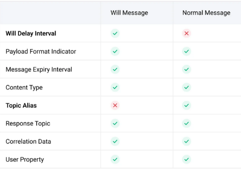  
遗嘱消息多了一个专属属性：Will Delay Interval。这个属性决定了服务端将在网络连接关闭后延迟多久发布遗嘱消息，并以秒为单位。
### 为什么需要延迟时间
默认情况下，服务端总是在网络连接意外关闭时立即发布遗嘱消息。但是很多时候，网络连接的中断是短暂的，所以客户端往往能够重新连接并继续之前的会话。这导致遗嘱消息可能被频繁地且无意义地发送。
如果没有指定 Will Delay Interval 或者将其设置为 0，服务端将仍然在网络连接关闭时立即发布遗嘱消息。
但如果将 Will Delay Interval 设置为一个大于 0 的值，并且客户端能够在 Will Delay Interval 到期前恢复连接，那么该遗嘱消息将不会被发布。

### 使用
* 发布端需要发布一条遗嘱消息：
    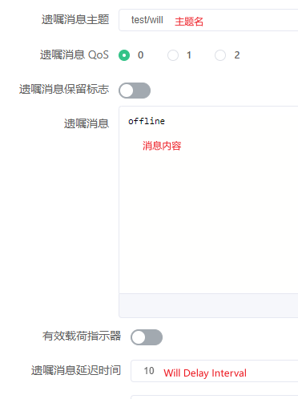  
* 订阅端也需要订阅遗嘱消息的主题，才能收到遗嘱消息：
      
* 当发布端意外断开时，订阅端会收到遗嘱消息。
    **发现订阅端会立即收到而不是10s后收到，是因为发布端的会话过期时间设置的0，而MQTT服务器发现发布端断开就不会保留此会话而是立即清理，清理会话时会强制触发遗嘱发送。修改发布端的会话时间就能实现延迟10s后发送。**
    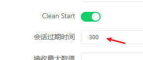  

## 延迟发布（定时发布）
**延迟发布简介**：MQTT服务端收到发布者发布的消息以后，延迟一段时间以后再把消息转发给订阅者。

**延迟发布的使用场景**：
* 农业智能化管理：在智能农业中，可能需要`在特定时间启动灌溉系统或调节温室环境。`通过MQTT延迟发布，可以预先设定好指令发布时间，如在清晨或傍晚自动发送开启灌溉的信号，确保水资源的有效利用且不对作物生长周期造成干扰。
* 能源管理与自动控制：智能家居或智能建筑中的照明、供暖、通风系统可以根据居民生活习惯或节能策略，利用延迟发布在预设时间自动调整，如在居民到家前半小时开启空调或在离开家后一定时间关闭所有非必要电器，以达到节能减排的目的。
* 公共设施维护：城市中的公共照明、广告牌等设施可能需要在特定时间统一开关，以节省能源或遵守当地法规。通过MQTT延迟发布功能，可以安排在夜间自动发送开关指令，无需人工干预，简化运维流程。
* 医疗健康监护：在远程医疗监护中，设备可能需要在一天中的特定时间收集患者数据或发送提醒，如定时提醒患者服药或在固定时间收集心率、血压等生理参数，以优化患者护理计划。

**实现延迟发布需要使用特定的主题格式：**`$delayed/{DelayInterval}/{TopicName}`。
* `$delayed`: 使用 `$delay` 作为主题前缀的消息都将被视为需要延迟发布的消息
* `DelayInterval`： 延迟发布的时间间隔，单位为妙，允许的最大间隔是 4294967 秒。如果 `{DelayInterval}` 无法被解析为一个整型数字，EMQX 将丢弃该消息，客户端不会收到任何信息。
* `TopicName`：MQTT消息的主题名称
如：
```shell
 $delayed/15/x/y 表示 15 秒后将 MQTT 消息发布到主题 x/y。
 $delayed/60/a/b 表示 1 分钟后将 MQTT 消息发布到 a/b。
```
### 使用
* 订阅端订阅一个延迟发布的主题：
      
* 发布端以指定的格式发布延迟消息：
    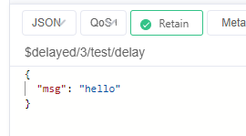  
    发布后订阅端就会在3s后收到此消息。

## 用户属性
允许在Publish、Subscribe、Connect、Disconnect等报文中携带附加信息。类似于http协议的请求头。
**用户属性的应用场景：**
* 日志记录：在发布（PUBLISH）和订阅（SUBSCRIBE）报文中加入用户属性，可以帮助记录操作者信息、操作时间、原因说明等，便于后续的审计跟踪和问题排查。
* 消息分类与标记：用户属性可以用来给消息添加标签或分类信息，如消息类型等，使得接收方能根据这些属性对消息进行过滤、排序或特殊处理。
### 使用
* 发布端添加用户属性：
    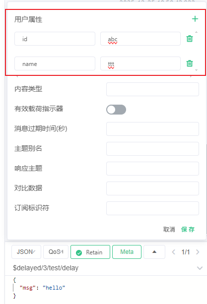  
* 订阅端就能收到用户属性：
      

# 订阅
## 订阅选项
订阅的组成：
* 主题过滤器：决定了服务端将向我们转发哪些主题下的消息
* 订阅选项：允许我们进一步定制服务端的转发行为
    MQTT 5.0提供了4个订阅选项：QoS、No Local、Retain As Published、Retain Handling

### QoS
QoS 是**最常用**的一个订阅选项，它表示服务端在向订阅端发送消息时可以使用的`最大QoS等级。`

* 情况1：服务端支持的最大 QoS < 客户端订阅时请求的最大QoS
    服务端将无法满足客户端的要求，这时服务端就会通过订阅的响应报文（SUBACK）告知订阅端最终授予的最大 QoS 等级，订阅端可以**自行评估是否接受并继续通信。**
    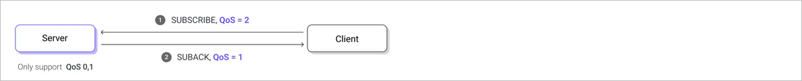 

* 情况2：订阅时请求的最大QoS < 消息发布时的QoS
    为了尽可能地投递消息，服务端不会忽略这些消息，而是会在转发时对这些消息的 QoS 进行**降级处理。**
     

#### 使用
1. 创建sub客户端连接，并且订阅`sub/qos/demo`主题, 并指定`QOS为0`
    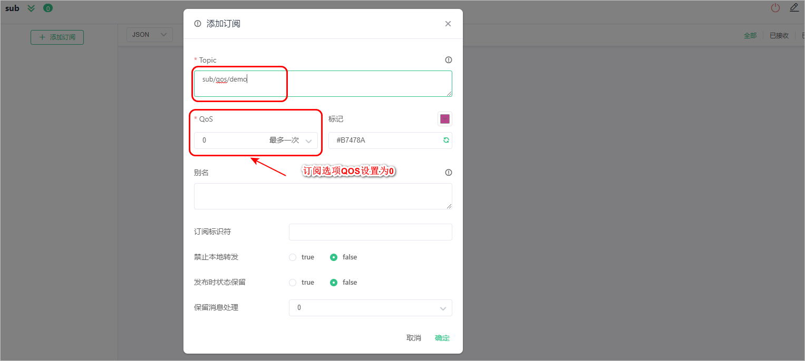 
2. 订阅成功以后，通过sub客户端连接向`sub/qos/demo`主题发布消息，并且指定QOS的登记为1
     
    结果：sub客户端收到的消息的QOS值为0

### No Local
No Local取值：
* 0(默认值)：服务端`可以`将消息转发给发布这个消息的客户端
* 1：服务端`不可以`将消息转发给发布这个消息的客户端

这个订阅选项尝尝被用在***桥接场景***中，桥接本质上是两个 MQTT Server 建立了一个 MQTT 连接，然后相互订阅一些主题，Server 将客户端的消息转发给另一个 Server，而另一个 Server 则可以将消息继续转发给它的客户端。
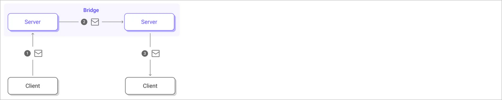 
在桥接的场景中，如果没有将No Local订阅选项的值设置为1，那么此时会形成`转发风暴`。
**举例**：假设两个 MQTT Server 分别是 Server A 和 Server B，它们分别向对方订阅了`#`主题。现在，Server A 将一些来自客户端的消息转发给了 Server B，而当 Server B 查找匹配的订阅时，Server A  也会位于其中。如果 Server B 将消息转发给了 Server A，那么同样 Server A 在收到消息后又会把它们再次转发给  Server B，这样就陷入了无休止的转发风暴。而如果 Server A 和 Server B 在订阅 `#` 主题的同时，将 No Local 选项设置为 1，就可以完美地避免这个问题。

#### 使用
具体步骤：
1. 创建sub客户端连接，并订阅`sub/local/demo`主题,并且设置`No Local订阅选项为1`


2. 使用sub客户端连接向`sub/local/demo`主题发布消息


结果：当前的客户端连接没有收到该主题中的消息。

### Retain As Published
Retain As Published取值：
* 0(默认值)：服务端在向此订阅转发应用消息时需要`清除`消息中的 Retain 标识不变
* 1：服务端在向此订阅转发应用消息时需要`保持`消息中的 Retain 标识不变

应用场景：***桥接场景***
桥接场景下带来了一些问题。我们继续沿用前面的设定，当 Server A 将保留消息转发给 Server B 时，由于消息中的 Retain  标识已经被清除，Server B 将不会知道这原本是一条保留消息，自然不会再存储它。这就导致了保留消息无法跨桥接使用。
那么在 MQTT 5.0 中，我们可以让桥接的服务端在订阅时将 Retain As Published 选项设置为 1，来解决这个问题。
 

#### 使用
具体步骤如下：
1. 创建sub客户端连接，分别订阅主题`sub/rap/demo01`和`sub/rap/demo02`, 并且将Retain As Published设置为 0 和 1
    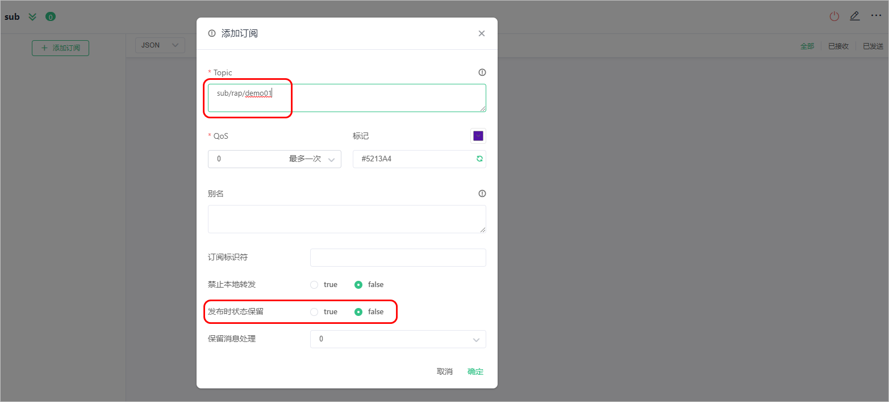 
    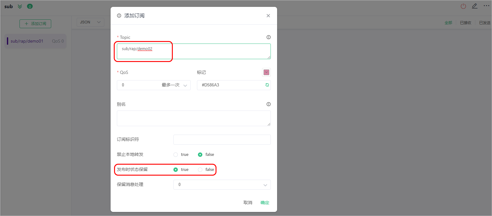 
2. 通过sub客户端连接分别向`sub/rap/demo01`和`sub/rap/demo02`主题发布`保留消息`
     

### Retain Handling
作用：Retain Handling 这个订阅选项被用来向服务端指示当订阅建立时，`是否需要发送保留消息`。
Retain Handling常见取值：
* 0(默认值)：表示只要订阅建立，就发送保留消息；
* 1：表示只有建立全新的订阅而不是重复订阅时，才发送保留消息；
* 2：表示订阅建立时不要发送保留消息；

#### 使用
具体步骤如下所示：
* 情况1：Retain Handling值设置为0
    1. 开启客户端的自动重订阅功能
    2. 创建sub客户端连接(Clean Start值设置为1，并且将Session Expiry Interval设置为300)，并且向`sub/rh/demo`主题中发布一个保留消息
    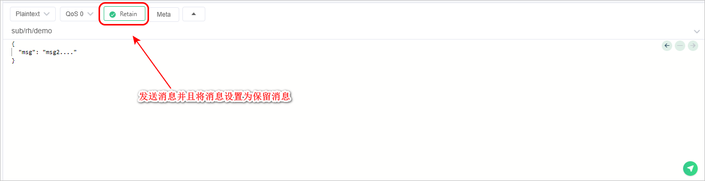 
    3. 在sub客户端连接中，订阅`sub/rh/demo`主题，并且将`Retain Handling的值设置为0`
     
    结果：只要订阅成功了，那么此时立马会收到保留消息
    4. 关闭客户端连接，设置客户端的`Clean Start值设置为0`表示需要复用之间的会话
    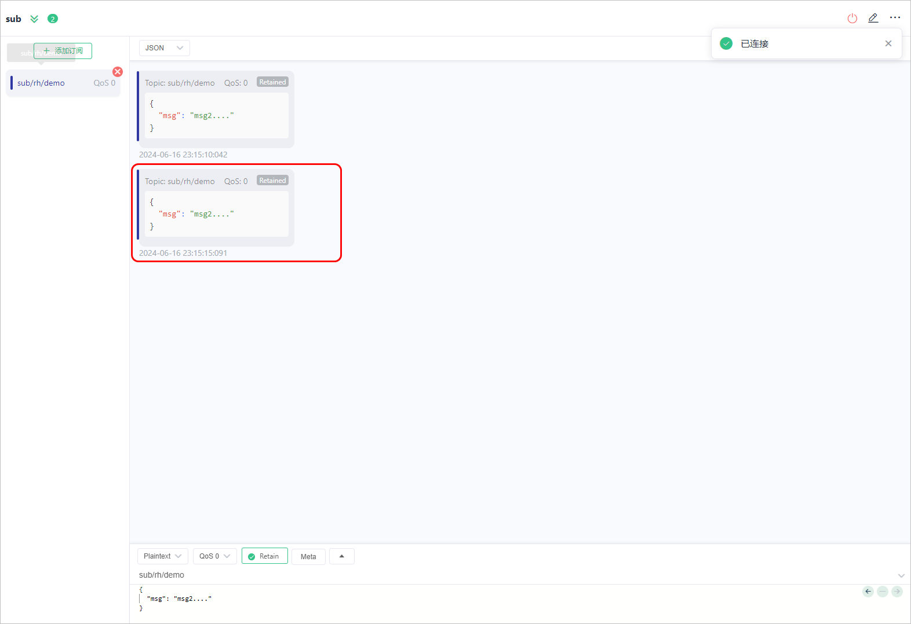 
    注意：只要是重新订阅成功了，那么此时就会收到保留消息

* 情况2：Retain Handling设置为1
    删除sub客户端连接中的订阅，重新订阅`sub/rh/demo`主题，并且将`Retain Handling的值设置为1`，新建立的订阅是可以获取到保留消息的。
    关闭当前连接，重新建立连接【会自动复用之前的订阅】，此时无法获取到保留消息。
* 情况3：Retain Handling设置为2
    删除sub客户端连接中的订阅，重新订阅`sub/rh/demo`主题，并且将`Retain Handling的值设置为2`
     
    结果：即使订阅成功了，那么此时也不会收到保留消息

## 共享订阅
**类似负载均衡**。它使得 MQTT 服务端可以在使用特定订阅的客户端之间均衡地分配消息负载。这表示，当我们有两个客户端共享一个订阅时，那么每个匹配该订阅的消息都只会有一个副本投递给其中一个客户端。 
 
（这里的两个订阅者可以是处理数据的服务，如果其中一个出问题，另一个就会接收所有的消息）

共享订阅不仅为消费端带来了极佳的水平扩展能力，使我们可以应对更**高的吞吐量**，还为其带来了**高可用性**，即使共享订阅组中的一个客户端断开连接或发生故障，其他客户端仍然可以继续处理消息，在必要时还可以接管原先流向该客户端的消息流。

***举个实际例子：***
* 你有 5 台温湿度设备（发布者），持续向 EMQX 的 `iot/sensor/temp` 主题发布数据；
* 你部署了 3 个数据处理服务实例（订阅者 A/B/C），都以共享订阅方式订阅`$share/sensor_group/iot/sensor/temp`（sensor_group是共享组名）；
* 当设备发布 100 条消息到`iot/sensor/temp`时，EMQX 会把这 100 条消息分发给 A/B/C，比如 A 处理 34 条、B 处理 33 条、C 处理 33 条，同一条消息不会被多个订阅者收到，这就是消费端的负载均衡。

### 共享订阅分类
启用共享订阅：为一组订阅者的原始主题添加指定前缀
共享订阅分类：
| 前缀格式     | 示例           | 前缀       | 真实主题名 |
| ------------ | -------------- | ---------- | ---------- |
| 带群组格式   | $share/abc/t/1 | $share/abc | t/1        |
| 不带群组格式 | $queue/t/1     | $queue/    | t/1        |

#### 带群组的共享订阅
可以通过在原始主题前添加 `$share/<group-name>` 前缀为分组的订阅者启用共享订阅。组名可以是任意字符串。EMQX 同时将消息转发给不同的组，属于同一组的订阅者可以使用负载均衡接收消息。

例如，如果订阅者 `s1`、`s2` 和 `s3` 是组 `g1` 的成员，订阅者 `s4` 和 `s5` 是组 `g2` 的成员，而所有订阅者都订阅了原始主题 `t1`。共享订阅的主题是 `$share/g1/t1` 和 `$share/g2/t1`。当 EMQX 发布消息 `msg1` 到原始主题 `t1` 时：

- EMQX 将 `msg1` 发送给 `g1` 和 `g2` 两个组。
- `s1`、`s2`、`s3` 中的一个订阅者将接收 `msg1`。
- `s4` 和 `s5` 中的一个订阅者将接收 `msg1`。

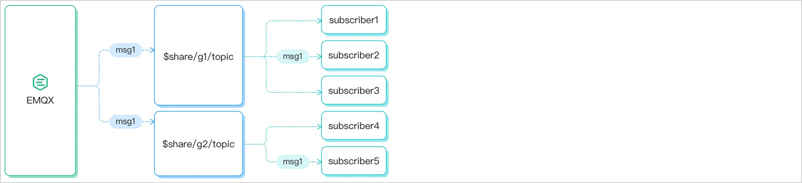 

#### 不带群组的共享订阅
以 `$queue/` 为前缀的共享订阅是不带群组的共享订阅。它是 `$share` 订阅的一种特例。您可以将其理解为所有订阅者都在一个订阅组中：
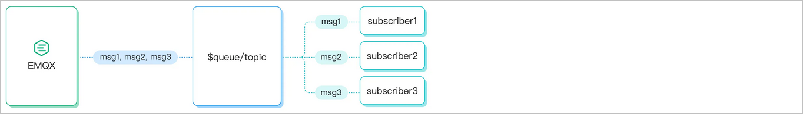 

### 负载均衡算法
在`管理-集群配置-MQTT配置-通用`中可以配置负载均衡算法，默认是`round_robin`。
  
* 随机（Random），在共享订阅组内随机选择一个会话发送消息。
* 轮询（Round Robin），在共享订阅组内按顺序选择一个会话发送消息，循环往复。
* 哈希（Hash），基于某个字段的哈希结果来分配。
* 粘性（Sticky），在共享订阅组内随机选择一个会话发送消息，此后保持这一选择，直到该会话结束再重复这一过程。
* 本地优先（Local），随机选择，但优先选择与消息的发布者处于同一节点的会话，如果不存在这样的会话，则退化为普通的随机策略。

## 排它订阅
排它订阅允许对主题进行互斥订阅，`一个主题同一时刻仅被允许存在一个订阅者，在当前订阅者未取消订阅前，其他订阅者都将无法订阅对应主题。`
要进行排它订阅，您需要为主题名称添加`$exclusive/`前缀，如以下表格中的示例：
| 示例           | 前缀        | 真实主题名 |
| -------------- | ----------- | ---------- |
| $exclusive/t/1 | $exclusive/ | t/1        |
当某个客户端 **A** 订阅 `$exclusive/t/1` 后，其他客户端再订阅 `$exclusive/t/1` 时都会失败，直到 **A** 取消了对 `$exclusive/t/1` 的订阅为止。
**注意**: 排它订阅必须使用 `$exclusive/` 前缀，在上面的示例中，其他客户端依然可以通过 `t/1` 成功进行订阅。

订阅失败的常见错误码：
 

### 使用
默认情况下排它订阅是关闭的。
具体步骤：
1. 创建sub1客户端连接，并且添加`$exclusive/t/1`订阅
    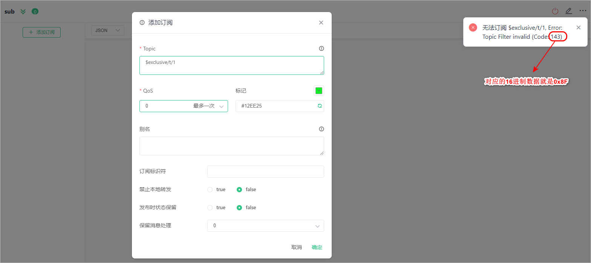 
2. 在Dashboard开启排它订阅配置【管理====>MATT配置】
    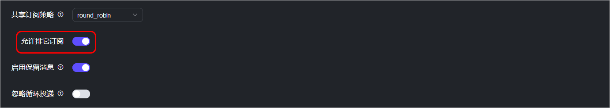 
3. 在sub2客户端连接中重新添加`$exclusive/t/1`订阅
4. 创建sub2客户端连接，并且添加`$exclusive/t/1`订阅
     
5. 创建sub2客户端连接，并且添加`t/1`订阅，此时订阅成功

## 自动订阅
***开源版的 dashboard 中移除了，不过还是可通过对应的 HTTP API 来设置的。***
自动订阅能够给 EMQX 设置多个规则，在设备成功连接后按照规则为其订阅指定主题，不需要额外发起订阅。
### 配置自动订阅规则
通过 Dashboard 配置自动订阅规则：【管理 ====> MQTT高级特性 =====> 自动订阅 ====> 添加】
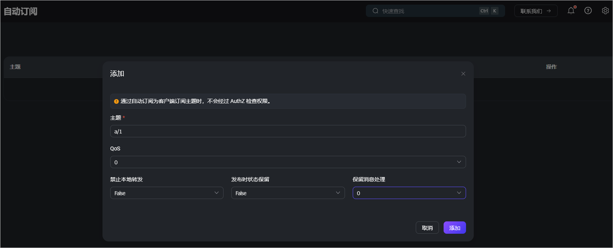 
### 使用
具体步骤：
1. 创建pub客户端连接，作为发布者
2. 创建sub客户端连接，作为订阅者
3. 在pub客户端连接中向a/1主题发布消息
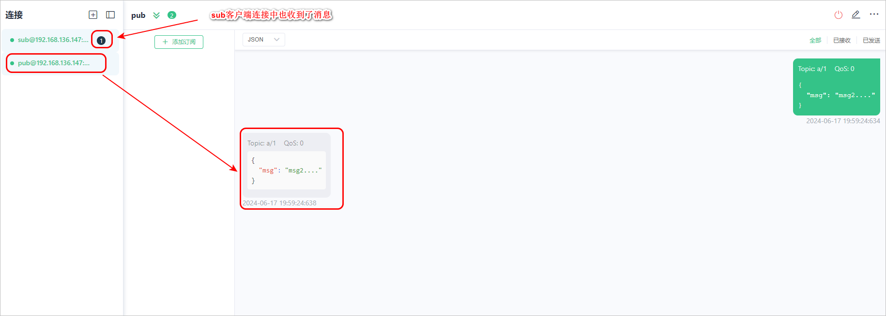 

