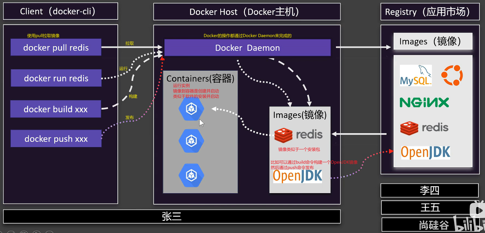
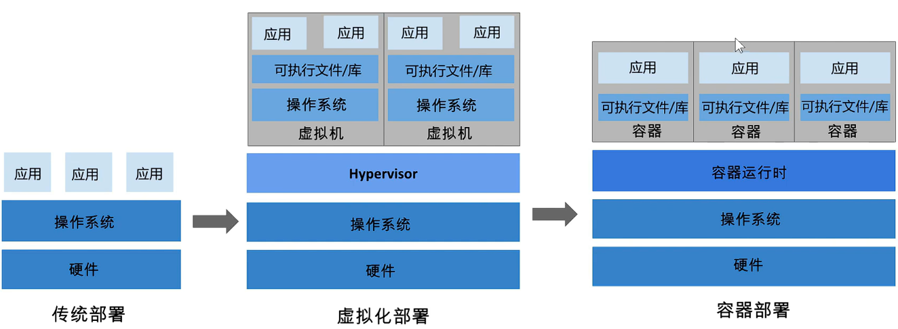
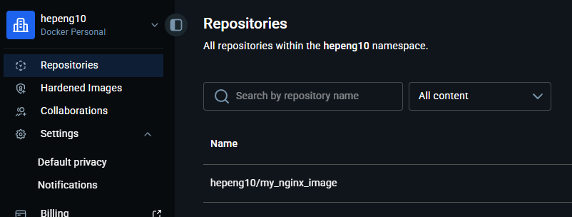
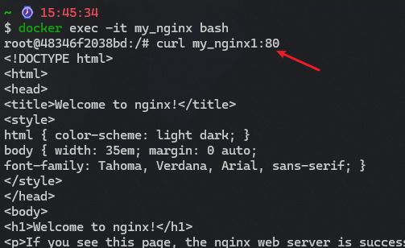
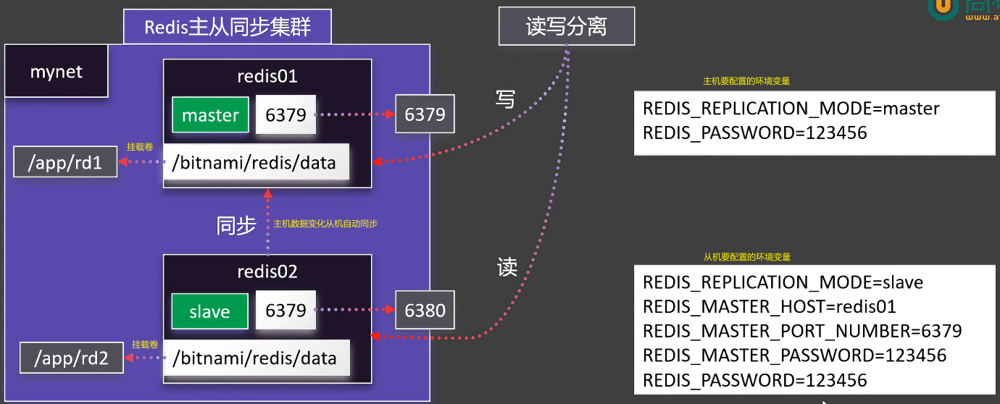

# 什么是docker
Docker 是一个开源的应用容器引擎。通过将**程序及其所有的依赖环境**打包成一个独立的“镜像”（Image），这个镜像可以在任何安装了 Docker 的机器上运行，实现“一次构建，到处运行”。

## 核心概念：

* **镜像 (Image)**：一个只读的模板，包含运行程序所需的所有代码、库和配置。（类似一个包含了所有依赖环境的软件）
* **容器 (Container)**：镜像运行时的实体。镜像好比“类”，容器就是“实例”。你可以启动、停止、删除它。（类似软件运行后产生的进程）
    * 使用`docker run`命令**创建并启动**容器，如果多次运行，会创建多个容器实例。
    * 如果只想启动之前关掉的容器，应该用 docker start [容器ID]
* **仓库 (Repository/Registry)**：存放镜像的地方，最著名的是 [Docker Hub](https://hub.docker.com/)。（类似应用商店、npm仓库）

## docker vs 虚拟机 (VM)
虚拟机是模拟的操作系统（硬件）环境，docker是模拟的应用（软件）环境。

### 1. 层级对比：硬件 vs 操作系统

* **虚拟机 (VM) —— 硬件级虚拟化**：
它在你的物理机上模拟出一套“虚拟硬件”（CPU、内存、磁盘等）。因为有了虚拟硬件，你必须在上面安装一个完整的**客户操作系统 (Guest OS)**。


* **Docker —— 操作系统级虚拟化**：
它不模拟硬件，而是直接利用宿主机的内核，并在其上划分出一个个隔离的区域（容器）。容器里只装你的**应用程序**及其需要的依赖库。

### 2. 关键差异总结
| 特性 | 虚拟机 (VM) | Docker 容器 |
| --- | --- | --- |
| **隔离级别** | **硬件级隔离**（非常安全） | **进程级隔离**（安全，但共享内核） |
| **启动速度** | **分钟级**（需要启动操作系统） | **秒级**（直接启动应用程序） |
| **资源占用** | **大**（每个 VM 都要几十 GB 空间） | **极小**（通常只有几 MB 到几百 MB） |
| **移植性** | 较差（镜像文件巨大） | **极佳**（镜像轻量，到处运行） |
| **运行数量** | 一台电脑运行几个就卡了 | 一台电脑可以轻松运行成百上千个 |

## Docker 的作用
* **环境一致性**：开发、测试、生产环境完全一致，彻底解决环境冲突。
* **快速部署**：容器启动是秒级的，远快于虚拟机（VM）。
* **资源隔离**：每个容器都是相互隔离的，一个容器崩溃不会影响宿主机或其他容器。
* **高效利用资源**：相比虚拟机需要运行完整的操作系统，Docker 容器共享宿主机的内核，非常轻量。

## docker的基本架构
  
  
容器类似轻量级的VM，共享操作系统内核但是拥有自己的文件系统、CPU、内存、进程等。

## 安装docker

### 一、Ubuntu / Debian 安装 Docker（最常见）

适用于：

* Ubuntu 20.04 / 22.04 / 24.04
* Debian 11 / 12

##### 1）更新系统包

```bash
sudo apt update
sudo apt upgrade -y
```

##### 2）安装依赖工具

```bash
sudo apt install -y ca-certificates curl gnupg lsb-release
```

##### 3）添加 Docker 官方 GPG key

```bash
sudo mkdir -p /etc/apt/keyrings
curl -fsSL https://download.docker.com/linux/ubuntu/gpg | \
sudo gpg --dearmor -o /etc/apt/keyrings/docker.gpg
```

##### 4）添加 Docker 官方仓库

```bash
echo \
"deb [arch=$(dpkg --print-architecture) signed-by=/etc/apt/keyrings/docker.gpg] \
https://download.docker.com/linux/ubuntu \
$(lsb_release -cs) stable" | \
sudo tee /etc/apt/sources.list.d/docker.list > /dev/null
```

##### 5）安装 Docker Engine

```bash
sudo apt update
sudo apt install -y docker-ce docker-ce-cli containerd.io
```

##### 6）启动并设置开机自启

```bash
sudo systemctl enable docker
sudo systemctl start docker
```

##### 7）验证安装成功

```bash
docker version
docker run hello-world
```

看到 `Hello from Docker!` 就成功了。

### 二、CentOS / Rocky Linux 安装 Docker

适用于：

* CentOS 7/8
* Rocky Linux 8/9
* AlmaLinux

##### 1）更新系统

```bash
sudo yum update -y
```

##### 2）安装依赖

```bash
sudo yum install -y yum-utils
```

##### 3）添加 Docker 官方 repo

```bash
sudo yum-config-manager --add-repo \
https://download.docker.com/linux/centos/docker-ce.repo
```

##### 4）安装 Docker

```bash
sudo yum install -y docker-ce docker-ce-cli containerd.io
```

##### 5）启动 Docker

```bash
sudo systemctl start docker
sudo systemctl enable docker
```

##### 6）验证

```bash
docker run hello-world
```

### 三、安装完成后建议配置（非常重要）

##### 1）让普通用户也能用 Docker（不用 sudo）

默认只有 root 才能运行 docker。

```bash
sudo usermod -aG docker $USER
```

然后重新登录服务器：

```bash
exit
```

再 SSH 登录回来。

验证：

```bash
docker ps
```

##### 2）配置国内镜像加速（服务器在国内强烈建议）

编辑：

```bash
sudo nano /etc/docker/daemon.json
```

填入：

```json
{
  "registry-mirrors": [
    "https://dockerproxy.com"
  ]
}
```

保存后重启：

```bash
sudo systemctl restart docker
```

### 四、安装 Docker Compose（部署项目必备）

Docker Compose 用来启动多容器服务。

#### 安装 compose 插件

```bash
sudo apt install docker-compose-plugin -y
```

验证：

```bash
docker compose version
```

## 镜像操作
### 下载镜像
* `docker search IMAGE` 搜索镜像
* `docker pull IMAGE[:tag]` 下载镜像。可使用tag指定版本号，默认tag为latest
* `docker images` 查看本地镜像列表
* `docker rmi IMAGE[:tag]|IMAGE_ID` 删除镜像。可使用tag指定版本号，默认tag为latest。也可使用镜像ID删除镜像。

### 启动容器
每个容器有CONTAINER_ID，可使用docker ps -a查看所有容器，包括已停止的容器。**使用CONTAINER_ID时可以不输入完整的ID**，只需要输入前几位即可（1位都行，反正是一个个匹配）。
* `docker run [OPTIONS] IMAGE[:tag] [COMMAND] [ARG...]` 启动容器。
    * 如果没有要运行的镜像，会自动下载。
    * 参数：
        * --name：指定容器名称，如：`docker run --name my_nginx nginx`。**否则是随机名称。**
        * -p：端口映射，如：`docker run -p 8080:80 nginx`。**将主机的8080端口映射到容器的80端口。**
            容器自身是个小型的虚拟机，有自己的端口号，而我们没法直接通过容器的端口号访问，所以要将容器的端口映射到主机的端口，通过访问主机的端口来访问容器服务。
        * -v：挂载卷，如：`docker run -v /host/path:/container/path nginx`。**将主机的目录挂载到容器的目录，即可在主机上操作容器内部的文件。**
        * -d：后台运行，如：`docker run -d nginx`。**将容器在后台运行，不占用当前终端。d是daemon**
        * --network：连接到自定义网络，如：`docker run --network my_network nginx`。
        * -e：设置环境变量，如：`docker run -e MYSQL_ROOT_PASSWORD=123456 mysql`。**通过环境变量将MYSQL_ROOT_PASSWORD设置为123456。**
        * --restart：设置重启策略，如：`docker run --restart always nginx`。**设置容器在退出时自动重启。**
* `docker ps` 查看正在运行的容器列表
    * 参数：
        * -a 查看所有容器，包括已停止的容器。
        * -q 只显示容器ID。quiet的缩写。
* `docker stop CONTAINER_NAME|CONTAINER_ID` 停止容器。
* `docker start CONTAINER_NAME|CONTAINER_ID` 启动容器。stop后的用start，而不是run。
* `docker restart CONTAINER_NAME|CONTAINER_ID` 重启容器。
* `docker stats CONTAINER_NAME|CONTAINER_ID` 查看容器统计信息。
* `docker inspect CONTAINER_NAME|CONTAINER_ID` 查看容器详细信息。
* `docker logs CONTAINER_NAME|CONTAINER_ID` 查看容器日志。
    * `docker logs -f CONTAINER_NAME|CONTAINER_ID` 实时查看容器日志。
* `docker exec -it CONTAINER_NAME|CONTAINER_ID bash` 进入容器。
    如：`docker exec -it my_nginx bash` 进入容器的bash shell。`-it`参数是交互式终端。
    **如果要对docker内部的文件进行操作，更推荐使用docker的存储卷挂载。将主机的目录挂载到容器的目录，即可在主机上操作容器内部的文件。**
* `docker rm CONTAINER_NAME|CONTAINER_ID` 删除容器。
    * 参数：-f 强制删除容器。运行中容器不能直接删除，需要添加-f参数强制删除。
    删除所有容器：`docker rm $(docker ps -aq)`，-aq会得到所有容器的ID。

### 保存镜像
1. `docker commit CONTAINER_NAME|CONTAINER_ID IMAGE[:tag]` 保存容器为镜像。
    * 参数：
        * -a：指定作者，如：`docker commit -a "Roc" my_nginx my_nginx_image:1.0`
        * -m：指定提交信息，如：`docker commit -m "Add feature X" my_nginx my_nginx_image:1.0`
        * -p：暂停容器运行，如：`docker commit -p my_nginx my_nginx_image:1.0`
        上面的参数可以组合使用，如：`docker commit -a "Roc" -m "Add feature X" -p my_nginx my_nginx_image:1.0`。
        将正在运行的容器`my_nginx`保存为镜像`my_nginx_image:1.0`。**镜像名不能使用驼峰式。**
2. `docker save IMAGE[:tag]|IMAGE_ID -o IMAGE.tar` 保存镜像为tar文件。可使用镜像名称或镜像ID保存镜像为tar文件。
    * 如：`docker save my_nginx_image:1.0 -o my_nginx_image.tar`，就会生成一个镜像tar包。
3. `docker load -i IMAGE.tar` 从tar文件加载镜像。
    * 如：`docker load -i my_nginx_image.tar`，就会加载镜像tar包。使用`docker images`查看镜像列表，即可看到加载的镜像。

### 分享社区
先要去[Docker Hub](https://hub.docker.com/)注册账号。注册后创建一个Repository，用于存放镜像。
1. `docker login` 登录Docker Hub。我在Windows上安装了Docker Desktop 并登录了，会自动识别账号登录。Linux上会提示输入账号密码。
2. `docker tag SOURCE_IMAGE[:TAG] TARGET_IMAGE[:TAG]` 给镜像添加tag。tag实际上是Docker Hub上的镜像名称。
    * 如：`docker tag my_nginx_image:1.0 hepeng10/my_nginx_image`，运行后通过`docker images`查看镜像列表，会多出一个镜像`hepeng10/my_nginx_image:latest`，但是它的镜像ID与`my_nginx_image:1.0`相同。
    * 如果要推送到仓库通常会创建两个镜像，一个带[:TAG]版本号的，一个不带的，不带版本号的镜像默认是latest。拉取的时候直接使用镜像名称即可，会自动拉取latest版本；有版本号的可以记录发布历史。
3. `docker push USERNAME/IMAGE[:tag]` 推送镜像到Docker Hub。可使用镜像名称或镜像ID推送镜像。
    * 如：`docker push hepeng10/my_nginx_image`，就会推送镜像`hepeng10/my_nginx_image`到Docker Hub。
      
4. 在Docker Hub上进入镜像，编辑`Repository overview`，添加镜像描述。类似 GitHub 的 `README.md`。

==docker tag 设置的名字，前面的是用户名，必须和Docker Hub上的用户名一致。==

## 挂载卷
挂载卷分为两种：bind mount 和 named volume。
### bind mount
使用`docker exec -it my_nginx bash` 进入容器，但是容器里是很精简的，vim都没有，要修改配置文件就很麻烦。另外容器也可能被删除，删除后修改的配置、容器内存储的数据也会丢失。为了解决这些问题，所以需要使用bind mount。
如：
`docker run -d -p 80:80 -v /dockers/my_nginx/nghtml:/usr/share/nginx/html --name my_nginx nginx`
启动镜像的同时，将主机的`/dockers/my_nginx/nghtml`目录挂载到容器的`/usr/share/nginx/html`目录。
docker内部的`/usr/share/nginx/html`目录就会映射到主机的`/dockers/my_nginx/nghtml`目录。所以之后就在主机上操作`/dockers/my_nginx/nghtml`目录即可。
#### 注意点
1. bind mount时，容器内目录中的文件不会拷贝到挂载目录中（只是目录重映射，类似修改了目录指针的指向，因此即使进入容器访问该目录，也会访问到主机上的目录）。
2. 原本通过nginx能访问容器内的index.html文件，现在bind mount后由于主机目录中没有index.html文件，所以访问不到了。
3. 在主机上新建index.html文件，访问nginx容器便可以访问到了。
4. 容器删除后再新建个容器，我们只需要再次将容器中的目录挂载到主机上的此目录中即可。所以对容器的修改都应该将目录挂载出来进行修改，新的容器重新映射目录即可。
5. 如果容器目录内的文件很重要，那么也可以将其拷贝到主机目录中，如：`docker cp my_nginx:/usr/share/nginx/html/index.html /dockers/my_nginx/nghtml/`。（不必须是挂载目录）
6. 如果是镜像启动必须的文件（如nginx的配置文件），使用bind mount挂载到主机上后，镜像启动时创建容器并启动，但是就会去找主机上的挂载目录，而此时主机目录中没有任何内容，那么就会导致容器启动失败。
    解决办法：
    1. 手动先在主机挂载目录中创建好配置文件。
    2. 编写自动化脚本（如shell脚本），让脚本判断配置文件是否存在，若不存在则创建然后启动容器等操作。
    3. 使用docker compose实现自动化。
    4. 使用下面的named volume。

==bind mount的挂载目录有时会有权限问题，需要注意，对挂载目录进行适当的权限设置。==

#### named volume
**named volume和bind mount的区别：**
1. bind mount是自己新建个任意位置的目录，将容器内的目录映射到此目录上。初始默认为空目录。named volume的主机目录是固定的`/var/lib/docker/volumes/<VOLUME_NAME>`。
2. `-v /xxx:/yyyy`是bind mount，前面的主机目录使用`/`开头的路径。而named volume是`-v VOLUME_NAME:/yyyy`，前面的named volume名称不能使用`/`开头，只能是个名字，会自动创建在`/var/lib/docker/volumes/`目录下。
3. named volume在首次初始化时会将容器内对应目录下的所有文件拷贝到named volume的主机目录中。再次创建时因为有此目录，所以不会再拷贝一次。

**卷相关命令：**
* `docker volume ls` 查看所有named volume。
* `docker volume create VOLUME_NAME` 创建named volume。
* `docker volume inspect VOLUME_NAME` 查看named volume详情。这里也能看具体目录路径
* `docker volume rm VOLUME_NAME` 删除named volume。

#### bind mount和named volume的使用场景对照表
| 使用对象                          | 推荐方式                            | 原因（核心逻辑）                           |
| ----------------------------- | ------------------------------- | ---------------------------------- |
| **开发代码（React/Node/Go）**       | ✅ bind mount                    | 需要频繁修改，主机改动容器立即生效（热更新）             |
| **配置文件（nginx.conf、yaml、ini）** | ✅ bind mount                    | 配置需要人工编辑、git 管理、可追踪版本              |
| **静态资源（开发阶段）**                | ✅ bind mount                    | 经常改动，方便实时预览                        |
| **静态资源（生产阶段）**                | ⚠️镜像内打包 或 bind mount            | 内容固定时打包更安全；需动态更新时用 bind mount      |
| **数据库数据（MySQL/PostgreSQL）**   | ✅ volume                        | 数据非常重要，Docker 管理更稳定，避免权限/损坏问题      |
| **缓存数据（Redis）**               | ✅ volume（持久化需要）                 | Redis dump 文件适合 Docker 管理，容器删了数据还在 |
| **用户上传文件（头像/附件）**             | ✅ volume（生产） / bind mount（简单项目） | volume 更安全；bind mount 方便但易误删       |
| **日志文件（长期保存）**                | ✅ volume 或 bind mount           | volume 易管理；bind mount 便于主机直接查看     |
| **证书文件（SSL certs）**           | ✅ bind mount（只读）                | 属于外部敏感配置，不应写进 volume 或镜像，且要可控      |
| **容器内部自动生成数据**                | ✅ volume                        | 数据由程序产生，不需要人工编辑，volume 最合适         |
| **容器之间共享数据**                  | ✅ volume                        | 多容器共享同一数据目录，volume 更标准可靠           |
| **临时文件（缓存、session）**          | ❌不用 volume，使用 tmpfs             | 临时数据不需要落盘，tmpfs 更快更安全              |

##### 1）需要人工修改的 → bind mount
典型：
* 源代码
* 配置文件
* 证书
原因：
> 你要在宿主机直接编辑它，并且希望立刻生效

##### 2）容器运行产生的数据 → volume
典型：
* MySQL 数据
* Redis dump
* 上传文件存储
* 日志文件
原因：
> 数据必须持久，且不希望宿主机随意干预

简单来说就是需要手动编辑的用bind mount，只作存储的用named volume。**不过不要太教条化，实际上很多公司也将mysql的数据使用bind mount挂载到宿主机上，更方便备份和恢复等。**

==正因为使用的docker镜像如nginx, mysql等都有配置文件、数据存储等需要使用自定义的，所以在它们的镜像使用说明中也会有相关说明。==
==使用 docker commit 不会把宿主机上的文件打包到镜像中。如果需要将宿主机上的修改应用到docker里，可使用 dockerfile 或 docker-compose 等工具，在创建镜像时先复制宿主机上的文件到容器中。==

## docker网络
docker间的网络通信是集群的基础。
docker在安装后会默认创建一个docker0网络，docker会将所有容器都连接到这个网络中。通过`docker inspect <container_name/id>`可以查看容器的网络信息（在`NetworkSettings/Networks`中）。
所以容器间的访问就通过`容器IP + 容器端口`来直接访问，而不是通过`宿主机IP + 映射端口`来访问（这样网络会绕一圈）。
> 但是这样通过ip访问容器的话，比较麻烦，而且容器的ip容易变化，所以不建议使用。可使用docker自定义网络来解决这个问题。

### docker自定义网络
1. 使用命令`docker network create <network_name>`来创建网络，如`docker network create my_network`。
2. 创建网络后启动容器时，使用`--network <network_name>`来指定容器连接到哪个网络，如`docker run -p 8080:80 --name my_nginx -d --network my_network nginx`。
3. 容器间可以直接通过容器名来访问，如再创建一个`my_nginx1`容器，也连接到`my_network`网络中，然后在`my_nginx`容器中执行`curl my_nginx1:80`，即可访问到`my_nginx1`容器的80端口。
      

## docker安装Redis集群
https://www.bilibili.com/video/BV1Zn4y1X7AZ?vd_source=8220e726dcb3a350fd156cea947bd58b&p=15&spm_id_from=333.788.videopod.sections
这里用一台机器安装两个Redis演示，实际上在生产环境中一般会用多台机器来安装Redis集群。
  
* Redis使用docker hub的`bitnami_redis`比官方的更方便，配置起来更简单。具体配置可去docker hub查看。
* Redis分为主机和从机两种角色。通过运行容器时指定**环境变量**`REDIS_REPLICATION_MODE`来指定角色。
* 环境变量通过`-e`来指定，这里以从机为例，如:
    ```bash
    docker run -d -p 6380:6379 \
     #使用的bind mount挂载，实际上可以使用named volume挂载
    -v /app/rd2:/bitnami/redis/data \
     #指定从机角色
    -e REDIS_REPLICATION_MODE=slave \ 
     #配置主机的IP或主机名（在同一个网络中通过容器名访问）
    -e REDIS_MASTER_HOST=redis01 \
     #配置主机的端口号
    -e REDIS_MASTER_PORT_NUMBER=6379 \
     #配置主机的密码（如果有设置密码）
    -e REDIS_MASTER_PASSWORD=123456 \
     #配置从机的密码（自身密码）
    -e REDIS_PASSWORD=123456 \ 
     #连接到自定义网络
    --network my_network \
     #指定容器名
    --name redis02 \
     #使用bitnami/redis镜像
    bitnami/redis
    ```

## docker compose
用于定义和运行多个容器的应用。
### 什么是Docker Compose
#### 1. 核心定义
Docker Compose 是 Docker 官方提供的**多容器编排工具**，基于 YAML 格式的配置文件（`docker-compose.yml`）来描述多个容器的依赖关系、网络、存储、端口等配置，然后通过 `docker-compose` 命令一键管理整个应用集群的生命周期。

#### 2. 核心优势（对比手动 `docker run`）
| 手动 `docker run`                | Docker Compose                          |
|----------------------------------|-----------------------------------------|
| 逐个启动容器，命令冗长易出错     | 一个配置文件定义所有服务，一键启停      |
| 需手动管理容器间网络、依赖关系   | 自动创建专属网络，支持依赖顺序启动      |
| 配置分散在多个命令中，难以维护   | 配置集中在 YAML 文件，版本化管理更方便  |
| 多容器启停/重启操作繁琐          | 单命令操作所有服务（启动/停止/删除）    |

#### 3. 适用场景
- 本地开发环境（前端+后端+数据库+缓存）；
- 测试环境的多容器应用部署；
- 简单的生产环境（复杂生产环境建议用 Kubernetes，但 Compose 也能满足中小规模需求）。

### 使用步骤
以**Nginx + 挂载配置文件** 为例（后续扩展多容器）：

#### 步骤 1：安装 Docker Compose（前提：已安装 Docker）
Docker Compose 是独立工具，先安装（以 Linux 为例，Windows/macOS 安装 Docker 时会自带）：
```bash
# 下载最新版 Compose（可替换版本号，去官网查最新）
sudo curl -L "https://github.com/docker/compose/releases/download/v2.24.6/docker-compose-$(uname -s)-$(uname -m)" -o /usr/local/bin/docker-compose

# 赋予执行权限
sudo chmod +x /usr/local/bin/docker-compose

# 验证安装（显示版本即成功）
docker-compose --version
```

#### 步骤 2：编写 `docker-compose.yml` 配置文件
这是 Compose 的核心，所有容器配置都写在这里。我们基于你之前的 Nginx bind mount 需求，写一个可运行的配置文件：

**第一步：创建项目目录（规范管理）**
```bash
# 创建目录（建议一个应用一个目录）
mkdir -p ~/nginx-compose && cd ~/nginx-compose
# 创建配置目录（后续初始化默认配置）
mkdir -p nginx/conf.d
```

**第二步：编写 `docker-compose.yml`**
在 `~/nginx-compose` 目录下创建该文件，内容如下（带详细注释）：
```yaml
# Compose 文件版本（建议用 3.8，兼容主流 Docker 版本）
version: '3.8'

# 定义所有服务（每个服务对应一个容器）
services:
  # 服务名：nginx（可自定义，比如 web）
  nginx:
    # 使用的镜像
    image: nginx:alpine
    # 容器名（可选，默认是 目录名_服务名_1）
    container_name: nginx-compose
    # 端口映射：宿主机80端口 -> 容器80端口
    ports:
      - "80:80"
    # 挂载配置（bind mount，和你之前的需求一致）
    # 这样的多行写法表示数组
    volumes:
      - ./nginx/nginx.conf:/etc/nginx/nginx.conf:ro
      - ./nginx/conf.d:/etc/nginx/conf.d:ro
    # 重启策略：除非手动停止，否则一直重启（生产环境推荐）
    restart: unless-stopped
    # 网络（可选，Compose 会自动创建默认网络，多容器时有用）
    networks:
      - nginx-network

# 定义网络（可选，显式定义更清晰）
networks:
  nginx-network:
    driver: bridge
```

#### 步骤 3：初始化 Nginx 配置文件（避免启动失败）
参考你之前的问题，先从镜像拷贝默认配置到宿主机挂载目录：
```bash
# 拷贝 nginx.conf
docker run --rm -v ~/nginx-compose/nginx:/tmp nginx:alpine cp /etc/nginx/nginx.conf /tmp/
# 拷贝 conf.d 下的默认配置
docker run --rm -v ~/nginx-compose/nginx/conf.d:/tmp/conf.d nginx:alpine cp -r /etc/nginx/conf.d/* /tmp/conf.d/
```

#### 步骤 4：使用 Compose 命令管理容器
所有操作都在 `docker-compose.yml` 所在目录执行，核心命令如下：

| 命令                          | 作用                                  |
|-------------------------------|---------------------------------------|
| `docker-compose up -d`        | 后台启动所有服务（-d 表示后台运行）   |
| `docker-compose ps`           | 查看当前 Compose 管理的容器状态      |
| `docker-compose logs -f nginx`| 实时查看 Nginx 容器日志（-f 实时刷新）|
| `docker-compose restart nginx`| 重启 Nginx 服务                       |
| `docker-compose stop`         | 停止所有服务（容器不删除）            |
| `docker-compose down`         | 停止并删除所有容器、网络（数据卷保留）|
| `docker-compose down -v`      | 停止并删除容器、网络、数据卷（谨慎用）|

默认会使用目录中的 `docker-compose.yml` 文件，也可以使用 `-f` 指定其他文件如`docker-compose -f custom.yml up -d`。

**实操示例**：
```bash
# 启动服务（后台运行）
docker-compose up -d

# 查看状态（显示 nginx 容器为 Up 即成功）
docker-compose ps

# 修改宿主机配置后，重启 Nginx
docker-compose restart nginx

# 停止服务（保留容器）
docker-compose stop

# 彻底清理（停止+删除容器）
docker-compose down
```

#### 步骤 5：扩展：多容器示例（Nginx + MySQL）
Compose 的核心价值是管理多容器，比如给 Nginx 搭配 MySQL 服务，只需在 `docker-compose.yml` 中新增服务：
```yaml
version: '3.8'

services:
  # Nginx 服务
  nginx:
    image: nginx:alpine
    container_name: nginx-compose
    ports:
      - "80:80"
    volumes:
      - ./nginx/nginx.conf:/etc/nginx/nginx.conf:ro
      - ./nginx/conf.d:/etc/nginx/conf.d:ro
    restart: unless-stopped
    networks:
      - app-network
    # 依赖 MySQL，确保先启动 MySQL 再启动 Nginx
    depends_on:
      - mysql

  # MySQL 服务
  mysql:
    image: mysql:8.0
    container_name: mysql-compose
    ports:
      - "3306:3306"
    # 环境变量（设置 root 密码、字符集等）
    environment:
      - MYSQL_ROOT_PASSWORD=123456
      - MYSQL_DATABASE=test_db
      - MYSQL_CHARSET=utf8mb4
    # 数据卷（持久化 MySQL 数据）
    volumes:
      - mysql-data:/var/lib/mysql
      - ./mysql/conf.d:/etc/mysql/conf.d:ro
    restart: unless-stopped
    networks:
      - app-network

# 定义数据卷（持久化 MySQL 数据）
# mysql配置项里的volumes使用的名为mysql-data的named volume，所以还要在这里声明一下
volumes:
  mysql-data:

# 统一网络（让 Nginx 和 MySQL 能互相访问）
networks:
  app-network:
    driver: bridge
```
执行 `docker-compose -f docker-compose.yml up -d` 即可一键启动 Nginx + MySQL，两个容器在同一网络下，Nginx 容器内可通过 `mysql`（服务名）访问 MySQL 服务（无需记 IP）。

### 其它操作
* 当修改了 `docker-compose.yml` 文件后，需要执行 `docker-compose up -d` 才能生效。会自动检测到配置变化并只更新有变化的容器。
* 删除容器时删除镜像、数据卷（谨慎用）：`docker-compose down --rmi all -v`

### kubernetes
单来说，Compose 是轻量级的“单机多容器管理工具”，而 K8s 是企业级的“分布式容器集群管理平台”，核心差异可以总结为：**小场景用 Compose，大场景用 K8s**。

#### 一、核心维度对比（一目了然）
| 对比维度                | Docker Compose                          | Kubernetes (K8s)                          |
|-------------------------|-----------------------------------------|-------------------------------------------|
| 核心定位                | 单机/单节点多容器编排工具               | 分布式容器集群管理平台（跨节点）          |
| 部署规模                | 小规模（几~几十个容器，单节点）         | 大规模（上百/上千容器，多节点集群）       |
| 节点支持                | 仅支持单节点（Docker 所在主机）         | 支持多节点集群（主节点+工作节点）         |
| 核心能力                | 容器启停、依赖管理、基础网络/挂载       | 调度、自愈、扩缩容、滚动更新、负载均衡、故障转移 |
| 自愈能力                | 仅简单重启（依赖 `restart` 策略）       | 自动重启故障容器、调度到健康节点、替换异常容器 |
| 扩缩容                  | 手动扩容（无自动化，易出端口冲突）      | 自动扩缩容（HPA）、一键调整副本数        |
| 发布策略                | 硬重启（服务短暂中断）                  | 滚动更新/蓝绿发布/金丝雀发布（无中断）    |
| 学习成本                | 低（YAML 简单，命令少）                 | 高（概念多：Pod/Deployment/Service 等）  |
| 适用场景                | 开发/测试、小规模生产（单节点）         | 中大型生产、高可用/高并发、跨节点部署     |

#### 二、核心区别拆解（新手易理解）
##### 1. 定位：“单机管家” vs “分布式操作系统”
- **Docker Compose**：
  专为**单节点**设计，你可以把它理解成“帮你管理一台电脑上多个容器的管家”——所有容器都运行在同一个 Docker 主机上，核心目标是**简化单节点多容器的启动/停止**，比如本地开发时的 Nginx + MySQL + 后端服务，用 Compose 一键启停，不用逐个敲 `docker run`。
  它没有任何集群管理能力，容器只能跑在当前主机上，主机宕机则所有容器停摆。

- **K8s**：
  专为**多节点集群**设计，是“管理几十/几百台服务器的分布式容器操作系统”——它能把多台服务器组成一个“集群”，智能调度容器到任意节点运行，还能自动处理容器故障、分配资源、均衡负载。
  核心目标是**让容器在大规模集群中稳定、高可用地运行**，比如电商平台的核心服务，需要跨服务器部署、故障自动转移、高峰期自动扩容。

##### 2. 核心能力：“够用就好” vs “极致稳定”
举两个新手最易感知的例子：
- **自愈能力**：
  若你的 Nginx 容器意外崩溃：
  - Compose：只能按 `restart: unless-stopped` 策略重启容器，但如果运行容器的服务器宕机，容器就彻底停了，服务中断；
  - K8s：不仅会自动重启 Nginx 容器，若服务器宕机，K8s 还会把 Nginx 调度到集群中其他健康的服务器上，服务几乎无感知。

- **发布更新**：
  若你要更新 Nginx 版本：
  - Compose：只能先 `docker-compose stop` 停掉旧容器，再启动新容器，服务会短暂中断；
  - K8s：支持**滚动更新**——逐个替换旧容器（先启动新容器，确认正常后再删除旧容器），全程服务不中断；还能支持“蓝绿发布”（新老版本同时运行，按需切换流量）、“金丝雀发布”（只把10%流量切到新版本，验证无误后全量切换）。

##### 3. 复杂度：“开箱即用” vs “需要搭建集群”
- Compose：安装简单（Linux 一条命令，Windows/macOS 随 Docker 自带），YAML 配置只有十几个核心字段，学会 `up/down/restart` 几个命令就能用，新手半小时上手；
- K8s：需要先搭建集群（至少1主2从节点），涉及节点网络、证书、调度策略等复杂配置，还有 Pod、Deployment、Service、Ingress 等几十个核心概念，新手通常需要1~2周才能入门，中小团队还需考虑运维成本（比如监控、日志、备份）。

#### 三、场景选择（帮你选对工具）
##### 优先选 Docker Compose 的情况：
1. **本地开发/测试环境**：比如你在自己电脑上开发一个需要 Nginx + MySQL 的网站，用 Compose 一键启动所有依赖，改配置后重启也方便；
2. **小规模生产环境**：单台服务器就能承载业务（比如个人博客、小公司内部系统），对服务中断的容忍度高（比如半夜维护重启）；
3. **快速验证想法**：想快速搭一个多容器应用验证可行性，不想花时间搭建复杂集群。

##### 考虑选 K8s 的情况：
1. **业务规模大**：单台服务器扛不住，需要多台服务器分担压力；
2. **高可用要求**：服务不能中断（比如电商、金融类业务），需要故障自动转移；
3. **弹性扩缩容**：业务流量波动大（比如电商大促、直播带货），需要自动扩容容器，高峰期过了再自动缩容节省资源；
4. **跨节点/跨机房部署**：需要把服务分布在多台服务器甚至多个机房，保证容灾。

## dockerfile
用于制作镜像。
### 一、Dockerfile 是什么？
#### 1. 核心定义
Dockerfile 是描述镜像构建过程的**指令集文件**，每一条指令对应镜像的一层（Docker 镜像的分层特性），Docker 会按指令顺序执行，最终生成一个可复用的镜像。
- 类比：把 Dockerfile 看作“做饭的菜谱”，指令就是“洗菜→切菜→下锅→调味”等步骤，最终做出的“菜”就是 Docker 镜像。
- 特点：
  - 纯文本文件，无后缀（命名为 `Dockerfile` 即可）；
  - 指令大小写不敏感，但行业惯例用**大写**（区分指令和参数）；
  - 从上到下顺序执行，每一条指令生成一层镜像（可缓存，加速后续构建）。

#### 2. 为什么需要 Dockerfile？
手动通过 `docker run` 进入容器安装软件、配置环境，只能得到临时的容器，无法复用；而 Dockerfile 能把“安装、配置、启动”的全过程**代码化、标准化**，任何人拿到 Dockerfile，都能构建出完全一致的镜像，实现“一次编写，处处构建”。

### 二、Dockerfile 核心指令（新手必学）
先掌握这些高频指令，就能覆盖 90% 的前端/通用场景，每个指令都结合前端场景解释：

| 指令         | 作用                                                                 | 前端场景示例                          |
|--------------|----------------------------------------------------------------------|---------------------------------------|
| `FROM`       | 指定**基础镜像**（必须是第一个非注释指令），所有构建都基于基础镜像     | `FROM node:18-alpine`（前端构建）、`FROM nginx:alpine`（前端部署） |
| `WORKDIR`    | 设置容器内的工作目录（类比 `cd` 命令），后续指令都在此目录执行        | `WORKDIR /app`（前端项目根目录）      |
| `COPY`       | 把宿主机文件/目录拷贝到镜像中（核心：只拷贝，不解压/不下载）          | `COPY package.json ./`（拷贝包配置）、`COPY dist/ /usr/share/nginx/html`（拷贝前端打包产物） |
| `RUN`        | 在构建镜像时执行命令（比如安装依赖、编译代码）                       | `RUN npm install`（装前端依赖）、`RUN npm run build`（打包前端代码） |
| `CMD`        | 容器启动时执行的默认命令（可被 `docker run` 命令覆盖）               | `CMD ["npm", "run", "dev"]`（前端开发启动）、`CMD ["nginx", "-g", "daemon off;"]`（启动 Nginx） |
| `EXPOSE`     | 声明容器要暴露的端口（仅“文档说明”，不实际映射，需 `docker run -p` 映射） | `EXPOSE 80`（Nginx端口）、`EXPOSE 5173`（Vite开发端口） |
| `ENV`        | 设置环境变量（构建/容器运行时都生效）                                | `ENV NODE_ENV=production`、`ENV VITE_API_URL=http://api.example.com` |
| `COPY --from`| 多阶段构建时，从其他构建阶段拷贝文件（前端核心用法）                  | `COPY --from=builder /app/dist /usr/share/nginx/html`（从构建阶段拷贝打包产物） |

### 三、Dockerfile 配置步骤（前端项目实战）
以**前端项目构建+部署**为例（最典型的前端 Dockerfile 场景），一步步教你配置：

#### 步骤 1：创建 Dockerfile 文件
在前端项目根目录下新建文件，命名为 `Dockerfile`（无后缀），比如 Vue/React/Vite 项目结构：
```
your-frontend-project/
├── Dockerfile       # 新建的Dockerfile
├── package.json     # 项目依赖
├── vite.config.js   # 构建配置
└── nginx.conf       # 自定义Nginx配置（可选）
```

#### 步骤 2：编写 Dockerfile（前端多阶段构建）
前端项目的最佳实践是「多阶段构建」：先用 Node 镜像打包代码，再用 Nginx 镜像部署（最终镜像只保留 Nginx + 静态资源，体积极小）。
```dockerfile
# ===================== 阶段1：构建前端代码（Node环境） =====================
# 指定基础镜像：用Node 18的alpine版本（轻量，体积约100MB）
FROM node:18-alpine AS builder

# 设置工作目录（容器内的/app目录，不存在会自动创建）
WORKDIR /app

# 先拷贝包管理文件（package.json + package-lock.json），利用Docker缓存
# 原因：依赖不会频繁改，这一步的缓存能避免每次改代码都重新npm install
COPY package.json package-lock.json ./

# 安装项目依赖（Alpine镜像可能需要装git，前端依赖若依赖git需加：RUN apk add --no-cache git）
RUN npm install

# 拷贝整个项目代码到工作目录
COPY . .

# 执行打包命令（根据你的项目调整，比如npm run build:prod）
RUN npm run build

# ===================== 阶段2：部署静态资源（Nginx环境） =====================
# 指定部署用的基础镜像：Nginx alpine版本（体积约20MB）
FROM nginx:alpine

# 从“builder”阶段拷贝打包后的dist目录到Nginx默认静态资源目录
# Nginx默认会读取/usr/share/nginx/html下的index.html
COPY --from=builder /app/dist /usr/share/nginx/html

# （可选）拷贝自定义Nginx配置（比如反向代理、跨域、gzip等）
# 替换Nginx默认配置文件
COPY nginx.conf /etc/nginx/conf.d/default.conf

# 声明暴露80端口（只是文档，实际映射需docker run -p）
EXPOSE 80

# 容器启动时执行的命令：启动Nginx（前台运行，避免容器退出）
CMD ["nginx", "-g", "daemon off;"]
```

##### 编写`.dockerignore`文件（可选）
为了避免把本地开发环境的文件（如 `node_modules`、`dist`）也打包进镜像，在项目根目录下新建 `.dockerignore` 文件：
```dockerfile
# 核心：排除本地node_modules
node_modules/

# 排除前端打包产物（构建阶段会重新打包，无需拷贝）
dist/
build/

# 排除版本控制文件
.git/

# 排除编辑器配置、日志等无关文件
.vscode/
.idea/
npm-debug.log
yarn-error.log

# 排除Docker相关文件（避免循环拷贝）
Dockerfile
docker-compose.yml
.dockerignore
```

#### 步骤 3：补充自定义 Nginx 配置（可选）
如果前端需要反向代理后端接口（解决跨域），新建 `nginx.conf`：
```nginx
server {
    listen 80;
    server_name localhost;

    # 静态资源路径（对应Nginx镜像的目录）
    root /usr/share/nginx/html;
    index index.html;

    # 前端路由刷新404问题（Vue/React Router history模式）
    location / {
        try_files $uri $uri/ /index.html;
    }

    # 反向代理后端接口（解决跨域）
    location /api/ {
        proxy_pass http://your-backend-server:8080/; # 替换为你的后端地址
        proxy_set_header Host $host;
        proxy_set_header X-Real-IP $remote_addr;
    }

    # 开启gzip压缩（优化加载速度）
    gzip on;
    gzip_types text/plain text/css application/json application/javascript text/xml application/xml application/xml+rss text/javascript;
}
```

#### 步骤 4：构建镜像 & 运行容器
##### 1. 构建镜像
在 Dockerfile 所在目录执行命令（`.` 表示“当前目录”是构建上下文）：
```bash
# 构建镜像，命名为my-frontend，标签为v1（可自定义）
docker build -t my-frontend:v1 .
```
- 第一次构建会下载基础镜像（Node、Nginx），后续构建会利用缓存，速度极快；
- 构建完成后，执行 `docker images` 可看到 `my-frontend:v1` 镜像（体积仅 ~20MB，因为只保留了 Nginx 层）。

##### 2. 运行容器
```bash
# 启动容器，映射宿主机80端口到容器80端口
docker run -d -p 80:80 --name frontend-app my-frontend:v1
```
- `-d`：后台运行；
- `-p 80:80`：宿主机80端口 → 容器80端口；
- `--name frontend-app`：给容器命名，方便管理。

##### 3. 验证
访问 `http://你的服务器IP`，就能看到前端项目页面；若要停止容器，执行：
```bash
docker stop frontend-app
docker rm frontend-app
```

### 四、Dockerfile 配置技巧（新手避坑）
1. **利用缓存加速构建**：
   - 把不常变的指令（`FROM`、`COPY package.json`、`RUN npm install`）放在前面，常变的（`COPY . .`、`RUN npm run build`）放在后面；
   - 前端项目可忽略 `node_modules` 拷贝（构建时用容器内的 `node_modules`），避免本地依赖污染镜像。

2. **减小镜像体积**：
   - 优先用 `alpine` 版本的基础镜像（体积是完整版的 1/10）；
   - 多阶段构建只保留最终运行需要的层（比如前端只保留 Nginx + dist，删除 Node 构建层）；
   - `RUN` 指令合并（比如 `RUN apk update && apk add nginx && rm -rf /var/cache/apk/*`），减少镜像层数。

3. **前端开发环境适配**：
   若用 Dockerfile 做开发环境（而非生产部署），需用 `bind mount` 挂载代码（热更新），示例简化 Dockerfile：
   ```dockerfile
   FROM node:18-alpine
   WORKDIR /app
   COPY package*.json ./
   RUN npm install
   EXPOSE 5173
   CMD ["npm", "run", "dev"]
   ```
   配合 `docker run` 挂载代码：
   ```bash
   docker run -d -p 5173:5173 -v ./:/app -v /app/node_modules my-frontend-dev
   ```
   `-v /app/node_modules`：避免本地 `node_modules` 覆盖容器内的依赖（解决跨系统依赖兼容问题）。
