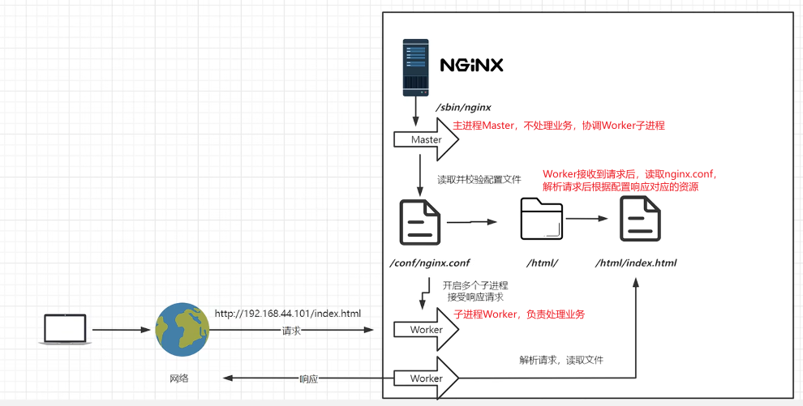

## nginx版本
* Nginx开源版：http://nginx.org，教程里常见的就是这个版本，但是功能较少，实际项目中更推荐Openresty或Tengine。
* Nginx plus 商业版：https://www.nginx.com，需要购买许可证，功能更加强大
* Openresty（开源）：http://openresty.org，和LuaJIT整合，提供了更多的功能。如果要做更多的定制，这个版本是比较好的选择。
* Tengine（开源）：http://tengine.taobao.org/，阿里定制的版本，天猫、淘宝都在使用

## 目录结构
* `/usr/local`类似于Windows的`C:\Program Files`，应用一般安装在此目录下。所以Nginx的安装目录一般是`/usr/local/nginx`。
* `/usr/local/nginx/conf`：Nginx的配置文件目录。
* `/usr/local/nginx/html`：Nginx的默认网站根目录。一般都会修改为项目的根目录。
* `/usr/local/nginx/logs`：Nginx的日志目录。要注意日志会不断变大，时不时的检查一下。
    * `access.log`：访问日志文件。
    * `error.log`：错误日志文件。
* `/usr/local/nginx/sbin`：Nginx的可执行文件目录。

==docker里的目录结构有所不同。==

## 基本处理流程
  

## 基础配置
```nginx
# Worker进程数（性能调优时一般配置为CPU核心数）
worker_processes auto;

# events模块
events {
    # 每个Worker进程最大连接数（一般不用调）
    worker_connections 1024;
}

# http模块
http {
    # 引入MIME类型，根据http请求的文件类型设置Content-Type响应头（可以打开mime.types文件查看/编辑）
    include       mime.types;
    # 默认MIME类型（如果请求的文件类型不在mime.types中，就用这个）
    default_type  application/octet-stream;

    # 开启sendfile（数据零拷贝），用于静态文件传输（可以提升性能）
    sendfile        on;

    # 长连接超时时间（单位：秒），默认65秒
    keepalive_timeout  65;

    # server模块（虚拟主机，可以配置多个）
    server {
        # 监听端口（默认80）
        listen       80;
        listen  [::]:80;
        # 服务器名称（可以配置域名、主机名）
        server_name  localhost;

        # location模块（处理请求路径），这里是根路径/
        location / {
            # 网站根目录
            root   /usr/share/nginx/html;
            # 默认首页文件
            index  index.html index.htm;
        }

        # 错误页面配置（500、502、503、504错误时返回50x.html）
        error_page   500 502 503 504  /50x.html;
        # 错误页面的location配置
        location = /50x.html {
            root   /usr/share/nginx/html;
        }

    }

    # 引入其他配置文件（可以在conf.d目录下添加自定义配置）
    include /etc/nginx/conf.d/*.conf;
}
```
### 完整的 Nginx 基础配置示例（可直接使用）
以下是一个包含「静态网站 + 反向代理」的完整基础配置，注释详细，适合新手参考：
```nginx
# 全局块
user nginx;                    # 运行用户
worker_processes auto;         # 工作进程数（自动匹配CPU核心）
error_log /var/log/nginx/error.log error; # 错误日志（级别error，减少日志量）
pid /var/run/nginx.pid;        # PID文件

# events块
events {
    worker_connections 65535;  # 单个进程最大连接数
    use epoll;                 # Linux高性能事件模型
    multi_accept on;           # 允许同时接受多个连接
}

# http块
http {
    include /etc/nginx/mime.types;      # 引入MIME类型
    default_type application/octet-stream; # 未知类型默认二进制流

    # 自定义访问日志格式
    log_format main '$remote_addr - $remote_user [$time_local] "$request" '
                    '$status $body_bytes_sent "$http_referer" '
                    '"$http_user_agent" "$http_x_forwarded_for"';
    access_log /var/log/nginx/access.log main; # 访问日志

    # 性能优化基础配置
    sendfile on;               # 开启零拷贝
    tcp_nopush on;             # 合并数据包发送
    tcp_nodelay on;            # 减少延迟
    keepalive_timeout 65;      # 长连接超时时间
    keepalive_requests 100;    # 单个长连接最大请求数

    # Gzip压缩（提升传输效率）
    gzip on;
    gzip_vary on;
    gzip_min_length 1024;      # 小于1k的文件不压缩
    gzip_types text/plain text/css application/json application/javascript text/xml application/xml application/xml+rss text/javascript;

    # 虚拟主机1：静态网站（example.com）
    server {
        listen 80;
        server_name example.com www.example.com; # 匹配的域名
        root /var/www/example.com;               # 网站根目录
        index index.html index.htm;              # 默认首页

        # 匹配根路径，处理静态资源
        location / {
            try_files $uri $uri/ =404; # 查找静态文件，找不到返回404
            expires 7d;                # 静态资源缓存7天（减轻服务器压力）
        }

        # 自定义404页面
        error_page 404 /404.html;
        location = /404.html {
            root /var/www/example.com;
        }

        # 禁止访问隐藏文件（如 .htaccess）
        location ~ /\.ht {
            deny all;
        }
    }

    # 虚拟主机2：反向代理（api.example.com）
    server {
        listen 80;
        server_name api.example.com;

        # 代理/api路径到后端服务
        location /api/ {
            proxy_pass http://127.0.0.1:8080/; # 注意末尾的/：转发后去掉/api/前缀
            proxy_set_header Host $host;       # 传递主机名
            proxy_set_header X-Real-IP $remote_addr; # 传递客户端真实IP
            proxy_set_header X-Forwarded-For $proxy_add_x_forwarded_for; # 传递IP链
            proxy_connect_timeout 30s;         # 连接超时时间
            proxy_send_timeout 30s;            # 发送超时时间
            proxy_read_timeout 30s;            # 读取超时时间
        }
    }
}
```

### 核心配置块与关键指令详解
#### 1. 全局块（最外层）
全局块是 Nginx 配置的最顶层，控制 Nginx 进程的基础运行参数，核心指令如下：
| 指令 | 作用 | 推荐值/说明 |
|------|------|-------------|
| `user nginx;` | 指定运行 Nginx 工作进程的用户/组 | 生产环境建议用非 root 用户（如 nginx），避免权限过大 |
| `worker_processes auto;` | 工作进程数 | 推荐设为 `auto`（自动等于 CPU 核心数），或手动设为 CPU 核心数（如 4），最大化利用多核 |
| `error_log /var/log/nginx/error.log warn;` | 错误日志路径与级别 | 级别：debug < info < notice < warn < error < crit，生产环境建议 warn/error |
| `pid /var/run/nginx.pid;` | Nginx 主进程 PID 文件路径 | 固定路径即可，无需修改 |

#### 2. events 块（网络连接配置）
仅负责网络连接相关配置，不涉及业务逻辑，核心指令：
| 指令 | 作用 | 推荐值 |
|------|------|--------|
| `worker_connections 1024;` | 单个工作进程的最大并发连接数 | 生产环境可设为 65535（需配合系统内核参数调整） |
| `use epoll;` | 指定事件驱动模型 | Linux 系统用 `epoll`（性能最优），BSD 用 `kqueue` |
| `multi_accept on;` | 允许单个进程同时接受多个新连接 | 开启（on）提升并发效率 |

#### 3. http 块（HTTP 服务通用配置）
所有 HTTP/HTTPS 服务的公共配置，指令会被所有 server 块继承，核心指令：
| 指令 | 作用 | 推荐配置 |
|------|------|----------|
| `include /etc/nginx/mime.types;` | 引入 MIME 类型映射（如 .html 对应 text/html） | 必须包含，否则静态资源无法正确识别 |
| `default_type application/octet-stream;` | 未知类型文件的默认 MIME 类型 | 固定值即可 |
| `sendfile on;` | 开启零拷贝（直接从磁盘到网络，跳过用户态） | 开启（on）提升静态资源传输效率 |
| `tcp_nopush on;` | 开启 TCP 推送（合并数据包发送） | 需配合 sendfile on 使用 |
| `keepalive_timeout 65;` | HTTP 长连接超时时间 | 65 秒（平衡连接复用与资源占用） |
| `gzip on;` | 开启 Gzip 压缩 | 开启，可配合 `gzip_types text/html text/css application/json;` 指定压缩类型 |
| `log_format` | 自定义访问日志格式 | 示例见上方结构，核心变量：$remote_addr（客户端IP）、$status（响应状态码）、$request（请求行） |
| `access_log` | 访问日志路径与格式 | 示例：`access_log /var/log/nginx/access.log main;`（main 对应 log_format 定义的格式） |

#### 4. server 块（虚拟主机配置）
一个 server 块对应一个「虚拟主机」（可理解为一个网站），核心指令：
| 指令 | 作用 | 示例/说明 |
|------|------|-----------|
| `listen 80;` | 监听端口 | 可指定 IP+端口：`listen 192.168.1.100:80;`，HTTPS 用 `listen 443 ssl;` |
| `server_name example.com www.example.com;` | 匹配的域名 | 支持多个域名（空格分隔）、通配符（*.example.com）、正则（~^www\.example\.\w+$） |
| `root /usr/share/nginx/html;` | 网站根目录 | 静态资源的存放路径（如 /var/www/html） |
| `index index.html index.htm index.php;` | 默认首页 | 访问域名根路径时，优先查找的文件 |
| `error_page 404 /404.html;` | 自定义错误页面 | 示例：`error_page 500 502 503 504 /50x.html;` |

#### 5. location 块（URL 路径匹配配置）
Nginx 最灵活的配置块，用于匹配请求的 URL 路径并执行对应逻辑，核心规则：
##### （1）匹配优先级（从高到低）
1. 精准匹配：`location = /path`（仅匹配 /path，优先级最高）
2. 前缀匹配：`location ^~ /path`（优先匹配，不执行正则）
3. 正则匹配：`location ~ /path`（区分大小写）/ `location ~* /path`（不区分大小写）
4. 普通前缀匹配：`location /path`（按长度匹配，最长的优先）
5. 通用匹配：`location /`（匹配所有未命中的路径）

##### （2）核心指令
| 指令 | 作用 | 示例 |
|------|------|------|
| `root /var/www/html;` | 静态资源根目录 | 请求 /static/css/style.css → 实际路径 /var/www/html/static/css/style.css |
| `alias /var/www/static/;` | 路径重命名（与 root 区别） | location /static/ { alias /var/www/static/; } → /static/a.css → /var/www/static/a.css |
| `proxy_pass http://127.0.0.1:8080;` | 反向代理（转发请求） | 把 /api/ 路径的请求转发到后端 8080 端口 |
| `try_files $uri $uri/ =404;` | 静态资源查找规则 | 先找 $uri（如 /index.html），再找 $uri/（目录），都找不到返回 404 |

### 配置验证与重载
配置完成后，必须先验证语法正确性，再重载配置（无需重启Nginx）：
```bash
# 1. 验证配置语法（关键！配置错误会导致Nginx无法启动）
nginx -t

# 输出如下表示配置正确：
# nginx: the configuration file /etc/nginx/nginx.conf syntax is ok
# nginx: configuration file /etc/nginx/nginx.conf test is successful

# 2. 重载配置（平滑重启，不中断现有连接）
nginx -s reload

# 其他常用命令
nginx -s stop    # 强制停止Nginx
nginx -s quit    # 优雅停止Nginx（处理完现有连接后停止）
systemctl restart nginx # 系统服务方式重启（CentOS/Ubuntu通用）
```

## 虚拟主机
一台物理主机如果只运行一个网站，如果这个网站的流量不大，那么就造成了资源浪费。所以将物理主机划分成多个虚拟主机，每个虚拟主机运行一个网站，这样就可以充分利用物理主机的资源。

虚拟主机（Virtual Host）是**在一台物理服务器上，通过软件逻辑划分出多个“独立网站空间”**，让多个域名/网站共享服务器的 CPU、内存、硬盘等硬件资源，同时彼此隔离、互不干扰——简单说，就是“一台服务器，跑多个网站”。

它是 Web 服务器（如 Nginx、Apache）的核心功能，解决了“单服务器只能部署一个网站”的资源浪费问题，是中小网站、个人站点的主流部署方式。

### Nginx 中虚拟主机的核心实现逻辑
Nginx 通过**配置文件中的 `server` 块**定义虚拟主机，每个 `server` 块对应一个独立的“虚拟网站”，核心通过 3 种方式区分不同网站：

#### 1. 基于域名（最常用）
将多个域名解析到同一个物理主机IP，nginx通过请求的**域名**匹配不同 `server` 块，同一端口（如 80/443）可对应多个域名。
```nginx
# 虚拟主机1：网站A（域名 a.com）
server {
    listen 80;
    server_name a.com www.a.com; # 匹配域名
    root /var/www/a; # 网站A的文件目录
}

# 虚拟主机2：网站B（域名 b.com）
server {
    listen 80;
    server_name b.com www.b.com; # 匹配另一个域名
    root /var/www/b; # 网站B的文件目录
}
```
用户访问 `a.com` → Nginx 匹配第一个 `server` → 加载 `/var/www/a` 的文件；
访问 `b.com` → 匹配第二个 `server` → 加载 `/var/www/b` 的文件，互不影响。

#### 2. 基于端口
通过请求的**端口号**区分，同一服务器不同端口对应不同网站（适合无域名场景）。
```nginx
# 虚拟主机1：端口80（网站A）
server {
    listen 80;
    root /var/www/a;
}

# 虚拟主机2：端口8080（网站B）
server {
    listen 8080;
    root /var/www/b;
}
```
访问 `服务器IP:80` → 网站A；访问 `服务器IP:8080` → 网站B。

#### 3. 基于IP（少用）
服务器绑定多个 IP，不同 IP 对应不同网站（需多IP资源，一般不用）。

### “独立服务器”的区别
| 维度         | 虚拟主机                | 独立服务器                |
|--------------|-------------------------|---------------------------|
| 资源占用     | 共享硬件资源            | 独占硬件资源              |
| 成本         | 低（适合中小站点）| 高（适合大流量/高安全需求）|
| 隔离性       | 逻辑隔离                | 物理隔离                  |
| 管理复杂度   | 低（Nginx 配置即可）| 高（需独立运维）|

### 域名解析
* A记录：将域名指向服务器IP（如 a.com → 192.168.1.100）。
    * 泛解析：使用通配符 `*` 将所有子域名都指向同一个IP（如 *.a.com → 192.168.1.100）。则 a.com、www.a.com、sub.a.com 等所有子域名都指向 192.168.1.100。
* CNAME记录：将域名指向另一个域名（如 www.a.com → a.com），常用于指向CDN或子域名。
* NS记录：指定域名的DNS服务器（如 a.com → ns1.dns.com, ns2.dns.com）。
* MX记录：指定邮件服务器（如 mail.a.com → 192.168.1.101）。

## server_name 指令详解
`server_name` 指令用于指定虚拟主机的域名匹配规则，Nginx 会根据请求的域名（Host 头）与 `server_name` 进行匹配，找到对应的 `server` 块。

### server_name 的匹配规则
==在域名服务器上先将域名的泛解析指向Nginx服务器IP，然后在Nginx配置中指定server_name。==
1. **精确匹配**：`server_name www.example.com;` 只匹配 `www.example.com`，不匹配 `example.com`。
2. **通配符匹配**：
    * 前缀通配符：`server_name *.example.com;` 匹配 `www.example.com`、`api.example.com` 等所有子域名，但不匹配 `example.com`。
    * 后缀通配符：`server_name example.*;` 匹配 `example.com`、`example.net` 等，但不匹配 `www.example.com`。
3. **正则匹配**：`server_name ~^www\.(.+)\.example\.com$;` 使用正则表达式匹配，支持更复杂的规则。

### server_name 的优先级
当多个 `server` 块的 `server_name` 都能匹配请求的域名时，Nginx 会根据以下优先级选择：
1. **精确匹配**：`server_name` 完全匹配请求的域名，优先级最高。
2. **前缀通配符**：`server_name` 中包含 `*` 通配符，匹配请求域名的前缀。
3. **后缀通配符**：`server_name` 中包含 `*` 通配符，匹配请求域名的后缀。
4. **正则匹配**：`server_name` 中包含正则表达式，根据正则表达式匹配请求域名。
5. **默认匹配**：如果没有其他 `server_name` 匹配，Nginx 会使用默认的 `server` 块（配置文件中第一个 `server` 块）。

### server_name 的配置示例
```nginx
# 虚拟主机1：www.example.com
server {
    listen 80;
    server_name www.example.com;
    root /var/www/www.example.com;
}

# 虚拟主机2：example.com（通配符匹配）
server {
    listen 80;
    server_name example.com *.example.com;
    root /var/www/example.com;
}

# 虚拟主机3：正则匹配（匹配所有子域名）
server {
    listen 80;
    server_name ~^www\.(.+)\.example\.com$;
    root /var/www/$1;
}
```
在这个示例中：
* 访问 `www.example.com` 会匹配第一个 `server` 块，加载 `/var/www/www.example.com`。
* 访问 `example.com` 或 `sub.example.com` 会匹配第二个 `server` 块，加载 `/var/www/example.com`。
* 访问 `www.sub.example.com` 会匹配第三个 `server` 块，加载 `/var/www/sub.example.com`。

### 应用场景
* 多用户二级域名：为每个用户分配一个二级域名（如 user1.example.com、user2.example.com），实现用户隔离。
    1. server_name 配置为 `~^(.+)\.example\.com$;`，匹配 `user1.example.com`、`user2.example.com` 等。
    2. 配置反向代理，将请求转发到后端应用服务器。
    3. 在后端应用服务器中，根据请求的域名（`Host` 头）判断是哪个用户的请求，实现用户隔离。
* httpDNS：使用HTTP协议进行域名解析（DNS服务器使用的UDP协议），避免了DNS污染问题（客户端发起的请求不再通过DNS服务器解析，DNS有问题也无所谓）。主要用在C/S架构的应用中，如APP。
    1. 客户端本地存储了IP地址，这个IP地址是自己的用于获取域名IP的服务器。
    2. 客户端通过IP地址直接访问API接口，通过参数发送要获取IP的域名，如 `http://192.168.1.100:8080/getip?domain=www.example.com`。
    3. 服务端收到请求后，根据参数查询并返回对应的IP地址给客户端（服务端也可以通过DNS服务查询IP）。
    4. 客户端收到IP地址后，将其缓存起来，访问`www.example.com` 时直接使用这个IP地址（请求头的HOST应该设为`www.example.com`，这样服务器还能识别域名），避免了DNS解析过程中的污染问题。

    | 特性         | 普通 DNS        | HTTPDNS      |
    | ---------- | ------------- | ------------ |
    | 协议         | DNS (UDP/TCP) | HTTP / HTTPS |
    | 查询位置       | 操作系统          | App内部        |
    | 是否经过运营商DNS | 是             | 否            |
    | 防劫持        | 较弱            | 强            |
    | CDN调度      | 一般            | 更精准          |

    HTTPS证书绑定的是域名，客户端直接访问IP如何正常建立TLS呢？关键答案是：SNI（Server Name Indication）机制。（SNI的问题问AI吧）
